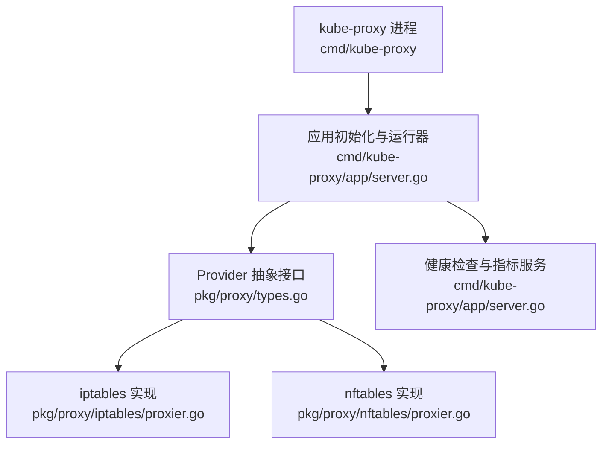
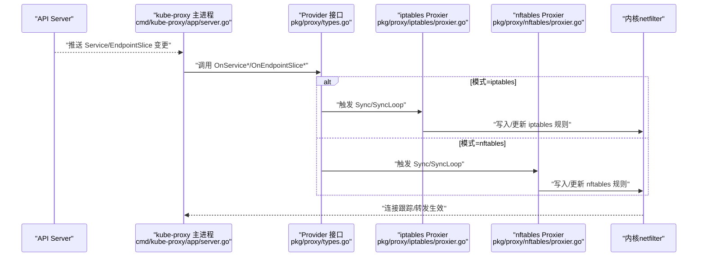
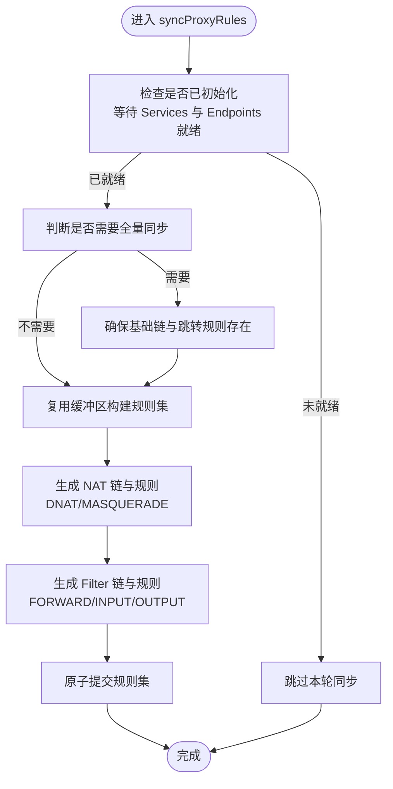
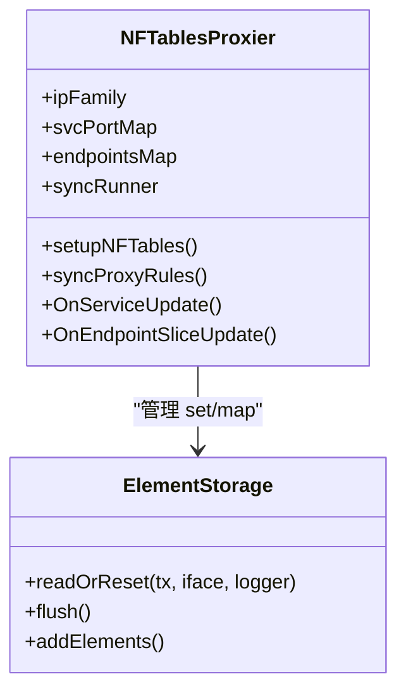
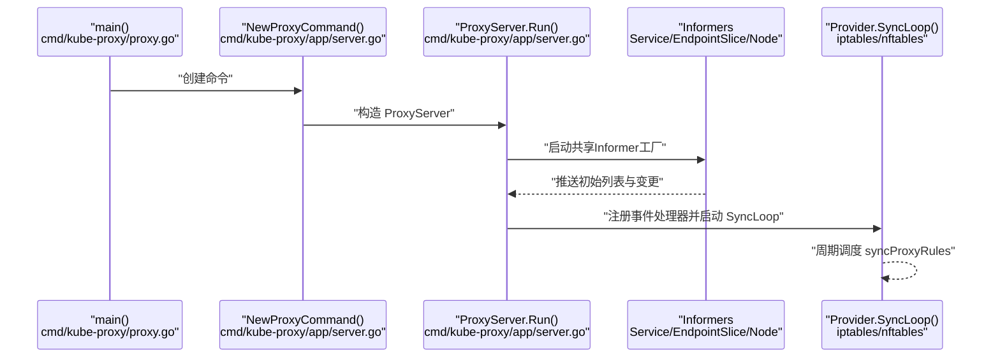
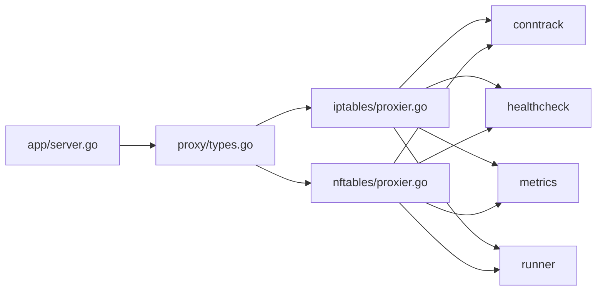

# Linux网络栈组件

<cite>
**本文引用的文件**   
- [cmd/kube-proxy/proxy.go](file://cmd/kube-proxy/proxy.go)
- [cmd/kube-proxy/app/server.go](file://cmd/kube-proxy/app/server.go)
- [pkg/proxy/doc.go](file://pkg/proxy/doc.go)
- [pkg/proxy/types.go](file://pkg/proxy/types.go)
- [pkg/proxy/iptables/proxier.go](file://pkg/proxy/iptables/proxier.go)
- [pkg/proxy/nftables/proxier.go](file://pkg/proxy/nftables/proxier.go)
</cite>

## 目录
1. [简介](#简介)
2. [项目结构](#项目结构)
3. [核心组件](#核心组件)
4. [架构总览](#架构总览)
5. [详细组件分析](#详细组件分析)
6. [依赖关系分析](#依赖关系分析)
7. [性能与调优](#性能与调优)
8. [监控与诊断](#监控与诊断)
9. [故障排查指南](#故障排查指南)
10. [结论](#结论)

## 简介
本技术文档聚焦于Kubernetes在Linux节点上的网络栈关键组件，围绕kube-proxy的两种数据面实现（基于iptables与nftables）展开，解释其在容器网络中的作用、数据包流转路径、配置要点、安全策略（LoadBalancerSourceRanges等）、以及可观测性与调优方法。文档同时给出与内核网络栈相关的关键参数与最佳实践建议，帮助读者理解并优化集群网络行为。

## 项目结构
仓库中与Linux网络栈直接相关的代码主要位于以下位置：
- kube-proxy入口与启动流程：cmd/kube-proxy
- 通用代理接口与类型定义：pkg/proxy
- iptables数据面实现：pkg/proxy/iptables
- nftables数据面实现：pkg/proxy/nftables

图表来源
- [cmd/kube-proxy/proxy.go:1-34](file://cmd/kube-proxy/proxy.go#L1-L34)
- [cmd/kube-proxy/app/server.go:100-160](file://cmd/kube-proxy/app/server.go#L100-L160)
- [pkg/proxy/types.go:27-40](file://pkg/proxy/types.go#L27-L40)
- [pkg/proxy/iptables/proxier.go:126-206](file://pkg/proxy/iptables/proxier.go#L126-L206)
- [pkg/proxy/nftables/proxier.go:132-199](file://pkg/proxy/nftables/proxier.go#L132-L199)

章节来源
- [cmd/kube-proxy/proxy.go:1-34](file://cmd/kube-proxy/proxy.go#L1-L34)
- [cmd/kube-proxy/app/server.go:100-160](file://cmd/kube-proxy/app/server.go#L100-L160)
- [pkg/proxy/doc.go:17-18](file://pkg/proxy/doc.go#L17-L18)
- [pkg/proxy/types.go:27-40](file://pkg/proxy/types.go#L27-L40)

## 核心组件
- Provider接口：统一了不同数据面实现的对外能力，包括对Service、EndpointSlice、Node拓扑、ServiceCIDR等事件的处理，以及同步循环控制。
- iptables Proxier：通过维护iptables规则链与NAT/Filter/Mangle表项，将Service ClusterIP/NodePort/ExternalIP流量转发到后端Pod。
- nftables Proxier：以nftables table/chain/set/map为核心，提供更高性能的规则管理与匹配，支持更细粒度的集合与映射操作。

章节来源
- [pkg/proxy/types.go:27-40](file://pkg/proxy/types.go#L27-L40)
- [pkg/proxy/iptables/proxier.go:126-206](file://pkg/proxy/iptables/proxier.go#L126-L206)
- [pkg/proxy/nftables/proxier.go:132-199](file://pkg/proxy/nftables/proxier.go#L132-L199)

## 架构总览
kube-proxy在每个节点上运行，监听API Server中的Service与EndpointSlice变化，根据当前模式（iptables或nftables）生成并下发相应的内核网络规则，从而实现四层负载均衡与服务发现。

图表来源
- [cmd/kube-proxy/app/server.go:536-659](file://cmd/kube-proxy/app/server.go#L536-L659)
- [pkg/proxy/types.go:27-40](file://pkg/proxy/types.go#L27-L40)
- [pkg/proxy/iptables/proxier.go:412-432](file://pkg/proxy/iptables/proxier.go#L412-L432)
- [pkg/proxy/nftables/proxier.go:693-712](file://pkg/proxy/nftables/proxier.go#L693-L712)

## 详细组件分析

### iptables 数据面
- 角色与职责
  - 维护一组专用链（如KUBE-SERVICES、KUBE-NODEPORTS、KUBE-FORWARD、KUBE-MARK-MASQ等），在PREROUTING/FORWARD/OUTPUT/POSTROUTING钩子处进行匹配与跳转。
  - 负责SNAT/Masquerade标记与执行，处理Localhost NodePort场景的安全加固（route_localnet配合防火墙规则）。
  - 支持大集群模式优化（减少注释、批量写规则、全量/增量同步策略）。
- 关键流程
  - 初始化时计算Masquerade标记值，准备syncRunner与Monitor，确保基础链存在并建立跳转。
  - 收到Service/EndpointSlice变更时，聚合差异，按需全量或增量重建规则集，并通过iptables-restore原子提交。
  - 针对无端点的服务/NodePort，使用计数或丢弃策略；对LB源地址范围进行过滤。
- 典型规则族
  - NAT表：ClusterIP/NodePort/ExternalIP的DNAT与MASQUERADE。
  - Filter表：FORWARD/INPUT/OUTPUT的访问控制与状态匹配。
  - Mangle表：可选的标记与策略扩展。

图表来源
- [pkg/proxy/iptables/proxier.go:625-713](file://pkg/proxy/iptables/proxier.go#L625-L713)
- [pkg/proxy/iptables/proxier.go:719-800](file://pkg/proxy/iptables/proxier.go#L719-L800)

章节来源
- [pkg/proxy/iptables/proxier.go:54-92](file://pkg/proxy/iptables/proxier.go#L54-L92)
- [pkg/proxy/iptables/proxier.go:126-206](file://pkg/proxy/iptables/proxier.go#L126-L206)
- [pkg/proxy/iptables/proxier.go:209-311](file://pkg/proxy/iptables/proxier.go#L209-L311)
- [pkg/proxy/iptables/proxier.go:412-432](file://pkg/proxy/iptables/proxier.go#L412-L432)
- [pkg/proxy/iptables/proxier.go:625-713](file://pkg/proxy/iptables/proxier.go#L625-L713)
- [pkg/proxy/iptables/proxier.go:719-800](file://pkg/proxy/iptables/proxier.go#L719-L800)

### nftables 数据面
- 角色与职责
  - 在单一table下组织base chain与regular chain，利用set/map/vmap提升匹配效率，减少规则数量与切换开销。
  - 支持pre-DNAT阶段的过滤（如LB源地址范围），以及post-DNAT的masquerade与hairpin回环。
  - 管理“无端点”服务的拒绝/丢弃策略，动态维护活跃ClusterIP集合。
- 关键流程
  - 初始化时获取nftables接口，计算Masquerade标记，创建基础链与跳转规则，准备元素存储（set/map）。
  - 同步时按事务方式批量添加/删除/刷新链与元素，保证一致性。
  - 根据nodePortAddresses动态维护nodeport-ips集合，限制NodePort监听范围。
- 典型数据结构
  - set：cluster-ips、nodeport-ips、hairpin-connections
  - map/vmap：service-ips、service-nodeports、firewall-ips、no-endpoint-services、no-endpoint-nodeports

图表来源
- [pkg/proxy/nftables/proxier.go:132-199](file://pkg/proxy/nftables/proxier.go#L132-L199)
- [pkg/proxy/nftables/proxier.go:404-691](file://pkg/proxy/nftables/proxier.go#L404-L691)

章节来源
- [pkg/proxy/nftables/proxier.go:56-99](file://pkg/proxy/nftables/proxier.go#L56-L99)
- [pkg/proxy/nftables/proxier.go:202-273](file://pkg/proxy/nftables/proxier.go#L202-L273)
- [pkg/proxy/nftables/proxier.go:338-381](file://pkg/proxy/nftables/proxier.go#L338-L381)
- [pkg/proxy/nftables/proxier.go:404-691](file://pkg/proxy/nftables/proxier.go#L404-L691)
- [pkg/proxy/nftables/proxier.go:693-712](file://pkg/proxy/nftables/proxier.go#L693-L712)

### 启动与生命周期
- 入口与命令：main函数创建cobra命令并运行。
- 服务器初始化：解析配置、创建客户端、检测节点IP族、注册健康检查与指标服务、启动informers监听Service/EndpointSlice/Node等对象。
- 选择数据面：根据配置创建iptables或nftables Proxier实例，并在双栈模式下包装为MetaProxier。
- 同步循环：启动SyncLoop，周期性调度规则同步，保障内核规则与API状态一致。

图表来源
- [cmd/kube-proxy/proxy.go:29-33](file://cmd/kube-proxy/proxy.go#L29-L33)
- [cmd/kube-proxy/app/server.go:100-160](file://cmd/kube-proxy/app/server.go#L100-L160)
- [cmd/kube-proxy/app/server.go:536-659](file://cmd/kube-proxy/app/server.go#L536-L659)
- [pkg/proxy/iptables/proxier.go:421-432](file://pkg/proxy/iptables/proxier.go#L421-L432)
- [pkg/proxy/nftables/proxier.go:702-712](file://pkg/proxy/nftables/proxier.go#L702-L712)

章节来源
- [cmd/kube-proxy/proxy.go:29-33](file://cmd/kube-proxy/proxy.go#L29-L33)
- [cmd/kube-proxy/app/server.go:100-160](file://cmd/kube-proxy/app/server.go#L100-L160)
- [cmd/kube-proxy/app/server.go:536-659](file://cmd/kube-proxy/app/server.go#L536-L659)

## 依赖关系分析
- 组件耦合
  - app层依赖Provider抽象，屏蔽iptables/nftables差异。
  - iptables/nftables Proxier分别依赖conntrack、healthcheck、metrics、runner等子系统。
- 外部依赖
  - 内核netfilter（iptables/nftables）
  - conntrack（连接跟踪）
  - sysctl（系统参数）
- 潜在风险
  - 规则规模增长导致同步延迟（iptables在大集群需优化）
  - 内核版本特性差异影响nftables行为（如reject在旧内核的限制）

图表来源
- [cmd/kube-proxy/app/server.go:536-659](file://cmd/kube-proxy/app/server.go#L536-L659)
- [pkg/proxy/types.go:27-40](file://pkg/proxy/types.go#L27-L40)
- [pkg/proxy/iptables/proxier.go:126-206](file://pkg/proxy/iptables/proxier.go#L126-L206)
- [pkg/proxy/nftables/proxier.go:132-199](file://pkg/proxy/nftables/proxier.go#L132-L199)

章节来源
- [pkg/proxy/types.go:27-40](file://pkg/proxy/types.go#L27-L40)
- [pkg/proxy/iptables/proxier.go:126-206](file://pkg/proxy/iptables/proxier.go#L126-L206)
- [pkg/proxy/nftables/proxier.go:132-199](file://pkg/proxy/nftables/proxier.go#L132-L199)

## 性能与调优
- 同步频率与全量策略
  - iptables/nftables均使用BoundedFrequencyRunner控制最小/最大同步间隔，避免频繁写内核规则。
  - 大集群模式下减少注释与全量同步次数，降低恢复失败后的重试成本。
- Masquerade与标记位
  - 合理设置MasqueradeBit，避免冲突；开启MasqueradeAll需谨慎评估SNAT开销。
- Localhost NodePort与安全
  - iptables在启用localhost NodePort时需配合route_localnet与防火墙规则，防止本地网段绕过安全策略。
- nftables集合与映射
  - 使用set/map/vmap集中管理IP与端口映射，提高匹配效率，减少规则数量。
- 连接跟踪
  - nf_conntrack_tcp_be_liberal可放宽无效报文判定，但可能影响安全性；需权衡业务稳定性与防护强度。

章节来源
- [pkg/proxy/iptables/proxier.go:209-311](file://pkg/proxy/iptables/proxier.go#L209-L311)
- [pkg/proxy/iptables/proxier.go:625-713](file://pkg/proxy/iptables/proxier.go#L625-L713)
- [pkg/proxy/nftables/proxier.go:202-273](file://pkg/proxy/nftables/proxier.go#L202-L273)
- [pkg/proxy/nftables/proxier.go:404-691](file://pkg/proxy/nftables/proxier.go#L404-L691)

## 监控与诊断
- 健康检查
  - 暴露健康检查服务，周期性上报同步状态，便于编排系统探测。
- 指标采集
  - 提供Prometheus指标，包含同步延迟、失败计数、队列时间戳等，用于定位性能瓶颈。
- 调试信息
  - 日志级别可调，记录规则同步过程、错误与警告；支持zpages/statusz等调试页面（视功能开关）。

章节来源
- [cmd/kube-proxy/app/server.go:446-532](file://cmd/kube-proxy/app/server.go#L446-L532)
- [pkg/proxy/iptables/proxier.go:412-432](file://pkg/proxy/iptables/proxier.go#L412-L432)
- [pkg/proxy/nftables/proxier.go:693-712](file://pkg/proxy/nftables/proxier.go#L693-L712)

## 故障排查指南
- 常见症状
  - 服务不可达：检查Service/EndpointSlice是否正确，确认Proxier已初始化并完成首次同步。
  - NodePort异常：验证nodePortAddresses配置与网卡绑定，确认无端点时的拒绝/丢弃策略。
  - LB源地址范围不生效：确认pre-DNAT阶段规则与集合映射是否正确。
- 定位步骤
  - 查看健康检查与指标，确认同步成功与延迟。
  - 核对iptables/nftables规则链与集合内容，确认跳转与匹配逻辑。
  - 关注内核参数（如route_localnet、nf_conntrack相关）是否符合预期。

章节来源
- [cmd/kube-proxy/app/server.go:536-659](file://cmd/kube-proxy/app/server.go#L536-L659)
- [pkg/proxy/iptables/proxier.go:719-800](file://pkg/proxy/iptables/proxier.go#L719-L800)
- [pkg/proxy/nftables/proxier.go:515-547](file://pkg/proxy/nftables/proxier.go#L515-L547)

## 结论
kube-proxy通过统一的Provider抽象，将Service与EndpointSlice的变化高效转化为内核网络规则，iptables与nftables两种数据面在不同规模与场景下各有优势。结合合理的同步策略、集合化匹配、连接跟踪与系统参数调优，可在保证安全性的前提下获得稳定且高性能的网络转发能力。建议在大规模集群中优先评估nftables的数据面，并结合监控与诊断工具持续优化。