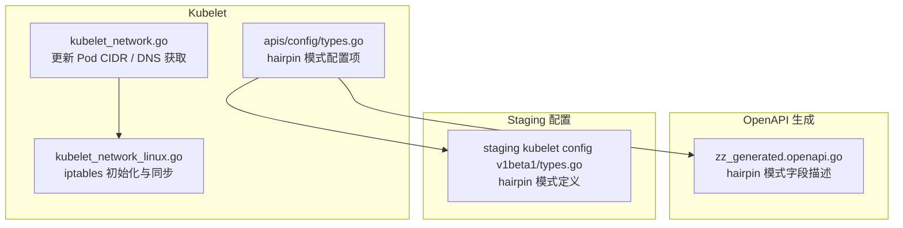
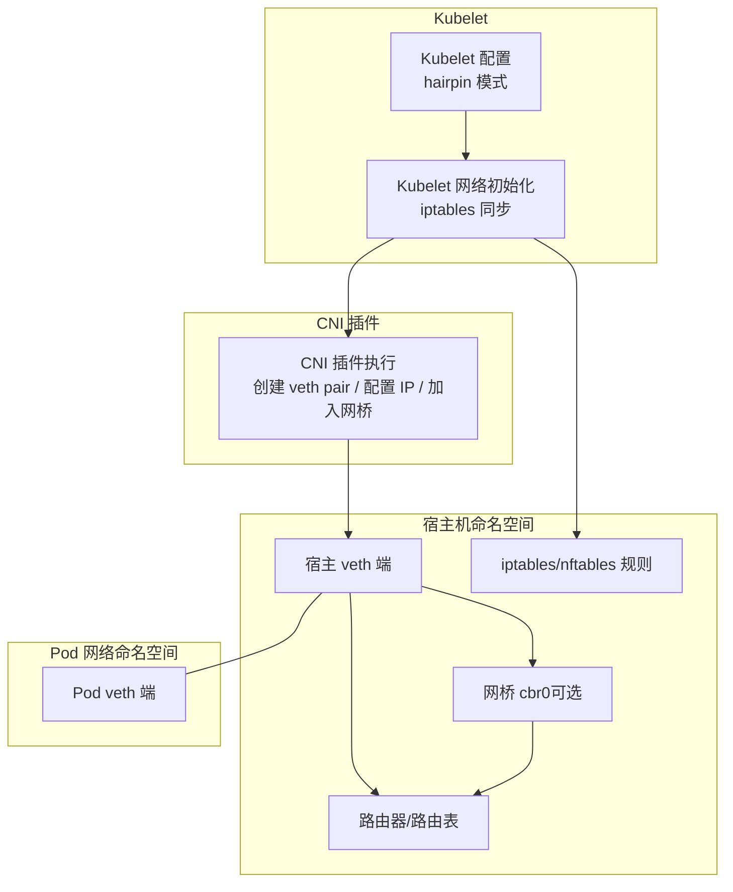
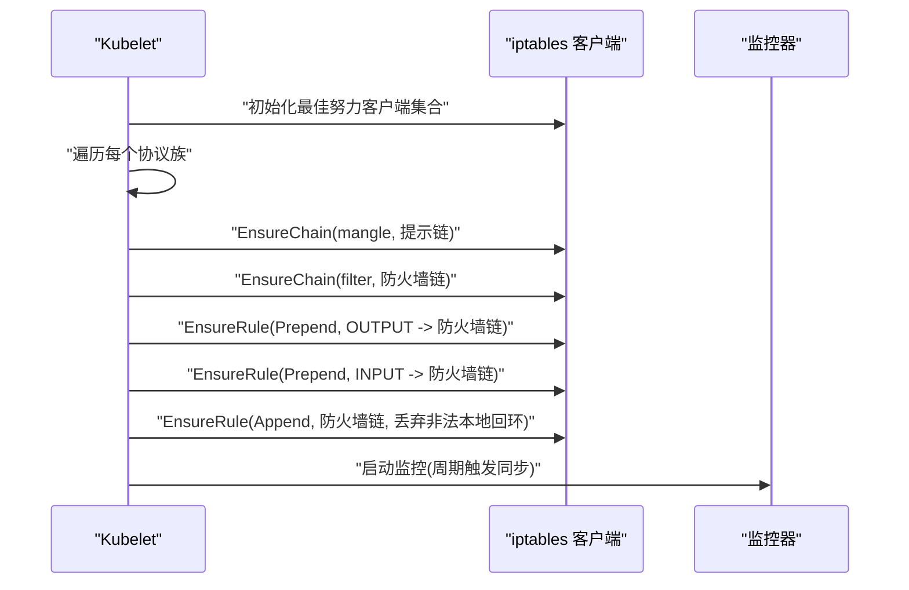
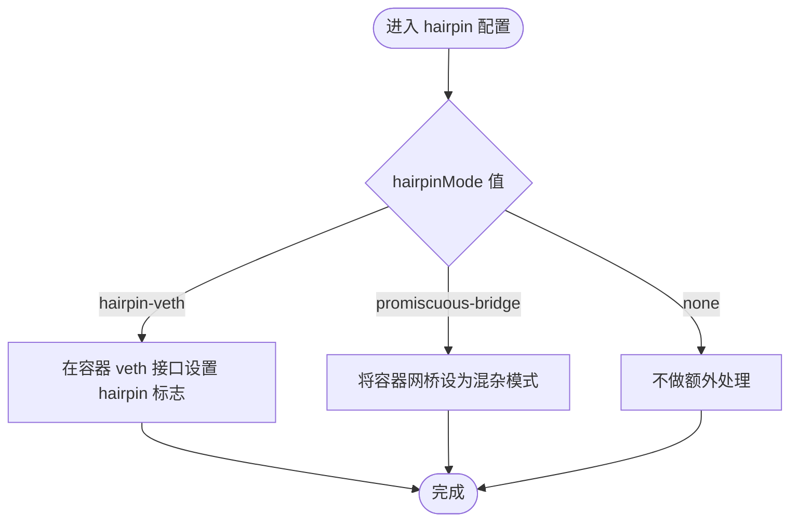
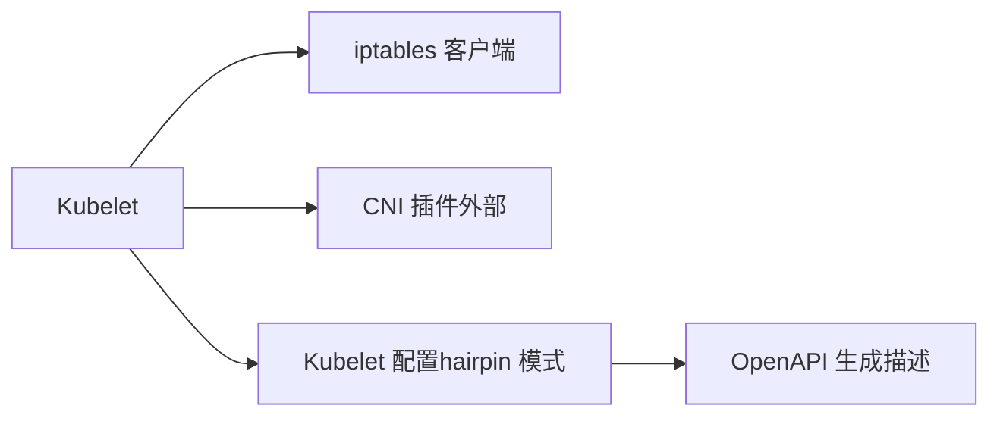

# veth pair机制

<cite>
**本文引用的文件**   
- [kubelet_network.go](file://pkg/kubelet/kubelet_network.go)
- [kubelet_network_linux.go](file://pkg/kubelet/kubelet_network_linux.go)
- [types.go（kubelet 配置）](file://pkg/kubelet/apis/config/types.go)
- [zz_generated.openapi.go（OpenAPI 生成）](file://pkg/generated/openapi/zz_generated.openapi.go)
- [staging kubelet 配置 types.go](file://staging/src/k8s.io/kubelet/config/v1beta1/types.go)
</cite>

## 目录
1. [简介](#简介)
2. [项目结构](#项目结构)
3. [核心组件](#核心组件)
4. [架构总览](#架构总览)
5. [详细组件分析](#详细组件分析)
6. [依赖关系分析](#依赖关系分析)
7. [性能考量](#性能考量)
8. [故障排查指南](#故障排查指南)
9. [结论](#结论)
10. [附录](#附录)

## 简介
本技术文档聚焦于 Kubernetes 节点侧与 veth pair 相关的实现与集成，重点说明：
- veth pair 的工作原理及其在容器网络中的角色
- veth pair 如何连接不同网络命名空间并实现容器间通信
- 在 Kubelet 中涉及 veth pair 的配置项与行为（如 hairpin 模式）
- CNI 插件模式下 veth pair 的创建、配置与管理流程
- 与网桥、路由器的集成方式
- 性能特点与常见问题的排查方法

Kubernetes 本身不直接操作 veth pair，而是通过 CRI/CNI 接口委托给运行时与网络插件完成。Kubelet 负责协调生命周期、下发配置（例如 hairpin 模式），并在 Linux 上维护必要的 iptables 规则以增强安全性与兼容性。

## 项目结构
与 veth pair 相关的关键代码位于 Kubelet 模块与 OpenAPI 生成产物中：
- Kubelet 网络初始化与 iptables 同步逻辑
- Kubelet 配置项中对 hairpin 模式的声明
- OpenAPI 生成的字段描述对 hairpin 模式的行为说明

图表来源
- [kubelet_network.go:28-51](file://pkg/kubelet/kubelet_network.go#L28-L51)
- [kubelet_network_linux.go:38-64](file://pkg/kubelet/kubelet_network_linux.go#L38-L64)
- [types.go（kubelet 配置）:297](file://pkg/kubelet/apis/config/types.go#L297)
- [zz_generated.openapi.go:72489](file://pkg/generated/openapi/zz_generated.openapi.go#L72489)
- [staging kubelet 配置 types.go:492](file://staging/src/k8s.io/kubelet/config/v1beta1/types.go#L492)

章节来源
- [kubelet_network.go:28-51](file://pkg/kubelet/kubelet_network.go#L28-L51)
- [kubelet_network_linux.go:38-64](file://pkg/kubelet/kubelet_network_linux.go#L38-L64)
- [types.go（kubelet 配置）:297](file://pkg/kubelet/apis/config/types.go#L297)
- [zz_generated.openapi.go:72489](file://pkg/generated/openapi/zz_generated.openapi.go#L72489)
- [staging kubelet 配置 types.go:492](file://staging/src/k8s.io/kubelet/config/v1beta1/types.go#L492)

## 核心组件
- Kubelet 网络初始化与 iptables 同步：确保主机侧防火墙链存在，并对 IPv4 场景安装本地回环访问保护规则，避免 NodePort 使用 route_localnet 带来的安全隐患。
- Kubelet 配置项 hairpin 模式：控制容器桥接或 veth 端口的 hairpin 行为，影响 Service 到自身 Endpoint 的回环流量转发策略。
- OpenAPI 生成描述：明确 hairpin 模式取值与含义，便于工具链与文档生成。

章节来源
- [kubelet_network_linux.go:38-64](file://pkg/kubelet/kubelet_network_linux.go#L38-L64)
- [kubelet_network_linux.go:66-118](file://pkg/kubelet/kubelet_network_linux.go#L66-L118)
- [types.go（kubelet 配置）:297](file://pkg/kubelet/apis/config/types.go#L297)
- [zz_generated.openapi.go:72489](file://pkg/generated/openapi/zz_generated.openapi.go#L72489)

## 架构总览
Kubernetes 节点侧的网络栈由 Kubelet、CRI、CNI 插件与内核网络子系统协作完成。veth pair 通常由 CNI 插件创建，一端置于宿主命名空间，另一端放入 Pod 网络命名空间；随后根据所选模式将宿主端接入网桥或路由器，以实现跨 Pod 通信。

图表来源
- [kubelet_network_linux.go:38-64](file://pkg/kubelet/kubelet_network_linux.go#L38-L64)
- [kubelet_network_linux.go:66-118](file://pkg/kubelet/kubelet_network_linux.go#L66-L118)
- [types.go（kubelet 配置）:297](file://pkg/kubelet/apis/config/types.go#L297)
- [zz_generated.openapi.go:72489](file://pkg/generated/openapi/zz_generated.openapi.go#L72489)

## 详细组件分析

### Kubelet 网络初始化与 iptables 同步
- 功能要点
  - 检测系统是否支持 iptables，若不支持则跳过创建提示链。
  - 为 mangle 表创建提示链，用于标识当前使用的 iptables 后端。
  - 在 filter 表创建专用链，并将 INPUT/OUTPUT 跳转至该链，用于防护非法本地回环访问。
  - 周期性监控关键表变化，必要时重新同步规则。
- 与 veth pair 的关系
  - 虽然不直接创建 veth pair，但 iptables 规则会影响经由 veth pair 进出的数据包处理，尤其是本地回环访问与 NAT 场景。
- 关键路径参考
  - 初始化入口与监控循环
  - 规则同步与链/规则保证

章节来源
- [kubelet_network_linux.go:38-64](file://pkg/kubelet/kubelet_network_linux.go#L38-L64)
- [kubelet_network_linux.go:66-118](file://pkg/kubelet/kubelet_network_linux.go#L66-L118)

#### 序列图：iptables 规则同步流程

图表来源
- [kubelet_network_linux.go:38-64](file://pkg/kubelet/kubelet_network_linux.go#L38-L64)
- [kubelet_network_linux.go:66-118](file://pkg/kubelet/kubelet_network_linux.go#L66-L118)

### hairpin 模式配置与行为
- 配置项
  - hairpinMode 支持多种模式，包括“promiscuous-bridge”、“hairpin-veth”、“none”。
  - “hairpin-veth”会在容器 veth 接口上设置 hairpin 标志，常用于实现 Service 到自身 Endpoint 的回环负载均衡。
- 行为说明
  - 当启用 hairpin-veth 时，宿主侧 veth 端口允许将发往自身的数据包再打回同一 veth 端口，从而满足某些负载均衡场景。
  - 若选择 promiscuous-bridge，则要求存在特定名称的容器网桥（如 cbr0）。
- 关键路径参考
  - Kubelet 配置类型定义
  - OpenAPI 生成字段描述

章节来源
- [types.go（kubelet 配置）:297](file://pkg/kubelet/apis/config/types.go#L297)
- [zz_generated.openapi.go:72489](file://pkg/generated/openapi/zz_generated.openapi.go#L72489)
- [staging kubelet 配置 types.go:492](file://staging/src/k8s.io/kubelet/config/v1beta1/types.go#L492)

#### 流程图：hairpin 模式决策

图表来源
- [types.go（kubelet 配置）:297](file://pkg/kubelet/apis/config/types.go#L297)
- [zz_generated.openapi.go:72489](file://pkg/generated/openapi/zz_generated.openapi.go#L72489)

### Pod CIDR 更新与 DNS 获取
- Pod CIDR 更新
  - Kubelet 会对比当前 runtimeState 中的 Pod CIDR 与新值，若不一致则调用运行时接口进行更新，并记录日志。
- DNS 配置
  - 提供 GetPodDNS 接口，返回 Pod 的 DNS 配置，供上层组件使用。
- 与 veth pair 的关系
  - Pod CIDR 变更可能触发网络插件重新规划地址分配与路由，间接影响 veth pair 所在子网的连通性。

章节来源
- [kubelet_network.go:28-51](file://pkg/kubelet/kubelet_network.go#L28-L51)
- [kubelet_network.go:53-59](file://pkg/kubelet/kubelet_network.go#L53-L59)

## 依赖关系分析
- Kubelet 网络初始化依赖 iptables 客户端抽象，支持多协议族与监控回调。
- hairpin 模式配置项通过 Kubelet 配置类型暴露，并由 OpenAPI 生成产物提供字段语义。
- CNI 插件作为外部可执行程序，遵循 CNI 规范，由 Kubelet 在 Pod 生命周期内调用，负责实际创建 veth pair、配置 IP、加入网桥等。

图表来源
- [kubelet_network_linux.go:38-64](file://pkg/kubelet/kubelet_network_linux.go#L38-L64)
- [types.go（kubelet 配置）:297](file://pkg/kubelet/apis/config/types.go#L297)
- [zz_generated.openapi.go:72489](file://pkg/generated/openapi/zz_generated.openapi.go#L72489)

章节来源
- [kubelet_network_linux.go:38-64](file://pkg/kubelet/kubelet_network_linux.go#L38-L64)
- [types.go（kubelet 配置）:297](file://pkg/kubelet/apis/config/types.go#L297)
- [zz_generated.openapi.go:72489](file://pkg/generated/openapi/zz_generated.openapi.go#L72489)

## 性能考量
- iptables 规则同步开销
  - 周期性监控与规则重建在高并发场景下可能带来 CPU 与延迟开销，应结合集群规模与规则数量评估。
- hairpin 模式选择
  - “hairpin-veth”通过内核标志减少额外转发路径，适合需要 Service 回环的场景；“promiscuous-bridge”依赖网桥混杂模式，可能引入额外广播风暴风险。
- CNI 插件实现差异
  - 不同 CNI 插件对 veth pair 的处理（如 MTU、队列、TC 限速）会影响吞吐与时延，需结合实际插件特性调优。

[本节为通用指导，不涉及具体文件分析]

## 故障排查指南
- iptables 规则未生效
  - 检查 Kubelet 是否检测到 iptables 支持，确认提示链与防火墙链是否存在。
  - 查看监控器是否正常运行，必要时手动触发规则同步。
- hairpin 问题导致 Service 无法访问自身 Endpoint
  - 确认 hairpinMode 设置为“hairpin-veth”，并确保容器 veth 接口已设置 hairpin 标志。
  - 若使用“promiscuous-bridge”，验证网桥名称与状态是否符合预期。
- Pod 网络不通
  - 核对 Pod CIDR 是否成功更新，确认 CNI 插件已正确配置路由与 veth pair。
  - 检查宿主侧与 Pod 侧 veth 端口的 UP 状态与 IP 配置。

章节来源
- [kubelet_network_linux.go:38-64](file://pkg/kubelet/kubelet_network_linux.go#L38-L64)
- [kubelet_network_linux.go:66-118](file://pkg/kubelet/kubelet_network_linux.go#L66-L118)
- [kubelet_network.go:28-51](file://pkg/kubelet/kubelet_network.go#L28-L51)
- [types.go（kubelet 配置）:297](file://pkg/kubelet/apis/config/types.go#L297)
- [zz_generated.openapi.go:72489](file://pkg/generated/openapi/zz_generated.openapi.go#L72489)

## 结论
Kubernetes 通过 Kubelet 与 CNI 插件协同工作，利用 veth pair 将容器网络命名空间与宿主网络命名空间连接起来。Kubelet 负责配置 hairpin 模式与 iptables 安全规则，而实际的 veth pair 创建、IP 分配与网桥/路由集成由 CNI 插件完成。理解这些组件的职责边界与交互流程，有助于在复杂网络场景中做出正确的配置与排障决策。

[本节为总结性内容，不涉及具体文件分析]

## 附录
- 术语
  - veth pair：一对虚拟以太网设备，数据从一端写入会从另一端读出，常用于跨命名空间通信。
  - hairpin：允许数据包从网卡发出后再次回到同一网卡，用于实现本地回环转发。
  - CNI：容器网络接口，标准化了容器网络配置的调用约定。
- 建议实践
  - 在生产环境优先选择“hairpin-veth”模式，避免网桥混杂模式带来的潜在风险。
  - 定期审计 iptables 规则，确保与 kube-proxy 的规则兼容且无冲突。
  - 针对高吞吐场景，结合 CNI 插件能力进行 TC/队列优化与 MTU 调整。

[本节为概念性内容，不涉及具体文件分析]