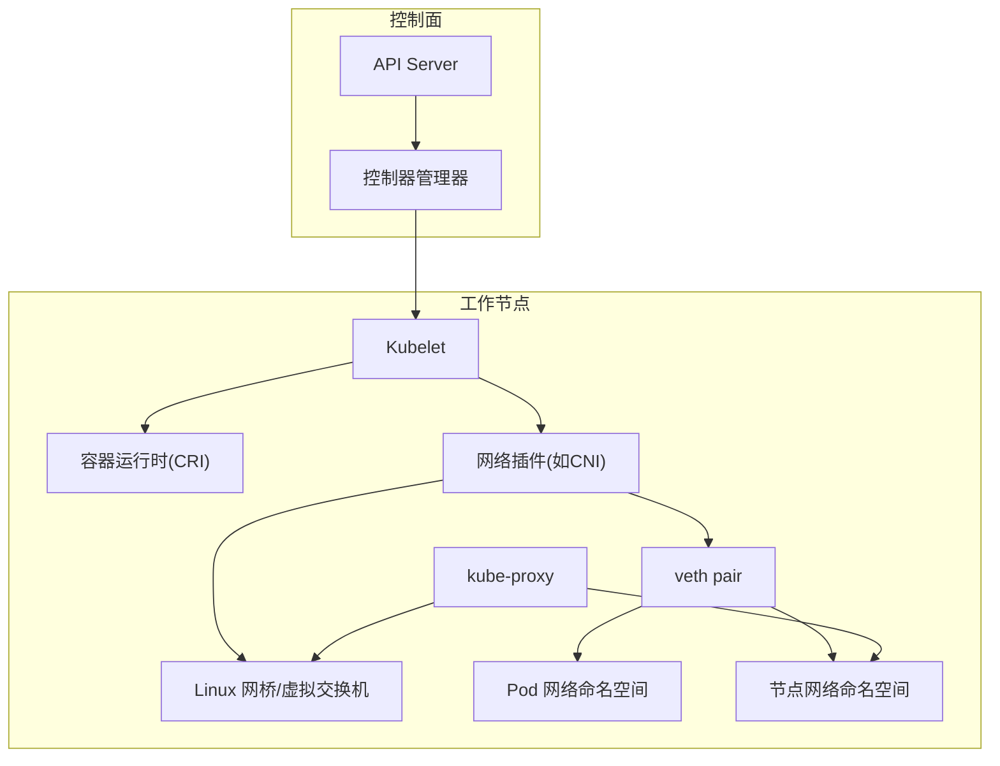
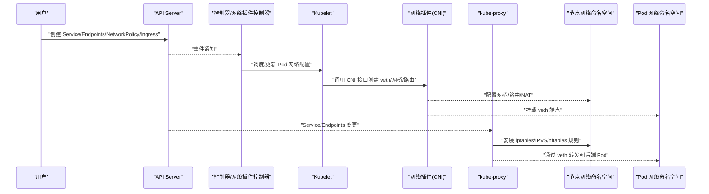
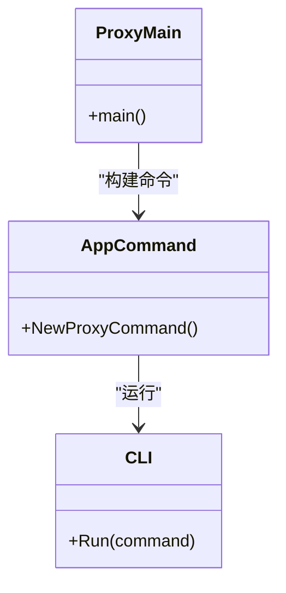
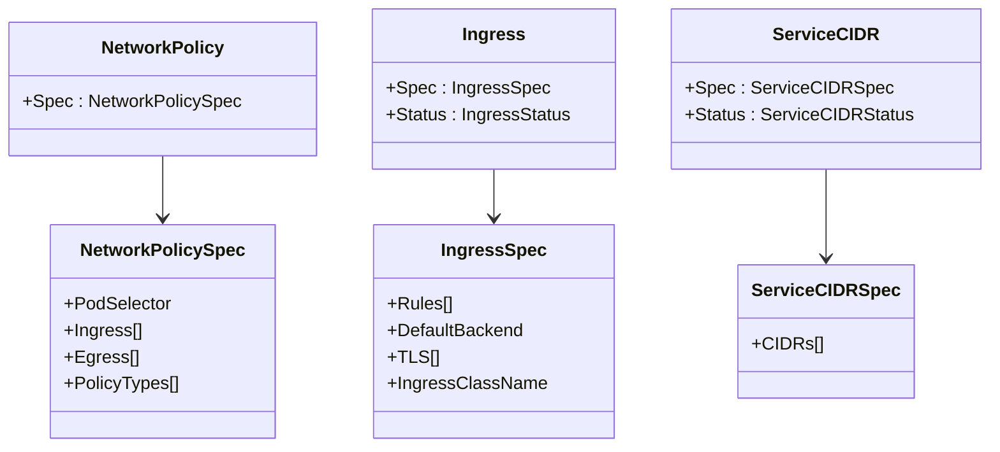
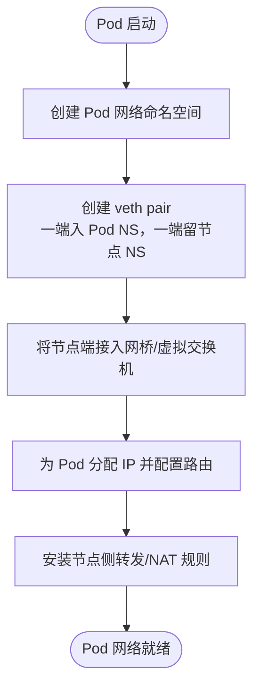
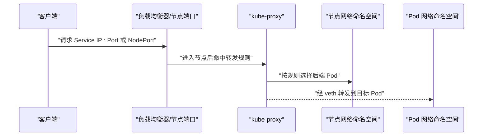
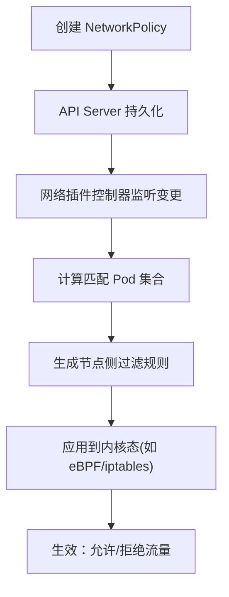
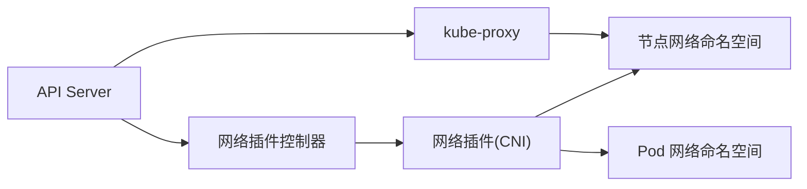

# 容器网络设置

<cite>
**本文引用的文件**   
- [proxy.go](file://cmd/kube-proxy/proxy.go)
- [doc.go](file://pkg/proxy/doc.go)
- [types.go](file://pkg/apis/networking/types.go)
</cite>

## 目录
1. [简介](#简介)
2. [项目结构](#项目结构)
3. [核心组件](#核心组件)
4. [架构总览](#架构总览)
5. [详细组件分析](#详细组件分析)
6. [依赖关系分析](#依赖关系分析)
7. [性能考虑](#性能考虑)
8. [故障诊断指南](#故障诊断指南)
9. [结论](#结论)
10. [附录](#附录)

## 简介
本技术文档面向在 Kubernetes 集群中设计与实现容器网络的工程师与运维人员，系统阐述以下主题：
- 容器网络命名空间的概念与隔离机制
- veth pair 的工作原理及其在容器网络中的应用
- Linux 网络栈关键组件（网桥、虚拟交换机、网络命名空间）
- 典型网络拓扑的实现方案（扁平网络 flat network、覆盖网络 overlay network、底层网络 underlay network）
- 端口映射与服务暴露的网络设置流程
- DNS 服务发现与负载均衡的网络实现
- 网络策略与安全组在网络层的实现方式
- 容器网络性能监控与故障诊断方法
- 网络插件的热插拔与动态配置更新机制

为便于读者理解，文档将结合仓库中与网络相关的代码入口与 API 定义进行说明，并通过图示展示组件交互与数据流。

## 项目结构
围绕容器网络相关能力，仓库中与网络密切相关的部分包括：
- kube-proxy 进程入口与包描述，负责集群内 Service 的 L3/L4 转发规则下发
- networking API 类型定义，包含 NetworkPolicy、Ingress、ServiceCIDR 等网络对象模型

[此图为概念性结构图，不直接映射具体源码文件]

## 核心组件
- kube-proxy：作为集群内 Service 的 L3/L4 代理，监听 Service/Endpoints 变化并在工作节点上安装转发规则（iptables/IPVS/nftables），实现服务发现与负载均衡。
- networking API：提供 NetworkPolicy、Ingress、ServiceCIDR 等网络资源类型，用于声明式地表达网络访问控制、外部流量入口与 Service IP 分配范围。

章节来源
- [proxy.go:1-34](file://cmd/kube-proxy/proxy.go#L1-L34)
- [doc.go:17-19](file://pkg/proxy/doc.go#L17-L19)
- [types.go:27-93](file://pkg/apis/networking/types.go#L27-L93)
- [types.go:217-287](file://pkg/apis/networking/types.go#L217-L287)
- [types.go:651-681](file://pkg/apis/networking/types.go#L651-L681)

## 架构总览
下图展示了从用户创建 Service/NetworkPolicy/Ingress 到工作节点网络转发生效的整体流程，以及各组件之间的职责边界。

[此图为概念性流程图，不直接映射具体源码文件]

## 详细组件分析

### kube-proxy 组件分析
kube-proxy 是集群内 Service 网络能力的核心执行者，负责将 Service 的抽象映射为工作节点上的内核态转发规则，从而实现跨 Pod 的服务访问与负载均衡。

图表来源
- [proxy.go:29-33](file://cmd/kube-proxy/proxy.go#L29-L33)

章节来源
- [proxy.go:1-34](file://cmd/kube-proxy/proxy.go#L1-L34)
- [doc.go:17-19](file://pkg/proxy/doc.go#L17-L19)

### networking API 类型分析
networking API 定义了网络策略、外部入口与 Service IP 管理的关键数据结构，供控制器与网络插件消费以实现相应的网络行为。

图表来源
- [types.go:27-93](file://pkg/apis/networking/types.go#L27-L93)
- [types.go:217-287](file://pkg/apis/networking/types.go#L217-L287)
- [types.go:651-681](file://pkg/apis/networking/types.go#L651-L681)

章节来源
- [types.go:27-93](file://pkg/apis/networking/types.go#L27-L93)
- [types.go:217-287](file://pkg/apis/networking/types.go#L217-L287)
- [types.go:651-681](file://pkg/apis/networking/types.go#L651-L681)

### 网络命名空间与 veth pair 工作机制
- 网络命名空间：每个 Pod 拥有独立的网络栈（网卡、路由表、防火墙规则等），实现网络隔离。
- veth pair：成对的虚拟以太网设备，一端置于 Pod 命名空间，另一端置于节点命名空间或网桥，充当“管道”连接两者。
- 网桥/虚拟交换机：工作在数据链路层，根据 MAC 地址在多个 veth 端口间转发帧，常用于同一节点内的 Pod 互通。
- 路由与 NAT：节点命名空间中的路由表与 NAT 规则确保跨节点通信与出站访问。

[此图为概念性流程图，不直接映射具体源码文件]

### 不同网络拓扑的实现方案
- 扁平网络（flat network）：所有 Pod 处于同一二层域，跨节点通过路由或隧道互联；简单但扩展性受限。
- 覆盖网络（overlay network）：使用 VXLAN/GRE 等封装技术在物理网络上建立逻辑二层/三层网络，支持大规模跨主机通信。
- 底层网络（underlay network）：利用数据中心现有路由/交换基础设施（BGP/ECMP）承载 Pod 流量，避免额外封装开销。

[本节为概念性内容，不直接分析具体源码文件]

### 端口映射与服务暴露的网络设置过程
- ClusterIP Service：由 kube-proxy 在节点上安装 L3/L4 转发规则，将 Service IP:Port 映射到后端 Pod 列表。
- NodePort Service：在节点 IP 上开放指定端口，由 kube-proxy 转发至对应 Service。
- LoadBalancer Service：借助云厂商或外部负载均衡器，将外部流量引入节点端口或服务 IP。

[此图为概念性流程图，不直接映射具体源码文件]

### DNS 服务发现与负载均衡的网络实现
- DNS 服务发现：CoreDNS 或其他 DNS 服务以 Service 形式暴露，Pod 通过 /etc/resolv.conf 指向集群 DNS，解析 Service 名称到 ClusterIP。
- 负载均衡：kube-proxy 基于 iptables/IPVS/nftables 对 Service 的后端 Pod 进行轮询或加权分发，实现 L4 负载均衡。

[本节为概念性内容，不直接分析具体源码文件]

### 网络策略与安全组在网络层的实现方式
- NetworkPolicy：通过 Pod 标签选择器与入站/出站规则限制 Pod 间通信，由网络插件在节点侧转换为内核态过滤规则。
- 安全组：云平台提供的实例级访问控制，通常作用于节点或弹性网卡层面，与 NetworkPolicy 形成多层防护。

[此图为概念性流程图，不直接映射具体源码文件]

章节来源
- [types.go:27-93](file://pkg/apis/networking/types.go#L27-L93)

### 网络插件的热插拔与动态配置更新机制
- 热插拔：通过 CNI 接口在 Pod 生命周期内动态添加/删除网络接口，支持多网卡场景。
- 动态更新：网络插件控制器监听 CRD/ConfigMap 等配置源，实时调整节点转发规则与路由表，无需重启 kube-proxy 或节点。

[本节为概念性内容，不直接分析具体源码文件]

## 依赖关系分析
kube-proxy 作为独立进程，依赖 API Server 的事件流与工作节点的内核转发子系统；networking API 被控制器与网络插件共同消费，驱动实际网络行为。

[此图为概念性依赖图，不直接映射具体源码文件]

## 性能考虑
- 转发路径优化：优先使用 IPVS 或 nftables 以提升大规模 Service 场景下的规则匹配性能。
- 连接跟踪调优：合理设置 conntrack 表大小与超时参数，避免在高并发下丢包。
- 内存与 CPU：关注 kube-proxy 与网络插件的资源占用，必要时水平扩展或使用 eBPF 加速。
- 带宽与队列：调整网卡队列数与中断亲和，减少上下文切换与锁竞争。

[本节为通用性能建议，不直接分析具体源码文件]

## 故障诊断指南
- 连通性检查：在 Pod 内 ping/traceroute/curl 验证端到端连通性与路由路径。
- 规则核查：查看节点侧 iptables/IPVS/nftables 规则是否按预期安装。
- 日志采集：收集 kube-proxy、网络插件与内核 dmesg 日志定位异常。
- 指标观测：通过 Prometheus 抓取 kube-proxy 与节点网络指标，观察延迟、丢包与错误计数。

[本节为通用排障建议，不直接分析具体源码文件]

## 结论
Kubernetes 容器网络以命名空间隔离为基础，通过 veth pair 与网桥/虚拟交换机构建节点内通信，再借助路由与 NAT 实现跨节点互联。kube-proxy 与 networking API 分别承担转发规则下发与网络策略声明的职责。选择合适的网络拓扑与插件，并结合性能调优与完善的监控诊断体系，可构建稳定高效的容器网络。

## 附录
- 术语速查
  - 网络命名空间：Linux 内核提供的网络栈隔离机制
  - veth pair：成对的虚拟以太网设备，用于在不同命名空间之间传输数据包
  - 网桥：二层转发设备，依据 MAC 地址转发帧
  - Overlay/Underlay：覆盖网络与底层网络两种跨主机互联思路
  - NetworkPolicy：声明式网络访问控制策略
  - Service/Ingress：服务抽象与外部入口资源

[本节为概念性附录，不直接分析具体源码文件]