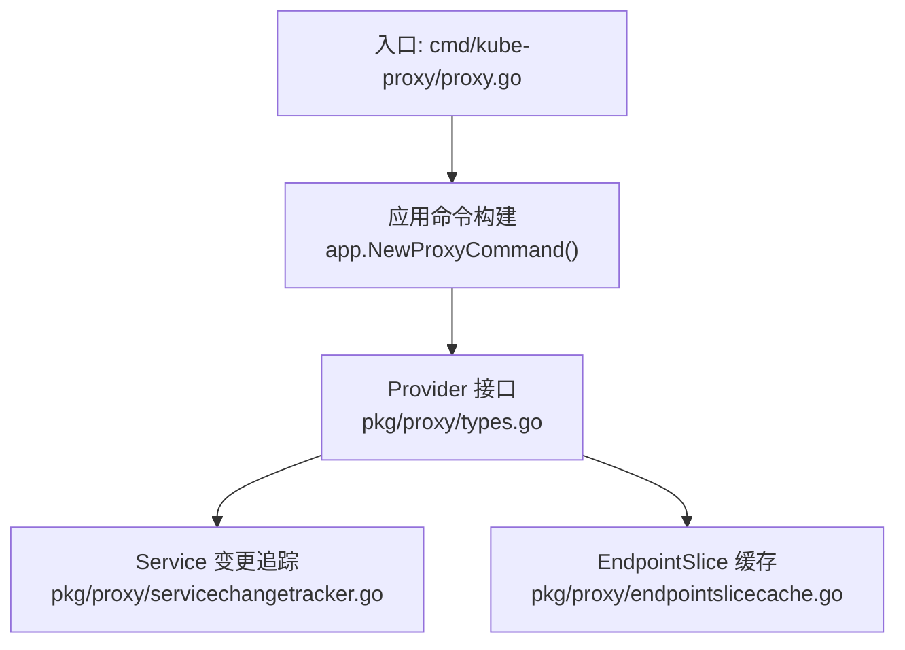
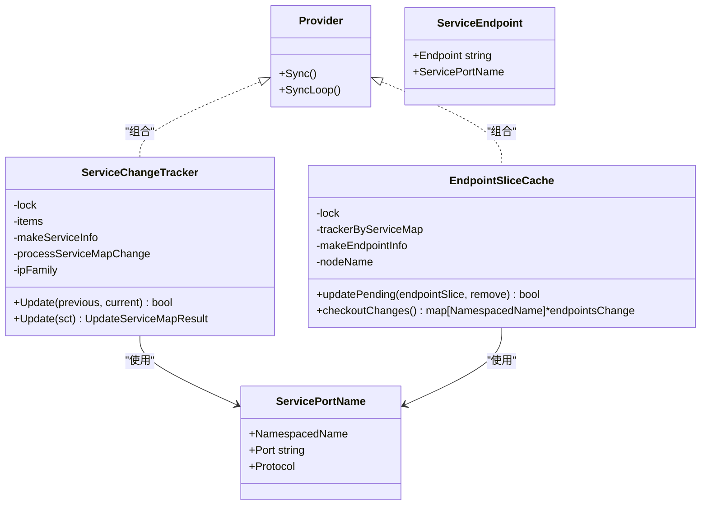
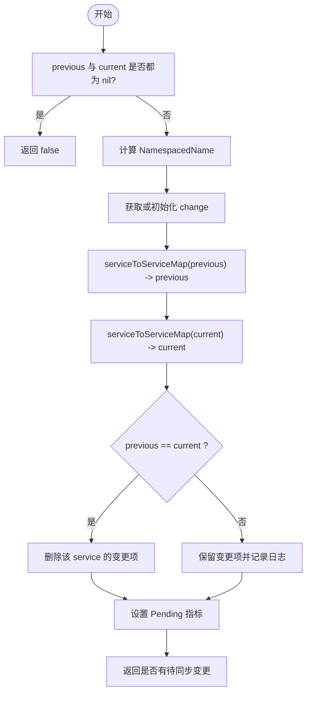
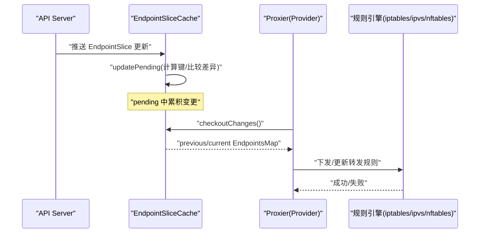
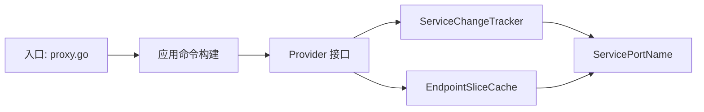

# 服务暴露与端口映射

<cite>
**本文引用的文件**   
- [cmd/kube-proxy/proxy.go](file://cmd/kube-proxy/proxy.go)
- [pkg/proxy/types.go](file://pkg/proxy/types.go)
- [pkg/proxy/servicechangetracker.go](file://pkg/proxy/servicechangetracker.go)
- [pkg/proxy/endpointslicecache.go](file://pkg/proxy/endpointslicecache.go)
</cite>

## 目录
1. [简介](#简介)
2. [项目结构](#项目结构)
3. [核心组件](#核心组件)
4. [架构总览](#架构总览)
5. [详细组件分析](#详细组件分析)
6. [依赖关系分析](#依赖关系分析)
7. [性能考虑](#性能考虑)
8. [故障排查指南](#故障排查指南)
9. [结论](#结论)
10. [附录](#附录)

## 简介
本技术文档聚焦于 Kubernetes 服务暴露与端口映射，围绕 Service 资源的网络实现机制、端口映射配置与转发规则、kube-proxy 代理模式原理、外部访问集群服务的完整配置示例、负载均衡与健康检查的网络设置，以及网络策略对服务暴露的影响与安全控制进行系统化阐述。文档以 kube-proxy 源码中的关键模块为依据，帮助读者从“声明式资源”到“数据面转发”的端到端理解。

## 项目结构
围绕服务暴露与端口映射，仓库中与 kube-proxy 相关的关键代码位于以下路径：
- 入口程序：cmd/kube-proxy/proxy.go
- 核心类型与接口：pkg/proxy/types.go
- 服务变更追踪：pkg/proxy/servicechangetracker.go
- EndpointSlice 缓存：pkg/proxy/endpointslicecache.go

图表来源
- [cmd/kube-proxy/proxy.go:29-33](file://cmd/kube-proxy/proxy.go#L29-L33)
- [pkg/proxy/types.go:27-40](file://pkg/proxy/types.go#L27-L40)

章节来源
- [cmd/kube-proxy/proxy.go:1-34](file://cmd/kube-proxy/proxy.go#L1-L34)

## 核心组件
- Provider 接口：定义 proxier 实现必须提供的能力，包括同步（Sync）、周期工作循环（SyncLoop），以及对 Service、EndpointSlice、Node 拓扑、ServiceCIDR 的处理能力。
- ServicePortName：唯一标识一个负载均衡服务的命名空间+名称+端口名+协议。
- ServiceEndpoint：用于标识某个服务与其端点的一对关系。
- ServiceChangeTracker：跟踪未提交的 Service 变更，维护 previous/current 差异，并在应用时合并/删除，触发回调清理。
- EndpointSliceCache：基于 EndpointSlice 的缓存，按服务维度聚合端点信息，支持 pending/applied 两阶段提交，生成 EndpointsMap 供上层使用。

章节来源
- [pkg/proxy/types.go:27-66](file://pkg/proxy/types.go#L27-L66)
- [pkg/proxy/servicechangetracker.go:31-107](file://pkg/proxy/servicechangetracker.go#L31-L107)
- [pkg/proxy/endpointslicecache.go:34-79](file://pkg/proxy/endpointslicecache.go#L34-L79)

## 架构总览
下图展示了从入口到核心组件的调用关系与职责划分。入口程序创建命令并运行；Provider 接口作为抽象层，协调 Service 变更追踪与 EndpointSlice 缓存，最终由具体 proxier 实现将规则下发至内核或用户态转发栈。

图表来源
- [pkg/proxy/types.go:27-66](file://pkg/proxy/types.go#L27-L66)
- [pkg/proxy/servicechangetracker.go:31-107](file://pkg/proxy/servicechangetracker.go#L31-L107)
- [pkg/proxy/endpointslicecache.go:34-79](file://pkg/proxy/endpointslicecache.go#L34-L79)

## 详细组件分析

### Service 变更追踪（ServiceChangeTracker）
- 职责：维护每个 Service 的 previous/current 差异，避免重复同步；在应用变更时合并新增/更新、删除旧条目，并触发 processServiceMapChange 回调进行清理。
- 关键点：
  - Update(previous, current)：当 previous 和 current 均为 nil 直接返回 false；否则计算差异并记录待同步数量。
  - serviceToServiceMap：根据 IP 族过滤 ClusterIP，跳过不应处理的 Service，并为每个端口构造 ServicePortName 与基础信息。
  - Update(sct)：遍历 items，先执行回调，再 merge(current)、filter(previous)、unmerge(previous)，最后清空 items 并重置指标。
  - HealthCheckNodePorts：汇总所有非零健康检查 NodePort，便于上层进行健康探测。

图表来源
- [pkg/proxy/servicechangetracker.go:71-107](file://pkg/proxy/servicechangetracker.go#L71-L107)
- [pkg/proxy/servicechangetracker.go:133-163](file://pkg/proxy/servicechangetracker.go#L133-L163)

章节来源
- [pkg/proxy/servicechangetracker.go:31-107](file://pkg/proxy/servicechangetracker.go#L31-L107)
- [pkg/proxy/servicechangetracker.go:109-193](file://pkg/proxy/servicechangetracker.go#L109-L193)
- [pkg/proxy/servicechangetracker.go:195-241](file://pkg/proxy/servicechangetracker.go#L195-L241)

### EndpointSlice 缓存（EndpointSliceCache）
- 职责：缓存 EndpointSlice 的增量变化，按服务维度聚合端点信息，提供 checkoutChanges 输出 previous/current 的 EndpointsMap。
- 关键点：
  - updatePending：为每个 EndpointSlice 计算服务键与切片键，比较是否发生变化，写入 pending。
  - checkoutChanges：将 pending 合并到 applied，计算 previous/current 的 EndpointsMap，并清理空条目。
  - endpointInfoByServicePort：按端口名与协议构造 ServicePortName，解析地址、条件（Ready/Serving/Terminating）、Hints（ForZones/ForNodes），生成 BaseEndpointInfo。
  - addEndpoints：去重与优先级处理（优先非 terminating），确保稳定排序以便 diff。

图表来源
- [pkg/proxy/endpointslicecache.go:94-155](file://pkg/proxy/endpointslicecache.go#L94-L155)
- [pkg/proxy/endpointslicecache.go:167-253](file://pkg/proxy/endpointslicecache.go#L167-L253)

章节来源
- [pkg/proxy/endpointslicecache.go:34-79](file://pkg/proxy/endpointslicecache.go#L34-L79)
- [pkg/proxy/endpointslicecache.go:94-155](file://pkg/proxy/endpointslicecache.go#L94-L155)
- [pkg/proxy/endpointslicecache.go:167-253](file://pkg/proxy/endpointslicecache.go#L167-L253)

### 入口与命令构建
- 入口 main 函数通过 app.NewProxyCommand() 构建命令并运行，完成参数解析、配置加载、Provider 初始化与 SyncLoop 启动。

章节来源
- [cmd/kube-proxy/proxy.go:29-33](file://cmd/kube-proxy/proxy.go#L29-L33)

## 依赖关系分析
- 入口依赖应用命令构建器，进而依赖 Provider 接口及其实现。
- Provider 组合 ServiceChangeTracker 与 EndpointSliceCache，分别负责服务元数据与端点数据的变更追踪与缓存。
- ServiceChangeTracker 依赖 ServicePortName 作为唯一键，结合 IP 族与端口信息进行映射。
- EndpointSliceCache 同样依赖 ServicePortName，并结合 EndpointSlice 的端口与端点信息生成 EndpointsMap。

图表来源
- [cmd/kube-proxy/proxy.go:29-33](file://cmd/kube-proxy/proxy.go#L29-L33)
- [pkg/proxy/types.go:27-66](file://pkg/proxy/types.go#L27-L66)
- [pkg/proxy/servicechangetracker.go:31-107](file://pkg/proxy/servicechangetracker.go#L31-L107)
- [pkg/proxy/endpointslicecache.go:34-79](file://pkg/proxy/endpointslicecache.go#L34-L79)

章节来源
- [cmd/kube-proxy/proxy.go:1-34](file://cmd/kube-proxy/proxy.go#L1-L34)
- [pkg/proxy/types.go:27-66](file://pkg/proxy/types.go#L27-L66)

## 性能考虑
- 变更批处理：ServiceChangeTracker 与 EndpointSliceCache 均采用 pending/applied 两阶段提交，减少频繁规则下发带来的抖动。
- 去重与稳定排序：EndpointSliceCache 对端点进行去重与稳定排序，降低 diff 成本与规则重建开销。
- 选择性处理：ServiceChangeTracker 在 serviceToServiceMap 中跳过不应处理的 Service 与无 ClusterIP 的情况，避免无效计算。
- 指标监控：通过 metrics 记录 Service 变更总数与待同步数量，便于观测与容量规划。

[本节为通用指导，不直接分析具体文件]

## 故障排查指南
- 观察待同步数量：关注 ServiceChangesPending 指标，若长期偏高，需检查上游事件风暴或规则下发瓶颈。
- 检查健康检查 NodePort：通过 ServicePortMap.HealthCheckNodePorts 汇总的健康检查端口，验证探针可达性与后端 Pod 状态。
- 校验端点条件：确认 EndpointSlice 中 Ready/Serving/Terminating 条件是否符合预期，避免将终止中的端点纳入转发。
- 对比 previous/current：利用 checkoutChanges 输出的 EndpointsMap 差异定位端点漂移或重复问题。

章节来源
- [pkg/proxy/servicechangetracker.go:119-131](file://pkg/proxy/servicechangetracker.go#L119-L131)
- [pkg/proxy/endpointslicecache.go:209-253](file://pkg/proxy/endpointslicecache.go#L209-L253)

## 结论
通过对 kube-proxy 核心组件的分析，可以清晰看到 Service 暴露与端口映射的实现路径：入口程序驱动 Provider 接口，ServiceChangeTracker 管理服务元数据变更，EndpointSliceCache 聚合端点信息，最终由具体 proxier 实现将规则下发至数据面。两阶段提交、去重与稳定排序等设计显著提升了稳定性与性能。结合健康检查与网络策略，可实现安全可控的服务暴露。

[本节为总结性内容，不直接分析具体文件]

## 附录

### Service 类型与端口映射要点
- ClusterIP：默认类型，分配虚拟 IP，仅集群内部可达；ServiceChangeTracker 会依据 IP 族过滤有效 ClusterIP。
- NodePort：在节点上开放端口，允许外部访问；HealthCheckNodePorts 可汇总健康检查 NodePort。
- LoadBalancer：云平台控制器创建外部负载均衡器，将流量转发至 NodePort 或 ClusterIP。

章节来源
- [pkg/proxy/servicechangetracker.go:133-163](file://pkg/proxy/servicechangetracker.go#L133-L163)
- [pkg/proxy/servicechangetracker.go:119-131](file://pkg/proxy/servicechangetracker.go#L119-L131)

### kube-proxy 代理模式说明
- iptables 模式：基于内核 netfilter 表项进行转发，规则量大时存在性能与同步延迟风险。
- ipvs 模式：基于内核 IPVS 模块，具备更好的可扩展性与负载均衡能力。
- nftables 模式：新一代内核包过滤框架，提供更高效的规则管理与匹配。
- 选择建议：大规模集群优先 ipvs；需要更细粒度规则与兼容性的场景可评估 nftables。

[本节为通用指导，不直接分析具体文件]

### 外部访问与服务暴露配置示例（概念性步骤）
- 创建 Service（ClusterIP/NodePort/LoadBalancer）并声明端口映射。
- 若使用 NodePort，需在防火墙/安全组放行对应节点端口。
- 若使用 LoadBalancer，确保云厂商控制器可用且正确绑定公网 IP。
- 配置健康检查探针（HTTP/TCP/gRPC），确保后端 Pod 就绪。
- 如需跨节点访问，确认 CNI 插件与路由/隧道配置正常。

[本节为通用指导，不直接分析具体文件]

### 负载均衡与健康检查的网络设置
- 负载均衡：Service 的 sessionAffinity、externalTrafficPolicy 等字段影响会话保持与源地址保留。
- 健康检查：kube-proxy 可通过 HealthCheckNodePorts 暴露健康检查端口，配合外部探针或 Ingress 控制器进行探测。
- 端点条件：Ready/Serving/Terminating 决定端点是否参与转发，避免将终止中的 Pod 纳入流量。

章节来源
- [pkg/proxy/servicechangetracker.go:119-131](file://pkg/proxy/servicechangetracker.go#L119-L131)
- [pkg/proxy/endpointslicecache.go:209-253](file://pkg/proxy/endpointslicecache.go#L209-L253)

### 网络策略对服务暴露的影响与安全控制
- NetworkPolicy 可限制入站/出站流量，影响 Service 的可访问范围。
- 对于 NodePort/LoadBalancer，需确保节点平面与外部网络的连通性符合策略要求。
- 建议在命名空间级别精细化策略，结合标签选择器控制访问主体与目标。

[本节为通用指导，不直接分析具体文件]