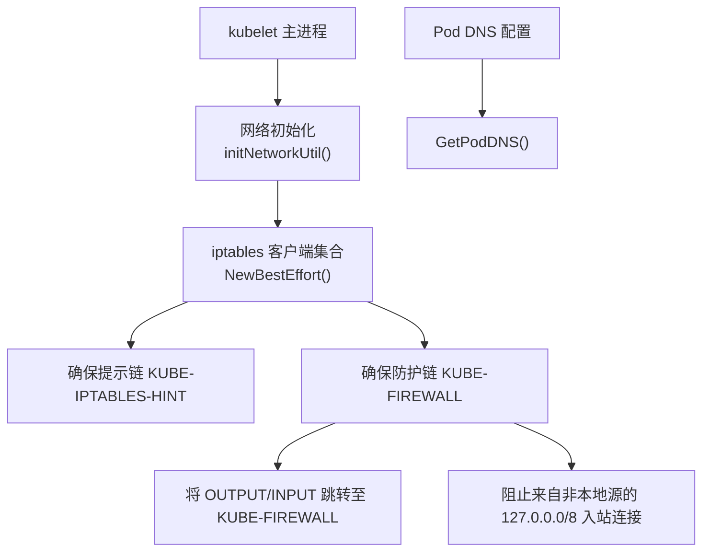
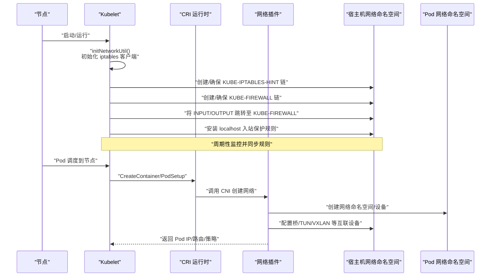
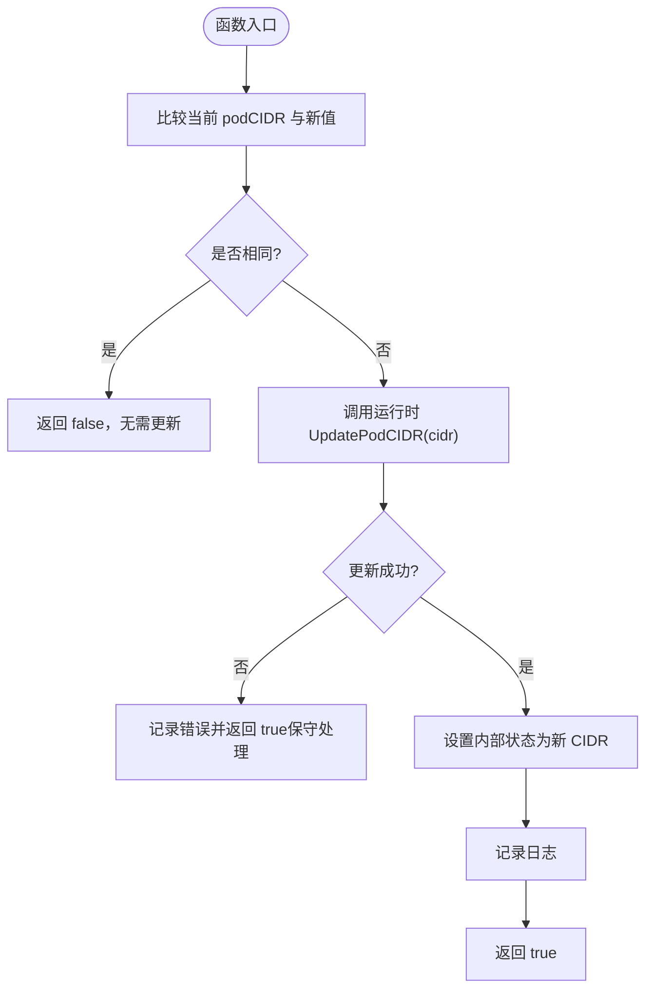
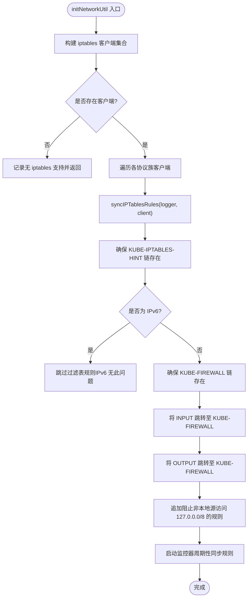
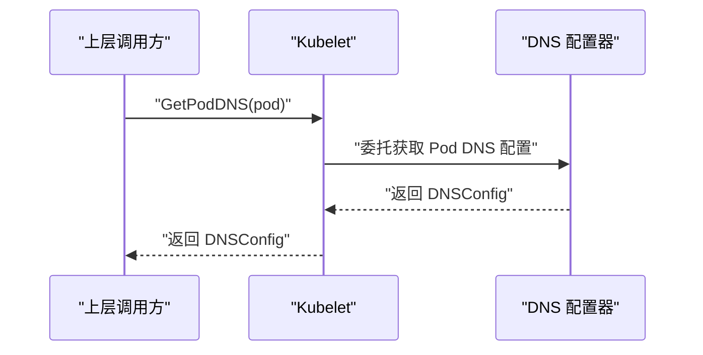
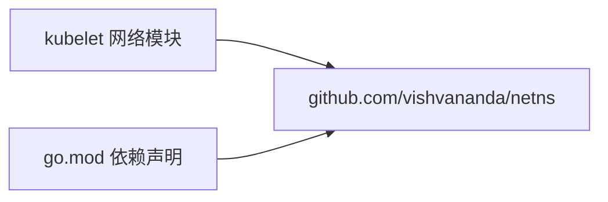

# 网络命名空间

<cite>
**本文引用的文件**   
- [pkg/kubelet/kubelet_network.go](file://pkg/kubelet/kubelet_network.go)
- [pkg/kubelet/kubelet_network_linux.go](file://pkg/kubelet/kubelet_network_linux.go)
- [go.mod](file://go.mod)
</cite>

## 目录
1. [简介](#简介)
2. [项目结构](#项目结构)
3. [核心组件](#核心组件)
4. [架构总览](#架构总览)
5. [详细组件分析](#详细组件分析)
6. [依赖分析](#依赖分析)
7. [性能考虑](#性能考虑)
8. [故障排查指南](#故障排查指南)
9. [结论](#结论)
10. [附录](#附录)

## 简介
本技术文档聚焦于 Kubernetes 节点侧与容器网络相关的“网络命名空间”能力，围绕 Linux 网络命名空间的隔离机制（独立网络栈、路由表、防火墙规则、网络设备）展开，并结合仓库中 kubelet 的网络初始化与 iptables 同步逻辑，说明在 Pod 生命周期内如何为每个 Pod 创建并配置独立的网络命名空间。同时，文档还涵盖不同命名空间间的通信路径、在网络插件中的实际落地方式、以及性能与最佳实践建议。

## 项目结构
与网络命名空间直接相关的关键代码位于 kubelet 的 Linux 平台实现中：
- 通用网络接口与 DNS 获取入口
- Linux 平台的 iptables 初始化与守护同步

图示来源
- [pkg/kubelet/kubelet_network_linux.go:38-64](file://pkg/kubelet/kubelet_network_linux.go#L38-L64)
- [pkg/kubelet/kubelet_network_linux.go:66-118](file://pkg/kubelet/kubelet_network_linux.go#L66-L118)
- [pkg/kubelet/kubelet_network.go:53-58](file://pkg/kubelet/kubelet_network.go#L53-L58)

章节来源
- [pkg/kubelet/kubelet_network_linux.go:38-118](file://pkg/kubelet/kubelet_network_linux.go#L38-L118)
- [pkg/kubelet/kubelet_network.go:53-58](file://pkg/kubelet/kubelet_network.go#L53-L58)

## 核心组件
- 网络命名空间概念与隔离边界
  - 每个 Pod 拥有独立的网络栈：网卡、IP 地址、路由表、ARP/NDP 缓存、iptables/nftables 规则、端口空间等。
  - 通过 veth pair 将 Pod 命名空间内的虚拟网卡与宿主机桥接或隧道设备相连，实现跨命名空间转发。
- kubelet 在网络命名空间中的作用
  - 负责在节点上为 Pod 创建网络命名空间，并通过运行时/网络插件完成 IP 分配、设备挂载与规则下发。
  - 维护宿主机的 iptables 提示链与防护链，辅助其他组件识别内核防火墙后端并加固 localhost 访问安全。
- 关键流程
  - Pod CIDR 更新：当节点 PodCIDR 变更时，kubelet 通知运行时以驱动网络插件重新规划。
  - iptables 初始化与监控：确保提示链与防护链存在，周期性同步规则，保证一致性。

章节来源
- [pkg/kubelet/kubelet_network.go:28-51](file://pkg/kubelet/kubelet_network.go#L28-L51)
- [pkg/kubelet/kubelet_network_linux.go:38-64](file://pkg/kubelet/kubelet_network_linux.go#L38-L64)
- [pkg/kubelet/kubelet_network_linux.go:66-118](file://pkg/kubelet/kubelet_network_linux.go#L66-L118)

## 架构总览
下图展示了 kubelet 在 Linux 节点上的网络初始化与规则同步过程，以及与 Pod 网络命名空间的关系。

图示来源
- [pkg/kubelet/kubelet_network_linux.go:38-64](file://pkg/kubelet/kubelet_network_linux.go#L38-L64)
- [pkg/kubelet/kubelet_network_linux.go:66-118](file://pkg/kubelet/kubelet_network_linux.go#L66-L118)

## 详细组件分析

### 组件一：Pod CIDR 更新流程
该流程用于在节点 PodCIDR 发生变化时，通知运行时以触发网络插件进行重配。

图示来源
- [pkg/kubelet/kubelet_network.go:28-51](file://pkg/kubelet/kubelet_network.go#L28-L51)

章节来源
- [pkg/kubelet/kubelet_network.go:28-51](file://pkg/kubelet/kubelet_network.go#L28-L51)

### 组件二：Linux iptables 初始化与守护同步
kubelet 在 Linux 平台上负责确保宿主机的 iptables 提示链与防护链存在，并将 INPUT/OUTPUT 链跳转到防护链，同时安装针对 localhost 的安全规则。

图示来源
- [pkg/kubelet/kubelet_network_linux.go:38-64](file://pkg/kubelet/kubelet_network_linux.go#L38-L64)
- [pkg/kubelet/kubelet_network_linux.go:66-118](file://pkg/kubelet/kubelet_network_linux.go#L66-L118)

章节来源
- [pkg/kubelet/kubelet_network_linux.go:38-64](file://pkg/kubelet/kubelet_network_linux.go#L38-L64)
- [pkg/kubelet/kubelet_network_linux.go:66-118](file://pkg/kubelet/kubelet_network_linux.go#L66-L118)

### 组件三：Pod DNS 配置获取
kubelet 提供 GetPodDNS 接口，供上层根据 Pod 元数据计算其 DNS 配置，以便在创建容器时注入到 Pod 的网络命名空间中。

图示来源
- [pkg/kubelet/kubelet_network.go:53-58](file://pkg/kubelet/kubelet_network.go#L53-L58)

章节来源
- [pkg/kubelet/kubelet_network.go:53-58](file://pkg/kubelet/kubelet_network.go#L53-L58)

## 依赖分析
- 外部依赖
  - github.com/vishvananda/netns：用于操作 Linux 网络命名空间的基础库，广泛用于 netlink 与网络工具链。
- 模块声明
  - go.mod 中声明了 netns 的版本，表明项目对网络命名空间操作的依赖关系。

图示来源
- [go.mod:54](file://go.mod#L54)

章节来源
- [go.mod:54](file://go.mod#L54)

## 性能考虑
- iptables 规则同步开销
  - 周期性监控与同步可能带来 CPU 与系统调用开销，应结合节点规模与规则数量评估。
- 规则命中路径
  - 将 INPUT/OUTPUT 统一跳转到专用链有助于集中管理与优化匹配顺序，减少不必要匹配。
- 命名空间切换成本
  - 频繁在不同网络命名空间间切换会带来上下文切换与系统调用开销，应避免不必要的跨命名空间操作。
- 使用 nftables 替代方案
  - 在仅支持 nftables 的系统上，iptables 不可用；需关注后续演进与兼容性策略。

[本节为通用指导，不直接分析具体文件]

## 故障排查指南
- 现象：节点未检测到 iptables 支持
  - 检查 initNetworkUtil 是否记录“无 iptables 支持”日志，确认系统是否仅支持 nftables。
- 现象：提示链或防护链缺失
  - 检查 syncIPTablesRules 是否正确创建 KUBE-IPTABLES-HINT 与 KUBE-FIREWALL 链，以及 INPUT/OUTPUT 跳转是否生效。
- 现象：localhost 访问异常
  - 检查针对 127.0.0.0/8 的入站保护规则是否被正确安装，避免误拦截合法流量。
- 现象：Pod CIDR 未生效
  - 检查 updatePodCIDR 是否调用运行时 UpdatePodCIDR 成功，并观察内部状态是否更新。

章节来源
- [pkg/kubelet/kubelet_network_linux.go:38-64](file://pkg/kubelet/kubelet_network_linux.go#L38-L64)
- [pkg/kubelet/kubelet_network_linux.go:66-118](file://pkg/kubelet/kubelet_network_linux.go#L66-L118)
- [pkg/kubelet/kubelet_network.go:28-51](file://pkg/kubelet/kubelet_network.go#L28-L51)

## 结论
Kubernetes 在节点侧通过 kubelet 协调网络命名空间的创建与配置，并在 Linux 平台上维护必要的 iptables 提示链与防护链，以确保 Pod 网络的隔离性与安全性。结合 CRI 与 CNI 生态，kubelet 能够高效地为每个 Pod 建立独立的网络栈，并通过统一的规则管理提升可观测性与稳定性。在生产环境中，应关注规则同步开销、nftables 兼容性与命名空间切换成本，以实现更优的性能与可靠性。

[本节为总结性内容，不直接分析具体文件]

## 附录
- 术语
  - 网络命名空间：Linux 内核提供的网络资源隔离机制，包含独立的网络栈、路由表、防火墙规则与网络设备。
  - CRI/CNI：容器运行时接口与容器网络接口，分别定义容器生命周期与网络配置的标准化扩展点。
  - iptables/nftables：Linux 内核数据包过滤与 NAT 框架，前者为传统实现，后者为新一代高性能实现。

[本节为概念性内容，不直接分析具体文件]