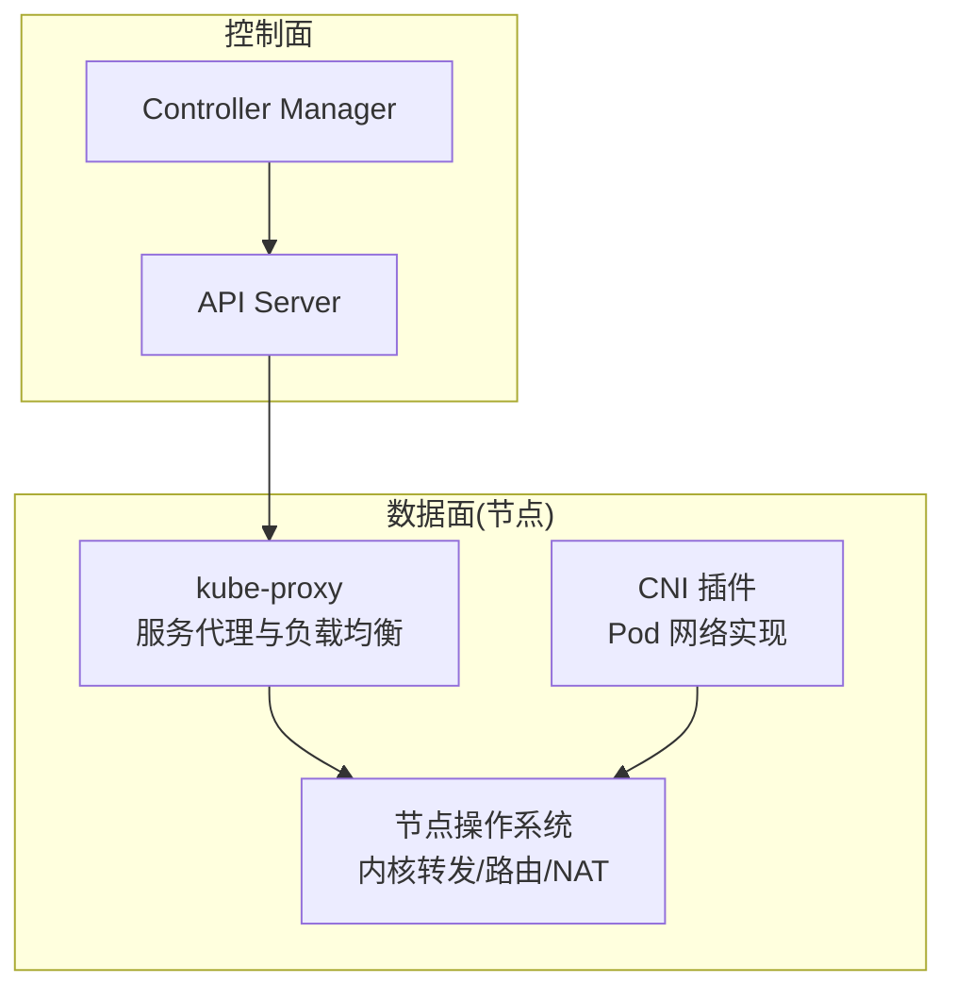
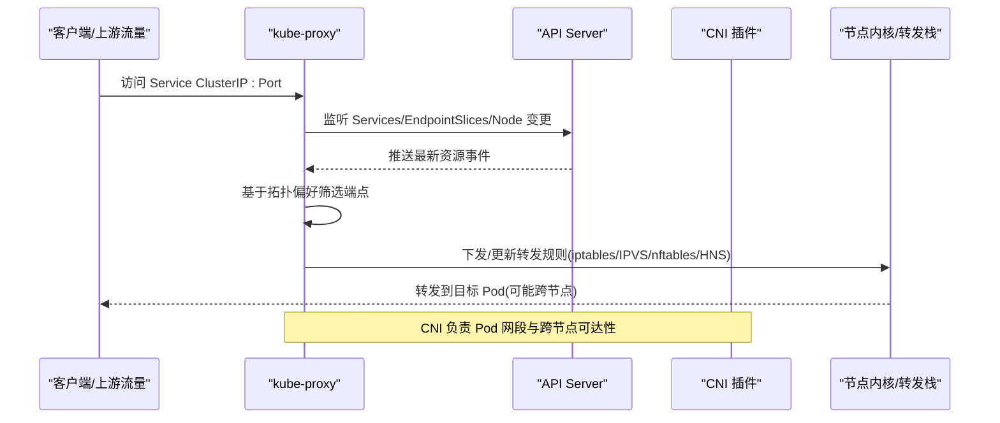
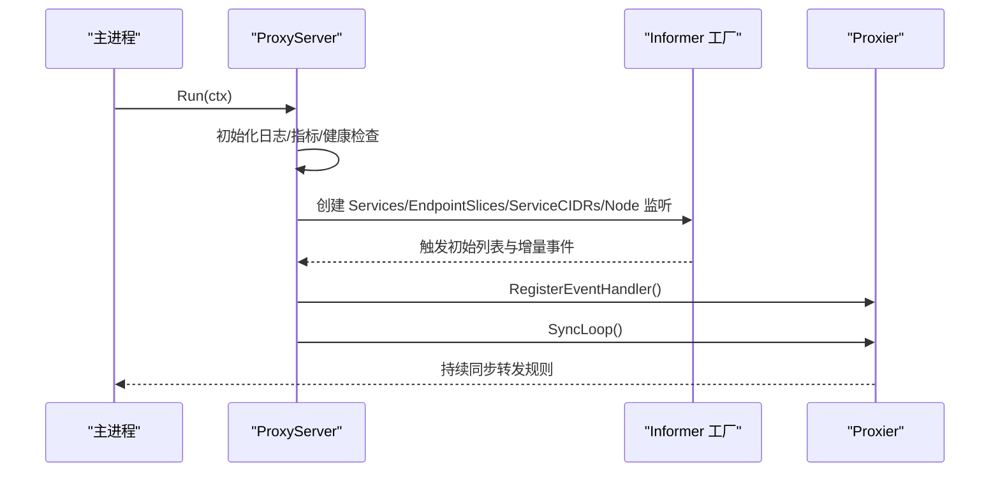
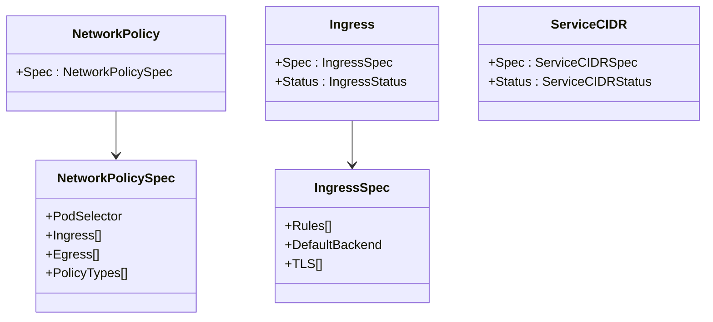
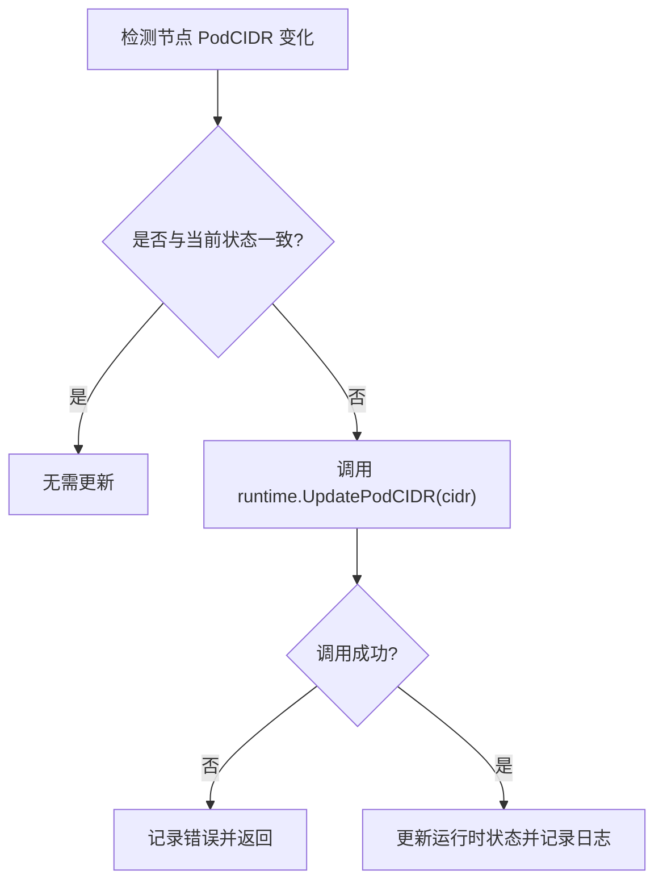
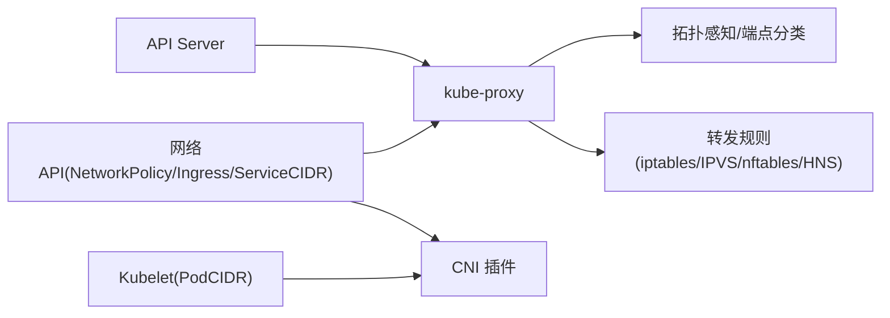

# 网络拓扑结构

<cite>
**本文引用的文件**   
- [topology.go](file://pkg/proxy/topology.go)
- [server.go](file://cmd/kube-proxy/app/server.go)
- [types.go](file://pkg/apis/networking/types.go)
- [kubelet_network.go](file://pkg/kubelet/kubelet_network.go)
</cite>

## 目录
1. [简介](#简介)
2. [项目结构](#项目结构)
3. [核心组件](#核心组件)
4. [架构总览](#架构总览)
5. [详细组件分析](#详细组件分析)
6. [依赖分析](#依赖分析)
7. [性能考虑](#性能考虑)
8. [故障排查指南](#故障排查指南)
9. [结论](#结论)
10. [附录](#附录)

## 简介
本技术文档围绕 Kubernetes 集群的网络拓扑，系统阐述 flat network（扁平网络）、overlay network（覆盖网络）与 underlay network（底层网络）的实现方案、优缺点与适用场景。结合仓库中 kube-proxy 的拓扑感知能力、Service/EndpointSlice 的流量分发策略、以及节点 PodCIDR 的动态更新机制，给出跨节点通信的实现路径、配置要点与性能优化建议，并总结拓扑选择策略与设计原则，帮助读者在工程实践中做出合理决策。

## 项目结构
与网络拓扑密切相关的代码主要分布在以下位置：
- kube-proxy 启动与服务发现监听：cmd/kube-proxy/app/server.go
- 拓扑感知与端点分类：pkg/proxy/topology.go
- 网络相关 API 类型（NetworkPolicy、Ingress、ServiceCIDR 等）：pkg/apis/networking/types.go
- Kubelet 对 PodCIDR 的运行时更新：pkg/kubelet/kubelet_network.go



[本图为概念性结构图，不直接映射具体源码文件]

## 核心组件
- kube-proxy：在每个节点上运行，负责将 Service 抽象为可访问的虚拟 IP 和端口，并通过 iptables/IPVS/nftables/Windows HNS 等后端进行流量转发与负载均衡。其启动流程会订阅 Services、EndpointSlices、Node 等资源变化，驱动本地转发规则同步。
- 拓扑感知与端点分类：kube-proxy 根据 Endpoint 的 Zone/Node 提示与 Service 的 trafficDistribution 偏好，计算“同节点优先”或“同可用区优先”的端点集合，从而降低跨区/跨节点延迟。
- NetworkPolicy/Ingress/ServiceCIDR：提供安全隔离、外部入口与 ClusterIP 分配范围等网络能力，影响跨节点通信策略与地址规划。
- Kubelet 与 PodCIDR：Kubelet 通过运行时接口向底层网络插件传递 PodCIDR，确保容器网络与节点网络协同工作。

章节来源
- [server.go:534-659](file://cmd/kube-proxy/app/server.go#L534-L659)
- [topology.go:26-154](file://pkg/proxy/topology.go#L26-L154)
- [types.go:27-209](file://pkg/apis/networking/types.go#L27-L209)
- [kubelet_network.go:28-51](file://pkg/kubelet/kubelet_network.go#L28-L51)

## 架构总览
下图展示了 kube-proxy 在节点侧的关键职责以及与 API Server、CNI 的交互关系，体现不同网络拓扑下的数据平面行为。



图表来源
- [server.go:534-659](file://cmd/kube-proxy/app/server.go#L534-L659)
- [topology.go:26-154](file://pkg/proxy/topology.go#L26-L154)

章节来源
- [server.go:534-659](file://cmd/kube-proxy/app/server.go#L534-L659)
- [topology.go:26-154](file://pkg/proxy/topology.go#L26-L154)

## 详细组件分析

### 组件A：kube-proxy 拓扑感知与端点分类
kube-proxy 在收到 Service 与 EndpointSlice 变更后，会根据 Service 的 trafficDistribution 偏好与 Endpoint 的 Zone/Node 提示，将端点分为三类：
- 仅 Cluster 策略可用的端点集合
- 仅 Local 策略可用的端点集合
- 从当前节点可达的所有端点（前两者的并集）

该过程还包含回退逻辑：当没有 Ready 端点时，回退到 Serving+Terminating 类型的端点，以保证连通性。

```mermaid
flowchart TD
Start(["开始"]) --> CheckEmpty["端点列表是否为空?"]
CheckEmpty --> |是| ReturnNil["返回空结果"]
CheckEmpty --> |否| CalcMode["根据 hints 与 feature gate 计算拓扑模式<br/>""、PreferSameZone、PreferSameNode"]
CalcMode --> FilterCluster["按拓扑模式过滤 Cluster 端点"]
FilterCluster --> FallbackCheck{"Cluster 端点为空?"}
FallbackCheck --> |是| UseTerm["回退到 Serving+Terminating 端点"]
FallbackCheck --> |否| KeepCluster["保留已过滤的 Cluster 端点"]
UseTerm --> HasAny["标记 hasAnyEndpoints=true"]
KeepCluster --> HasAny
HasAny --> LocalPolicy{"是否使用 Local 策略?"}
LocalPolicy --> |否| AllReachable["allReachable = clusterEndpoints"] --> End(["结束"])
LocalPolicy --> |是| ScanLocal["扫描是否存在本地 Ready/Terminating 端点"]
ScanLocal --> BuildLocal["构建 localEndpoints"]
BuildLocal --> MergeCase{"是否需要合并 cluster 与 local?"}
MergeCase --> |是| Merge["去重合并得到 allReachable"] --> End
MergeCase --> |否| SetAll["allReachable=clusterEndpoints"] --> End
```

图表来源
- [topology.go:26-154](file://pkg/proxy/topology.go#L26-L154)

章节来源
- [topology.go:26-154](file://pkg/proxy/topology.go#L26-L154)

### 组件B：kube-proxy 启动与资源监听
kube-proxy 启动后完成以下关键步骤：
- 初始化日志、指标、健康检查与 metrics 服务
- 创建 Informer 工厂，分别监听 Services、EndpointSlices、ServiceCIDRs（可选）与 Node 资源
- 注册事件处理器到 Proxier，并启动 SyncLoop 以持续同步转发规则



图表来源
- [server.go:534-659](file://cmd/kube-proxy/app/server.go#L534-L659)

章节来源
- [server.go:534-659](file://cmd/kube-proxy/app/server.go#L534-L659)

### 组件C：网络 API 与拓扑相关能力
- NetworkPolicy：定义 Pod 级别的入站/出站访问控制，直接影响跨节点通信策略。
- Ingress/IngressClass：对外暴露 HTTP/HTTPS 流量的统一入口，通常由 Ingress Controller 实现。
- ServiceCIDR：声明 Service ClusterIP 的分配范围，影响跨节点路由与 NAT 策略。



图表来源
- [types.go:27-209](file://pkg/apis/networking/types.go#L27-L209)
- [types.go:651-696](file://pkg/apis/networking/types.go#L651-L696)

章节来源
- [types.go:27-209](file://pkg/apis/networking/types.go#L27-L209)
- [types.go:651-696](file://pkg/apis/networking/types.go#L651-L696)

### 组件D：Kubelet 与 PodCIDR 动态更新
Kubelet 在检测到节点 PodCIDR 变化时，会通过运行时接口通知底层网络插件，确保容器网络与节点网络保持一致。



图表来源
- [kubelet_network.go:28-51](file://pkg/kubelet/kubelet_network.go#L28-L51)

章节来源
- [kubelet_network.go:28-51](file://pkg/kubelet/kubelet_network.go#L28-L51)

## 依赖分析
- kube-proxy 依赖 API Server 提供的 Services、EndpointSlices、ServiceCIDRs 与 Node 资源；通过 Informer 机制获取变更并驱动本地转发规则。
- 拓扑感知逻辑依赖 Endpoint 的 Zone/Node 提示与 Service 的 trafficDistribution 字段，决定端点筛选策略。
- NetworkPolicy/Ingress/ServiceCIDR 作为网络能力的 API 层，与 CNI 及转发后端共同实现跨节点通信与安全策略。
- Kubelet 与 CNI 协作，保证 Pod 网段与节点网络互通。



图表来源
- [server.go:534-659](file://cmd/kube-proxy/app/server.go#L534-L659)
- [topology.go:26-154](file://pkg/proxy/topology.go#L26-L154)
- [types.go:27-209](file://pkg/apis/networking/types.go#L27-L209)
- [kubelet_network.go:28-51](file://pkg/kubelet/kubelet_network.go#L28-L51)

章节来源
- [server.go:534-659](file://cmd/kube-proxy/app/server.go#L534-L659)
- [topology.go:26-154](file://pkg/proxy/topology.go#L26-L154)
- [types.go:27-209](file://pkg/apis/networking/types.go#L27-L209)
- [kubelet_network.go:28-51](file://pkg/kubelet/kubelet_network.go#L28-L51)

## 性能考虑
- 拓扑感知减少跨区/跨节点跳数：通过 PreferSameZone/PreferSameNode 策略，优先选择同区或同节点端点，降低延迟与带宽消耗。
- 端点回退保障可用性：在无 Ready 端点时回退到 Serving+Terminating 端点，避免服务不可用。
- 转发后端选择：IPVS 在高并发下具备更好的扩展性与性能；iptables/nftables 更通用但规则规模增长会带来开销。
- 双栈与地址族一致性：kube-proxy 会校验配置与节点 IP 族的一致性，避免单栈/双栈混配导致的异常。
- 资源监听与同步周期：合理设置 ConfigSyncPeriod，平衡实时性与 CPU/内存占用。

[本节为通用性能讨论，不直接分析具体文件]

## 故障排查指南
- 健康检查与指标：kube-proxy 支持 /healthz 与 /metrics 端点，用于监控运行状态与性能指标。
- 配置校验：启动时会检查 nodePortAddresses、clusterCIDRs、bindAddress 等配置与 IP 族一致性，出现告警或致命错误需修正。
- 拓扑提示缺失：若 Endpoint 缺少 Zone/Node 提示，拓扑偏好将被忽略，可能导致跨区/跨节点流量增加。
- PodCIDR 更新失败：Kubelet 调用 UpdatePodCIDR 失败时需检查 CNI 插件与运行时接口。

章节来源
- [server.go:295-385](file://cmd/kube-proxy/app/server.go#L295-L385)
- [server.go:446-532](file://cmd/kube-proxy/app/server.go#L446-L532)
- [topology.go:156-218](file://pkg/proxy/topology.go#L156-L218)
- [kubelet_network.go:28-51](file://pkg/kubelet/kubelet_network.go#L28-L51)

## 结论
Kubernetes 的网络拓扑设计通过 kube-proxy 的拓扑感知、Service/EndpointSlice 的流量分发策略、NetworkPolicy/Ingress/ServiceCIDR 的安全与入口能力，以及 Kubelet 与 CNI 的协同，实现了灵活且高性能的跨节点通信。在实际工程中，应根据业务延迟敏感性与多可用区部署情况选择合适的拓扑策略，并结合转发后端与资源监听周期进行调优，以获得最佳的性能与可用性。

[本节为总结性内容，不直接分析具体文件]

## 附录

### 三种网络拓扑对比与适用场景
- Flat Network（扁平网络）
  - 特点：所有节点在同一二层域，Pod 可直接通过物理网络互访，无需额外封装。
  - 优点：低延迟、零封装开销、简单可靠。
  - 缺点：可扩展性受限，难以跨数据中心/云厂商边界；广播风暴风险。
  - 适用：小型集群、同机房/同 VPC 内部署。
- Overlay Network（覆盖网络）
  - 特点：在现有网络之上建立虚拟网络，常用 VXLAN/GRE 等封装，跨节点通过隧道转发。
  - 优点：跨子网/跨地域互联能力强，易于扩展；与底层网络解耦。
  - 缺点：封装/解封装带来 CPU 与带宽开销；需要合理的 MTU 与分片策略。
  - 适用：大规模集群、多云/混合云、跨可用区部署。
- Underlay Network（底层网络）
  - 特点：直接使用数据中心三层网络（如 ECMP/BGP），Pod 网段由路由器/交换机管理。
  - 优点：接近线速转发，无封装开销；高吞吐、低延迟。
  - 缺点：对网络设备要求高，配置复杂；需要精确的地址规划与路由收敛。
  - 适用：超大规模集群、对性能极度敏感的场景。

[本节为概念性内容，不直接分析具体文件]

### 跨节点通信实现机制
- 同一节点内：Service 流量经 kube-proxy 转发至本地 Pod。
- 跨节点：
  - Flat：直接通过物理网络路由到达目标节点。
  - Overlay：通过隧道封装，经物理网络转发到目标节点后再解封装。
  - Underlay：由数据中心路由器基于 Pod 网段进行三层转发。
- 拓扑感知：kube-proxy 根据 Zone/Node 提示与 trafficDistribution 偏好，优先选择同区/同节点端点，降低跨区/跨节点延迟。

[本节为概念性内容，不直接分析具体文件]

### 配置示例与部署要点（路径指引）
- kube-proxy 启动与监听：参考 [server.go:534-659](file://cmd/kube-proxy/app/server.go#L534-L659)
- 拓扑感知与端点分类：参考 [topology.go:26-154](file://pkg/proxy/topology.go#L26-L154)
- NetworkPolicy/Ingress/ServiceCIDR 类型定义：参考 [types.go:27-209](file://pkg/apis/networking/types.go#L27-L209)、[types.go:651-696](file://pkg/apis/networking/types.go#L651-L696)
- Kubelet PodCIDR 更新：参考 [kubelet_network.go:28-51](file://pkg/kubelet/kubelet_network.go#L28-L51)

[本节为路径指引，不直接展示配置内容]

### 拓扑选择策略与设计原则
- 延迟敏感型业务：优先 PreferSameNode/PreferSameZone，结合 Underlay 或 Flat 网络以降低跨区/跨节点跳数。
- 大规模与多云：Overlay 网络更易扩展，配合 IPVS 提升转发性能。
- 安全与隔离：合理使用 NetworkPolicy 限制跨节点访问，结合 Ingress 规范外部入口。
- 地址规划：明确 ServiceCIDR 与 PodCIDR，避免冲突与路由环路。
- 运维可观测：启用健康检查与指标采集，关注规则规模与同步周期。

[本节为通用指导，不直接分析具体文件]