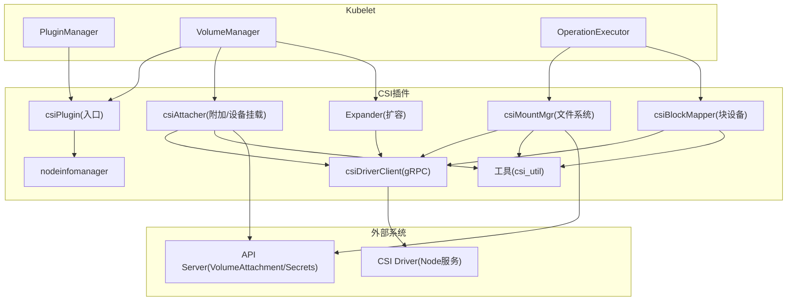
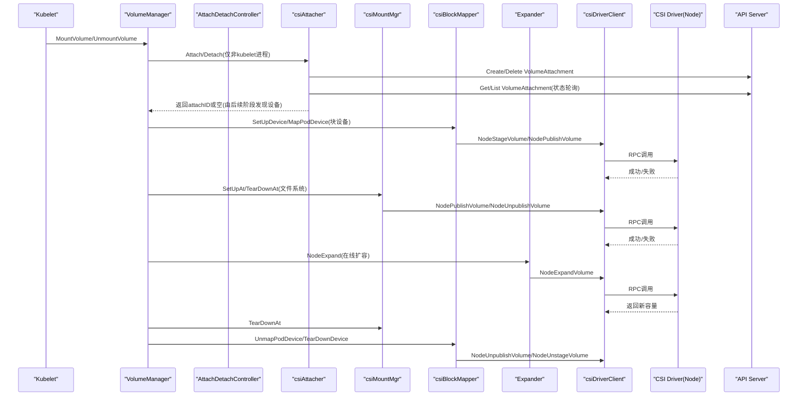
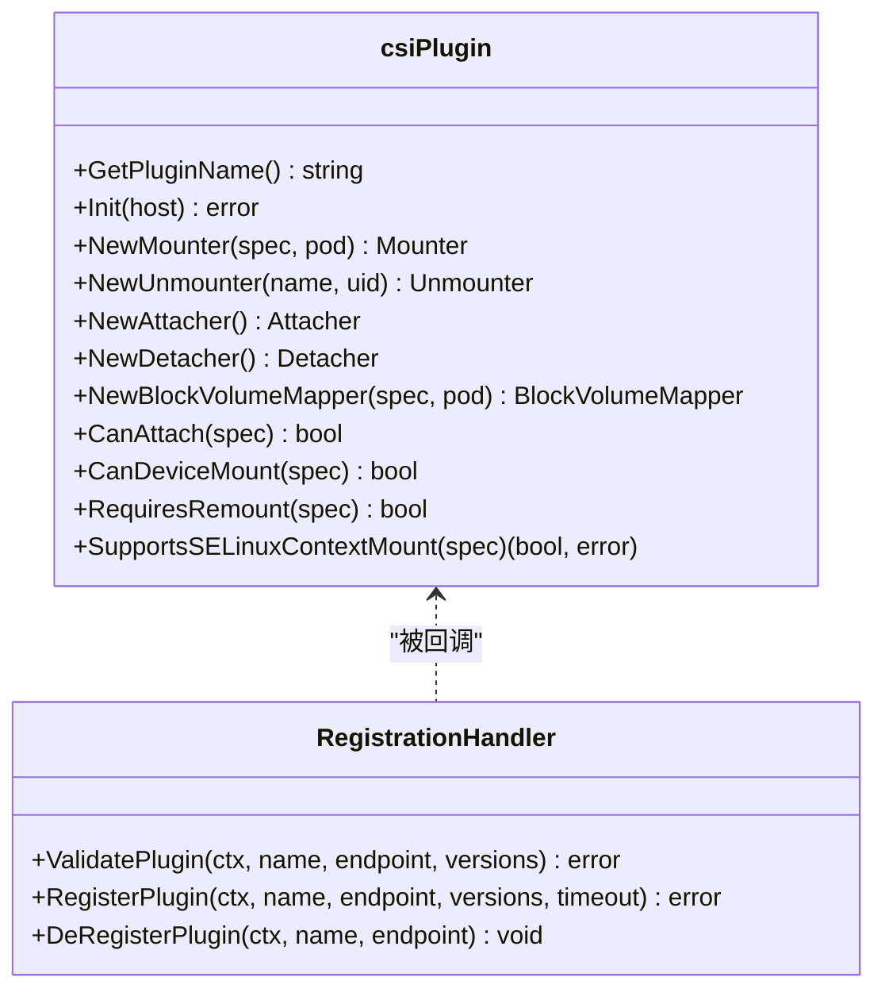
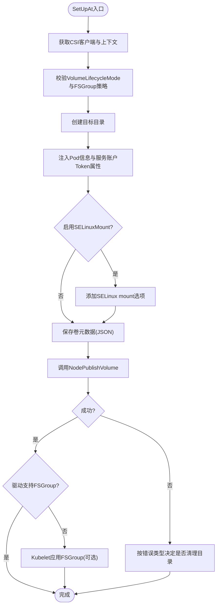
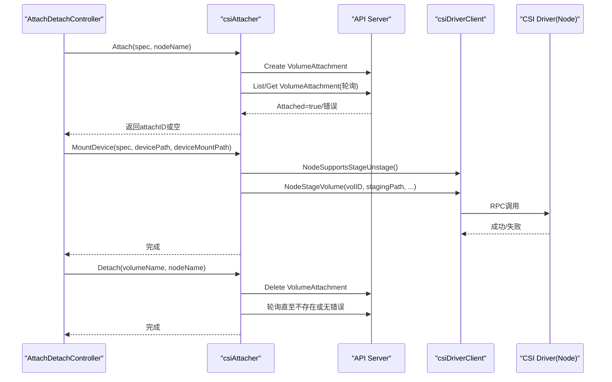
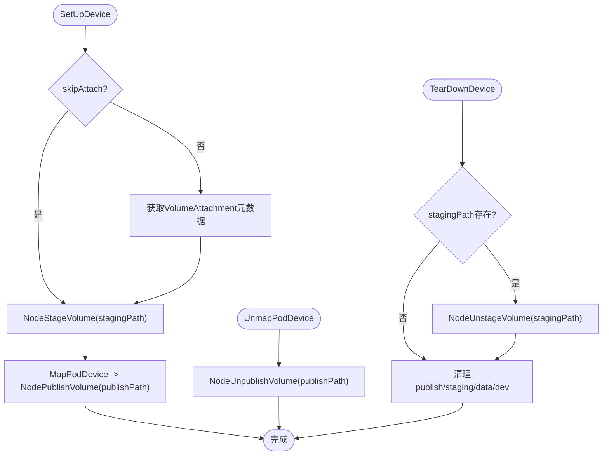
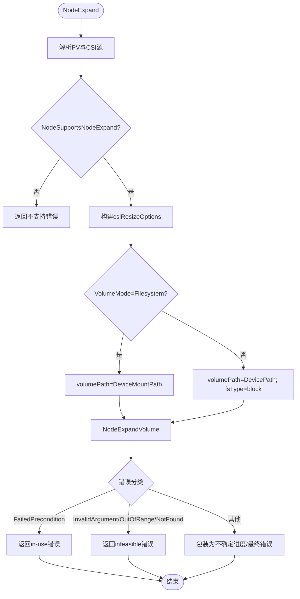
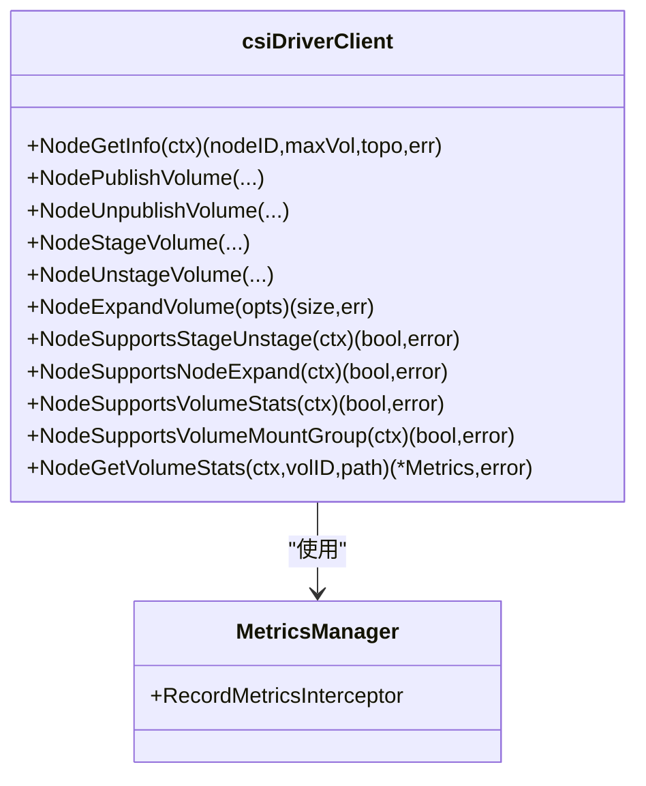
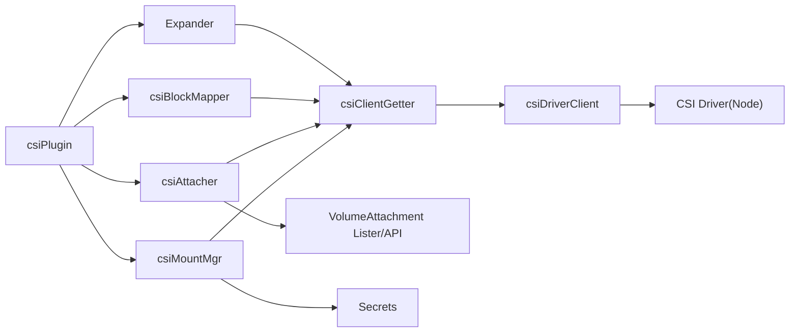

# CSI Volume插件

<cite>
**本文引用的文件**   
- [pkg/volume/csi/csi_plugin.go](file://pkg/volume/csi/csi_plugin.go)
- [pkg/volume/csi/csi_mounter.go](file://pkg/volume/csi/csi_mounter.go)
- [pkg/volume/csi/csi_attacher.go](file://pkg/volume/csi/csi_attacher.go)
- [pkg/volume/csi/csi_block.go](file://pkg/volume/csi/csi_block.go)
- [pkg/volume/csi/expander.go](file://pkg/volume/csi/expander.go)
- [pkg/volume/csi/csi_client.go](file://pkg/volume/csi/csi_client.go)
- [pkg/volume/csi/csi_util.go](file://pkg/volume/csi/csi_util.go)
- [pkg/volume/csi/nodeinfomanager/nodeinfomanager.go](file://pkg/volume/csi/nodeinfomanager/nodeinfomanager.go)
</cite>

## 目录
1. [简介](#简介)
2. [项目结构](#项目结构)
3. [核心组件](#核心组件)
4. [架构总览](#架构总览)
5. [详细组件分析](#详细组件分析)
6. [依赖关系分析](#依赖关系分析)
7. [性能与扩展性](#性能与扩展性)
8. [故障排查指南](#故障排查指南)
9. [结论](#结论)
10. [附录：开发与调试示例](#附录开发与调试示例)

## 简介
本技术文档聚焦于Kubernetes内嵌CSI Volume插件的实现，系统性阐述卷的挂载、卸载、附加和分离流程；深入解析csi_mounter、csi_attacher、csi_block三大核心实现机制；覆盖错误处理、重试与恢复策略；并说明在线扩容（NodeExpand）能力。文档同时提供面向开发者的调试方法与最佳实践建议，帮助读者快速定位问题并高效扩展CSI驱动集成。

## 项目结构
CSI Volume插件位于pkg/volume/csi目录下，围绕以下关键文件组织：
- csi_plugin.go：插件注册、生命周期、接口适配、CSINode初始化等
- csi_mounter.go：文件系统挂载/卸载、FSGroup/SELinux处理、元数据持久化
- csi_attacher.go：VolumeAttachment状态同步、设备级MountDevice/UnmountDevice
- csi_block.go：块设备映射、staging/publish路径管理、清理逻辑
- expander.go：节点侧扩容（NodeExpandVolume）
- csi_client.go：gRPC客户端封装、能力探测、访问模式映射、指标采集
- csi_util.go：通用工具函数（Secret读取、路径计算、上下文构造等）
- nodeinfomanager/nodeinfomanager.go：节点信息管理与迁移驱动标注

图表来源
- [pkg/volume/csi/csi_plugin.go:66-170](file://pkg/volume/csi/csi_plugin.go#L66-L170)
- [pkg/volume/csi/csi_mounter.go:64-120](file://pkg/volume/csi/csi_mounter.go#L64-L120)
- [pkg/volume/csi/csi_attacher.go:48-140](file://pkg/volume/csi/csi_attacher.go#L48-L140)
- [pkg/volume/csi/csi_block.go:86-141](file://pkg/volume/csi/csi_block.go#L86-L141)
- [pkg/volume/csi/expander.go:32-57](file://pkg/volume/csi/expander.go#L32-L57)
- [pkg/volume/csi/csi_client.go:108-170](file://pkg/volume/csi/csi_client.go#L108-L170)
- [pkg/volume/csi/csi_util.go:198-218](file://pkg/volume/csi/csi_util.go#L198-L218)
- [pkg/volume/csi/nodeinfomanager/nodeinfomanager.go](file://pkg/volume/csi/nodeinfomanager/nodeinfomanager.go)

章节来源
- [pkg/volume/csi/csi_plugin.go:66-170](file://pkg/volume/csi/csi_plugin.go#L66-L170)
- [pkg/volume/csi/csi_mounter.go:64-120](file://pkg/volume/csi/csi_mounter.go#L64-L120)
- [pkg/volume/csi/csi_attacher.go:48-140](file://pkg/volume/csi/csi_attacher.go#L48-L140)
- [pkg/volume/csi/csi_block.go:86-141](file://pkg/volume/csi/csi_block.go#L86-L141)
- [pkg/volume/csi/expander.go:32-57](file://pkg/volume/csi/expander.go#L32-L57)
- [pkg/volume/csi/csi_client.go:108-170](file://pkg/volume/csi/csi_client.go#L108-L170)
- [pkg/volume/csi/csi_util.go:198-218](file://pkg/volume/csi/csi_util.go#L198-L218)
- [pkg/volume/csi/nodeinfomanager/nodeinfomanager.go](file://pkg/volume/csi/nodeinfomanager/nodeinfomanager.go)

## 核心组件
- csiPlugin：插件入口，负责注册、版本校验、CSINode初始化、获取Mounter/Attacher/BlockMapper实例、支持特性判断（如RequiresRepublish、SELinuxMount）。
- csiMountMgr：文件系统卷挂载器，负责NodePublish/Unpublish、FSGroup/SELinux处理、元数据持久化与清理。
- csiAttacher：附加/分离控制器侧实现，基于VolumeAttachment对象进行状态同步，并提供设备级MountDevice/UnmountDevice（STAGE_UNSTAGE_VOLUME）。
- csiBlockMapper：块设备映射器，负责staging/publish路径管理、NodeStage/NodePublish/NodeUnstage/NodeUnpublish调用及清理。
- Expander：节点侧扩容实现，调用NodeExpandVolume，区分文件系统与块设备路径。
- csiDriverClient：CSI Node gRPC客户端封装，包含能力探测、访问模式映射、指标拦截、错误分类。
- csi_util：通用工具（Secret读取、路径计算、上下文构造、Pod信息注入等）。
- nodeinfomanager：节点信息管理与迁移驱动标注，辅助CSINode初始化与更新。

章节来源
- [pkg/volume/csi/csi_plugin.go:66-170](file://pkg/volume/csi/csi_plugin.go#L66-L170)
- [pkg/volume/csi/csi_mounter.go:64-120](file://pkg/volume/csi/csi_mounter.go#L64-L120)
- [pkg/volume/csi/csi_attacher.go:48-140](file://pkg/volume/csi/csi_attacher.go#L48-L140)
- [pkg/volume/csi/csi_block.go:86-141](file://pkg/volume/csi/csi_block.go#L86-L141)
- [pkg/volume/csi/expander.go:32-57](file://pkg/volume/csi/expander.go#L32-L57)
- [pkg/volume/csi/csi_client.go:108-170](file://pkg/volume/csi/csi_client.go#L108-L170)
- [pkg/volume/csi/csi_util.go:198-218](file://pkg/volume/csi/csi_util.go#L198-L218)
- [pkg/volume/csi/nodeinfomanager/nodeinfomanager.go](file://pkg/volume/csi/nodeinfomanager/nodeinfomanager.go)

## 架构总览
下图展示从Kubelet到CSI驱动的端到端交互，包括附加、设备挂载、文件系统发布、卸载与清理。

图表来源
- [pkg/volume/csi/csi_attacher.go:63-170](file://pkg/volume/csi/csi_attacher.go#L63-L170)
- [pkg/volume/csi/csi_block.go:143-204](file://pkg/volume/csi/csi_block.go#L143-L204)
- [pkg/volume/csi/csi_mounter.go:99-120](file://pkg/volume/csi/csi_mounter.go#L99-L120)
- [pkg/volume/csi/expander.go:38-57](file://pkg/volume/csi/expander.go#L38-L57)
- [pkg/volume/csi/csi_client.go:211-287](file://pkg/volume/csi/csi_client.go#L211-L287)

## 详细组件分析

### csiPlugin（插件入口与生命周期）
- 插件注册与验证：通过RegistrationHandler接收sidecar注册的驱动名称、endpoint与版本列表，校验最高兼容版本并存储。
- CSINode初始化：等待API Server可用后，初始化迁移驱动标注，必要时阻止Kubelet Ready直到完成。
- 动态更新：当检测到资源耗尽错误时，触发CSIDriver信息更新以刷新可分配数量。
- 能力与模式：根据CSIDriver.Spec决定是否需要republish、是否支持SELinuxMount、是否支持特定VolumeLifecycleMode。

图表来源
- [pkg/volume/csi/csi_plugin.go:85-170](file://pkg/volume/csi/csi_plugin.go#L85-L170)
- [pkg/volume/csi/csi_plugin.go:281-429](file://pkg/volume/csi/csi_plugin.go#L281-L429)
- [pkg/volume/csi/csi_plugin.go:474-538](file://pkg/volume/csi/csi_plugin.go#L474-L538)
- [pkg/volume/csi/csi_plugin.go:663-720](file://pkg/volume/csi/csi_plugin.go#L663-L720)
- [pkg/volume/csi/csi_plugin.go:729-800](file://pkg/volume/csi/csi_plugin.go#L729-L800)

章节来源
- [pkg/volume/csi/csi_plugin.go:85-170](file://pkg/volume/csi/csi_plugin.go#L85-L170)
- [pkg/volume/csi/csi_plugin.go:281-429](file://pkg/volume/csi/csi_plugin.go#L281-L429)
- [pkg/volume/csi/csi_plugin.go:474-538](file://pkg/volume/csi/csi_plugin.go#L474-L538)
- [pkg/volume/csi/csi_plugin.go:663-720](file://pkg/volume/csi/csi_plugin.go#L663-L720)
- [pkg/volume/csi/csi_plugin.go:729-800](file://pkg/volume/csi/csi_plugin.go#L729-L800)

### csi_mounter（文件系统挂载与权限控制）
- 挂载流程SetUpAt：
  - 获取CSI客户端与操作上下文
  - 校验VolumeLifecycleMode与FSGroup策略
  - 准备目标目录、注入Pod信息与ServiceAccount Token属性
  - 可选：若驱动支持VOLUME_MOUNT_GROUP则委托驱动应用FSGroup
  - 可选：启用SELinuxMountReadWriteOncePod特性时注入SELinux标签
  - 保存卷元数据至JSON文件
  - 调用NodePublishVolume完成发布
  - 若未启用SELinux且需要重标记，记录SELinux需求
  - 若驱动不支持FSGroup且满足条件，由Kubelet执行FSGroup变更
- 卸载流程TearDownAt：
  - 调用NodeUnpublishVolume
  - 清理目标目录与元数据文件（若为空）
- 权限与策略：
  - FSGroup策略来源于CSIDriver.Spec.FSGroupPolicy，默认Read/WriteOnce+fsType
  - SELinux支持取决于CSIDriver.Spec.SELinuxMount与特性开关

图表来源
- [pkg/volume/csi/csi_mounter.go:99-120](file://pkg/volume/csi/csi_mounter.go#L99-L120)
- [pkg/volume/csi/csi_mounter.go:121-210](file://pkg/volume/csi/csi_mounter.go#L121-L210)
- [pkg/volume/csi/csi_mounter.go:211-361](file://pkg/volume/csi/csi_mounter.go#L211-L361)
- [pkg/volume/csi/csi_mounter.go:434-472](file://pkg/volume/csi/csi_mounter.go#L434-L472)
- [pkg/volume/csi/csi_mounter.go:474-532](file://pkg/volume/csi/csi_mounter.go#L474-L532)

章节来源
- [pkg/volume/csi/csi_mounter.go:99-120](file://pkg/volume/csi/csi_mounter.go#L99-L120)
- [pkg/volume/csi/csi_mounter.go:121-210](file://pkg/volume/csi/csi_mounter.go#L121-L210)
- [pkg/volume/csi/csi_mounter.go:211-361](file://pkg/volume/csi/csi_mounter.go#L211-L361)
- [pkg/volume/csi/csi_mounter.go:434-472](file://pkg/volume/csi/csi_mounter.go#L434-L472)
- [pkg/volume/csi/csi_mounter.go:474-532](file://pkg/volume/csi/csi_mounter.go#L474-L532)

### csi_attacher（附加/分离与设备挂载）
- 附加Attach：
  - 在AttachDetachController上下文中创建VolumeAttachment对象
  - 使用listers轮询状态直至Attached为true或出现错误
- 等待WaitForAttach：
  - 直接查询VolumeAttachment状态，返回attachID作为设备标识（实际设备路径由后续阶段确定）
- 设备挂载MountDevice：
  - 检查STAGE_UNSTAGE_VOLUME能力
  - 准备deviceMountPath并保存元数据
  - 可选：若驱动支持VOLUME_MOUNT_GROUP，委托驱动应用FSGroup
  - 调用NodeStageVolume完成设备级预挂载
- 分离Detach：
  - 删除VolumeAttachment对象并等待其消失或确认无detach错误
- 设备卸载UnmountDevice：
  - 若支持STAGE_UNSTAGE_VOLUME，调用NodeUnstageVolume并清理全局目录与元数据

图表来源
- [pkg/volume/csi/csi_attacher.go:63-170](file://pkg/volume/csi/csi_attacher.go#L63-L170)
- [pkg/volume/csi/csi_attacher.go:264-411](file://pkg/volume/csi/csi_attacher.go#L264-L411)
- [pkg/volume/csi/csi_attacher.go:417-483](file://pkg/volume/csi/csi_attacher.go#L417-L483)
- [pkg/volume/csi/csi_attacher.go:526-590](file://pkg/volume/csi/csi_attacher.go#L526-L590)

章节来源
- [pkg/volume/csi/csi_attacher.go:63-170](file://pkg/volume/csi/csi_attacher.go#L63-L170)
- [pkg/volume/csi/csi_attacher.go:264-411](file://pkg/volume/csi/csi_attacher.go#L264-L411)
- [pkg/volume/csi/csi_attacher.go:417-483](file://pkg/volume/csi/csi_attacher.go#L417-L483)
- [pkg/volume/csi/csi_attacher.go:526-590](file://pkg/volume/csi/csi_attacher.go#L526-L590)

### csi_block（块设备映射与生命周期）
- 路径管理：
  - Global map path：plugins/kubernetes.io/csi/volumeDevices/{specName}/dev
  - Staging path：.../staging/{specName}
  - Publish path：.../publish/{specName}/{podUID}
  - Pod device map path：pods/{podUID}/volumeDevices/kubernetes.io~csi/{specName}
- 生命周期：
  - SetUpDevice：检查skipAttach，获取attachment元数据，调用NodeStageVolume
  - MapPodDevice：调用NodePublishVolume将设备发布到pod专属路径
  - UnmapPodDevice：调用NodeUnpublishVolume
  - TearDownDevice：调用NodeUnstageVolume并清理staging/publish目录与data文件
- 清理策略：
  - 在unstage完成后移除staging与publish目录，以及volumeDevices下data与dev残留

图表来源
- [pkg/volume/csi/csi_block.go:103-141](file://pkg/volume/csi/csi_block.go#L103-L141)
- [pkg/volume/csi/csi_block.go:143-204](file://pkg/volume/csi/csi_block.go#L143-L204)
- [pkg/volume/csi/csi_block.go:279-340](file://pkg/volume/csi/csi_block.go#L279-L340)
- [pkg/volume/csi/csi_block.go:342-395](file://pkg/volume/csi/csi_block.go#L342-L395)
- [pkg/volume/csi/csi_block.go:400-441](file://pkg/volume/csi/csi_block.go#L400-L441)
- [pkg/volume/csi/csi_block.go:443-506](file://pkg/volume/csi/csi_block.go#L443-L506)
- [pkg/volume/csi/csi_block.go:508-527](file://pkg/volume/csi/csi_block.go#L508-L527)

章节来源
- [pkg/volume/csi/csi_block.go:103-141](file://pkg/volume/csi/csi_block.go#L103-L141)
- [pkg/volume/csi/csi_block.go:143-204](file://pkg/volume/csi/csi_block.go#L143-L204)
- [pkg/volume/csi/csi_block.go:279-340](file://pkg/volume/csi/csi_block.go#L279-L340)
- [pkg/volume/csi/csi_block.go:342-395](file://pkg/volume/csi/csi_block.go#L342-L395)
- [pkg/volume/csi/csi_block.go:400-441](file://pkg/volume/csi/csi_block.go#L400-L441)
- [pkg/volume/csi/csi_block.go:443-506](file://pkg/volume/csi/csi_block.go#L443-L506)
- [pkg/volume/csi/csi_block.go:508-527](file://pkg/volume/csi/csi_block.go#L508-L527)

### 在线扩容（expander）
- 入口NodeExpand：
  - 解析CSIPersistentVolumeSource，构建csiResizeOptions
  - 检测NodeExpand能力，若不支持返回“不支持”错误
  - 根据VolumeMode选择volumePath（文件系统使用DeviceMountPath，块设备使用DevicePath）
  - 调用NodeExpandVolume并处理错误分类（in-use/infeasible/其他）
- 错误分类：
  - FailedPrecondition：表示驱动不支持对使用中卷扩容
  - InvalidArgument/OutOfRange/NotFound：视为不可行错误
  - 其他：包装为不确定进度或最终错误

图表来源
- [pkg/volume/csi/expander.go:38-57](file://pkg/volume/csi/expander.go#L38-L57)
- [pkg/volume/csi/expander.go:59-130](file://pkg/volume/csi/expander.go#L59-L130)
- [pkg/volume/csi/expander.go:132-165](file://pkg/volume/csi/expander.go#L132-L165)

章节来源
- [pkg/volume/csi/expander.go:38-57](file://pkg/volume/csi/expander.go#L38-L57)
- [pkg/volume/csi/expander.go:59-130](file://pkg/volume/csi/expander.go#L59-L130)
- [pkg/volume/csi/expander.go:132-165](file://pkg/volume/csi/expander.go#L132-L165)

### gRPC客户端与能力探测（csi_client）
- 连接与客户端创建：
  - newCsiDriverClient从DriversStore查找已注册驱动endpoint
  - newGrpcConn建立unix socket gRPC连接，注入指标拦截器
- 访问模式映射：
  - 根据驱动是否支持SINGLE_NODE_MULTI_WRITER，选择不同映射策略
- 能力探测：
  - NodeSupportsStageUnstage、NodeSupportsNodeExpand、NodeSupportsVolumeStats、NodeSupportsVolumeMountGroup等
- 错误分类：
  - isFinalError识别最终错误与非最终错误（如Unavailable、ResourceExhausted、Aborted等）

图表来源
- [pkg/volume/csi/csi_client.go:108-170](file://pkg/volume/csi/csi_client.go#L108-L170)
- [pkg/volume/csi/csi_client.go:211-287](file://pkg/volume/csi/csi_client.go#L211-L287)
- [pkg/volume/csi/csi_client.go:289-357](file://pkg/volume/csi/csi_client.go#L289-L357)
- [pkg/volume/csi/csi_client.go:386-454](file://pkg/volume/csi/csi_client.go#L386-L454)
- [pkg/volume/csi/csi_client.go:482-530](file://pkg/volume/csi/csi_client.go#L482-L530)
- [pkg/volume/csi/csi_client.go:532-545](file://pkg/volume/csi/csi_client.go#L532-L545)
- [pkg/volume/csi/csi_client.go:580-612](file://pkg/volume/csi/csi_client.go#L580-L612)
- [pkg/volume/csi/csi_client.go:714-736](file://pkg/volume/csi/csi_client.go#L714-L736)

章节来源
- [pkg/volume/csi/csi_client.go:108-170](file://pkg/volume/csi/csi_client.go#L108-L170)
- [pkg/volume/csi/csi_client.go:211-287](file://pkg/volume/csi/csi_client.go#L211-L287)
- [pkg/volume/csi/csi_client.go:289-357](file://pkg/volume/csi/csi_client.go#L289-L357)
- [pkg/volume/csi/csi_client.go:386-454](file://pkg/volume/csi/csi_client.go#L386-L454)
- [pkg/volume/csi/csi_client.go:482-530](file://pkg/volume/csi/csi_client.go#L482-L530)
- [pkg/volume/csi/csi_client.go:532-545](file://pkg/volume/csi/csi_client.go#L532-L545)
- [pkg/volume/csi/csi_client.go:580-612](file://pkg/volume/csi/csi_client.go#L580-L612)
- [pkg/volume/csi/csi_client.go:714-736](file://pkg/volume/csi/csi_client.go#L714-L736)

## 依赖关系分析
- 组件耦合：
  - csiPlugin聚合csiMountMgr、csiAttacher、csiBlockMapper与Expander，统一对外暴露Volume插件接口
  - csiMountMgr与csiBlockMapper共享csiClientGetter缓存，避免重复创建gRPC连接
  - csiAttacher依赖VolumeAttachment lister进行状态同步，减少API压力
- 外部依赖：
  - API Server：VolumeAttachment、Secrets、CSIDriver、Informer
  - CSI Driver：Node服务gRPC接口
- 潜在循环依赖：
  - 当前实现未见明显循环导入，主要依赖单向调用（插件→管理器→客户端→驱动）

图表来源
- [pkg/volume/csi/csi_plugin.go:474-538](file://pkg/volume/csi/csi_plugin.go#L474-L538)
- [pkg/volume/csi/csi_mounter.go:64-120](file://pkg/volume/csi/csi_mounter.go#L64-L120)
- [pkg/volume/csi/csi_attacher.go:48-140](file://pkg/volume/csi/csi_attacher.go#L48-L140)
- [pkg/volume/csi/csi_block.go:86-141](file://pkg/volume/csi/csi_block.go#L86-L141)
- [pkg/volume/csi/expander.go:32-57](file://pkg/volume/csi/expander.go#L32-L57)
- [pkg/volume/csi/csi_client.go:547-578](file://pkg/volume/csi/csi_client.go#L547-L578)

章节来源
- [pkg/volume/csi/csi_plugin.go:474-538](file://pkg/volume/csi/csi_plugin.go#L474-L538)
- [pkg/volume/csi/csi_mounter.go:64-120](file://pkg/volume/csi/csi_mounter.go#L64-L120)
- [pkg/volume/csi/csi_attacher.go:48-140](file://pkg/volume/csi/csi_attacher.go#L48-L140)
- [pkg/volume/csi/csi_block.go:86-141](file://pkg/volume/csi/csi_block.go#L86-L141)
- [pkg/volume/csi/expander.go:32-57](file://pkg/volume/csi/expander.go#L32-L57)
- [pkg/volume/csi/csi_client.go:547-578](file://pkg/volume/csi/csi_client.go#L547-L578)

## 性能与扩展性
- 连接复用：csiClientGetter采用读写锁保护的单例缓存，避免频繁创建gRPC连接
- 指标采集：newGrpcConn注入RecordMetricsInterceptor，便于监控CSI调用耗时与错误率
- 能力探测缓存：NodeGetCapabilities按需调用，减少不必要的RPC开销
- 批量状态轮询：AttachDetachController侧使用listers轮询VolumeAttachment，降低API压力
- 可扩展点：
  - 自定义访问模式映射（支持多写能力）
  - 扩展FSGroup策略与SELinuxMount行为
  - 增加新的Node能力探测项

[本节为通用指导，不直接分析具体文件]

## 故障排查指南
- 常见错误分类与处理：
  - 非最终错误（UncertainProgress）：如Unavailable、ResourceExhausted、Aborted、DeadlineExceeded，应重试
  - 最终错误：如InvalidArgument、NotFound、OutOfRange，不应重试
  - in-use错误：FailedPrecondition表示驱动不支持使用中卷扩容
- 典型问题定位：
  - 挂载失败：检查NodePublishVolume返回值与目录清理逻辑
  - 设备挂载失败：确认STAGE_UNSTAGE_VOLUME能力与NodeStageVolume结果
  - 扩容失败：查看NodeExpandVolume返回码与错误分类
  - 权限问题：核对FSGroup策略与SELinuxMount配置
- 日志与指标：
  - 关注klog日志前缀“kubernetes.io/csi”
  - 利用指标拦截器观察RPC延迟与错误分布

章节来源
- [pkg/volume/csi/csi_client.go:714-736](file://pkg/volume/csi/csi_client.go#L714-L736)
- [pkg/volume/csi/expander.go:132-165](file://pkg/volume/csi/expander.go#L132-L165)
- [pkg/volume/csi/csi_mounter.go:316-361](file://pkg/volume/csi/csi_mounter.go#L316-L361)
- [pkg/volume/csi/csi_attacher.go:485-524](file://pkg/volume/csi/csi_attacher.go#L485-L524)

## 结论
Kubernetes内嵌CSI Volume插件通过清晰的职责划分与稳健的错误处理机制，实现了跨多种存储后端的一致卷管理能力。csi_mounter、csi_attacher与csi_block分别覆盖文件系统、附加与块设备场景，配合expander实现在线扩容。借助能力探测、FSGroup/SELinux支持与指标采集，系统在可靠性与可观测性方面具备良好基础。开发者可通过扩展访问模式映射、FSGroup策略与新增能力探测项进一步定制行为。

[本节为总结，不直接分析具体文件]

## 附录：开发与调试示例
- 单元测试参考：
  - pkg/volume/csi/csi_test.go：覆盖PersistentVolume、Inline Ephemeral、驱动模式校验等场景
- 端到端测试：
  - test/e2e/storage/csi_volumes.go、csi_inline.go、csi_node.go：验证完整生命周期与特性
- 调试建议：
  - 开启高详细度日志（klog V(4)+），关注“kubernetes.io/csi”前缀
  - 检查VolumeAttachment状态与错误字段
  - 使用metrics拦截器输出CSI调用指标
  - 针对FSGroup/SELinux场景，验证CSIDriver.Spec配置与特性开关

章节来源
- [pkg/volume/csi/csi_test.go:40-200](file://pkg/volume/csi/csi_test.go#L40-L200)
- [test/e2e/storage/csi_volumes.go](file://test/e2e/storage/csi_volumes.go)
- [test/e2e/storage/csi_inline.go](file://test/e2e/storage/csi_inline.go)
- [test/e2e/storage/csi_node.go](file://test/e2e/storage/csi_node.go)