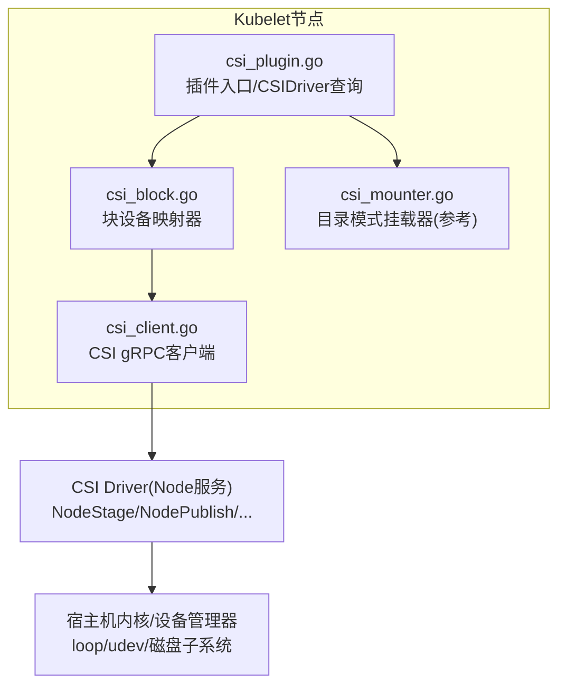
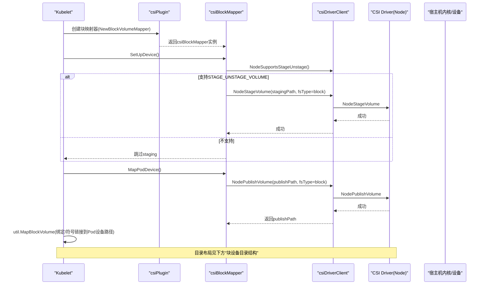
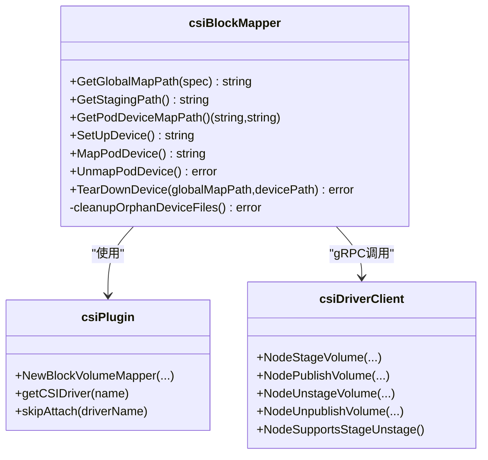
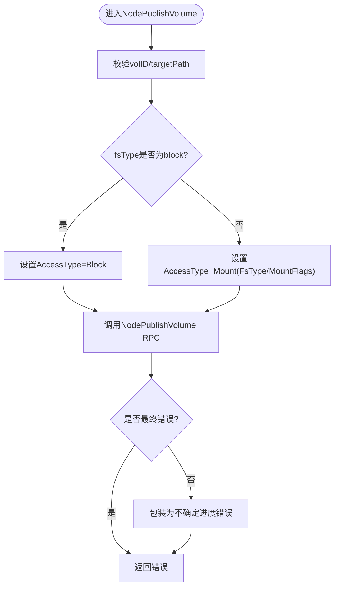
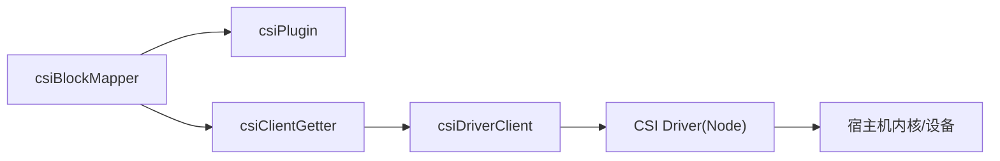
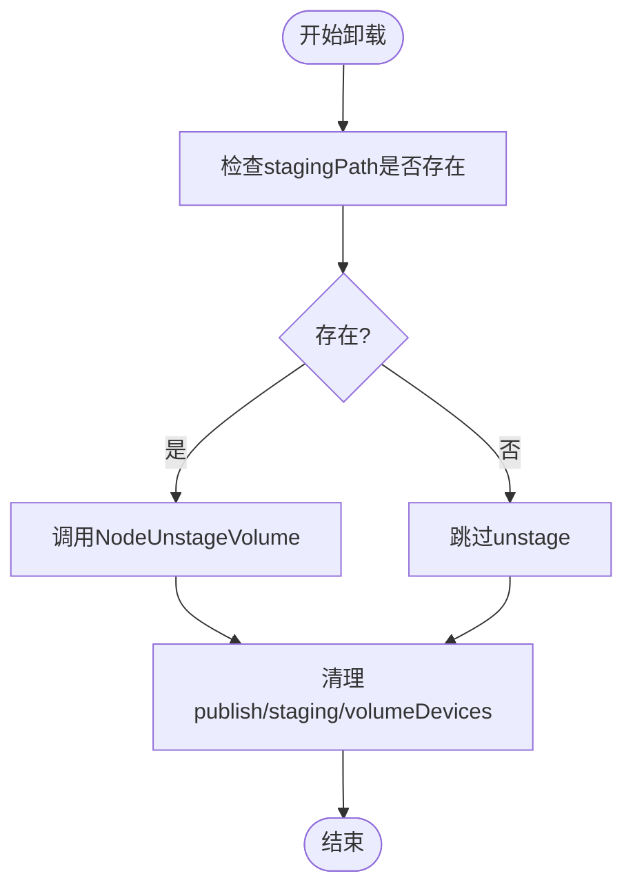

# CSI块设备处理

<cite>
**本文引用的文件**   
- [csi_block.go](file://pkg/volume/csi/csi_block.go)
- [csi_plugin.go](file://pkg/volume/csi/csi_plugin.go)
- [csi_client.go](file://pkg/volume/csi/csi_client.go)
- [csi_mounter.go](file://pkg/volume/csi/csi_mounter.go)
</cite>

## 目录
1. [简介](#简介)
2. [项目结构](#项目结构)
3. [核心组件](#核心组件)
4. [架构总览](#架构总览)
5. [详细组件分析](#详细组件分析)
6. [依赖关系分析](#依赖关系分析)
7. [性能与I/O优化](#性能与io优化)
8. [故障检测与恢复](#故障检测与恢复)
9. [排障指南](#排障指南)
10. [结论](#结论)

## 简介
本技术文档聚焦Kubernetes节点侧CSI插件的块设备处理实现，围绕以下目标展开：
- 块设备映射、扇区大小计算与性能优化机制
- 块设备的格式化、挂载选项配置与文件系统类型检测
- 安全访问控制（权限设置与SELinux上下文）
- 完整的块设备操作流程示例（设备发现、路径管理、状态监控）
- 与底层存储系统的交互过程（I/O路径优化与缓存策略）
- 故障检测与恢复机制

说明：
- 扇区大小计算：当前仓库未提供显式扇区大小探测或计算的代码；该能力通常由驱动或内核/udev提供。CSI层通过NodeGetVolumeStats上报容量与用量，但不直接暴露扇区大小。
- 格式化与文件系统类型检测：块模式不执行格式化；文件系统类型仅在目录模式下使用，且由CSIDriver声明与PV/PVC参数决定。
- I/O路径与缓存：CSI Node服务负责具体I/O路径与缓存策略；Kubelet侧仅负责调用CSI RPC并管理生命周期与路径。

## 项目结构
本节概述与CSI块设备相关的核心文件及其职责：
- csi_plugin.go：插件注册、生命周期、CSIDriver信息获取、SELinuxMount支持判断、构造BlockVolumeMapper等
- csi_block.go：块设备映射器实现，包含SetUpDevice/MapPodDevice/TearDownDevice/UnmapPodDevice等流程
- csi_client.go：CSI gRPC客户端封装，NodeStage/NodePublish/NodeUnstage/NodeUnpublish/NodeGetVolumeStats等
- csi_mounter.go：目录模式挂载器（用于对比与参考），包含FSGroup、SELinux、Token注入等逻辑

图示来源
- [csi_plugin.go:66-170](file://pkg/volume/csi/csi_plugin.go#L66-L170)
- [csi_block.go:86-141](file://pkg/volume/csi/csi_block.go#L86-L141)
- [csi_client.go:109-170](file://pkg/volume/csi/csi_client.go#L109-L170)
- [csi_mounter.go:64-94](file://pkg/volume/csi/csi_mounter.go#L64-L94)

章节来源
- [csi_plugin.go:66-170](file://pkg/volume/csi/csi_plugin.go#L66-L170)
- [csi_block.go:86-141](file://pkg/volume/csi/csi_block.go#L86-L141)
- [csi_client.go:109-170](file://pkg/volume/csi/csi_client.go#L109-L170)
- [csi_mounter.go:64-94](file://pkg/volume/csi/csi_mounter.go#L64-L94)

## 核心组件
- csiPlugin：插件初始化、CSIDriver列表监听、注册/反注册处理、NewBlockVolumeMapper构造块映射器、SELinuxMount能力判断等
- csiBlockMapper：块设备映射器，负责全局映射路径、Pod设备映射路径、Staging/Publish阶段调用、清理孤儿文件等
- csiDriverClient：CSI gRPC客户端，封装NodeGetInfo/NodeStageVolume/NodePublishVolume/NodeUnstageVolume/NodeUnpublishVolume/NodeGetVolumeStats等
- csiMountMgr：目录模式挂载器（用于对照理解FSGroup、SELinux、Token注入等通用逻辑）

章节来源
- [csi_plugin.go:281-429](file://pkg/volume/csi/csi_plugin.go#L281-L429)
- [csi_block.go:86-141](file://pkg/volume/csi/csi_block.go#L86-L141)
- [csi_client.go:109-170](file://pkg/volume/csi/csi_client.go#L109-L170)
- [csi_mounter.go:64-94](file://pkg/volume/csi/csi_mounter.go#L64-L94)

## 架构总览
下图展示从Kubelet到CSI驱动再到宿主机的整体交互，以及块设备在Staging/Publish阶段的目录布局。

图示来源
- [csi_block.go:279-395](file://pkg/volume/csi/csi_block.go#L279-L395)
- [csi_client.go:386-454](file://pkg/volume/csi/csi_client.go#L386-L454)
- [csi_client.go:211-287](file://pkg/volume/csi/csi_client.go#L211-L287)

## 详细组件分析

### 块设备映射器(csiBlockMapper)
- 关键职责
  - 生成全局映射路径与Pod设备映射路径
  - 根据CSIDriver能力决定是否进行Staging
  - 调用NodeStageVolume/NodePublishVolume/NodeUnstageVolume/NodeUnpublishVolume
  - 清理孤儿文件与目录
- 重要方法
  - GetGlobalMapPath/GetPodDeviceMapPath：定义全局与Pod级设备映射路径
  - SetUpDevice：获取Attachment元数据、检查STAGE_UNSTAGE_VOLUME、调用NodeStageVolume
  - MapPodDevice：调用NodePublishVolume，返回publishPath供上层做符号链接/绑定
  - UnmapPodDevice/TearDownDevice：分别卸载发布与取消暂存，并清理目录
  - cleanupOrphanDeviceFiles：删除publish/staging及volumeDevices下残留

图示来源
- [csi_block.go:103-141](file://pkg/volume/csi/csi_block.go#L103-L141)
- [csi_block.go:279-475](file://pkg/volume/csi/csi_block.go#L279-L475)
- [csi_client.go:386-480](file://pkg/volume/csi/csi_client.go#L386-L480)

章节来源
- [csi_block.go:103-141](file://pkg/volume/csi/csi_block.go#L103-L141)
- [csi_block.go:279-475](file://pkg/volume/csi/csi_block.go#L279-L475)

### CSI客户端(csiDriverClient)
- 关键职责
  - 建立与CSI驱动的gRPC连接
  - 将Kubernetes访问模式映射为CSI AccessMode
  - 封装Node系列RPC调用与错误分类（最终错误/不确定进度）
- 重要特性
  - 单写多写能力探测与AccessMode映射
  - NodeGetVolumeStats统一解析Usage与VolumeCondition
  - isFinalError区分可重试与终态错误

图示来源
- [csi_client.go:211-287](file://pkg/volume/csi/csi_client.go#L211-L287)
- [csi_client.go:714-736](file://pkg/volume/csi/csi_client.go#L714-L736)

章节来源
- [csi_client.go:211-287](file://pkg/volume/csi/csi_client.go#L211-L287)
- [csi_client.go:714-736](file://pkg/volume/csi/csi_client.go#L714-L736)

### 插件与CSIDriver集成(csiPlugin)
- 关键职责
  - 插件初始化、CSIDriver列表监听、注册/反注册处理
  - 判断是否需要Republish、是否支持SELinuxMount
  - 构造BlockVolumeMapper并持久化卷数据以便反序列化重建
- SELinuxMount支持
  - 当启用相关特性门控时，依据CSIDriver.Spec.SELinuxMount决定是否传递-o context

章节来源
- [csi_plugin.go:281-429](file://pkg/volume/csi/csi_plugin.go#L281-L429)
- [csi_plugin.go:637-656](file://pkg/volume/csi/csi_plugin.go#L637-L656)

### 目录模式挂载器(参考)csmountMgr
- 用于对比理解FSGroup、SELinux、ServiceAccount Token注入等通用逻辑
- 块模式不使用此挂载器，但可帮助理解CSI插件在目录模式下的行为差异

章节来源
- [csi_mounter.go:99-361](file://pkg/volume/csi/csi_mounter.go#L99-L361)

## 依赖关系分析
- 组件耦合
  - csiBlockMapper依赖csiPlugin以获取CSIDriver信息与路径工具
  - csiBlockMapper通过csiClientGetter延迟创建csiDriverClient
  - csiDriverClient依赖注册的CSI驱动端点与MetricsManager
- 外部依赖
  - CSI驱动Node服务（gRPC）
  - 宿主机内核/设备子系统（loop/udev/磁盘）

图示来源
- [csi_block.go:86-141](file://pkg/volume/csi/csi_block.go#L86-L141)
- [csi_client.go:547-578](file://pkg/volume/csi/csi_client.go#L547-L578)

章节来源
- [csi_block.go:86-141](file://pkg/volume/csi/csi_block.go#L86-L141)
- [csi_client.go:547-578](file://pkg/volume/csi/csi_client.go#L547-L578)

## 性能与I/O优化
- 块模式路径
  - 块模式(fsType=block)避免文件系统层开销，直接以块设备形式暴露给容器
  - 若驱动支持STAGE_UNSTAGE_VOLUME，先Stage再Publish，有利于资源复用与快速重发布
- 访问模式映射
  - 根据驱动能力选择SINGLE_NODE_MULTI_WRITER或SINGLE_NODE_WRITER，减少不必要的锁竞争
- 指标采集
  - NodeGetVolumeStats统一收集容量/用量/Inode/异常状态，便于上层监控与告警
- 注意
  - 扇区大小计算：仓库中未见显式实现；如需扇区级优化，应在驱动侧或内核侧完成

章节来源
- [csi_client.go:588-664](file://pkg/volume/csi/csi_client.go#L588-L664)
- [csi_client.go:490-530](file://pkg/volume/csi/csi_client.go#L490-L530)
- [csi_block.go:143-204](file://pkg/volume/csi/csi_block.go#L143-L204)

## 故障检测与恢复
- 错误分类
  - isFinalError识别“最终错误”，其余视为“不确定进度”，便于重试与幂等处理
- 幂等与清理
  - TearDownDevice在调用NodeUnstageVolume前检查stagingPath是否存在
  - cleanupOrphanDeviceFiles在取消暂存后清理publish/staging与volumeDevices残留
- 资源耗尽
  - VerifyExhaustedResource检测VolumeAttachment中的ResourceExhausted错误，触发CSIDriver更新

图示来源
- [csi_block.go:444-506](file://pkg/volume/csi/csi_block.go#L444-L506)
- [csi_client.go:714-736](file://pkg/volume/csi/csi_client.go#L714-L736)
- [csi_plugin.go:192-240](file://pkg/volume/csi/csi_plugin.go#L192-L240)

章节来源
- [csi_block.go:444-506](file://pkg/volume/csi/csi_block.go#L444-L506)
- [csi_client.go:714-736](file://pkg/volume/csi/csi_client.go#L714-L736)
- [csi_plugin.go:192-240](file://pkg/volume/csi/csi_plugin.go#L192-L240)

## 排障指南
- 常见问题定位
  - 无法获取CSI客户端：通常为驱动尚未注册或socket不可用，需检查驱动Registrar与插件注册日志
  - STAGE_UNSTAGE_VOLUME未启用：将跳过Stage阶段，直接Publish；确认驱动能力
  - 资源耗尽(ResourceExhausted)：查看VolumeAttachment状态，必要时触发CSIDriver更新
  - SELinux上下文：确认CSIDriver.Spec.SELinuxMount与特性门控是否开启
- 建议操作
  - 查看Kubelet日志中“blockMapper.*”和“mounter.*”关键字
  - 核对节点上目录布局是否符合预期（staging/publish/dev等）
  - 使用NodeGetVolumeStats验证容量与异常状态

章节来源
- [csi_block.go:279-395](file://pkg/volume/csi/csi_block.go#L279-L395)
- [csi_plugin.go:637-656](file://pkg/volume/csi/csi_plugin.go#L637-L656)
- [csi_client.go:588-664](file://pkg/volume/csi/csi_client.go#L588-L664)

## 结论
- 块设备处理在Kubelet侧通过csiBlockMapper协调Staging/Publish流程，结合csiDriverClient与CSI驱动协作完成设备接入与发布
- 块模式避免文件系统开销，适合低延迟与高吞吐场景；是否启用Stage取决于驱动能力
- 安全方面，SELinuxMount与FSGroup在目录模式下更常见；块模式主要依赖驱动与内核权限模型
- 性能与可靠性通过访问模式映射、指标采集、错误分类与幂等清理共同保障