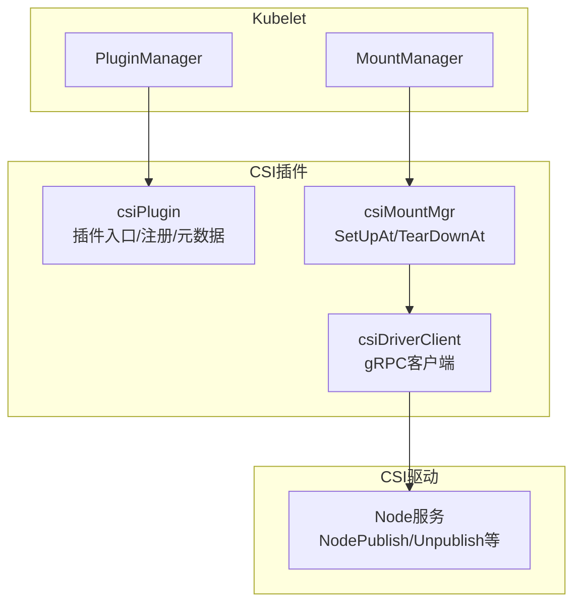
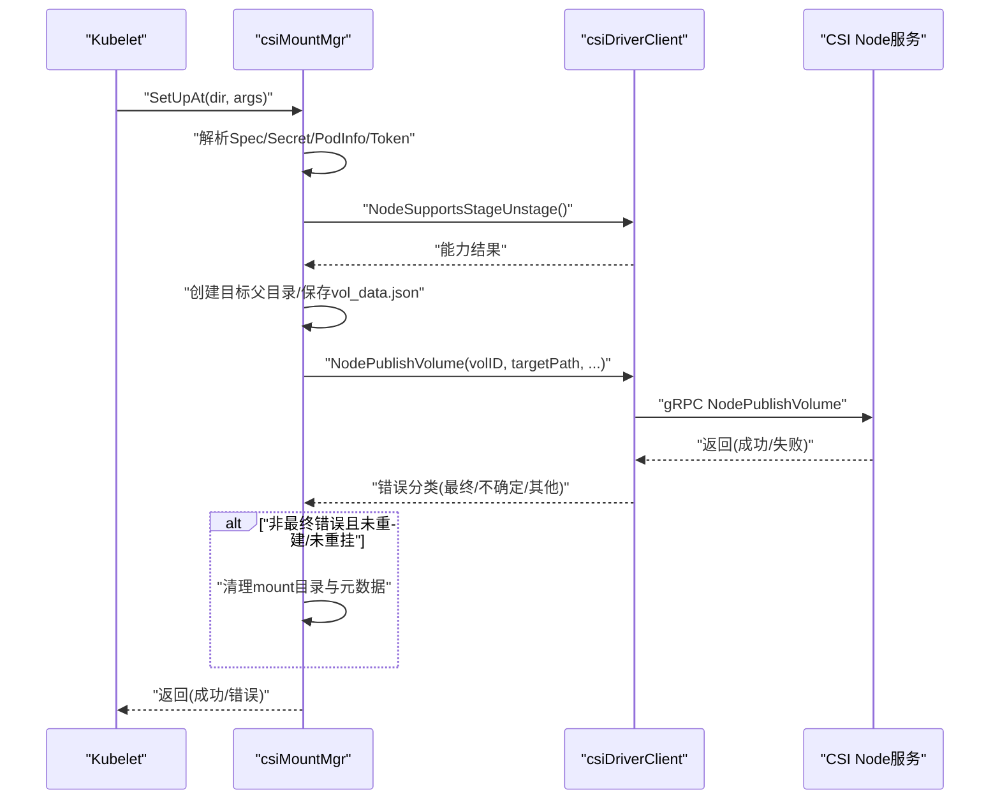
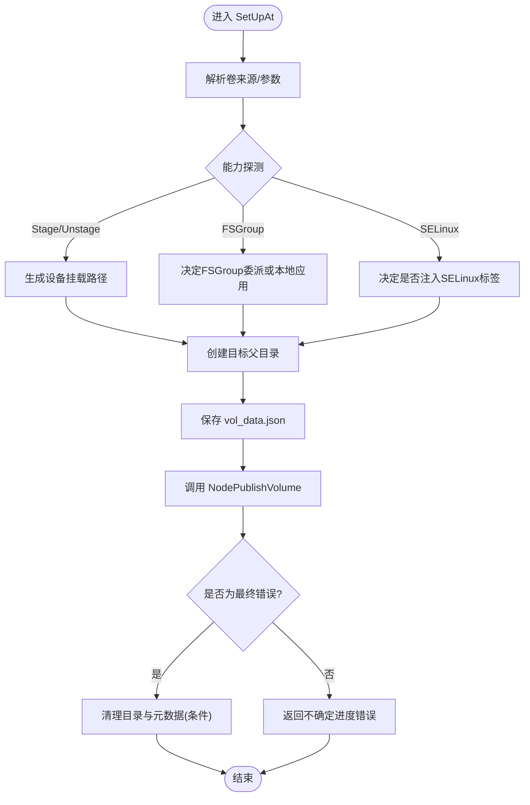
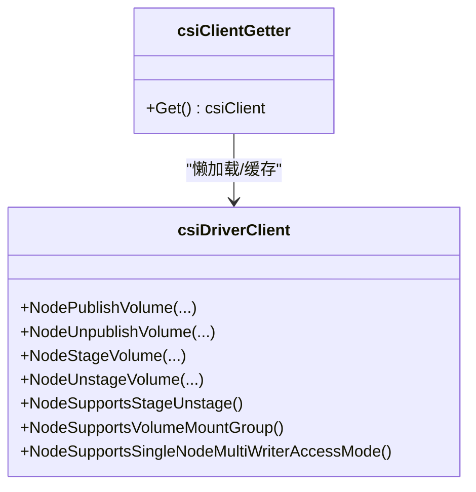
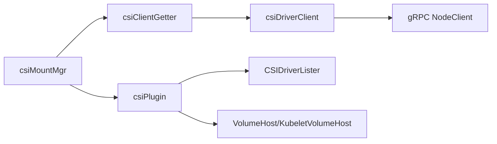

# CSI挂载管理器

<cite>
**本文引用的文件**   
- [csi_mounter.go](file://pkg/volume/csi/csi_mounter.go)
- [csi_client.go](file://pkg/volume/csi/csi_client.go)
- [csi_plugin.go](file://pkg/volume/csi/csi_plugin.go)
</cite>

## 目录
1. [简介](#简介)
2. [项目结构](#项目结构)
3. [核心组件](#核心组件)
4. [架构总览](#架构总览)
5. [详细组件分析](#详细组件分析)
6. [依赖关系分析](#依赖关系分析)
7. [性能考虑](#性能考虑)
8. [故障排查指南](#故障排查指南)
9. [结论](#结论)

## 简介
本文件面向Kubernetes节点侧CSI（Container Storage Interface）卷的挂载与生命周期管理，聚焦于csiMountMgr的实现细节。内容涵盖：
- 卷的挂载、卸载与生命周期管理
- SetUpAt方法的完整流程：参数解析、权限控制、SELinux标签处理、FSGroup应用
- TearDownAt方法的工作原理：调用NodeUnpublishVolume、清理目标路径与元数据
- 与CSI驱动器的交互：NodePublishVolume、NodeUnpublishVolume等RPC调用
- 错误分类与重试语义（瞬时错误/不确定进度错误/最终错误）
- 性能优化建议与常见问题排查

## 项目结构
本节聚焦与csiMountMgr直接相关的三个核心文件及其职责：
- csi_mounter.go：实现csiMountMgr，负责SetUpAt/TearDownAt、FSGroup策略、SELinux处理、元数据持久化与清理
- csi_client.go：封装与CSI Node服务的gRPC通信，包括NodePublishVolume、NodeUnpublishVolume、能力探测等
- csi_plugin.go：插件注册、CSIDriver信息获取、NewMounter/NewUnmounter构造、设备挂载辅助逻辑

图表来源
- [csi_plugin.go:474-538](file://pkg/volume/csi/csi_plugin.go#L474-L538)
- [csi_mounter.go:103-361](file://pkg/volume/csi/csi_mounter.go#L103-L361)
- [csi_client.go:211-287](file://pkg/volume/csi/csi_client.go#L211-L287)

章节来源
- [csi_plugin.go:474-538](file://pkg/volume/csi/csi_plugin.go#L474-L538)
- [csi_mounter.go:103-361](file://pkg/volume/csi/csi_mounter.go#L103-L361)
- [csi_client.go:211-287](file://pkg/volume/csi/csi_client.go#L211-L287)

## 核心组件
- csiMountMgr：实现volume.Mounter/Unmounter接口，封装一次挂载/卸载的生命周期，包含：
  - 参数校验与来源解析（Inline/Ephemeral vs Persistent）
  - 能力探测（Stage/Unstage、VOLUME_MOUNT_GROUP、SELinuxMount）
  - 元数据持久化（vol_data.json）
  - FSGroup策略决策与执行
  - SELinux标签注入或回退重标记
  - 调用NodePublishVolume/NodeUnpublishVolume
- csiDriverClient：对CSI Node gRPC接口的强类型封装，提供：
  - NodePublishVolume/NodeUnpublishVolume
  - NodeStageVolume/NodeUnstageVolume
  - 能力探测（NodeSupportsStageUnstage、NodeSupportsVolumeMountGroup等）
  - 访问模式映射（支持SINGLE_NODE_MULTI_WRITER等）
  - 错误分类（isFinalError）
- csiPlugin：插件注册、CSIDriver列表器、NewMounter/NewUnmounter构造、设备挂载路径生成、元数据读写

章节来源
- [csi_mounter.go:64-90](file://pkg/volume/csi/csi_mounter.go#L64-L90)
- [csi_client.go:109-170](file://pkg/volume/csi/csi_client.go#L109-L170)
- [csi_plugin.go:474-538](file://pkg/volume/csi/csi_plugin.go#L474-L538)

## 架构总览
下图展示从Kubelet发起挂载到CSI驱动完成发布的端到端序列。

图表来源
- [csi_mounter.go:103-361](file://pkg/volume/csi/csi_mounter.go#L103-L361)
- [csi_client.go:211-287](file://pkg/volume/csi/csi_client.go#L211-L287)

## 详细组件分析

### csiMountMgr：挂载与卸载主流程
- 关键职责
  - 解析卷来源（Inline/Ephemeral或Persistent），提取fsType、volumeAttributes、secretRef、accessMode、mountOptions
  - 能力探测：是否支持STAGE_UNSTAGE_VOLUME、VOLUME_MOUNT_GROUP、SELinuxMount
  - 元数据持久化：将driverName、volumeHandle、nodeName、attachmentID、volumeLifecycleMode、可选seLinuxMountContext写入vol_data.json
  - FSGroup策略：若驱动不支持则Kubelet递归设置所有权；否则通过NodePublishVolume的fsGroup参数委派给驱动
  - SELinux处理：优先在mount选项注入标签；否则记录needSELinuxRelabel以便后续重标记
  - 错误处理：区分“最终错误”和“不确定进度错误”，决定是否清理目录
- SetUpAt要点
  - 创建目标父目录
  - 合并Pod信息与服务账户令牌属性（可注入volume_attributes或node_publish_secrets）
  - 根据能力选择deviceMountPath（Stage/Unstage）
  - 调用NodePublishVolume并处理错误分支
  - 按需执行FSGroup或检查SELinux支持
- TearDownAt要点
  - 调用NodeUnpublishVolume
  - 安全清理目标目录与元数据文件（仅当已卸载且为空）

图表来源
- [csi_mounter.go:103-361](file://pkg/volume/csi/csi_mounter.go#L103-L361)
- [csi_mounter.go:437-472](file://pkg/volume/csi/csi_mounter.go#L437-L472)
- [csi_mounter.go:582-609](file://pkg/volume/csi/csi_mounter.go#L582-L609)

章节来源
- [csi_mounter.go:103-361](file://pkg/volume/csi/csi_mounter.go#L103-L361)
- [csi_mounter.go:437-472](file://pkg/volume/csi/csi_mounter.go#L437-L472)
- [csi_mounter.go:474-532](file://pkg/volume/csi/csi_mounter.go#L474-L532)
- [csi_mounter.go:582-609](file://pkg/volume/csi/csi_mounter.go#L582-L609)

### csi_client.go：与CSI驱动的gRPC交互
- NodePublishVolume
  - 组装请求：VolumeId、TargetPath、Readonly、AccessMode、VolumeCapability（Block/Mount）、StagingTargetPath、Secrets、VolumeContext、MountFlags、VolumeMountGroup
  - 错误分类：非最终错误包装为“不确定进度错误”，便于上层重试
- NodeUnpublishVolume
  - 简单透传请求，无复杂分支
- 能力探测
  - NodeSupportsStageUnstage、NodeSupportsVolumeMountGroup、NodeSupportsSingleNodeMultiWriterAccessMode等
- 访问模式映射
  - 兼容SINGLE_NODE_MULTI_WRITER与SINGLE_NODE_SINGLE_WRITER等模式

图表来源
- [csi_client.go:109-170](file://pkg/volume/csi/csi_client.go#L109-L170)
- [csi_client.go:211-287](file://pkg/volume/csi/csi_client.go#L211-L287)
- [csi_client.go:359-384](file://pkg/volume/csi/csi_client.go#L359-L384)
- [csi_client.go:486-499](file://pkg/volume/csi/csi_client.go#L486-L499)
- [csi_client.go:547-578](file://pkg/volume/csi/csi_client.go#L547-L578)

章节来源
- [csi_client.go:211-287](file://pkg/volume/csi/csi_client.go#L211-L287)
- [csi_client.go:359-384](file://pkg/volume/csi/csi_client.go#L359-L384)
- [csi_client.go:486-499](file://pkg/volume/csi/csi_client.go#L486-L499)
- [csi_client.go:547-578](file://pkg/volume/csi/csi_client.go#L547-L578)

### csi_plugin.go：插件与元数据
- NewMounter：根据Spec构建csiMountMgr实例，填充driverName、volumeID、readOnly、podUID等
- NewUnmounter：从vol_data.json恢复必要信息以正确调用卸载
- SupportsSELinuxContextMount：依据CSIDriver.Spec.SELinuxMount判断是否允许SELinux标签挂载
- 设备挂载路径生成：makeDeviceMountPath用于Stage/Unstage场景

章节来源
- [csi_plugin.go:474-538](file://pkg/volume/csi/csi_plugin.go#L474-L538)
- [csi_plugin.go:540-567](file://pkg/volume/csi/csi_plugin.go#L540-L567)
- [csi_plugin.go:637-656](file://pkg/volume/csi/csi_plugin.go#L637-L656)

## 依赖关系分析
- csiMountMgr依赖：
  - csiClientGetter：延迟初始化并缓存csiDriverClient
  - csiPlugin：提供host、listers、token getter、SELinux能力查询
  - volume.VolumeHost/KubeletVolumeHost：文件系统操作、SELinux支持检测
- csiDriverClient依赖：
  - gRPC连接与NodeClient
  - MetricsManager：拦截器记录指标
- 外部依赖：
  - CSIDriver对象：决定FSGroupPolicy、VolumeLifecycleModes、SELinuxMount、RequiresRepublish等
  - VolumeAttachment：用于发布上下文获取（持久卷）

图表来源
- [csi_mounter.go:64-90](file://pkg/volume/csi/csi_mounter.go#L64-L90)
- [csi_client.go:109-170](file://pkg/volume/csi/csi_client.go#L109-L170)
- [csi_plugin.go:474-538](file://pkg/volume/csi/csi_plugin.go#L474-L538)

章节来源
- [csi_mounter.go:64-90](file://pkg/volume/csi/csi_mounter.go#L64-L90)
- [csi_client.go:109-170](file://pkg/volume/csi/csi_client.go#L109-L170)
- [csi_plugin.go:474-538](file://pkg/volume/csi/csi_plugin.go#L474-L538)

## 性能考虑
- 客户端缓存：csiClientGetter使用读写锁与双重检查，避免重复创建gRPC连接
- 幂等与重试友好：非最终错误包装为“不确定进度错误”，上层可安全重试
- 减少不必要I/O：仅在必要时创建父目录与保存元数据；卸载时先判断是否已卸载再删除
- 能力探测前置：提前探测Stage/Unstage与FSGroup能力，避免无效工作
- 指标采集：gRPC调用链内置指标拦截器，便于定位热点与异常

[本节为通用指导，不直接分析具体文件]

## 故障排查指南
- 常见错误分类与含义
  - 瞬时操作失败：如无法获取CSI客户端，通常由驱动尚未就绪引起，应重试
  - 不确定进度错误：gRPC层返回非最终错误（如Unavailable、Aborted），表示操作可能仍在进行中，不应立即清理资源
  - 最终错误：明确失败，可安全清理相关目录与元数据
- 典型问题定位
  - NodePublishVolume失败：检查CSIDriver能力（Stage/Unstage、VOLUME_MOUNT_GROUP、SELinuxMount）、Secret引用、PodInfo注入、访问模式映射
  - FSGroup应用失败：确认驱动是否声明支持FSGroup；若不支持，检查Kubelet侧所有权变更日志
  - SELinux相关问题：确认是否启用SELinuxMount特性门控、CSIDriver是否声明SELinuxMount、mount选项是否正确注入
  - 卸载残留：确认NodeUnpublishVolume是否成功；若驱动未按规范清理target_path，Kubelet会在已卸载且空的情况下尝试清理
- 建议的排障步骤
  - 查看kubelet日志中“mounter.SetUpAt/Unmounter.TearDownAt”相关条目
  - 核对CSIDriver对象的FSGroupPolicy、VolumeLifecycleModes、SELinuxMount配置
  - 验证NodePublishSecretRef与ServiceAccount Token注入是否生效
  - 检查目标目录是否存在残留vol_data.json，必要时手动清理后重试

章节来源
- [csi_client.go:714-736](file://pkg/volume/csi/csi_client.go#L714-L736)
- [csi_mounter.go:316-328](file://pkg/volume/csi/csi_mounter.go#L316-L328)
- [csi_mounter.go:437-472](file://pkg/volume/csi/csi_mounter.go#L437-L472)
- [csi_mounter.go:582-609](file://pkg/volume/csi/csi_mounter.go#L582-L609)

## 结论
csiMountMgr作为Kubelet节点侧CSI挂载的核心编排者，将卷来源解析、能力探测、元数据持久化、FSGroup与SELinux处理以及CSI RPC调用整合为一致的生命周期模型。通过明确的错误分类与幂等设计，系统在驱动不稳定或网络抖动下具备良好韧性。结合合理的CSIDriver配置与监控指标，可获得稳定高效的存储挂载体验。