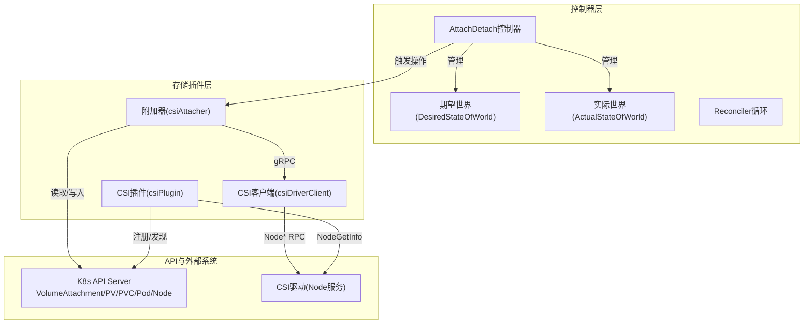
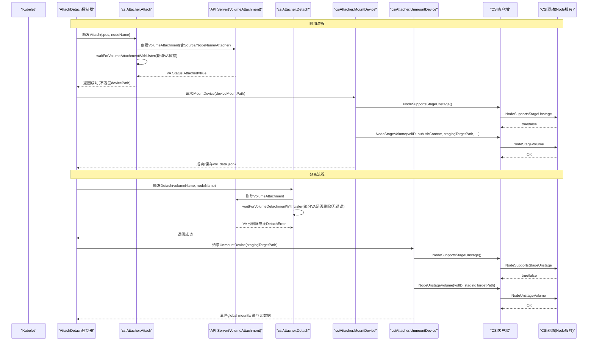
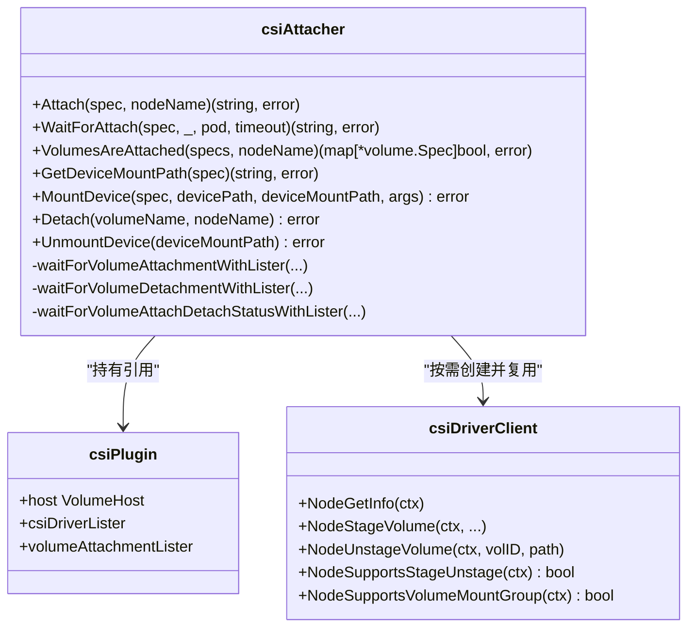
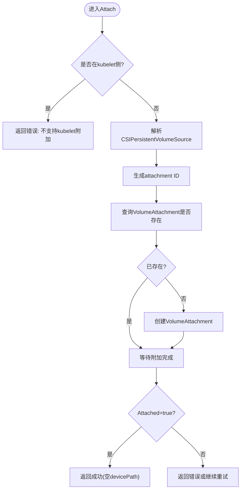
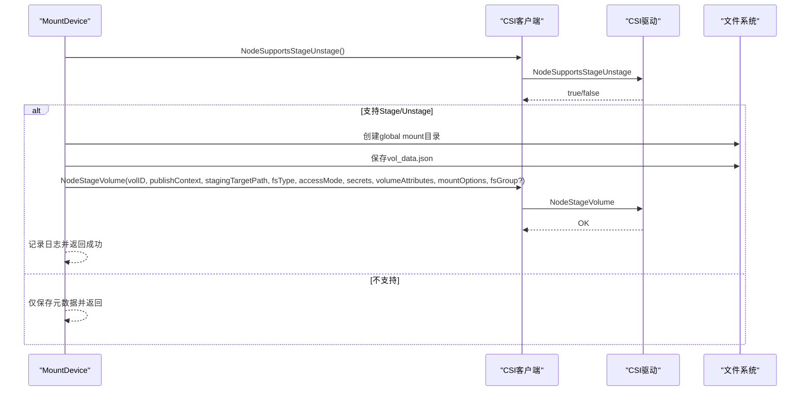
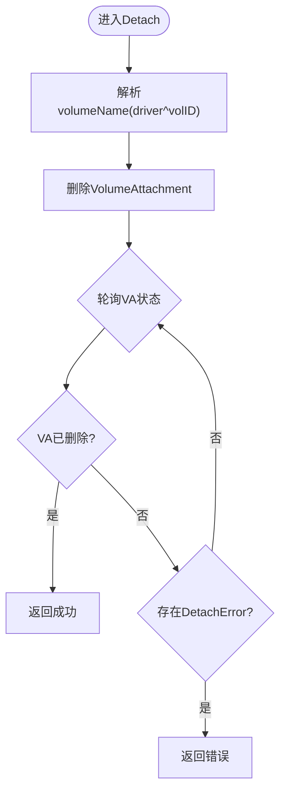
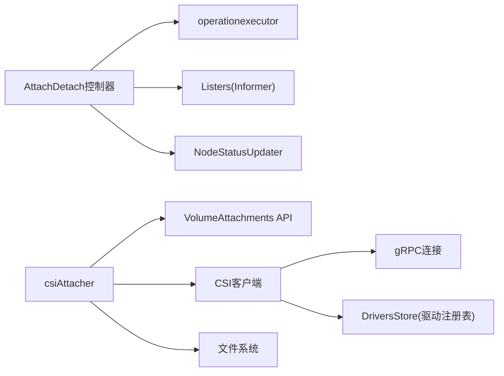

# CSI附加器

<cite>
**本文引用的文件**   
- [csi_attacher.go](file://pkg/volume/csi/csi_attacher.go)
- [attach_detach_controller.go](file://pkg/controller/volume/attachdetach/attach_detach_controller.go)
- [csi_client.go](file://pkg/volume/csi/csi_client.go)
- [csi_plugin.go](file://pkg/volume/csi/csi_plugin.go)
</cite>

## 目录
1. [简介](#简介)
2. [项目结构](#项目结构)
3. [核心组件](#核心组件)
4. [架构总览](#架构总览)
5. [详细组件分析](#详细组件分析)
6. [依赖关系分析](#依赖关系分析)
7. [性能与并发优化](#性能与并发优化)
8. [故障排查指南](#故障排查指南)
9. [结论](#结论)
10. [附录](#附录)

## 简介
本文件面向Kubernetes中CSI（Container Storage Interface）附加器的实现，聚焦于kube-controller-manager侧的AttachDetach控制器与in-tree CSI插件中的csiAttacher。文档深入解释块设备的附加、分离与状态同步机制，详述Attach/Detach方法、VolumeAttachment对象生命周期、NodeStage/Unstage RPC交互、错误处理与重试策略，并提供并发控制与性能优化建议。

## 项目结构
围绕CSI附加的核心代码分布在以下模块：
- AttachDetach控制器：负责协调Pod/PV/PVC/Node等资源的期望与实际状态，驱动VolumeAttachment对象的创建与删除，并轮询其状态。
- in-tree CSI插件：提供volume.Attacher/Detacher接口实现，封装对外部CSI驱动Node服务的gRPC调用，完成NodeStage/Unstage等操作。
- CSI客户端：封装与CSI Node服务端的通信，包括能力探测、NodeGetInfo、NodeStageVolume、NodeUnstageVolume、NodeExpandVolume等。

图表来源
- [attach_detach_controller.go:103-236](file://pkg/controller/volume/attachdetach/attach_detach_controller.go#L103-L236)
- [csi_attacher.go:48-139](file://pkg/volume/csi/csi_attacher.go#L48-L139)
- [csi_client.go:109-170](file://pkg/volume/csi/csi_client.go#L109-L170)
- [csi_plugin.go:118-170](file://pkg/volume/csi/csi_plugin.go#L118-L170)

章节来源
- [attach_detach_controller.go:103-236](file://pkg/controller/volume/attachdetach/attach_detach_controller.go#L103-L236)
- [csi_attacher.go:48-139](file://pkg/volume/csi/csi_attacher.go#L48-L139)
- [csi_client.go:109-170](file://pkg/volume/csi/csi_client.go#L109-L170)
- [csi_plugin.go:118-170](file://pkg/volume/csi/csi_plugin.go#L118-L170)

## 核心组件
- csiAttacher：实现volume.Attacher/Detacher/DeviceMounter/DeviceUnmounter接口，负责：
  - 在Attach流程中创建VolumeAttachment对象并等待其Attached=true；
  - 在Detach流程中删除VolumeAttachment对象并等待其被删除或无错误；
  - 在MountDevice/UnmountDevice中调用CSI Node Stage/Unstage，维护全局设备挂载元数据；
  - 支持SELinux上下文、FSGroup委派给驱动等特性。
- AttachDetach控制器：通过DesiredStateOfWorld/ActualStateOfWorld与Reconciler循环，将Pod/PV/PVC/Node事件转化为实际的Attach/Detach动作，并通过operationexecutor异步执行。
- CSI客户端：封装与CSI Node服务的gRPC通信，提供能力探测与具体RPC调用。

章节来源
- [csi_attacher.go:48-139](file://pkg/volume/csi/csi_attacher.go#L48-L139)
- [attach_detach_controller.go:238-323](file://pkg/controller/volume/attachdetach/attach_detach_controller.go#L238-L323)
- [csi_client.go:42-100](file://pkg/volume/csi/csi_client.go#L42-L100)

## 架构总览
下图展示了从Pod调度到卷附加完成的端到端流程，以及分离时的反向流程。

图表来源
- [csi_attacher.go:63-139](file://pkg/volume/csi/csi_attacher.go#L63-L139)
- [csi_attacher.go:417-483](file://pkg/volume/csi/csi_attacher.go#L417-L483)
- [csi_attacher.go:264-411](file://pkg/volume/csi/csi_attacher.go#L264-L411)
- [csi_attacher.go:526-590](file://pkg/volume/csi/csi_attacher.go#L526-L590)
- [attach_detach_controller.go:325-379](file://pkg/controller/volume/attachdetach/attach_detach_controller.go#L325-L379)

## 详细组件分析

### csiAttacher类与方法概览

图表来源
- [csi_attacher.go:48-139](file://pkg/volume/csi/csi_attacher.go#L48-L139)
- [csi_client.go:109-170](file://pkg/volume/csi/csi_client.go#L109-L170)
- [csi_plugin.go:66-72](file://pkg/volume/csi/csi_plugin.go#L66-L72)

章节来源
- [csi_attacher.go:48-139](file://pkg/volume/csi/csi_attacher.go#L48-L139)
- [csi_client.go:109-170](file://pkg/volume/csi/csi_client.go#L109-L170)
- [csi_plugin.go:66-72](file://pkg/volume/csi/csi_plugin.go#L66-L72)

### Attach方法详解
- 前置校验：拒绝在kubelet侧直接附加；校验spec有效性；解析CSIPersistentVolumeSource。
- 生成attachment ID：基于volumeHandle、driver、nodeName计算唯一名称。
- 创建VolumeAttachment：
  - inline PV场景：使用InlineVolumeSpec填充Source；
  - 常规PV场景：使用PersistentVolumeName填充Source；
  - 若已存在则跳过创建。
- 等待附加完成：通过listers轮询VolumeAttachment状态，直到Attached=true或出现错误/超时。
- 返回值：不返回devicePath，后续由NodeStage/NodePublish阶段确定设备路径。

图表来源
- [csi_attacher.go:63-139](file://pkg/volume/csi/csi_attacher.go#L63-L139)
- [csi_attacher.go:172-196](file://pkg/volume/csi/csi_attacher.go#L172-L196)

章节来源
- [csi_attacher.go:63-139](file://pkg/volume/csi/csi_attacher.go#L63-L139)
- [csi_attacher.go:172-196](file://pkg/volume/csi/csi_attacher.go#L172-L196)

### WaitForAttach与VolumesAreAttached
- WaitForAttach：根据当前节点名与volumeHandle计算attachment ID，查询VolumeAttachment并验证Attached状态；未就绪时返回错误供上层重试。
- VolumesAreAttached：批量探测多个卷的附加状态，优先使用listers缓存，回退至API查询；对于不可附加的卷（skipAttach=true），视为已附加。

章节来源
- [csi_attacher.go:146-170](file://pkg/volume/csi/csi_attacher.go#L146-L170)
- [csi_attacher.go:198-252](file://pkg/volume/csi/csi_attacher.go#L198-L252)

### MountDevice与UnmountDevice（NodeStage/Unstage）
- MountDevice：
  - 初始化CSI客户端（如不存在则创建）；
  - 探测STAGE_UNSTAGE_VOLUME能力；
  - 获取publishContext与可选NodeStageSecrets；
  - 准备mountOptions与SELinux上下文（受FeatureGate影响）；
  - 保存卷元数据到全局目录（用于后续UnmountDevice）；
  - 若驱动支持VOLUME_MOUNT_GROUP，则将FSGroup委派给NodeStageVolume；
  - 调用NodeStageVolume完成预挂载/设备准备。
- UnmountDevice：
  - 从全局目录加载元数据，重建driver与volumeHandle；
  - 探测STAGE_UNSTAGE_VOLUME能力；
  - 若不支持，仅清理全局目录与元数据；
  - 若支持，调用NodeUnstageVolume后清理全局目录与元数据。

图表来源
- [csi_attacher.go:264-411](file://pkg/volume/csi/csi_attacher.go#L264-L411)
- [csi_client.go:77-99](file://pkg/volume/csi/csi_client.go#L77-L99)

章节来源
- [csi_attacher.go:264-411](file://pkg/volume/csi/csi_attacher.go#L264-L411)
- [csi_client.go:77-99](file://pkg/volume/csi/csi_client.go#L77-L99)

### Detach方法与状态同步
- 删除VolumeAttachment对象；
- 通过listers轮询，直到对象被删除或确认无DetachError；
- 成功后返回，上层可进一步调用UnmountDevice进行资源清理。

图表来源
- [csi_attacher.go:417-483](file://pkg/volume/csi/csi_attacher.go#L417-L483)

章节来源
- [csi_attacher.go:417-483](file://pkg/volume/csi/csi_attacher.go#L417-L483)

### 与CSI驱动的交互（NodeGetInfo、NodeStageVolume、NodeUnstageVolume）
- NodeGetInfo：在插件注册阶段调用，获取nodeID、maxVolumePerNode、accessibleTopology，并更新本地驱动信息。
- NodeStageVolume/NodeUnstageVolume：在MountDevice/UnmountDevice中调用，完成设备预挂载与卸载。
- 能力探测：NodeSupportsStageUnstage、NodeSupportsVolumeMountGroup等，决定行为分支。

章节来源
- [csi_plugin.go:118-170](file://pkg/volume/csi/csi_plugin.go#L118-L170)
- [csi_client.go:172-200](file://pkg/volume/csi/csi_client.go#L172-L200)
- [csi_client.go:77-99](file://pkg/volume/csi/csi_client.go#L77-L99)

### 错误处理、重试与超时控制
- 指数退避与超时：
  - 内部使用ExponentialBackoffManager，初始退避约500ms，最大退避约7s，重置周期1分钟，因子1.05，抖动0.1；
  - 外层使用context.WithTimeout控制整体等待时长（watchTimeout）。
- 错误分类：
  - 非“NotFound”错误立即失败；
  - “NotFound”表示对象尚未就绪或已被删除，继续重试；
  - 当VA处于删除时间戳或包含AttachError/DetachError时快速失败。
- 瞬态错误：
  - 无法创建CSI客户端或拉取Secret等情况包装为TransientOperationFailure，便于上层重试。

章节来源
- [csi_attacher.go:485-524](file://pkg/volume/csi/csi_attacher.go#L485-L524)
- [csi_attacher.go:625-662](file://pkg/volume/csi/csi_attacher.go#L625-L662)
- [csi_attacher.go:281-288](file://pkg/volume/csi/csi_attacher.go#L281-L288)

### 多路复用与并发控制
- 控制器侧：
  - 通过operationexecutor启动异步Attach/Detach任务，避免阻塞主循环；
  - DesiredStateOfWorld/ActualStateOfWorld作为共享状态，配合Reconciler周期性收敛。
- 插件侧：
  - csiAttacher按spec/node维度串行化单个卷的操作；
  - 不同卷之间由控制器调度并发执行；
  - CSI客户端连接在需要时创建并复用，减少gRPC握手开销。

章节来源
- [attach_detach_controller.go:158-179](file://pkg/controller/volume/attachdetach/attach_detach_controller.go#L158-L179)
- [csi_attacher.go:281-288](file://pkg/volume/csi/csi_attacher.go#L281-L288)

## 依赖关系分析
- AttachDetach控制器依赖：
  - Informers/Listers：Pod、Node、PVC、PV、CSINode、CSIDriver、VolumeAttachment；
  - operationexecutor：异步执行Attach/Detach；
  - nodeStatusUpdater：更新节点状态。
- csiAttacher依赖：
  - k8s API：VolumeAttachments读写；
  - csiClient：Node服务gRPC调用；
  - filesystem：创建/删除全局目录与元数据文件。
- CSI客户端依赖：
  - gRPC连接池与指标采集；
  - 驱动注册表（DriversStore）以查找endpoint。

图表来源
- [attach_detach_controller.go:158-179](file://pkg/controller/volume/attachdetach/attach_detach_controller.go#L158-L179)
- [csi_attacher.go:264-411](file://pkg/volume/csi/csi_attacher.go#L264-L411)
- [csi_client.go:109-170](file://pkg/volume/csi/csi_client.go#L109-L170)

章节来源
- [attach_detach_controller.go:158-179](file://pkg/controller/volume/attachdetach/attach_detach_controller.go#L158-L179)
- [csi_attacher.go:264-411](file://pkg/volume/csi/csi_attacher.go#L264-L411)
- [csi_client.go:109-170](file://pkg/volume/csi/csi_client.go#L109-L170)

## 性能与并发优化
- 列表器优先：优先使用VolumeAttachment listers缓存，降低API压力；仅在缓存缺失时回退到API查询。
- 指数退避与抖动：避免惊群效应，提高大规模卷操作的稳定性。
- 客户端复用：按需创建并复用CSI客户端，减少gRPC连接建立成本。
- 能力探测缓存：在MountDevice前探测STAGE_UNSTAGE_VOLUME与VOLUME_MOUNT_GROUP能力，避免不必要的RPC与参数传递。
- 选择性FSGroup委派：当驱动支持VOLUME_MOUNT_GROUP时，将FSGroup应用委托给驱动，减少内核态权限变更开销。
- 超时控制：为所有CSI操作设置合理超时，防止长时间阻塞导致队列积压。

[本节为通用指导，无需源码引用]

## 故障排查指南
- 常见问题定位：
  - VolumeAttachment未被创建：检查Attach流程是否因spec无效或inline迁移配置不正确而提前返回；
  - 附加一直Pending：查看VA.Status.AttachError消息，确认驱动侧错误；
  - 分离卡住：检查VA.Status.DetachError，确认驱动是否完成卸载；
  - MountDevice失败：关注NodeStageVolume返回的错误类型，区分瞬态错误与终态错误；
  - 元数据不一致：确认global mount目录与vol_data.json是否存在且内容正确。
- 关键日志位置：
  - Attach/Detach等待超时与错误；
  - CSI客户端创建失败与能力探测结果；
  - 文件系统操作失败（目录创建/删除）。

章节来源
- [csi_attacher.go:485-524](file://pkg/volume/csi/csi_attacher.go#L485-L524)
- [csi_attacher.go:625-662](file://pkg/volume/csi/csi_attacher.go#L625-L662)
- [csi_attacher.go:281-288](file://pkg/volume/csi/csi_attacher.go#L281-L288)

## 结论
CSI附加器通过AttachDetach控制器与in-tree CSI插件协作，实现了可靠的卷附加与分离流程。其核心在于：
- 以VolumeAttachment为统一状态载体，结合listers高效轮询；
- 通过NodeStage/Unstage完成设备级预挂载与卸载；
- 完善的错误分类、指数退避与超时控制保障鲁棒性；
- 合理的并发与复用策略提升吞吐与稳定性。

[本节为总结，无需源码引用]

## 附录
- 相关术语：
  - VolumeAttachment：描述卷在特定节点的附加关系与状态；
  - DesiredStateOfWorld/ActualStateOfWorld：控制器维护的期望与实际状态集合；
  - STAGE_UNSTAGE_VOLUME：CSI驱动能力，指示是否支持NodeStage/Unstage；
  - VOLUME_MOUNT_GROUP：CSI驱动能力，指示是否支持在NodeStage中应用FSGroup。

[本节为概念说明，无需源码引用]