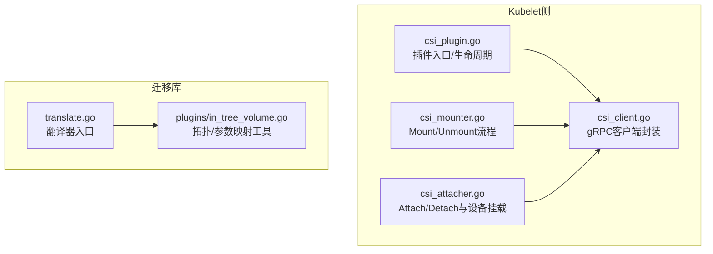
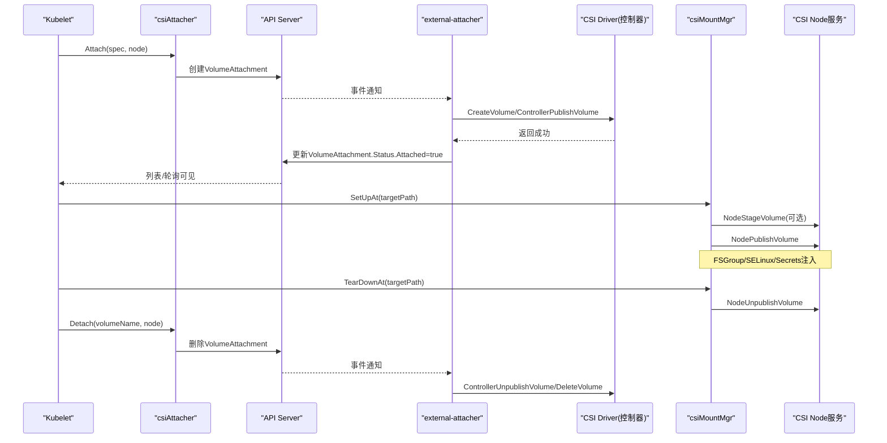
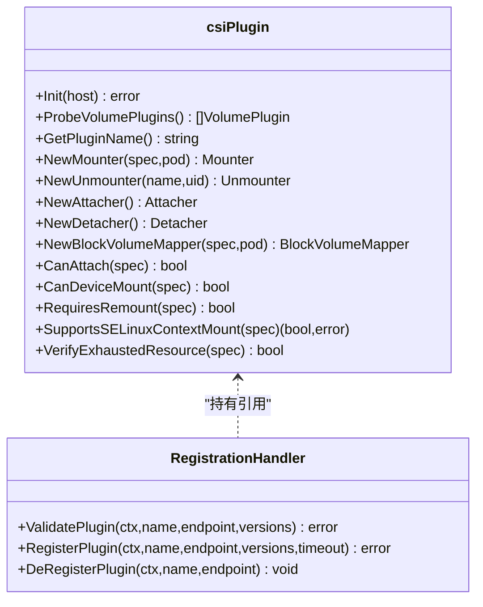
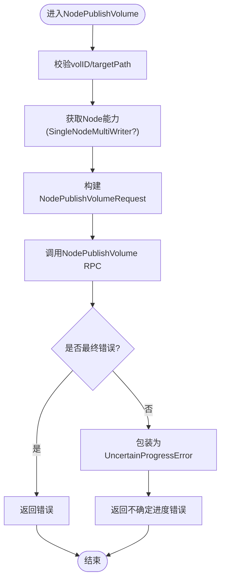
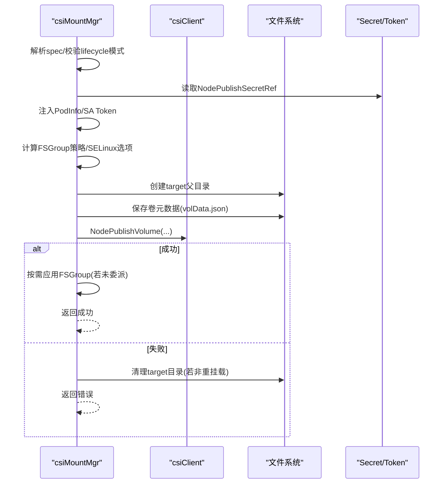
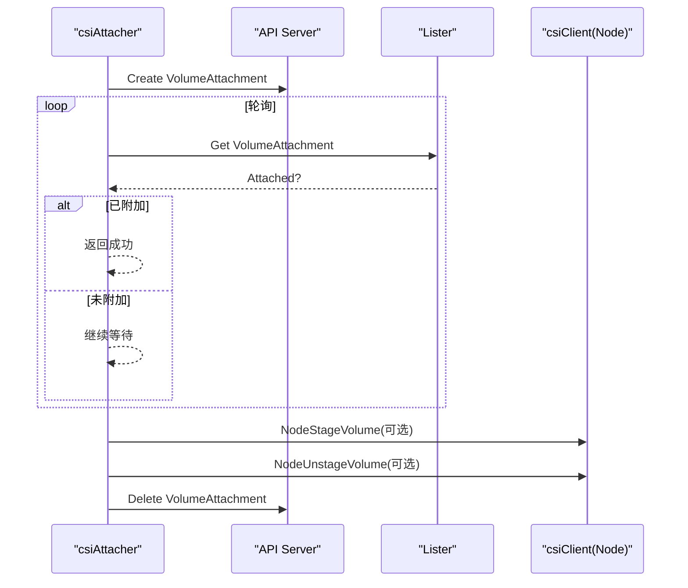
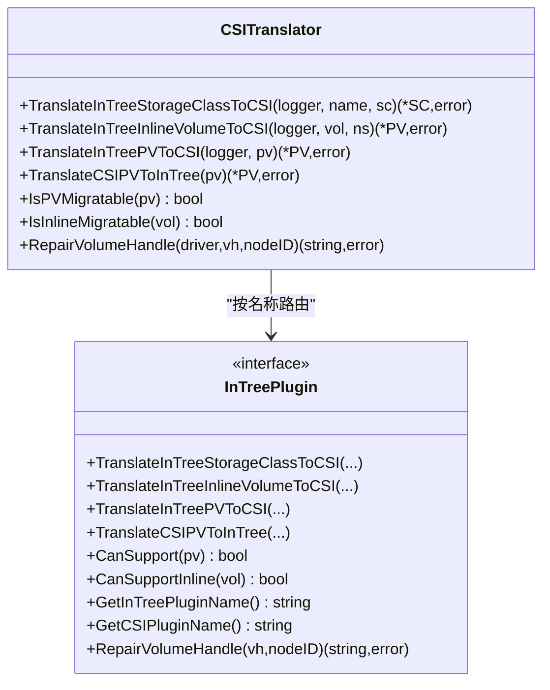
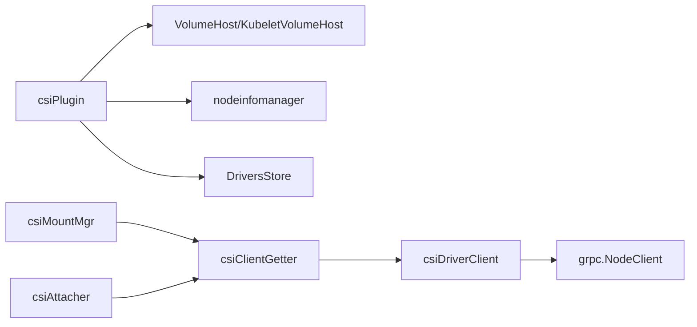

# CSI存储插件

<cite>
**本文引用的文件**   
- [csi_plugin.go](file://pkg/volume/csi/csi_plugin.go)
- [csi_client.go](file://pkg/volume/csi/csi_client.go)
- [csi_mounter.go](file://pkg/volume/csi/csi_mounter.go)
- [csi_attacher.go](file://pkg/volume/csi/csi_attacher.go)
- [translate.go](file://staging/src/k8s.io/csi-translation-lib/translate.go)
- [in_tree_volume.go](file://staging/src/k8s.io/csi-translation-lib/plugins/in_tree_volume.go)
</cite>

## 目录
1. [简介](#简介)
2. [项目结构](#项目结构)
3. [核心组件](#核心组件)
4. [架构总览](#架构总览)
5. [详细组件分析](#详细组件分析)
6. [依赖关系分析](#依赖关系分析)
7. [性能考量](#性能考量)
8. [故障排查指南](#故障排查指南)
9. [结论](#结论)
10. [附录](#附录)

## 简介
本文件面向Kubernetes CSI（Container Storage Interface）存储插件的开发者与运维人员，系统性阐述CSI规范在Kubernetes中的实现与集成方式。重点包括：
- Volume插件与Controller插件的职责分离
- gRPC接口定义、节点服务与控制器服务的实现要点
- CSI与Kubernetes的集成机制（VolumeAttachment、PersistentVolume、StorageClass等）
- CSI驱动开发指南（能力协商、卷操作、快照与克隆）
- CSI迁移库的使用（传统FlexVolume/In-tree驱动的迁移）
- 测试策略、调试方法与性能优化建议
- 完整示例与最佳实践

## 项目结构
仓库中与CSI相关的核心代码位于以下路径：
- pkg/volume/csi：Kubelet侧CSI插件实现（注册、挂载、卸载、设备挂载、扩展、指标等）
- staging/src/k8s.io/csi-translation-lib：In-tree到CSI的迁移翻译库

图表来源
- [csi_plugin.go:1-120](file://pkg/volume/csi/csi_plugin.go#L1-L120)
- [csi_client.go:100-170](file://pkg/volume/csi/csi_client.go#L100-L170)
- [csi_mounter.go:1-120](file://pkg/volume/csi/csi_mounter.go#L1-L120)
- [csi_attacher.go:1-120](file://pkg/volume/csi/csi_attacher.go#L1-L120)
- [translate.go:1-60](file://staging/src/k8s.io/csi-translation-lib/translate.go#L1-L60)
- [in_tree_volume.go:1-120](file://staging/src/k8s.io/csi-translation-lib/plugins/in_tree_volume.go#L1-L120)

章节来源
- [csi_plugin.go:1-120](file://pkg/volume/csi/csi_plugin.go#L1-L120)
- [translate.go:1-60](file://staging/src/k8s.io/csi-translation-lib/translate.go#L1-L60)

## 核心组件
- csiPlugin：Kubelet内CSI插件入口，负责插件发现、版本校验、CSINode初始化、挂载/卸载/块设备映射等接口的分发。
- csiDriverClient：对CSI Node服务的gRPC客户端封装，提供NodeGetInfo、NodeStage/Unstage、NodePublish/Unpublish、NodeExpandVolume、NodeGetVolumeStats等调用。
- csiMountMgr：实现volume.Mounter/Unmounter，完成挂载前准备、FSGroup/SELinux处理、持久化卷元数据、调用NodePublish/Unpublish。
- csiAttacher：实现volume.Attacher/Detacher与DeviceMounter/Unmounter，协调VolumeAttachment对象创建/删除、等待外部AttachDetach控制器完成实际Attach/Detach，并可选执行NodeStage/Unstage。
- CSITranslator：In-tree到CSI的翻译器，支持StorageClass、Inline Volume、PV之间的双向转换及拓扑字段修正。

章节来源
- [csi_plugin.go:66-120](file://pkg/volume/csi/csi_plugin.go#L66-L120)
- [csi_client.go:108-170](file://pkg/volume/csi/csi_client.go#L108-L170)
- [csi_mounter.go:64-120](file://pkg/volume/csi/csi_mounter.go#L64-L120)
- [csi_attacher.go:48-120](file://pkg/volume/csi/csi_attacher.go#L48-L120)
- [translate.go:44-60](file://staging/src/k8s.io/csi-translation-lib/translate.go#L44-L60)

## 架构总览
CSI在Kubernetes中的职责边界清晰：
- Controller侧（external-attacher/driver）：通过CSI Controller服务管理卷生命周期（Create/Delete/Clone/Snapshot等），并通过VolumeAttachment状态反映给Kubernetes。
- Node侧（Kubelet + external-provisioner/node-driver-registrar）：通过CSI Node服务执行Stage/Publish/Unstage/Unpublish/Expand/GetVolumeStats等操作。

图表来源
- [csi_attacher.go:63-170](file://pkg/volume/csi/csi_attacher.go#L63-L170)
- [csi_mounter.go:99-361](file://pkg/volume/csi/csi_mounter.go#L99-L361)
- [csi_client.go:172-287](file://pkg/volume/csi/csi_client.go#L172-L287)

## 详细组件分析

### 组件A：csiPlugin（插件入口与生命周期）
- 插件发现与注册：通过RegistrationHandler.ValidatePlugin/RegisterPlugin进行版本校验、端点注册、NodeGetInfo获取节点信息并安装CSINode。
- 资源耗尽检测：VerifyExhaustedResource检查VolumeAttachment.AttachError是否为ResourceExhausted，必要时触发CSIDriver信息更新。
- 生命周期模式判断：CanAttach/CanDeviceMount根据VolumeLifecycleMode与skipAttach逻辑决定是否需要Attach。
- 构造Spec：ConstructVolumeSpec从持久化数据重建Ephemeral或Persistent的volume.Spec。

图表来源
- [csi_plugin.go:66-120](file://pkg/volume/csi/csi_plugin.go#L66-L120)
- [csi_plugin.go:172-232](file://pkg/volume/csi/csi_plugin.go#L172-L232)
- [csi_plugin.go:431-472](file://pkg/volume/csi/csi_plugin.go#L431-L472)
- [csi_plugin.go:569-626](file://pkg/volume/csi/csi_plugin.go#L569-L626)

章节来源
- [csi_plugin.go:105-170](file://pkg/volume/csi/csi_plugin.go#L105-L170)
- [csi_plugin.go:192-232](file://pkg/volume/csi/csi_plugin.go#L192-L232)
- [csi_plugin.go:431-472](file://pkg/volume/csi/csi_plugin.go#L431-L472)
- [csi_plugin.go:569-626](file://pkg/volume/csi/csi_plugin.go#L569-L626)

### 组件B：csiClient（gRPC客户端封装）
- 连接建立：newGrpcConn使用Unix域套接字与CSI Node服务通信，注入指标拦截器。
- 能力协商：NodeGetCapabilities用于探测STAGE_UNSTAGE_VOLUME、EXPAND_VOLUME、VOLUME_MOUNT_GROUP、SINGLE_NODE_MULTI_WRITER等能力。
- 访问模式映射：根据是否支持SINGLE_NODE_MULTI_WRITER选择不同映射函数，兼容ReadWriteOncePod。
- 错误分类：isFinalError区分“最终失败”和“不确定进度”，以便上层重试或清理。

图表来源
- [csi_client.go:211-287](file://pkg/volume/csi/csi_client.go#L211-L287)
- [csi_client.go:482-530](file://pkg/volume/csi/csi_client.go#L482-L530)
- [csi_client.go:714-736](file://pkg/volume/csi/csi_client.go#L714-L736)

章节来源
- [csi_client.go:142-170](file://pkg/volume/csi/csi_client.go#L142-L170)
- [csi_client.go:482-530](file://pkg/volume/csi/csi_client.go#L482-L530)
- [csi_client.go:714-736](file://pkg/volume/csi/csi_client.go#L714-L736)

### 组件C：csiMountMgr（挂载/卸载流程）
- SetUpAt关键步骤：
  - 解析卷源（Ephemeral或Persistent），校验VolumeLifecycleMode
  - 读取/合并volume_attributes，注入Pod信息与ServiceAccount Token
  - 根据CSIDriver能力决定是否将FSGroup委派给驱动（VOLUME_MOUNT_GROUP）
  - 可选注入SELinux标签（特性开关下）
  - 持久化卷元数据到pod目录
  - 调用NodePublishVolume；若失败且非重挂载，则清理目标目录
  - 若驱动不支持FSGroup，则由Kubelet递归应用权限
- TearDownAt：调用NodeUnpublishVolume后清理目标目录与元数据文件

图表来源
- [csi_mounter.go:99-361](file://pkg/volume/csi/csi_mounter.go#L99-L361)
- [csi_mounter.go:434-472](file://pkg/volume/csi/csi_mounter.go#L434-L472)

章节来源
- [csi_mounter.go:99-361](file://pkg/volume/csi/csi_mounter.go#L99-L361)
- [csi_mounter.go:434-472](file://pkg/volume/csi/csi_mounter.go#L434-L472)

### 组件D：csiAttacher（Attach/Detach与设备挂载）
- Attach：
  - 确保不在Kubelet侧执行Attach
  - 生成attachID，创建VolumeAttachment对象
  - 通过listers轮询等待Status.Attached=true
- WaitForAttach：直接查询API获取VA状态，不额外等待
- MountDevice/UnmountDevice：
  - 若驱动支持STAGE_UNSTAGE_VOLUME，则调用NodeStage/Unstage
  - 写入全局设备挂载路径与元数据，供后续UnmountDevice使用
- Detach：删除VolumeAttachment并等待其被删除或DetachError为空

图表来源
- [csi_attacher.go:63-170](file://pkg/volume/csi/csi_attacher.go#L63-L170)
- [csi_attacher.go:264-411](file://pkg/volume/csi/csi_attacher.go#L264-L411)
- [csi_attacher.go:417-483](file://pkg/volume/csi/csi_attacher.go#L417-L483)

章节来源
- [csi_attacher.go:63-170](file://pkg/volume/csi/csi_attacher.go#L63-L170)
- [csi_attacher.go:264-411](file://pkg/volume/csi/csi_attacher.go#L264-L411)
- [csi_attacher.go:417-483](file://pkg/volume/csi/csi_attacher.go#L417-L483)

### 组件E：CSI迁移库（In-tree到CSI）
- translate.go提供CSITranslator，统一调度各In-tree插件的翻译逻辑，支持：
  - StorageClass参数映射
  - Inline Volume转换为包含CSIPersistentVolumeSource的PV
  - PV中In-tree Source到CSI Source的双向转换
  - 拓扑键替换与区域推导
- in_tree_volume.go提供通用拓扑处理工具：
  - 将Beta/GA拓扑键规范化
  - 将Zone/Region标签转换为NodeAffinity表达式
  - 支持AllowedTopologies的键名替换

图表来源
- [translate.go:44-123](file://staging/src/k8s.io/csi-translation-lib/translate.go#L44-L123)
- [in_tree_volume.go:31-69](file://staging/src/k8s.io/csi-translation-lib/plugins/in_tree_volume.go#L31-L69)

章节来源
- [translate.go:44-123](file://staging/src/k8s.io/csi-translation-lib/translate.go#L44-L123)
- [in_tree_volume.go:180-214](file://staging/src/k8s.io/csi-translation-lib/plugins/in_tree_volume.go#L180-L214)

## 依赖关系分析
- csiPlugin依赖：
  - volume.VolumeHost/KubeletVolumeHost/AttachDetachVolumeHost以获取k8s client、listers、informer
  - nodeinfomanager用于CSINode安装与更新
  - csiDrivers Store用于驱动端点缓存
- csiMountMgr/csiAttacher依赖：
  - csiClientGetter用于延迟创建并缓存csiDriverClient
  - kubernetes.Interface用于读取Secret、VolumeAttachment等
- csiClient依赖：
  - grpc连接与Node服务gRPC接口
  - MetricsManager用于记录指标

图表来源
- [csi_plugin.go:281-359](file://pkg/volume/csi/csi_plugin.go#L281-L359)
- [csi_client.go:547-578](file://pkg/volume/csi/csi_client.go#L547-L578)

章节来源
- [csi_plugin.go:281-359](file://pkg/volume/csi/csi_plugin.go#L281-L359)
- [csi_client.go:547-578](file://pkg/volume/csi/csi_client.go#L547-L578)

## 性能考量
- 连接复用与延迟初始化：csiClientGetter采用读写锁保护的单例缓存，避免重复创建gRPC连接。
- 能力探测缓存：NodeGetCapabilities仅在需要时调用，减少不必要的RPC开销。
- 错误分类与重试：isFinalError将部分错误标记为“不确定进度”，由上层控制重试与清理策略，避免误删。
- 指标采集：通过UnaryInterceptor在gRPC层记录指标，便于定位瓶颈。
- 元数据持久化：在SetUpAt/MountDevice阶段写入volData.json，降低重启后的恢复成本。

[本节为通用指导，无需源码引用]

## 故障排查指南
- 常见错误类型
  - 最终错误：如参数缺失、非法配置，应快速失败并清理。
  - 不确定进度错误：如超时、服务端不可用、资源耗尽、操作挂起，需重试或延后清理。
- 定位方法
  - 查看VolumeAttachment状态（Attached/AttachError/DetachError）
  - 检查NodeGetCapabilities能力集是否符合预期
  - 核对volData.json内容是否与当前挂载一致
  - 关注Kubelet日志中“UncertainProgressError”与“TransientOperationFailure”
- 修复建议
  - 对于ResourceExhausted，触发CSIDriver信息更新并重新尝试
  - 对于FSGroup/SELinux问题，确认CSIDriver.FSGroupPolicy与SELinuxMount设置
  - 对于拓扑不匹配，使用迁移库的拓扑替换工具修正NodeAffinity

章节来源
- [csi_client.go:714-736](file://pkg/volume/csi/csi_client.go#L714-L736)
- [csi_plugin.go:192-232](file://pkg/volume/csi/csi_plugin.go#L192-L232)
- [csi_mounter.go:338-357](file://pkg/volume/csi/csi_mounter.go#L338-L357)

## 结论
Kubernetes对CSI的实现将控制器与节点职责清晰分离：控制器侧通过external-attacher与CSI Driver交互，节点侧由Kubelet通过csiPlugin/csiClient完成Stage/Publish/Unstage/Unpublish等操作。迁移库为In-tree驱动平滑过渡到CSI提供了标准化能力。遵循本文档的流程与最佳实践，可高效开发、部署与排障CSI驱动。

[本节为总结性内容，无需源码引用]

## 附录

### CSI驱动开发指南（要点清单）
- 能力协商
  - 实现NodeGetCapabilities，明确声明STAGE_UNSTAGE_VOLUME、EXPAND_VOLUME、VOLUME_MOUNT_GROUP、SINGLE_NODE_MULTI_WRITER等能力
  - 合理返回AccessibleTopology，配合调度器进行拓扑感知
- 卷操作
  - NodeStageVolume/NodeUnstageVolume：准备底层设备、格式化、挂载到stagingTargetPath
  - NodePublishVolume/NodeUnpublishVolume：将stagingTargetPath绑定到targetPath，处理只读/多写模式
  - NodeExpandVolume：在线扩容，注意fsType与mountOptions一致性
  - NodeGetVolumeStats：返回容量与inode使用量，支持VolumeCondition（可选）
- 快照与克隆
  - 通过Controller服务实现CreateSnapshot/DeleteSnapshot/CloneVolume等（控制器侧）
- 安全与认证
  - 支持NodePublishSecretRef/NodeStageSecretRef
  - 支持ServiceAccount Token注入（volume_attributes或secrets）
- 兼容性
  - 使用迁移库进行StorageClass/Inline/PV参数与拓扑映射
  - 兼容旧版拓扑键（Beta→GA）

[本节为通用指导，无需源码引用]