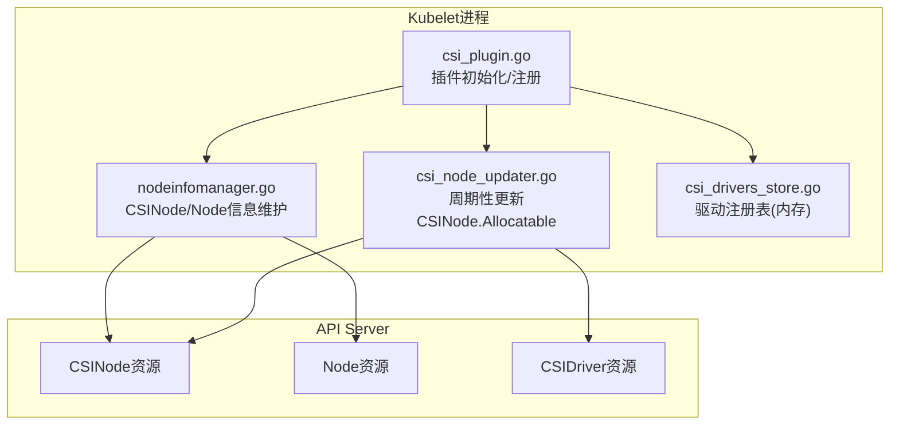
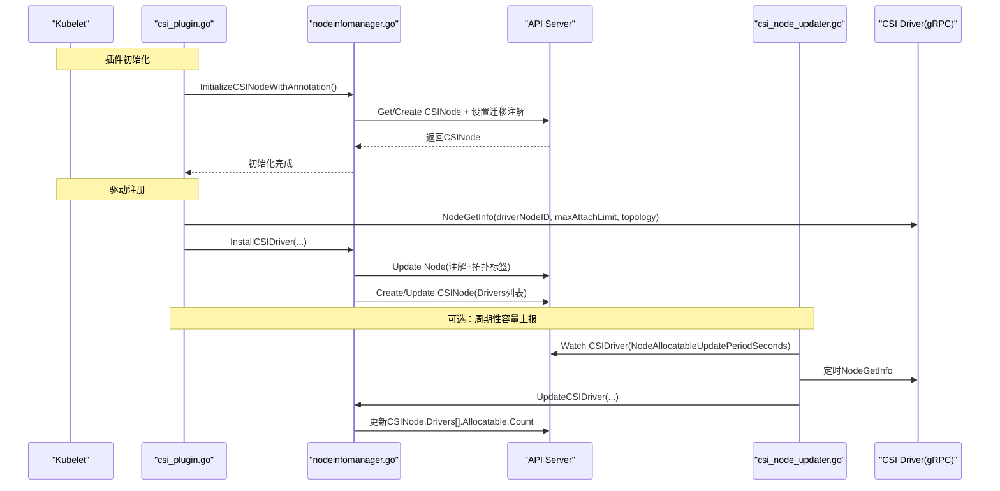
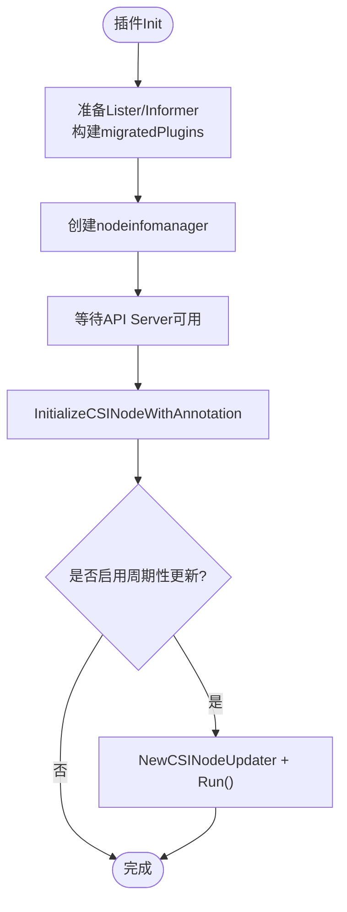
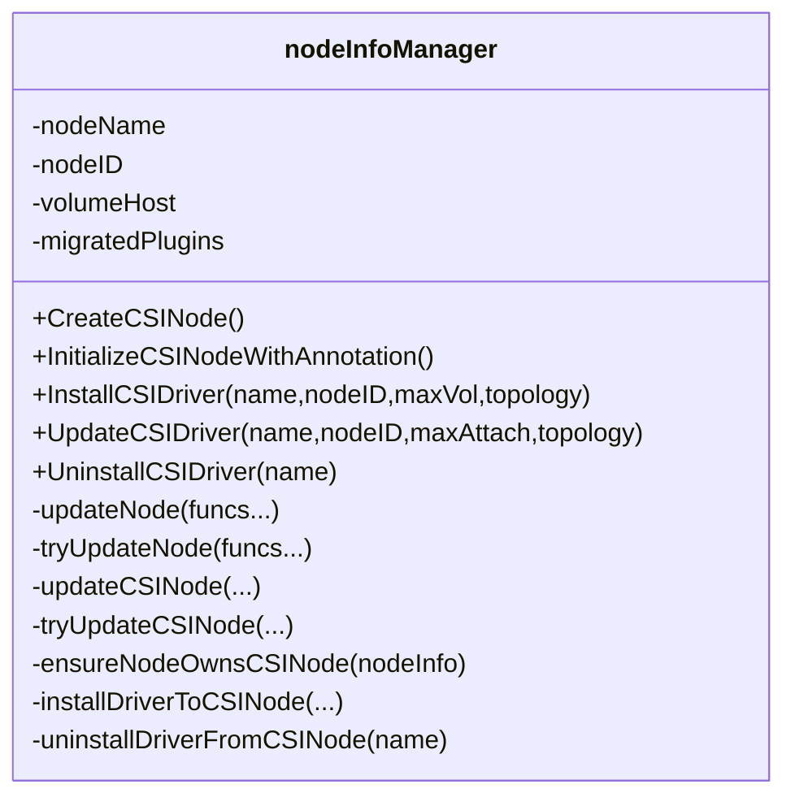
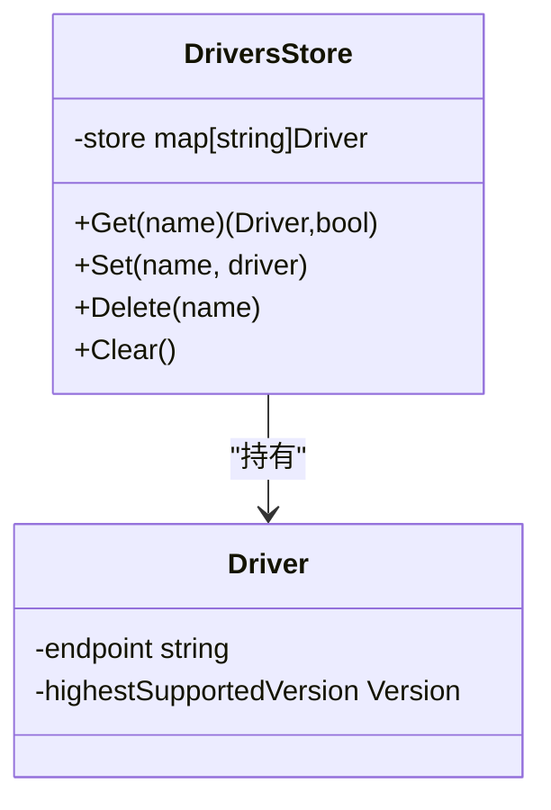
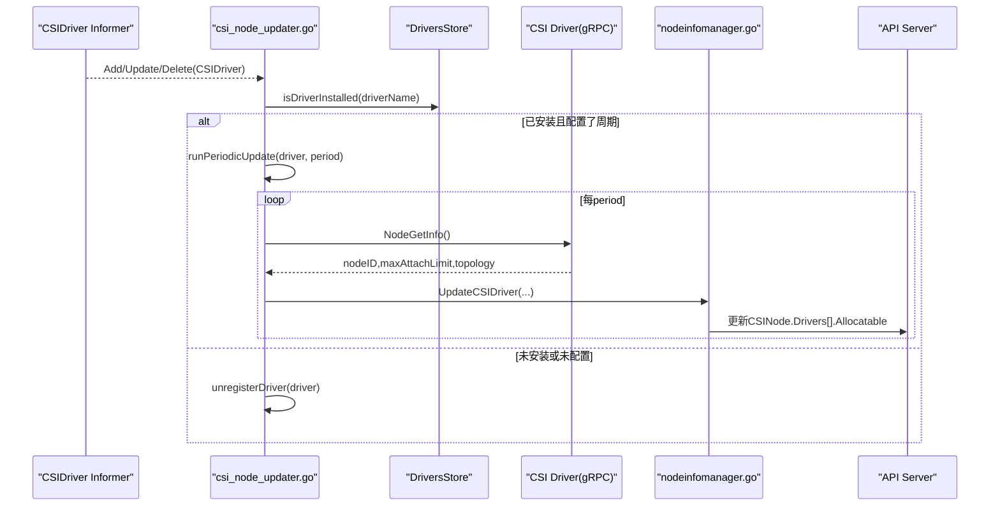
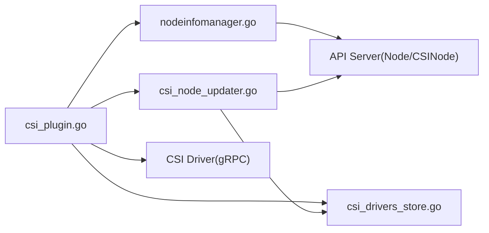

# CSI控制器集成

<cite>
**本文引用的文件**   
- [csi_plugin.go](file://pkg/volume/csi/csi_plugin.go)
- [nodeinfomanager.go](file://pkg/volume/csi/nodeinfomanager/nodeinfomanager.go)
- [csi_drivers_store.go](file://pkg/volume/csi/csi_drivers_store.go)
- [csi_node_updater.go](file://pkg/volume/csi/csi_node_updater.go)
</cite>

## 目录
1. [简介](#简介)
2. [项目结构](#项目结构)
3. [核心组件](#核心组件)
4. [架构总览](#架构总览)
5. [详细组件分析](#详细组件分析)
6. [依赖关系分析](#依赖关系分析)
7. [性能考虑](#性能考虑)
8. [故障排查指南](#故障排查指南)
9. [结论](#结论)
10. [附录](#附录)

## 简介
本文件面向Kubernetes CSI控制器与节点侧CSI插件的集成，重点解释以下方面：
- CSI控制器与Kubernetes控制平面的集成机制，尤其是CSINode资源的创建与更新。
- csi_node_updater的实现原理：节点信息收集、驱动状态监控与容量报告（基于CSIDriver的NodeAllocatableUpdatePeriodSeconds）。
- nodeinfomanager的工作机制：节点发现、信息缓存与事件处理。
- csi_drivers_store的实现细节：驱动注册、能力查询与版本管理。
- CSI控制器与PersistentVolume、StorageClass的协调机制（概念性说明）。
- CSI拓扑感知与亲和调度支持。
- 配置选项与性能调优建议。

## 项目结构
围绕CSI在kubelet中的实现，关键代码位于pkg/volume/csi及其子包中：
- csi_plugin.go：CSI插件入口、注册流程、与nodeinfomanager和csi_node_updater的协作。
- nodeinfomanager/nodeinfomanager.go：负责在Node与CSINode对象上维护CSI驱动节点信息、拓扑标签与迁移注解。
- csi_drivers_store.go：内存驱动的驱动注册表，保存端点与最高支持版本。
- csi_node_updater.go：监听CSIDriver变更，按周期调用驱动NodeGetInfo并更新CSINode的Allocatable计数。

图表来源
- [csi_plugin.go:281-429](file://pkg/volume/csi/csi_plugin.go#L281-L429)
- [nodeinfomanager.go:96-133](file://pkg/volume/csi/nodeinfomanager/nodeinfomanager.go#L96-L133)
- [csi_node_updater.go:54-185](file://pkg/volume/csi/csi_node_updater.go#L54-L185)
- [csi_drivers_store.go:32-80](file://pkg/volume/csi/csi_drivers_store.go#L32-L80)

章节来源
- [csi_plugin.go:281-429](file://pkg/volume/csi/csi_plugin.go#L281-L429)
- [nodeinfomanager.go:96-133](file://pkg/volume/csi/nodeinfomanager/nodeinfomanager.go#L96-L133)
- [csi_node_updater.go:54-185](file://pkg/volume/csi/csi_node_updater.go#L54-L185)
- [csi_drivers_store.go:32-80](file://pkg/volume/csi/csi_drivers_store.go#L32-L80)

## 核心组件
- csiPlugin（插件主入口）
  - 职责：接收插件注册/反注册事件；初始化nodeinfomanager；根据CSIDriver特性决定是否启用csi_node_updater；提供挂载/卸载/块映射等能力。
  - 关键点：在Init阶段设置CSIDriverLister、Informer，并在满足条件时启动csi_node_updater。
- nodeinfomanager（节点信息管理）
  - 职责：创建/更新/删除CSINode；在Node上维护driver->nodeID注解；写入拓扑标签；维护迁移插件注解。
  - 关键点：使用指数退避重试更新；确保CSINode归属当前Node UID；避免重复更新。
- csi_drivers_store（驱动注册表）
  - 职责：以线程安全方式存储已注册驱动的名称、gRPC端点与最高支持CSI版本。
  - 关键点：用于校验重复注册与版本兼容性。
- csi_node_updater（周期性更新器）
  - 职责：监听CSIDriver变更；当配置了NodeAllocatableUpdatePeriodSeconds且驱动已安装时，定时调用驱动NodeGetInfo并更新CSINode.Allocatable.Count。
  - 关键点：通过sync.Map管理每个驱动的更新协程生命周期；支持动态重配。

章节来源
- [csi_plugin.go:281-429](file://pkg/volume/csi/csi_plugin.go#L281-L429)
- [nodeinfomanager.go:96-133](file://pkg/volume/csi/nodeinfomanager/nodeinfomanager.go#L96-L133)
- [csi_drivers_store.go:32-80](file://pkg/volume/csi/csi_drivers_store.go#L32-L80)
- [csi_node_updater.go:54-185](file://pkg/volume/csi/csi_node_updater.go#L54-L185)

## 架构总览
下图展示了从驱动注册到CSINode更新的端到端流程，包括周期性容量上报路径。

图表来源
- [csi_plugin.go:350-429](file://pkg/volume/csi/csi_plugin.go#L350-L429)
- [nodeinfomanager.go:108-161](file://pkg/volume/csi/nodeinfomanager/nodeinfomanager.go#L108-L161)
- [nodeinfomanager.go:502-529](file://pkg/volume/csi/nodeinfomanager/nodeinfomanager.go#L502-L529)
- [nodeinfomanager.go:591-650](file://pkg/volume/csi/nodeinfomanager/nodeinfomanager.go#L591-L650)
- [csi_node_updater.go:54-185](file://pkg/volume/csi/csi_node_updater.go#L54-L185)

## 详细组件分析

### csi_plugin.go：插件初始化与注册流程
- 初始化阶段
  - 获取CSIDriverLister与Informer；构造migratedPlugins映射；创建nodeinfomanager实例。
  - 异步等待API Server可用后，执行InitializeCSINodeWithAnnotation，成功后允许Kubelet进入Ready。
  - 若开启相关特性且存在CSIDriver Informer，则创建并运行csi_node_updater。
- 注册阶段
  - ValidatePlugin/RegisterPlugin：校验驱动版本，记录到csi_drivers_store；调用驱动NodeGetInfo；通过nodeinfomanager将驱动节点信息持久化至Node与CSINode。
  - DeRegisterPlugin：清理驱动注册信息，并触发同步逻辑以停止对应周期性更新。

图表来源
- [csi_plugin.go:325-429](file://pkg/volume/csi/csi_plugin.go#L325-L429)

章节来源
- [csi_plugin.go:281-429](file://pkg/volume/csi/csi_plugin.go#L281-L429)

### nodeinfomanager：CSINode/Node信息维护
- 主要能力
  - CreateCSINode：为当前Node创建CSINode对象，附带OwnerReference与迁移注解。
  - InstallCSIDriver：更新Node注解（driver->nodeID）、拓扑标签，并写入CSINode.Spec.Drivers。
  - UpdateCSIDriver：仅更新CSINode.Spec.Drivers（含TopologyKeys与Allocatable.Count）。
  - UninstallCSIDriver：移除CSINode中的驱动条目，并从Node注解中清理。
- 一致性保障
  - 使用锁串行化对同一Node的更新操作，避免并发冲突。
  - 通过指数退避重试API更新，聚合错误以便诊断。
  - ensureNodeOwnsCSINode保证CSINode归属当前Node UID，否则清理旧对象。
- 拓扑与迁移
  - updateTopologyLabels将驱动上报的拓扑键值写入Node.Labels，检测冲突。
  - setMigrationAnnotation维护MigratedPlugins注解，反映内嵌卷插件迁移状态。

图表来源
- [nodeinfomanager.go:61-106](file://pkg/volume/csi/nodeinfomanager/nodeinfomanager.go#L61-L106)
- [nodeinfomanager.go:108-161](file://pkg/volume/csi/nodeinfomanager/nodeinfomanager.go#L108-L161)
- [nodeinfomanager.go:360-408](file://pkg/volume/csi/nodeinfomanager/nodeinfomanager.go#L360-L408)
- [nodeinfomanager.go:502-529](file://pkg/volume/csi/nodeinfomanager/nodeinfomanager.go#L502-L529)
- [nodeinfomanager.go:591-650](file://pkg/volume/csi/nodeinfomanager/nodeinfomanager.go#L591-L650)

章节来源
- [nodeinfomanager.go:96-161](file://pkg/volume/csi/nodeinfomanager/nodeinfomanager.go#L96-L161)
- [nodeinfomanager.go:360-408](file://pkg/volume/csi/nodeinfomanager/nodeinfomanager.go#L360-L408)
- [nodeinfomanager.go:502-529](file://pkg/volume/csi/nodeinfomanager/nodeinfomanager.go#L502-L529)
- [nodeinfomanager.go:591-650](file://pkg/volume/csi/nodeinfomanager/nodeinfomanager.go#L591-L650)

### csi_drivers_store：驱动注册表
- 数据结构
  - DriversStore：内部map[string]Driver，提供Get/Set/Delete/Clear方法，使用互斥锁保护并发访问。
  - Driver：包含gRPC端点与最高支持的CSI版本。
- 用途
  - 在注册流程中记录新驱动端点与版本，供后续Client构造与版本校验使用。
  - 防止同名驱动以更高版本重复注册。

图表来源
- [csi_drivers_store.go:25-80](file://pkg/volume/csi/csi_drivers_store.go#L25-L80)

章节来源
- [csi_drivers_store.go:25-80](file://pkg/volume/csi/csi_drivers_store.go#L25-L80)

### csi_node_updater：周期性容量上报
- 工作机制
  - 监听CSIDriver对象的Add/Update/Delete事件；仅在驱动已安装且配置了NodeAllocatableUpdatePeriodSeconds时启动周期性协程。
  - 每次tick调用updateCSIDriver，该函数通过驱动NodeGetInfo获取最新maxAttachLimit，并调用nodeinfomanager.UpdateCSIDriver更新CSINode.Spec.Drivers[].Allocatable.Count。
  - 使用sync.Map管理各驱动的stop channel，支持动态重配与优雅停止。
- 与插件协作
  - 插件在RegisterPlugin/DeRegisterPlugin时主动触发syncDriverUpdater，确保生命周期一致。

图表来源
- [csi_node_updater.go:54-185](file://pkg/volume/csi/csi_node_updater.go#L54-L185)
- [csi_plugin.go:117-170](file://pkg/volume/csi/csi_plugin.go#L117-L170)
- [nodeinfomanager.go:135-142](file://pkg/volume/csi/nodeinfomanager/nodeinfomanager.go#L135-L142)

章节来源
- [csi_node_updater.go:54-185](file://pkg/volume/csi/csi_node_updater.go#L54-L185)
- [csi_plugin.go:117-170](file://pkg/volume/csi/csi_plugin.go#L117-L170)

## 依赖关系分析
- 组件耦合
  - csi_plugin依赖nodeinfomanager进行CSINode/Node状态维护，依赖csi_drivers_store进行驱动元数据缓存，依赖csi_node_updater进行周期性容量上报。
  - nodeinfomanager直接操作API Server的Node与CSINode资源。
  - csi_node_updater依赖CSIDriver Informer与csi_drivers_store判断是否需要更新。
- 外部依赖
  - gRPC客户端与CSI Driver通信，获取NodeGetInfo结果。
  - Kubernetes Client-Go与Informer机制用于资源监听与更新。

图表来源
- [csi_plugin.go:281-429](file://pkg/volume/csi/csi_plugin.go#L281-L429)
- [nodeinfomanager.go:96-133](file://pkg/volume/csi/nodeinfomanager/nodeinfomanager.go#L96-L133)
- [csi_node_updater.go:54-185](file://pkg/volume/csi/csi_node_updater.go#L54-L185)
- [csi_drivers_store.go:32-80](file://pkg/volume/csi/csi_drivers_store.go#L32-L80)

章节来源
- [csi_plugin.go:281-429](file://pkg/volume/csi/csi_plugin.go#L281-L429)
- [nodeinfomanager.go:96-133](file://pkg/volume/csi/nodeinfomanager/nodeinfomanager.go#L96-L133)
- [csi_node_updater.go:54-185](file://pkg/volume/csi/csi_node_updater.go#L54-L185)
- [csi_drivers_store.go:32-80](file://pkg/volume/csi/csi_drivers_store.go#L32-L80)

## 性能考虑
- 更新频率与退避
  - nodeinfomanager采用指数退避重试API更新，减少瞬时失败带来的抖动。
  - csi_node_updater的周期由CSIDriver.Spec.NodeAllocatableUpdatePeriodSeconds决定，需结合集群规模与驱动响应时间合理配置。
- 并发与锁粒度
  - nodeinfomanager对Node/CSINode更新加锁，避免并发写冲突；建议保持单节点单协程更新策略。
- 资源开销
  - 大量驱动或频繁更新会放大API Server压力，建议评估最大Attach Limit变化频率与集群规模。
- 网络与超时
  - 与CSI Driver的gRPC调用设置了超时，避免阻塞；应确保驱动侧NodeGetInfo快速返回。

[本节为通用指导，不直接分析具体文件]

## 故障排查指南
- CSINode未创建或归属异常
  - 现象：CSINode不存在或被其他Node拥有。
  - 排查：检查ensureNodeOwnsCSINode逻辑与Node UID匹配；确认API Server可达与权限。
- 拓扑标签冲突
  - 现象：updateTopologyLabels检测到现有Label与驱动上报不一致。
  - 排查：核对Node.Labels与驱动上报的topology键值，避免人为修改导致冲突。
- 周期性更新未生效
  - 现象：CSINode.Drivers[].Allocatable.Count未更新。
  - 排查：确认CSIDriver.Spec.NodeAllocatableUpdatePeriodSeconds已配置；确认驱动已安装；查看csi_node_updater日志。
- 驱动注册失败
  - 现象：ValidatePlugin/RegisterPlugin报错。
  - 排查：检查驱动版本列表是否为空或不被支持；确认同名驱动未以更高版本注册。

章节来源
- [nodeinfomanager.go:336-358](file://pkg/volume/csi/nodeinfomanager/nodeinfomanager.go#L336-L358)
- [nodeinfomanager.go:464-500](file://pkg/volume/csi/nodeinfomanager/nodeinfomanager.go#L464-L500)
- [csi_node_updater.go:112-157](file://pkg/volume/csi/csi_node_updater.go#L112-L157)
- [csi_plugin.go:242-266](file://pkg/volume/csi/csi_plugin.go#L242-L266)

## 结论
本集成方案通过nodeinfomanager统一维护Node与CSINode上的CSI驱动信息，并通过csi_node_updater实现基于CSIDriver配置的周期性容量上报。csi_drivers_store提供轻量级驱动注册表，支撑版本校验与端点查找。整体设计清晰、可扩展，适合大规模集群下的CSI驱动管理与调度优化。

[本节为总结性内容，不直接分析具体文件]

## 附录

### CSI控制器与PV/SC协调（概念性说明）
- PersistentVolume与StorageClass
  - PV.spec.csi.driver字段指向CSI驱动名称；StorageClass可指定provisioner为CSI驱动名称，实现动态供给。
  - 控制器层（如pv-controller、provisioner）依据SC与PVC创建PV，并将CSI参数传递给驱动。
- 与CSI插件协作
  - 节点侧csi_plugin通过注册流程向控制平面暴露节点拓扑与容量信息，辅助调度器与控制器做出更优决策。
- 拓扑与亲和调度
  - nodeinfomanager将驱动上报的拓扑键值写入Node.Labels，供调度器进行拓扑感知与亲和/反亲和规则匹配。

[本节为概念性说明，不直接分析具体文件]

### 配置选项与调优建议
- CSIDriver.Spec.NodeAllocatableUpdatePeriodSeconds
  - 控制周期性更新间隔；建议根据驱动稳定性与集群规模调整，避免过短造成API压力过大。
- 驱动版本与兼容性
  - 确保驱动声明的版本在支持范围内；避免同名驱动以更高版本重复注册。
- 拓扑键命名规范
  - 遵循Kubernetes拓扑键约定，避免与系统标签冲突。
- 超时与重试
  - 合理设置gRPC超时与指数退避参数，提升鲁棒性。

[本节为通用指导，不直接分析具体文件]