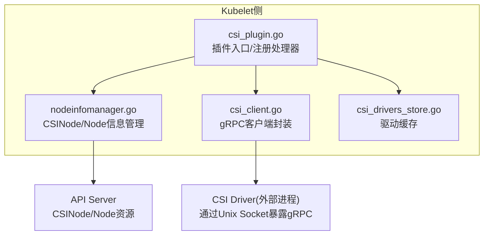
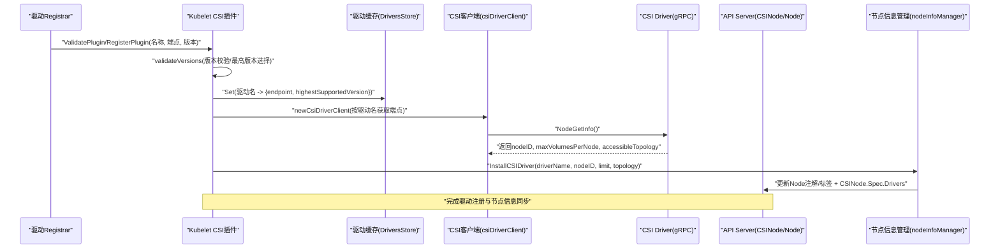
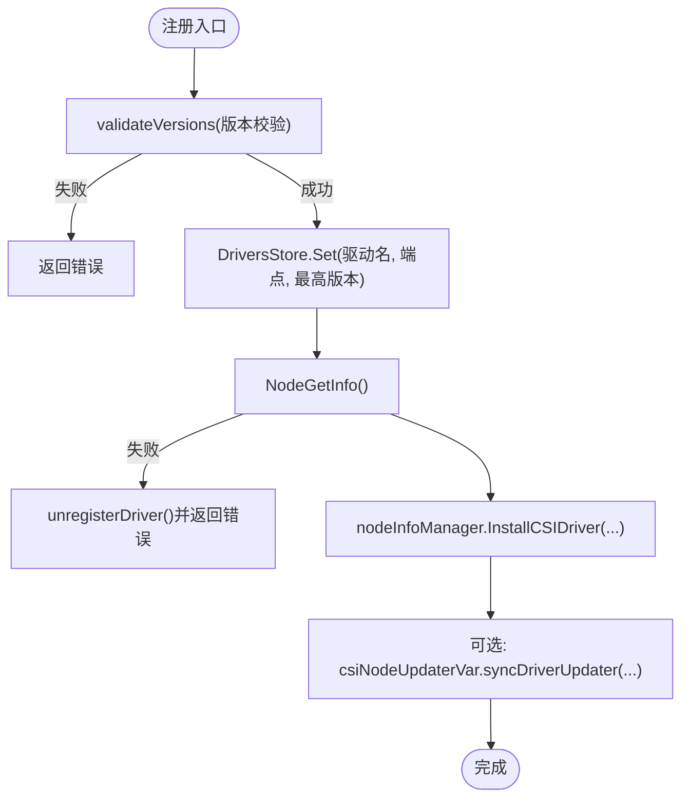
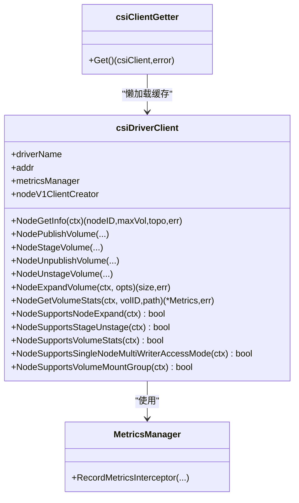
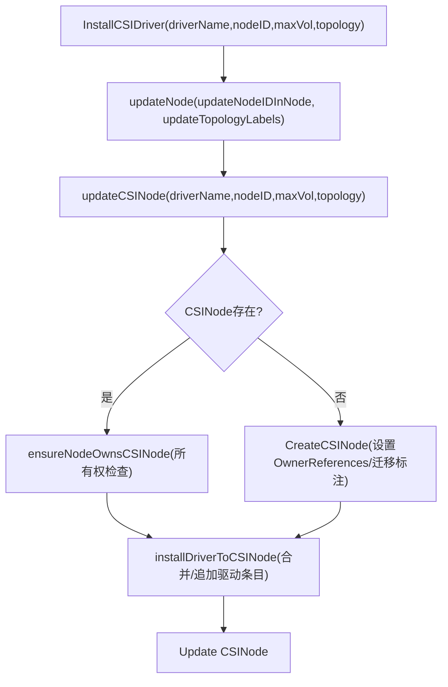
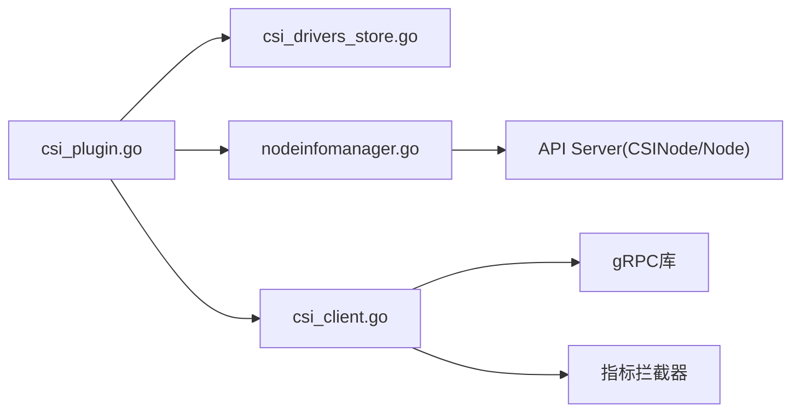

# CSI架构设计

<cite>
**本文引用的文件**   
- [pkg/volume/csi/csi_plugin.go](file://pkg/volume/csi/csi_plugin.go)
- [pkg/volume/csi/csi_client.go](file://pkg/volume/csi/csi_client.go)
- [pkg/volume/csi/nodeinfomanager/nodeinfomanager.go](file://pkg/volume/csi/nodeinfomanager/nodeinfomanager.go)
- [pkg/volume/csi/csi_drivers_store.go](file://pkg/volume/csi/csi_drivers_store.go)
</cite>

## 目录
1. [简介](#简介)
2. [项目结构](#项目结构)
3. [核心组件](#核心组件)
4. [架构总览](#架构总览)
5. [详细组件分析](#详细组件分析)
6. [依赖关系分析](#依赖关系分析)
7. [性能考量](#性能考量)
8. [故障排查指南](#故障排查指南)
9. [结论](#结论)
10. [附录](#附录)

## 简介
本技术文档围绕Kubernetes中的CSI（Container Storage Interface）架构，系统性阐述以下要点：
- CSI规范的核心理念与职责分离：Volume插件与Controller插件的边界与协作。
- CSI客户端库实现原理：gRPC连接管理、错误处理与重试机制。
- CSI驱动发现与服务注册：NodeInfo管理与DriverStore缓存策略。
- 组件交互图与数据流说明：从Pod调度到挂载/卸载的全链路。
- 与Kubernetes核心组件的集成点：VolumeAttachment控制器与节点代理通信协议。
- CSI能力协商与版本兼容性处理：NodeGetCapabilities、版本选择与向后兼容策略。

## 项目结构
本仓库中与CSI相关的核心代码位于pkg/volume/csi及其子包nodeinfomanager中，主要包含：
- csi_plugin.go：CSI插件入口、生命周期、注册处理器、Mounter/Attacher/Detacher工厂等。
- csi_client.go：CSI Node服务gRPC客户端封装、能力探测、访问模式映射、错误分类与不确定进度处理。
- nodeinfomanager/nodeinfomanager.go：CSINode对象与Node注解/标签的管理，含拓扑信息、最大卷数限制、迁移标注等。
- csi_drivers_store.go：进程内驱动的端点与最高支持版本缓存。

图表来源
- [pkg/volume/csi/csi_plugin.go:105-170](file://pkg/volume/csi/csi_plugin.go#L105-L170)
- [pkg/volume/csi/csi_client.go:142-170](file://pkg/volume/csi/csi_client.go#L142-L170)
- [pkg/volume/csi/nodeinfomanager/nodeinfomanager.go:112-142](file://pkg/volume/csi/nodeinfomanager/nodeinfomanager.go#L112-L142)
- [pkg/volume/csi/csi_drivers_store.go:25-80](file://pkg/volume/csi/csi_drivers_store.go#L25-L80)

章节来源
- [pkg/volume/csi/csi_plugin.go:66-101](file://pkg/volume/csi/csi_plugin.go#L66-L101)
- [pkg/volume/csi/csi_client.go:108-170](file://pkg/volume/csi/csi_client.go#L108-L170)
- [pkg/volume/csi/nodeinfomanager/nodeinfomanager.go:61-106](file://pkg/volume/csi/nodeinfomanager/nodeinfomanager.go#L61-L106)
- [pkg/volume/csi/csi_drivers_store.go:25-80](file://pkg/volume/csi/csi_drivers_store.go#L25-L80)

## 核心组件
- CSI插件（csiPlugin）：作为Kubelet Volume插件的实现，负责驱动注册验证、创建Mounter/Attacher/Detacher、重建Spec、判断是否可挂载/设备挂载等。
- CSI客户端（csiDriverClient）：对CSI Node服务的gRPC调用进行封装，包括NodeGetInfo、Stage/Publish/Unstage/Unpublish、Expand、Stats、能力探测等。
- 节点信息管理（nodeInfoManager）：维护Node对象的注解（驱动节点ID）、标签（拓扑），以及CSINode对象的Drivers列表（含最大卷数限制）。
- 驱动存储（DriversStore）：进程内缓存已注册的CSI驱动端点与其最高支持的CSI版本。

章节来源
- [pkg/volume/csi/csi_plugin.go:66-101](file://pkg/volume/csi/csi_plugin.go#L66-L101)
- [pkg/volume/csi/csi_client.go:108-170](file://pkg/volume/csi/csi_client.go#L108-L170)
- [pkg/volume/csi/nodeinfomanager/nodeinfomanager.go:61-106](file://pkg/volume/csi/nodeinfomanager/nodeinfomanager.go#L61-L106)
- [pkg/volume/csi/csi_drivers_store.go:25-80](file://pkg/volume/csi/csi_drivers_store.go#L25-L80)

## 架构总览
下图展示了Kubelet侧CSI插件与外部CSI驱动、API Server之间的交互关系，涵盖驱动注册、能力协商、节点信息上报与卷操作路径。

图表来源
- [pkg/volume/csi/csi_plugin.go:105-170](file://pkg/volume/csi/csi_plugin.go#L105-L170)
- [pkg/volume/csi/csi_client.go:172-209](file://pkg/volume/csi/csi_client.go#L172-L209)
- [pkg/volume/csi/nodeinfomanager/nodeinfomanager.go:112-142](file://pkg/volume/csi/nodeinfomanager/nodeinfomanager.go#L112-L142)
- [pkg/volume/csi/csi_drivers_store.go:50-61](file://pkg/volume/csi/csi_drivers_store.go#L50-L61)

## 详细组件分析

### CSI插件（csiPlugin）与注册流程
- 插件初始化：在Init阶段设置Host、Lister、Informer，并启动CSINode初始化流程，确保Kubelet Ready前完成必要的CSINode准备。
- 注册处理器：
  - ValidatePlugin：校验驱动声明的版本列表，拒绝不支持或空版本。
  - RegisterPlugin：将驱动端点与最高支持版本写入驱动缓存；调用NodeGetInfo获取节点信息；通过nodeInfoManager安装/更新CSINode；必要时触发CSINodeUpdater同步。
  - DeRegisterPlugin：移除驱动缓存并触发同步。
- 卷操作入口：NewMounter/NewUnmounter/NewBlockVolumeMapper等根据Spec构造具体Mounter/BlockMapper，并持久化卷元数据以便后续清理。

图表来源
- [pkg/volume/csi/csi_plugin.go:105-170](file://pkg/volume/csi/csi_plugin.go#L105-L170)
- [pkg/volume/csi/csi_plugin.go:242-266](file://pkg/volume/csi/csi_plugin.go#L242-L266)
- [pkg/volume/csi/csi_client.go:172-209](file://pkg/volume/csi/csi_client.go#L172-L209)
- [pkg/volume/csi/nodeinfomanager/nodeinfomanager.go:112-142](file://pkg/volume/csi/nodeinfomanager/nodeinfomanager.go#L112-L142)

章节来源
- [pkg/volume/csi/csi_plugin.go:281-359](file://pkg/volume/csi/csi_plugin.go#L281-L359)
- [pkg/volume/csi/csi_plugin.go:105-170](file://pkg/volume/csi/csi_plugin.go#L105-L170)
- [pkg/volume/csi/csi_plugin.go:474-538](file://pkg/volume/csi/csi_plugin.go#L474-L538)
- [pkg/volume/csi/csi_plugin.go:729-800](file://pkg/volume/csi/csi_plugin.go#L729-L800)

### CSI客户端（csiDriverClient）与gRPC连接管理
- 连接建立：通过newGrpcConn使用Unix域套接字与驱动通信，注入指标拦截器以记录调用统计。
- 客户端获取：csiClientGetter提供带双检锁的懒加载缓存，避免重复创建连接。
- 能力协商：NodeSupports*系列方法基于NodeGetCapabilities结果判定是否支持特定功能（如单节点多写、扩展、统计、卷条件等）。
- 访问模式映射：根据是否支持SINGLE_NODE_MULTI_WRITER，动态选择访问模式映射函数，兼容ReadWriteOncePod等模式。
- 错误处理与重试：isFinalError区分“最终错误”与“不确定进度错误”，后者会被包装为UncertainProgressError，供上层进行重试。

图表来源
- [pkg/volume/csi/csi_client.go:108-170](file://pkg/volume/csi/csi_client.go#L108-L170)
- [pkg/volume/csi/csi_client.go:532-545](file://pkg/volume/csi/csi_client.go#L532-L545)
- [pkg/volume/csi/csi_client.go:553-578](file://pkg/volume/csi/csi_client.go#L553-L578)
- [pkg/volume/csi/csi_client.go:482-530](file://pkg/volume/csi/csi_client.go#L482-L530)
- [pkg/volume/csi/csi_client.go:714-736](file://pkg/volume/csi/csi_client.go#L714-L736)

章节来源
- [pkg/volume/csi/csi_client.go:142-170](file://pkg/volume/csi/csi_client.go#L142-L170)
- [pkg/volume/csi/csi_client.go:532-545](file://pkg/volume/csi/csi_client.go#L532-L545)
- [pkg/volume/csi/csi_client.go:553-578](file://pkg/volume/csi/csi_client.go#L553-L578)
- [pkg/volume/csi/csi_client.go:482-530](file://pkg/volume/csi/csi_client.go#L482-L530)
- [pkg/volume/csi/csi_client.go:714-736](file://pkg/volume/csi/csi_client.go#L714-L736)

### 节点信息管理（nodeInfoManager）
- Node注解：维护csi.volume.kubernetes.io/nodeid，记录各驱动对应的驱动侧节点ID。
- Node标签：同步驱动上报的拓扑键值对，冲突时拒绝更新。
- CSINode对象：
  - Drivers列表：包含驱动名、节点ID、拓扑键集合、最大卷数限制（Allocatable.Count）。
  - 迁移标注：根据migratedPlugins动态设置MigratedPluginsAnnotationKey，便于控制面识别迁移状态。
- 幂等与并发：内部加锁保证同一节点串行更新；对外部并发调用采用指数退避重试，避免冲突。

图表来源
- [pkg/volume/csi/nodeinfomanager/nodeinfomanager.go:112-142](file://pkg/volume/csi/nodeinfomanager/nodeinfomanager.go#L112-L142)
- [pkg/volume/csi/nodeinfomanager/nodeinfomanager.go:163-220](file://pkg/volume/csi/nodeinfomanager/nodeinfomanager.go#L163-L220)
- [pkg/volume/csi/nodeinfomanager/nodeinfomanager.go:360-408](file://pkg/volume/csi/nodeinfomanager/nodeinfomanager.go#L360-L408)
- [pkg/volume/csi/nodeinfomanager/nodeinfomanager.go:502-529](file://pkg/volume/csi/nodeinfomanager/nodeinfomanager.go#L502-L529)
- [pkg/volume/csi/nodeinfomanager/nodeinfomanager.go:591-650](file://pkg/volume/csi/nodeinfomanager/nodeinfomanager.go#L591-L650)

章节来源
- [pkg/volume/csi/nodeinfomanager/nodeinfomanager.go:112-142](file://pkg/volume/csi/nodeinfomanager/nodeinfomanager.go#L112-L142)
- [pkg/volume/csi/nodeinfomanager/nodeinfomanager.go:163-220](file://pkg/volume/csi/nodeinfomanager/nodeinfomanager.go#L163-L220)
- [pkg/volume/csi/nodeinfomanager/nodeinfomanager.go:360-408](file://pkg/volume/csi/nodeinfomanager/nodeinfomanager.go#L360-L408)
- [pkg/volume/csi/nodeinfomanager/nodeinfomanager.go:502-529](file://pkg/volume/csi/nodeinfomanager/nodeinfomanager.go#L502-L529)
- [pkg/volume/csi/nodeinfomanager/nodeinfomanager.go:591-650](file://pkg/volume/csi/nodeinfomanager/nodeinfomanager.go#L591-L650)

### 驱动缓存（DriversStore）
- 数据结构：以驱动名为键，保存端点与最高支持版本。
- 并发安全：读写互斥保护，Get/Set/Delete/Clear均为线程安全。
- 作用：为新创建的csiDriverClient快速定位驱动端点，避免每次请求都解析或查询。

章节来源
- [pkg/volume/csi/csi_drivers_store.go:25-80](file://pkg/volume/csi/csi_drivers_store.go#L25-L80)

## 依赖关系分析
- csi_plugin.go依赖：
  - DriversStore：用于注册/查找驱动端点与版本。
  - nodeInfoManager：用于安装/更新CSINode与Node信息。
  - csi_client.go：用于调用NodeGetInfo及后续卷操作。
- csi_client.go依赖：
  - gRPC库：建立与CSI驱动的gRPC连接。
  - 指标管理器：通过拦截器记录调用指标。
  - 能力探测：NodeGetCapabilities决定访问模式映射与特性开关。
- nodeinfomanager.go依赖：
  - Kubernetes API：读写Node与CSINode资源。
  - 指数退避：应对并发更新冲突。

图表来源
- [pkg/volume/csi/csi_plugin.go:105-170](file://pkg/volume/csi/csi_plugin.go#L105-L170)
- [pkg/volume/csi/csi_client.go:142-170](file://pkg/volume/csi/csi_client.go#L142-L170)
- [pkg/volume/csi/nodeinfomanager/nodeinfomanager.go:112-142](file://pkg/volume/csi/nodeinfomanager/nodeinfomanager.go#L112-L142)
- [pkg/volume/csi/csi_drivers_store.go:25-80](file://pkg/volume/csi/csi_drivers_store.go#L25-L80)

章节来源
- [pkg/volume/csi/csi_plugin.go:105-170](file://pkg/volume/csi/csi_plugin.go#L105-L170)
- [pkg/volume/csi/csi_client.go:142-170](file://pkg/volume/csi/csi_client.go#L142-L170)
- [pkg/volume/csi/nodeinfomanager/nodeinfomanager.go:112-142](file://pkg/volume/csi/nodeinfomanager/nodeinfomanager.go#L112-L142)
- [pkg/volume/csi/csi_drivers_store.go:25-80](file://pkg/volume/csi/csi_drivers_store.go#L25-L80)

## 性能考量
- gRPC连接复用：通过csiClientGetter懒加载与缓存减少连接创建开销。
- 指标采集：gRPC拦截器统一记录调用耗时与错误，便于观测与定位瓶颈。
- 幂等更新：nodeInfoManager对Node/CSINode更新采用幂等逻辑与指数退避，降低冲突导致的额外开销。
- 访问模式映射优化：仅在需要时根据能力切换映射函数，避免不必要的分支判断。

[本节为通用指导，不直接分析具体文件]

## 故障排查指南
- 驱动注册失败：
  - 检查ValidatePlugin返回的错误，确认驱动声明的版本列表非空且被支持。
  - 若NodeGetInfo失败，会触发unregisterDriver并返回错误，需检查驱动端点可达性与鉴权。
- 节点信息不同步：
  - 观察Node注解csi.volume.kubernetes.io/nodeid与CSINode.Spec.Drivers是否正确更新。
  - 关注拓扑键冲突日志，避免驱动上报与现有标签不一致。
- 卷操作异常：
  - 若错误被标记为“不确定进度”，上层可能进行重试；请结合驱动日志确认实际状态。
  - 对于ResourceExhausted等错误，插件会尝试刷新驱动信息并重新评估。

章节来源
- [pkg/volume/csi/csi_plugin.go:105-170](file://pkg/volume/csi/csi_plugin.go#L105-L170)
- [pkg/volume/csi/csi_plugin.go:242-266](file://pkg/volume/csi/csi_plugin.go#L242-L266)
- [pkg/volume/csi/csi_client.go:714-736](file://pkg/volume/csi/csi_client.go#L714-L736)
- [pkg/volume/csi/nodeinfomanager/nodeinfomanager.go:336-358](file://pkg/volume/csi/nodeinfomanager/nodeinfomanager.go#L336-L358)

## 结论
Kubernetes CSI架构通过清晰的职责分离与标准化接口，实现了存储驱动的可插拔与跨平台一致性。Kubelet侧的CSI插件负责驱动发现、能力协商与节点信息上报；CSI客户端封装了gRPC通信、能力探测与错误分类；节点信息管理模块确保集群状态一致与幂等更新。整体设计兼顾可靠性、可扩展性与可观测性，为大规模生产环境提供了坚实基础。

[本节为总结性内容，不直接分析具体文件]

## 附录
- CSI规范理念简述：
  - Volume插件：运行在节点上，负责卷的挂载、卸载、扩容、统计等本地操作。
  - Controller插件：运行在控制面，负责卷的生命周期管理（创建、删除、快照、克隆等）。
- 与Kubernetes核心组件的集成点：
  - VolumeAttachment控制器：协调Attach/Detach过程，与CSI驱动交互完成卷绑定与解绑。
  - 节点代理（kubelet）：通过CSI插件与驱动通信，执行具体的挂载/卸载动作。
- 版本兼容性与能力协商：
  - 注册阶段选择最高支持的CSI版本，确保向后兼容。
  - 运行时通过NodeGetCapabilities探测特性，动态调整行为（如访问模式映射、是否启用扩展/统计等）。

[本节为概念性内容，不直接分析具体文件]