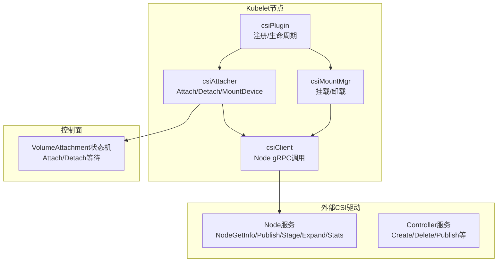
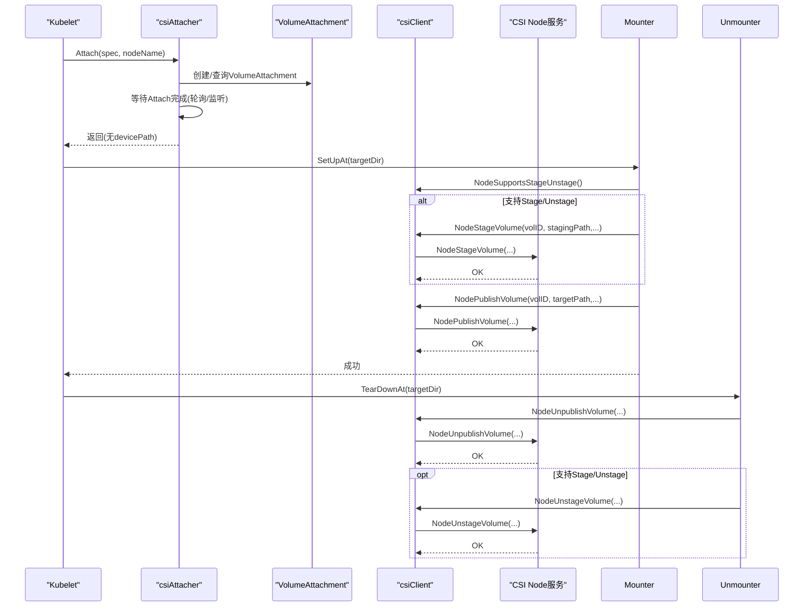
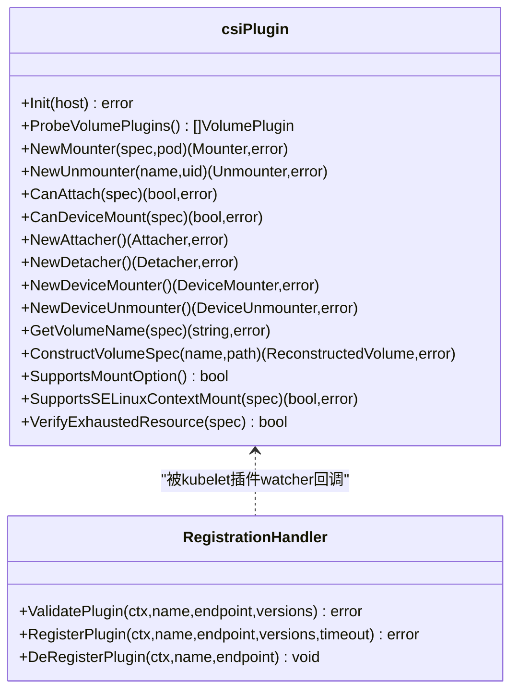
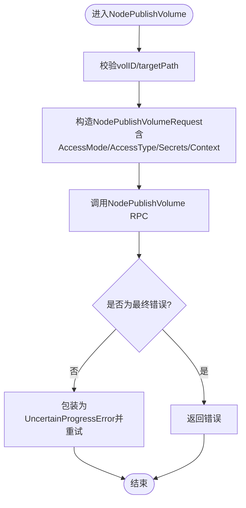
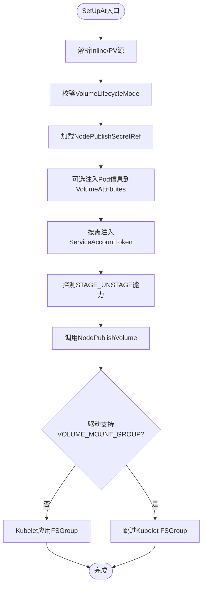
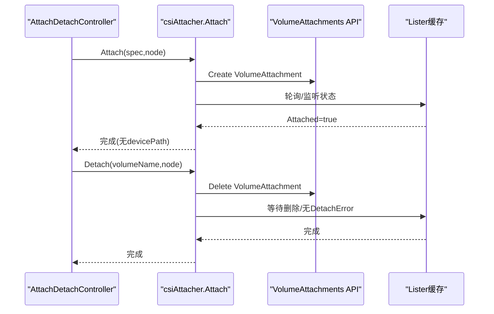
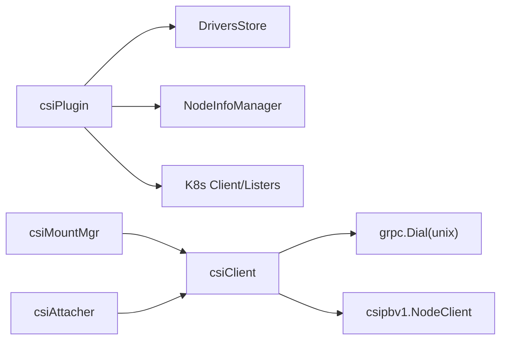

# CSI驱动开发指南

<cite>
**本文引用的文件**   
- [pkg/volume/csi/csi_plugin.go](file://pkg/volume/csi/csi_plugin.go)
- [pkg/volume/csi/csi_client.go](file://pkg/volume/csi/csi_client.go)
- [pkg/volume/csi/csi_mounter.go](file://pkg/volume/csi/csi_mounter.go)
- [pkg/volume/csi/csi_attacher.go](file://pkg/volume/csi/csi_attacher.go)
- [pkg/volume/csi/fake/fake_client.go](file://pkg/volume/csi/fake/fake_client.go)
- [staging/src/k8s.io/csi-translation-lib/translate.go](file://staging/src/k8s.io/csi-translation-lib/translate.go)
</cite>

## 目录
1. [简介](#简介)
2. [项目结构](#项目结构)
3. [核心组件](#核心组件)
4. [架构总览](#架构总览)
5. [详细组件分析](#详细组件分析)
6. [依赖关系分析](#依赖关系分析)
7. [性能与可扩展性](#性能与可扩展性)
8. [故障排查指南](#故障排查指南)
9. [结论](#结论)
10. [附录](#附录)

## 简介
本指南面向Kubernetes CSI（Container Storage Interface）驱动开发者，基于仓库内现有实现，系统阐述CSI节点服务与控制器服务的开发模式、gRPC接口调用约定、能力声明与元数据管理、迁移库使用方式，以及测试框架与调试技巧。文档以代码级事实为依据，提供可视化架构图与流程图，帮助读者快速上手并构建高质量CSI驱动。

## 项目结构
本仓库中与CSI驱动开发密切相关的核心代码位于以下路径：
- 节点侧插件与客户端：pkg/volume/csi/*
- 测试用Fake CSI Node/Controller客户端：pkg/volume/csi/fake/*
- 传统存储到CSI的翻译库：staging/src/k8s.io/csi-translation-lib/*

图表来源
- [pkg/volume/csi/csi_plugin.go:66-170](file://pkg/volume/csi/csi_plugin.go#L66-L170)
- [pkg/volume/csi/csi_mounter.go:64-120](file://pkg/volume/csi/csi_mounter.go#L64-L120)
- [pkg/volume/csi/csi_attacher.go:48-140](file://pkg/volume/csi/csi_attacher.go#L48-L140)
- [pkg/volume/csi/csi_client.go:109-170](file://pkg/volume/csi/csi_client.go#L109-L170)

章节来源
- [pkg/volume/csi/csi_plugin.go:66-170](file://pkg/volume/csi/csi_plugin.go#L66-L170)
- [pkg/volume/csi/csi_mounter.go:64-120](file://pkg/volume/csi/csi_mounter.go#L64-L120)
- [pkg/volume/csi/csi_attacher.go:48-140](file://pkg/volume/csi/csi_attacher.go#L48-L140)
- [pkg/volume/csi/csi_client.go:109-170](file://pkg/volume/csi/csi_client.go#L109-L170)

## 核心组件
- csiPlugin：节点侧CSI插件入口，负责插件发现、版本校验、CSINode初始化、挂载/块设备/卸载器构造、能力探测与资源耗尽检测等。
- csiClient：封装对CSI Node服务的gRPC调用，包括NodeGetInfo、NodePublish/Unpublish、NodeStage/Unstage、NodeExpand、NodeGetVolumeStats及能力探测。
- csiMountMgr：实现volume.Mounter/Unmounter，完成卷发布前的参数组装、FSGroup/SELinux处理、持久化卷信息、调用NodePublish/Unpublish。
- csiAttacher：实现Attach/Detach与设备挂载（MountDevice/UnmountDevice），通过VolumeAttachment对象协调外部AttachDetach流程，并在支持STAGE_UNSTAGE时调用NodeStage/Unstage。
- Fake客户端：提供Node/Controller的模拟实现，便于单元测试与集成测试。
- CSI翻译库：将In-tree存储API对象（StorageClass/PV/Inline Volume）转换为CSI等价对象，支持平滑迁移。

章节来源
- [pkg/volume/csi/csi_plugin.go:66-170](file://pkg/volume/csi/csi_plugin.go#L66-L170)
- [pkg/volume/csi/csi_client.go:109-170](file://pkg/volume/csi/csi_client.go#L109-L170)
- [pkg/volume/csi/csi_mounter.go:64-120](file://pkg/volume/csi/csi_mounter.go#L64-L120)
- [pkg/volume/csi/csi_attacher.go:48-140](file://pkg/volume/csi/csi_attacher.go#L48-L140)
- [pkg/volume/csi/fake/fake_client.go:77-147](file://pkg/volume/csi/fake/fake_client.go#L77-L147)
- [staging/src/k8s.io/csi-translation-lib/translate.go:44-107](file://staging/src/k8s.io/csi-translation-lib/translate.go#L44-L107)

## 架构总览
下图展示从Pod调度到卷挂载的关键交互路径，涵盖控制器侧Attach/Detach与节点侧Stage/Publish流程。

图表来源
- [pkg/volume/csi/csi_attacher.go:63-170](file://pkg/volume/csi/csi_attacher.go#L63-L170)
- [pkg/volume/csi/csi_mounter.go:99-160](file://pkg/volume/csi/csi_mounter.go#L99-L160)
- [pkg/volume/csi/csi_client.go:211-287](file://pkg/volume/csi/csi_client.go#L211-L287)
- [pkg/volume/csi/csi_client.go:386-454](file://pkg/volume/csi/csi_client.go#L386-L454)

## 详细组件分析

### 组件A：csiPlugin（节点侧插件入口）
职责要点
- 插件注册与版本校验：接收Registrar上报的端点与支持的CSI版本列表，选择最高兼容版本并记录。
- CSINode初始化：在Kubelet上下文中等待API Server可用后，初始化CSINode注解，确保迁移驱动就绪。
- 挂载/块设备/卸载器构造：根据Spec类型（Inline或PV）构造对应Mounter/BlockMapper/Unmounter。
- 能力与策略：读取CSIDriver.Spec（如RequiresRepublish、SELinuxMount、VolumeLifecycleModes、FSGroupPolicy等）影响行为。
- 资源耗尽检测：当VolumeAttachment出现ResourceExhausted错误时，触发CSIDriver可分配容量更新。

图表来源
- [pkg/volume/csi/csi_plugin.go:66-170](file://pkg/volume/csi/csi_plugin.go#L66-L170)
- [pkg/volume/csi/csi_plugin.go:281-429](file://pkg/volume/csi/csi_plugin.go#L281-L429)
- [pkg/volume/csi/csi_plugin.go:431-472](file://pkg/volume/csi/csi_plugin.go#L431-L472)
- [pkg/volume/csi/csi_plugin.go:474-538](file://pkg/volume/csi/csi_plugin.go#L474-L538)
- [pkg/volume/csi/csi_plugin.go:540-593](file://pkg/volume/csi/csi_plugin.go#L540-L593)
- [pkg/volume/csi/csi_plugin.go:675-715](file://pkg/volume/csi/csi_plugin.go#L675-L715)
- [pkg/volume/csi/csi_plugin.go:192-240](file://pkg/volume/csi/csi_plugin.go#L192-L240)

章节来源
- [pkg/volume/csi/csi_plugin.go:66-170](file://pkg/volume/csi/csi_plugin.go#L66-L170)
- [pkg/volume/csi/csi_plugin.go:281-429](file://pkg/volume/csi/csi_plugin.go#L281-L429)
- [pkg/volume/csi/csi_plugin.go:431-472](file://pkg/volume/csi/csi_plugin.go#L431-L472)
- [pkg/volume/csi/csi_plugin.go:474-538](file://pkg/volume/csi/csi_plugin.go#L474-L538)
- [pkg/volume/csi/csi_plugin.go:540-593](file://pkg/volume/csi/csi_plugin.go#L540-L593)
- [pkg/volume/csi/csi_plugin.go:675-715](file://pkg/volume/csi/csi_plugin.go#L675-L715)
- [pkg/volume/csi/csi_plugin.go:192-240](file://pkg/volume/csi/csi_plugin.go#L192-L240)

### 组件B：csiClient（CSI Node gRPC客户端）
职责要点
- 连接建立：通过Unix Socket与CSI Node服务通信，注入指标拦截器。
- 能力探测：NodeGetCapabilities缓存并判断是否支持EXPAND_VOLUME、STAGE_UNSTAGE_VOLUME、GET_VOLUME_STATS、SINGLE_NODE_MULTI_WRITER、VOLUME_MOUNT_GROUP等。
- 访问模式映射：根据SINGLE_NODE_MULTI_WRITER能力选择不同AccessMode映射。
- 错误分类：区分“最终错误”与“不确定进度”，以便上层重试与清理策略。

图表来源
- [pkg/volume/csi/csi_client.go:211-287](file://pkg/volume/csi/csi_client.go#L211-L287)
- [pkg/volume/csi/csi_client.go:482-530](file://pkg/volume/csi/csi_client.go#L482-L530)
- [pkg/volume/csi/csi_client.go:714-736](file://pkg/volume/csi/csi_client.go#L714-L736)

章节来源
- [pkg/volume/csi/csi_client.go:109-170](file://pkg/volume/csi/csi_client.go#L109-L170)
- [pkg/volume/csi/csi_client.go:211-287](file://pkg/volume/csi/csi_client.go#L211-L287)
- [pkg/volume/csi/csi_client.go:386-454](file://pkg/volume/csi/csi_client.go#L386-L454)
- [pkg/volume/csi/csi_client.go:482-530](file://pkg/volume/csi/csi_client.go#L482-L530)
- [pkg/volume/csi/csi_client.go:714-736](file://pkg/volume/csi/csi_client.go#L714-L736)

### 组件C：csiMountMgr（文件系统挂载）
职责要点
- 生命周期模式校验：依据CSIDriver.Spec.VolumeLifecycleModes检查是否支持Ephemeral/Persistent。
- FSGroup策略：若驱动不支持VOLUME_MOUNT_GROUP，则由Kubelet应用FSGroup；否则委托给驱动。
- SELinux标签：在特性门控开启且驱动支持时，将SELinux标签作为mount选项传递。
- 元数据持久化：将specVolID、volumeHandle、driverName、nodeName、attachmentID、volumeLifecycleMode等写入JSON，供反序列化与卸载时使用。
- 安全令牌注入：按CSIDriver.Spec.TokenRequests与ServiceAccountTokenInSecrets配置，注入service account token至volume_attributes或node_publish_secrets。

图表来源
- [pkg/volume/csi/csi_mounter.go:99-160](file://pkg/volume/csi/csi_mounter.go#L99-L160)
- [pkg/volume/csi/csi_mounter.go:251-274](file://pkg/volume/csi/csi_mounter.go#L251-L274)
- [pkg/volume/csi/csi_mounter.go:275-300](file://pkg/volume/csi/csi_mounter.go#L275-L300)
- [pkg/volume/csi/csi_mounter.go:338-357](file://pkg/volume/csi/csi_mounter.go#L338-L357)
- [pkg/volume/csi/csi_mounter.go:363-421](file://pkg/volume/csi/csi_mounter.go#L363-L421)

章节来源
- [pkg/volume/csi/csi_mounter.go:99-160](file://pkg/volume/csi/csi_mounter.go#L99-L160)
- [pkg/volume/csi/csi_mounter.go:251-274](file://pkg/volume/csi/csi_mounter.go#L251-L274)
- [pkg/volume/csi/csi_mounter.go:275-300](file://pkg/volume/csi/csi_mounter.go#L275-L300)
- [pkg/volume/csi/csi_mounter.go:338-357](file://pkg/volume/csi/csi_mounter.go#L338-L357)
- [pkg/volume/csi/csi_mounter.go:363-421](file://pkg/volume/csi/csi_mounter.go#L363-L421)

### 组件D：csiAttacher（Attach/Detach与设备挂载）
职责要点
- Attach：创建VolumeAttachment对象并等待其Attached=true；WaitForAttach仅验证状态，不返回devicePath。
- Detach：删除VolumeAttachment并等待其被删除或DetachError为空。
- MountDevice/UnmountDevice：在支持STAGE_UNSTAGE时，调用NodeStage/Unstage进行设备级准备与清理；同时持久化必要元数据。
- 错误与超时：统一使用指数退避等待，超时返回明确错误信息。

图表来源
- [pkg/volume/csi/csi_attacher.go:63-170](file://pkg/volume/csi/csi_attacher.go#L63-L170)
- [pkg/volume/csi/csi_attacher.go:417-483](file://pkg/volume/csi/csi_attacher.go#L417-L483)
- [pkg/volume/csi/csi_attacher.go:264-411](file://pkg/volume/csi/csi_attacher.go#L264-L411)
- [pkg/volume/csi/csi_attacher.go:526-590](file://pkg/volume/csi/csi_attacher.go#L526-L590)

章节来源
- [pkg/volume/csi/csi_attacher.go:63-170](file://pkg/volume/csi/csi_attacher.go#L63-L170)
- [pkg/volume/csi/csi_attacher.go:264-411](file://pkg/volume/csi/csi_attacher.go#L264-L411)
- [pkg/volume/csi/csi_attacher.go:417-483](file://pkg/volume/csi/csi_attacher.go#L417-L483)
- [pkg/volume/csi/csi_attacher.go:526-590](file://pkg/volume/csi/csi_attacher.go#L526-L590)

### 组件E：Fake CSI客户端（测试）
用途
- 提供Node/Controller接口的内存实现，支持设置能力、注入错误、记录已发布/预分发的卷、模拟扩容响应等。
- 典型用法：在单元测试中替换真实gRPC连接，断言调用参数与副作用（如目标路径创建、上下文字段）。

章节来源
- [pkg/volume/csi/fake/fake_client.go:77-147](file://pkg/volume/csi/fake/fake_client.go#L77-L147)
- [pkg/volume/csi/fake/fake_client.go:192-244](file://pkg/volume/csi/fake/fake_client.go#L192-L244)
- [pkg/volume/csi/fake/fake_client.go:268-322](file://pkg/volume/csi/fake/fake_client.go#L268-L322)
- [pkg/volume/csi/fake/fake_client.go:324-347](file://pkg/volume/csi/fake/fake_client.go#L324-L347)
- [pkg/volume/csi/fake/fake_client.go:357-425](file://pkg/volume/csi/fake/fake_client.go#L357-L425)
- [pkg/volume/csi/fake/fake_client.go:451-523](file://pkg/volume/csi/fake/fake_client.go#L451-L523)

### 组件F：CSI迁移库（in-tree -> CSI）
功能
- 将In-tree StorageClass/PV/Inline Volume转换为CSI等价对象，支持常见云厂商与第三方驱动。
- 提供双向查询工具：根据名称获取对应的CSI/In-tree驱动名，判断是否可迁移，修复volume handle等。

章节来源
- [staging/src/k8s.io/csi-translation-lib/translate.go:44-107](file://staging/src/k8s.io/csi-translation-lib/translate.go#L44-L107)
- [staging/src/k8s.io/csi-translation-lib/translate.go:109-184](file://staging/src/k8s.io/csi-translation-lib/translate.go#L109-L184)
- [staging/src/k8s.io/csi-translation-lib/translate.go:186-213](file://staging/src/k8s.io/csi-translation-lib/translate.go#L186-L213)

## 依赖关系分析
- csiPlugin依赖：
  - nodeinfomanager：安装/更新CSINode注解，维护节点拓扑与最大卷数。
  - csiDrivers Store：保存已注册驱动端点与最高支持版本。
  - kube client/listers：访问CSIDriver、VolumeAttachment等资源。
- csiMountMgr/csiAttacher依赖：
  - csiClient：封装Node服务gRPC调用。
  - volume host：获取pod目录、挂载器、token getter等。
- csiClient依赖：
  - grpc：Unix Socket连接与指标拦截器。
  - csipbv1：CSI v1 Node接口定义。

图表来源
- [pkg/volume/csi/csi_plugin.go:66-170](file://pkg/volume/csi/csi_plugin.go#L66-L170)
- [pkg/volume/csi/csi_client.go:532-545](file://pkg/volume/csi/csi_client.go#L532-L545)
- [pkg/volume/csi/csi_client.go:142-151](file://pkg/volume/csi/csi_client.go#L142-L151)

章节来源
- [pkg/volume/csi/csi_plugin.go:66-170](file://pkg/volume/csi/csi_plugin.go#L66-L170)
- [pkg/volume/csi/csi_client.go:532-545](file://pkg/volume/csi/csi_client.go#L532-L545)
- [pkg/volume/csi/csi_client.go:142-151](file://pkg/volume/csi/csi_client.go#L142-L151)

## 性能与可扩展性
- 连接复用与延迟初始化：csiClientGetter采用双检锁缓存，避免重复创建gRPC连接。
- 指标采集：通过UnaryInterceptor记录Node服务调用指标，便于监控与定位瓶颈。
- 能力探测缓存：NodeGetCapabilities结果用于后续分支决策，减少不必要RPC。
- 超时与退避：Attach/Detach等待使用指数退避与超时控制，避免长时间阻塞。
- 资源耗尽恢复：检测到ResourceExhausted时主动更新CSIDriver可分配容量，提升调度成功率。

[本节为通用指导，无需源码引用]

## 故障排查指南
- 常见问题
  - 驱动未注册或端点不可达：检查Registrar日志与Unix Socket路径，确认RegisterPlugin成功。
  - 版本不兼容：ValidatePlugin拒绝不支持的版本范围，需升级驱动或调整兼容性。
  - 挂载失败：查看NodePublish/NodeStage返回值与错误码，关注UncertainProgressError场景。
  - 权限问题：FSGroup/VOLUME_MOUNT_GROUP策略不一致导致权限异常，核对CSIDriver.Spec.FSGroupPolicy与驱动能力。
  - 令牌注入失败：确认CSIDriver.Spec.TokenRequests与ServiceAccountTokenInSecrets配置正确。
- 定位手段
  - 启用klog高日志级别，关注关键路径日志（注册、能力探测、RPC调用、错误分类）。
  - 使用Fake客户端复现特定错误路径，验证上层逻辑健壮性。
  - 观察VolumeAttachment状态与Attach/Detach错误消息，定位外部AttachDetach控制器问题。

章节来源
- [pkg/volume/csi/csi_plugin.go:105-170](file://pkg/volume/csi/csi_plugin.go#L105-L170)
- [pkg/volume/csi/csi_client.go:714-736](file://pkg/volume/csi/csi_client.go#L714-L736)
- [pkg/volume/csi/csi_mounter.go:338-357](file://pkg/volume/csi/csi_mounter.go#L338-L357)
- [pkg/volume/csi/csi_mounter.go:363-421](file://pkg/volume/csi/csi_mounter.go#L363-L421)
- [pkg/volume/csi/csi_attacher.go:625-662](file://pkg/volume/csi/csi_attacher.go#L625-L662)

## 结论
本指南基于仓库内CSI实现，系统梳理了节点侧插件、客户端、挂载器与附加器的职责边界与协作流程，结合Fake客户端与迁移库，提供了从开发、测试到排障的完整路径。遵循本文最佳实践与图示流程，可高效构建符合CSI规范的驱动，并确保在生产环境中的稳定性与可观测性。

[本节为总结，无需源码引用]

## 附录
- 开发清单
  - 实现CSI Node服务：至少支持NodeGetInfo、NodePublish/Unpublish；建议支持NodeStage/Unstage、NodeExpand、NodeGetVolumeStats。
  - 暴露NodeGetCapabilities：准确声明SINGLE_NODE_MULTI_WRITER、VOLUME_MOUNT_GROUP等能力。
  - 错误语义：严格区分最终错误与不确定进度错误，配合上层重试与清理。
  - 元数据管理：持久化必要的卷信息，保证反序列化与卸载一致性。
  - 安全与鉴权：按需注入ServiceAccountToken至volume_attributes或secrets。
- 测试建议
  - 使用Fake Node/Controller客户端覆盖正常路径与错误分支。
  - 针对能力开关（Stage/Unstage、Expand、Stats、MultiWriter、VolumeMountGroup）编写用例。
  - 模拟超时与资源耗尽，验证退避与恢复逻辑。
- 部署与镜像
  - 将驱动二进制打包进容器镜像，配合sidecar registrar与node-driver-registrar启动。
  - 通过DaemonSet部署，确保每个节点运行一个实例，并通过Socket与Kubelet通信。
  - 使用Deployment/StatefulSet部署控制器侧服务，暴露Controller服务端口。
- 示例参考
  - 节点侧：参考csi_mounter.go与csi_client.go的调用模式。
  - 控制器侧：参考fake_client.go中ControllerClient的能力与默认实现。
  - 迁移：参考translate.go提供的转换函数与辅助方法。

[本节为补充说明，无需源码引用]