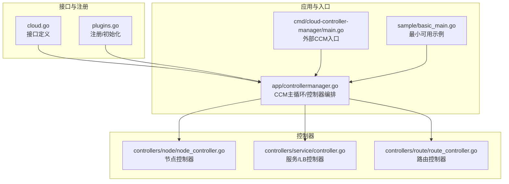
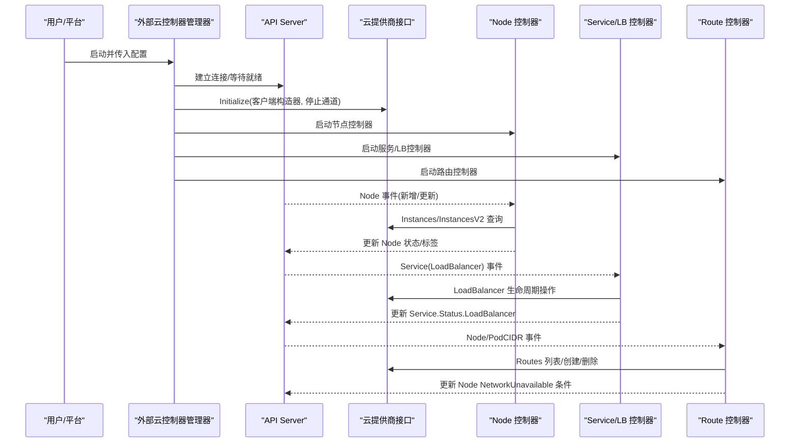
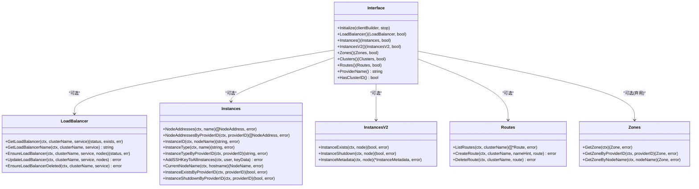
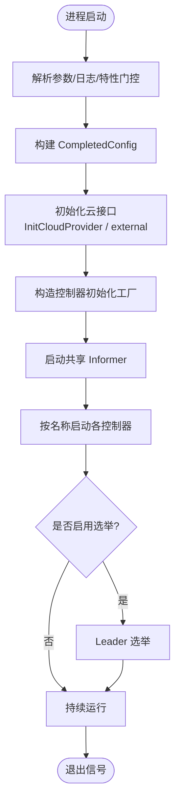
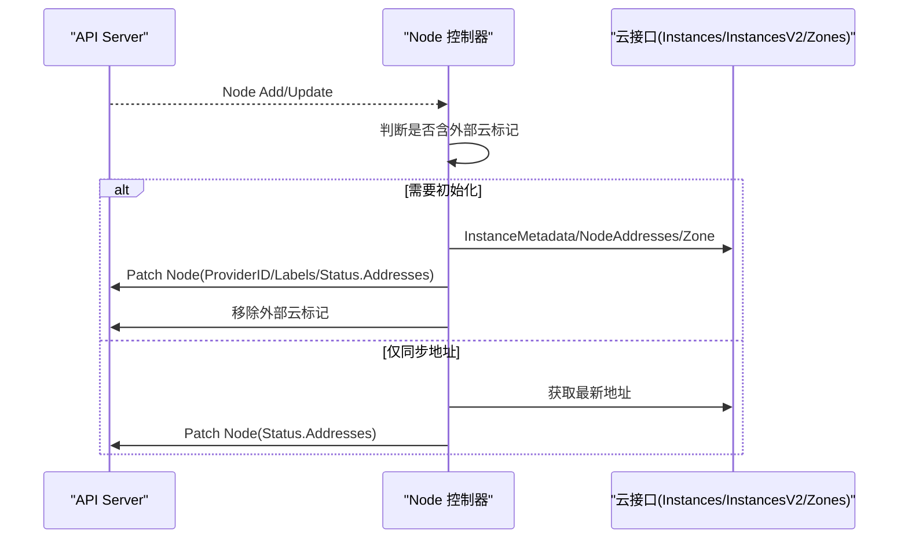
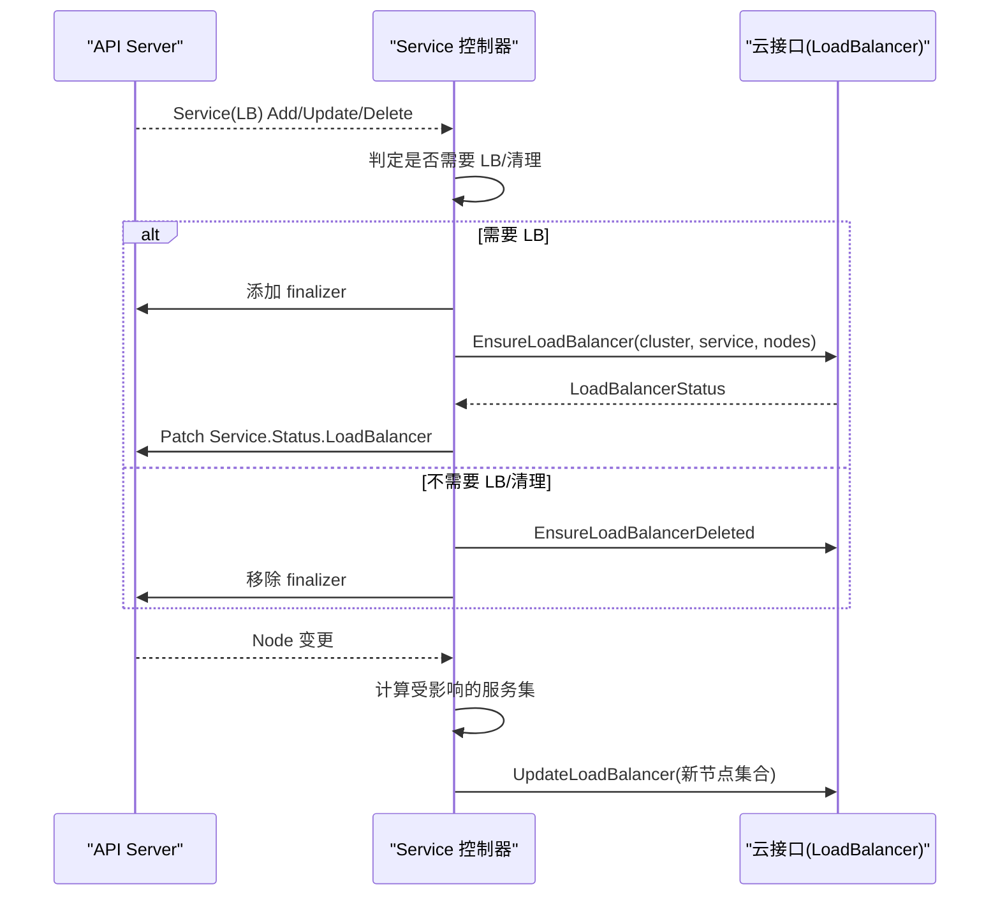
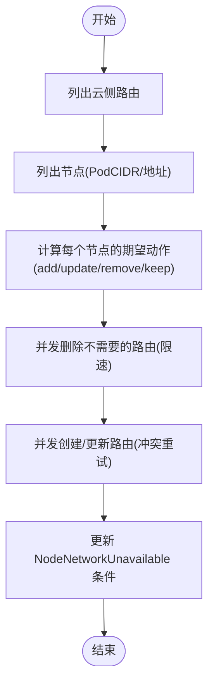
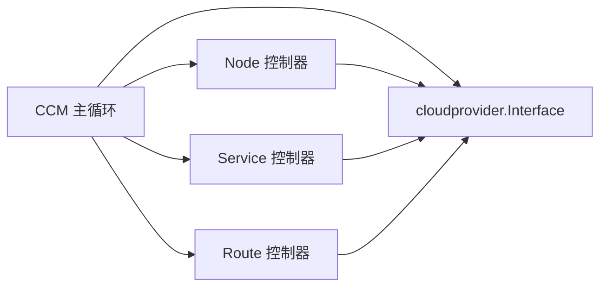

# 云提供商插件

<cite>
**本文引用的文件**   
- [cloud.go](file://staging/src/k8s.io/cloud-provider/cloud.go)
- [plugins.go](file://staging/src/k8s.io/cloud-provider/plugins.go)
- [controllermanager.go](file://staging/src/k8s.io/cloud-provider/app/controllermanager.go)
- [node_controller.go](file://staging/src/k8s.io/cloud-provider/controllers/node/node_controller.go)
- [service_controller.go](file://staging/src/k8s.io/cloud-provider/controllers/service/controller.go)
- [route_controller.go](file://staging/src/k8s.io/cloud-provider/controllers/route/route_controller.go)
- [main.go](file://cmd/cloud-controller-manager/main.go)
- [basic_main.go](file://staging/src/k8s.io/cloud-provider/sample/basic_main.go)
- [retry_error.go](file://staging/src/k8s.io/cloud-provider/api/retry_error.go)
</cite>

## 目录
1. [简介](#简介)
2. [项目结构](#项目结构)
3. [核心组件](#核心组件)
4. [架构总览](#架构总览)
5. [详细组件分析](#详细组件分析)
6. [依赖关系分析](#依赖关系分析)
7. [性能与可扩展性](#性能与可扩展性)
8. [故障排查指南](#故障排查指南)
9. [结论](#结论)
10. [附录：开发与适配最佳实践](#附录开发与适配最佳实践)

## 简介
本文件面向Kubernetes云提供商插件（Cloud Provider）的开发者与维护者，系统性阐述云控制平面抽象、控制器实现与运行期行为。内容覆盖：
- Cloud Provider接口设计与抽象层
- 节点管理、负载均衡器管理、路由管理与持久化存储相关能力
- 云平台特定实现的集成方式与注意事项
- 外部云控制器管理器（CCM）启动流程、认证与资源同步
- Node Controller、Service Controller、Route Controller的职责与交互
- 错误处理、重试机制与测试策略建议
- 开发示例与适配最佳实践

## 项目结构
仓库中云提供商相关代码主要位于 staging/src/k8s.io/cloud-provider 下，包含接口定义、控制器实现、应用入口与样例程序；同时 cmd/cloud-controller-manager 提供外部云控制器管理器的可执行入口。

图示来源
- [cloud.go:42-69](file://staging/src/k8s.io/cloud-provider/cloud.go#L42-L69)
- [plugins.go:98-136](file://staging/src/k8s.io/cloud-provider/plugins.go#L98-L136)
- [controllermanager.go:304-356](file://staging/src/k8s.io/cloud-provider/app/controllermanager.go#L304-L356)
- [node_controller.go:97-154](file://staging/src/k8s.io/cloud-provider/controllers/node/node_controller.go#L97-L154)
- [service_controller.go:76-190](file://staging/src/k8s.io/cloud-provider/controllers/service/controller.go#L76-L190)
- [route_controller.go:71-136](file://staging/src/k8s.io/cloud-provider/controllers/route/route_controller.go#L71-L136)
- [main.go:46-102](file://cmd/cloud-controller-manager/main.go#L46-L102)
- [basic_main.go:42-99](file://staging/src/k8s.io/cloud-provider/sample/basic_main.go#L42-L99)

章节来源
- [cloud.go:42-69](file://staging/src/k8s.io/cloud-provider/cloud.go#L42-L69)
- [plugins.go:98-136](file://staging/src/k8s.io/cloud-provider/plugins.go#L98-L136)
- [controllermanager.go:304-356](file://staging/src/k8s.io/cloud-provider/app/controllermanager.go#L304-L356)
- [node_controller.go:97-154](file://staging/src/k8s.io/cloud-provider/controllers/node/node_controller.go#L97-L154)
- [service_controller.go:76-190](file://staging/src/k8s.io/cloud-provider/controllers/service/controller.go#L76-L190)
- [route_controller.go:71-136](file://staging/src/k8s.io/cloud-provider/controllers/route/route_controller.go#L71-L136)
- [main.go:46-102](file://cmd/cloud-controller-manager/main.go#L46-L102)
- [basic_main.go:42-99](file://staging/src/k8s.io/cloud-provider/sample/basic_main.go#L42-L99)

## 核心组件
- Cloud Provider 接口族
  - Interface：统一入口，提供 LoadBalancer、Instances/InstancesV2、Zones、Routes、Clusters、ProviderName、HasClusterID 等能力探测与获取。
  - Instances/InstancesV2：实例元数据、地址、类型、存在性与关机状态查询。
  - LoadBalancer：对外暴露 Service LB 的生命周期与状态同步。
  - Routes：高级路由规则的管理（创建/删除/列举）。
  - Zones：区域/可用区信息（已弃用，推荐通过 InstancesV2 获取）。
- 控制器
  - Node Controller：为带外部云标记的节点注入 providerID、地址、拓扑标签，并清理标记。
  - Service Controller：监听 Service 变更，驱动云厂商 LB 的创建/更新/删除，维护 Status.LoadBalancer。
  - Route Controller：根据节点 PodCIDR 与节点地址，在云上创建/删除/更新路由，并设置 NodeNetworkUnavailable 条件。
- 应用编排
  - CCM 主循环负责初始化云接口、构建 Informer、按名称启用控制器、健康检查与选举。

章节来源
- [cloud.go:42-69](file://staging/src/k8s.io/cloud-provider/cloud.go#L42-L69)
- [cloud.go:138-173](file://staging/src/k8s.io/cloud-provider/cloud.go#L138-L173)
- [cloud.go:175-223](file://staging/src/k8s.io/cloud-provider/cloud.go#L175-L223)
- [cloud.go:245-256](file://staging/src/k8s.io/cloud-provider/cloud.go#L245-L256)
- [cloud.go:271-290](file://staging/src/k8s.io/cloud-provider/cloud.go#L271-L290)
- [node_controller.go:97-154](file://staging/src/k8s.io/cloud-provider/controllers/node/node_controller.go#L97-L154)
- [service_controller.go:76-190](file://staging/src/k8s.io/cloud-provider/controllers/service/controller.go#L76-L190)
- [route_controller.go:71-136](file://staging/src/k8s.io/cloud-provider/controllers/route/route_controller.go#L71-L136)
- [controllermanager.go:304-356](file://staging/src/k8s.io/cloud-provider/app/controllermanager.go#L304-L356)

## 架构总览
外部云控制器管理器作为独立进程运行，加载云提供商实现，按需启动若干控制器，通过 Informer 监听 API Server 资源变化，调用云接口完成实际资源同步。

图示来源
- [controllermanager.go:159-302](file://staging/src/k8s.io/cloud-provider/app/controllermanager.go#L159-L302)
- [controllermanager.go:304-356](file://staging/src/k8s.io/cloud-provider/app/controllermanager.go#L304-L356)
- [node_controller.go:162-209](file://staging/src/k8s.io/cloud-provider/controllers/node/node_controller.go#L162-L209)
- [service_controller.go:222-253](file://staging/src/k8s.io/cloud-provider/controllers/service/controller.go#L222-L253)
- [route_controller.go:164-204](file://staging/src/k8s.io/cloud-provider/controllers/route/route_controller.go#L164-L204)
- [cloud.go:42-69](file://staging/src/k8s.io/cloud-provider/cloud.go#L42-L69)

## 详细组件分析

### Cloud Provider 接口与注册机制
- 接口设计要点
  - Interface 提供能力探测方法（返回 bool），便于按需启用功能。
  - InstancesV2 替代旧式 Zones 接口，减少 API 调用并集中元数据。
  - LoadBalancer 支持 ImplementedElsewhere 语义，允许由其他控制器接管。
  - 常见错误：InstanceNotFound、ImplementedElsewhere、NotImplemented。
- 注册与初始化
  - 通过工厂函数注册云提供商，InitCloudProvider 根据名称与配置文件创建实例。
  - 外部模式（external）时直接返回空，交由外部 CCM 自行实现。

图示来源
- [cloud.go:42-69](file://staging/src/k8s.io/cloud-provider/cloud.go#L42-L69)
- [cloud.go:138-173](file://staging/src/k8s.io/cloud-provider/cloud.go#L138-L173)
- [cloud.go:175-223](file://staging/src/k8s.io/cloud-provider/cloud.go#L175-L223)
- [cloud.go:245-256](file://staging/src/k8s.io/cloud-provider/cloud.go#L245-L256)
- [cloud.go:271-290](file://staging/src/k8s.io/cloud-provider/cloud.go#L271-L290)

章节来源
- [cloud.go:42-69](file://staging/src/k8s.io/cloud-provider/cloud.go#L42-L69)
- [cloud.go:138-173](file://staging/src/k8s.io/cloud-provider/cloud.go#L138-L173)
- [cloud.go:175-223](file://staging/src/k8s.io/cloud-provider/cloud.go#L175-L223)
- [cloud.go:245-256](file://staging/src/k8s.io/cloud-provider/cloud.go#L245-L256)
- [cloud.go:271-290](file://staging/src/k8s.io/cloud-provider/cloud.go#L271-L290)
- [plugins.go:98-136](file://staging/src/k8s.io/cloud-provider/plugins.go#L98-L136)

### 外部云控制器管理器（CCM）启动与控制器编排
- 启动流程
  - 解析命令行参数与日志/指标配置
  - 构建 CompletedConfig，初始化云接口（支持 external 模式）
  - 构造控制器初始化工厂，按名称启用控制器
  - 启动 Informer、健康检查、Leader 选举（可选）
- 控制器注册
  - 默认包含：cloud-node、cloud-node-lifecycle、service、route
  - 可通过自定义 ClientName 隔离 RBAC 身份

图示来源
- [controllermanager.go:80-157](file://staging/src/k8s.io/cloud-provider/app/controllermanager.go#L80-L157)
- [controllermanager.go:159-302](file://staging/src/k8s.io/cloud-provider/app/controllermanager.go#L159-L302)
- [controllermanager.go:304-356](file://staging/src/k8s.io/cloud-provider/app/controllermanager.go#L304-L356)
- [main.go:46-102](file://cmd/cloud-controller-manager/main.go#L46-L102)
- [basic_main.go:42-99](file://staging/src/k8s.io/cloud-provider/sample/basic_main.go#L42-L99)

章节来源
- [controllermanager.go:80-157](file://staging/src/k8s.io/cloud-provider/app/controllermanager.go#L80-L157)
- [controllermanager.go:159-302](file://staging/src/k8s.io/cloud-provider/app/controllermanager.go#L159-L302)
- [controllermanager.go:304-356](file://staging/src/k8s.io/cloud-provider/app/controllermanager.go#L304-L356)
- [main.go:46-102](file://cmd/cloud-controller-manager/main.go#L46-L102)
- [basic_main.go:42-99](file://staging/src/k8s.io/cloud-provider/sample/basic_main.go#L42-L99)

### 节点控制器（Node Controller）
职责与流程
- 监听 Node 事件，对带有外部云标记的节点进行初始化：
  - 从云接口获取 InstanceMetadata（providerID、地址、实例类型、区域/可用区、附加标签）
  - 合并 kubelet 提供的 Hostname/IP，写入 Node.Status.Addresses
  - 移除外部云标记，记录事件与指标
- 周期性同步节点地址，避免漂移

图示来源
- [node_controller.go:162-209](file://staging/src/k8s.io/cloud-provider/controllers/node/node_controller.go#L162-L209)
- [node_controller.go:265-297](file://staging/src/k8s.io/cloud-provider/controllers/node/node_controller.go#L265-L297)
- [node_controller.go:416-487](file://staging/src/k8s.io/cloud-provider/controllers/node/node_controller.go#L416-L487)
- [node_controller.go:576-664](file://staging/src/k8s.io/cloud-provider/controllers/node/node_controller.go#L576-L664)

章节来源
- [node_controller.go:97-154](file://staging/src/k8s.io/cloud-provider/controllers/node/node_controller.go#L97-L154)
- [node_controller.go:162-209](file://staging/src/k8s.io/cloud-provider/controllers/node/node_controller.go#L162-L209)
- [node_controller.go:265-297](file://staging/src/k8s.io/cloud-provider/controllers/node/node_controller.go#L265-L297)
- [node_controller.go:416-487](file://staging/src/k8s.io/cloud-provider/controllers/node/node_controller.go#L416-L487)
- [node_controller.go:576-664](file://staging/src/k8s.io/cloud-provider/controllers/node/node_controller.go#L576-L664)

### 服务/LB 控制器（Service Controller）
职责与流程
- 监听 Service 与 Node 变更，维护云侧 LB 与 Service.Status.LoadBalancer
- 关键逻辑
  - 当 Service 不再需要 LB 或需清理时，删除云侧 LB 并移除 finalizer
  - 需要 LB 时，先添加 finalizer，再调用 EnsureLoadBalancer，最后 patch 状态
  - 支持 ImplementedElsewhere 语义，将 LB 管理交给其他控制器
  - 节点集合变化触发批量后端更新，使用指数退避队列重试

图示来源
- [service_controller.go:222-253](file://staging/src/k8s.io/cloud-provider/controllers/service/controller.go#L222-L253)
- [service_controller.go:323-439](file://staging/src/k8s.io/cloud-provider/controllers/service/controller.go#L323-L439)
- [service_controller.go:713-730](file://staging/src/k8s.io/cloud-provider/controllers/service/controller.go#L713-L730)

章节来源
- [service_controller.go:76-190](file://staging/src/k8s.io/cloud-provider/controllers/service/controller.go#L76-L190)
- [service_controller.go:323-439](file://staging/src/k8s.io/cloud-provider/controllers/service/controller.go#L323-L439)
- [service_controller.go:713-730](file://staging/src/k8s.io/cloud-provider/controllers/service/controller.go#L713-L730)

### 路由控制器（Route Controller）
职责与流程
- 基于节点 PodCIDR 与节点地址，在云上创建/删除/更新路由
- 支持两种模式：
  - 定时全量重算（传统）
  - 基于 Watch 的重算（限流，至少每 10s 一次）
- 完成后更新 NodeNetworkUnavailable 条件

图示来源
- [route_controller.go:164-204](file://staging/src/k8s.io/cloud-provider/controllers/route/route_controller.go#L164-L204)
- [route_controller.go:252-264](file://staging/src/k8s.io/cloud-provider/controllers/route/route_controller.go#L252-L264)
- [route_controller.go:282-501](file://staging/src/k8s.io/cloud-provider/controllers/route/route_controller.go#L282-L501)
- [route_controller.go:503-552](file://staging/src/k8s.io/cloud-provider/controllers/route/route_controller.go#L503-L552)

章节来源
- [route_controller.go:71-136](file://staging/src/k8s.io/cloud-provider/controllers/route/route_controller.go#L71-L136)
- [route_controller.go:164-204](file://staging/src/k8s.io/cloud-provider/controllers/route/route_controller.go#L164-L204)
- [route_controller.go:252-264](file://staging/src/k8s.io/cloud-provider/controllers/route/route_controller.go#L252-L264)
- [route_controller.go:282-501](file://staging/src/k8s.io/cloud-provider/controllers/route/route_controller.go#L282-L501)
- [route_controller.go:503-552](file://staging/src/k8s.io/cloud-provider/controllers/route/route_controller.go#L503-L552)

### 持久化存储管理（CSI 与 PVLabeler）
- 云提供商接口中的 PVLabeler 已弃用，推荐使用 CSI Topology 能力进行拓扑感知与亲和调度。
- 具体存储集成通常由 CSI 插件与 StorageClass 配合完成，不在 cloud-provider 接口内实现。

章节来源
- [cloud.go:292-296](file://staging/src/k8s.io/cloud-provider/cloud.go#L292-L296)

## 依赖关系分析
- 耦合与内聚
  - 控制器强依赖 cloudprovider.Interface，但通过能力探测弱耦合到具体云实现。
  - CCM 通过工厂与名称映射解耦控制器注册与启动。
- 外部依赖
  - Informer/Lister 用于高效缓存与事件分发
  - workqueue 提供速率限制与重试
  - leader election 保障多副本高可用
- 可能的循环依赖
  - 当前结构无循环导入；控制器间通过 API Server 间接通信

图示来源
- [controllermanager.go:304-356](file://staging/src/k8s.io/cloud-provider/app/controllermanager.go#L304-L356)
- [cloud.go:42-69](file://staging/src/k8s.io/cloud-provider/cloud.go#L42-L69)

章节来源
- [controllermanager.go:304-356](file://staging/src/k8s.io/cloud-provider/app/controllermanager.go#L304-L356)
- [cloud.go:42-69](file://staging/src/k8s.io/cloud-provider/cloud.go#L42-L69)

## 性能与可扩展性
- 并行与限流
  - Node 控制器状态更新使用并行工作池
  - Route 控制器对并发 API 调用进行上限控制，并对冲突进行重试
  - Service 控制器使用指数退避队列，避免雪崩
- 重算频率
  - Route 控制器支持 Watch 模式，限制最小重算间隔，降低风暴风险
- 指标与健康检查
  - 控制器启动/停止计数、延迟观测、错误计数
  - CCM 暴露健康检查端点，支持选举健康探针

[本节为通用指导，无需源码引用]

## 故障排查指南
- 常见问题定位
  - 云接口未实现：控制器启动时报错“不支持某能力”，确认 HasClusterID 与能力探测返回值
  - LB 未生效：查看 Service 事件与 Status.LoadBalancer，确认 finalizer 与 EnsureLoadBalancer 调用链
  - 节点未打标签/地址缺失：检查 Node 是否仍带外部云标记，以及 InstanceMetadata 返回情况
  - 路由未创建：关注 NodeNetworkUnavailable 条件与 Route 控制器日志
- 错误与重试
  - RetryError：LB 控制器支持固定间隔重试，适用于“正在创建”等中间态
  - ImplementedElsewhere：表示由其他控制器接管，应忽略相应错误路径
  - InstanceNotFound：实例不存在时的明确语义，避免误删

章节来源
- [retry_error.go:22-43](file://staging/src/k8s.io/cloud-provider/api/retry_error.go#L22-L43)
- [cloud.go:126-137](file://staging/src/k8s.io/cloud-provider/cloud.go#L126-L137)
- [cloud.go:259-263](file://staging/src/k8s.io/cloud-provider/cloud.go#L259-L263)
- [service_controller.go:284-307](file://staging/src/k8s.io/cloud-provider/controllers/service/controller.go#L284-L307)

## 结论
Kubernetes 云提供商插件通过清晰的接口抽象与控制器编排，实现了跨云的一致能力面。Node/Service/Route 控制器分别聚焦于节点初始化、LB 生命周期与网络路由，结合 CCM 的选举与指标体系，形成稳定可扩展的云集成方案。对于新云厂商，建议优先实现 InstancesV2 与 LoadBalancer/Routes 接口，遵循错误与重试约定，并通过最小示例快速验证。

[本节为总结，无需源码引用]

## 附录：开发与适配最佳实践
- 认证与配置
  - 通过 InitCloudProvider 传入云名称与配置文件；external 模式下由外部 CCM 自行实现
  - 若使用自定义 ClientName，需单独安装对应 RBAC
- 资源管理
  - 严格遵循 ProviderID 不可变约定；优先使用 InstancesV2.InstanceMetadata
  - LB 删除必须保证幂等，避免 ImplementedElsewhere 导致资源泄漏
- 状态同步
  - 使用 Informer/Lister 缓存，避免频繁直连 API
  - 合理设置重算周期与限流，避免 API 风暴
- 测试策略
  - 单元测试：模拟云接口返回不同状态（存在/不存在/中间态）
  - 集成测试：在本地集群部署 CCM，验证 LB/路由/节点标签的最终一致性
  - 混沌测试：注入网络抖动与 API 失败，验证重试与回退
- 云平台适配
  - AWS/Azure/GCP 等主流云均提供官方 CCM 实现，参考其命名规范、最终一致性与配额限制
  - 注意双栈与多 CIDR 场景下的路由命名与去重策略

章节来源
- [main.go:82-102](file://cmd/cloud-controller-manager/main.go#L82-L102)
- [basic_main.go:78-99](file://staging/src/k8s.io/cloud-provider/sample/basic_main.go#L78-L99)
- [cloud.go:100-120](file://staging/src/k8s.io/cloud-provider/cloud.go#L100-L120)
- [cloud.go:207-223](file://staging/src/k8s.io/cloud-provider/cloud.go#L207-L223)
- [cloud.go:138-173](file://staging/src/k8s.io/cloud-provider/cloud.go#L138-L173)