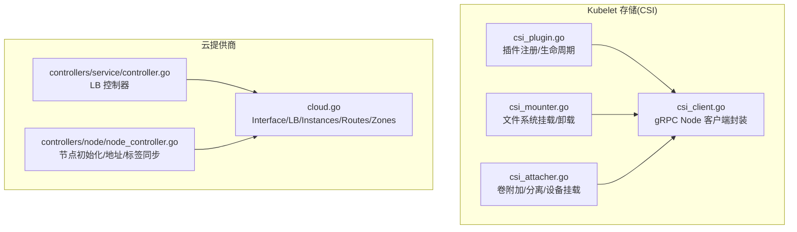
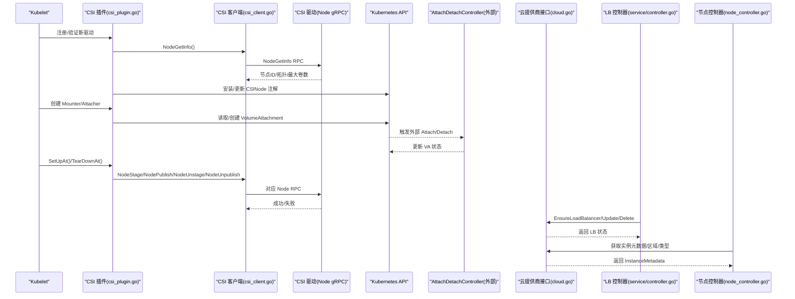
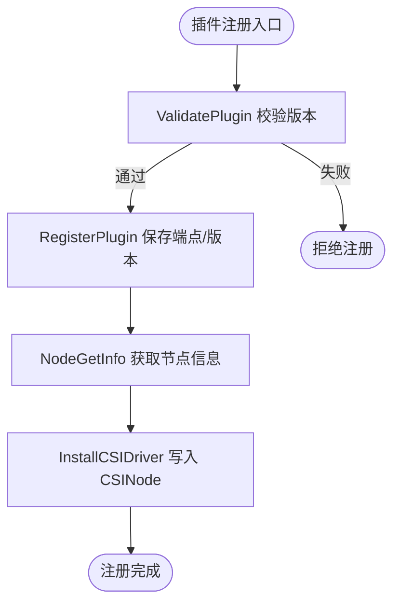
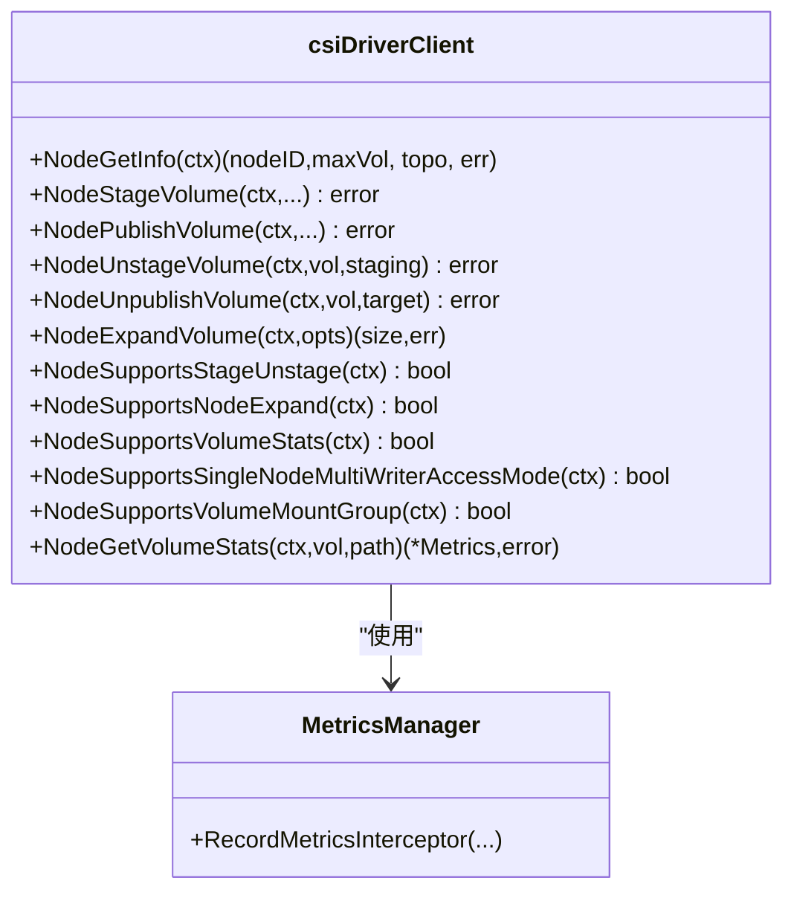
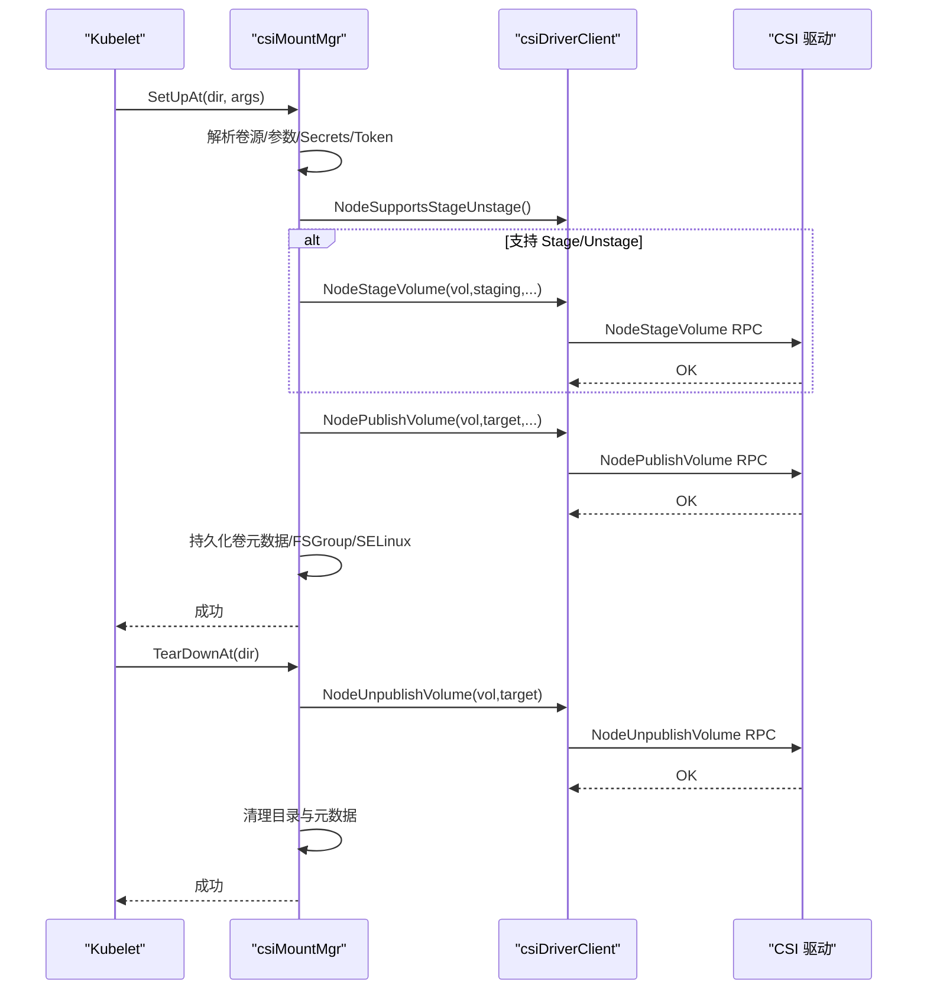
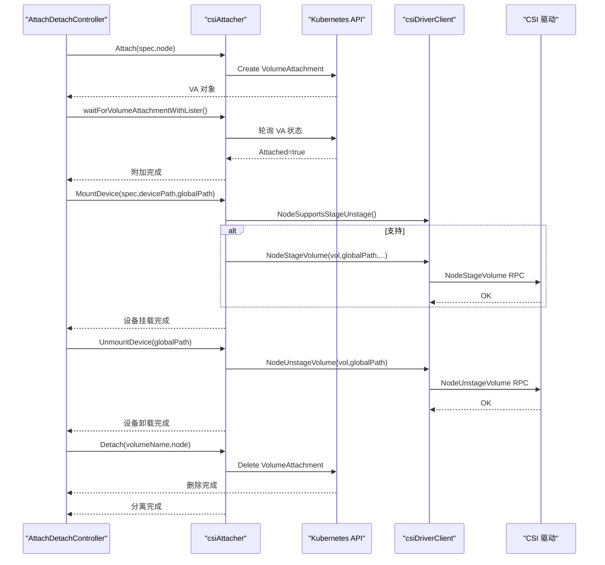
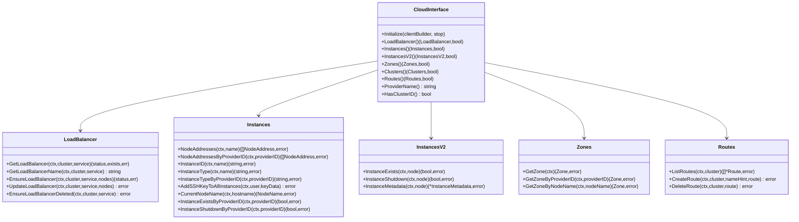
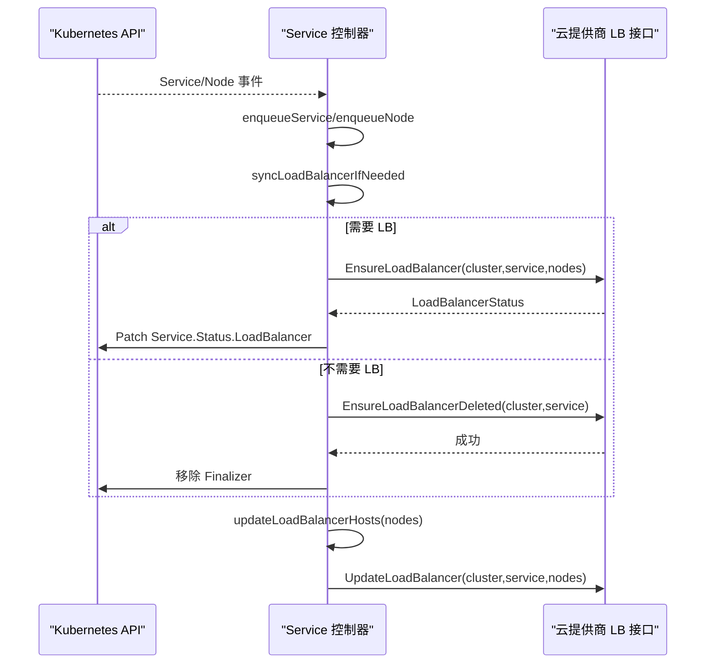
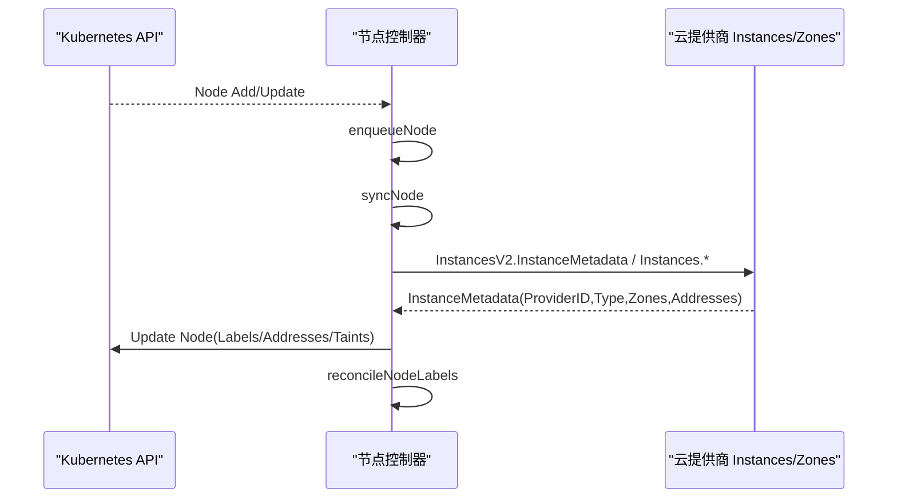
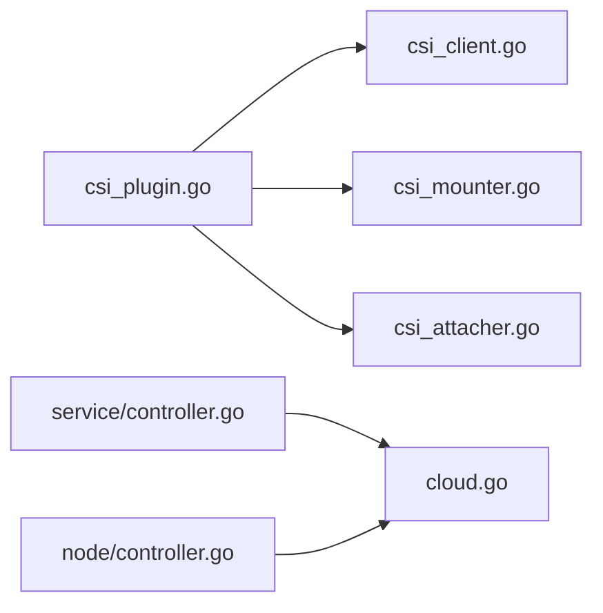

# 存储与网络插件

<cite>
**本文引用的文件**   
- [csi_plugin.go](file://pkg/volume/csi/csi_plugin.go)
- [csi_client.go](file://pkg/volume/csi/csi_client.go)
- [csi_mounter.go](file://pkg/volume/csi/csi_mounter.go)
- [csi_attacher.go](file://pkg/volume/csi/csi_attacher.go)
- [cloud.go](file://staging/src/k8s.io/cloud-provider/cloud.go)
- [controller.go](file://staging/src/k8s.io/cloud-provider/controllers/service/controller.go)
- [node_controller.go](file://staging/src/k8s.io/cloud-provider/controllers/node/node_controller.go)
</cite>

## 目录
1. [简介](#简介)
2. [项目结构](#项目结构)
3. [核心组件](#核心组件)
4. [架构总览](#架构总览)
5. [详细组件分析](#详细组件分析)
6. [依赖关系分析](#依赖关系分析)
7. [性能考量](#性能考量)
8. [故障排查指南](#故障排查指南)
9. [结论](#结论)
10. [附录](#附录)

## 简介
本技术文档围绕 Kubernetes 的存储与网络扩展能力，聚焦以下主题：
- CSI（Container Storage Interface）规范在 Kubelet 中的实现与驱动注册、节点侧挂载/卸载流程、块设备生命周期管理。
- CNI（Container Network Interface）插件开发模式的概念性说明（配置、IPAM 集成、容器网络设置）。
- 云提供商插件（Cloud Provider）接口与控制器（负载均衡、节点管理、服务发现）的职责边界与交互。
- 插件接口规范与协议定义（CSI gRPC Node 服务、Cloud Provider 抽象接口）。
- 测试策略、部署方式与版本兼容性管理的实践建议。
- 完整的插件开发与最佳实践指引。

## 项目结构
仓库中与“存储与网络插件”相关的核心代码主要分布在：
- 存储（CSI）：Kubelet 内嵌 CSI 插件的实现位于 pkg/volume/csi 目录，包含插件注册、客户端封装、挂载器、附加器等关键模块。
- 云提供商：staging/src/k8s.io/cloud-provider 提供云厂商抽象接口及控制器（Service LB、Node 初始化等）。

图表来源
- [csi_plugin.go:1-120](file://pkg/volume/csi/csi_plugin.go#L1-L120)
- [csi_client.go:100-170](file://pkg/volume/csi/csi_client.go#L100-L170)
- [csi_mounter.go:1-120](file://pkg/volume/csi/csi_mounter.go#L1-L120)
- [csi_attacher.go:1-120](file://pkg/volume/csi/csi_attacher.go#L1-L120)
- [cloud.go:40-120](file://staging/src/k8s.io/cloud-provider/cloud.go#L40-L120)
- [controller.go:70-120](file://staging/src/k8s.io/cloud-provider/controllers/service/controller.go#L70-L120)
- [node_controller.go:90-160](file://staging/src/k8s.io/cloud-provider/controllers/node/node_controller.go#L90-L160)

章节来源
- [csi_plugin.go:1-120](file://pkg/volume/csi/csi_plugin.go#L1-L120)
- [cloud.go:40-120](file://staging/src/k8s.io/cloud-provider/cloud.go#L40-L120)

## 核心组件
- CSI 插件入口与注册
  - 负责探测并返回 CSI VolumePlugin，处理插件验证、注册、注销，维护已注册驱动列表，并与 CSINode 信息管理器协作。
- CSI gRPC 客户端封装
  - 统一封装 Node 服务 RPC（NodeGetInfo、NodeStage/Unstage、NodePublish/Unpublish、NodeExpandVolume、NodeGetVolumeStats、能力探测等），并提供访问模式映射与错误分类。
- 挂载器（Mounter）
  - 负责 Pod 卷的生命周期：创建目标路径、获取发布上下文、注入 Secret/Token、调用 NodePublish/Unpublish、FSGroup/SELinux 处理、元数据持久化与清理。
- 附加器（Attacher）
  - 负责卷的附加/分离与设备级 Stage/Unstage：通过 VolumeAttachment 对象协调外部 Attach/Detach 控制器，支持 STAGE_UNSTAGE_VOLUME 能力路径。
- 云提供商接口与控制器
  - 提供 LoadBalancer、Instances、Routes、Zones 等抽象；Service 控制器负责 LB 生命周期与后端节点更新；Node 控制器负责节点初始化、地址/标签同步。

章节来源
- [csi_plugin.go:70-170](file://pkg/volume/csi/csi_plugin.go#L70-L170)
- [csi_client.go:100-170](file://pkg/volume/csi/csi_client.go#L100-L170)
- [csi_mounter.go:80-120](file://pkg/volume/csi/csi_mounter.go#L80-L120)
- [csi_attacher.go:40-120](file://pkg/volume/csi/csi_attacher.go#L40-L120)
- [cloud.go:40-120](file://staging/src/k8s.io/cloud-provider/cloud.go#L40-L120)
- [controller.go:70-120](file://staging/src/k8s.io/cloud-provider/controllers/service/controller.go#L70-L120)
- [node_controller.go:90-160](file://staging/src/k8s.io/cloud-provider/controllers/node/node_controller.go#L90-L160)

## 架构总览
下图展示 Kubelet 中 CSI 插件与云提供商控制器的整体交互关系。

图表来源
- [csi_plugin.go:100-170](file://pkg/volume/csi/csi_plugin.go#L100-L170)
- [csi_client.go:170-210](file://pkg/volume/csi/csi_client.go#L170-L210)
- [csi_mounter.go:100-120](file://pkg/volume/csi/csi_mounter.go#L100-L120)
- [csi_attacher.go:60-140](file://pkg/volume/csi/csi_attacher.go#L60-L140)
- [cloud.go:120-174](file://staging/src/k8s.io/cloud-provider/cloud.go#L120-L174)
- [controller.go:320-440](file://staging/src/k8s.io/cloud-provider/controllers/service/controller.go#L320-L440)
- [node_controller.go:410-490](file://staging/src/k8s.io/cloud-provider/controllers/node/node_controller.go#L410-L490)

## 详细组件分析

### CSI 插件与驱动注册
- 插件探测与注册
  - 通过 ProbeVolumePlugins 暴露 CSI 插件；RegistrationHandler 接收插件 watcher 回调，执行 ValidatePlugin/RegisterPlugin/DeRegisterPlugin。
  - 注册时校验驱动版本，记录端点与最高支持版本，调用 NodeGetInfo 获取节点信息与拓扑，并安装到 CSINode 管理器。
- 资源耗尽检测与动态更新
  - VerifyExhaustedResource 检查 VolumeAttachment 的 ResourceExhausted 错误，必要时触发驱动信息更新以刷新可分配容量。
- 生命周期与重建
  - ConstructVolumeSpec 根据持久化的卷数据重建 Spec，区分 Ephemeral/Persistent 模式，支持 SELinux 挂载上下文恢复。

图表来源
- [csi_plugin.go:100-170](file://pkg/volume/csi/csi_plugin.go#L100-L170)
- [csi_plugin.go:170-230](file://pkg/volume/csi/csi_plugin.go#L170-L230)
- [csi_plugin.go:560-626](file://pkg/volume/csi/csi_plugin.go#L560-L626)

章节来源
- [csi_plugin.go:70-170](file://pkg/volume/csi/csi_plugin.go#L70-L170)
- [csi_plugin.go:170-230](file://pkg/volume/csi/csi_plugin.go#L170-L230)
- [csi_plugin.go:560-626](file://pkg/volume/csi/csi_plugin.go#L560-L626)

### CSI gRPC 客户端封装
- 能力探测与访问模式映射
  - 通过 NodeGetCapabilities 探测是否支持 EXPAND_VOLUME、STAGE_UNSTAGE_VOLUME、VOLUME_MOUNT_GROUP、SINGLE_NODE_MULTI_WRITER 等能力。
  - 将 K8s AccessMode 映射为 CSI v1 的访问模式，兼容 SINGLE_NODE_MULTI_WRITER 与 SINGLE_NODE_SINGLE_WRITER。
- 错误分类
  - isFinalError 对 gRPC 状态码进行分类，区分“不确定进度”与“最终失败”，指导上层重试或回滚。
- 连接与指标
  - newGrpcConn 建立 Unix Socket gRPC 连接，注入指标拦截器，便于观测 Node RPC 耗时与错误。

图表来源
- [csi_client.go:100-170](file://pkg/volume/csi/csi_client.go#L100-L170)
- [csi_client.go:480-530](file://pkg/volume/csi/csi_client.go#L480-L530)
- [csi_client.go:530-546](file://pkg/volume/csi/csi_client.go#L530-L546)
- [csi_client.go:714-737](file://pkg/volume/csi/csi_client.go#L714-L737)

章节来源
- [csi_client.go:100-170](file://pkg/volume/csi/csi_client.go#L100-L170)
- [csi_client.go:480-530](file://pkg/volume/csi/csi_client.go#L480-L530)
- [csi_client.go:530-546](file://pkg/volume/csi/csi_client.go#L530-L546)
- [csi_client.go:714-737](file://pkg/volume/csi/csi_client.go#L714-L737)

### 挂载器（Mounter）
- 挂载流程要点
  - 解析卷源（Inline/Ephemeral 或 Persistent），准备 fsType/mountOptions/Secrets/VolumeAttributes。
  - 若驱动支持 STAGE_UNSTAGE_VOLUME，则先计算设备挂载路径并在 NodeStage 阶段完成预挂载。
  - 注入 Pod 信息与服务账户令牌（按 CSIDriver.Spec.TokenRequests 与 ServiceAccountTokenInSecrets 行为）。
  - 根据驱动能力决定是否委托 FSGroup 应用到驱动（VOLUME_MOUNT_GROUP），否则由 Kubelet 应用。
  - 可选启用 SELinuxMountReadWriteOncePod 特性，自动添加 SELinux 挂载选项。
  - 持久化卷元数据以便后续重建与卸载。
- 卸载流程
  - 调用 NodeUnpublishVolume，随后清理目标目录与元数据文件。

图表来源
- [csi_mounter.go:100-120](file://pkg/volume/csi/csi_mounter.go#L100-L120)
- [csi_mounter.go:200-360](file://pkg/volume/csi/csi_mounter.go#L200-L360)
- [csi_mounter.go:430-472](file://pkg/volume/csi/csi_mounter.go#L430-L472)

章节来源
- [csi_mounter.go:100-120](file://pkg/volume/csi/csi_mounter.go#L100-L120)
- [csi_mounter.go:200-360](file://pkg/volume/csi/csi_mounter.go#L200-L360)
- [csi_mounter.go:430-472](file://pkg/volume/csi/csi_mounter.go#L430-L472)

### 附加器（Attacher）
- 附加流程
  - 在 AttachDetachController 上下文中运行，创建 VolumeAttachment 对象，等待其 Attached=true 且无 AttachError。
  - WaitForAttach 仅用于确认 VA 存在与状态，不返回设备路径（设备路径由 NodeStage/NodePublish 阶段确定）。
- 设备挂载（STAGE_UNSTAGE_VOLUME）
  - 若驱动支持，则在 MountDevice 中调用 NodeStageVolume，并将设备挂载至全局路径；UnmountDevice 调用 NodeUnstageVolume 并清理。
- 分离流程
  - 删除 VolumeAttachment，等待其被删除或 DetachError 为空，表示分离完成。

图表来源
- [csi_attacher.go:60-140](file://pkg/volume/csi/csi_attacher.go#L60-L140)
- [csi_attacher.go:260-410](file://pkg/volume/csi/csi_attacher.go#L260-L410)
- [csi_attacher.go:520-590](file://pkg/volume/csi/csi_attacher.go#L520-L590)
- [csi_attacher.go:410-456](file://pkg/volume/csi/csi_attacher.go#L410-L456)

章节来源
- [csi_attacher.go:60-140](file://pkg/volume/csi/csi_attacher.go#L60-L140)
- [csi_attacher.go:260-410](file://pkg/volume/csi/csi_attacher.go#L260-L410)
- [csi_attacher.go:520-590](file://pkg/volume/csi/csi_attacher.go#L520-L590)
- [csi_attacher.go:410-456](file://pkg/volume/csi/csi_attacher.go#L410-L456)

### 云提供商插件（Cloud Provider）
- 接口规范
  - Interface 提供 Initialize、LoadBalancer、Instances/InstancesV2、Zones、Clusters、Routes、ProviderName、HasClusterID 等方法。
  - LoadBalancer 接口定义 Get/Ensure/Update/Delete 生命周期方法；Instances/InstancesV2 提供节点元数据与可用性查询；Routes 提供高级路由规则。
- 服务控制器（LB）
  - 监听 Service/Node 变更，决定是否需要创建/更新/删除 LB，调用云提供商 LB 接口，并维护 Finalizer 确保资源清理。
- 节点控制器
  - 监听 Node 变更，从云提供商获取实例元数据（ProviderID、InstanceType、Zone/Region、NodeAddresses），并更新 Node 对象与标签。

图表来源
- [cloud.go:40-120](file://staging/src/k8s.io/cloud-provider/cloud.go#L40-L120)
- [cloud.go:120-174](file://staging/src/k8s.io/cloud-provider/cloud.go#L120-L174)
- [cloud.go:174-206](file://staging/src/k8s.io/cloud-provider/cloud.go#L174-L206)
- [cloud.go:206-224](file://staging/src/k8s.io/cloud-provider/cloud.go#L206-L224)
- [cloud.go:245-256](file://staging/src/k8s.io/cloud-provider/cloud.go#L245-L256)

章节来源
- [cloud.go:40-120](file://staging/src/k8s.io/cloud-provider/cloud.go#L40-L120)
- [cloud.go:120-174](file://staging/src/k8s.io/cloud-provider/cloud.go#L120-L174)
- [cloud.go:174-206](file://staging/src/k8s.io/cloud-provider/cloud.go#L174-L206)
- [cloud.go:206-224](file://staging/src/k8s.io/cloud-provider/cloud.go#L206-L224)
- [cloud.go:245-256](file://staging/src/k8s.io/cloud-provider/cloud.go#L245-L256)

### 服务控制器（LB）
- 工作流
  - 监听 Service/Node 事件，入队 serviceQueue/nodeQueue。
  - processNextServiceItem 调用 syncService -> syncLoadBalancerIfNeeded，判断是否需要创建/更新/删除 LB。
  - ensureLoadBalancer 列出稳定节点集，调用 cloud.LoadBalancer.EnsureLoadBalancer，并更新 Service.Status.LoadBalancer。
  - 当不再需要 LB 或需要清理时，调用 EnsureLoadBalancerDeleted 并移除 Finalizer。
- 节点变更同步
  - nodeWorker 定期同步所有 LB 的后端节点集合，比较 lastSyncedNodes 与新节点集，差异则调用 UpdateLoadBalancer。

图表来源
- [controller.go:220-320](file://staging/src/k8s.io/cloud-provider/controllers/service/controller.go#L220-L320)
- [controller.go:320-440](file://staging/src/k8s.io/cloud-provider/controllers/service/controller.go#L320-L440)
- [controller.go:710-800](file://staging/src/k8s.io/cloud-provider/controllers/service/controller.go#L710-L800)

章节来源
- [controller.go:220-320](file://staging/src/k8s.io/cloud-provider/controllers/service/controller.go#L220-L320)
- [controller.go:320-440](file://staging/src/k8s.io/cloud-provider/controllers/service/controller.go#L320-L440)
- [controller.go:710-800](file://staging/src/k8s.io/cloud-provider/controllers/service/controller.go#L710-L800)

### 节点控制器
- 工作流
  - 监听 Node 事件，周期性 UpdateNodeStatus 批量更新节点地址与标签。
  - syncNode 处理带 ExternalCloudProvider Taint 的新节点，调用云提供商获取实例元数据，设置 ProviderID、InstanceType、Zone/Region、NodeAddresses，并移除 Taint。
- 标签与地址同步
  - reconcileNodeLabels 保证 beta 与 GA 标签一致性；updateNodeAddress 合并 kubelet 提供的 Hostname/IP 与云提供商返回的地址。

图表来源
- [node_controller.go:160-210](file://staging/src/k8s.io/cloud-provider/controllers/node/node_controller.go#L160-L210)
- [node_controller.go:410-490](file://staging/src/k8s.io/cloud-provider/controllers/node/node_controller.go#L410-L490)
- [node_controller.go:576-664](file://staging/src/k8s.io/cloud-provider/controllers/node/node_controller.go#L576-L664)

章节来源
- [node_controller.go:160-210](file://staging/src/k8s.io/cloud-provider/controllers/node/node_controller.go#L160-L210)
- [node_controller.go:410-490](file://staging/src/k8s.io/cloud-provider/controllers/node/node_controller.go#L410-L490)
- [node_controller.go:576-664](file://staging/src/k8s.io/cloud-provider/controllers/node/node_controller.go#L576-L664)

## 依赖关系分析
- CSI 内部依赖
  - csi_plugin.go 依赖 csi_client.go（Node RPC）、csi_mounter.go（挂载）、csi_attacher.go（附加/设备挂载）。
  - csi_client.go 依赖 gRPC 与 CSI 规范 protobuf，封装 Node 服务方法与能力探测。
- 云控制器依赖
  - controllers/service/controller.go 与 controllers/node/node_controller.go 均依赖 cloud.go 的抽象接口，分别实现 LB 与节点生命周期管理。

图表来源
- [csi_plugin.go:1-120](file://pkg/volume/csi/csi_plugin.go#L1-L120)
- [csi_client.go:100-170](file://pkg/volume/csi/csi_client.go#L100-L170)
- [csi_mounter.go:1-120](file://pkg/volume/csi/csi_mounter.go#L1-L120)
- [csi_attacher.go:1-120](file://pkg/volume/csi/csi_attacher.go#L1-L120)
- [controller.go:70-120](file://staging/src/k8s.io/cloud-provider/controllers/service/controller.go#L70-L120)
- [node_controller.go:90-160](file://staging/src/k8s.io/cloud-provider/controllers/node/node_controller.go#L90-L160)
- [cloud.go:40-120](file://staging/src/k8s.io/cloud-provider/cloud.go#L40-L120)

章节来源
- [csi_plugin.go:1-120](file://pkg/volume/csi/csi_plugin.go#L1-L120)
- [controller.go:70-120](file://staging/src/k8s.io/cloud-provider/controllers/service/controller.go#L70-L120)
- [node_controller.go:90-160](file://staging/src/k8s.io/cloud-provider/controllers/node/node_controller.go#L90-L160)
- [cloud.go:40-120](file://staging/src/k8s.io/cloud-provider/cloud.go#L40-L120)

## 性能考量
- CSI gRPC 连接与指标
  - 使用 Unix Socket 与指标拦截器，避免 TLS 开销并收集 RPC 指标，有助于定位瓶颈。
- 能力探测缓存
  - 能力探测（如 STAGE_UNSTAGE_VOLUME、EXPAND_VOLUME）结果可在客户端层缓存，减少频繁 NodeGetCapabilities 调用。
- 错误分类与重试
  - 基于 isFinalError 的分类，避免对“不确定进度”的错误进行过度重试，降低不必要负载。
- 控制器队列与退避
  - Service/Node 控制器采用带限流的队列与指数退避，避免风暴式重入与 API 压力。

[本节为通用性能建议，无需具体文件引用]

## 故障排查指南
- CSI 注册失败
  - 检查 ValidatePlugin 返回的版本列表是否为空或不支持的版本；查看 RegisterPlugin 中 NodeGetInfo 错误与 CSINode 安装日志。
- 挂载失败
  - 关注 SetUpAt 中 NodeStage/NodePublish 错误；检查 publishContext/Secrets/Token 注入是否正确；确认 FSGroup/SELinux 能力与策略。
- 附加/分离超时
  - 查看 VolumeAttachment 状态（Attached/Detached、AttachError/DetachError）；确认外部 AttachDetachController 是否正常。
- LB 未创建/未更新
  - 检查 Service 控制器日志与事件；确认云提供商 LB 接口返回状态；核对节点集合过滤逻辑与 Finalizer 状态。
- 节点地址/标签不同步
  - 检查节点控制器日志；确认云提供商 Instances/Zones 返回元数据；核对 beta/GA 标签一致性。

章节来源
- [csi_plugin.go:100-170](file://pkg/volume/csi/csi_plugin.go#L100-L170)
- [csi_mounter.go:200-360](file://pkg/volume/csi/csi_mounter.go#L200-L360)
- [csi_attacher.go:60-140](file://pkg/volume/csi/csi_attacher.go#L60-L140)
- [controller.go:320-440](file://staging/src/k8s.io/cloud-provider/controllers/service/controller.go#L320-L440)
- [node_controller.go:410-490](file://staging/src/k8s.io/cloud-provider/controllers/node/node_controller.go#L410-L490)

## 结论
- CSI 插件在 Kubelet 中提供了统一的存储接入面，通过 gRPC Node 服务与外部驱动解耦，具备完善的生命周期管理与能力探测机制。
- 云提供商插件通过标准化接口屏蔽底层差异，配合 Service/Node 控制器实现跨云一致的负载均衡与节点管理能力。
- 建议在插件开发中遵循能力探测、错误分类、指标采集与幂等设计原则，并结合队列与退避策略提升稳定性与可扩展性。

[本节为总结性内容，无需具体文件引用]

## 附录

### CNI 插件开发模式（概念性说明）
- 配置模型
  - 典型 CNI 配置包含网络名称、子网、网关、DNS、IPAM 插件名与参数等字段。
- IPAM 集成
  - 通过 IPAM 插件分配/释放 IP，CNI 主插件负责将 IP 信息注入容器网络命名空间。
- 容器网络设置
  - 创建 veth pair、配置网桥/路由、设置 iptables/nftables 规则、注入环境变量与 DNS 配置。
- 生命周期
  - ADD：为容器创建网络并返回配置；DEL：清理网络资源；CHECK：验证现有配置；VERSION：能力协商。

[本节为概念性说明，不直接分析具体文件，故无“章节来源”与“图表来源”]

### 插件测试策略与部署方式（建议）
- 单元测试与集成测试
  - 针对 CSI 客户端能力探测、错误分类、FSGroup/SELinux 分支路径编写单测；使用 fake 驱动模拟 Node RPC。
  - 针对云控制器，使用 mock 云接口验证 LB/节点同步逻辑与事件处理。
- 端到端测试
  - 在最小集群中部署 CSI 驱动与云控制器，验证 PV/PVC 生命周期、LB 创建/更新/删除、节点初始化。
- 部署方式
  - CSI 驱动通常以 DaemonSet 形式部署在节点上，并通过 registrar sidecar 向 Kubelet 注册。
  - 云控制器以 Deployment 形式部署在控制平面，监听 API Server 事件。
- 版本兼容性管理
  - CSI 驱动需声明支持的版本范围，Kubelet 在注册时校验版本；云控制器应兼容多版本 API 与特性门控。

[本节为通用建议，无需具体文件引用]