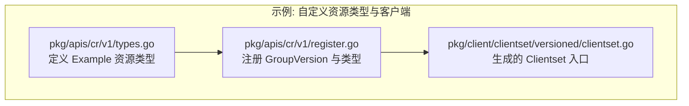
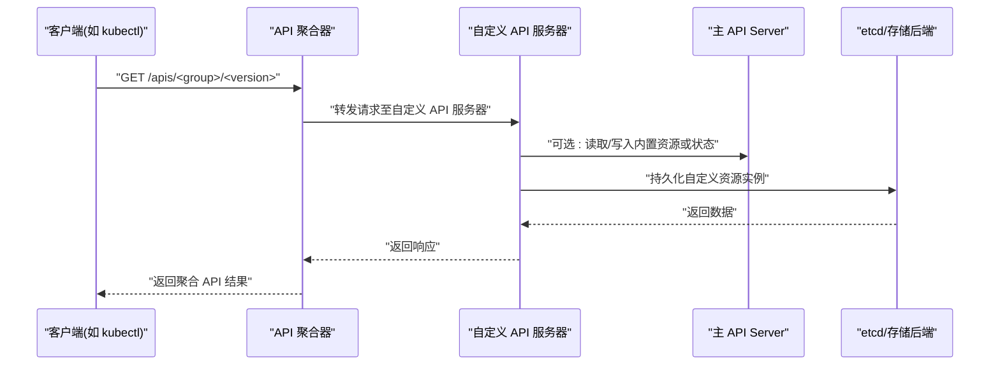
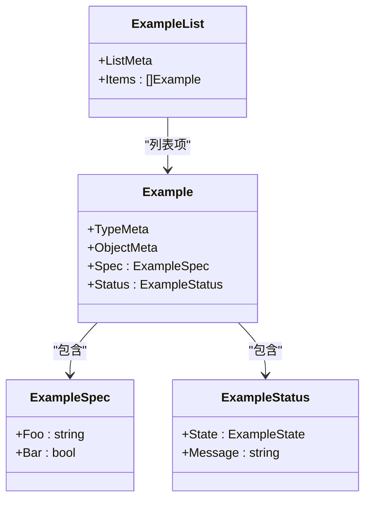
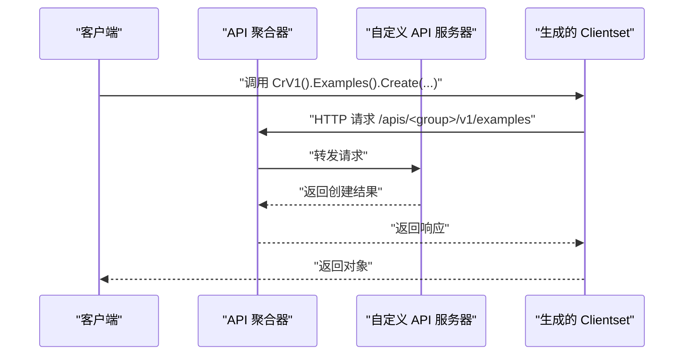
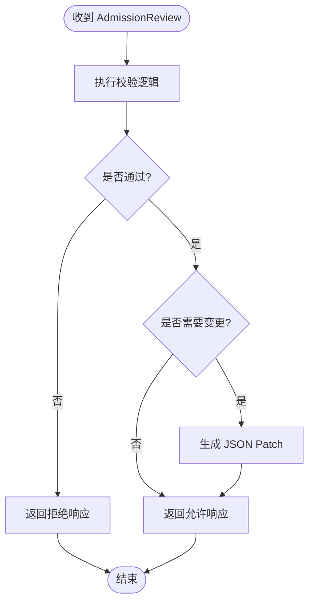
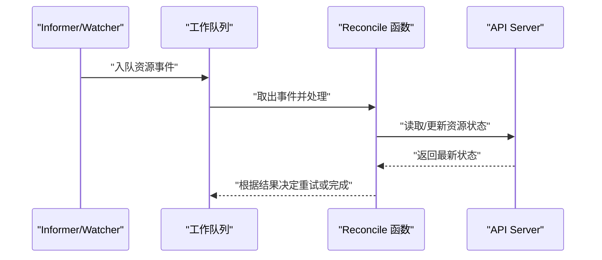
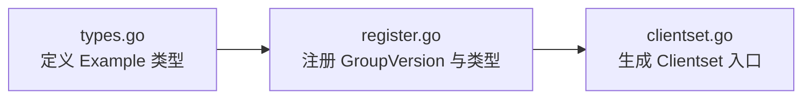

# 扩展与定制

<cite>
**本文引用的文件**   
- [types.go](file://staging/src/k8s.io/apiextensions-apiserver/examples/client-go/pkg/apis/cr/v1/types.go)
- [register.go](file://staging/src/k8s.io/apiextensions-apiserver/examples/client-go/pkg/apis/cr/v1/register.go)
- [clientset.go](file://staging/src/k8s.io/apiextensions-apiserver/examples/client-go/pkg/client/clientset/versioned/clientset.go)
</cite>

## 目录
1. [简介](#简介)
2. [项目结构](#项目结构)
3. [核心组件](#核心组件)
4. [架构总览](#架构总览)
5. [详细组件分析](#详细组件分析)
6. [依赖分析](#依赖分析)
7. [性能考虑](#性能考虑)
8. [故障排查指南](#故障排查指南)
9. [结论](#结论)
10. [附录](#附录)

## 简介
本技术文档围绕 Kubernetes 的扩展与定制能力，聚焦以下主题：自定义资源定义（CRD）的开发与生命周期管理、API 聚合器与自定义 API 服务器的开发方法、准入控制插件（Mutating/Validating Webhook）框架与实现模式、认证与授权扩展机制、存储与网络插件开发指南、Operator 模式与自定义控制器开发、以及插件的测试策略、部署方式与版本管理。文档以仓库中的示例代码为切入点，结合系统级架构进行系统化说明，帮助读者从概念到落地全面掌握扩展实践。

## 项目结构
本仓库包含大量子模块与示例工程。针对“扩展与定制”主题，我们重点参考 apiextensions-apiserver 的示例 client-go 客户端生成产物，用以演示 CRD 类型定义、注册与客户端访问路径。该示例展示了如何声明一个自定义资源类型、将其加入 Scheme，并自动生成强类型客户端集。

图表来源
- [types.go:1-64](file://staging/src/k8s.io/apiextensions-apiserver/examples/client-go/pkg/apis/cr/v1/types.go#L1-L64)
- [register.go:1-54](file://staging/src/k8s.io/apiextensions-apiserver/examples/client-go/pkg/apis/cr/v1/register.go#L1-L54)
- [clientset.go:1-121](file://staging/src/k8s.io/apiextensions-apiserver/examples/client-go/pkg/client/clientset/versioned/clientset.go#L1-L121)

章节来源
- [types.go:1-64](file://staging/src/k8s.io/apiextensions-apiserver/examples/client-go/pkg/apis/cr/v1/types.go#L1-L64)
- [register.go:1-54](file://staging/src/k8s.io/apiextensions-apiserver/examples/client-go/pkg/apis/cr/v1/register.go#L1-L54)
- [clientset.go:1-121](file://staging/src/k8s.io/apiextensions-apiserver/examples/client-go/pkg/client/clientset/versioned/clientset.go#L1-L121)

## 核心组件
- 自定义资源类型定义：通过 Go 结构体描述资源的 Spec 与 Status，并使用注解标记生成 DeepCopy 与 Object 接口实现。
- 版本与组注册：声明 GroupName 与 SchemeGroupVersion，将类型加入 Scheme，使 API 层可识别与序列化。
- 客户端生成：基于类型与注册信息，自动生成 typed clientset，提供强类型的 Create/Update/List 等方法。

章节来源
- [types.go:1-64](file://staging/src/k8s.io/apiextensions-apiserver/examples/client-go/pkg/apis/cr/v1/types.go#L1-L64)
- [register.go:1-54](file://staging/src/k8s.io/apiextensions-apiserver/examples/client-go/pkg/apis/cr/v1/register.go#L1-L54)
- [clientset.go:1-121](file://staging/src/k8s.io/apiextensions-apiserver/examples/client-go/pkg/client/clientset/versioned/clientset.go#L1-L121)

## 架构总览
下图展示了一个典型的“自定义 API 服务器 + API 聚合器 + 主 API Server”的交互流程，以及 CRD 在其中的角色。

图表来源
- [register.go:1-54](file://staging/src/k8s.io/apiextensions-apiserver/examples/client-go/pkg/apis/cr/v1/register.go#L1-L54)
- [clientset.go:1-121](file://staging/src/k8s.io/apiextensions-apiserver/examples/client-go/pkg/client/clientset/versioned/clientset.go#L1-L121)

## 详细组件分析

### 自定义资源定义（CRD）开发与生命周期管理
- 类型定义与注解：使用结构体字段描述业务模型，并通过注解启用 DeepCopy 与 Object 接口实现，便于运行时序列化与反序列化。
- 版本与组注册：定义 GroupName 与 SchemeGroupVersion，并在 addKnownTypes 中将类型加入 Scheme，确保 API 层能识别该资源。
- 生命周期要点：
  - 设计阶段：明确 Spec/Status 边界，遵循不可变与可变字段分离原则。
  - 演进阶段：通过多版本共存与迁移策略保障向后兼容。
  - 运行阶段：配合控制器更新 Status，暴露健康与进度指标。

图表来源
- [types.go:1-64](file://staging/src/k8s.io/apiextensions-apiserver/examples/client-go/pkg/apis/cr/v1/types.go#L1-L64)

章节来源
- [types.go:1-64](file://staging/src/k8s.io/apiextensions-apiserver/examples/client-go/pkg/apis/cr/v1/types.go#L1-L64)
- [register.go:1-54](file://staging/src/k8s.io/apiextensions-apiserver/examples/client-go/pkg/apis/cr/v1/register.go#L1-L54)

### API 聚合器与自定义 API 服务器
- API 聚合器职责：统一发现与路由聚合 API 组，将请求转发给已注册的自定义 API 服务器。
- 自定义 API 服务器职责：实现 RESTful 端点，处理鉴权、校验、业务逻辑与持久化。
- 集成要点：
  - 在聚合器中注册服务与端点，确保 Discovery 可用。
  - 自定义 API 服务器需与主 API Server 协同，必要时读写内置资源。
  - 客户端通过生成的 Clientset 访问聚合 API。

图表来源
- [clientset.go:1-121](file://staging/src/k8s.io/apiextensions-apiserver/examples/client-go/pkg/client/clientset/versioned/clientset.go#L1-L121)
- [register.go:1-54](file://staging/src/k8s.io/apiextensions-apiserver/examples/client-go/pkg/apis/cr/v1/register.go#L1-L54)

章节来源
- [clientset.go:1-121](file://staging/src/k8s.io/apiextensions-apiserver/examples/client-go/pkg/client/clientset/versioned/clientset.go#L1-L121)
- [register.go:1-54](file://staging/src/k8s.io/apiextensions-apiserver/examples/client-go/pkg/apis/cr/v1/register.go#L1-L54)

### 准入控制插件（Mutating/Validating Webhook）
- 目标：在对象持久化前进行变更注入或合法性校验。
- 实现模式：
  - ValidatingWebhookConfiguration：定义校验规则与回调 URL。
  - MutatingWebhookConfiguration：定义注入规则与回调 URL。
  - Webhook 服务端：接收 AdmissionReview，返回允许/拒绝与补丁。
- 最佳实践：
  - 幂等性与超时控制，避免阻塞主流程。
  - 最小权限原则，仅访问必要资源。
  - 错误码与消息清晰，便于排障。

[本节为通用流程说明，不直接分析具体源文件]

### 认证与授权扩展机制
- 认证扩展：支持外部身份提供商、证书认证、令牌验证等，通过插件链组合多种认证器。
- 授权扩展：RBAC 为基础，支持 ABAC、Webhook 授权等策略；可通过自定义 Authorizer 扩展决策逻辑。
- 集成要点：
  - 配置认证器顺序与失败策略。
  - 授权策略粒度控制，结合命名空间与资源限定。
  - 审计日志记录关键决策路径。

[本节为通用架构说明，不直接分析具体源文件]

### 存储插件与网络插件开发指南
- 存储插件：
  - CSI 作为标准接口，提供卷生命周期管理与快照/克隆能力。
  - 驱动以 gRPC 形式与 kubelet 通信，遵循安全与隔离要求。
- 网络插件：
  - CNI 标准接口，负责 Pod 网络分配与连通性。
  - 需满足性能、可扩展性与跨平台兼容性。
- 开发建议：
  - 严格遵循接口契约与错误语义。
  - 完善监控与告警，覆盖关键路径。
  - 提供端到端测试用例与回滚方案。

[本节为通用开发指南，不直接分析具体源文件]

### Operator 模式与自定义控制器
- 原理：控制器循环监听资源变化，比较期望态与实际态，驱动系统收敛。
- 关键要素：
  - Informer 缓存与事件队列，保证高效同步。
  - Reconcile 函数幂等，处理删除、重试与冲突。
  - 条件与状态机管理复杂资源生命周期。
- 开发步骤：
  - 定义 CRD 与类型。
  - 编写控制器逻辑，注册到 Controller Manager。
  - 配置 RBAC 与 Webhook（如需）。
  - 部署与观测。

[本节为通用流程说明，不直接分析具体源文件]

## 依赖分析
示例客户端与类型注册之间的依赖关系如下：

图表来源
- [types.go:1-64](file://staging/src/k8s.io/apiextensions-apiserver/examples/client-go/pkg/apis/cr/v1/types.go#L1-L64)
- [register.go:1-54](file://staging/src/k8s.io/apiextensions-apiserver/examples/client-go/pkg/apis/cr/v1/register.go#L1-L54)
- [clientset.go:1-121](file://staging/src/k8s.io/apiextensions-apiserver/examples/client-go/pkg/client/clientset/versioned/clientset.go#L1-L121)

章节来源
- [types.go:1-64](file://staging/src/k8s.io/apiextensions-apiserver/examples/client-go/pkg/apis/cr/v1/types.go#L1-L64)
- [register.go:1-54](file://staging/src/k8s.io/apiextensions-apiserver/examples/client-go/pkg/apis/cr/v1/register.go#L1-L54)
- [clientset.go:1-121](file://staging/src/k8s.io/apiextensions-apiserver/examples/client-go/pkg/client/clientset/versioned/clientset.go#L1-L121)

## 性能考虑
- 客户端侧：合理设置 QPS/Burst，复用 HTTP 连接，避免频繁重建 Clientset。
- 控制器侧：使用 Informer 缓存减少直连 API Server 的压力，批量处理事件。
- Webhook 侧：限制超时与并发，避免长尾请求影响整体吞吐。
- 存储侧：关注 etcd 写放大与读热点，合理使用分片与索引。

[本节为通用性能指导，不直接分析具体源文件]

## 故障排查指南
- 客户端连接问题：检查 rest.Config 与 UserAgent、RateLimiter 配置是否正确。
- 聚合路由异常：确认聚合器已正确发现自定义 API 服务器，且端点可达。
- 准入控制失败：查看 AdmissionReview 响应与错误码，定位校验或注入逻辑。
- 控制器同步异常：观察事件队列堆积与 Reconcile 重试次数，定位幂等性问题。

章节来源
- [clientset.go:1-121](file://staging/src/k8s.io/apiextensions-apiserver/examples/client-go/pkg/client/clientset/versioned/clientset.go#L1-L121)

## 结论
通过 CRD、API 聚合器、Webhook、认证授权扩展、存储与网络插件以及 Operator 模式，Kubernetes 提供了强大的扩展与定制能力。结合示例代码与系统架构，开发者可以构建高内聚、低耦合的生态组件，并以标准化接口融入集群生态。建议在设计与实现过程中重视兼容性、可观测性与安全性，确保扩展的稳定与可持续演进。

## 附录
- 术语表：
  - CRD：自定义资源定义
  - API 聚合器：用于聚合第三方 API 的服务
  - Webhook：准入控制的回调机制
  - Operator：基于控制器的应用编排模式
- 参考路径：
  - 示例类型定义与注册：见 types.go 与 register.go
  - 客户端生成入口：见 clientset.go