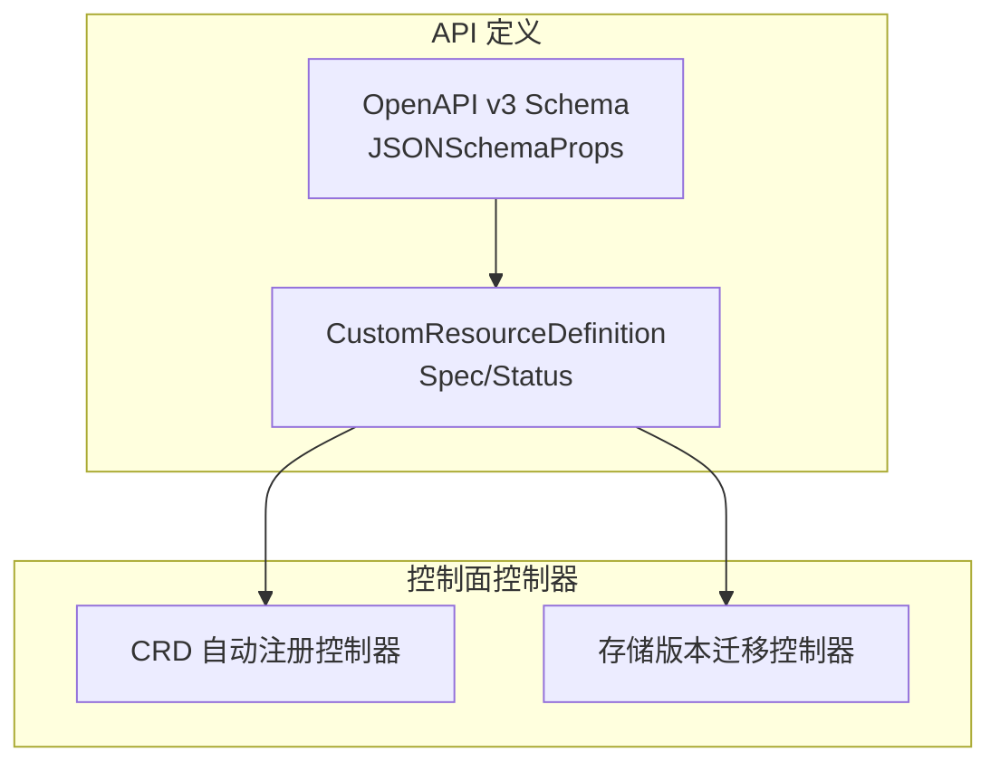
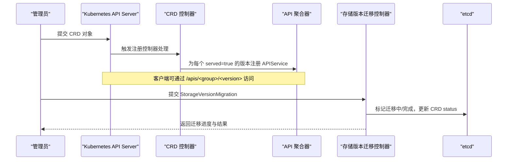
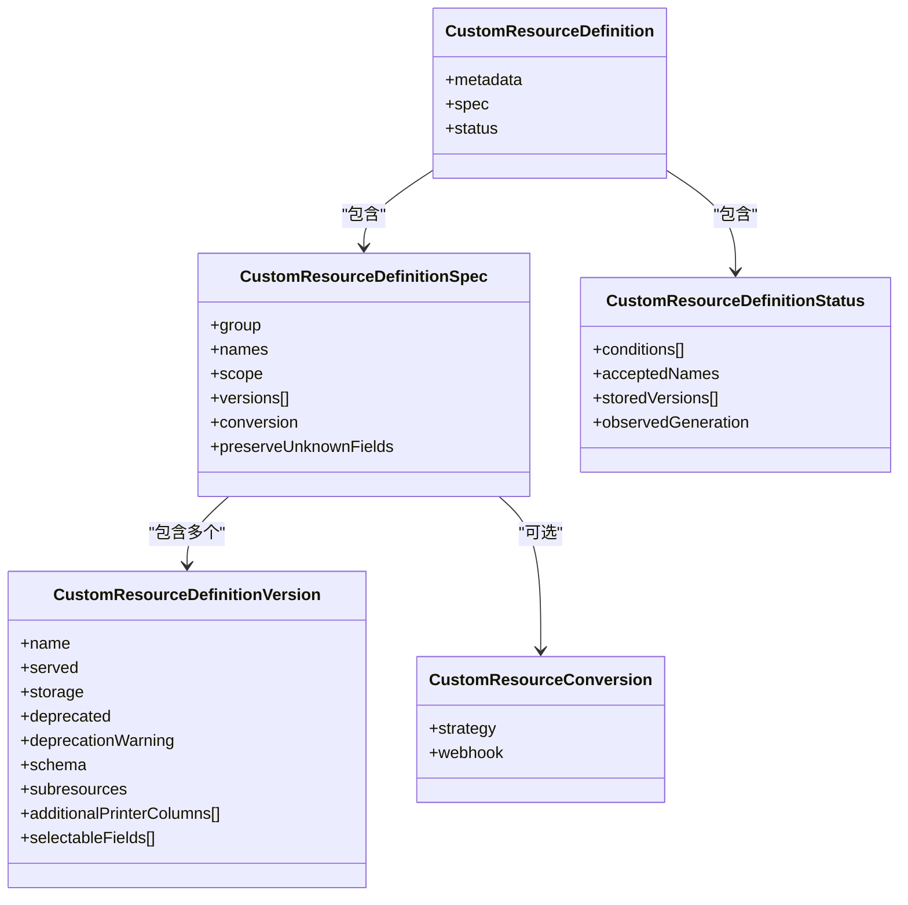
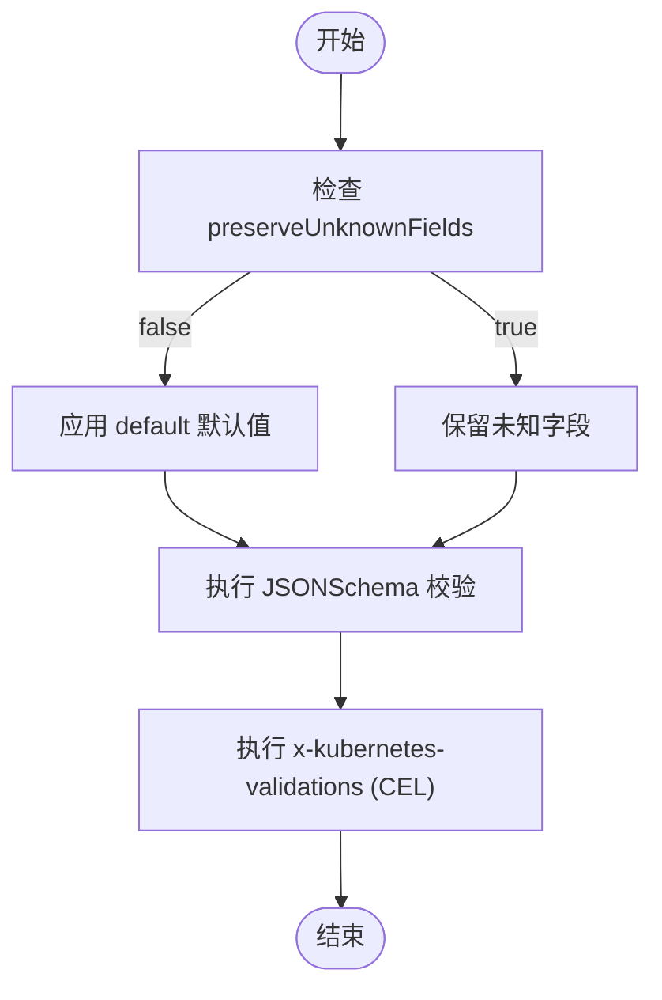
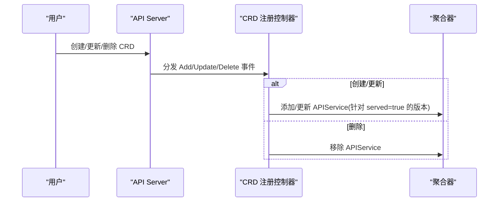
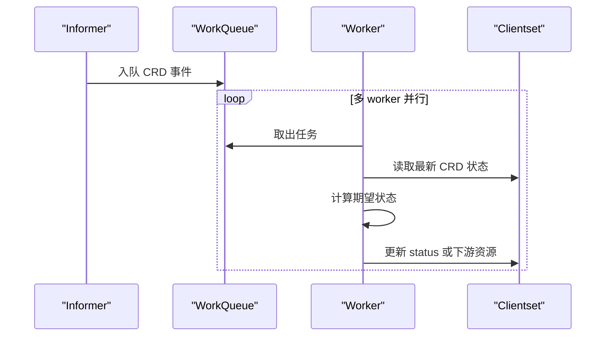
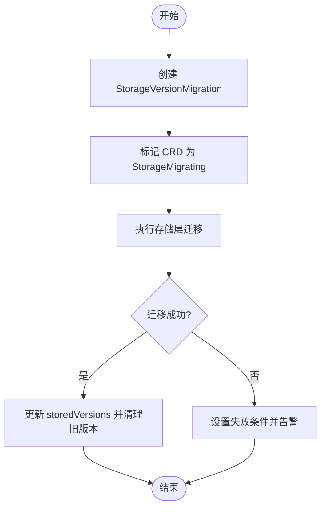
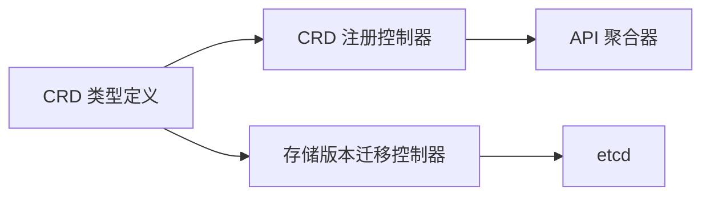

# 自定义资源（CRD）

<cite>
**本文引用的文件**   
- [types.go](file://staging/src/k8s.io/apiextensions-apiserver/pkg/apis/apiextensions/v1/types.go)
- [types_jsonschema.go](file://staging/src/k8s.io/apiextensions-apiserver/pkg/apis/apiextensions/v1/types_jsonschema.go)
- [crdregistration_controller.go](file://pkg/controlplane/controller/crdregistration/crdregistration_controller.go)
- [migrationrunner.go](file://pkg/controller/storageversionmigrator/migrationrunner.go)
</cite>

## 目录
1. [简介](#简介)
2. [项目结构](#项目结构)
3. [核心组件](#核心组件)
4. [架构总览](#架构总览)
5. [详细组件分析](#详细组件分析)
6. [依赖关系分析](#依赖关系分析)
7. [性能考虑](#性能考虑)
8. [故障排查指南](#故障排查指南)
9. [结论](#结论)
10. [附录：示例与清单](#附录示例与清单)

## 简介
本技术文档围绕 Kubernetes 自定义资源定义（CustomResourceDefinition，简称 CRD）展开，面向希望设计、实现并运维 CRD 及其控制器的工程师。内容涵盖：
- API 设计原则与版本管理策略
- OpenAPI v3 Schema 的定义方法（字段验证、默认值、嵌套结构）
- CRD 生命周期管理（创建、更新、删除）
- 自定义控制器集成模式（Informer 使用、状态同步）
- 存储版本迁移与向后兼容性保证
- 最佳实践、性能优化与故障排查
- 完整代码示例与部署清单（以“路径引用”形式提供）

## 项目结构
仓库中与 CRD 相关的关键位置包括：
- API 类型定义：apiextensions v1 的 CustomResourceDefinition、JSONSchemaProps 等
- 注册控制器：自动将 CRD 的 GroupVersion 注册到聚合器
- 存储版本迁移：StorageVersionMigration 控制器驱动迁移与清理

图表来源
- [types.go:40-73](file://staging/src/k8s.io/apiextensions-apiserver/pkg/apis/apiextensions/v1/types.go#L40-L73)
- [types_jsonschema.go:39-197](file://staging/src/k8s.io/apiextensions-apiserver/pkg/apis/apiextensions/v1/types_jsonschema.go#L39-L197)
- [crdregistration_controller.go:62-107](file://pkg/controlplane/controller/crdregistration/crdregistration_controller.go#L62-L107)
- [migrationrunner.go:55-56](file://pkg/controller/storageversionmigrator/migrationrunner.go#L55-L56)

章节来源
- [types.go:40-73](file://staging/src/k8s.io/apiextensions-apiserver/pkg/apis/apiextensions/v1/types.go#L40-L73)
- [types_jsonschema.go:39-197](file://staging/src/k8s.io/apiextensions-apiserver/pkg/apis/apiextensions/v1/types_jsonschema.go#L39-L197)
- [crdregistration_controller.go:62-107](file://pkg/controlplane/controller/crdregistration/crdregistration_controller.go#L62-L107)
- [migrationrunner.go:55-56](file://pkg/controller/storageversionmigrator/migrationrunner.go#L55-L56)

## 核心组件
- CustomResourceDefinition（CRD）对象模型
  - Spec：描述期望的 API 形态（组名、名称、作用域、版本列表、转换策略、是否保留未知字段等）
  - Status：记录实际状态（条件、已接受名称、持久化版本列表、观测代等）
- OpenAPI v3 Schema（JSONSchemaProps）
  - 用于校验、修剪、默认值填充；支持复杂组合逻辑与 x-kubernetes 扩展
- CRD 自动注册控制器
  - 监听 CRD 变化，按 GroupVersion 向聚合器注册 APIService
- 存储版本迁移控制器
  - 基于 StorageVersionMigration 对象推进迁移，并在完成后清理旧存储版本

章节来源
- [types.go:169-211](file://staging/src/k8s.io/apiextensions-apiserver/pkg/apis/apiextensions/v1/types.go#L169-L211)
- [types.go:364-391](file://staging/src/k8s.io/apiextensions-apiserver/pkg/apis/apiextensions/v1/types.go#L364-L391)
- [types_jsonschema.go:39-197](file://staging/src/k8s.io/apiextensions-apiserver/pkg/apis/apiextensions/v1/types_jsonschema.go#L39-L197)
- [crdregistration_controller.go:62-107](file://pkg/controlplane/controller/crdregistration/crdregistration_controller.go#L62-L107)
- [migrationrunner.go:55-56](file://pkg/controller/storageversionmigrator/migrationrunner.go#L55-L56)

## 架构总览
下图展示了 CRD 从定义到服务暴露、再到存储版本迁移的整体流程。

图表来源
- [crdregistration_controller.go:196-200](file://pkg/controlplane/controller/crdregistration/crdregistration_controller.go#L196-L200)
- [migrationrunner.go:241-253](file://pkg/controller/storageversionmigrator/migrationrunner.go#L241-L253)
- [migrationrunner.go:357-384](file://pkg/controller/storageversionmigrator/migrationrunner.go#L357-L384)

## 详细组件分析

### CRD API 设计与版本管理
- 版本声明与排序
  - versions 列表决定被发现的顺序；“kube-like”版本（如 v1、v2beta1）优先于普通字符串版本
  - 仅一个版本可设为 storage=true，作为持久化存储版本
- 作用域与命名
  - scope 支持 Cluster 与 Namespaced
  - names.plural 必须与 CRD 名称格式 <plural>.<group> 一致
- 转换策略
  - None：仅修改 apiVersion，不改动其他字段
  - Webhook：通过外部 webhook 进行版本间转换，要求 preserveUnknownFields=false 且配置 webhook
- 条件与状态
  - Established、NamesAccepted、NonStructuralSchema、Terminating、StorageMigrating 等条件反映 CRD 生命周期阶段
  - storedVersions 记录历史上所有被持久化的版本，便于迁移后清理

图表来源
- [types.go:40-73](file://staging/src/k8s.io/apiextensions-apiserver/pkg/apis/apiextensions/v1/types.go#L40-L73)
- [types.go:169-211](file://staging/src/k8s.io/apiextensions-apiserver/pkg/apis/apiextensions/v1/types.go#L169-L211)
- [types.go:364-391](file://staging/src/k8s.io/apiextensions-apiserver/pkg/apis/apiextensions/v1/types.go#L364-L391)

章节来源
- [types.go:40-73](file://staging/src/k8s.io/apiextensions-apiserver/pkg/apis/apiextensions/v1/types.go#L40-L73)
- [types.go:169-211](file://staging/src/k8s.io/apiextensions-apiserver/pkg/apis/apiextensions/v1/types.go#L169-L211)
- [types.go:364-391](file://staging/src/k8s.io/apiextensions-apiserver/pkg/apis/apiextensions/v1/types.go#L364-L391)

### OpenAPI v3 Schema 定义与验证
- 基础能力
  - type、format、enum、required、pattern、min/max、items、properties、allOf/anyOf/oneOf/not 等
  - default 用于默认值填充（需开启相应功能门控，且 preserveUnknownFields=false）
- 高级特性
  - x-kubernetes-preserve-unknown-fields：递归保留未声明字段
  - x-kubernetes-int-or-string：允许整数或字符串
  - x-kubernetes-list-type/map-keys：对列表拓扑进行细粒度控制（atomic/set/map）
  - x-kubernetes-map-type：对象拓扑（granular/atomic）
  - x-kubernetes-validations：CEL 表达式规则，实现复杂业务校验
- 结构化与非结构化
  - NonStructuralSchema 条件会阻止部分新特性（如默认值、只读、Webhook 转换等），建议保持 Schema 结构化

图表来源
- [types_jsonschema.go:39-197](file://staging/src/k8s.io/apiextensions-apiserver/pkg/apis/apiextensions/v1/types_jsonschema.go#L39-L197)

章节来源
- [types_jsonschema.go:39-197](file://staging/src/k8s.io/apiextensions-apiserver/pkg/apis/apiextensions/v1/types_jsonschema.go#L39-L197)

### CRD 生命周期管理
- 创建
  - 提交 CRD 后，注册控制器监听事件，为 served=true 的版本生成 APIService，使 REST 端点可用
- 更新
  - 变更 spec.versions 或 schema 时，控制器重新计算并同步 APIService；若引入非结构化 Schema，可能触发 NonStructuralSchema 条件
- 删除
  - 删除 CRD 时，控制器移除对应 APIService；最终清理由 finalizer 与 GC 协同完成

图表来源
- [crdregistration_controller.go:77-104](file://pkg/controlplane/controller/crdregistration/crdregistration_controller.go#L77-L104)
- [crdregistration_controller.go:196-200](file://pkg/controlplane/controller/crdregistration/crdregistration_controller.go#L196-L200)

章节来源
- [crdregistration_controller.go:77-104](file://pkg/controlplane/controller/crdregistration/crdregistration_controller.go#L77-L104)
- [crdregistration_controller.go:196-200](file://pkg/controlplane/controller/crdregistration/crdregistration_controller.go#L196-L200)

### 自定义控制器与 CRD 集成模式
- Informer 使用
  - 通过 externalversions 提供的 informer 监听 CRD 实例的变化
  - 在 Add/Update/Delete 回调中将工作项入队，避免重复处理
- 状态同步策略
  - 使用 workqueue 做去重与退避重试
  - 初始同步阶段拉取全量缓存，确保一致性
  - 根据业务需要维护 desired vs observed 状态，必要时写回 status

图表来源
- [crdregistration_controller.go:109-145](file://pkg/controlplane/controller/crdregistration/crdregistration_controller.go#L109-L145)
- [crdregistration_controller.go:152-188](file://pkg/controlplane/controller/crdregistration/crdregistration_controller.go#L152-L188)

章节来源
- [crdregistration_controller.go:109-145](file://pkg/controlplane/controller/crdregistration/crdregistration_controller.go#L109-L145)
- [crdregistration_controller.go:152-188](file://pkg/controlplane/controller/crdregistration/crdregistration_controller.go#L152-L188)

### 存储版本迁移与向后兼容
- 迁移流程
  - 提交 StorageVersionMigration 对象，控制器为 CRD 设置 StorageMigrating 条件
  - 迁移完成后，更新 CRD status.storedVersions，移除不再使用的旧版本
- 兼容性保证
  - 在迁移期间，API 行为保持不变；迁移完成后，旧存储数据可按新存储版本读写
  - 迁移失败时，控制器应回滚条件并提示错误原因

图表来源
- [migrationrunner.go:55-56](file://pkg/controller/storageversionmigrator/migrationrunner.go#L55-L56)
- [migrationrunner.go:241-253](file://pkg/controller/storageversionmigrator/migrationrunner.go#L241-L253)
- [migrationrunner.go:357-384](file://pkg/controller/storageversionmigrator/migrationrunner.go#L357-L384)

章节来源
- [migrationrunner.go:55-56](file://pkg/controller/storageversionmigrator/migrationrunner.go#L55-L56)
- [migrationrunner.go:241-253](file://pkg/controller/storageversionmigrator/migrationrunner.go#L241-L253)
- [migrationrunner.go:357-384](file://pkg/controller/storageversionmigrator/migrationrunner.go#L357-L384)

## 依赖关系分析
- 组件耦合
  - CRD 类型定义是 API 契约的核心，被控制器与客户端共同依赖
  - 注册控制器依赖 CRD informer 与聚合器接口
  - 存储版本迁移控制器依赖 CRD 状态与 etcd 存储
- 潜在循环依赖
  - 控制器之间无直接循环依赖，但需注意通过 CRD 状态间接耦合（例如迁移控制器依赖 CRD 条件）

图表来源
- [types.go:40-73](file://staging/src/k8s.io/apiextensions-apiserver/pkg/apis/apiextensions/v1/types.go#L40-L73)
- [crdregistration_controller.go:62-107](file://pkg/controlplane/controller/crdregistration/crdregistration_controller.go#L62-L107)
- [migrationrunner.go:55-56](file://pkg/controller/storageversionmigrator/migrationrunner.go#L55-L56)

章节来源
- [types.go:40-73](file://staging/src/k8s.io/apiextensions-apiserver/pkg/apis/apiextensions/v1/types.go#L40-L73)
- [crdregistration_controller.go:62-107](file://pkg/controlplane/controller/crdregistration/crdregistration_controller.go#L62-L107)
- [migrationrunner.go:55-56](file://pkg/controller/storageversionmigrator/migrationrunner.go#L55-L56)

## 性能考虑
- 合理设置 listType 与 mapKeys
  - 对大型列表使用 atomic/set/map 可减少合并开销与冲突
- 谨慎使用 preserveUnknownFields
  - 保留未知字段会增加序列化与校验成本，建议在确有需要时使用
- 限制 additionalProperties 深度
  - 深层嵌套与任意属性会显著增加校验复杂度
- 合理使用 CEL 校验
  - 复杂表达式会影响写入延迟，建议拆分规则与缓存中间结果
- 控制器队列与并发
  - 使用合理的 workers 数量与工作队列退避策略，避免热点键导致的抖动

[本节为通用指导，无需源码引用]

## 故障排查指南
- CRD 无法被发现
  - 检查 CRD 的 names.plural 与 group 是否符合 <plural>.<group> 规范
  - 确认至少有一个版本的 served=true
- 非结构化 Schema 导致功能受限
  - 查看 CRD 条件 NonStructuralSchema，修复 schema 使其结构化
- 迁移卡住或失败
  - 检查 StorageVersionMigration 状态与 CRD 的 StorageMigrating 条件
  - 关注迁移控制器日志与错误信息，必要时回滚
- 控制器未生效
  - 确认 informer 已同步（HasSynced）
  - 检查工作队列是否有大量重试与退避

章节来源
- [types.go:301-338](file://staging/src/k8s.io/apiextensions-apiserver/pkg/apis/apiextensions/v1/types.go#L301-L338)
- [crdregistration_controller.go:109-145](file://pkg/controlplane/controller/crdregistration/crdregistration_controller.go#L109-L145)
- [migrationrunner.go:241-253](file://pkg/controller/storageversionmigrator/migrationrunner.go#L241-L253)

## 结论
CRD 提供了强大的扩展能力，配合 OpenAPI v3 Schema 可实现强约束与良好体验。通过规范的版本管理与迁移策略，可在演进过程中保持向后兼容。控制器侧采用 Informer+WorkQueue 的模式能高效稳定地同步状态。遵循结构化 Schema、最小化未知字段、合理配置 list/map 拓扑与 CEL 规则，有助于提升整体性能与可维护性。

[本节为总结，无需源码引用]

## 附录：示例与清单
以下为常见 CRD 与控制器相关的示例与清单路径，供参考与复用：
- CRD 定义示例（含 OpenAPI v3 Schema、子资源、列定义）
  - [示例路径](file://test/integration/apiserver/openapi/openapi_crd_test.go)
- 转换 Webhook 示例（None/Webhook 策略）
  - [示例路径](file://test/e2e/apimachinery/crd_conversion_webhook.go)
- 选择器字段（Selectable Fields）示例
  - [示例路径](file://test/e2e/apimachinery/crd_selectable_fields.go)
- 校验规则（Validation Rules）示例
  - [示例路径](file://test/e2e/apimachinery/crd_validation_rules.go)
- 观察与 Watch 行为示例
  - [示例路径](file://test/e2e/apimachinery/crd_watch.go)
- 控制器样例（sample-controller）
  - [示例路径](file://staging/src/k8s.io/sample-controller/)

[本节为示例索引，无需源码引用]