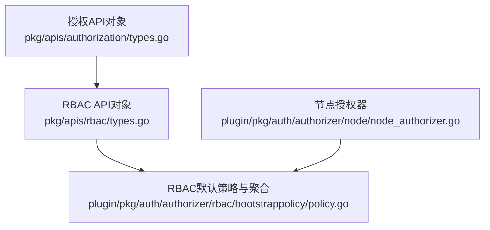
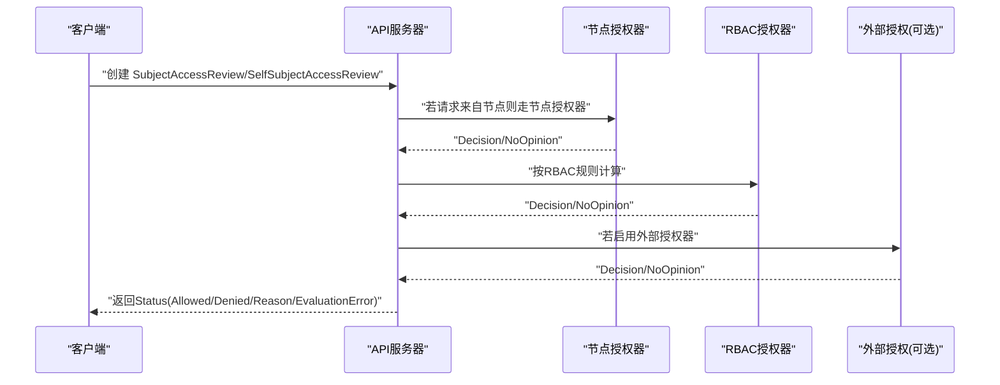
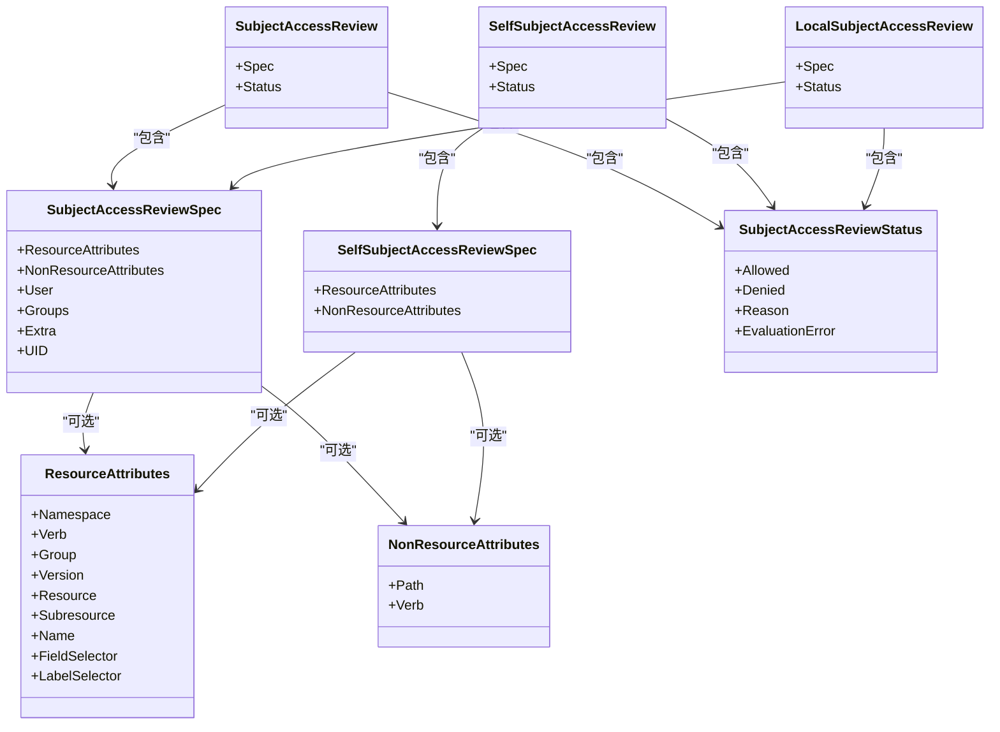
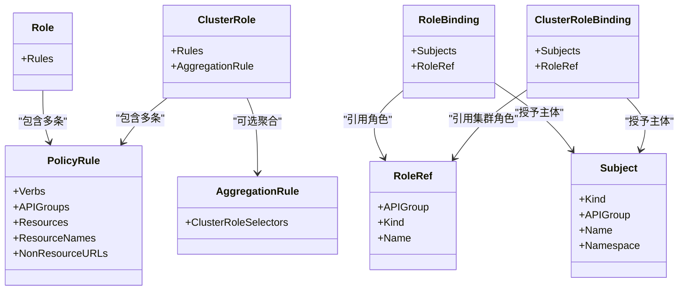
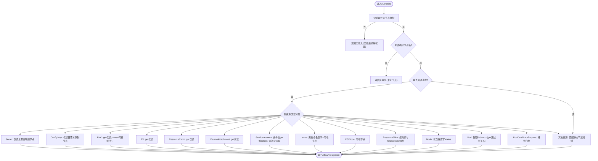
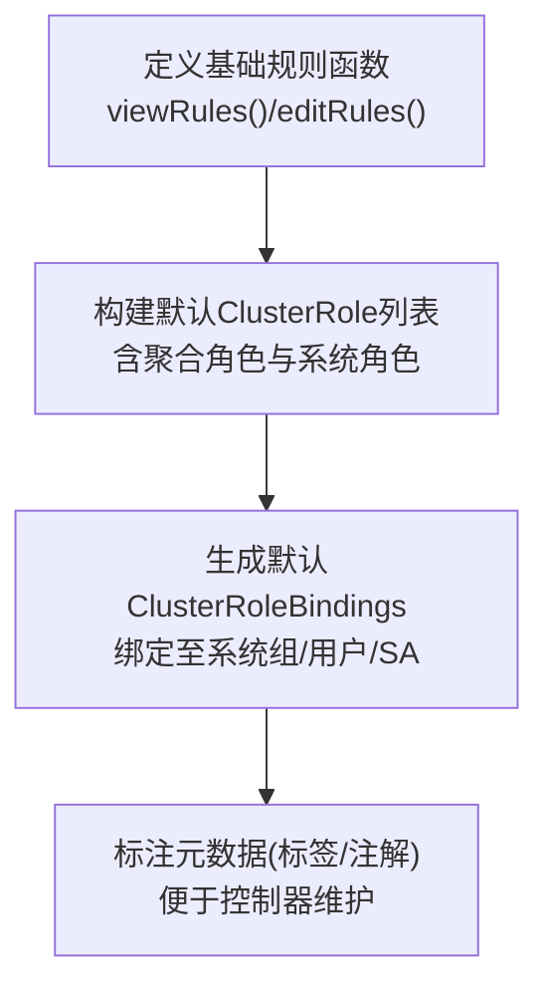
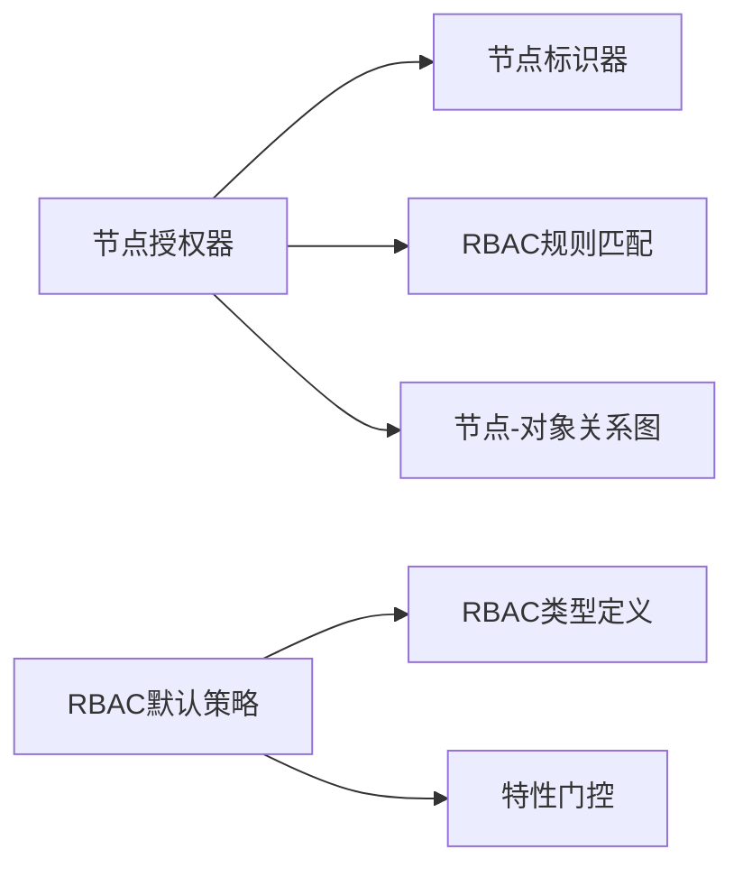

# 授权插件

<cite>
**本文引用的文件**   
- [types.go](file://pkg/apis/authorization/types.go)
- [policy.go](file://plugin/pkg/auth/authorizer/rbac/bootstrappolicy/policy.go)
- [node_authorizer.go](file://plugin/pkg/auth/authorizer/node/node_authorizer.go)
- [types.go](file://pkg/apis/rbac/types.go)
</cite>

## 目录
1. [简介](#简介)
2. [项目结构](#项目结构)
3. [核心组件](#核心组件)
4. [架构总览](#架构总览)
5. [详细组件分析](#详细组件分析)
6. [依赖关系分析](#依赖关系分析)
7. [性能与缓存](#性能与缓存)
8. [配置管理与动态更新](#配置管理与动态更新)
9. [审计与安全](#审计与安全)
10. [故障排查](#故障排查)
11. [结论](#结论)
12. [附录：策略示例与最佳实践](#附录策略示例与最佳实践)

## 简介
本文件面向Kubernetes授权子系统，聚焦以下目标：
- 解释授权插件的设计模式与接口规范，包括SubjectAccessReview、SelfSubjectAccessReview的语义与使用方式。
- 深入阐述RBAC模型的核心概念：Role、ClusterRole、RoleBinding、ClusterRoleBinding及其权限继承与聚合机制。
- 解析节点授权器的特殊处理逻辑与权限检查流程。
- 提供自定义授权策略的开发指南（权限判断、缓存策略、性能优化）。
- 说明授权插件的配置管理、规则聚合与动态更新机制。
- 给出审计日志、安全考虑与调试方法。
- 提供完整的授权策略配置示例与最佳实践。

## 项目结构
围绕授权相关的关键代码位置如下：
- 授权API对象定义：pkg/apis/authorization/types.go
- RBAC API对象定义：pkg/apis/rbac/types.go
- RBAC默认策略与聚合：plugin/pkg/auth/authorizer/rbac/bootstrappolicy/policy.go
- 节点授权器实现：plugin/pkg/auth/authorizer/node/node_authorizer.go

图表来源
- [types.go:24-208](file://pkg/apis/authorization/types.go#L24-L208)
- [types.go:43-210](file://pkg/apis/rbac/types.go#L43-L210)
- [policy.go:300-744](file://plugin/pkg/auth/authorizer/rbac/bootstrappolicy/policy.go#L300-L744)
- [node_authorizer.go:63-175](file://plugin/pkg/auth/authorizer/node/node_authorizer.go#L63-L175)

章节来源
- [types.go:24-208](file://pkg/apis/authorization/types.go#L24-L208)
- [types.go:43-210](file://pkg/apis/rbac/types.go#L43-L210)
- [policy.go:300-744](file://plugin/pkg/auth/authorizer/rbac/bootstrappolicy/policy.go#L300-L744)
- [node_authorizer.go:63-175](file://plugin/pkg/auth/authorizer/node/node_authorizer.go#L63-L175)

## 核心组件
- SubjectAccessReview/SelfSubjectAccessReview/LocalSubjectAccessReview：用于以声明式方式请求API服务器对“某主体是否可执行某操作”进行判定；Self版本仅针对当前用户；Local版本限定命名空间。
- ResourceAttributes/NonResourceAttributes：描述资源与非资源访问属性，支持字段选择器与标签选择器限制。
- RBAC模型：PolicyRule、Role、ClusterRole、RoleBinding、ClusterRoleBinding构成最小权限单元与绑定关系；支持AggregationRule聚合。
- 节点授权器：针对kubelet等节点身份的特殊授权路径，结合图结构与静态规则进行细粒度控制。

章节来源
- [types.go:24-208](file://pkg/apis/authorization/types.go#L24-L208)
- [types.go:43-210](file://pkg/apis/rbac/types.go#L43-L210)

## 架构总览
授权决策在API服务器中由多个Authorizer串联完成。典型顺序为：内置快速路径（如节点授权器）→ RBAC → 外部Webhook等。SubjectAccessReview/SelfSubjectAccessReview作为“自评估”接口，允许客户端在不实际发起受控请求的情况下预检权限。

图表来源
- [types.go:24-208](file://pkg/apis/authorization/types.go#L24-L208)
- [node_authorizer.go:119-175](file://plugin/pkg/auth/authorizer/node/node_authorizer.go#L119-L175)
- [policy.go:300-744](file://plugin/pkg/auth/authorizer/rbac/bootstrappolicy/policy.go#L300-L744)

## 详细组件分析

### 授权API对象与接口规范
- SubjectAccessReview：指定User/Groups/Extra/UID及Resource或NonResource属性，返回Allowed/Denied/Reason/EvaluationError。
- SelfSubjectAccessReview：仅包含Resource/NonResource属性，服务端自动带入当前认证主体。
- LocalSubjectAccessReview：同SubjectAccessReview但强制命名空间作用域。
- ResourceAttributes：支持Namespace/Verb/Group/Version/Resource/Subresource/Name，以及LabelSelectorAttributes/FieldSelectorAttributes，用于实例级限制。
- NonResourceAttributes：Path/Verb。

图表来源
- [types.go:24-208](file://pkg/apis/authorization/types.go#L24-L208)

章节来源
- [types.go:24-208](file://pkg/apis/authorization/types.go#L24-L208)

### RBAC模型与权限继承
- PolicyRule：Verbs/APIGroups/Resources/ResourceNames/NonResourceURLs。
- Role/ClusterRole：规则集合；ClusterRole支持AggregationRule聚合其他ClusterRole的规则。
- RoleBinding/ClusterRoleBinding：将角色授予User/Group/ServiceAccount。
- 评估顺序：先ClusterRoleBinding，再命名空间内RoleBinding，最后默认拒绝。

图表来源
- [types.go:43-210](file://pkg/apis/rbac/types.go#L43-L210)

章节来源
- [types.go:43-210](file://pkg/apis/rbac/types.go#L43-L210)

### 节点授权器设计与流程
节点授权器专门处理来自kubelet的请求，遵循以下原则：
- 非节点身份直接返回无意见，交由后续授权器处理。
- 无法识别具体节点名称时拒绝。
- 对敏感资源（Secret/ConfigMap/PVC/PV/ResourceClaim/VolumeAttachment/ServiceAccount/Lease/CSINode/ResourceSlice/Node/Pod/PodCertificateRequest）实施基于“节点-对象”关系的细粒度校验。
- 对其他资源采用静态定义的节点规则匹配。

图表来源
- [node_authorizer.go:119-175](file://plugin/pkg/auth/authorizer/node/node_authorizer.go#L119-L175)
- [node_authorizer.go:177-551](file://plugin/pkg/auth/authorizer/node/node_authorizer.go#L177-L551)

章节来源
- [node_authorizer.go:119-175](file://plugin/pkg/auth/authorizer/node/node_authorizer.go#L119-L175)
- [node_authorizer.go:177-551](file://plugin/pkg/auth/authorizer/node/node_authorizer.go#L177-L551)

### RBAC默认策略与聚合
- 内置ClusterRole：cluster-admin、system:discovery、system:monitoring、system:basic-user、system:public-info-viewer、admin/edit/view、system:node、system:kube-scheduler等。
- 聚合角色：admin/edit/view通过AggregationRule聚合带特定标签的ClusterRole。
- 节点相关规则：NodeRules()定义了kubelet运行所需的最小权限集，配合节点授权器进一步约束。

图表来源
- [policy.go:112-203](file://plugin/pkg/auth/authorizer/rbac/bootstrappolicy/policy.go#L112-L203)
- [policy.go:300-744](file://plugin/pkg/auth/authorizer/rbac/bootstrappolicy/policy.go#L300-L744)

章节来源
- [policy.go:112-203](file://plugin/pkg/auth/authorizer/rbac/bootstrappolicy/policy.go#L112-L203)
- [policy.go:300-744](file://plugin/pkg/auth/authorizer/rbac/bootstrappolicy/policy.go#L300-L744)

## 依赖关系分析
- 节点授权器依赖：
  - 节点标识器：用于从认证信息中提取节点身份与名称。
  - RBAC规则匹配：复用RBAC规则引擎对静态节点规则进行匹配。
  - 图结构：维护“节点-对象”关系边，用于快速判定可达性。
- RBAC默认策略依赖：
  - RBAC v1类型定义。
  - 特性门控：根据功能开关动态增减规则。

图表来源
- [node_authorizer.go:63-175](file://plugin/pkg/auth/authorizer/node/node_authorizer.go#L63-L175)
- [policy.go:300-744](file://plugin/pkg/auth/authorizer/rbac/bootstrappolicy/policy.go#L300-L744)
- [types.go:43-210](file://pkg/apis/rbac/types.go#L43-L210)

章节来源
- [node_authorizer.go:63-175](file://plugin/pkg/auth/authorizer/node/node_authorizer.go#L63-L175)
- [policy.go:300-744](file://plugin/pkg/auth/authorizer/rbac/bootstrappolicy/policy.go#L300-L744)
- [types.go:43-210](file://pkg/apis/rbac/types.go#L43-L210)

## 性能与缓存
- 节点授权器：
  - 使用图结构的“目的边索引”进行快速命中，避免深度优先搜索。
  - 对部分顶点类型采用权威索引短路，减少遍历开销。
  - 对list/watch/deletecollection场景通过fieldSelector快速放行，降低图查询成本。
- RBAC：
  - 规则匹配为纯内存计算，建议合理拆分角色与聚合，避免单条规则过于宽泛导致匹配成本上升。
  - 利用AggregationRule集中管理跨组件权限，减少重复定义。

[本节为通用指导，不直接分析具体文件]

## 配置管理与动态更新
- 默认策略初始化：
  - 通过bootstrappolicy生成初始ClusterRole与ClusterRoleBinding，并打上统一标签与注解，便于控制器维护与清理。
- 聚合机制：
  - 使用AggregationRule与标签选择器动态合并规则，新增具备相应标签的ClusterRole即可自动扩展聚合角色的权限。
- 特性门控：
  - 许多默认规则与能力随FeatureGate开启而增加，确保按需授权与最小权限。

章节来源
- [policy.go:72-96](file://plugin/pkg/auth/authorizer/rbac/bootstrappolicy/policy.go#L72-L96)
- [policy.go:376-427](file://plugin/pkg/auth/authorizer/rbac/bootstrappolicy/policy.go#L376-L427)
- [policy.go:686-694](file://plugin/pkg/auth/authorizer/rbac/bootstrappolicy/policy.go#L686-L694)

## 审计与安全
- 决策结果字段：
  - Allowed/Denied/Reason/EvaluationError：用于记录授权原因与错误上下文，便于审计与排障。
- 安全要点：
  - 严格区分资源与非资源访问属性，避免误用通配符。
  - 合理使用LabelSelector/FieldSelector限制实例级访问范围。
  - 节点授权器与NodeRestriction准入插件协同，形成“授权+准入”双重保障。
- 审计建议：
  - 开启API Server审计策略，捕获SubjectAccessReview调用与关键资源的写操作。
  - 关注EvaluationError，定位缺失角色或外部授权器异常。

章节来源
- [types.go:193-208](file://pkg/apis/authorization/types.go#L193-L208)

## 故障排查
- 常见现象与定位：
  - “unknown node for user”：节点身份未正确解析，检查认证信息与节点标识器配置。
  - “no relationship found between node and this object”：节点-对象关系图中缺少边，确认对象是否被调度到该节点、镜像Pod/OwnerReference是否正确。
  - “can only access leases in the system namespace”：Lease访问必须位于系统命名空间且名称与节点一致。
  - “can only list/watch pods with spec.nodeName field selector”：list/watch需携带nodeName过滤。
- 诊断步骤：
  - 使用SelfSubjectAccessReview预检权限。
  - 查看节点授权器日志中的NODE DENY条目，定位具体资源与动词。
  - 核对RBAC规则与聚合标签，确认是否遗漏必要规则。

章节来源
- [node_authorizer.go:119-175](file://plugin/pkg/auth/authorizer/node/node_authorizer.go#L119-L175)
- [node_authorizer.go:290-410](file://plugin/pkg/auth/authorizer/node/node_authorizer.go#L290-L410)

## 结论
Kubernetes授权体系以RBAC为核心，辅以节点授权器等专用路径，并通过SubjectAccessReview/SelfSubjectAccessReview提供灵活的自评估能力。通过聚合与特性门控，系统实现了可扩展、可演进的最小权限模型。在生产环境中，应结合审计与调试手段持续优化策略，确保安全性与可用性的平衡。

[本节为总结性内容，不直接分析具体文件]

## 附录：策略示例与最佳实践
- 最小权限原则：
  - 明确列出所需Verbs/资源/名称，避免使用“*”通配符。
  - 对敏感资源（Secret/ConfigMap/PV/PVC/ResourceClaim）尽量限制为只读与实例级访问。
- 聚合与分层：
  - 使用AggregationRule将通用能力抽象为独立ClusterRole，再由高层角色聚合。
  - 将系统组件权限拆分为专用角色（如system:kube-scheduler、system:node-proxier），避免过度授权。
- 节点相关：
  - 依赖节点授权器与NodeRestriction共同约束kubelet行为，不要放宽不必要的节点权限。
- 自评估与验证：
  - 在变更前后使用SelfSubjectAccessReview验证影响面。
  - 对复杂场景使用LocalSubjectAccessReview验证命名空间边界。
- 监控与审计：
  - 收集EvaluationError与Denied事件，建立告警与复盘流程。
  - 定期审查聚合标签与默认绑定，防止漂移。

[本节为通用指导，不直接分析具体文件]