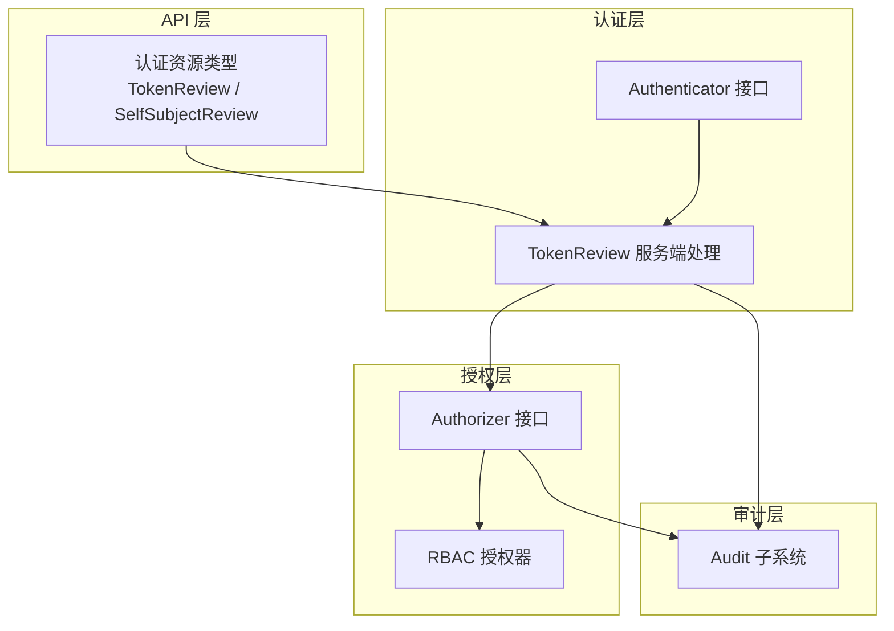
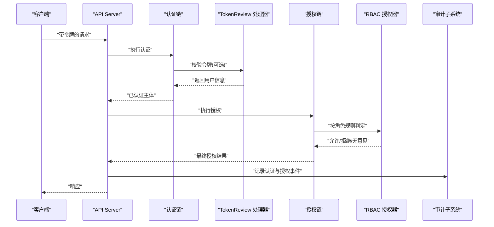
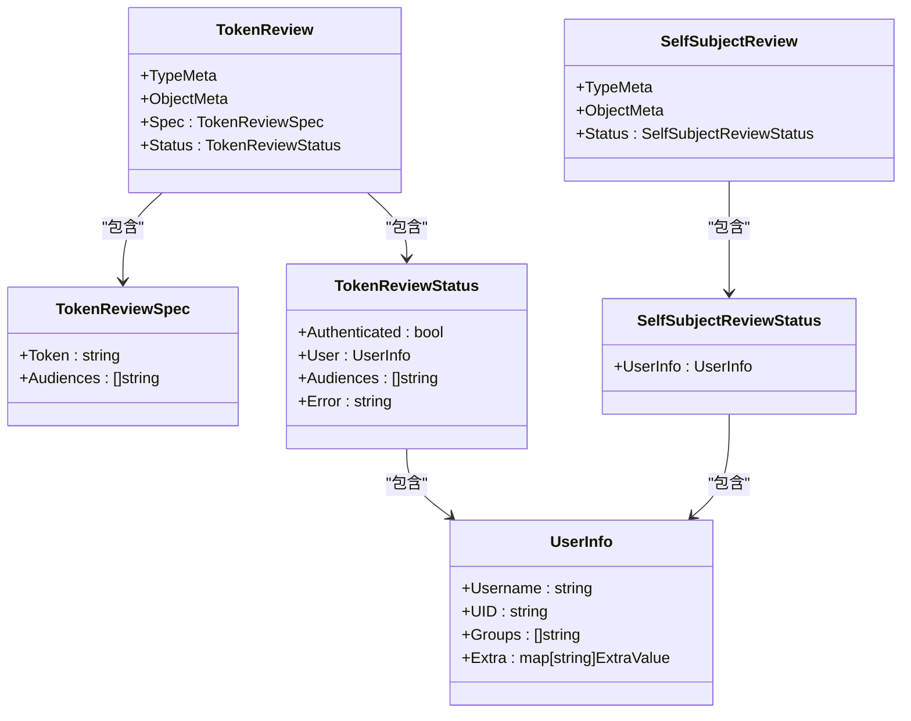
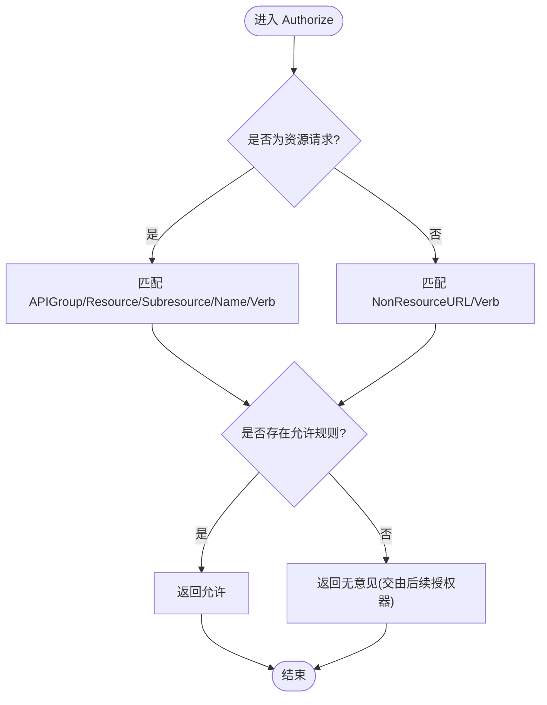
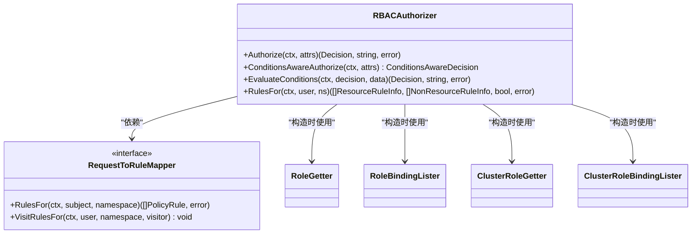

# 认证与授权插件

<cite>
**本文引用的文件**   
- [pkg/apis/authentication/types.go](file://pkg/apis/authentication/types.go)
- [plugin/pkg/auth/authorizer/rbac/rbac.go](file://plugin/pkg/auth/authorizer/rbac/rbac.go)
- [staging/src/k8s.io/apiserver/pkg/authorization/authorizer](file://staging/src/k8s.io/apiserver/pkg/authorization/authorizer)
- [staging/src/k8s.io/apiserver/pkg/authentication/authenticator](file://staging/src/k8s.io/apiserver/pkg/authentication/authenticator)
- [staging/src/k8s.io/apiserver/pkg/audit](file://staging/src/k8s.io/apiserver/pkg/audit)
- [cmd/kubelet/app/options/options.go](file://cmd/kubelet/app/options/options.go)
</cite>

## 目录
1. [简介](#简介)
2. [项目结构](#项目结构)
3. [核心组件](#核心组件)
4. [架构总览](#架构总览)
5. [详细组件分析](#详细组件分析)
6. [依赖关系分析](#依赖关系分析)
7. [性能考虑](#性能考虑)
8. [故障排查指南](#故障排查指南)
9. [结论](#结论)
10. [附录](#附录)

## 简介
本技术文档面向需要在 Kubernetes 中扩展认证与授权的工程师，系统阐述：
- 认证插件开发框架：TokenReview、SelfSubjectAccessReview（及 SelfSubjectReview）接口的数据模型与调用流程。
- 授权插件设计模式：RBAC 扩展点、自定义授权策略实现方式。
- 外部认证后端集成：LDAP、OAuth2、OIDC 等常见身份源的对接思路。
- 自定义授权策略：权限检查逻辑与缓存策略建议。
- 插件加载机制与配置管理：API Server 如何装配认证与授权链。
- 审计日志、安全考量与性能优化建议。
- 完整集成示例与部署配置要点。

## 项目结构
围绕认证与授权的核心代码主要分布在以下位置：
- API 类型定义：认证相关资源 TokenReview、SelfSubjectReview 等位于 pkg/apis/authentication/types.go。
- RBAC 授权实现：plugin/pkg/auth/authorizer/rbac/rbac.go 提供基于角色的访问控制实现。
- 通用接口与工厂：staging/src/k8s.io/apiserver/pkg/authorization/authorizer 与 staging/src/k8s.io/apiserver/pkg/authentication/authenticator 定义了 Authorizer 与 Authenticator 接口，供各实现接入。
- 审计子系统：staging/src/k8s.io/apiserver/pkg/audit 提供请求审计能力。
- 客户端侧 TokenReview 使用：cmd/kubelet/app/options/options.go 展示了通过 TokenReview 进行令牌认证的选项说明。

图表来源
- [pkg/apis/authentication/types.go:44-185](file://pkg/apis/authentication/types.go#L44-L185)
- [plugin/pkg/auth/authorizer/rbac/rbac.go:50-179](file://plugin/pkg/auth/authorizer/rbac/rbac.go#L50-L179)
- [staging/src/k8s.io/apiserver/pkg/authorization/authorizer](file://staging/src/k8s.io/apiserver/pkg/authorization/authorizer)
- [staging/src/k8s.io/apiserver/pkg/authentication/authenticator](file://staging/src/k8s.io/apiserver/pkg/authentication/authenticator)
- [staging/src/k8s.io/apiserver/pkg/audit](file://staging/src/k8s.io/apiserver/pkg/audit)

章节来源
- [pkg/apis/authentication/types.go:44-185](file://pkg/apis/authentication/types.go#L44-L185)
- [plugin/pkg/auth/authorizer/rbac/rbac.go:50-179](file://plugin/pkg/auth/authorizer/rbac/rbac.go#L50-L179)

## 核心组件
- 认证资源与接口
  - TokenReview：用于验证一个不透明令牌并返回用户信息；包含 Spec（令牌、受众）和 Status（是否认证成功、用户信息、受众、错误）。
  - UserInfo：用户名、UID、组、额外属性。
  - SelfSubjectReview：返回当前请求者的用户信息（在代理或 Header 认证场景下反映被代理者信息）。
- 授权接口与 RBAC 实现
  - Authorizer 接口：Authorize(ctx, attributes) -> (Decision, reason, error)。
  - RuleResolver 接口：RulesFor(...) 暴露规则解析能力，便于调试与可视化。
  - RBACAuthorizer：基于 Role/RoleBinding/ClusterRole/ClusterRoleBinding 的规则匹配，支持资源与非资源 URL 两类请求。
- 审计
  - Audit 子系统对认证与授权关键路径进行记录，便于合规与排障。

章节来源
- [pkg/apis/authentication/types.go:44-185](file://pkg/apis/authentication/types.go#L44-L185)
- [plugin/pkg/auth/authorizer/rbac/rbac.go:50-179](file://plugin/pkg/auth/authorizer/rbac/rbac.go#L50-L179)
- [staging/src/k8s.io/apiserver/pkg/audit](file://staging/src/k8s.io/apiserver/pkg/audit)

## 架构总览
Kubernetes API Server 的认证与授权链路如下：
- 请求进入后，先由认证链（Authenticator chain）识别主体，可能调用 TokenReview 服务完成令牌校验。
- 随后进入授权链（Authorizer chain），默认启用 Node + RBAC，也可组合其他授权器。
- 整个过程中，审计子系统可记录关键事件与决策原因。

图表来源
- [pkg/apis/authentication/types.go:44-185](file://pkg/apis/authentication/types.go#L44-L185)
- [plugin/pkg/auth/authorizer/rbac/rbac.go:78-130](file://plugin/pkg/auth/authorizer/rbac/rbac.go#L78-L130)
- [staging/src/k8s.io/apiserver/pkg/audit](file://staging/src/k8s.io/apiserver/pkg/audit)

## 详细组件分析

### 认证插件：TokenReview 与 SelfSubjectReview
- TokenReview
  - 作用：将不透明令牌映射为已知用户，返回 UserInfo 与受众信息。
  - 关键字段：Spec.Token、Spec.Audiences；Status.Authenticated、Status.User、Status.Audiences、Status.Error。
  - 典型用法：kubelet 等组件可通过 TokenReview 确认 bearer token 的有效性。
- SelfSubjectReview
  - 作用：返回当前请求主体的用户信息，结合代理或 Header 认证时，反映被代理者信息。
  - 适用场景：客户端需要自证身份或调试自身上下文。

图表来源
- [pkg/apis/authentication/types.go:44-185](file://pkg/apis/authentication/types.go#L44-L185)

章节来源
- [pkg/apis/authentication/types.go:44-185](file://pkg/apis/authentication/types.go#L44-L185)
- [cmd/kubelet/app/options/options.go:387](file://cmd/kubelet/app/options/options.go#L387)

### 授权插件：RBAC 与自定义授权策略
- RBAC 授权器
  - 实现 Authorizer 与 RuleResolver 接口。
  - 通过 VisitRulesFor 遍历匹配规则，若任一规则允许则放行；否则记录拒绝原因并返回“无意见”，交由后续授权器决定。
  - 支持资源请求（含子资源）与非资源 URL 两种匹配路径。
- 自定义授权策略
  - 实现 Authorizer 接口，并在 Authorize 中根据 Attributes 计算决策。
  - 可选择实现 RuleResolver 以暴露规则，便于诊断。
  - 推荐组合多个授权器形成链式决策（Union Authorizer）。

图表来源
- [plugin/pkg/auth/authorizer/rbac/rbac.go:78-130](file://plugin/pkg/auth/authorizer/rbac/rbac.go#L78-L130)
- [plugin/pkg/auth/authorizer/rbac/rbac.go:191-206](file://plugin/pkg/auth/authorizer/rbac/rbac.go#L191-L206)

章节来源
- [plugin/pkg/auth/authorizer/rbac/rbac.go:50-179](file://plugin/pkg/auth/authorizer/rbac/rbac.go#L50-L179)
- [plugin/pkg/auth/authorizer/rbac/rbac.go:191-206](file://plugin/pkg/auth/authorizer/rbac/rbac.go#L191-L206)

### 外部认证后端集成（LDAP/OAuth2/OIDC）
- 集成思路
  - 通过 TokenReview 作为统一入口：外部认证后端实现 TokenReview 服务端，接收令牌并返回 UserInfo。
  - API Server 的认证链可配置调用 TokenReview 端点，从而桥接 LDAP/OAuth2/OIDC 等身份源。
  - 客户端（如 kubelet）通过启用 TokenReview 选项，将 bearer token 交由 TokenReview 服务校验。
- 实践要点
  - 受众（Audience）校验：确保 TokenReview 返回的 audiences 与请求方期望一致。
  - 错误传播：当令牌不可用时，TokenReview 应返回错误信息以便上层处理。
  - 性能与安全：避免频繁网络往返，必要时引入本地缓存与超时控制。

章节来源
- [pkg/apis/authentication/types.go:44-185](file://pkg/apis/authentication/types.go#L44-L185)
- [cmd/kubelet/app/options/options.go:387](file://cmd/kubelet/app/options/options.go#L387)

### 插件加载机制与配置管理
- 认证链与授权链
  - API Server 启动时组装认证链（Authenticator chain）与授权链（Authorizer chain）。
  - 授权模式（如 Node、RBAC）通过命令行参数注入，形成多阶段授权决策。
- 可扩展点
  - 自定义 Authenticator：实现认证接口，注册到认证链。
  - 自定义 Authorizer：实现授权接口，注册到授权链。
  - 审计插件：按需启用审计策略与输出目标。

章节来源
- [staging/src/k8s.io/apiserver/pkg/authorization/authorizer](file://staging/src/k8s.io/apiserver/pkg/authorization/authorizer)
- [staging/src/k8s.io/apiserver/pkg/authentication/authenticator](file://staging/src/k8s.io/apiserver/pkg/authentication/authenticator)
- [staging/src/k8s.io/apiserver/pkg/audit](file://staging/src/k8s.io/apiserver/pkg/audit)

## 依赖关系分析
- RBAC 授权器依赖
  - 读取 Role、RoleBinding、ClusterRole、ClusterRoleBinding 列表与获取接口。
  - 使用 helper 函数进行动词、APIGroup、资源名、非资源 URL 的匹配。
- 接口契约
  - Authorizer：Authorize(ctx, attributes) -> (Decision, reason, error)。
  - RuleResolver：RulesFor(...) 暴露规则集合，便于诊断与可视化。

图表来源
- [plugin/pkg/auth/authorizer/rbac/rbac.go:50-179](file://plugin/pkg/auth/authorizer/rbac/rbac.go#L50-L179)

章节来源
- [plugin/pkg/auth/authorizer/rbac/rbac.go:50-179](file://plugin/pkg/auth/authorizer/rbac/rbac.go#L50-L179)

## 性能考虑
- 规则匹配优化
  - 优先命中高频规则，减少不必要的字符串拼接与日志构建。
  - 对复杂命名空间与大量绑定对象，建议使用索引与缓存加速查找。
- 外部认证延迟
  - TokenReview 调用需设置合理超时与重试上限，避免阻塞主请求路径。
  - 对热点用户/令牌做短期缓存，注意失效策略与一致性权衡。
- 审计开销
  - 在高吞吐场景下，选择性开启审计级别，避免全量写入造成瓶颈。
  - 异步落盘与批量化写入可降低 I/O 压力。

## 故障排查指南
- 常见问题定位
  - 令牌无效：检查 TokenReview 返回的错误信息与受众匹配情况。
  - 授权拒绝：查看 RBAC 拒绝日志中的操作与范围描述，确认角色与绑定是否正确。
  - 代理/Header 认证：确认被代理者信息与 Extra 字段大小写处理是否符合预期。
- 辅助手段
  - 启用更详细的 RBAC 日志（例如 V(5)）以获取拒绝原因。
  - 使用 SelfSubjectReview 快速验证当前主体上下文。
  - 借助审计日志回溯认证与授权决策过程。

章节来源
- [plugin/pkg/auth/authorizer/rbac/rbac.go:88-123](file://plugin/pkg/auth/authorizer/rbac/rbac.go#L88-L123)
- [pkg/apis/authentication/types.go:168-185](file://pkg/apis/authentication/types.go#L168-L185)
- [staging/src/k8s.io/apiserver/pkg/audit](file://staging/src/k8s.io/apiserver/pkg/audit)

## 结论
通过 TokenReview 与 RBAC 两大核心能力，Kubernetes 提供了可扩展且高内聚的认证与授权体系。开发者可在保持与原生生态兼容的前提下，灵活接入外部身份源与自定义授权策略，并通过审计与性能优化保障系统的可观测性与稳定性。

## 附录
- 集成示例与部署配置要点
  - 启用 TokenReview：在客户端组件（如 kubelet）选项中启用 TokenReview 认证模式，指向 TokenReview 服务端。
  - 配置授权模式：在 API Server 启动参数中指定授权模式（例如 Node,RBAC），形成默认的安全基线。
  - 审计策略：根据合规需求配置审计策略与输出目标，平衡安全性与性能。

章节来源
- [cmd/kubelet/app/options/options.go:387](file://cmd/kubelet/app/options/options.go#L387)
- [staging/src/k8s.io/apiserver/pkg/audit](file://staging/src/k8s.io/apiserver/pkg/audit)