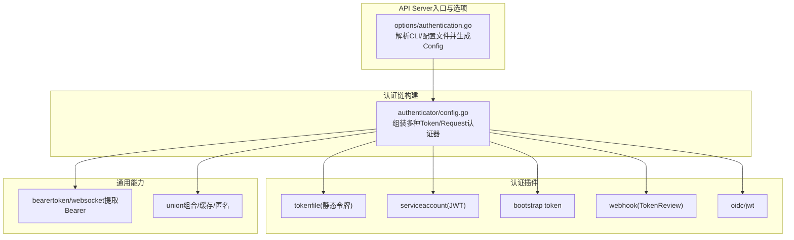
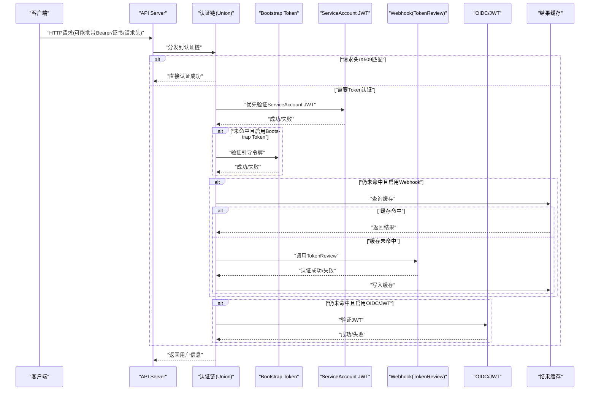
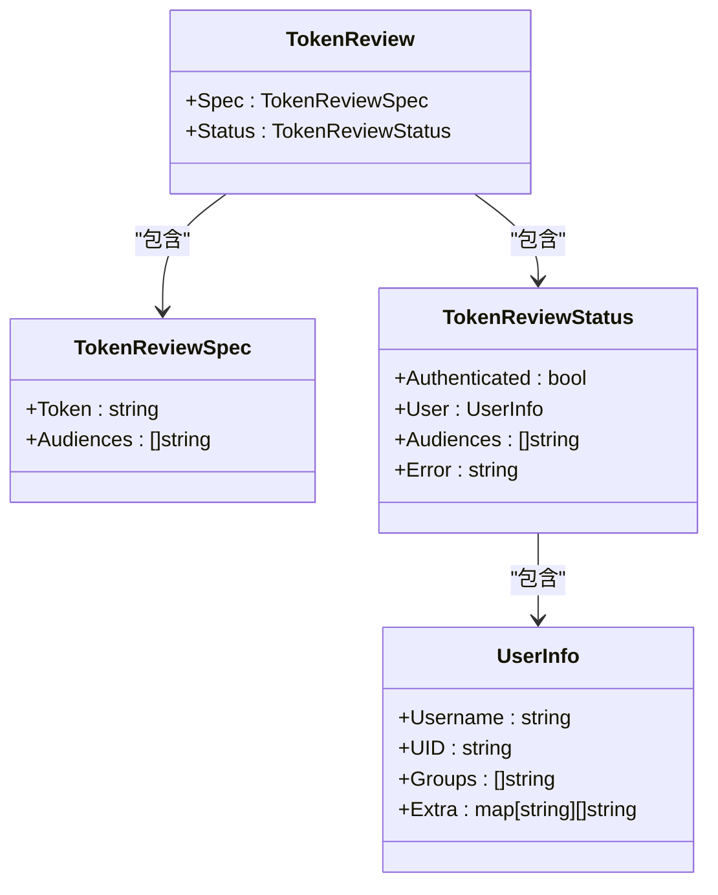
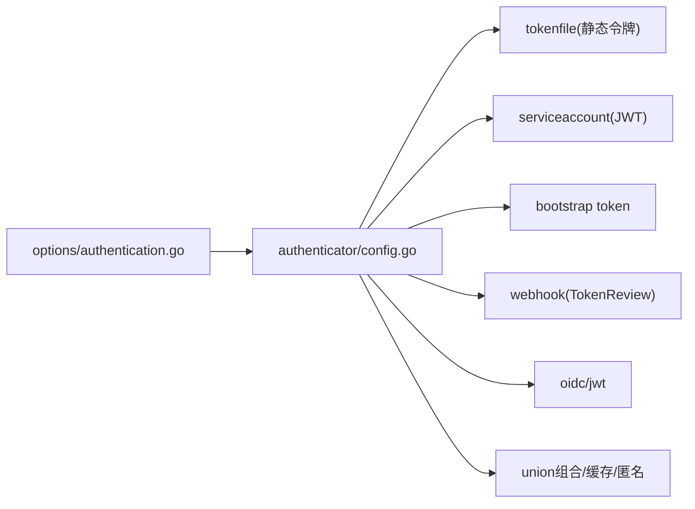

# 内置认证后端

<cite>
**本文引用的文件**   
- [pkg/kubeapiserver/authenticator/config.go](file://pkg/kubeapiserver/authenticator/config.go)
- [pkg/kubeapiserver/options/authentication.go](file://pkg/kubeapiserver/options/authentication.go)
- [pkg/apis/authentication/types.go](file://pkg/apis/authentication/types.go)
- [plugin/pkg/auth/authenticator/token/bootstrap/bootstrap.go](file://plugin/pkg/auth/authenticator/token/bootstrap/bootstrap.go)
</cite>

## 目录
1. [简介](#简介)
2. [项目结构](#项目结构)
3. [核心组件](#核心组件)
4. [架构总览](#架构总览)
5. [详细组件分析](#详细组件分析)
6. [依赖关系分析](#依赖关系分析)
7. [性能考量](#性能考量)
8. [故障排查指南](#故障排查指南)
9. [结论](#结论)
10. [附录](#附录)

## 简介
本文件面向Kubernetes控制面（kube-apiserver）的内置认证后端，系统性阐述以下主题：
- 内置认证后端的实现原理与组合方式（请求头、X509、静态令牌、ServiceAccount JWT、Bootstrap Token、Webhook令牌、OIDC/JWT）。
- 各认证方式的配置方法、安全特性与适用场景。
- TokenReview接口的数据模型与验证流程。
- 完整的配置示例与最佳实践建议。
- 认证失败处理机制、错误码定义与调试方法。
- 不同认证后端的性能特点与适用环境。

## 项目结构
围绕“内置认证后端”的关键代码主要分布在以下位置：
- 认证选项与命令行参数：pkg/kubeapiserver/options/authentication.go
- 认证链构建与动态更新：pkg/kubeapiserver/authenticator/config.go
- TokenReview等API类型定义：pkg/apis/authentication/types.go
- Bootstrap Token认证插件：plugin/pkg/auth/authenticator/token/bootstrap/bootstrap.go

图表来源
- [pkg/kubeapiserver/options/authentication.go:488-666](file://pkg/kubeapiserver/options/authentication.go#L488-L666)
- [pkg/kubeapiserver/authenticator/config.go:107-249](file://pkg/kubeapiserver/authenticator/config.go#L107-L249)

章节来源
- [pkg/kubeapiserver/options/authentication.go:488-666](file://pkg/kubeapiserver/options/authentication.go#L488-L666)
- [pkg/kubeapiserver/authenticator/config.go:107-249](file://pkg/kubeapiserver/authenticator/config.go#L107-L249)

## 核心组件
- 认证选项聚合与校验
  - 提供统一的内置认证选项集合，支持从命令行或配置文件加载，并进行一致性校验。
- 认证链构建器
  - 根据选项动态构建认证链，包括请求头、X509、各类Token认证器，并通过Union组合、可选缓存和匿名策略包装。
- TokenReview API类型
  - 定义TokenReview/TokenRequest/SelfSubjectReview等数据结构，作为外部系统验证令牌的统一接口。
- Bootstrap Token认证器
  - 基于kube-system命名空间中的特定Secret进行一次性引导认证。

章节来源
- [pkg/kubeapiserver/options/authentication.go:84-163](file://pkg/kubeapiserver/options/authentication.go#L84-L163)
- [pkg/kubeapiserver/authenticator/config.go:57-103](file://pkg/kubeapiserver/authenticator/config.go#L57-L103)
- [pkg/apis/authentication/types.go:44-104](file://pkg/apis/authentication/types.go#L44-L104)

## 架构总览
下图展示了请求进入API Server后的认证路径：先尝试请求头/X509，再按顺序尝试各类Token认证器（静态令牌、ServiceAccount、Bootstrap Token、Webhook、OIDC/JWT），最终通过Union组合与匿名策略得到用户信息。

图表来源
- [pkg/kubeapiserver/authenticator/config.go:107-249](file://pkg/kubeapiserver/authenticator/config.go#L107-L249)
- [pkg/kubeapiserver/options/authentication.go:488-666](file://pkg/kubeapiserver/options/authentication.go#L488-L666)

## 详细组件分析

### 静态令牌认证（CSV文件）
- 实现要点
  - 通过CSV文件提供用户名、令牌、UID映射；在认证链中作为本地Token认证器参与验证。
  - 适合小规模集群或测试环境，便于快速启用。
- 配置方法
  - 使用命令行参数指定令牌文件路径。
- 安全特性
  - 无签名校验，凭据以明文形式存储于文件，需严格保护文件权限。
  - 不适合生产环境的大规模部署。
- 使用场景
  - 开发/测试、临时集群、最小化部署。
- 性能特点
  - 本地读取，延迟极低；但缺乏可扩展性与高可用。

章节来源
- [pkg/kubeapiserver/authenticator/config.go:134-140](file://pkg/kubeapiserver/authenticator/config.go#L134-L140)
- [pkg/kubeapiserver/options/authentication.go:469-473](file://pkg/kubeapiserver/options/authentication.go#L469-L473)

### ServiceAccount令牌认证（JWT）
- 实现要点
  - 支持两种模式：
    - 传统模式：基于本地公钥文件验证JWT签名。
    - 新式模式：基于配置的多个Issuer与JWKS端点动态获取公钥，支持Audience校验与绑定对象引用。
  - 可与etcd中的ServiceAccount/Secret/Pod信息进行关联校验（可选）。
- 配置方法
  - 指定服务账号签发者列表与公钥来源（本地文件或外部签名端点）。
  - 可开启令牌过期时间扩展与最大有效期限制。
- 安全特性
  - 强签名校验、Audience约束、可选绑定对象生命周期约束。
  - 推荐在生产环境中启用Audience与绑定对象校验。
- 使用场景
  - Pod内工作负载访问API Server的标准方式。
- 性能特点
  - 本地JWT校验开销低；若启用外部JWKS拉取，需注意网络与缓存策略。

章节来源
- [pkg/kubeapiserver/authenticator/config.go:141-154](file://pkg/kubeapiserver/authenticator/config.go#L141-L154)
- [pkg/kubeapiserver/options/authentication.go:429-467](file://pkg/kubeapiserver/options/authentication.go#L429-L467)

### Bootstrap Token认证
- 实现要点
  - 基于kube-system命名空间中类型为引导令牌的Secret进行一次性TLS引导认证。
  - 通常用于节点加入集群时的初始身份建立。
- 配置方法
  - 启用引导令牌认证开关。
- 安全特性
  - 一次性使用、短生命周期、受Namespace与Secret类型约束。
  - 应配合严格的RBAC与最小权限原则。
- 使用场景
  - 节点初始化、自动化集群扩缩容。
- 性能特点
  - 仅用于引导阶段，对整体吞吐影响极小。

章节来源
- [pkg/kubeapiserver/authenticator/config.go:156-158](file://pkg/kubeapiserver/authenticator/config.go#L156-L158)
- [pkg/kubeapiserver/options/authentication.go:364-368](file://pkg/kubeapiserver/options/authentication.go#L364-L368)
- [plugin/pkg/auth/authenticator/token/bootstrap/bootstrap.go](file://plugin/pkg/auth/authenticator/token/bootstrap/bootstrap.go)

### Webhook令牌认证（TokenReview）
- 实现要点
  - 将Bearer令牌转发至外部Webhook服务，由外部服务依据自身策略判定认证结果。
  - 支持重试退避与结果缓存，降低外部依赖对性能的冲击。
- 配置方法
  - 指定Webhook配置文件（kubeconfig格式）、API版本、缓存TTL与重试退避参数。
- 安全特性
  - 依赖外部服务的安全性与可用性；建议使用出站选择器与最小权限网络策略。
- 使用场景
  - 企业统一认证中心、集中式令牌管理、跨域身份集成。
- 性能特点
  - 引入网络往返与外部处理时延；合理设置缓存TTL与重试退避至关重要。

章节来源
- [pkg/kubeapiserver/authenticator/config.go:195-202](file://pkg/kubeapiserver/authenticator/config.go#L195-L202)
- [pkg/kubeapiserver/authenticator/config.go:402-417](file://pkg/kubeapiserver/authenticator/config.go#L402-L417)
- [pkg/kubeapiserver/options/authentication.go:475-485](file://pkg/kubeapiserver/options/authentication.go#L475-L485)

### OIDC/JWT认证
- 实现要点
  - 支持从配置文件或命令行参数配置一个或多个JWT Issuer，动态拉取JWKS并校验签名。
  - 支持Claim映射为Username/Groups、必需Claim校验、签名算法白名单。
- 配置方法
  - 可通过authentication-config文件或一组OIDC相关命令行参数配置。
- 安全特性
  - 强签名校验、Audience约束、可选CA证书校验、签名算法白名单。
- 使用场景
  - 与外部身份提供商（如企业OIDC）集成，统一用户与组映射。
- 性能特点
  - 首次拉取JWKS有网络开销；后续本地校验高效。

章节来源
- [pkg/kubeapiserver/authenticator/config.go:167-193](file://pkg/kubeapiserver/authenticator/config.go#L167-L193)
- [pkg/kubeapiserver/options/authentication.go:374-423](file://pkg/kubeapiserver/options/authentication.go#L374-L423)
- [pkg/kubeapiserver/options/authentication.go:523-585](file://pkg/kubeapiserver/options/authentication.go#L523-L585)

### 请求头与X509认证
- 实现要点
  - 请求头认证：信任前置代理注入的用户/组/额外字段，结合CA与允许名称白名单。
  - X509认证：基于客户端证书CN映射为用户名，支持动态CA更新。
- 配置方法
  - 分别通过请求头与客户端证书相关选项启用。
- 安全特性
  - 必须严格限定可信CA与允许名称，防止伪造请求头。
- 使用场景
  - 多集群网关、Ingress控制器、内部代理体系。

章节来源
- [pkg/kubeapiserver/authenticator/config.go:115-131](file://pkg/kubeapiserver/authenticator/config.go#L115-L131)
- [pkg/kubeapiserver/options/authentication.go:304-321](file://pkg/kubeapiserver/options/authentication.go#L304-L321)

### TokenReview接口与验证流程
- 数据模型
  - TokenReview包含待验证的令牌与受众列表；响应包含是否认证成功、用户信息与兼容受众。
  - UserInfo包含用户名、UID、组与额外属性。
- 验证流程
  - 当启用Webhook令牌认证时，API Server将构造TokenReview请求发送至外部Webhook；外部服务返回认证结果。
  - 同时，ServiceAccount与OIDC/JWT路径也遵循类似的令牌校验语义（签名、受众、声明映射）。
- 错误处理
  - 若外部Webhook不可用或返回错误，认证链会依据重试退避与缓存策略进行处理，并最终返回失败。

图表来源
- [pkg/apis/authentication/types.go:44-104](file://pkg/apis/authentication/types.go#L44-L104)

章节来源
- [pkg/apis/authentication/types.go:44-104](file://pkg/apis/authentication/types.go#L44-L104)
- [pkg/kubeapiserver/authenticator/config.go:195-202](file://pkg/kubeapiserver/authenticator/config.go#L195-L202)

## 依赖关系分析
- 组件耦合
  - 认证链构建器依赖各具体认证器实现，并通过Union组合形成优先级链。
  - 选项层负责将CLI/配置文件转换为构建器所需的配置对象。
- 外部依赖
  - Webhook认证依赖外部服务；OIDC/JWT依赖外部JWKS端点。
- 潜在循环依赖
  - 当前设计采用分层与插件化，避免循环依赖。

图表来源
- [pkg/kubeapiserver/options/authentication.go:488-666](file://pkg/kubeapiserver/options/authentication.go#L488-L666)
- [pkg/kubeapiserver/authenticator/config.go:107-249](file://pkg/kubeapiserver/authenticator/config.go#L107-L249)

章节来源
- [pkg/kubeapiserver/options/authentication.go:488-666](file://pkg/kubeapiserver/options/authentication.go#L488-L666)
- [pkg/kubeapiserver/authenticator/config.go:107-249](file://pkg/kubeapiserver/authenticator/config.go#L107-L249)

## 性能考量
- 缓存策略
  - 全局Token成功/失败缓存与Webhook专用缓存可显著降低外部依赖压力。
  - 注意Webhook缓存TTL不应小于全局缓存TTL，以避免不一致。
- 重试退避
  - 为Webhook认证配置合理的重试次数与退避间隔，避免雪崩效应。
- 并发与顺序
  - 认证链顺序影响命中率与性能；建议将高频路径（如ServiceAccount）置于前面。
- 网络与I/O
  - 减少不必要的网络往返（如JWKS拉取频率），利用出站选择器优化网络路径。

[本节为通用指导，不直接分析具体文件]

## 故障排查指南
- 常见问题定位
  - 检查认证链是否按预期启用（查看命令行参数与配置文件）。
  - 确认Webhook可达性与返回状态；关注重试退避与缓存命中情况。
  - 核对ServiceAccount/JWT的Issuer、Audience与签名算法白名单。
- 日志与指标
  - 关注认证配置自动重载失败的指标记录。
  - 观察Webhook认证失败与超时相关的告警。
- 调试步骤
  - 逐步禁用非必要的认证器，缩小问题范围。
  - 使用SelfSubjectReview接口验证当前请求的用户上下文。
  - 针对Webhook，抓包或增加服务端日志以定位外部服务问题。

章节来源
- [pkg/kubeapiserver/options/authentication.go:752-800](file://pkg/kubeapiserver/options/authentication.go#L752-L800)
- [pkg/apis/authentication/types.go:168-184](file://pkg/apis/authentication/types.go#L168-L184)

## 结论
Kubernetes内置认证后端通过灵活的组合与插件化设计，满足从简单到复杂的多场景需求。生产环境推荐：
- 启用ServiceAccount JWT与Audience约束，必要时启用绑定对象校验。
- 谨慎启用Webhook令牌认证，并配置合适的缓存与重试策略。
- 严格控制请求头与X509的可信边界，避免越权风险。
- 使用Bootstrap Token完成节点引导，并遵循最小权限原则。

[本节为总结性内容，不直接分析具体文件]

## 附录
- 配置示例（路径参考）
  - 静态令牌文件路径参数：[pkg/kubeapiserver/options/authentication.go:469-473](file://pkg/kubeapiserver/options/authentication.go#L469-L473)
  - Webhook令牌认证参数（配置文件、版本、缓存TTL、重试退避）：[pkg/kubeapiserver/options/authentication.go:475-485](file://pkg/kubeapiserver/options/authentication.go#L475-L485)
  - ServiceAccount签发者与公钥来源参数：[pkg/kubeapiserver/options/authentication.go:429-467](file://pkg/kubeapiserver/options/authentication.go#L429-L467)
  - OIDC/JWT参数（issuer、client-id、ca-file、claims、签名算法）：[pkg/kubeapiserver/options/authentication.go:374-423](file://pkg/kubeapiserver/options/authentication.go#L374-L423)
- 最佳实践建议
  - 明确Audience与Issuer，避免令牌跨域滥用。
  - 为Webhook与OIDC配置合理的超时与重试策略，保障可用性。
  - 定期轮换密钥与证书，监控认证失败率与延迟指标。

[本节为补充说明，不直接分析具体文件]