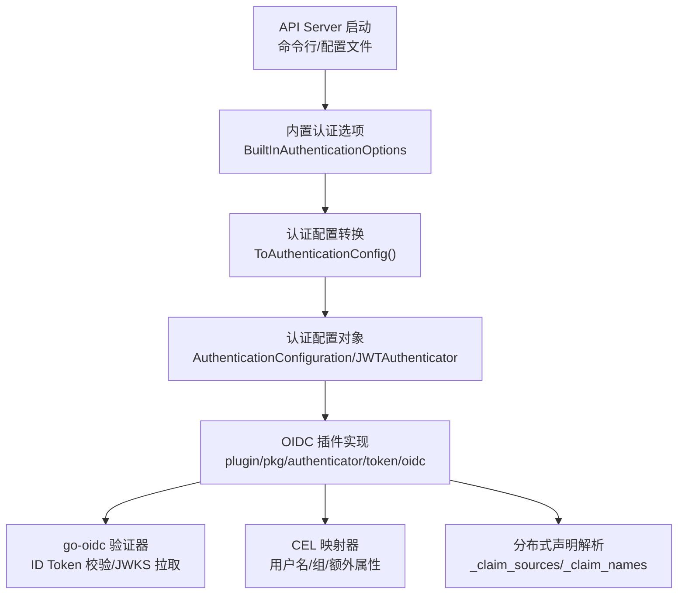
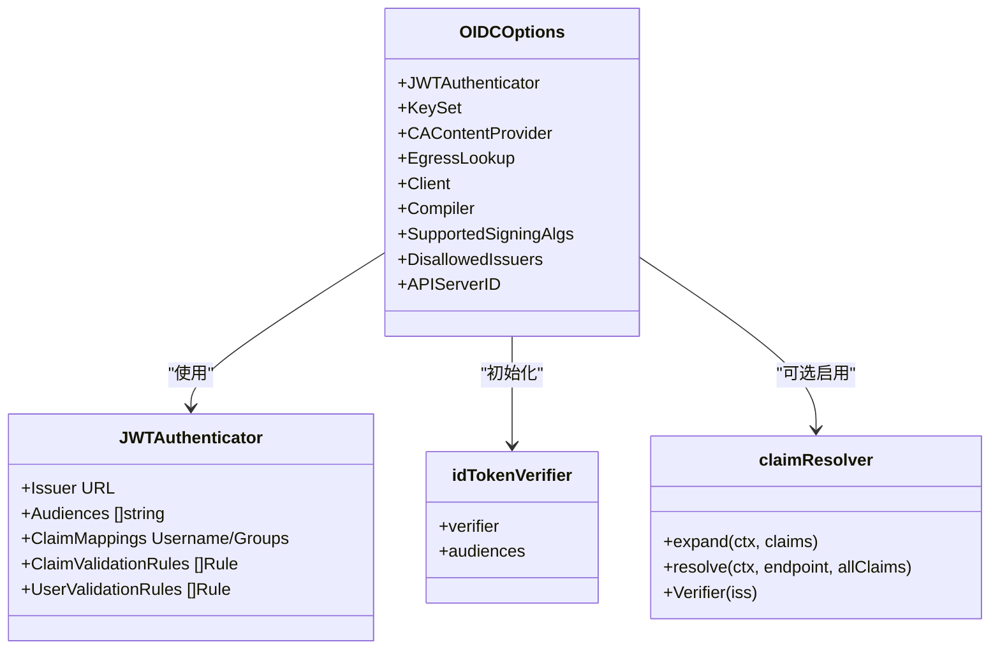
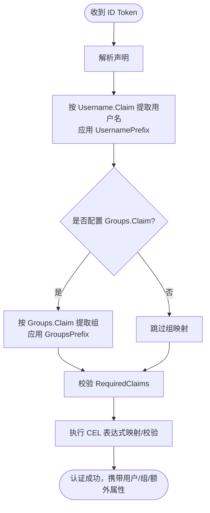
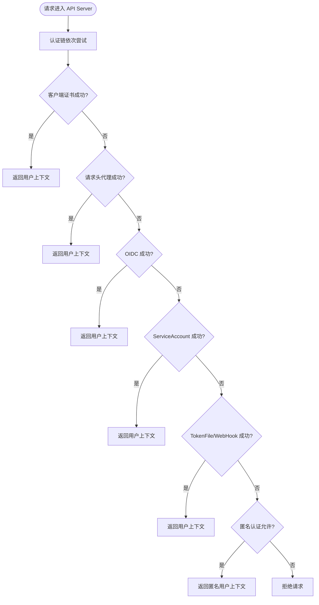
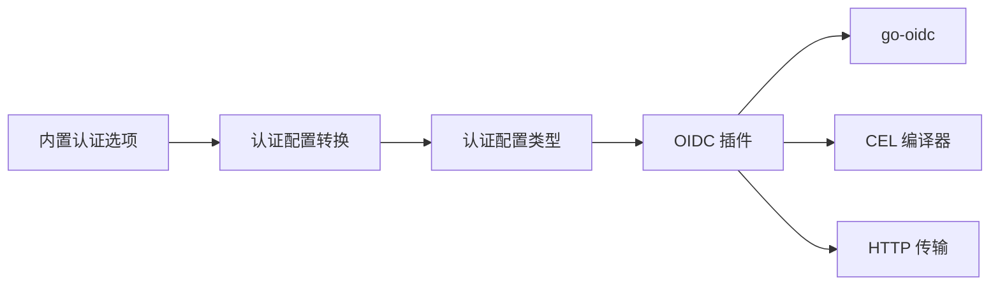

# 外部认证集成

<cite>
**本文引用的文件**   
- [pkg/kubeapiserver/options/authentication.go](file://pkg/kubeapiserver/options/authentication.go)
- [staging/src/k8s.io/apiserver/plugin/pkg/authenticator/token/oidc/oidc.go](file://staging/src/k8s.io/apiserver/plugin/pkg/authenticator/token/oidc/oidc.go)
- [staging/src/k8s.io/apiserver/pkg/apis/apiserver/types.go](file://staging/src/k8s.io/apiserver/pkg/apis/apiserver/types.go)
</cite>

## 目录
1. [简介](#简介)
2. [项目结构](#项目结构)
3. [核心组件](#核心组件)
4. [架构总览](#架构总览)
5. [详细组件分析](#详细组件分析)
6. [依赖关系分析](#依赖关系分析)
7. [性能考虑](#性能考虑)
8. [故障排查指南](#故障排查指南)
9. [结论](#结论)
10. [附录](#附录)

## 简介
本文件面向在 Kubernetes API Server 中集成外部身份源的运维与平台工程师，聚焦于 OIDC（OpenID Connect）的协议实现、配置参数与安全考量，并说明用户信息映射机制（用户名提取、组同步、属性传递）、多认证源优先级与回退策略、认证失败排查方法与性能优化建议。同时给出 LDAP、OAuth2、SAML 等常见外部认证源的集成思路与注意事项。

## 项目结构
Kubernetes 对外部认证的支撑主要位于以下位置：
- API Server 启动选项与配置加载：将命令行参数或配置文件转换为内部认证配置对象
- JWT/OIDC 插件实现：基于 go-oidc 库完成 ID Token 校验、JWKS 获取、分布式声明解析、CEL 表达式映射等
- 认证配置类型定义：描述 JWT 认证器、声明映射、声明校验规则等



图表来源
- [pkg/kubeapiserver/options/authentication.go:488-666](file://pkg/kubeapiserver/options/authentication.go#L488-L666)
- [staging/src/k8s.io/apiserver/plugin/pkg/authenticator/token/oidc/oidc.go:264-471](file://staging/src/k8s.io/apiserver/plugin/pkg/authenticator/token/oidc/oidc.go#L264-L471)
- [staging/src/k8s.io/apiserver/pkg/apis/apiserver/types.go:167-199](file://staging/src/k8s.io/apiserver/pkg/apis/apiserver/types.go#L167-L199)

章节来源
- [pkg/kubeapiserver/options/authentication.go:84-128](file://pkg/kubeapiserver/options/authentication.go#L84-L128)
- [staging/src/k8s.io/apiserver/pkg/apis/apiserver/types.go:167-199](file://staging/src/k8s.io/apiserver/pkg/apis/apiserver/types.go#L167-L199)

## 核心组件
- 内置认证选项聚合：封装匿名、客户端证书、BootstrapToken、OIDC、请求头、ServiceAccount、TokenFile、WebHook 等认证方式
- OIDC 认证选项：IssuerURL、ClientID、CAFile、UsernameClaim、UsernamePrefix、GroupsClaim、GroupsPrefix、SigningAlgs、RequiredClaims
- 认证配置转换：将选项转换为 AuthenticationConfiguration，包含 JWT 认证器列表、匿名认证配置、请求头配置、ServiceAccount 相关设置等
- OIDC 插件：负责 ID Token 校验、JWKS 动态获取、签名算法白名单、CEL 表达式编译与执行、分布式声明扩展、健康检查与指标上报

章节来源
- [pkg/kubeapiserver/options/authentication.go:114-128](file://pkg/kubeapiserver/options/authentication.go#L114-L128)
- [pkg/kubeapiserver/options/authentication.go:488-666](file://pkg/kubeapiserver/options/authentication.go#L488-L666)
- [staging/src/k8s.io/apiserver/plugin/pkg/authenticator/token/oidc/oidc.go:81-127](file://staging/src/k8s.io/apiserver/plugin/pkg/authenticator/token/oidc/oidc.go#L81-L127)

## 架构总览
下图展示从 API Server 启动到 OIDC 认证的关键流程与数据流。

```mermaid
sequenceDiagram
participant CLI as "命令行/配置文件"
participant Opt as "内置认证选项"
participant Conf as "认证配置转换"
participant AuthCfg as "AuthenticationConfiguration"
participant OIDC as "OIDC 插件"
participant Provider as "OIDC 提供方"
participant JWKS as "JWKS 端点"
CLI->>Opt : 传入 --oidc-* 或 authentication-config
Opt->>Conf : ToAuthenticationConfig()
Conf->>AuthCfg : 生成 JWTAuthenticator/ClaimMappings/ValidationRules
AuthCfg->>OIDC : New(lifecycleCtx, Options)
OIDC->>Provider : 发现端点 /.well-known/openid-configuration
Provider-->>OIDC : 返回 provider 元数据(含 jwks_uri)
OIDC->>JWKS : 拉取公钥集
JWKS-->>OIDC : 返回 JSON Web Key Set
OIDC->>OIDC : 初始化 ID Token 验证器
Note over OIDC,JWKS : 支持异步初始化与健康检查
```

图表来源
- [pkg/kubeapiserver/options/authentication.go:488-666](file://pkg/kubeapiserver/options/authentication.go#L488-L666)
- [staging/src/k8s.io/apiserver/plugin/pkg/authenticator/token/oidc/oidc.go:264-471](file://staging/src/k8s.io/apiserver/plugin/pkg/authenticator/token/oidc/oidc.go#L264-L471)

## 详细组件分析

### OIDC 认证器（JWTAuthenticator）
- 配置项
  - Issuer.URL/Audiences：发行者地址与期望受众（Audience），用于 ID Token 校验
  - ClaimMappings.Username/Groups：声明到用户名/组的映射，支持前缀控制
  - ClaimValidationRules：对必要声明进行值匹配校验
  - UserValidationRules：对用户级条件进行校验（由 CEL 表达式驱动）
- 行为特性
  - 支持自定义 CA 内容提供者或 egress 选择器，以适配私有网络与自托管提供商
  - 支持 DiscoveryURL 重写，便于将标准发现路径重定向到内部服务
  - 支持多 Audience 校验（跳过 go-oidc 的单一 ClientID 检查，本地实现多 Audience 匹配）
  - 支持签名算法白名单，默认 RS256，可配置为多种非对称算法
  - 支持分布式声明扩展（_claim_names/_claim_sources），按需拉取远程声明
  - 支持 CEL 表达式编译与执行，用于复杂映射与校验
  - 提供健康检查接口，标识是否已完成初始化



图表来源
- [staging/src/k8s.io/apiserver/pkg/apis/apiserver/types.go:193-199](file://staging/src/k8s.io/apiserver/pkg/apis/apiserver/types.go#L193-L199)
- [staging/src/k8s.io/apiserver/plugin/pkg/authenticator/token/oidc/oidc.go:81-127](file://staging/src/k8s.io/apiserver/plugin/pkg/authenticator/token/oidc/oidc.go#L81-L127)
- [staging/src/k8s.io/apiserver/plugin/pkg/authenticator/token/oidc/oidc.go:219-224](file://staging/src/k8s.io/apiserver/plugin/pkg/authenticator/token/oidc/oidc.go#L219-L224)
- [staging/src/k8s.io/apiserver/plugin/pkg/authenticator/token/oidc/oidc.go:664-702](file://staging/src/k8s.io/apiserver/plugin/pkg/authenticator/token/oidc/oidc.go#L664-L702)

章节来源
- [staging/src/k8s.io/apiserver/pkg/apis/apiserver/types.go:167-199](file://staging/src/k8s.io/apiserver/pkg/apis/apiserver/types.go#L167-L199)
- [staging/src/k8s.io/apiserver/plugin/pkg/authenticator/token/oidc/oidc.go:264-471](file://staging/src/k8s.io/apiserver/plugin/pkg/authenticator/token/oidc/oidc.go#L264-L471)

### 用户信息映射机制
- 用户名提取
  - 通过 ClaimMappings.Username.Claim 指定 OIDC 声明字段
  - 可通过 UsernamePrefix 控制前缀；当未显式设置且声明不是 email 时，默认使用前缀避免冲突
  - 特殊值“-”表示不添加任何前缀
- 组信息同步
  - 通过 ClaimMappings.Groups.Claim 指定组声明字段，支持字符串或数组
  - 可通过 GroupsPrefix 统一前缀，防止与其他认证策略冲突
- 用户属性传递
  - 通过 CEL 表达式在 ClaimMappings 与 UserValidationRules 中灵活映射与校验
  - 支持 RequiredClaims 强制要求某些声明存在且值匹配



图表来源
- [pkg/kubeapiserver/options/authentication.go:528-585](file://pkg/kubeapiserver/options/authentication.go#L528-L585)
- [staging/src/k8s.io/apiserver/plugin/pkg/authenticator/token/oidc/oidc.go:264-471](file://staging/src/k8s.io/apiserver/plugin/pkg/authenticator/token/oidc/oidc.go#L264-L471)

章节来源
- [pkg/kubeapiserver/options/authentication.go:389-422](file://pkg/kubeapiserver/options/authentication.go#L389-L422)
- [pkg/kubeapiserver/options/authentication.go:528-585](file://pkg/kubeapiserver/options/authentication.go#L528-L585)

### 多认证源优先级与回退策略
- 认证链顺序
  - API Server 支持多个认证器组合，通常包括：客户端证书、请求头代理、OIDC、ServiceAccount、TokenFile、WebHook、匿名等
  - 各认证器按配置顺序尝试，首个成功即返回用户上下文
- 回退策略
  - 若所有认证器均失败，则根据匿名认证配置决定是否允许匿名访问
  - 对于 WebHook 认证，支持缓存 TTL 与重试退避，降低远端服务压力
- 配置入口
  - 通过 BuiltInAuthenticationOptions 聚合各认证器选项，并在 ToAuthenticationConfig 中组装为最终配置



图表来源
- [pkg/kubeapiserver/options/authentication.go:84-128](file://pkg/kubeapiserver/options/authentication.go#L84-L128)
- [pkg/kubeapiserver/options/authentication.go:488-666](file://pkg/kubeapiserver/options/authentication.go#L488-L666)

章节来源
- [pkg/kubeapiserver/options/authentication.go:84-128](file://pkg/kubeapiserver/options/authentication.go#L84-L128)
- [pkg/kubeapiserver/options/authentication.go:488-666](file://pkg/kubeapiserver/options/authentication.go#L488-L666)

### 其他外部认证源集成要点（LDAP、OAuth2、SAML）
- LDAP
  - 典型做法：通过请求头代理（如反向代理或网关）完成 LDAP 绑定与鉴权，再将用户/组信息写入请求头，API Server 启用请求头认证器读取
  - 安全注意：确保仅受信任的代理可设置认证头，避免与客户端证书 CA 重叠导致伪造风险
- OAuth2
  - 典型做法：使用授权码或设备码流程，由前端或网关完成授权，换取 Access Token 后调用 API Server
  - 与 OIDC 的关系：若提供方支持 OIDC，优先采用 OIDC；否则需自行实现 Access Token 校验逻辑（例如通过 WebHook 或自定义插件）
- SAML
  - 典型做法：通过网关或代理完成 SAML 断言校验，将用户/组写入请求头，API Server 启用请求头认证器
  - 安全注意：严格限制允许的代理名称与 CA，避免任意主体注入用户信息

[本节为概念性说明，不直接分析具体源码文件]

## 依赖关系分析
- 组件耦合
  - 内置认证选项与认证配置转换紧密耦合，负责将命令行/配置文件转为内部配置对象
  - OIDC 插件依赖 go-oidc 库与 CEL 编译器，负责 ID Token 校验与声明映射
  - 认证配置类型定义作为契约，约束 JWT 认证器的结构与行为
- 外部依赖
  - go-oidc：OIDC 发现、ID Token 校验、JWKS 拉取
  - CEL：表达式编译与执行，用于高级映射与校验
  - HTTP 传输：支持自定义 RootCAs、egress 选择器、超时与重试



图表来源
- [pkg/kubeapiserver/options/authentication.go:488-666](file://pkg/kubeapiserver/options/authentication.go#L488-L666)
- [staging/src/k8s.io/apiserver/plugin/pkg/authenticator/token/oidc/oidc.go:264-471](file://staging/src/k8s.io/apiserver/plugin/pkg/authenticator/token/oidc/oidc.go#L264-L471)
- [staging/src/k8s.io/apiserver/pkg/apis/apiserver/types.go:167-199](file://staging/src/k8s.io/apiserver/pkg/apis/apiserver/types.go#L167-L199)

章节来源
- [pkg/kubeapiserver/options/authentication.go:488-666](file://pkg/kubeapiserver/options/authentication.go#L488-L666)
- [staging/src/k8s.io/apiserver/plugin/pkg/authenticator/token/oidc/oidc.go:264-471](file://staging/src/k8s.io/apiserver/plugin/pkg/authenticator/token/oidc/oidc.go#L264-L471)
- [staging/src/k8s.io/apiserver/pkg/apis/apiserver/types.go:167-199](file://staging/src/k8s.io/apiserver/pkg/apis/apiserver/types.go#L167-L199)

## 性能考虑
- 异步初始化
  - OIDC 插件支持异步初始化 ID Token 验证器，避免阻塞 API Server 启动
  - 健康检查可用于监控初始化状态
- 连接与超时
  - 默认 HTTP 客户端超时为 30 秒，可根据网络环境调整
  - 支持自定义 RootCAs 与 egress 选择器，减少不必要的 DNS/TLS 开销
- 指标与可观测性
  - 支持记录 JWKS 拉取成功/失败指标，便于定位密钥分发问题
- 缓存与重试
  - WebHook 认证支持缓存 TTL 与重试退避，降低远端服务压力
- 表达式与声明解析
  - CEL 编译器实例可复用，避免重复创建带来的开销
  - 分布式声明解析按需触发，避免无谓的网络请求

章节来源
- [staging/src/k8s.io/apiserver/plugin/pkg/authenticator/token/oidc/oidc.go:264-471](file://staging/src/k8s.io/apiserver/plugin/pkg/authenticator/token/oidc/oidc.go#L264-L471)
- [pkg/kubeapiserver/options/authentication.go:649-666](file://pkg/kubeapiserver/options/authentication.go#L649-L666)

## 故障排查指南
- 常见问题
  - 发现端点不可达：检查 OIDC 提供方可达性与网络策略
  - JWKS 拉取失败：核对 jwks_uri 与证书链，关注指标记录
  - 签名算法不支持：确认 SupportedSigningAlgs 包含提供方使用的算法
  - 声明缺失或不匹配：检查 RequiredClaims 与 ClaimMappings 配置
  - 匿名认证误用：确认匿名配置与认证链顺序
- 诊断步骤
  - 查看健康检查错误信息，确认 OIDC 插件是否已初始化
  - 检查日志中的初始化与拉取错误，定位网络或证书问题
  - 验证声明映射与前缀是否符合预期，避免用户名冲突
  - 针对 WebHook 认证，检查缓存 TTL 与重试退避配置

章节来源
- [staging/src/k8s.io/apiserver/plugin/pkg/authenticator/token/oidc/oidc.go:264-471](file://staging/src/k8s.io/apiserver/plugin/pkg/authenticator/token/oidc/oidc.go#L264-L471)
- [pkg/kubeapiserver/options/authentication.go:649-666](file://pkg/kubeapiserver/options/authentication.go#L649-L666)

## 结论
Kubernetes API Server 通过内置认证选项与 OIDC 插件实现了强大的外部认证能力。借助灵活的声明映射、CEL 表达式与分布式声明扩展，可满足复杂的企业身份集成需求。结合健康检查、指标与缓存策略，可在保证安全性的前提下提升可用性与性能。对于 LDAP、OAuth2、SAML 等非 OIDC 场景，推荐通过请求头代理模式集成，确保严格的信任边界与最小权限原则。

## 附录
- 配置示例与客户端设置指南
  - 参考内置认证选项与认证配置类型的字段定义，结合命令行参数或配置文件进行设置
  - 客户端侧应正确配置 OIDC 客户端 ID、回调地址与所需作用域，确保 ID Token 中包含必要的声明
- 最佳实践
  - 使用 HTTPS 与强签名算法（RS256 或更强）
  - 明确声明映射与前缀策略，避免用户/组冲突
  - 启用健康检查与指标监控，及时发现初始化与拉取问题
  - 合理设置缓存与重试策略，平衡一致性与可用性

[本节为通用指导，不直接分析具体源码文件]