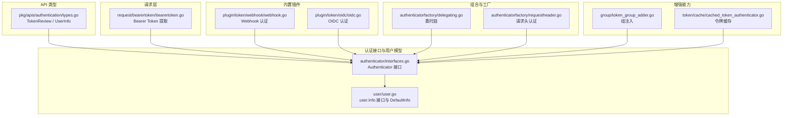
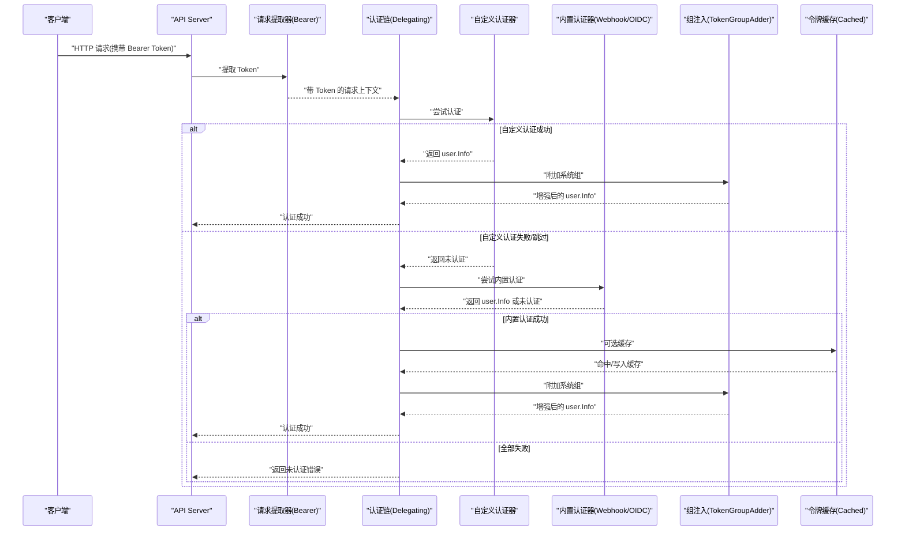
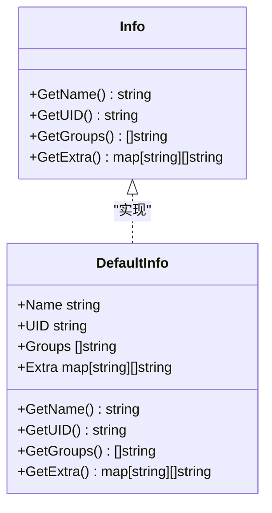
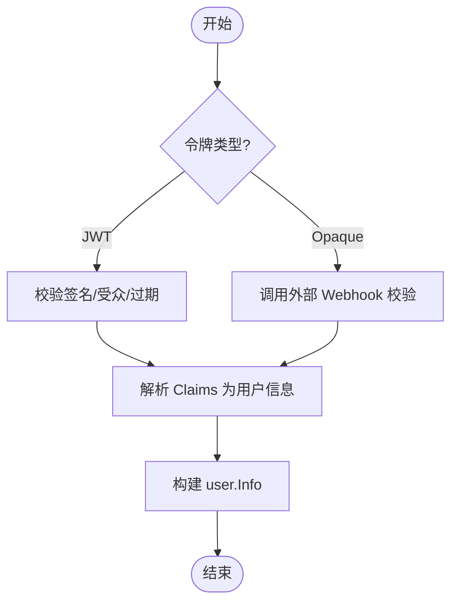
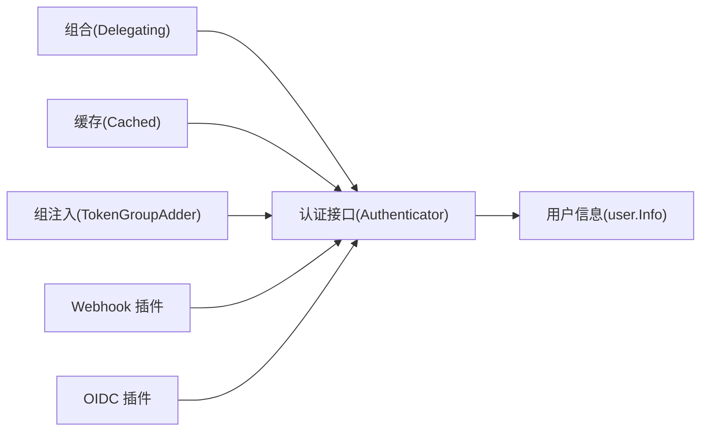

# 自定义认证开发

<cite>
**本文引用的文件**   
- [types.go](file://pkg/apis/authentication/types.go)
- [user.go](file://staging/src/k8s.io/apiserver/pkg/authentication/user/user.go)
- [interfaces.go](file://staging/src/k8s.io/apiserver/pkg/authentication/authenticator/interfaces.go)
- [audiences.go](file://staging/src/k8s.io/apiserver/pkg/authentication/authenticator/audiences.go)
- [bearertoken.go](file://staging/src/k8s.io/apiserver/pkg/authentication/request/bearertoken/bearertoken.go)
- [webhook.go](file://staging/src/k8s.io/apiserver/plugin/pkg/authenticator/token/webhook/webhook.go)
- [oidc.go](file://staging/src/k8s.io/apiserver/plugin/pkg/authenticator/token/oidc/oidc.go)
- [delegating.go](file://staging/src/k8s.io/apiserver/pkg/authentication/authenticatorfactory/delegating.go)
- [requestheader.go](file://staging/src/k8s.io/apiserver/pkg/authentication/authenticatorfactory/requestheader.go)
- [token_group_adder.go](file://staging/src/k8s.io/apiserver/pkg/authentication/group/token_group_adder.go)
- [cached_token_authenticator.go](file://staging/src/k8s.io/apiserver/pkg/authentication/token/cache/cached_token_authenticator.go)
</cite>

## 目录
1. [简介](#简介)
2. [项目结构](#项目结构)
3. [核心组件](#核心组件)
4. [架构总览](#架构总览)
5. [详细组件分析](#详细组件分析)
6. [依赖关系分析](#依赖关系分析)
7. [性能考虑](#性能考虑)
8. [故障排查指南](#故障排查指南)
9. [结论](#结论)
10. [附录](#附录)

## 简介
本文件面向需要在 Kubernetes API Server 中实现“自定义认证插件”的开发者，系统阐述认证插件的开发框架、接口规范与最佳实践。重点包括：
- Authenticator 接口的实现要求与生命周期约定
- 身份验证逻辑编写方法（令牌校验、用户信息获取、权限检查前置）
- 用户信息对象构建与属性映射规则
- 从项目结构到部署配置的完整示例流程
- 测试方法、调试技巧与性能优化建议
- 插件的生命周期管理与错误处理机制

## 项目结构
Kubernetes 将认证相关能力分层组织在 apiserver 子模块中，核心位置如下：
- 认证接口定义：staging/src/k8s.io/apiserver/pkg/authentication/authenticator/interfaces.go
- 用户信息模型：staging/src/k8s.io/apiserver/pkg/authentication/user/user.go
- 请求层提取器：staging/src/k8s.io/apiserver/pkg/authentication/request/bearertoken/bearertoken.go
- 内置插件示例：Webhook、OIDC 等位于 staging/src/k8s.io/apiserver/plugin/pkg/authenticator/...
- 组合与工厂：Delegating、RequestHeader 等位于 staging/src/k8s.io/apiserver/pkg/authentication/authenticatorfactory/...
- 组注入与缓存：group/token_group_adder.go、token/cache/cached_token_authenticator.go
- API 类型（TokenReview/UserInfo 等）：pkg/apis/authentication/types.go

图表来源
- [interfaces.go](file://staging/src/k8s.io/apiserver/pkg/authentication/authenticator/interfaces.go)
- [user.go](file://staging/src/k8s.io/apiserver/pkg/authentication/user/user.go)
- [bearertoken.go](file://staging/src/k8s.io/apiserver/pkg/authentication/request/bearertoken/bearertoken.go)
- [webhook.go](file://staging/src/k8s.io/apiserver/plugin/pkg/authenticator/token/webhook/webhook.go)
- [oidc.go](file://staging/src/k8s.io/apiserver/plugin/pkg/authenticator/token/oidc/oidc.go)
- [delegating.go](file://staging/src/k8s.io/apiserver/pkg/authentication/authenticatorfactory/delegating.go)
- [requestheader.go](file://staging/src/k8s.io/apiserver/pkg/authentication/authenticatorfactory/requestheader.go)
- [token_group_adder.go](file://staging/src/k8s.io/apiserver/pkg/authentication/group/token_group_adder.go)
- [cached_token_authenticator.go](file://staging/src/k8s.io/apiserver/pkg/authentication/token/cache/cached_token_authenticator.go)
- [types.go](file://pkg/apis/authentication/types.go)

章节来源
- [interfaces.go](file://staging/src/k8s.io/apiserver/pkg/authentication/authenticator/interfaces.go)
- [user.go](file://staging/src/k8s.io/apiserver/pkg/authentication/user/user.go)
- [bearertoken.go](file://staging/src/k8s.io/apiserver/pkg/authentication/request/bearertoken/bearertoken.go)
- [webhook.go](file://staging/src/k8s.io/apiserver/plugin/pkg/authenticator/token/webhook/webhook.go)
- [oidc.go](file://staging/src/k8s.io/apiserver/plugin/pkg/authenticator/token/oidc/oidc.go)
- [delegating.go](file://staging/src/k8s.io/apiserver/pkg/authentication/authenticatorfactory/delegating.go)
- [requestheader.go](file://staging/src/k8s.io/apiserver/pkg/authentication/authenticatorfactory/requestheader.go)
- [token_group_adder.go](file://staging/src/k8s.io/apiserver/pkg/authentication/group/token_group_adder.go)
- [cached_token_authenticator.go](file://staging/src/k8s.io/apiserver/pkg/authentication/token/cache/cached_token_authenticator.go)
- [types.go](file://pkg/apis/authentication/types.go)

## 核心组件
- 认证接口（Authenticator）
  - 提供统一的认证入口，接收请求上下文并返回用户信息与可能的错误。
  - 典型方法签名约定：根据接口定义，返回 user.Info 或错误；若无法认证则返回 nil 与错误，或由上层链式处理。
- 用户信息（user.Info）
  - 包含用户名、UID、分组、扩展字段等，用于后续授权与审计。
  - 提供默认实现 DefaultInfo，便于快速构造。
- 请求层提取器（Bearer Token）
  - 负责从 HTTP 请求中提取 Bearer Token，供上游认证器使用。
- 内置认证插件
  - Webhook：通过外部服务进行令牌校验与用户信息解析。
  - OIDC：基于 OpenID Connect 协议对 JWT 进行校验与用户信息解析。
- 组合与工厂
  - Delegating：将多个认证器串联为链，按顺序尝试认证。
  - RequestHeader：基于可信上游的请求头进行认证。
- 增强能力
  - 组注入：根据令牌内容自动添加系统组。
  - 令牌缓存：对高延迟的外部认证结果进行缓存，降低认证时延。

章节来源
- [interfaces.go](file://staging/src/k8s.io/apiserver/pkg/authentication/authenticator/interfaces.go)
- [user.go](file://staging/src/k8s.io/apiserver/pkg/authentication/user/user.go)
- [bearertoken.go](file://staging/src/k8s.io/apiserver/pkg/authentication/request/bearertoken/bearertoken.go)
- [webhook.go](file://staging/src/k8s.io/apiserver/plugin/pkg/authenticator/token/webhook/webhook.go)
- [oidc.go](file://staging/src/k8s.io/apiserver/plugin/pkg/authenticator/token/oidc/oidc.go)
- [delegating.go](file://staging/src/k8s.io/apiserver/pkg/authentication/authenticatorfactory/delegating.go)
- [requestheader.go](file://staging/src/k8s.io/apiserver/pkg/authentication/authenticatorfactory/requestheader.go)
- [token_group_adder.go](file://staging/src/k8s.io/apiserver/pkg/authentication/group/token_group_adder.go)
- [cached_token_authenticator.go](file://staging/src/k8s.io/apiserver/pkg/authentication/token/cache/cached_token_authenticator.go)

## 架构总览
下图展示了 API Server 请求进入后，认证链的典型调用路径与数据流向。

图表来源
- [bearertoken.go](file://staging/src/k8s.io/apiserver/pkg/authentication/request/bearertoken/bearertoken.go)
- [delegating.go](file://staging/src/k8s.io/apiserver/pkg/authentication/authenticatorfactory/delegating.go)
- [webhook.go](file://staging/src/k8s.io/apiserver/plugin/pkg/authenticator/token/webhook/webhook.go)
- [oidc.go](file://staging/src/k8s.io/apiserver/plugin/pkg/authenticator/token/oidc/oidc.go)
- [token_group_adder.go](file://staging/src/k8s.io/apiserver/pkg/authentication/group/token_group_adder.go)
- [cached_token_authenticator.go](file://staging/src/k8s.io/apiserver/pkg/authentication/token/cache/cached_token_authenticator.go)

## 详细组件分析

### 认证接口与实现要求（Authenticator）
- 接口职责
  - 接收请求上下文，完成身份识别与校验，返回用户信息与错误。
  - 若无法认证，应返回明确的“未认证”语义，以便链式下一个认证器继续尝试。
- 返回值约定
  - 成功：返回非空的 user.Info 与 nil 错误。
  - 失败：返回 nil 与错误，或返回“未认证”信号（由具体实现与链式策略决定）。
- 并发与状态
  - 认证器应为无状态或线程安全设计，避免共享可变状态。
  - 如需持久化配置，应在初始化阶段加载并在运行时只读访问。
- 审计与指标
  - 建议在关键路径记录必要指标（如认证耗时、失败原因），便于排障与容量规划。

章节来源
- [interfaces.go](file://staging/src/k8s.io/apiserver/pkg/authentication/authenticator/interfaces.go)

### 用户信息对象构建与属性映射
- 必需字段
  - 用户名：唯一标识当前会话主体。
  - UID：跨时间稳定的用户标识，删除重建后应变化。
  - 分组：用户所属组列表，影响授权决策。
  - 扩展字段：键值对，用于传递额外上下文（如 scopes、租户信息等）。
- 映射规则
  - 扩展字段键名需小写，确保在模拟身份流程中可正确往返。
  - 键名建议使用命名空间前缀，避免冲突。
- 常用实现
  - 使用 DefaultInfo 快速构造用户信息对象。

图表来源
- [user.go](file://staging/src/k8s.io/apiserver/pkg/authentication/user/user.go)

章节来源
- [user.go](file://staging/src/k8s.io/apiserver/pkg/authentication/user/user.go)

### 令牌验证与受众（Audience）
- 受众校验
  - 当令牌包含受众信息时，认证器需校验目标受众是否匹配，防止令牌被误用。
- 常见场景
  - 多受众令牌：仅允许在匹配的受众范围内被接受。
  - 缺失受众：按默认受众策略处理（例如 API Server 自身受众）。

章节来源
- [audiences.go](file://staging/src/k8s.io/apiserver/pkg/authentication/authenticator/audiences.go)

### 请求层提取（Bearer Token）
- 职责
  - 从 HTTP 请求头中提取 Bearer Token，封装为认证器可用的上下文。
- 注意事项
  - 空 Token 时应交由后续认证器或匿名处理器处理。
  - 非法格式应尽早拒绝，减少下游开销。

章节来源
- [bearertoken.go](file://staging/src/k8s.io/apiserver/pkg/authentication/request/bearertoken/bearertoken.go)

### 内置认证插件参考（Webhook 与 OIDC）
- Webhook 认证
  - 通过外部服务进行令牌校验与用户信息解析，适合企业统一鉴权中心集成。
  - 支持证书管理、重试与超时控制。
- OIDC 认证
  - 基于标准 OIDC 协议，对 JWT 进行签名校验、受众与过期时间检查，并解析用户信息。
  - 支持动态发现元数据与公钥轮换。

图表来源
- [webhook.go](file://staging/src/k8s.io/apiserver/plugin/pkg/authenticator/token/webhook/webhook.go)
- [oidc.go](file://staging/src/k8s.io/apiserver/plugin/pkg/authenticator/token/oidc/oidc.go)

章节来源
- [webhook.go](file://staging/src/k8s.io/apiserver/plugin/pkg/authenticator/token/webhook/webhook.go)
- [oidc.go](file://staging/src/k8s.io/apiserver/plugin/pkg/authenticator/token/oidc/oidc.go)

### 组合与工厂（Delegating 与 RequestHeader）
- Delegating 认证链
  - 将多个认证器按顺序组合，依次尝试直至成功或全部失败。
  - 适合混合多种认证方式（如先内部再外部）。
- RequestHeader 认证
  - 基于可信上游（如网关）设置的请求头进行认证，适用于代理模式。

章节来源
- [delegating.go](file://staging/src/k8s.io/apiserver/pkg/authentication/authenticatorfactory/delegating.go)
- [requestheader.go](file://staging/src/k8s.io/apiserver/pkg/authentication/authenticatorfactory/requestheader.go)

### 组注入与令牌缓存
- 组注入（TokenGroupAdder）
  - 根据令牌内容自动添加系统组（如 system:authenticated），简化授权策略。
- 令牌缓存（CachedTokenAuthenticator）
  - 对高延迟的外部认证结果进行缓存，显著降低认证时延与后端压力。

章节来源
- [token_group_adder.go](file://staging/src/k8s.io/apiserver/pkg/authentication/group/token_group_adder.go)
- [cached_token_authenticator.go](file://staging/src/k8s.io/apiserver/pkg/authentication/token/cache/cached_token_authenticator.go)

### 自定义认证插件开发示例（端到端）
以下给出一个完整的自定义认证插件开发流程，涵盖项目结构、实现要点、部署与测试。

- 项目结构建议
  - pkg/auth/customauth：自定义认证器实现
  - cmd/custom-auth-server：独立服务端（可选，用于 Webhook 模式）
  - deploy：部署清单（ConfigMap、Service、Ingress 等）
  - test：单元测试与集成测试
- 实现要点
  - 实现 Authenticator 接口，完成令牌校验与用户信息构建。
  - 遵循受众校验与错误语义约定，保证与链式认证兼容。
  - 使用 DefaultInfo 构造用户信息，注意扩展字段键名小写与命名空间前缀。
  - 可选：接入令牌缓存与组注入以提升性能与一致性。
- 部署配置
  - 将自定义认证器以 Webhook 形式暴露，或在 API Server 启动参数中直接注册。
  - 配置超时、重试、TLS 证书与受众白名单。
- 测试方法
  - 单元测试：覆盖合法/非法令牌、受众不匹配、网络异常等分支。
  - 集成测试：结合本地集群与真实请求链路，验证端到端行为。
- 调试技巧
  - 开启详细日志与指标采集，关注认证耗时与失败原因分布。
  - 使用抓包工具核对请求头与响应体，确认令牌传输与解析无误。
- 性能优化建议
  - 启用令牌缓存，合理设置 TTL 与分区策略。
  - 对后端调用增加连接池与超时控制，避免雪崩。
  - 批量组注入与预计算用户属性，减少重复计算。

章节来源
- [interfaces.go](file://staging/src/k8s.io/apiserver/pkg/authentication/authenticator/interfaces.go)
- [user.go](file://staging/src/k8s.io/apiserver/pkg/authentication/user/user.go)
- [audiences.go](file://staging/src/k8s.io/apiserver/pkg/authentication/authenticator/audiences.go)
- [cached_token_authenticator.go](file://staging/src/k8s.io/apiserver/pkg/authentication/token/cache/cached_token_authenticator.go)
- [token_group_adder.go](file://staging/src/k8s.io/apiserver/pkg/authentication/group/token_group_adder.go)

## 依赖关系分析
- 组件耦合
  - 认证器对用户信息模型强依赖，但彼此之间松耦合，通过接口解耦。
  - 组合器（Delegating）与增强器（组注入、缓存）作为横切能力，提升可扩展性。
- 外部依赖
  - Webhook 依赖外部服务可用性；OIDC 依赖远端元数据与公钥。
- 潜在循环依赖
  - 保持认证器无状态且仅依赖接口，避免循环引用。

图表来源
- [interfaces.go](file://staging/src/k8s.io/apiserver/pkg/authentication/authenticator/interfaces.go)
- [user.go](file://staging/src/k8s.io/apiserver/pkg/authentication/user/user.go)
- [delegating.go](file://staging/src/k8s.io/apiserver/pkg/authentication/authenticatorfactory/delegating.go)
- [cached_token_authenticator.go](file://staging/src/k8s.io/apiserver/pkg/authentication/token/cache/cached_token_authenticator.go)
- [token_group_adder.go](file://staging/src/k8s.io/apiserver/pkg/authentication/group/token_group_adder.go)
- [webhook.go](file://staging/src/k8s.io/apiserver/plugin/pkg/authenticator/token/webhook/webhook.go)
- [oidc.go](file://staging/src/k8s.io/apiserver/plugin/pkg/authenticator/token/oidc/oidc.go)

章节来源
- [interfaces.go](file://staging/src/k8s.io/apiserver/pkg/authentication/authenticator/interfaces.go)
- [user.go](file://staging/src/k8s.io/apiserver/pkg/authentication/user/user.go)
- [delegating.go](file://staging/src/k8s.io/apiserver/pkg/authentication/authenticatorfactory/delegating.go)
- [cached_token_authenticator.go](file://staging/src/k8s.io/apiserver/pkg/authentication/token/cache/cached_token_authenticator.go)
- [token_group_adder.go](file://staging/src/k8s.io/apiserver/pkg/authentication/group/token_group_adder.go)
- [webhook.go](file://staging/src/k8s.io/apiserver/plugin/pkg/authenticator/token/webhook/webhook.go)
- [oidc.go](file://staging/src/k8s.io/apiserver/plugin/pkg/authenticator/token/oidc/oidc.go)

## 性能考虑
- 缓存策略
  - 对高延迟外部认证结果进行缓存，采用分片与 TTL 控制，平衡一致性与性能。
- 超时与重试
  - 为外部调用设置合理的超时与最大重试次数，避免级联失败。
- 资源隔离
  - 将认证器运行在独立进程或服务中，限制 CPU/内存配额，防止影响 API Server 主流程。
- 指标与观测
  - 采集认证成功率、P95/P99 延迟、错误码分布，建立告警阈值。

[本节为通用指导，无需特定文件来源]

## 故障排查指南
- 常见问题定位
  - 令牌格式错误：检查请求头与提取器输出。
  - 受众不匹配：确认令牌受众与期望受众交集。
  - 外部服务不可用：检查网络连通性、证书与超时配置。
  - 组注入异常：核对组映射规则与系统组常量。
- 诊断手段
  - 启用详细日志与指标，抓取认证链路各节点耗时。
  - 使用最小化用例复现问题，逐步缩小范围。
  - 对比内置插件（Webhook/OIDC）行为，定位差异点。

章节来源
- [bearertoken.go](file://staging/src/k8s.io/apiserver/pkg/authentication/request/bearertoken/bearertoken.go)
- [audiences.go](file://staging/src/k8s.io/apiserver/pkg/authentication/authenticator/audiences.go)
- [webhook.go](file://staging/src/k8s.io/apiserver/plugin/pkg/authenticator/token/webhook/webhook.go)
- [oidc.go](file://staging/src/k8s.io/apiserver/plugin/pkg/authenticator/token/oidc/oidc.go)
- [token_group_adder.go](file://staging/src/k8s.io/apiserver/pkg/authentication/group/token_group_adder.go)

## 结论
通过实现标准的 Authenticator 接口并结合组合器、组注入与缓存等增强能力，可以灵活地构建与企业现有身份体系集成的自定义认证插件。遵循受众校验、错误语义与用户信息映射规则，配合完善的测试与观测体系，可在保障安全性的同时获得良好的性能与可维护性。

[本节为总结性内容，无需特定文件来源]

## 附录
- API 类型参考
  - TokenReview、UserInfo 等类型定义位于 pkg/apis/authentication/types.go，可用于 TokenReview API 的集成与测试。

章节来源
- [types.go](file://pkg/apis/authentication/types.go)