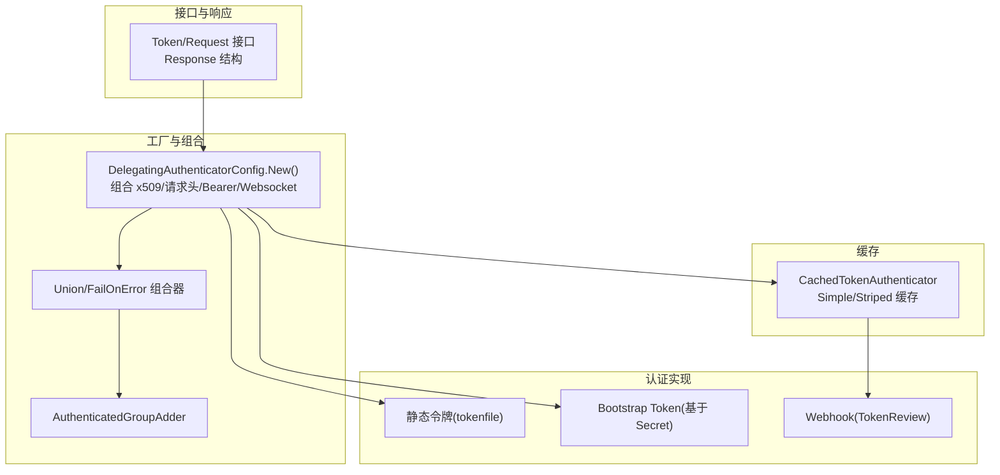
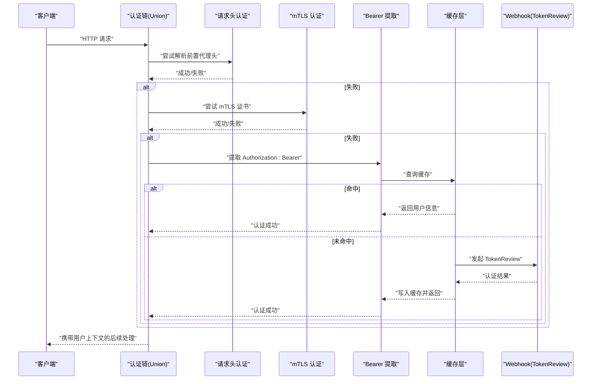
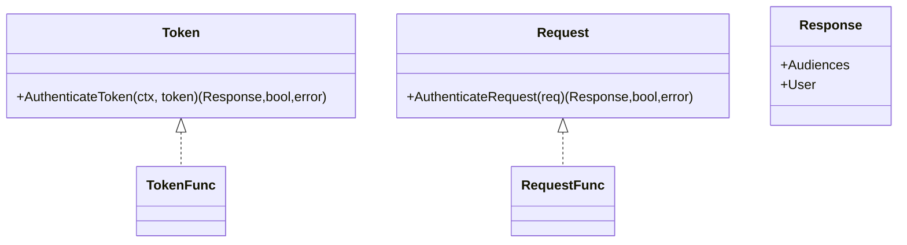
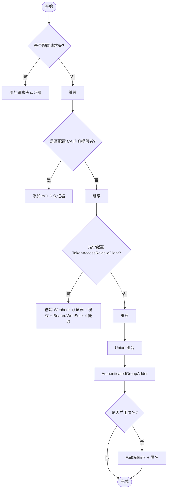
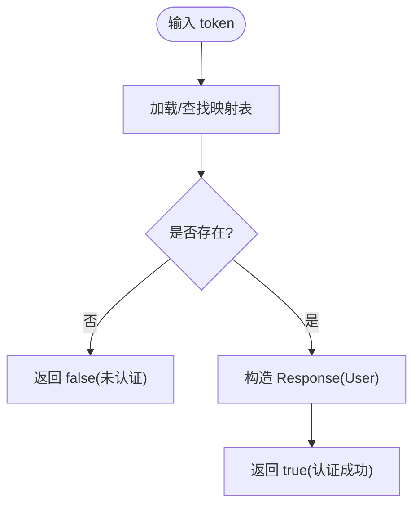
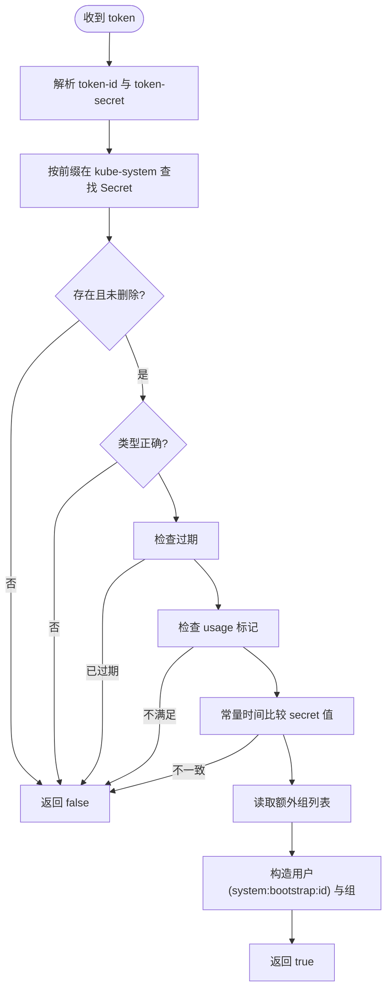
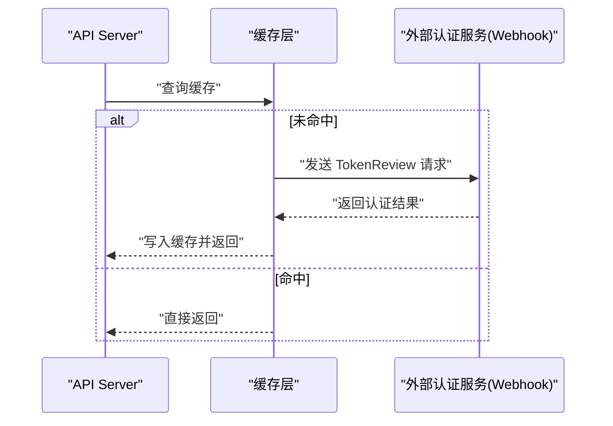
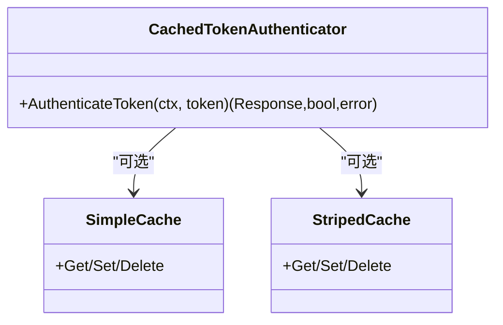
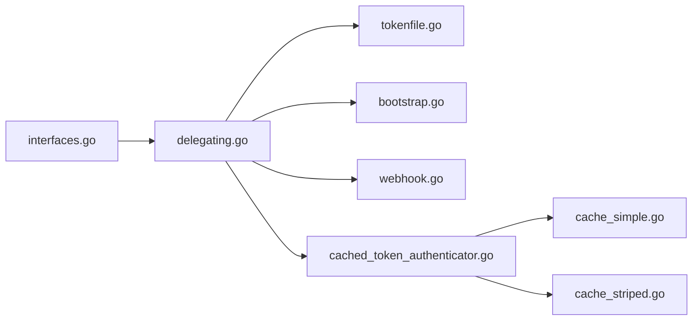

# 认证插件

<cite>
**本文引用的文件**   
- [interfaces.go](file://staging/src/k8s.io/apiserver/pkg/authentication/authenticator/interfaces.go)
- [delegating.go](file://staging/src/k8s.io/apiserver/pkg/authentication/authenticatorfactory/delegating.go)
- [tokenfile.go](file://staging/src/k8s.io/apiserver/pkg/authentication/token/tokenfile/tokenfile.go)
- [bootstrap.go](file://plugin/pkg/auth/authenticator/token/bootstrap/bootstrap.go)
- [cached_token_authenticator.go](file://staging/src/k8s.io/apiserver/pkg/authentication/token/cache/cached_token_authenticator.go)
- [cache_simple.go](file://staging/src/k8s.io/apiserver/pkg/authentication/token/cache/cache_simple.go)
- [cache_striped.go](file://staging/src/k8s.io/apiserver/pkg/authentication/token/cache/cache_striped.go)
- [webhook.go](file://staging/src/k8s.io/apiserver/plugin/pkg/authenticator/token/webhook/webhook.go)
</cite>

## 目录
1. [简介](#简介)
2. [项目结构](#项目结构)
3. [核心组件](#核心组件)
4. [架构总览](#架构总览)
5. [详细组件分析](#详细组件分析)
6. [依赖关系分析](#依赖关系分析)
7. [性能考虑](#性能考虑)
8. [故障排查指南](#故障排查指南)
9. [结论](#结论)
10. [附录](#附录)

## 简介
本文件面向 Kubernetes 控制面中的“认证插件”体系，围绕 TokenReview 开发模式、内置认证后端（静态令牌、Bootstrap Token、Webhook）、外部认证系统集成方式（LDAP/OAuth2/OIDC/SAML 等通过 Webhook 集成）、自定义认证插件开发、配置与生命周期管理、审计与安全、以及性能优化进行系统化说明。文档以源码为依据，提供架构图、时序图与流程图，帮助读者快速理解并扩展认证能力。

## 项目结构
Kubernetes 的认证能力由“接口定义 + 工厂装配 + 多种实现 + 缓存/组合器”构成：
- 接口层：定义 Token/Request 抽象与 Response 数据结构
- 工厂层：将多种认证器按策略组装为 Request 级联链
- 实现层：静态令牌、Bootstrap Token、Webhook 等
- 缓存层：对底层认证结果做 TTL 缓存
- 组合层：Union/FailOnError 等组合器，匿名访问处理

图表来源
- [interfaces.go:26-66](file://staging/src/k8s.io/apiserver/pkg/authentication/authenticator/interfaces.go#L26-L66)
- [delegating.go:69-129](file://staging/src/k8s.io/apiserver/pkg/authentication/authenticatorfactory/delegating.go#L69-L129)
- [tokenfile.go:32-100](file://staging/src/k8s.io/apiserver/pkg/authentication/token/tokenfile/tokenfile.go#L32-L100)
- [bootstrap.go:44-152](file://plugin/pkg/auth/authenticator/token/bootstrap/bootstrap.go#L44-L152)
- [cached_token_authenticator.go](file://staging/src/k8s.io/apiserver/pkg/authentication/token/cache/cached_token_authenticator.go)
- [cache_simple.go](file://staging/src/k8s.io/apiserver/pkg/authentication/token/cache/cache_simple.go)
- [cache_striped.go](file://staging/src/k8s.io/apiserver/pkg/authentication/token/cache/cache_striped.go)
- [webhook.go](file://staging/src/k8s.io/apiserver/plugin/pkg/authenticator/token/webhook/webhook.go)

章节来源
- [interfaces.go:26-66](file://staging/src/k8s.io/apiserver/pkg/authentication/authenticator/interfaces.go#L26-L66)
- [delegating.go:69-129](file://staging/src/k8s.io/apiserver/pkg/authentication/authenticatorfactory/delegating.go#L69-L129)

## 核心组件
- 认证接口与响应
  - Token 接口：针对字符串令牌进行认证
  - Request 接口：从 HTTP 请求中提取认证信息
  - Response：包含用户信息与受众集合
- 工厂装配
  - DelegatingAuthenticatorConfig.New()：根据配置构建认证链，支持请求头、mTLS、Bearer Token、WebSocket 协议内令牌，并可启用匿名访问兜底
- 内置认证实现
  - 静态令牌：从内存或 CSV 文件加载 token->user 映射
  - Bootstrap Token：校验 kube-system 命名空间下的特定 Secret，生成 system:bootstrappers 组与系统用户名
  - Webhook：调用 TokenReview API 委托远端认证服务
- 缓存
  - CachedTokenAuthenticator：对底层 Token 认证结果进行 TTL 缓存，内部使用 Simple 或 Striped 两种策略

章节来源
- [interfaces.go:26-66](file://staging/src/k8s.io/apiserver/pkg/authentication/authenticator/interfaces.go#L26-L66)
- [delegating.go:69-129](file://staging/src/k8s.io/apiserver/pkg/authentication/authenticatorfactory/delegating.go#L69-L129)
- [tokenfile.go:32-100](file://staging/src/k8s.io/apiserver/pkg/authentication/token/tokenfile/tokenfile.go#L32-L100)
- [bootstrap.go:44-152](file://plugin/pkg/auth/authenticator/token/bootstrap/bootstrap.go#L44-L152)
- [cached_token_authenticator.go](file://staging/src/k8s.io/apiserver/pkg/authentication/token/cache/cached_token_authenticator.go)
- [cache_simple.go](file://staging/src/k8s.io/apiserver/pkg/authentication/token/cache/cache_simple.go)
- [cache_striped.go](file://staging/src/k8s.io/apiserver/pkg/authentication/token/cache/cache_striped.go)

## 架构总览
下图展示一次 Bearer Token 认证的端到端流程：请求进入后，依次尝试请求头、mTLS、Bearer Token；Bearer Token 路径经缓存层命中则直接返回，未命中则转发至 Webhook 执行 TokenReview，最终返回用户上下文。

图表来源
- [delegating.go:69-129](file://staging/src/k8s.io/apiserver/pkg/authentication/authenticatorfactory/delegating.go#L69-L129)
- [cached_token_authenticator.go](file://staging/src/k8s.io/apiserver/pkg/authentication/token/cache/cached_token_authenticator.go)
- [webhook.go](file://staging/src/k8s.io/apiserver/plugin/pkg/authenticator/token/webhook/webhook.go)

## 详细组件分析

### 接口与响应模型
- Token 接口：AuthenticateToken(ctx, token) -> (Response, bool, error)
- Request 接口：AuthenticateRequest(req) -> (Response, bool, error)
- Response：包含 Audiences 与 User 信息

图表来源
- [interfaces.go:26-66](file://staging/src/k8s.io/apiserver/pkg/authentication/authenticator/interfaces.go#L26-L66)

章节来源
- [interfaces.go:26-66](file://staging/src/k8s.io/apiserver/pkg/authentication/authenticator/interfaces.go#L26-L66)

### 工厂装配与组合策略
- 顺序策略：请求头 -> mTLS -> Bearer/WebSocket
- 组合器：Union 短路匹配，FailOnError 保证错误传播
- 匿名访问：可配置条件式匿名兜底
- 安全定义：自动注入 OpenAPI 的 BearerToken 安全方案

图表来源
- [delegating.go:69-129](file://staging/src/k8s.io/apiserver/pkg/authentication/authenticatorfactory/delegating.go#L69-L129)

章节来源
- [delegating.go:69-129](file://staging/src/k8s.io/apiserver/pkg/authentication/authenticatorfactory/delegating.go#L69-L129)

### 静态令牌认证（CSV/内存）
- 数据源：内存 map 或 CSV 文件（列：token, username, useruid[, groups]）
- 行为：精确匹配 token，返回对应用户对象
- 适用场景：最小化部署、测试环境、离线集群

图表来源
- [tokenfile.go:32-100](file://staging/src/k8s.io/apiserver/pkg/authentication/token/tokenfile/tokenfile.go#L32-L100)

章节来源
- [tokenfile.go:32-100](file://staging/src/k8s.io/apiserver/pkg/authentication/token/tokenfile/tokenfile.go#L32-L100)

### Bootstrap Token 认证
- 数据来源：kube-system 命名空间下类型为 bootstrap.kubernetes.io/token 的 Secret
- 校验要点：名称前缀、类型、过期时间、usage 标记、secret 值对比、id 一致性
- 输出身份：system:bootstrappers 组 + system:bootstrap:(token-id) 用户名

图表来源
- [bootstrap.go:44-152](file://plugin/pkg/auth/authenticator/token/bootstrap/bootstrap.go#L44-L152)

章节来源
- [bootstrap.go:44-152](file://plugin/pkg/auth/authenticator/token/bootstrap/bootstrap.go#L44-L152)

### Webhook 认证（TokenReview）
- 角色定位：作为“外部认证系统”的统一接入点
- 工作流：apiserver 向外部服务发送 TokenReview 请求，外部服务返回认证结果与用户信息
- 典型外部系统：LDAP、OAuth2、OIDC、SAML 等均可通过 Webhook 适配
- 重试与超时：可配置退避与超时，避免雪崩

图表来源
- [delegating.go:92-115](file://staging/src/k8s.io/apiserver/pkg/authentication/authenticatorfactory/delegating.go#L92-L115)
- [webhook.go](file://staging/src/k8s.io/apiserver/plugin/pkg/authenticator/token/webhook/webhook.go)

章节来源
- [delegating.go:92-115](file://staging/src/k8s.io/apiserver/pkg/authentication/authenticatorfactory/delegating.go#L92-L115)
- [webhook.go](file://staging/src/k8s.io/apiserver/plugin/pkg/authenticator/token/webhook/webhook.go)

### 缓存层（TTL）
- 目标：降低 Webhook 调用频率，提升吞吐与稳定性
- 策略：Simple 单实例缓存 / Striped 分片缓存
- 参数：最大条目数、TTL、刷新间隔等

图表来源
- [cached_token_authenticator.go](file://staging/src/k8s.io/apiserver/pkg/authentication/token/cache/cached_token_authenticator.go)
- [cache_simple.go](file://staging/src/k8s.io/apiserver/pkg/authentication/token/cache/cache_simple.go)
- [cache_striped.go](file://staging/src/k8s.io/apiserver/pkg/authentication/token/cache/cache_striped.go)

章节来源
- [cached_token_authenticator.go](file://staging/src/k8s.io/apiserver/pkg/authentication/token/cache/cached_token_authenticator.go)
- [cache_simple.go](file://staging/src/k8s.io/apiserver/pkg/authentication/token/cache/cache_simple.go)
- [cache_striped.go](file://staging/src/k8s.io/apiserver/pkg/authentication/token/cache/cache_striped.go)

## 依赖关系分析
- 耦合度
  - 工厂层对具体实现解耦，通过接口与配置项组合
  - 缓存层对底层 Token 实现透明
- 外部依赖
  - Webhook 依赖外部认证服务可用性
  - Bootstrap Token 依赖 kube-system 命名空间 Secret 的正确性
- 潜在循环
  - 当前结构无循环依赖迹象

图表来源
- [interfaces.go:26-66](file://staging/src/k8s.io/apiserver/pkg/authentication/authenticator/interfaces.go#L26-L66)
- [delegating.go:69-129](file://staging/src/k8s.io/apiserver/pkg/authentication/authenticatorfactory/delegating.go#L69-L129)
- [tokenfile.go:32-100](file://staging/src/k8s.io/apiserver/pkg/authentication/token/tokenfile/tokenfile.go#L32-L100)
- [bootstrap.go:44-152](file://plugin/pkg/auth/authenticator/token/bootstrap/bootstrap.go#L44-L152)
- [cached_token_authenticator.go](file://staging/src/k8s.io/apiserver/pkg/authentication/token/cache/cached_token_authenticator.go)
- [cache_simple.go](file://staging/src/k8s.io/apiserver/pkg/authentication/token/cache/cache_simple.go)
- [cache_striped.go](file://staging/src/k8s.io/apiserver/pkg/authentication/token/cache/cache_striped.go)
- [webhook.go](file://staging/src/k8s.io/apiserver/plugin/pkg/authenticator/token/webhook/webhook.go)

## 性能考虑
- 启用缓存：合理设置 CacheTTL 与最大条目数，优先选择 Striped 缓存以降低锁竞争
- 超时与重试：为 Webhook 配置合理的超时与指数退避，避免级联失败
- 短路径优先：将高频认证路径（如 mTLS、请求头）置于前端，减少下游调用
- 资源隔离：对外部认证服务采用独立连接池与限流策略

[本节为通用指导，无需源码引用]

## 故障排查指南
- 常见症状
  - 大量 401/403：检查各认证器顺序与条件，确认 Bearer Token 是否正确传递
  - 高延迟：关注 Webhook 超时与重试，评估缓存命中率
  - 启动失败：确认是否至少配置一种认证方法
- 定位步骤
  - 查看日志中关于“未找到 Secret”“类型无效”“已过期”“未标记 usage”等提示
  - 核对 CSV 格式与重复 token 告警
  - 验证外部 Webhook 可达性与鉴权凭据
- 修复建议
  - 修正 Secret 字段与命名规范
  - 调整 CacheTTL 与并发参数
  - 增加外部服务的健康检查与熔断

章节来源
- [bootstrap.go:44-152](file://plugin/pkg/auth/authenticator/token/bootstrap/bootstrap.go#L44-L152)
- [tokenfile.go:32-100](file://staging/src/k8s.io/apiserver/pkg/authentication/token/tokenfile/tokenfile.go#L32-L100)
- [delegating.go:117-129](file://staging/src/k8s.io/apiserver/pkg/authentication/authenticatorfactory/delegating.go#L117-L129)

## 结论
Kubernetes 认证插件体系以清晰的接口与灵活的工厂装配为核心，结合缓存与组合器，既满足生产环境的可扩展性与高性能需求，又便于对接各类外部身份源。通过 Webhook 统一接入 LDAP/OAuth2/OIDC/SAML 等系统，配合合理的超时、重试与缓存策略，可在保障安全的同时获得稳定可靠的认证体验。

[本节为总结性内容，无需源码引用]

## 附录

### 开发指南：自定义认证插件
- 实现 Token 接口：在 AuthenticateToken 中完成令牌校验与用户信息构造
- 注册到认证链：通过工厂或组合器将其加入 Union 链
- 用户信息映射：确保 Name、UID、Groups 等字段完整
- 缓存策略：若实现耗时，建议外层包裹缓存层
- 错误处理：区分“未认证(false)”与“错误(error)”语义

章节来源
- [interfaces.go:26-66](file://staging/src/k8s.io/apiserver/pkg/authentication/authenticator/interfaces.go#L26-L66)
- [delegating.go:69-129](file://staging/src/k8s.io/apiserver/pkg/authentication/authenticatorfactory/delegating.go#L69-L129)

### 集成示例：外部认证系统（LDAP/OAuth2/OIDC/SAML）
- 推荐方式：实现 TokenReview Webhook 服务端，接收 apiserver 的请求并返回认证结果
- 关键要素：
  - 安全传输：HTTPS/mTLS
  - 鉴权：签名校验或双向认证
  - 幂等与超时：避免重复校验与长尾请求
  - 审计：记录请求与结果，便于追踪
- 参考入口：Webhook 认证器与 TokenReview 调用路径

章节来源
- [delegating.go:92-115](file://staging/src/k8s.io/apiserver/pkg/authentication/authenticatorfactory/delegating.go#L92-L115)
- [webhook.go](file://staging/src/k8s.io/apiserver/plugin/pkg/authenticator/token/webhook/webhook.go)

### 配置管理与生命周期
- 配置项
  - 请求头认证：CA、允许的前置代理名、头部映射
  - mTLS：CA 内容提供者
  - TokenReview：客户端、超时、重试退避、缓存 TTL
  - 匿名访问：条件开关
- 生命周期
  - 启动时构建认证链
  - 运行期动态更新 CA 内容（若使用动态证书）
  - 优雅关闭：停止新请求，等待进行中请求完成

章节来源
- [delegating.go:69-129](file://staging/src/k8s.io/apiserver/pkg/authentication/authenticatorfactory/delegating.go#L69-L129)