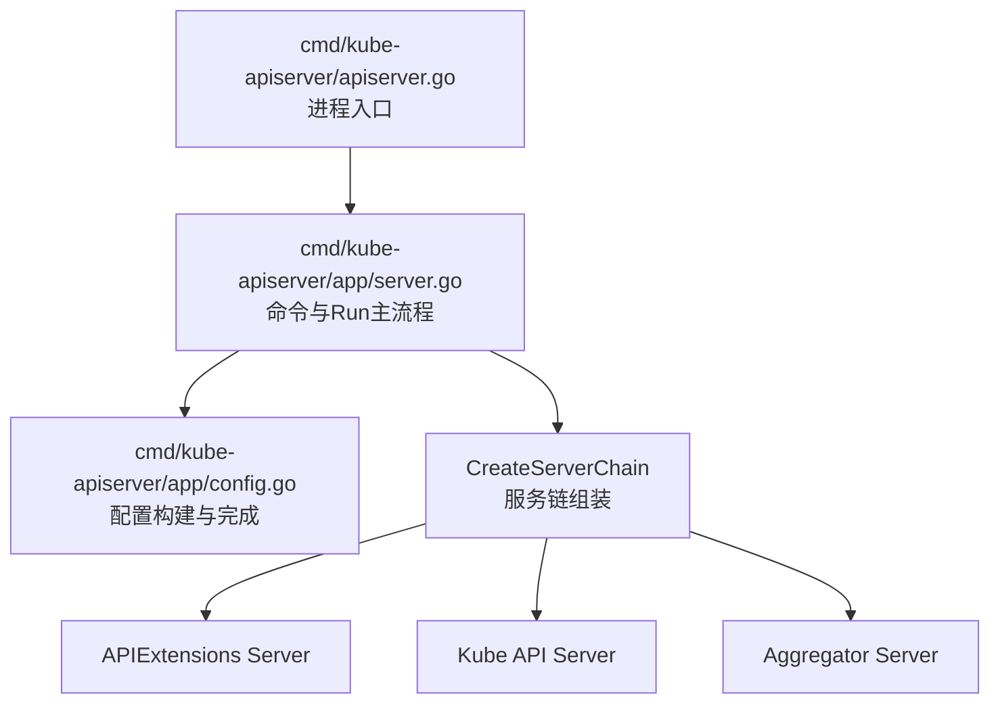
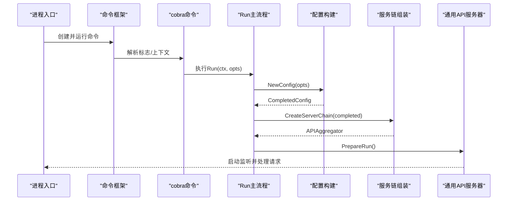
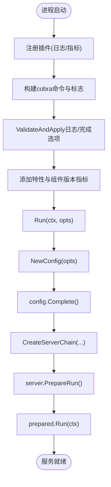
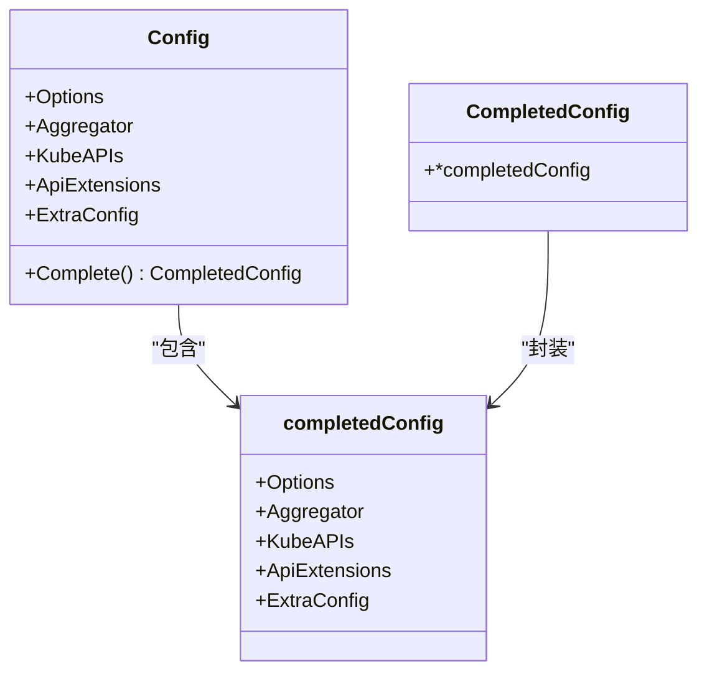
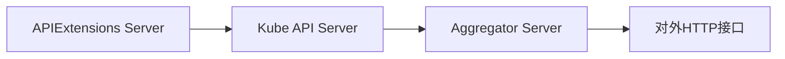
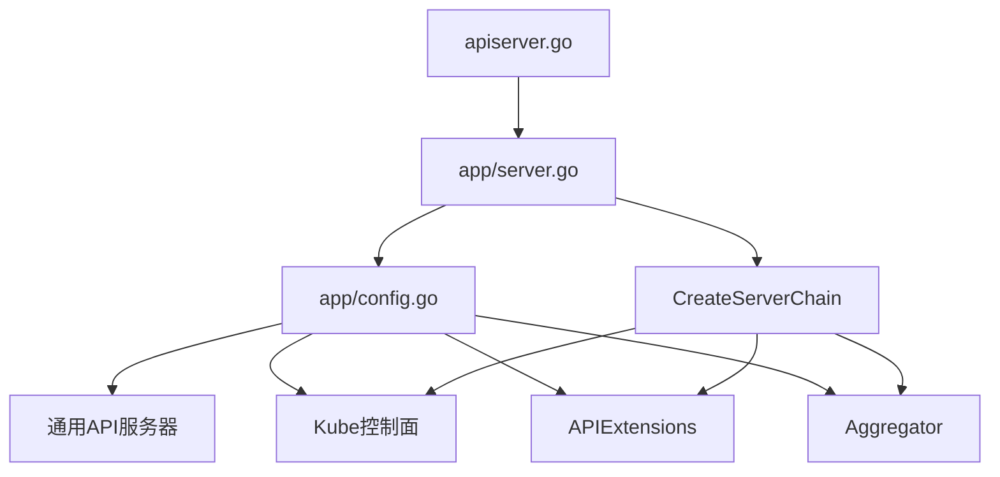

# API服务器详解

<cite>
**本文引用的文件**   
- [cmd/kube-apiserver/apiserver.go](file://cmd/kube-apiserver/apiserver.go)
- [cmd/kube-apiserver/app/server.go](file://cmd/kube-apiserver/app/server.go)
- [cmd/kube-apiserver/app/config.go](file://cmd/kube-apiserver/app/config.go)
</cite>

## 目录
1. [简介](#简介)
2. [项目结构](#项目结构)
3. [核心组件](#核心组件)
4. [架构总览](#架构总览)
5. [详细组件分析](#详细组件分析)
6. [依赖关系分析](#依赖关系分析)
7. [性能考虑](#性能考虑)
8. [故障排查指南](#故障排查指南)
9. [结论](#结论)
10. [附录](#附录)

## 简介
本文件面向Kubernetes API服务器的技术文档，聚焦以下方面：
- REST API处理流程与请求路由机制
- 认证授权中间件链与存储后端抽象层
- API版本管理策略（协商、向后兼容、废弃API）
- 配置选项（安全、性能、高可用）
- 启动流程、组件初始化顺序与依赖关系图
- 监控指标、故障排查与性能优化建议

说明：
- 本文基于仓库中kube-apiserver入口与组装逻辑进行梳理，重点覆盖启动、配置构建、服务链创建等关键路径。
- 对于未在仓库直接体现的实现细节，以概念性说明呈现，避免对具体源码做无依据推断。

## 项目结构
kube-apiserver的入口位于cmd/kube-apiserver，核心由命令行装配、配置构建与服务链创建三部分构成：
- apiserver.go：进程入口，注册必要插件并调用命令框架运行
- app/server.go：命令定义、参数解析、Run主流程、CreateServerChain服务链组装
- app/config.go：NewConfig/Complete，组合通用配置、Kube API Server、APIExtensions与Aggregator

图示来源
- [cmd/kube-apiserver/apiserver.go:32-36](file://cmd/kube-apiserver/apiserver.go#L32-L36)
- [cmd/kube-apiserver/app/server.go:70-146](file://cmd/kube-apiserver/app/server.go#L70-L146)
- [cmd/kube-apiserver/app/server.go:148-182](file://cmd/kube-apiserver/app/server.go#L148-L182)
- [cmd/kube-apiserver/app/server.go:184-206](file://cmd/kube-apiserver/app/server.go#L184-L206)
- [cmd/kube-apiserver/app/config.go:73-110](file://cmd/kube-apiserver/app/config.go#L73-L110)

章节来源
- [cmd/kube-apiserver/apiserver.go:17-36](file://cmd/kube-apiserver/apiserver.go#L17-L36)
- [cmd/kube-apiserver/app/server.go:70-146](file://cmd/kube-apiserver/app/server.go#L70-L146)
- [cmd/kube-apiserver/app/config.go:33-71](file://cmd/kube-apiserver/app/config.go#L33-L71)

## 核心组件
- 进程入口与CLI
  - 负责加载日志JSON格式、Prometheus客户端与版本指标插件，并通过命令框架执行主命令
- 命令与主流程
  - 构建cobra命令、绑定全局与分组标志、打印最终日志配置、完成与校验选项、添加特性门控与组件版本指标，随后进入Run
- Run主流程
  - 记录版本与环境信息；生成Informer名称；构建配置；完成配置；创建服务链；准备运行并启动
- 服务链组装
  - 按“APIExtensions -> Kube API Server -> Aggregator”的顺序串联，提供聚合API能力与CRD支持
- 配置构建
  - 通过BuildGenericConfig构建通用配置、Informers与存储工厂；再分别构造Kube API Server、APIExtensions与Aggregator的配置并完成

章节来源
- [cmd/kube-apiserver/apiserver.go:21-36](file://cmd/kube-apiserver/apiserver.go#L21-L36)
- [cmd/kube-apiserver/app/server.go:70-146](file://cmd/kube-apiserver/app/server.go#L70-L146)
- [cmd/kube-apiserver/app/server.go:148-182](file://cmd/kube-apiserver/app/server.go#L148-L182)
- [cmd/kube-apiserver/app/server.go:184-206](file://cmd/kube-apiserver/app/server.go#L184-L206)
- [cmd/kube-apiserver/app/config.go:73-110](file://cmd/kube-apiserver/app/config.go#L73-L110)

## 架构总览
下图展示了从进程启动到HTTP服务暴露的关键阶段，以及各子服务的协作关系。

图示来源
- [cmd/kube-apiserver/apiserver.go:32-36](file://cmd/kube-apiserver/apiserver.go#L32-L36)
- [cmd/kube-apiserver/app/server.go:70-146](file://cmd/kube-apiserver/app/server.go#L70-L146)
- [cmd/kube-apiserver/app/server.go:148-182](file://cmd/kube-apiserver/app/server.go#L148-L182)
- [cmd/kube-apiserver/app/server.go:184-206](file://cmd/kube-apiserver/app/server.go#L184-L206)
- [cmd/kube-apiserver/app/config.go:73-110](file://cmd/kube-apiserver/app/config.go#L73-L110)

## 详细组件分析

### 启动流程与初始化顺序
- 入口初始化
  - 注册日志JSON输出、Prometheus client-go与版本指标插件
- 命令装配
  - 设置信号上下文、特性门控注册、全局标志与分组标志、帮助与用法函数
- 运行前准备
  - 验证并应用日志配置、打印最终标志、完成与校验选项、添加特性与组件版本指标
- 主流程
  - 记录版本与环境变量；生成Informer名称；构建配置；完成配置；创建服务链；PrepareRun并启动

图示来源
- [cmd/kube-apiserver/apiserver.go:21-36](file://cmd/kube-apiserver/apiserver.go#L21-L36)
- [cmd/kube-apiserver/app/server.go:70-146](file://cmd/kube-apiserver/app/server.go#L70-L146)
- [cmd/kube-apiserver/app/server.go:148-182](file://cmd/kube-apiserver/app/server.go#L148-L182)

章节来源
- [cmd/kube-apiserver/apiserver.go:21-36](file://cmd/kube-apiserver/apiserver.go#L21-L36)
- [cmd/kube-apiserver/app/server.go:70-146](file://cmd/kube-apiserver/app/server.go#L70-L146)
- [cmd/kube-apiserver/app/server.go:148-182](file://cmd/kube-apiserver/app/server.go#L148-L182)

### 配置构建与完成
- NewConfig
  - 构建通用配置（含Scheme、资源开关、OpenAPI定义、Informer工厂、存储工厂）
  - 依次创建Kube API Server配置、APIExtensions配置、Aggregator配置
- Complete
  - 将各子配置转换为Completed状态，供后续使用

图示来源
- [cmd/kube-apiserver/app/config.go:33-71](file://cmd/kube-apiserver/app/config.go#L33-L71)
- [cmd/kube-apiserver/app/config.go:73-110](file://cmd/kube-apiserver/app/config.go#L73-L110)

章节来源
- [cmd/kube-apiserver/app/config.go:33-71](file://cmd/kube-apiserver/app/config.go#L33-L71)
- [cmd/kube-apiserver/app/config.go:73-110](file://cmd/kube-apiserver/app/config.go#L73-L110)

### 服务链组装与职责边界
- APIExtensions Server
  - 提供CRD等扩展API能力，作为内层服务被上层引用
- Kube API Server
  - 核心控制面API集合，依赖APIExtensions提供的CRD能力
- Aggregator Server
  - 聚合外部API组，最后接入链路，统一对外暴露

图示来源
- [cmd/kube-apiserver/app/server.go:184-206](file://cmd/kube-apiserver/app/server.go#L184-L206)

章节来源
- [cmd/kube-apiserver/app/server.go:184-206](file://cmd/kube-apiserver/app/server.go#L184-L206)

### REST API处理流程与请求路由机制（概念性说明）
- 通用API服务器负责：
  - 建立HTTP监听、TLS终止、请求解码与编码
  - 根据Group/Version/Resource匹配REST处理器
  - 注入通用过滤器（如认证、授权、审计、限流、超时等）
  - 调用对应资源的Storage接口实现读写
- 路由关键点：
  - 发现端点（/api、/apis）用于客户端版本协商
  - 资源路径映射到具体的REST Handler
  - 聚合器将特定Group/Version转发至目标服务

[本节为概念性说明，不直接分析具体源码文件]

### 认证授权中间件链（概念性说明）
- 典型顺序（可能因配置而异）：
  - 认证（Token、证书、Webhook等）
  - 授权（RBAC、ABAC等）
  - 准入控制（Admission Webhooks/Plugins）
  - 审计日志
  - 速率限制与配额
- 注意：
  - 具体中间件实例化与顺序由通用API服务器与Kube控制面配置共同决定

[本节为概念性说明，不直接分析具体源码文件]

### 存储后端抽象层（概念性说明）
- 通用API服务器通过StorageFactory抽象不同存储后端（如etcd）
- 每个资源类型绑定对应的REST Storage实现，屏蔽底层差异
- 变更事件通过Informer/Watch机制传播给控制器

[本节为概念性说明，不直接分析具体源码文件]

### API版本管理策略（概念性说明）
- 版本协商：
  - 客户端通过/api与/apis发现可用Group/Version
  - 服务端返回Preferred版本，客户端可显式指定版本
- 向后兼容：
  - 同一Group下多版本并存，内部对象序列化时进行转换
  - 通过资源开关控制启用/禁用特定版本
- 废弃API：
  - 标记Deprecated/Removed，逐步关闭资源开关，配合告警与迁移工具

[本节为概念性说明，不直接分析具体源码文件]

## 依赖关系分析
- 入口依赖
  - 进程入口依赖命令框架与日志/指标插件
- 命令依赖
  - 命令装配依赖通用API服务器、特性门控、日志、标志库
- 配置依赖
  - 配置构建依赖通用API服务器、Kube控制面、APIExtensions与Aggregator
- 服务链依赖
  - APIExtensions -> Kube API Server -> Aggregator

图示来源
- [cmd/kube-apiserver/apiserver.go:21-36](file://cmd/kube-apiserver/apiserver.go#L21-L36)
- [cmd/kube-apiserver/app/server.go:70-146](file://cmd/kube-apiserver/app/server.go#L70-L146)
- [cmd/kube-apiserver/app/config.go:73-110](file://cmd/kube-apiserver/app/config.go#L73-L110)
- [cmd/kube-apiserver/app/server.go:184-206](file://cmd/kube-apiserver/app/server.go#L184-L206)

章节来源
- [cmd/kube-apiserver/apiserver.go:21-36](file://cmd/kube-apiserver/apiserver.go#L21-L36)
- [cmd/kube-apiserver/app/server.go:70-146](file://cmd/kube-apiserver/app/server.go#L70-L146)
- [cmd/kube-apiserver/app/config.go:73-110](file://cmd/kube-apiserver/app/config.go#L73-L110)
- [cmd/kube-apiserver/app/server.go:184-206](file://cmd/kube-apiserver/app/server.go#L184-L206)

## 性能考虑
- 指标采集
  - 入口已加载Prometheus client-go与版本指标插件，便于观测组件版本与运行时指标
- 并发与队列
  - 通用API服务器与工作队列指标已注册，可用于评估吞吐与延迟
- 建议
  - 结合Prometheus/Grafana监控关键指标（请求延迟、错误率、存储读写耗时、认证/授权耗时）
  - 调整并发与队列大小需结合集群规模与负载特征

章节来源
- [cmd/kube-apiserver/apiserver.go:21-36](file://cmd/kube-apiserver/apiserver.go#L21-L36)
- [cmd/kube-apiserver/app/server.go:114-118](file://cmd/kube-apiserver/app/server.go#L114-L118)

## 故障排查指南
- 启动失败
  - 检查日志配置是否生效、标志是否正确、特性门控是否冲突
  - 关注Run前的ValidateAndApply与选项校验错误
- 服务未就绪
  - 确认PrepareRun成功，查看监听端口与TLS配置
- 聚合API不可用
  - 检查Aggregator服务链是否创建成功、ServiceResolver配置与EndpointSlice可用性
- 指标缺失
  - 确认Prometheus插件已加载，抓取端点可达

章节来源
- [cmd/kube-apiserver/app/server.go:70-146](file://cmd/kube-apiserver/app/server.go#L70-L146)
- [cmd/kube-apiserver/app/server.go:148-182](file://cmd/kube-apiserver/app/server.go#L148-L182)
- [cmd/kube-apiserver/app/server.go:184-206](file://cmd/kube-apiserver/app/server.go#L184-L206)
- [cmd/kube-apiserver/apiserver.go:21-36](file://cmd/kube-apiserver/apiserver.go#L21-L36)

## 结论
- kube-apiserver通过清晰的入口、命令装配与配置构建，形成可扩展的服务链（APIExtensions -> Kube API Server -> Aggregator）
- 启动流程强调早期日志与指标注册，便于问题定位与观测
- 版本管理与兼容性由通用API服务器与资源开关协同保障
- 在生产环境中，应结合监控指标与日志进行容量规划与稳定性治理

[本节为总结性内容，不直接分析具体源码文件]

## 附录
- 相关概念
  - 通用API服务器：提供HTTP、鉴权、鉴权、审计、存储抽象等基础能力
  - 控制面：Kubernetes核心API集合与控制器生态
  - APIExtensions：CRD与自定义资源生命周期管理
  - Aggregator：聚合第三方API组，统一对外暴露

[本节为概念性说明，不直接分析具体源码文件]