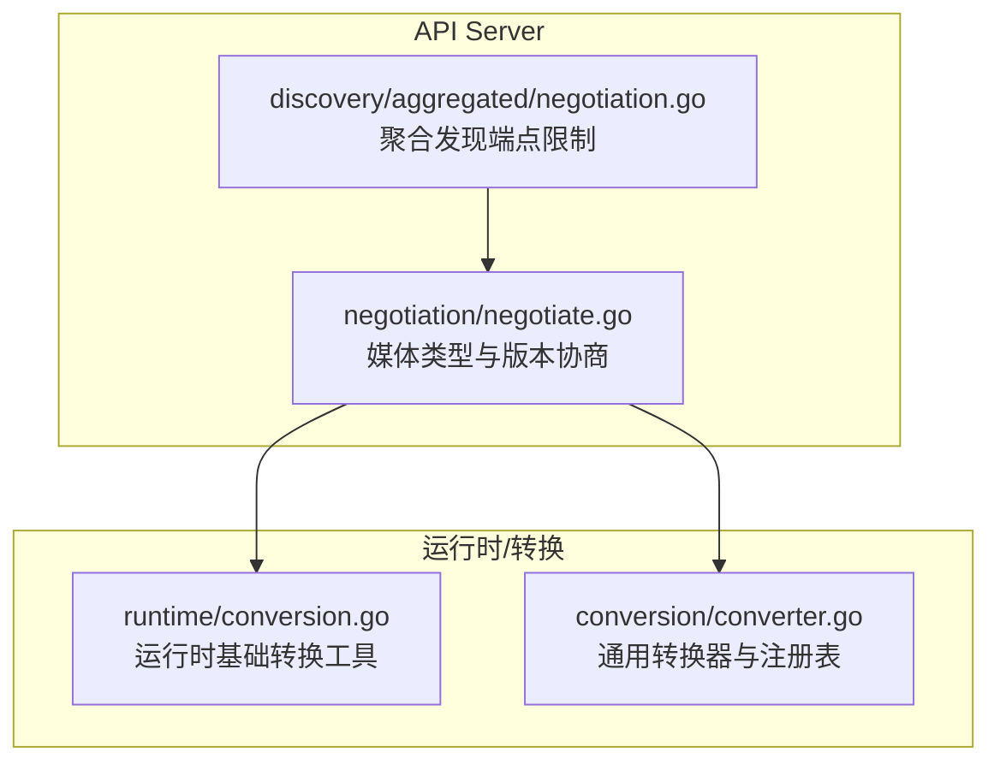
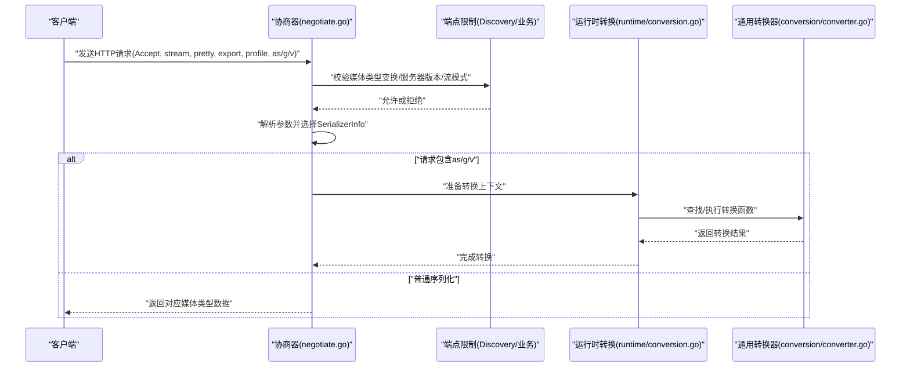
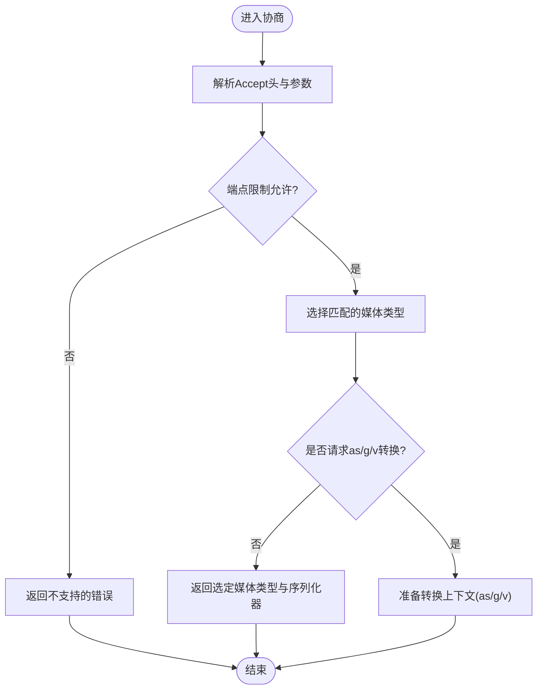
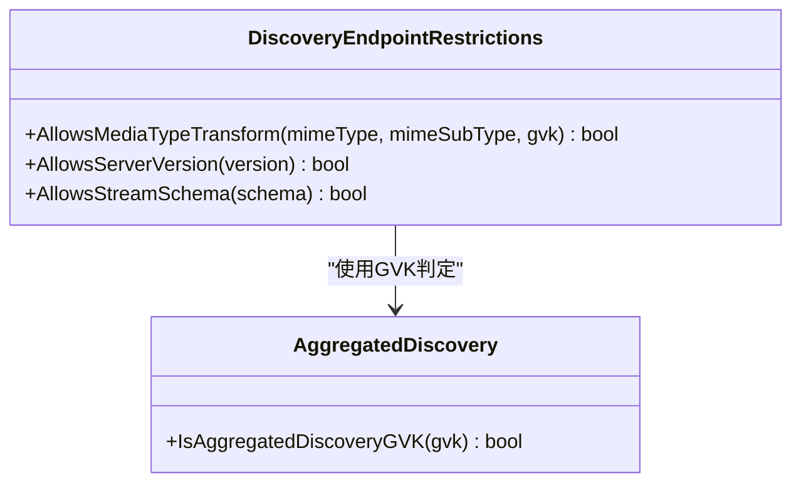
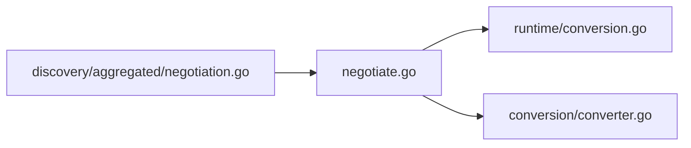
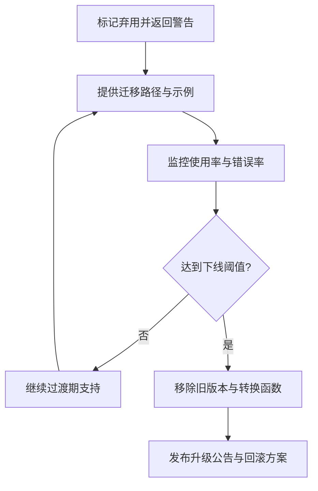

# API版本管理

<cite>
**本文引用的文件**   
- [negotiate.go](file://staging/src/k8s.io/apiserver/pkg/endpoints/handlers/negotiation/negotiate.go)
- [negotiation.go](file://staging/src/k8s.io/apiserver/pkg/endpoints/discovery/aggregated/negotiation.go)
- [conversion.go](file://staging/src/k8s.io/apimachinery/pkg/runtime/conversion.go)
- [converter.go](file://staging/src/k8s.io/apimachinery/pkg/conversion/converter.go)
</cite>

## 目录
1. [简介](#简介)
2. [项目结构](#项目结构)
3. [核心组件](#核心组件)
4. [架构总览](#架构总览)
5. [详细组件分析](#详细组件分析)
6. [依赖关系分析](#依赖关系分析)
7. [性能考虑](#性能考虑)
8. [故障排查指南](#故障排查指南)
9. [结论](#结论)
10. [附录](#附录)

## 简介
本技术文档聚焦Kubernetes API版本管理的实现与最佳实践，围绕以下目标展开：
- 解释API版本协商机制：客户端版本选择、服务器版本支持与向后兼容策略。
- 说明版本转换框架：类型注册、转换函数定义与默认值处理。
- 文档化废弃API的处理流程：弃用警告、迁移路径与最终删除策略。
- 提供自定义API版本的开发指南：新版本创建、旧版本维护与升级策略。
- 给出兼容性测试方法与常见问题解决方案。

## 项目结构
与API版本管理直接相关的代码主要分布在两个子系统中：
- API Server端点协商层：负责根据HTTP请求头与参数进行媒体类型与版本协商，支持流式响应与可选的“as/g/v”对象转换参数。
- 通用运行时/转换层：提供通用的类型转换基础设施（Converter）以及运行时层面的基础转换工具。



图示来源
- [negotiate.go:1-277](file://staging/src/k8s.io/apiserver/pkg/endpoints/handlers/negotiation/negotiate.go#L1-L277)
- [negotiation.go:1-50](file://staging/src/k8s.io/apiserver/pkg/endpoints/discovery/aggregated/negotiation.go#L1-L50)
- [conversion.go:1-184](file://staging/src/k8s.io/apimachinery/pkg/runtime/conversion.go#L1-L184)
- [converter.go:1-226](file://staging/src/k8s.io/apimachinery/pkg/conversion/converter.go#L1-L226)

章节来源
- [negotiate.go:1-277](file://staging/src/k8s.io/apiserver/pkg/endpoints/handlers/negotiation/negotiate.go#L1-L277)
- [negotiation.go:1-50](file://staging/src/k8s.io/apiserver/pkg/endpoints/discovery/aggregated/negotiation.go#L1-L50)
- [conversion.go:1-184](file://staging/src/k8s.io/apimachinery/pkg/runtime/conversion.go#L1-L184)
- [converter.go:1-226](file://staging/src/k8s.io/apimachinery/pkg/conversion/converter.go#L1-L226)

## 核心组件
- 媒体类型与版本协商器
  - 负责解析Accept头、查询参数（如pretty、stream、export、profile），并支持通过as/g/v指定返回对象的Group/Version/Kind以触发服务端转换。
  - 提供EndpointRestrictions接口用于校验是否允许特定媒体类型变换、服务器组版本与流模式。
- 聚合发现端点限制
  - 针对聚合发现端点，限定允许的GVK与媒体类型变换，结合特性开关控制v2beta1/v2的支持范围。
- 运行时转换工具
  - 提供字符串到基本类型的转换、字段选择器默认处理等通用能力。
- 通用转换器
  - 提供无类型转换函数的注册、合并与查找；支持忽略某些类型对转换；为Scheme与上层API版本转换提供底层支撑。

章节来源
- [negotiate.go:122-179](file://staging/src/k8s.io/apiserver/pkg/endpoints/handlers/negotiation/negotiate.go#L122-L179)
- [negotiation.go:28-49](file://staging/src/k8s.io/apiserver/pkg/endpoints/discovery/aggregated/negotiation.go#L28-L49)
- [conversion.go:29-183](file://staging/src/k8s.io/apimachinery/pkg/runtime/conversion.go#L29-L183)
- [converter.go:39-226](file://staging/src/k8s.io/apimachinery/pkg/conversion/converter.go#L39-L226)

## 架构总览
下图展示了从客户端请求到服务端协商与转换的关键路径，包括媒体类型选择、流式协议、可选的对象转换与服务器组版本约束。



图示来源
- [negotiate.go:33-98](file://staging/src/k8s.io/apiserver/pkg/endpoints/handlers/negotiation/negotiate.go#L33-L98)
- [negotiate.go:184-248](file://staging/src/k8s.io/apiserver/pkg/endpoints/handlers/negotiation/negotiate.go#L184-L248)
- [negotiation.go:33-49](file://staging/src/k8s.io/apiserver/pkg/endpoints/discovery/aggregated/negotiation.go#L33-L49)
- [conversion.go:161-183](file://staging/src/k8s.io/apimachinery/pkg/runtime/conversion.go#L161-L183)
- [converter.go:163-226](file://staging/src/k8s.io/apimachinery/pkg/conversion/converter.go#L163-L226)

## 详细组件分析

### 组件A：媒体类型与版本协商器
- 职责
  - 解析Accept头与查询参数，确定输出媒体类型与序列化器。
  - 支持pretty打印、watch流式、export导出、profile选择。
  - 支持as/g/v参数将响应转换为指定GVK，由后端转换逻辑完成。
  - 通过EndpointRestrictions校验是否允许特定变换、服务器组版本与流模式。
- 关键流程
  - 输入：HTTP请求头、NegotiatedSerializer支持的媒体类型列表、端点限制。
  - 输出：选定的MediaTypeOptions与SerializerInfo，或错误。
  - 当请求包含as/g/v时，协商器仅做参数解析与合法性校验，实际转换由运行时/转换器完成。



图示来源
- [negotiate.go:49-98](file://staging/src/k8s.io/apiserver/pkg/endpoints/handlers/negotiation/negotiate.go#L49-L98)
- [negotiate.go:184-248](file://staging/src/k8s.io/apiserver/pkg/endpoints/handlers/negotiation/negotiate.go#L184-L248)

章节来源
- [negotiate.go:33-98](file://staging/src/k8s.io/apiserver/pkg/endpoints/handlers/negotiation/negotiate.go#L33-L98)
- [negotiate.go:122-179](file://staging/src/k8s.io/apiserver/pkg/endpoints/handlers/negotiation/negotiate.go#L122-L179)
- [negotiate.go:184-248](file://staging/src/k8s.io/apiserver/pkg/endpoints/handlers/negotiation/negotiate.go#L184-L248)

### 组件B：聚合发现端点限制
- 职责
  - 针对聚合发现端点，限定允许的GVK与媒体类型变换。
  - 结合特性开关控制v2beta1/v2的支持范围，确保向后兼容。
- 关键点
  - AllowsMediaTypeTransform仅允许特定的APIGroupDiscoveryList GVK。
  - AllowsServerVersion固定返回false，表示该端点不暴露服务器组版本选择。
  - AllowsStreamSchema仅允许watch。



图示来源
- [negotiation.go:28-49](file://staging/src/k8s.io/apiserver/pkg/endpoints/discovery/aggregated/negotiation.go#L28-L49)

章节来源
- [negotiation.go:28-49](file://staging/src/k8s.io/apiserver/pkg/endpoints/discovery/aggregated/negotiation.go#L28-L49)

### 组件C：运行时转换工具
- 职责
  - 提供字符串到基本类型的转换（int、bool、int64）、指针变体与切片到标量的转换。
  - 提供DefaultMetaV1FieldSelectorConversion，自动接受metadata.name与metadata.namespace。
- 适用场景
  - 在API层接收URL参数或表单数据时，快速转换为内部结构所需的基本类型。
  - 作为更复杂版本转换的前置步骤。

章节来源
- [conversion.go:29-183](file://staging/src/k8s.io/apimachinery/pkg/runtime/conversion.go#L29-L183)

### 组件D：通用转换器
- 职责
  - 维护无类型转换函数映射，支持添加、合并与查找。
  - 支持忽略某些类型对的转换（no-op）。
  - 提供Convert入口，按优先级查找用户注册、生成代码注册的转换函数，否则报错。
- 设计要点
  - 通过typePair键定位源/目标类型对。
  - Scope接口允许在嵌套转换中继续调用Convert并传递Meta上下文。
  - 为Scheme与上层API版本转换提供统一的基础设施。

```mermaid
classDiagram
class Converter {
-conversionFuncs ConversionFuncs
-generatedConversionFuncs ConversionFuncs
-ignoredUntypedConversions map[typePair]struct{}
+RegisterUntypedConversionFunc(a,b,fn) error
+RegisterGeneratedUntypedConversionFunc(a,b,fn) error
+RegisterIgnoredConversion(from,to) error
+Convert(src,dest,meta) error
}
class ConversionFuncs {
-untyped map[typePair]ConversionFunc
+AddUntyped(a,b,fn) error
+Merge(other) ConversionFuncs
}
class Scope {
<<interface>>
+Convert(src,dest) error
+Meta() *Meta
}
Converter --> ConversionFuncs : "使用"
Converter --> Scope : "构造scope"
```

图示来源
- [converter.go:39-226](file://staging/src/k8s.io/apimachinery/pkg/conversion/converter.go#L39-L226)

章节来源
- [converter.go:39-226](file://staging/src/k8s.io/apimachinery/pkg/conversion/converter.go#L39-L226)

## 依赖关系分析
- 协商器依赖运行时与转换器：
  - 解析as/g/v后，由运行时/转换器完成具体对象转换。
- 聚合发现端点限制依赖特性开关：
  - 通过特性门控控制v2beta1/v2的可用性，保证渐进式升级与向后兼容。
- 运行时转换工具与通用转换器解耦：
  - 前者提供常用基础类型转换，后者提供任意类型对的扩展点。



图示来源
- [negotiate.go:1-277](file://staging/src/k8s.io/apiserver/pkg/endpoints/handlers/negotiation/negotiate.go#L1-L277)
- [negotiation.go:1-50](file://staging/src/k8s.io/apiserver/pkg/endpoints/discovery/aggregated/negotiation.go#L1-L50)
- [conversion.go:1-184](file://staging/src/k8s.io/apimachinery/pkg/runtime/conversion.go#L1-L184)
- [converter.go:1-226](file://staging/src/k8s.io/apimachinery/pkg/conversion/converter.go#L1-L226)

章节来源
- [negotiate.go:1-277](file://staging/src/k8s.io/apiserver/pkg/endpoints/handlers/negotiation/negotiate.go#L1-L277)
- [negotiation.go:1-50](file://staging/src/k8s.io/apiserver/pkg/endpoints/discovery/aggregated/negotiation.go#L1-L50)
- [conversion.go:1-184](file://staging/src/k8s.io/apimachinery/pkg/runtime/conversion.go#L1-L184)
- [converter.go:1-226](file://staging/src/k8s.io/apimachinery/pkg/conversion/converter.go#L1-L226)

## 性能考虑
- 避免不必要的转换：仅在客户端明确请求as/g/v时启用转换路径，减少CPU开销。
- 合理使用流式响应：watch流式传输可减少大对象序列化成本，但需确保服务端支持且端点允许。
- 缓存SerializerInfo：对于高频请求，可复用已选择的序列化器信息以降低重复解析成本。
- 谨慎使用pretty打印：仅在调试或人类可读场景开启，生产环境建议关闭以减少网络负载。

[本节为通用指导，不涉及具体文件分析]

## 故障排查指南
- 常见错误：不支持的媒体类型或不接受的参数组合
  - 现象：返回NotAcceptable或UnsupportedMediaType错误。
  - 排查：检查Accept头、stream参数、pretty/export/profile是否与端点限制匹配。
- 版本转换失败
  - 现象：请求as/g/v时报错未知转换。
  - 排查：确认是否存在对应的转换函数注册；检查类型对是否被忽略；验证运行时转换工具是否正确初始化。
- 聚合发现端点异常
  - 现象：无法获取期望的APIGroupDiscoveryList版本。
  - 排查：检查特性开关是否启用；确认GVK是否符合聚合发现的限定条件。

章节来源
- [negotiate.go:49-98](file://staging/src/k8s.io/apiserver/pkg/endpoints/handlers/negotiation/negotiate.go#L49-L98)
- [negotiation.go:33-49](file://staging/src/k8s.io/apiserver/pkg/endpoints/discovery/aggregated/negotiation.go#L33-L49)
- [converter.go:192-226](file://staging/src/k8s.io/apimachinery/pkg/conversion/converter.go#L192-L226)

## 结论
Kubernetes的API版本管理通过“协商+转换”的两段式机制，既保证了客户端灵活选择媒体类型与版本，又提供了强大的类型转换基础设施。通过端点限制与特性开关，系统能够在演进过程中维持向后兼容，同时为废弃API的平滑迁移与最终删除提供可控路径。开发者应遵循最小变更原则，优先使用现有转换框架与工具，完善测试覆盖，确保升级过程稳定可靠。

[本节为总结性内容，不涉及具体文件分析]

## 附录

### 废弃API处理流程（概念性）
- 弃用阶段
  - 在API定义中标注弃用状态，并在响应头或元数据中返回弃用警告。
  - 提供迁移指南与替代API版本。
- 过渡期
  - 保持旧版本可用，同时逐步引导客户端迁移至新版本。
  - 监控旧版本使用率与错误率，评估下线时机。
- 删除阶段
  - 移除旧版本服务与转换函数，清理相关配置与文档。
  - 发布升级公告并提供回滚方案。



[此图为概念性流程图，无需图示来源]

### 自定义API版本开发指南（概念性）
- 创建新版本
  - 定义新版本的资源结构与OpenAPI规范。
  - 编写从旧版本到新版本的转换函数，并通过转换器注册。
- 维护旧版本
  - 保留旧版本服务与转换函数，确保向后兼容。
  - 在响应中返回弃用警告，引导客户端迁移。
- 升级策略
  - 分阶段灰度发布新版本，逐步切换流量。
  - 持续监控与回归测试，确保稳定性。
  - 在充分验证后移除旧版本与转换函数。

[本节为通用指导，不涉及具体文件分析]

### 兼容性测试方法（概念性）
- 单元测试
  - 针对转换函数编写正向与边界用例，覆盖缺失字段、类型变化与默认值填充。
- 集成测试
  - 模拟客户端请求不同媒体类型与as/g/v参数，验证协商与转换结果。
- 端到端测试
  - 在真实集群环境中运行多版本客户端，验证API行为一致性与性能指标。
- 回归测试
  - 每次变更运行历史用例集，确保未引入破坏性变更。

[本节为通用指导，不涉及具体文件分析]