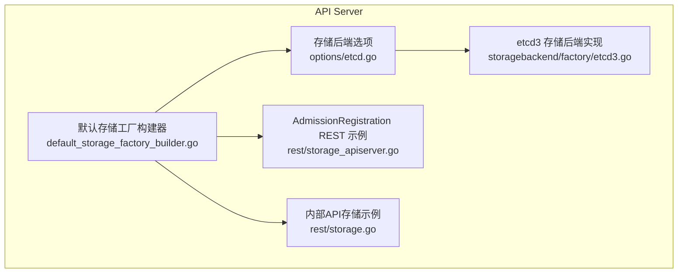
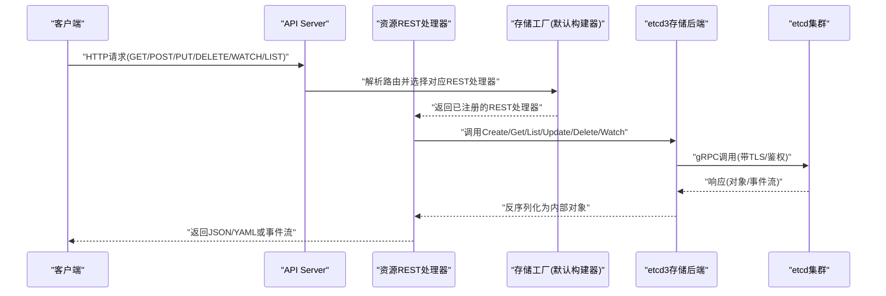
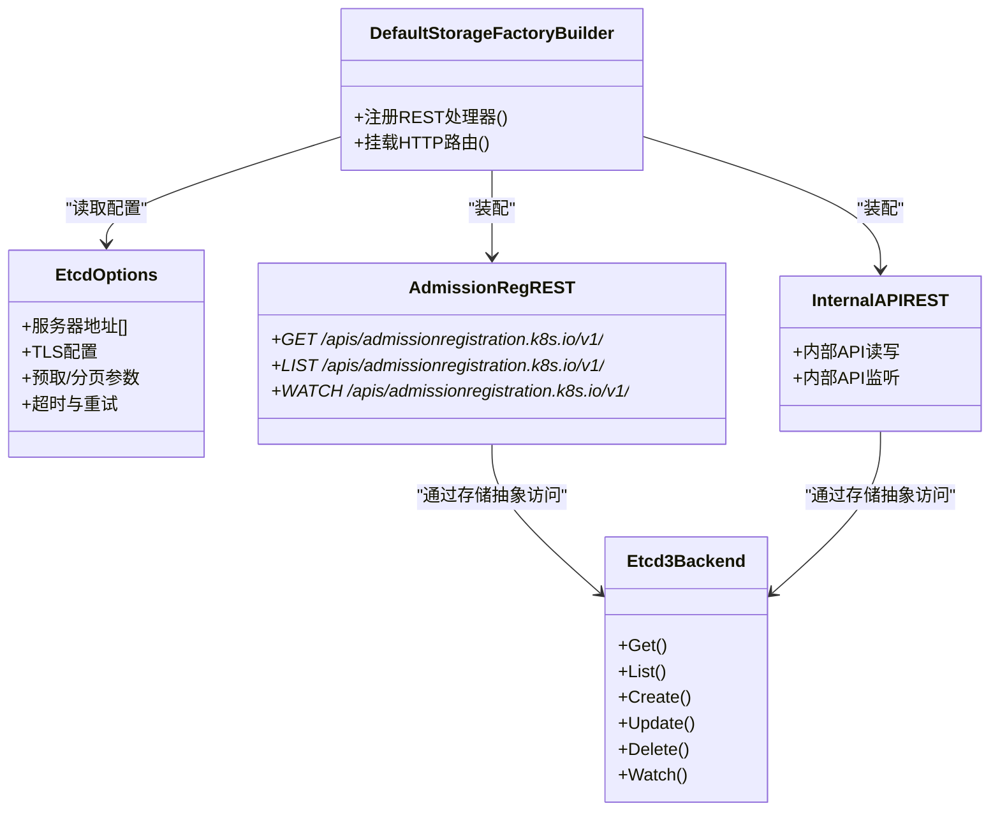
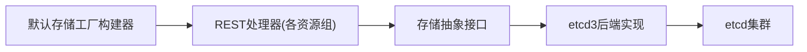

# 存储后端集成

<cite>
**本文引用的文件**   
- [default_storage_factory_builder.go](file://pkg/kubeapiserver/default_storage_factory_builder.go)
- [etcd.go](file://staging/src/k8s.io/apiserver/pkg/server/options/etcd.go)
- [etcd3.go](file://staging/src/k8s.io/apiserver/pkg/storage/storagebackend/factory/etcd3.go)
- [storage_apiserver.go](file://pkg/registry/admissionregistration/rest/storage_apiserver.go)
- [storage.go](file://pkg/registry/apiserverinternal/rest/storage.go)
</cite>

## 目录
1. [简介](#简介)
2. [项目结构](#项目结构)
3. [核心组件](#核心组件)
4. [架构总览](#架构总览)
5. [详细组件分析](#详细组件分析)
6. [依赖关系分析](#依赖关系分析)
7. [性能考虑](#性能考虑)
8. [故障排查指南](#故障排查指南)
9. [结论](#结论)
10. [附录](#附录)

## 简介
本文件面向Kubernetes API服务器的存储后端集成，聚焦以etcd作为主要存储后端的配置与优化。内容涵盖：
- etcd连接池、TLS与高可用部署模式
- 存储抽象层设计（RESTStorage接口、版本转换、序列化）
- 缓存策略、索引机制与批量操作处理
- 存储性能调优（内存、查询、容量规划）
- 故障排查方法与数据恢复策略

## 项目结构
API Server通过“默认存储工厂构建器”将各资源组注册到HTTP路由，并基于“存储后端选项”创建具体的存储后端实例（如etcd3）。各资源组的REST处理器最终通过统一的存储抽象访问底层存储。

图表来源
- [default_storage_factory_builder.go](file://pkg/kubeapiserver/default_storage_factory_builder.go)
- [etcd.go](file://staging/src/k8s.io/apiserver/pkg/server/options/etcd.go)
- [etcd3.go](file://staging/src/k8s.io/apiserver/pkg/storage/storagebackend/factory/etcd3.go)
- [storage_apiserver.go](file://pkg/registry/admissionregistration/rest/storage_apiserver.go)
- [storage.go](file://pkg/registry/apiserverinternal/rest/storage.go)

章节来源
- [default_storage_factory_builder.go](file://pkg/kubeapiserver/default_storage_factory_builder.go)
- [etcd.go](file://staging/src/k8s.io/apiserver/pkg/server/options/etcd.go)
- [etcd3.go](file://staging/src/k8s.io/apiserver/pkg/storage/storagebackend/factory/etcd3.go)
- [storage_apiserver.go](file://pkg/registry/admissionregistration/rest/storage_apiserver.go)
- [storage.go](file://pkg/registry/apiserverinternal/rest/storage.go)

## 核心组件
- 默认存储工厂构建器：负责组装API资源的REST处理器，并将它们挂载到API Server的HTTP路由中。
- 存储后端选项：提供etcd等存储后端的配置入口（地址、TLS、认证、预取、分页等）。
- etcd3存储后端：封装对etcd v3客户端的连接、事务、watch、范围读取等操作，并提供分页与预取能力。
- 资源REST处理器：按资源组组织，定义CRUD、列表、Watch等语义，并通过存储抽象访问持久化层。

章节来源
- [default_storage_factory_builder.go](file://pkg/kubeapiserver/default_storage_factory_builder.go)
- [etcd.go](file://staging/src/k8s.io/apiserver/pkg/server/options/etcd.go)
- [etcd3.go](file://staging/src/k8s.io/apiserver/pkg/storage/storagebackend/factory/etcd3.go)
- [storage_apiserver.go](file://pkg/registry/admissionregistration/rest/storage_apiserver.go)
- [storage.go](file://pkg/registry/apiserverinternal/rest/storage.go)

## 架构总览
下图展示了从HTTP请求到etcd的数据路径，以及关键组件的职责边界。

图表来源
- [default_storage_factory_builder.go](file://pkg/kubeapiserver/default_storage_factory_builder.go)
- [etcd3.go](file://staging/src/k8s.io/apiserver/pkg/storage/storagebackend/factory/etcd3.go)
- [storage_apiserver.go](file://pkg/registry/admissionregistration/rest/storage_apiserver.go)
- [storage.go](file://pkg/registry/apiserverinternal/rest/storage.go)

## 详细组件分析

### 默认存储工厂构建器（API资源装配）
- 职责：集中注册各API组的REST处理器，统一挂载到API Server的路由表；为每个资源提供RESTStorage实例。
- 关键点：
  - 根据API组与版本选择对应的REST处理器。
  - 将REST处理器与存储后端绑定，形成可被HTTP层调用的端点。
  - 支持扩展点，允许在启动时注入自定义存储逻辑。

章节来源
- [default_storage_factory_builder.go](file://pkg/kubeapiserver/default_storage_factory_builder.go)

### 存储后端选项（etcd配置入口）
- 职责：暴露etcd相关配置项，包括：
  - 连接参数：服务器地址、端口、前缀、预取大小、分页大小、超时等。
  - TLS与安全：证书、密钥、CA、服务端名校验、传输加密。
  - 高可用：多端点列表、重试与回退策略。
- 使用方式：在API Server启动参数中传入，供存储工厂构建器消费。

章节来源
- [etcd.go](file://staging/src/k8s.io/apiserver/pkg/server/options/etcd.go)

### etcd3存储后端实现（核心I/O）
- 职责：封装etcd v3客户端，提供：
  - 读写：Put/Get/Delete/CompareAndSwap等原子操作。
  - 列表与分页：基于范围扫描与limit/offset控制。
  - Watch：事件流订阅，支持过滤与条件。
  - 事务：保证一致性写入。
- 关键特性：
  - 连接复用与并发安全。
  - 错误分类与重试策略（网络抖动、临时失败）。
  - 序列化/反序列化：与API对象的编解码器对接。

章节来源
- [etcd3.go](file://staging/src/k8s.io/apiserver/pkg/storage/storagebackend/factory/etcd3.go)

### 资源REST处理器示例（AdmissionRegistration）
- 职责：实现特定API组（如AdmissionRegistration）的REST语义（CRUD、列表、Watch），并与存储后端解耦。
- 关键点：
  - 将HTTP请求映射为存储操作。
  - 处理版本转换与字段校验。
  - 结合权限与审计插件完成准入控制与审计记录。

章节来源
- [storage_apiserver.go](file://pkg/registry/admissionregistration/rest/storage_apiserver.go)

### 内部API存储示例（Internal API）
- 职责：为内部API提供存储适配，通常用于API Server内部组件间通信。
- 关键点：
  - 与外部API保持一致的存储抽象。
  - 针对内部场景的性能与一致性要求做专门优化。

章节来源
- [storage.go](file://pkg/registry/apiserverinternal/rest/storage.go)

#### 类图（代码级关系示意）

图表来源
- [default_storage_factory_builder.go](file://pkg/kubeapiserver/default_storage_factory_builder.go)
- [etcd.go](file://staging/src/k8s.io/apiserver/pkg/server/options/etcd.go)
- [etcd3.go](file://staging/src/k8s.io/apiserver/pkg/storage/storagebackend/factory/etcd3.go)
- [storage_apiserver.go](file://pkg/registry/admissionregistration/rest/storage_apiserver.go)
- [storage.go](file://pkg/registry/apiserverinternal/rest/storage.go)

## 依赖关系分析
- 组件耦合：
  - 默认存储工厂构建器与REST处理器松耦合，通过接口进行装配。
  - REST处理器与存储后端通过抽象接口交互，便于替换不同后端。
- 外部依赖：
  - etcd v3客户端库，负责网络I/O与协议细节。
  - 编解码器，负责对象序列化/反序列化。
- 潜在循环依赖：
  - 通过分层与接口隔离避免循环引用。

图表来源
- [default_storage_factory_builder.go](file://pkg/kubeapiserver/default_storage_factory_builder.go)
- [etcd3.go](file://staging/src/k8s.io/apiserver/pkg/storage/storagebackend/factory/etcd3.go)

章节来源
- [default_storage_factory_builder.go](file://pkg/kubeapiserver/default_storage_factory_builder.go)
- [etcd3.go](file://staging/src/k8s.io/apiserver/pkg/storage/storagebackend/factory/etcd3.go)

## 性能考虑
- 连接与并发
  - 合理设置etcd客户端并发度与连接复用，避免过多短连接导致开销。
  - 在高吞吐场景下，适当增大预取与分页大小，减少往返次数。
- 内存使用
  - 控制列表结果集大小，避免一次性加载大量对象。
  - 合理使用Watch的分页与过滤器，降低内存峰值。
- 查询性能
  - 利用前缀与键空间划分，缩小扫描范围。
  - 对热点资源采用合理的缓存策略（例如本地缓存+失效策略）。
- 容量规划
  - 评估对象平均大小与数量，预估etcd存储增长。
  - 定期清理历史对象与事件，避免过度膨胀。
- 高可用与容错
  - 配置多端点与重试策略，提升可用性。
  - 监控etcd延迟与错误率，及时扩容或调整参数。

[本节为通用指导，不直接分析具体文件]

## 故障排查指南
- 常见问题
  - 连接失败：检查TLS证书、CA、服务端名校验与网络连通性。
  - 超时与重试：观察etcd延迟与负载，调整超时与重试参数。
  - 列表过大：限制分页大小，增加过滤器，避免大对象列表。
  - Watch风暴：细化Watch条件，避免全量监听。
- 诊断步骤
  - 查看API Server日志中的存储错误与堆栈。
  - 检查etcd健康状态与指标（延迟、错误率、磁盘使用）。
  - 复现问题并抓取相关请求的Trace信息。
- 数据恢复
  - 使用etcd快照与备份工具进行恢复。
  - 在恢复后验证API Server是否能正常读取与写入。
  - 逐步回放变更，确保一致性。

[本节为通用指导，不直接分析具体文件]

## 结论
通过将API Server与各资源REST处理器解耦，并以etcd3作为稳定可靠的存储后端，Kubernetes实现了可扩展、高性能且高可用的存储抽象。合理配置连接池、TLS与高可用参数，并结合缓存、索引与批量操作优化，可在大规模集群中保持稳定的API性能。完善的监控与故障排查流程是保障系统长期稳定运行的关键。

[本节为总结，不直接分析具体文件]

## 附录
- 术语
  - RESTStorage：存储抽象接口，定义CRUD、列表、Watch等标准操作。
  - 版本转换：在不同API版本之间进行对象字段映射与兼容处理。
  - 序列化：将对象编码为字节流以便持久化与传输。
- 参考路径
  - 默认存储工厂构建器：[default_storage_factory_builder.go](file://pkg/kubeapiserver/default_storage_factory_builder.go)
  - etcd存储选项：[etcd.go](file://staging/src/k8s.io/apiserver/pkg/server/options/etcd.go)
  - etcd3后端实现：[etcd3.go](file://staging/src/k8s.io/apiserver/pkg/storage/storagebackend/factory/etcd3.go)
  - AdmissionRegistration REST示例：[storage_apiserver.go](file://pkg/registry/admissionregistration/rest/storage_apiserver.go)
  - 内部API存储示例：[storage.go](file://pkg/registry/apiserverinternal/rest/storage.go)