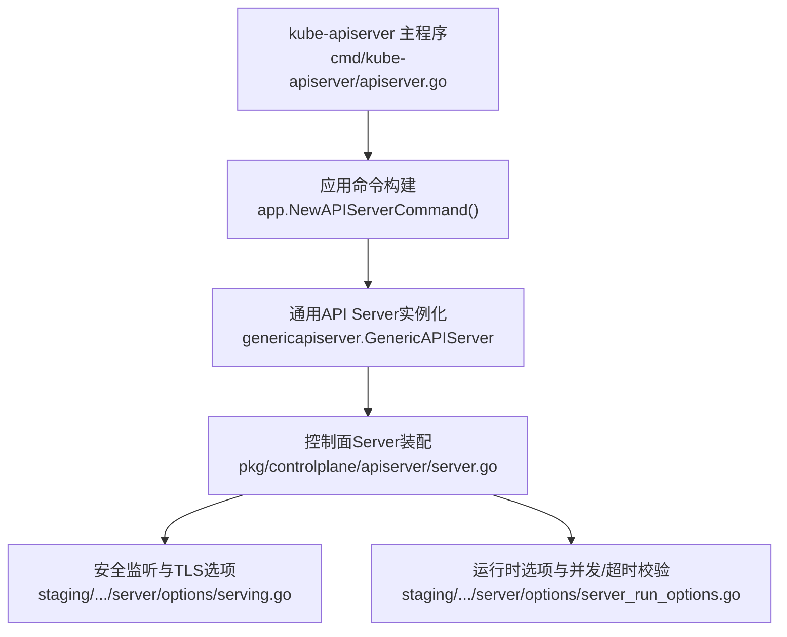
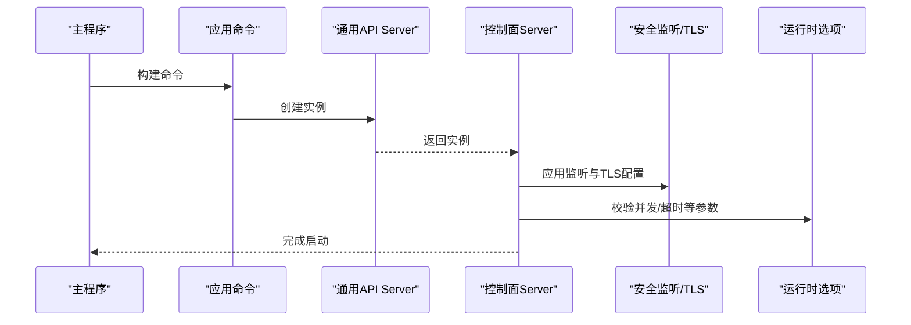
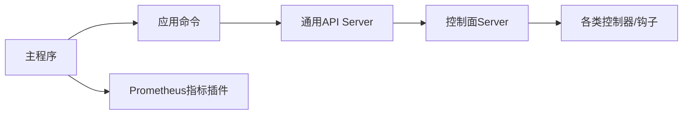

# 性能调优与监控

<cite>
**本文引用的文件**   
- [cmd/kube-apiserver/apiserver.go](file://cmd/kube-apiserver/apiserver.go)
- [pkg/controlplane/apiserver/server.go](file://pkg/controlplane/apiserver/server.go)
- [staging/src/k8s.io/apiserver/pkg/server/options/serving.go](file://staging/src/k8s.io/apiserver/pkg/server/options/serving.go)
- [staging/src/k8s.io/apiserver/pkg/server/options/server_run_options.go](file://staging/src/k8s.io/apiserver/pkg/server/options/server_run_options.go)
</cite>

## 目录
1. [简介](#简介)
2. [项目结构](#项目结构)
3. [核心组件](#核心组件)
4. [架构总览](#架构总览)
5. [详细组件分析](#详细组件分析)
6. [依赖分析](#依赖分析)
7. [性能考虑](#性能考虑)
8. [故障排查指南](#故障排查指南)
9. [结论](#结论)
10. [附录](#附录)

## 简介
本文件面向Kubernetes API服务器的性能调优与监控，聚焦以下目标：
- 关键性能指标：请求延迟、吞吐量、内存使用、CPU利用率
- 性能调优参数：并发限制、缓存大小、超时配置、资源配额
- Prometheus监控：内置指标含义与采集展示、自定义指标扩展方法
- 性能分析工具：pprof剖析、慢查询定位、瓶颈识别
- 高负载场景优化策略与故障排查方法

## 项目结构
API服务器入口位于主程序包，负责初始化命令并运行；控制面服务在controlplane层组装通用API Server能力并注册控制器与钩子；网络与安全相关选项由staging层的options模块提供。

图表来源
- [cmd/kube-apiserver/apiserver.go:32-36](file://cmd/kube-apiserver/apiserver.go#L32-L36)
- [pkg/controlplane/apiserver/server.go:93-138](file://pkg/controlplane/apiserver/server.go#L93-L138)
- [staging/src/k8s.io/apiserver/pkg/server/options/serving.go:240-363](file://staging/src/k8s.io/apiserver/pkg/server/options/serving.go#L240-L363)
- [staging/src/k8s.io/apiserver/pkg/server/options/server_run_options.go:197-204](file://staging/src/k8s.io/apiserver/pkg/server/options/server_run_options.go#L197-L204)

章节来源
- [cmd/kube-apiserver/apiserver.go:32-36](file://cmd/kube-apiserver/apiserver.go#L32-L36)
- [pkg/controlplane/apiserver/server.go:93-138](file://pkg/controlplane/apiserver/server.go#L93-L138)
- [staging/src/k8s.io/apiserver/pkg/server/options/serving.go:240-363](file://staging/src/k8s.io/apiserver/pkg/server/options/serving.go#L240-L363)
- [staging/src/k8s.io/apiserver/pkg/server/options/server_run_options.go:197-204](file://staging/src/k8s.io/apiserver/pkg/server/options/server_run_options.go#L197-L204)

## 核心组件
- 启动入口与命令构建
  - 主函数创建API Server命令并执行，加载Prometheus客户端与版本指标插件。
- 控制面Server装配
  - 基于通用API Server实例，安装日志路由、OpenID元数据、系统命名空间控制器、协调式选举、身份租约、存储就绪钩子、旧版令牌跟踪等。
- 安全监听与TLS
  - 绑定地址/端口、HTTP/2流限制、证书与SNI、最小TLS版本、复用端口/地址等。
- 运行时选项与并发/超时
  - 最大并发请求、请求超时等参数的校验与默认值处理。

章节来源
- [cmd/kube-apiserver/apiserver.go:32-36](file://cmd/kube-apiserver/apiserver.go#L32-L36)
- [pkg/controlplane/apiserver/server.go:93-138](file://pkg/controlplane/apiserver/server.go#L93-L138)
- [staging/src/k8s.io/apiserver/pkg/server/options/serving.go:240-363](file://staging/src/k8s.io/apiserver/pkg/server/options/serving.go#L240-L363)
- [staging/src/k8s.io/apiserver/pkg/server/options/server_run_options.go:197-204](file://staging/src/k8s.io/apiserver/pkg/server/options/server_run_options.go#L197-L204)

## 架构总览
下图展示了从进程入口到通用API Server、再到控制面组件与网络/TLS选项的调用关系。

图表来源
- [cmd/kube-apiserver/apiserver.go:32-36](file://cmd/kube-apiserver/apiserver.go#L32-L36)
- [pkg/controlplane/apiserver/server.go:93-138](file://pkg/controlplane/apiserver/server.go#L93-L138)
- [staging/src/k8s.io/apiserver/pkg/server/options/serving.go:240-363](file://staging/src/k8s.io/apiserver/pkg/server/options/serving.go#L240-L363)
- [staging/src/k8s.io/apiserver/pkg/server/options/server_run_options.go:197-204](file://staging/src/k8s.io/apiserver/pkg/server/options/server_run_options.go#L197-L204)

## 详细组件分析

### 启动入口与命令构建
- 职责
  - 初始化并运行API Server命令，注册Prometheus客户端与版本指标。
- 关键点
  - 通过命令行框架执行命令，退出码由框架返回。
- 建议
  - 在生产环境确保启用JSON日志格式与必要的指标插件。

章节来源
- [cmd/kube-apiserver/apiserver.go:32-36](file://cmd/kube-apiserver/apiserver.go#L32-L36)

### 控制面Server装配
- 职责
  - 基于通用API Server实例，安装各类控制器与钩子，包括：
    - 日志路由、OpenID元数据端点
    - 系统命名空间控制器
    - 协调式领导选举与租约GC
    - 身份租约控制器与GC
    - 存储就绪钩子
    - 旧版令牌跟踪控制器
- 关键点
  - 通过PostStartHook/PreShutdownHook管理生命周期。
  - 根据特性开关动态启用功能（如未知版本互操作代理）。
- 建议
  - 合理设置租约时长与续期间隔，避免频繁切换或长时间不可用。
  - 关注存储就绪钩子，确保后端存储可用后再对外提供服务。

章节来源
- [pkg/controlplane/apiserver/server.go:93-138](file://pkg/controlplane/apiserver/server.go#L93-L138)
- [pkg/controlplane/apiserver/server.go:156-189](file://pkg/controlplane/apiserver/server.go#L156-L189)
- [pkg/controlplane/apiserver/server.go:260-296](file://pkg/controlplane/apiserver/server.go#L260-L296)
- [pkg/controlplane/apiserver/server.go:298-305](file://pkg/controlplane/apiserver/server.go#L298-L305)

### 安全监听与TLS
- 职责
  - 配置HTTPS监听、HTTP/2流限制、证书与SNI、最小TLS版本、端口/地址复用。
- 关键点
  - HTTP/2每连接最大流数可通过选项调整。
  - 支持SO_REUSEPORT/SO_REUSEADDR提升多实例部署灵活性。
- 建议
  - 在高并发场景适当提高HTTP/2流限制，结合连接池与客户端并发进行整体评估。
  - 生产环境固定最小TLS版本与密码套件，禁用不安全算法。

章节来源
- [staging/src/k8s.io/apiserver/pkg/server/options/serving.go:225-238](file://staging/src/k8s.io/apiserver/pkg/server/options/serving.go#L225-238)
- [staging/src/k8s.io/apiserver/pkg/server/options/serving.go:240-363](file://staging/src/k8s.io/apiserver/pkg/server/options/serving.go#L240-L363)

### 运行时选项与并发/超时
- 职责
  - 定义并校验API Server运行时的关键参数，如最大并发请求数、请求超时等。
- 关键点
  - 对负数等非法输入进行校验，防止错误配置导致异常。
- 建议
  - 根据集群规模与etcd性能设置合理的并发上限与超时阈值，避免雪崩。

章节来源
- [staging/src/k8s.io/apiserver/pkg/server/options/server_run_options.go:197-204](file://staging/src/k8s.io/apiserver/pkg/server/options/server_run_options.go#L197-L204)

## 依赖分析
- 组件耦合
  - 主程序依赖应用命令；应用命令依赖通用API Server；控制面Server依赖通用API Server并组合多个控制器。
- 外部依赖
  - Prometheus客户端与版本指标插件在主程序中加载。
- 潜在风险
  - 过多控制器并行运行可能增加CPU与内存占用，需结合资源配额与限流策略。

图表来源
- [cmd/kube-apiserver/apiserver.go:32-36](file://cmd/kube-apiserver/apiserver.go#L32-L36)
- [pkg/controlplane/apiserver/server.go:93-138](file://pkg/controlplane/apiserver/server.go#L93-L138)

章节来源
- [cmd/kube-apiserver/apiserver.go:32-36](file://cmd/kube-apiserver/apiserver.go#L32-L36)
- [pkg/controlplane/apiserver/server.go:93-138](file://pkg/controlplane/apiserver/server.go#L93-L138)

## 性能考虑
- 关键指标
  - 请求延迟：P50/P95/P99分位延迟，区分读/写路径
  - 吞吐量：QPS（按资源类型、用户、命名空间维度）
  - 内存使用：RSS、堆分配、GC暂停时间
  - CPU利用率：用户态/内核态占比、上下文切换频率
- 并发限制
  - 最大并发请求数：影响吞吐与延迟平衡，需结合etcd写入速率与鉴权/准入开销
  - HTTP/2每连接最大流数：在高并发短连接场景下可提升并行度
- 缓存与存储
  - Watch缓存：减少etcd压力，但会增加内存占用
  - 存储就绪钩子：确保后端稳定后再暴露服务
- 超时配置
  - 请求超时：避免长尾请求拖垮线程池
  - 读写超时：保护服务端免受慢客户端影响
- 资源配额
  - 为API Server容器设置合理的requests/limits，避免被调度器驱逐
  - 结合HPA/VPA实现弹性扩容

[本节为通用指导，不直接分析具体文件]

## 故障排查指南
- 常见症状
  - 高延迟：检查并发上限是否过低、etcd延迟、鉴权/准入链过长
  - 低吞吐：检查HTTP/2流限制、连接复用、客户端并发模型
  - OOM：检查Watch缓存大小、对象列表体积、GC行为
  - CPU飙升：检查复杂CRD、大量Webhook、频繁GC
- 诊断步骤
  - 查看Prometheus指标：请求计数、延迟直方图、错误率、goroutine数量、内存/CPU
  - 启用pprof：抓取heap、profile、block、mutex等快照，定位热点
  - 慢查询分析：结合审计日志与请求URI，定位耗时路径
  - 存储健康：检查etcd延迟、磁盘IO、网络抖动
- 恢复策略
  - 临时降低并发或关闭非关键准入插件
  - 增大超时与并发上限（谨慎评估）
  - 重启受影响的API Server实例，观察恢复情况

[本节为通用指导，不直接分析具体文件]

## 结论
通过对API Server启动流程、控制面装配、网络/TLS与运行时选项的分析，可以明确性能调优的关键杠杆点：并发限制、HTTP/2流限制、超时配置、缓存与存储就绪策略。配合Prometheus监控与pprof剖析，可在高负载场景下快速定位瓶颈并实施优化。

[本节为总结性内容，不直接分析具体文件]

## 附录
- 常用参数参考
  - 安全监听与TLS：secure-port、tls-cert-file、tls-private-key-file、http2-max-streams-per-connection、permit-port-sharing、permit-address-sharing
  - 运行时选项：max-requests-inflight、request-timeout
- 监控建议
  - 采集API Server核心指标：请求计数、延迟、错误率、goroutine、内存、CPU
  - 建立告警规则：P99延迟阈值、错误率阈值、OOM事件、GC停顿过长
- 分析工具
  - pprof：/debug/pprof/profile、/debug/pprof/heap、/debug/pprof/block、/debug/pprof/mutex
  - 审计日志：开启审计策略，记录慢请求与失败请求详情

[本节为补充信息，不直接分析具体文件]