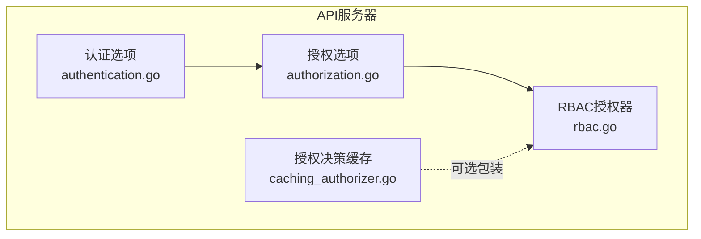
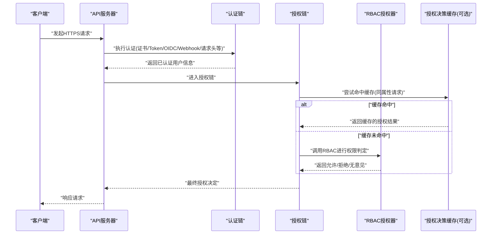
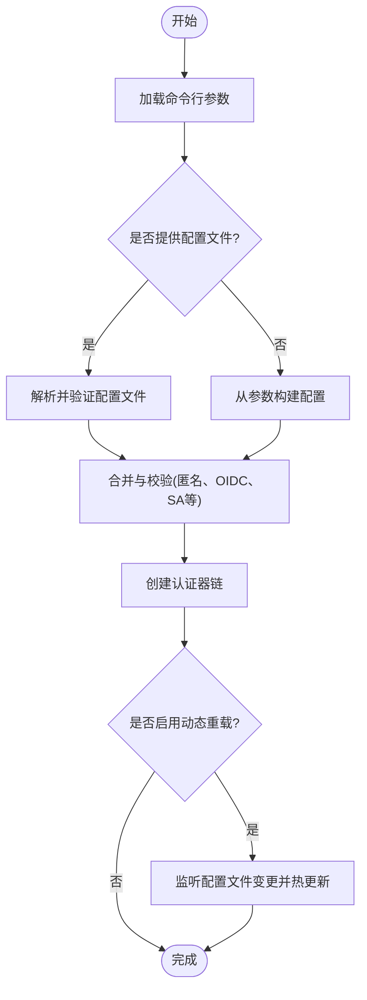
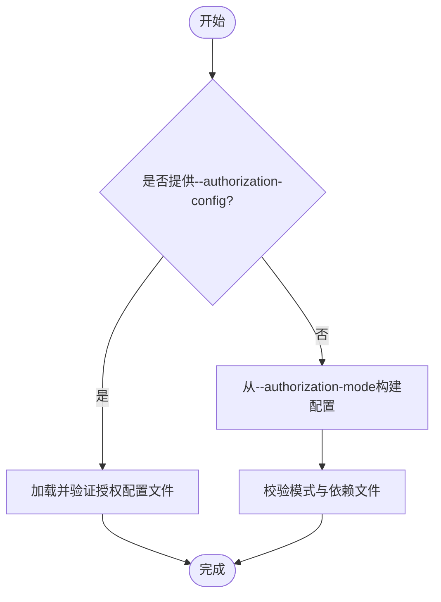
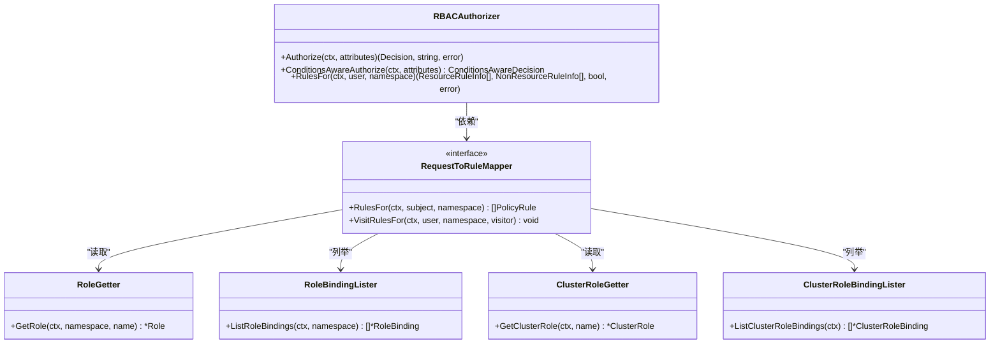
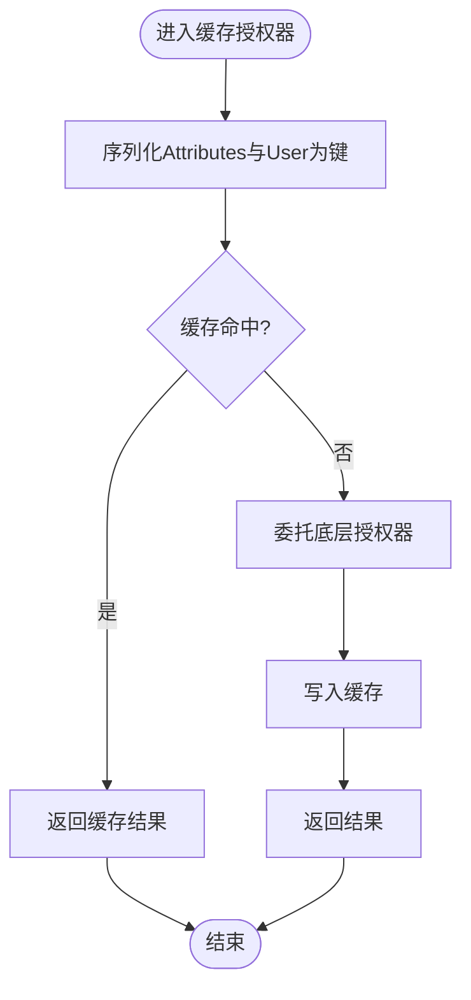
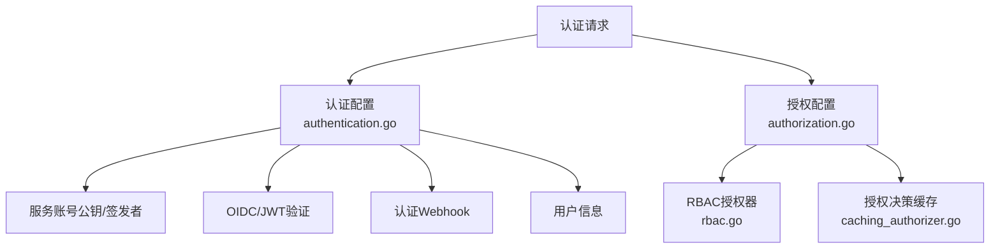

# 认证与授权机制

<cite>
**本文引用的文件**   
- [authentication.go](file://pkg/kubeapiserver/options/authentication.go)
- [authorization.go](file://pkg/kubeapiserver/options/authorization.go)
- [rbac.go](file://plugin/pkg/auth/authorizer/rbac/rbac.go)
- [caching_authorizer.go](file://staging/src/k8s.io/apiserver/pkg/admission/plugin/authorizer/caching_authorizer.go)
</cite>

## 目录
1. [简介](#简介)
2. [项目结构](#项目结构)
3. [核心组件](#核心组件)
4. [架构总览](#架构总览)
5. [详细组件分析](#详细组件分析)
6. [依赖关系分析](#依赖关系分析)
7. [性能考量](#性能考量)
8. [故障排查指南](#故障排查指南)
9. [结论](#结论)
10. [附录](#附录)

## 简介
本文件面向Kubernetes API服务器的认证与授权机制，系统性阐述：
- 认证流程与多后端（X.509证书、Token、Webhook、OIDC、请求头）的配置与使用要点
- 授权模型与RBAC实现原理（Role、ClusterRole、RoleBinding、ClusterRoleBinding）
- 认证中间件链的执行顺序与配置项
- 安全最佳实践（证书管理、令牌轮换、访问控制策略设计）
- 故障排查与常见问题解决方案

## 项目结构
围绕API服务器认证与授权的代码主要分布在以下位置：
- 认证选项与装配：pkg/kubeapiserver/options/authentication.go
- 授权选项与装配：pkg/kubeapiserver/options/authorization.go
- RBAC授权器实现：plugin/pkg/auth/authorizer/rbac/rbac.go
- 授权决策缓存（用于准入等短生命周期场景）：staging/src/k8s.io/apiserver/pkg/admission/plugin/authorizer/caching_authorizer.go

图表来源
- [authentication.go:1-914](file://pkg/kubeapiserver/options/authentication.go#L1-L914)
- [authorization.go:1-292](file://pkg/kubeapiserver/options/authorization.go#L1-L292)
- [rbac.go:1-239](file://plugin/pkg/auth/authorizer/rbac/rbac.go#L1-L239)
- [caching_authorizer.go:1-159](file://staging/src/k8s.io/apiserver/pkg/admission/plugin/authorizer/caching_authorizer.go#L1-L159)

章节来源
- [authentication.go:1-914](file://pkg/kubeapiserver/options/authentication.go#L1-L914)
- [authorization.go:1-292](file://pkg/kubeapiserver/options/authorization.go#L1-L292)
- [rbac.go:1-239](file://plugin/pkg/auth/authorizer/rbac/rbac.go#L1-L239)
- [caching_authorizer.go:1-159](file://staging/src/k8s.io/apiserver/pkg/admission/plugin/authorizer/caching_authorizer.go#L1-L159)

## 核心组件
- 认证选项与装配
  - 内置认证后端：匿名、引导令牌、客户端证书、OIDC、请求头、服务账号、静态Token文件、Webhook
  - 支持从命令行参数或配置文件构建认证配置，并支持动态重载
  - 关键入口：ToAuthenticationConfig、ApplyTo、AddFlags、Validate
- 授权选项与装配
  - 支持多种授权模式（如ABAC、Webhook、RBAC等），可通过--authorization-mode或--authorization-config配置
  - 关键入口：ToAuthorizationConfig、buildAuthorizationConfiguration、AddFlags、Validate
- RBAC授权器
  - 基于Role/ClusterRole与RoleBinding/ClusterRoleBinding解析规则并判定是否允许
  - 关键接口：Authorize、RulesFor、RuleAllows
- 授权决策缓存
  - 在单次请求的准入阶段对相同属性的授权结果进行缓存，避免重复计算

章节来源
- [authentication.go:1-914](file://pkg/kubeapiserver/options/authentication.go#L1-L914)
- [authorization.go:1-292](file://pkg/kubeapiserver/options/authorization.go#L1-L292)
- [rbac.go:1-239](file://plugin/pkg/auth/authorizer/rbac/rbac.go#L1-L239)
- [caching_authorizer.go:1-159](file://staging/src/k8s.io/apiserver/pkg/admission/plugin/authorizer/caching_authorizer.go#L1-L159)

## 架构总览
下图展示了API服务器在请求处理中认证与授权的总体流程与组件交互。

图表来源
- [authentication.go:488-666](file://pkg/kubeapiserver/options/authentication.go#L488-L666)
- [authorization.go:207-292](file://pkg/kubeapiserver/options/authorization.go#L207-L292)
- [rbac.go:78-130](file://plugin/pkg/auth/authorizer/rbac/rbac.go#L78-L130)
- [caching_authorizer.go:82-158](file://staging/src/k8s.io/apiserver/pkg/admission/plugin/authorizer/caching_authorizer.go#L82-L158)

## 详细组件分析

### 认证后端与配置
- 支持的认证后端
  - 客户端证书（X.509）：通过ClientCA验证客户端证书
  - Token文件：静态token列表
  - Webhook：远程鉴权服务（TokenReview）
  - OIDC：基于JWT的第三方身份提供方
  - 请求头：信任代理设置的认证头部
  - 服务账号：校验ServiceAccount令牌（含签发者、JWKS、受众等）
  - 匿名：允许匿名访问
  - 引导令牌：用于TLS引导的bootstrap token
- 配置方式
  - 命令行参数：AddFlags提供大量开关，如--oidc-*、--service-account-*、--token-auth-file、--authentication-token-webhook-*等
  - 配置文件：--authentication-config加载结构化配置，支持动态重载
- 关键行为
  - ToAuthenticationConfig将选项转换为内部认证配置对象
  - ApplyTo完成证书加载、外部公钥获取、Webhook重试退避、OpenAPI安全方案注册等
  - Validate检查冲突与非法组合（例如RequestHeader与ClientCert CA重叠需指定AllowedNames）

图表来源
- [authentication.go:339-486](file://pkg/kubeapiserver/options/authentication.go#L339-L486)
- [authentication.go:488-666](file://pkg/kubeapiserver/options/authentication.go#L488-L666)
- [authentication.go:668-800](file://pkg/kubeapiserver/options/authentication.go#L668-L800)

章节来源
- [authentication.go:1-914](file://pkg/kubeapiserver/options/authentication.go#L1-L914)

### 授权模式与配置
- 支持的授权模式
  - ABAC：基于策略文件的授权
  - Webhook：远程SubjectAccessReview
  - RBAC：基于角色的访问控制
  - AlwaysAllow：始终允许（默认，若未显式配置）
- 配置方式
  - --authorization-mode：逗号分隔的模式列表
  - --authorization-config：结构化配置文件，可替代旧版标志
- 关键行为
  - ToAuthorizationConfig根据模式或配置文件生成授权配置
  - buildAuthorizationConfiguration将旧版标志转换为新的AuthorizationConfiguration
  - Validate确保模式合法性、必需文件存在、Webhook重试次数合法等

图表来源
- [authorization.go:160-205](file://pkg/kubeapiserver/options/authorization.go#L160-L205)
- [authorization.go:207-292](file://pkg/kubeapiserver/options/authorization.go#L207-L292)

章节来源
- [authorization.go:1-292](file://pkg/kubeapiserver/options/authorization.go#L1-L292)

### RBAC授权器实现
- 核心职责
  - 根据用户与命名空间收集适用的PolicyRule
  - 对资源请求与非资源URL分别匹配规则
  - 返回允许/拒绝/无意见及原因
- 关键方法
  - Authorize：遍历规则，命中即允许；否则记录拒绝原因
  - RulesFor：将PolicyRule转换为资源/非资源规则集合
  - RuleAllows：具体匹配逻辑（动词、API组、资源、名称、路径）
- 数据源
  - RoleGetter、RoleBindingLister、ClusterRoleGetter、ClusterRoleBindingLister

图表来源
- [rbac.go:53-179](file://plugin/pkg/auth/authorizer/rbac/rbac.go#L53-L179)
- [rbac.go:181-206](file://plugin/pkg/auth/authorizer/rbac/rbac.go#L181-L206)
- [rbac.go:208-239](file://plugin/pkg/auth/authorizer/rbac/rbac.go#L208-L239)

章节来源
- [rbac.go:1-239](file://plugin/pkg/auth/authorizer/rbac/rbac.go#L1-L239)

### 授权决策缓存（准入阶段）
- 作用范围
  - 针对短生命周期操作（如准入链内）缓存同一属性的授权结果
- 缓存键构造
  - 序列化Attributes与User信息（排序groups与extras以消除顺序差异）
- 行为
  - 命中则直接返回；未命中则委托底层UnconditionalAuthorizer并写入缓存

图表来源
- [caching_authorizer.go:82-158](file://staging/src/k8s.io/apiserver/pkg/admission/plugin/authorizer/caching_authorizer.go#L82-L158)

章节来源
- [caching_authorizer.go:1-159](file://staging/src/k8s.io/apiserver/pkg/admission/plugin/authorizer/caching_authorizer.go#L1-L159)

## 依赖关系分析
- 认证模块依赖
  - 证书与密钥工具：用于加载ClientCA、请求头CA、服务账号公钥
  - OIDC/JWT库：用于验证JWT签名与声明映射
  - Webhook客户端：用于远程认证与授权回调
- 授权模块依赖
  - RBAC规则解析器：聚合Role/ClusterRole与Binding信息
  - 缓存层：在准入阶段减少重复授权开销
- 可能的耦合点
  - 认证与服务账号签发者/受众一致性
  - 授权Webhook超时与失败策略影响整体可用性

图表来源
- [authentication.go:488-666](file://pkg/kubeapiserver/options/authentication.go#L488-L666)
- [authorization.go:207-292](file://pkg/kubeapiserver/options/authorization.go#L207-L292)
- [rbac.go:78-130](file://plugin/pkg/auth/authorizer/rbac/rbac.go#L78-L130)
- [caching_authorizer.go:82-158](file://staging/src/k8s.io/apiserver/pkg/admission/plugin/authorizer/caching_authorizer.go#L82-L158)

章节来源
- [authentication.go:1-914](file://pkg/kubeapiserver/options/authentication.go#L1-L914)
- [authorization.go:1-292](file://pkg/kubeapiserver/options/authorization.go#L1-L292)
- [rbac.go:1-239](file://plugin/pkg/auth/authorizer/rbac/rbac.go#L1-L239)
- [caching_authorizer.go:1-159](file://staging/src/k8s.io/apiserver/pkg/admission/plugin/authorizer/caching_authorizer.go#L1-L159)

## 性能考量
- 认证缓存
  - 成功/失败令牌缓存TTL可配置，降低高频认证开销
- Webhook回退与重试
  - 认证与授权Webhook均支持重试退避，避免雪崩
- 授权决策缓存
  - 在准入阶段对相同属性请求复用授权结果，显著降低RBAC规则遍历成本
- 规则解析优化
  - RBAC通过Listers与缓存提升角色与绑定查询效率

[本节为通用指导，不直接分析具体文件]

## 故障排查指南
- 认证相关
  - 客户端证书与请求头CA重叠但未设置AllowedNames：需在请求头认证中明确AllowedNames以避免任意用户伪造
  - ServiceAccount令牌无效：检查签发者、受众、JWKS URI与公钥配置是否一致
  - Webhook不可用：检查重试退避配置与网络连通性，关注警告日志提示
- 授权相关
  - 未指定任何授权模式：需至少提供一个有效的authorization-mode
  - ABAC缺少策略文件或Webhook缺少kubeconfig：按错误提示补齐
  - RBAC拒绝但无明确原因：开启更详细日志定位缺失的规则或绑定
- 动态配置
  - 配置文件热更新失败：检查文件格式与字段校验错误，关注自动重载指标

章节来源
- [authentication.go:247-324](file://pkg/kubeapiserver/options/authentication.go#L247-L324)
- [authentication.go:668-800](file://pkg/kubeapiserver/options/authentication.go#L668-L800)
- [authorization.go:96-158](file://pkg/kubeapiserver/options/authorization.go#L96-L158)
- [rbac.go:78-130](file://plugin/pkg/auth/authorizer/rbac/rbac.go#L78-L130)

## 结论
Kubernetes API服务器的认证与授权体系通过模块化设计与可扩展的后端机制，提供了灵活而强大的访问控制能力。结合RBAC与Webhook扩展，既能满足企业级复杂权限需求，也能通过缓存与重试机制保障性能与稳定性。建议在生产环境中严格遵循安全最佳实践，持续监控与审计，确保最小权限原则落地。

[本节为总结性内容，不直接分析具体文件]

## 附录

### 认证中间件链执行顺序与配置要点
- 执行顺序
  - 通常先进行客户端证书与请求头认证，再处理Token/OIDC/Webhook等
  - 服务账号令牌校验可与OIDC并行或串行，取决于配置
- 关键配置项
  - 匿名访问：--anonymous-auth
  - OIDC：--oidc-issuer-url、--oidc-client-id、--oidc-ca-file、--oidc-username-claim、--oidc-groups-claim、--oidc-signing-algs、--oidc-required-claim
  - 服务账号：--service-account-key-file/--service-account-signing-endpoint、--service-account-issuer、--service-account-jwks-uri、--service-account-max-token-expiration、--service-account-extend-token-expiration
  - 静态Token：--token-auth-file
  - Webhook：--authentication-token-webhook-config-file、--authentication-token-webhook-version、--authentication-token-webhook-cache-ttl
  - 配置文件：--authentication-config（支持动态重载）

章节来源
- [authentication.go:339-486](file://pkg/kubeapiserver/options/authentication.go#L339-L486)
- [authentication.go:488-666](file://pkg/kubeapiserver/options/authentication.go#L488-L666)
- [authentication.go:668-800](file://pkg/kubeapiserver/options/authentication.go#L668-L800)

### 授权模式与配置要点
- 授权模式
  - --authorization-mode：AlwaysAllow、ABAC、Webhook、RBAC等
- 关键配置项
  - ABAC：--authorization-policy-file
  - Webhook：--authorization-webhook-config-file、--authorization-webhook-version、--authorization-webhook-cache-authorized-ttl、--authorization-webhook-cache-unauthorized-ttl
  - 配置文件：--authorization-config（替代旧版标志）

章节来源
- [authorization.go:160-205](file://pkg/kubeapiserver/options/authorization.go#L160-L205)
- [authorization.go:207-292](file://pkg/kubeapiserver/options/authorization.go#L207-L292)

### RBAC工作流与最佳实践
- 工作流
  - 定义Role/ClusterRole（包含Verbs、Resources/APIGroups、ResourceNames/NonResourceURLs）
  - 通过RoleBinding/ClusterRoleBinding将主体（用户、组、服务账号）与角色关联
  - 请求到达时，RBAC根据主体与命名空间收集规则并判定
- 最佳实践
  - 最小权限原则：仅授予必要的最小集合
  - 使用命名空间隔离：优先使用Role而非ClusterRole
  - 定期审计与清理：移除不再使用的绑定与角色
  - 结合条件与标签选择器：精细化控制资源访问

章节来源
- [rbac.go:78-130](file://plugin/pkg/auth/authorizer/rbac/rbac.go#L78-L130)
- [rbac.go:181-206](file://plugin/pkg/auth/authorizer/rbac/rbac.go#L181-L206)

### 安全最佳实践清单
- 证书管理
  - 使用受信任的CA颁发客户端证书，避免自签混用
  - 定期轮换证书与私钥，限制证书有效期
- 令牌轮换
  - 合理设置服务账号令牌最大有效期与扩展策略
  - 使用JWKS动态获取公钥，避免硬编码
- 访问控制策略
  - 采用RBAC为主，必要时辅以Webhook进行细粒度控制
  - 禁用不必要的匿名访问，严格限制系统账户权限
- 监控与审计
  - 开启详细日志与审计策略，追踪敏感操作
  - 监控认证/授权失败率与延迟，及时告警

[本节为通用指导，不直接分析具体文件]