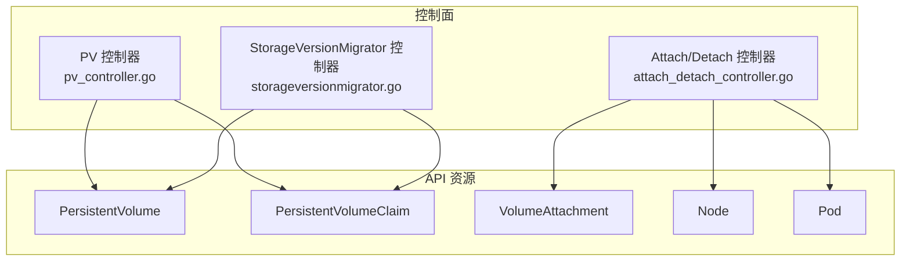
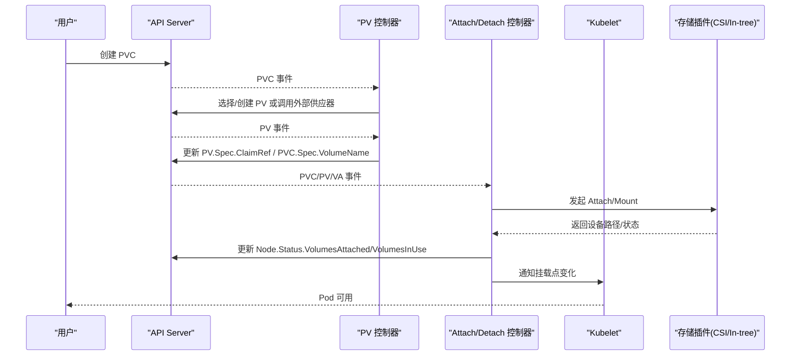
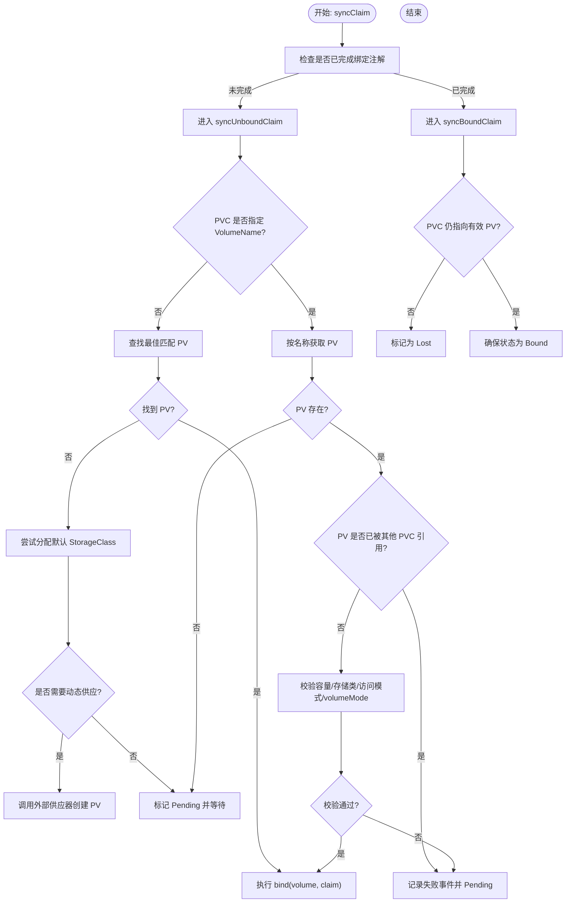
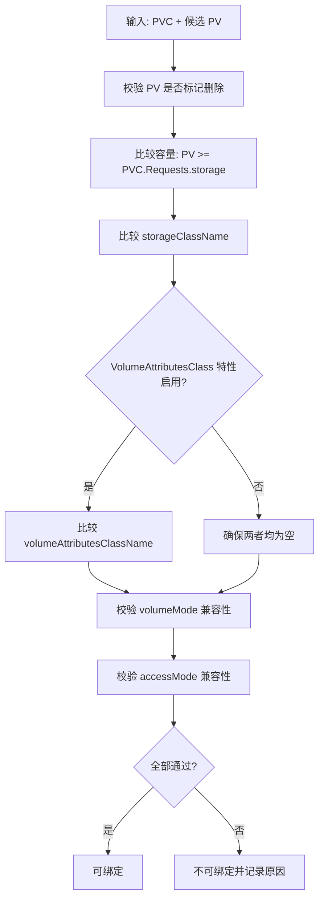
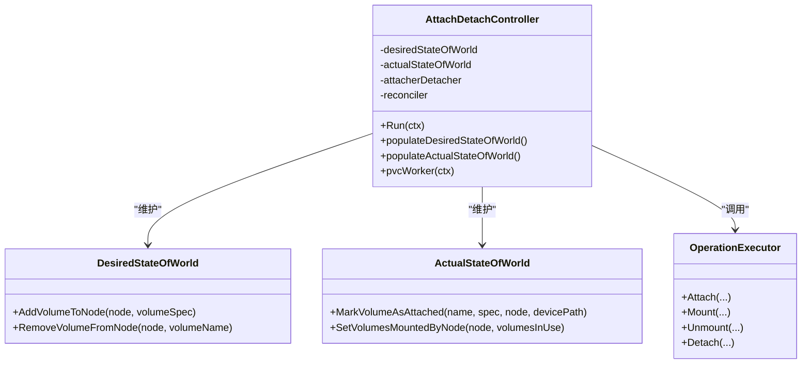
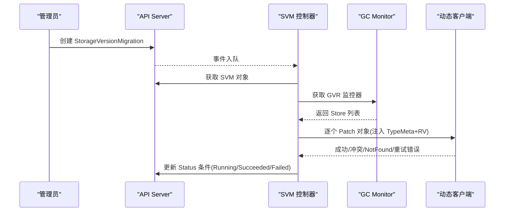
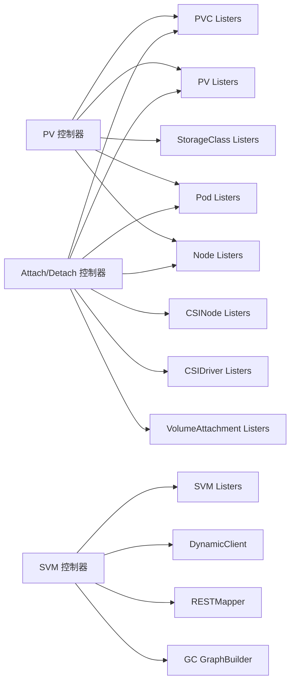

# 存储控制器

<cite>
**本文引用的文件**   
- [pv_controller.go](file://pkg/controller/volume/persistentvolume/pv_controller.go)
- [attach_detach_controller.go](file://pkg/controller/volume/attachdetach/attach_detach_controller.go)
- [storageversionmigrator.go](file://pkg/controller/storageversionmigrator/storageversionmigrator.go)
</cite>

## 目录
1. [简介](#简介)
2. [项目结构](#项目结构)
3. [核心组件](#核心组件)
4. [架构总览](#架构总览)
5. [详细组件分析](#详细组件分析)
6. [依赖关系分析](#依赖关系分析)
7. [性能考虑](#性能考虑)
8. [故障排查指南](#故障排查指南)
9. [结论](#结论)
10. [附录](#附录)

## 简介
本技术文档聚焦于 Kubernetes 存储相关控制器的实现与工作机制，覆盖以下关键主题：
- PersistentVolume（PV）控制器的卷生命周期管理、动态供应与回收策略
- PersistentVolumeClaim（PVC）控制器的绑定算法、访问模式匹配与容量验证逻辑
- Attach/Detach 控制器的卷挂载卸载、多节点共享与一致性保证机制
- StorageVersionMigrator 的数据迁移策略与兼容性处理
- 存储配置最佳实践、性能优化与故障恢复方案
- 复杂存储场景的配置示例与排错指南

## 项目结构
围绕存储控制器的核心代码主要分布在以下路径：
- pkg/controller/volume/persistentvolume：PV/PVC 绑定、动态供应、回收等逻辑
- pkg/controller/volume/attachdetach：Attach/Detach 控制器，负责卷在节点上的挂载/卸载与状态同步
- pkg/controller/storageversionmigrator：StorageVersionMigration 控制器，驱动 API 对象存储版本迁移

图表来源
- [pv_controller.go:140-230](file://pkg/controller/volume/persistentvolume/pv_controller.go#L140-L230)
- [attach_detach_controller.go:238-323](file://pkg/controller/volume/attachdetach/attach_detach_controller.go#L238-L323)
- [storageversionmigrator.go:59-96](file://pkg/controller/storageversionmigrator/storageversionmigrator.go#L59-L96)

章节来源
- [pv_controller.go:140-230](file://pkg/controller/volume/persistentvolume/pv_controller.go#L140-L230)
- [attach_detach_controller.go:238-323](file://pkg/controller/volume/attachdetach/attach_detach_controller.go#L238-L323)
- [storageversionmigrator.go:59-96](file://pkg/controller/storageversionmigrator/storageversionmigrator.go#L59-L96)

## 核心组件
- PV 控制器：维护 PV 与 PVC 的双向指针，负责绑定、动态供应、回收与状态修复。
- Attach/Detach 控制器：维护“期望世界”和“实际世界”，周期性协调以完成卷的挂载/卸载，并更新节点状态。
- StorageVersionMigrator 控制器：基于 StorageVersionMigration 资源，对指定 GVR 的对象进行增量迁移，确保兼容性与幂等性。

章节来源
- [pv_controller.go:140-230](file://pkg/controller/volume/persistentvolume/pv_controller.go#L140-L230)
- [attach_detach_controller.go:96-120](file://pkg/controller/volume/attachdetach/attach_detach_controller.go#L96-L120)
- [storageversionmigrator.go:59-96](file://pkg/controller/storageversionmigrator/storageversionmigrator.go#L59-L96)

## 架构总览
Kubernetes 存储子系统由多个控制器协同工作：
- PV 控制器通过 informer 监听 PV/PVC 变更，执行绑定、动态供应与回收。
- Attach/Detach 控制器监听 Pod/Node/PVC/PV/VA 等事件，构建 DSW/ASW，驱动插件完成 attach/detach/mount/unmount。
- StorageVersionMigrator 控制器根据迁移任务扫描目标资源，使用 Patch 触发存储版本升级。

图表来源
- [pv_controller.go:232-489](file://pkg/controller/volume/persistentvolume/pv_controller.go#L232-L489)
- [attach_detach_controller.go:325-496](file://pkg/controller/volume/attachdetach/attach_detach_controller.go#L325-L496)

## 详细组件分析

### PV 控制器：卷生命周期、绑定与回收
- 双向指针设计：PV.Spec.ClaimRef 与 PVC.Spec.VolumeName 构成强一致绑定语义，避免并发冲突导致的多绑问题。
- 未绑定流程（syncUnboundClaim）：
  - 若未指定 VolumeName：尝试延迟绑定；若无可用 PV，则分配默认 StorageClass 并触发动态供应；否则进入 Pending。
  - 若指定 VolumeName：校验 PV 是否存在且未被其他 PVC 占用，满足容量、存储类、访问模式、volumeMode 等约束后执行 bind。
- 已绑定流程（syncBoundClaim）：
  - 校验 PVC 是否仍指向有效 PV，若丢失引用或 PV 被删除，标记为 Lost。
  - 若 PV 的 ClaimRef 不一致，修正或标记错误。
- 卷同步（syncVolume）：
  - 未绑定：置 Available。
  - 预绑定：等待 PVC 侧完成绑定。
  - 已绑定：保持 Bound；若 PVC 不存在，进入 Released 并执行 reclaim（Delete/Recycle/Retain）。
- 回收策略：
  - Delete：动态供应的卷在 PVC 删除时自动清理。
  - Retain：保留数据，需人工干预。
  - Recycle：内部回收（逐步弃用，建议采用 CSI 快照/克隆）。

图表来源
- [pv_controller.go:232-489](file://pkg/controller/volume/persistentvolume/pv_controller.go#L232-L489)
- [pv_controller.go:491-557](file://pkg/controller/volume/persistentvolume/pv_controller.go#L491-L557)
- [pv_controller.go:559-777](file://pkg/controller/volume/persistentvolume/pv_controller.go#L559-L777)

章节来源
- [pv_controller.go:232-489](file://pkg/controller/volume/persistentvolume/pv_controller.go#L232-L489)
- [pv_controller.go:491-557](file://pkg/controller/volume/persistentvolume/pv_controller.go#L491-L557)
- [pv_controller.go:559-777](file://pkg/controller/volume/persistentvolume/pv_controller.go#L559-L777)

### PVC 控制器：绑定算法、访问模式匹配与容量验证
- 绑定算法要点：
  - 优先匹配指定 VolumeName 的 PV。
  - 无指定时，遍历候选 PV，依据容量、存储类、volumeMode、访问模式等条件筛选最优匹配。
  - 支持延迟绑定（WaitForFirstConsumer），在调度阶段结合 Pod 拓扑信息选择合适 PV。
- 访问模式匹配：
  - 使用工具函数校验 PVC 的 AccessModes 与 PV 的 AccessModes 是否兼容。
- 容量验证：
  - 比较请求容量与 PV 容量，拒绝不足的情况。
- 属性类（VolumeAttributesClassName）：
  - 在特性门控开启时要求 PVC 与 PV 的属性类一致；关闭时不允许出现非空值。

图表来源
- [pv_controller.go:259-303](file://pkg/controller/volume/persistentvolume/pv_controller.go#L259-L303)

章节来源
- [pv_controller.go:259-303](file://pkg/controller/volume/persistentvolume/pv_controller.go#L259-L303)

### Attach/Detach 控制器：挂载/卸载、多节点共享与一致性
- 核心数据结构：
  - DesiredStateOfWorld（DSW）：根据 Pod/Node/PVC/PV 计算出的期望挂载状态。
  - ActualStateOfWorld（ASW）：从 Node.Status 与插件反馈得到的实际挂载状态。
- 运行循环：
  - 初始化：填充 ASW（读取 Node.Status.VolumesAttached/VolumesInUse）、填充 DSW（遍历 Pod 的卷）。
  - 周期 Reconciler：对比 DSW 与 ASW，调用 OperationExecutor 触发 Attach/Mount/Unmount/Detach。
  - PVC Worker：当 PVC 变为 Bound 时，定位引用该 PVC 的活跃 Pod，更新 DSW。
- 多节点共享与一致性：
  - 对于支持多节点的卷（如 RWO 单写多读场景），控制器会跟踪每个节点的挂载状态，确保仅在需要时进行 mount/unmount。
  - 通过 DevicePath 与 VolumesInUse 字段维持一致性，避免重复挂载或悬挂挂载。
- 与 CSI/In-tree 集成：
  - 支持 CSI 迁移，将 In-tree 卷规格转换为 CSI 规格，统一由 CSI 插件处理。

图表来源
- [attach_detach_controller.go:238-323](file://pkg/controller/volume/attachdetach/attach_detach_controller.go#L238-L323)
- [attach_detach_controller.go:325-496](file://pkg/controller/volume/attachdetach/attach_detach_controller.go#L325-L496)

章节来源
- [attach_detach_controller.go:325-496](file://pkg/controller/volume/attachdetach/attach_detach_controller.go#L325-L496)
- [attach_detach_controller.go:596-674](file://pkg/controller/volume/attachdetach/attach_detach_controller.go#L596-L674)

### StorageVersionMigrator：数据迁移策略与兼容性
- 触发与队列：
  - 监听 StorageVersionMigration 资源的 Add/Update 事件，入队处理。
- 迁移流程：
  - 解析 Spec.Resource 对应的 GVR，校验 RESTMapper 与 GC Monitor 就绪。
  - 基于 ResourceVersion 过滤候选对象，仅迁移小于等于 checkpoint 的版本。
  - 使用动态客户端对每个对象执行 MergePatch，注入 TypeMeta 与 ResourceVersion，触发存储版本升级。
  - 处理冲突/NotFound（幂等跳过）、重试错误（网络/限流/超时）与失败分支（设置 Failed 条件）。
- 状态与进度：
  - 更新 Running/Succeeded/Failed 条件，报告已迁移数量与剩余数量。

图表来源
- [storageversionmigrator.go:138-275](file://pkg/controller/storageversionmigrator/storageversionmigrator.go#L138-L275)
- [storageversionmigrator.go:277-385](file://pkg/controller/storageversionmigrator/storageversionmigrator.go#L277-L385)

章节来源
- [storageversionmigrator.go:138-275](file://pkg/controller/storageversionmigrator/storageversionmigrator.go#L138-L275)
- [storageversionmigrator.go:277-385](file://pkg/controller/storageversionmigrator/storageversionmigrator.go#L277-L385)

## 依赖关系分析
- PV 控制器依赖：
  - Informers/Listers：PV、PVC、StorageClass、Pod、Node
  - 事件记录器、工作队列、本地缓存、GoroutineMap 用于并发控制
- Attach/Detach 控制器依赖：
  - Informers/Listers：Pod、Node、PVC、PV、CSINode、CSIDriver、VolumeAttachment
  - 插件管理器、OperationExecutor、DSW/ASW、Reconciler、NodeStatusUpdater
- StorageVersionMigrator 控制器依赖：
  - Informer/Listers：StorageVersionMigration
  - DynamicClient、RESTMapper、GC GraphBuilder、工作队列

图表来源
- [pv_controller.go:140-230](file://pkg/controller/volume/persistentvolume/pv_controller.go#L140-L230)
- [attach_detach_controller.go:238-323](file://pkg/controller/volume/attachdetach/attach_detach_controller.go#L238-L323)
- [storageversionmigrator.go:59-96](file://pkg/controller/storageversionmigrator/storageversionmigrator.go#L59-L96)

章节来源
- [pv_controller.go:140-230](file://pkg/controller/volume/persistentvolume/pv_controller.go#L140-L230)
- [attach_detach_controller.go:238-323](file://pkg/controller/volume/attachdetach/attach_detach_controller.go#L238-L323)
- [storageversionmigrator.go:59-96](file://pkg/controller/storageversionmigrator/storageversionmigrator.go#L59-L96)

## 性能考虑
- PV 控制器：
  - 使用本地缓存减少 API 压力，避免重复写入；绑定操作尽量幂等。
  - 动态供应异步化，避免阻塞主循环。
- Attach/Detach 控制器：
  - 合理配置 ReconcilerLoopPeriod 与 MaxWaitForUnmountDuration，平衡响应速度与稳定性。
  - 利用索引加速 PVC→Pod 的查找，避免全量遍历。
- StorageVersionMigrator：
  - 基于 ResourceVersion 增量迁移，避免重复处理。
  - 对可重试错误进行退避，降低 API 服务器压力。

[本节为通用指导，不直接分析具体文件]

## 故障排查指南
- PV/PVC 绑定失败：
  - 检查 PVC 的 StorageClass、AccessModes、volumeMode 是否与 PV 匹配。
  - 查看事件中的 VolumeMismatch/FailBinding 原因。
  - 确认 PV 未被删除或处于 Released/Failed 状态。
- 动态供应异常：
  - 检查外部供应器日志与 PV 的 AnnDynamicallyProvisioned 注解。
  - 观察 PV 是否进入 Released 并执行回收策略。
- Attach/Detach 问题：
  - 核对 Node.Status.VolumesAttached/VolumesInUse 与实际挂载情况。
  - 关注 Reconciler 日志与插件返回的设备路径。
  - 对于 CSI 迁移，确认 In-tree 到 CSI 的转换是否正确。
- StorageVersionMigrator：
  - 检查 MigrationRunning/Failed 条件与消息。
  - 确认 RESTMapper 与 GC Monitor 是否就绪。
  - 针对冲突/NotFound 视为幂等跳过，重试错误需关注限流与网络状况。

章节来源
- [pv_controller.go:232-489](file://pkg/controller/volume/persistentvolume/pv_controller.go#L232-L489)
- [attach_detach_controller.go:325-496](file://pkg/controller/volume/attachdetach/attach_detach_controller.go#L325-L496)
- [storageversionmigrator.go:277-385](file://pkg/controller/storageversionmigrator/storageversionmigrator.go#L277-L385)

## 结论
Kubernetes 存储控制器通过精细的状态机与幂等操作，实现了高可靠的卷生命周期管理、跨节点挂载一致性与平滑的存储版本迁移。理解 PV/PVC 绑定算法、Attach/Detach 的 DSW/ASW 模型以及 SVM 的增量迁移策略，有助于在生产环境中进行高效配置、性能调优与快速排障。

[本节为总结，不直接分析具体文件]

## 附录
- 最佳实践：
  - 明确定义 StorageClass 与访问模式，避免运行时绑定失败。
  - 使用 CSI 替代 In-tree 插件以获得更好的可扩展性与一致性。
  - 在大规模集群中调整控制器定时器与工作队列参数，提升吞吐与稳定性。
- 复杂场景示例：
  - 多副本数据库使用 RWO 卷配合 StatefulSet，确保单写多读与故障转移。
  - 跨可用区共享存储使用 RWX 卷，注意文件系统级锁与一致性。
  - 存储版本升级前评估影响范围，分批滚动迁移并监控成功率。

[本节为概念性内容，不直接分析具体文件]