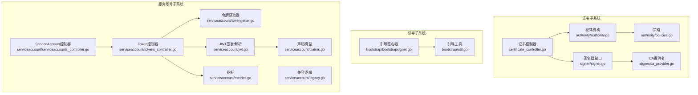
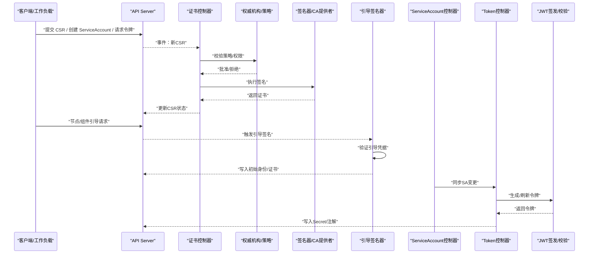
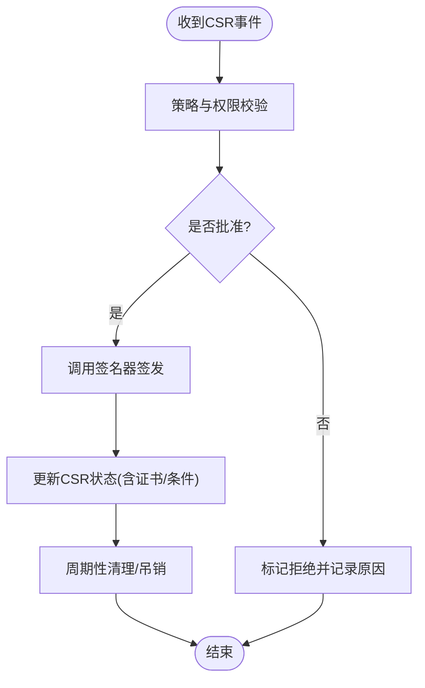
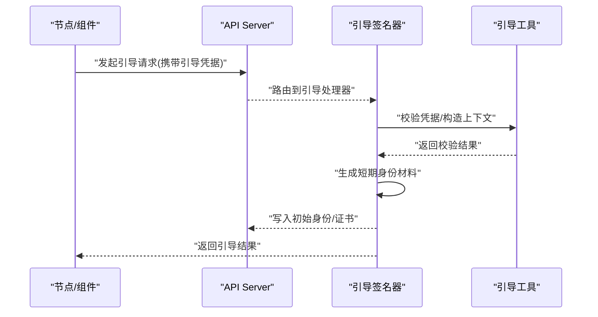
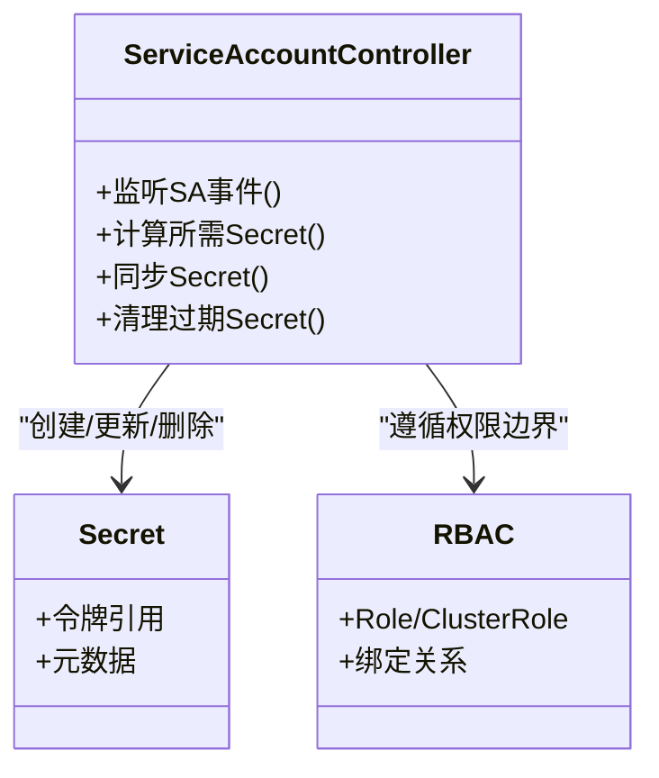
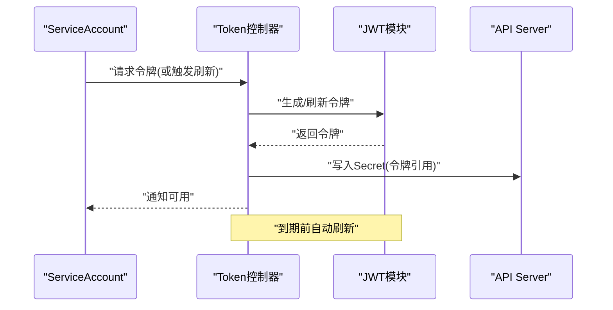
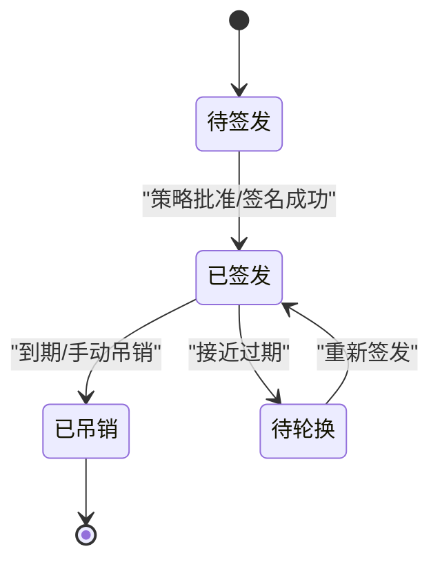
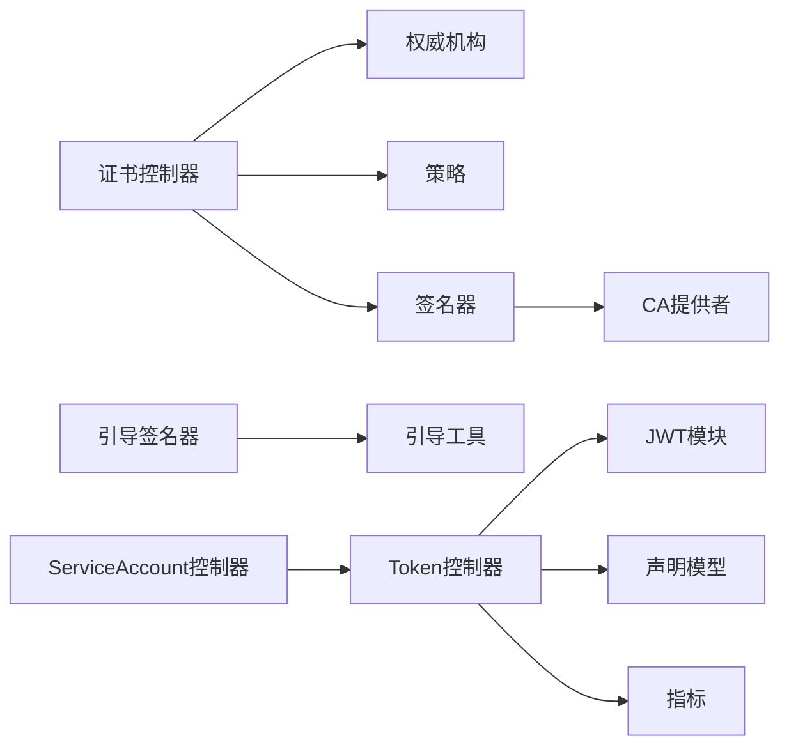

# 安全与证书控制器

<cite>
**本文引用的文件**   
- [certificate_controller.go](file://pkg/controller/certificates/certificate_controller.go)
- [authority.go](file://pkg/controller/certificates/authority/authority.go)
- [policies.go](file://pkg/controller/certificates/authority/policies.go)
- [signer.go](file://pkg/controller/certificates/signer/signer.go)
- [ca_provider.go](file://pkg/controller/certificates/signer/ca_provider.go)
- [bootstrapsigner.go](file://pkg/controller/bootstrap/bootstrapsigner.go)
- [util.go](file://pkg/controller/bootstrap/util.go)
- [serviceaccounts_controller.go](file://pkg/controller/serviceaccount/serviceaccounts_controller.go)
- [tokens_controller.go](file://pkg/controller/serviceaccount/tokens_controller.go)
- [tokengetter.go](file://pkg/controller/serviceaccount/tokengetter.go)
- [jwt.go](file://pkg/serviceaccount/jwt.go)
- [claims.go](file://pkg/serviceaccount/claims.go)
- [legacy.go](file://pkg/serviceaccount/legacy.go)
- [metrics.go](file://pkg/serviceaccount/metrics.go)
- [openapi certificates v1.json](file://api/discovery/apis__certificates.k8s.io__v1.json)
</cite>

## 目录
1. [简介](#简介)
2. [项目结构](#项目结构)
3. [核心组件](#核心组件)
4. [架构总览](#架构总览)
5. [详细组件分析](#详细组件分析)
6. [依赖关系分析](#依赖关系分析)
7. [性能考虑](#性能考虑)
8. [故障排查指南](#故障排查指南)
9. [结论](#结论)
10. [附录](#附录)

## 简介
本技术文档聚焦 Kubernetes 控制平面中与“安全与证书”相关的控制器实现，覆盖以下关键主题：
- 证书控制器（CertificateController）的证书签发、轮换与吊销机制
- BootstrapSigner 的引导签名流程与临时凭证管理
- ServiceAccount 控制器的账户生命周期管理、权限继承与命名空间隔离
- Token 控制器的令牌生成、过期处理与自动刷新机制
- 安全配置最佳实践、证书管理策略与审计日志分析方法
- 安全威胁防护实际案例与应急响应方案

## 项目结构
围绕安全与证书的控制器主要分布在如下目录：
- pkg/controller/certificates：证书控制器及其子模块（审批者、权威机构、清理器、发布者、签名器等）
- pkg/controller/bootstrap：引导签名器与令牌清理器
- pkg/controller/serviceaccount：ServiceAccount 与 Token 控制器
- pkg/serviceaccount：JWT 签发、声明解析与指标等通用能力

图表来源
- [certificate_controller.go](file://pkg/controller/certificates/certificate_controller.go)
- [authority.go](file://pkg/controller/certificates/authority/authority.go)
- [policies.go](file://pkg/controller/certificates/authority/policies.go)
- [signer.go](file://pkg/controller/certificates/signer/signer.go)
- [ca_provider.go](file://pkg/controller/certificates/signer/ca_provider.go)
- [bootstrapsigner.go](file://pkg/controller/bootstrap/bootstrapsigner.go)
- [util.go](file://pkg/controller/bootstrap/util.go)
- [serviceaccounts_controller.go](file://pkg/controller/serviceaccount/serviceaccounts_controller.go)
- [tokens_controller.go](file://pkg/controller/serviceaccount/tokens_controller.go)
- [tokengetter.go](file://pkg/controller/serviceaccount/tokengetter.go)
- [jwt.go](file://pkg/serviceaccount/jwt.go)
- [claims.go](file://pkg/serviceaccount/claims.go)
- [legacy.go](file://pkg/serviceaccount/legacy.go)
- [metrics.go](file://pkg/serviceaccount/metrics.go)

章节来源
- [certificate_controller.go](file://pkg/controller/certificates/certificate_controller.go)
- [authority.go](file://pkg/controller/certificates/authority/authority.go)
- [policies.go](file://pkg/controller/certificates/authority/policies.go)
- [signer.go](file://pkg/controller/certificates/signer/signer.go)
- [ca_provider.go](file://pkg/controller/certificates/signer/ca_provider.go)
- [bootstrapsigner.go](file://pkg/controller/bootstrap/bootstrapsigner.go)
- [util.go](file://pkg/controller/bootstrap/util.go)
- [serviceaccounts_controller.go](file://pkg/controller/serviceaccount/serviceaccounts_controller.go)
- [tokens_controller.go](file://pkg/controller/serviceaccount/tokens_controller.go)
- [tokengetter.go](file://pkg/controller/serviceaccount/tokengetter.go)
- [jwt.go](file://pkg/serviceaccount/jwt.go)
- [claims.go](file://pkg/serviceaccount/claims.go)
- [legacy.go](file://pkg/serviceaccount/legacy.go)
- [metrics.go](file://pkg/serviceaccount/metrics.go)

## 核心组件
- 证书控制器：监听 CertificateSigningRequest（CSR），协调审批、签名、状态更新与清理。
- 权威机构与策略：封装 CA 能力与签发策略，决定可签发的主体、用途与有效期。
- 签名器与 CA 提供者：抽象签名过程，支持多种 CA 后端。
- 引导签名器：在节点或组件首次加入集群时，基于引导凭据完成初始身份建立。
- ServiceAccount 控制器：维护 ServiceAccount 资源，联动 Secret 与 RBAC 权限边界。
- Token 控制器：为 ServiceAccount 生成、轮换与清理绑定令牌，提供自动刷新语义。
- JWT 与声明：负责外部 JWT 的签发、校验与声明映射，支撑无状态鉴权。

章节来源
- [certificate_controller.go](file://pkg/controller/certificates/certificate_controller.go)
- [authority.go](file://pkg/controller/certificates/authority/authority.go)
- [policies.go](file://pkg/controller/certificates/authority/policies.go)
- [signer.go](file://pkg/controller/certificates/signer/signer.go)
- [ca_provider.go](file://pkg/controller/certificates/signer/ca_provider.go)
- [bootstrapsigner.go](file://pkg/controller/bootstrap/bootstrapsigner.go)
- [util.go](file://pkg/controller/bootstrap/util.go)
- [serviceaccounts_controller.go](file://pkg/controller/serviceaccount/serviceaccounts_controller.go)
- [tokens_controller.go](file://pkg/controller/serviceaccount/tokens_controller.go)
- [tokengetter.go](file://pkg/controller/serviceaccount/tokengetter.go)
- [jwt.go](file://pkg/serviceaccount/jwt.go)
- [claims.go](file://pkg/serviceaccount/claims.go)
- [legacy.go](file://pkg/serviceaccount/legacy.go)
- [metrics.go](file://pkg/serviceaccount/metrics.go)

## 架构总览
下图展示了证书、引导与服务账号/令牌三大子系统之间的交互关系与控制面数据流。

图表来源
- [certificate_controller.go](file://pkg/controller/certificates/certificate_controller.go)
- [authority.go](file://pkg/controller/certificates/authority/authority.go)
- [policies.go](file://pkg/controller/certificates/authority/policies.go)
- [signer.go](file://pkg/controller/certificates/signer/signer.go)
- [ca_provider.go](file://pkg/controller/certificates/signer/ca_provider.go)
- [bootstrapsigner.go](file://pkg/controller/bootstrap/bootstrapsigner.go)
- [util.go](file://pkg/controller/bootstrap/util.go)
- [serviceaccounts_controller.go](file://pkg/controller/serviceaccount/serviceaccounts_controller.go)
- [tokens_controller.go](file://pkg/controller/serviceaccount/tokens_controller.go)
- [jwt.go](file://pkg/serviceaccount/jwt.go)

## 详细组件分析

### 证书控制器：签发、轮换与吊销
- 职责
  - 监听并处理 CSR 事件，依据策略进行审批与拒签。
  - 调用签名器完成证书签发，并将结果写回 API Server。
  - 根据策略与生命周期条件执行轮换与吊销。
- 关键流程
  - 准入与策略校验：由权威机构与策略模块共同判定是否允许签发、签发范围与有效期。
  - 签名执行：通过签名器接口委托具体 CA 提供者完成私钥使用与证书生成。
  - 状态更新：将已签发证书、拒绝原因与条件写入 CSR 状态。
  - 清理与回收：对过期或不再需要的 CSR 执行清理，避免资源膨胀。
- 设计要点
  - 解耦策略与实现：策略层仅定义规则，签名器层专注密码学操作。
  - 幂等与重试：对并发更新与网络异常具备容错能力。
  - 可观测性：记录关键指标与事件，便于排障与审计。

图表来源
- [certificate_controller.go](file://pkg/controller/certificates/certificate_controller.go)
- [authority.go](file://pkg/controller/certificates/authority/authority.go)
- [policies.go](file://pkg/controller/certificates/authority/policies.go)
- [signer.go](file://pkg/controller/certificates/signer/signer.go)
- [ca_provider.go](file://pkg/controller/certificates/signer/ca_provider.go)

章节来源
- [certificate_controller.go](file://pkg/controller/certificates/certificate_controller.go)
- [authority.go](file://pkg/controller/certificates/authority/authority.go)
- [policies.go](file://pkg/controller/certificates/authority/policies.go)
- [signer.go](file://pkg/controller/certificates/signer/signer.go)
- [ca_provider.go](file://pkg/controller/certificates/signer/ca_provider.go)

### BootstrapSigner：引导签名与临时凭证
- 职责
  - 在节点或组件首次加入集群时，基于受控的引导凭据完成初始身份建立。
  - 限制引导流程的作用域与有效期，防止长期高权限泄露。
- 关键流程
  - 接收引导请求，校验引导凭据与上下文。
  - 生成短期身份材料（如证书或令牌），并写入必要资源。
  - 记录审计信息，确保可追溯。
- 安全要点
  - 最小权限：仅授予必要的初始角色与范围。
  - 短生命周期：引导产物应设置较短 TTL，强制后续轮换。
  - 强校验：严格校验引导凭据来源与完整性。

图表来源
- [bootstrapsigner.go](file://pkg/controller/bootstrap/bootstrapsigner.go)
- [util.go](file://pkg/controller/bootstrap/util.go)

章节来源
- [bootstrapsigner.go](file://pkg/controller/bootstrap/bootstrapsigner.go)
- [util.go](file://pkg/controller/bootstrap/util.go)

### ServiceAccount 控制器：生命周期、权限继承与命名空间隔离
- 职责
  - 维护 ServiceAccount 资源的期望状态，确保关联 Secret 与注解一致。
  - 配合 RBAC 实现权限继承与最小化授权。
  - 保障跨命名空间的访问边界。
- 关键流程
  - 监听 SA 变更，计算所需 Secret 集合。
  - 同步 Secret 内容（包含令牌引用），并更新 SA 状态。
  - 清理孤立或过期的 Secret，保持资源整洁。
- 权限与隔离
  - 通过 RBAC Role/ClusterRole 限定 SA 的能力集。
  - 命名空间作为默认隔离边界，跨命名空间需显式授权。

图表来源
- [serviceaccounts_controller.go](file://pkg/controller/serviceaccount/serviceaccounts_controller.go)

章节来源
- [serviceaccounts_controller.go](file://pkg/controller/serviceaccount/serviceaccounts_controller.go)

### Token 控制器：生成、过期与自动刷新
- 职责
  - 为 ServiceAccount 生成绑定令牌，管理其生命周期与刷新。
  - 与 JWT 模块协作，支持外部 JWT 场景下的签发与校验。
- 关键流程
  - 当 SA 需要令牌时，生成短期令牌并写入 Secret。
  - 监控令牌过期时间，提前触发刷新。
  - 清理不再使用的旧令牌，降低泄露风险。
- 自动刷新
  - 基于 TTL 与阈值策略，在到期前主动刷新，保证业务连续性。
  - 结合指标与事件，暴露刷新成功率与延迟。

图表来源
- [tokens_controller.go](file://pkg/controller/serviceaccount/tokens_controller.go)
- [tokengetter.go](file://pkg/controller/serviceaccount/tokengetter.go)
- [jwt.go](file://pkg/serviceaccount/jwt.go)
- [claims.go](file://pkg/serviceaccount/claims.go)
- [metrics.go](file://pkg/serviceaccount/metrics.go)

章节来源
- [tokens_controller.go](file://pkg/controller/serviceaccount/tokens_controller.go)
- [tokengetter.go](file://pkg/controller/serviceaccount/tokengetter.go)
- [jwt.go](file://pkg/serviceaccount/jwt.go)
- [claims.go](file://pkg/serviceaccount/claims.go)
- [metrics.go](file://pkg/serviceaccount/metrics.go)

### 概念总览：令牌与证书的生命周期对比
- 令牌
  - 短生命周期，适合频繁刷新与细粒度授权。
  - 通常以 Secret 引用形式挂载至 Pod。
- 证书
  - 用于双向 TLS 或身份证明，生命周期较长但需定期轮换。
  - 通过 CSR 流程集中管控签发与吊销。

[此图为概念示意，不直接对应具体源码文件]

## 依赖关系分析
- 证书控制器依赖权威机构与策略模块进行准入判断，并通过签名器接口与 CA 提供者完成密码学操作。
- 引导签名器依赖工具函数进行凭据校验与上下文构建。
- ServiceAccount 控制器与 Token 控制器协同工作，前者关注资源同步，后者关注令牌生命周期。
- JWT 模块提供统一的签发与校验能力，被 Token 控制器复用。

图表来源
- [certificate_controller.go](file://pkg/controller/certificates/certificate_controller.go)
- [authority.go](file://pkg/controller/certificates/authority/authority.go)
- [policies.go](file://pkg/controller/certificates/authority/policies.go)
- [signer.go](file://pkg/controller/certificates/signer/signer.go)
- [ca_provider.go](file://pkg/controller/certificates/signer/ca_provider.go)
- [bootstrapsigner.go](file://pkg/controller/bootstrap/bootstrapsigner.go)
- [util.go](file://pkg/controller/bootstrap/util.go)
- [serviceaccounts_controller.go](file://pkg/controller/serviceaccount/serviceaccounts_controller.go)
- [tokens_controller.go](file://pkg/controller/serviceaccount/tokens_controller.go)
- [jwt.go](file://pkg/serviceaccount/jwt.go)
- [claims.go](file://pkg/serviceaccount/claims.go)
- [metrics.go](file://pkg/serviceaccount/metrics.go)

章节来源
- [certificate_controller.go](file://pkg/controller/certificates/certificate_controller.go)
- [authority.go](file://pkg/controller/certificates/authority/authority.go)
- [policies.go](file://pkg/controller/certificates/authority/policies.go)
- [signer.go](file://pkg/controller/certificates/signer/signer.go)
- [ca_provider.go](file://pkg/controller/certificates/signer/ca_provider.go)
- [bootstrapsigner.go](file://pkg/controller/bootstrap/bootstrapsigner.go)
- [util.go](file://pkg/controller/bootstrap/util.go)
- [serviceaccounts_controller.go](file://pkg/controller/serviceaccount/serviceaccounts_controller.go)
- [tokens_controller.go](file://pkg/controller/serviceaccount/tokens_controller.go)
- [jwt.go](file://pkg/serviceaccount/jwt.go)
- [claims.go](file://pkg/serviceaccount/claims.go)
- [metrics.go](file://pkg/serviceaccount/metrics.go)

## 性能考虑
- 批处理与去重：对高频事件进行合并与去重，减少 API 压力。
- 缓存与索引：对常用查询（如 SA 与 Secret 映射）进行缓存，提升响应速度。
- 异步与超时：签名与网络操作采用异步与超时控制，避免阻塞主循环。
- 指标与告警：暴露关键指标（签发成功率、刷新延迟、错误率），及时发现问题。

[本节为通用指导，无需源码引用]

## 故障排查指南
- 证书签发失败
  - 检查策略是否允许该主体与用途；查看 CSR 状态与拒绝原因。
  - 确认签名器与 CA 提供者可达且密钥有效。
- 引导失败
  - 核对引导凭据是否正确、未过期；检查引导工具返回的错误码。
- 令牌无法刷新
  - 观察 Token 控制器指标与事件；确认 SA 存在且未被删除。
  - 检查 JWT 模块配置与密钥轮换状态。
- 权限不足
  - 审查 RBAC 绑定，确保 SA 具备所需的最小权限。
  - 确认命名空间隔离策略未阻断预期访问。

章节来源
- [certificate_controller.go](file://pkg/controller/certificates/certificate_controller.go)
- [authority.go](file://pkg/controller/certificates/authority/authority.go)
- [policies.go](file://pkg/controller/certificates/authority/policies.go)
- [signer.go](file://pkg/controller/certificates/signer/signer.go)
- [bootstrapsigner.go](file://pkg/controller/bootstrap/bootstrapsigner.go)
- [util.go](file://pkg/controller/bootstrap/util.go)
- [serviceaccounts_controller.go](file://pkg/controller/serviceaccount/serviceaccounts_controller.go)
- [tokens_controller.go](file://pkg/controller/serviceaccount/tokens_controller.go)
- [jwt.go](file://pkg/serviceaccount/jwt.go)
- [metrics.go](file://pkg/serviceaccount/metrics.go)

## 结论
通过对证书控制器、引导签名器、ServiceAccount 与 Token 控制器的深入分析，可以形成一套完整的安全与证书管理体系：
- 以策略驱动的证书签发与吊销，确保身份材料的可控性与可追溯性。
- 以引导流程快速建立初始身份，并以短期凭证降低风险。
- 以 SA 与 RBAC 为基础，实现细粒度的权限管理与命名空间隔离。
- 以令牌自动化刷新与清理，保障业务连续性与安全性。

[本节为总结，无需源码引用]

## 附录
- API 参考
  - 证书相关 API 定义可在发现文档中查阅：
    - [openapi certificates v1.json](file://api/discovery/apis__certificates.k8s.io__v1.json)

章节来源
- [openapi certificates v1.json](file://api/discovery/apis__certificates.k8s.io__v1.json)