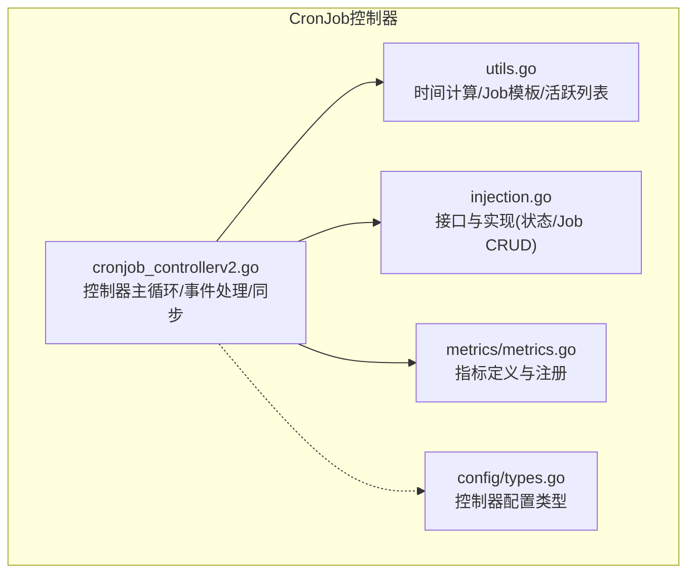
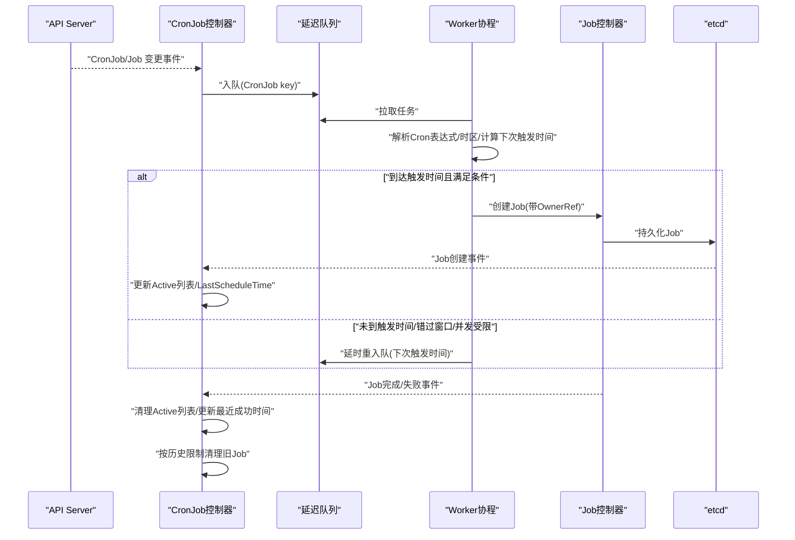
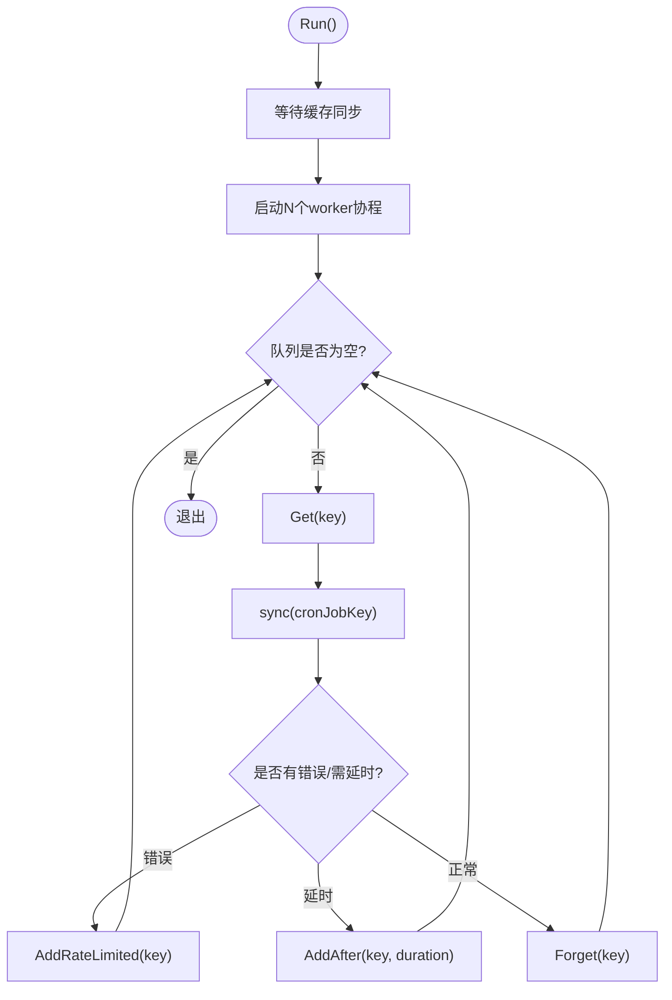
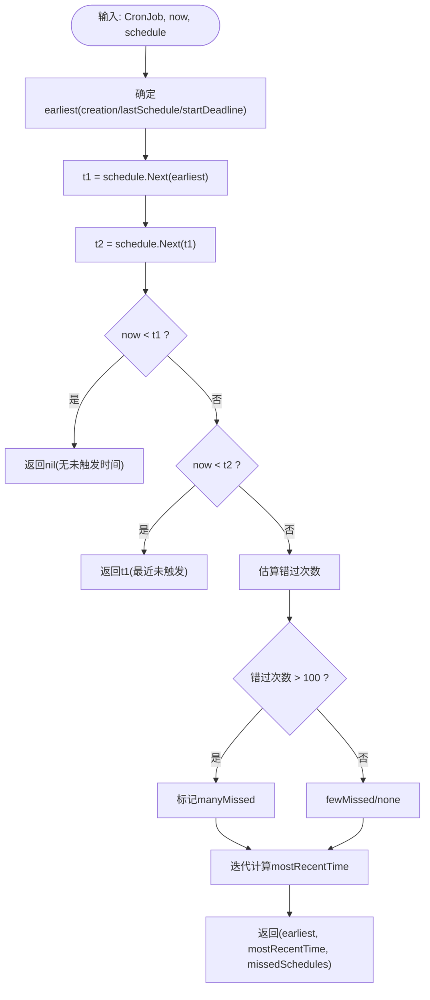
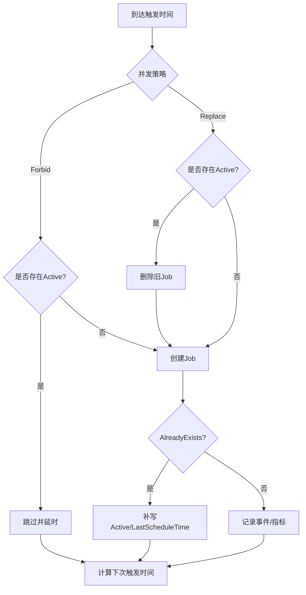
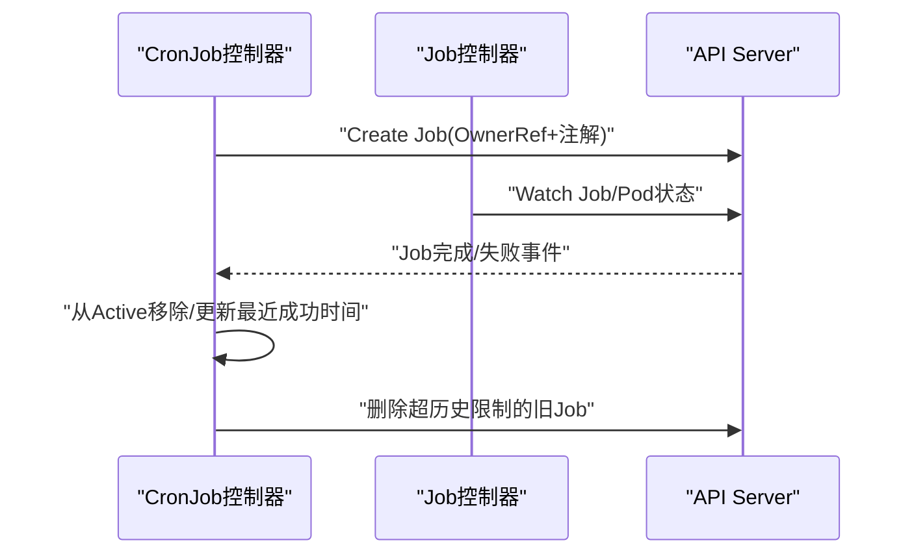
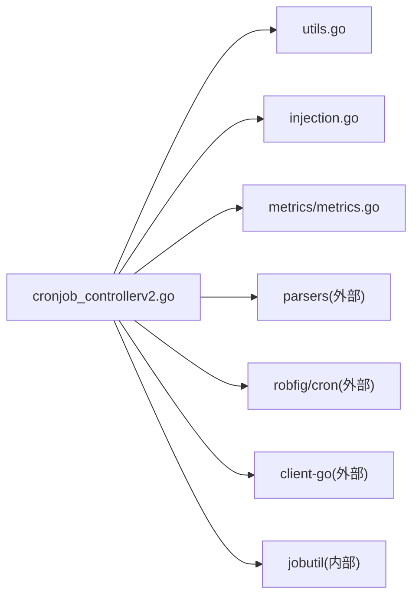

# CronJob控制器

<cite>
**本文引用的文件**   
- [cronjob_controllerv2.go](file://pkg/controller/cronjob/cronjob_controllerv2.go)
- [utils.go](file://pkg/controller/cronjob/utils.go)
- [injection.go](file://pkg/controller/cronjob/injection.go)
- [metrics/metrics.go](file://pkg/controller/cronjob/metrics/metrics.go)
- [config/types.go](file://pkg/controller/cronjob/config/types.go)
</cite>

## 目录
1. [简介](#简介)
2. [项目结构](#项目结构)
3. [核心组件](#核心组件)
4. [架构总览](#架构总览)
5. [详细组件分析](#详细组件分析)
6. [依赖关系分析](#依赖关系分析)
7. [性能与并发特性](#性能与并发特性)
8. [监控指标与日志](#监控指标与日志)
9. [故障诊断指南](#故障诊断指南)
10. [结论](#结论)

## 简介
本文件面向Kubernetes CronJob控制器的实现，系统性阐述其定时任务调度机制、Cron表达式解析与时区处理、时间戳计算、并发策略、Job创建/执行/清理生命周期、保留策略与过期任务处理、与Job控制器的协作关系、以及队列管理与可观测性。文档同时提供配置示例、时区设置建议与调度优化方案，帮助读者在生产环境中正确部署与调优CronJob控制器。

## 项目结构
CronJob控制器位于控制器包下，核心文件包括：
- 控制器主循环与同步逻辑
- 工具函数（时间计算、Job模板生成、活跃列表操作）
- 接口抽象与真实实现（用于测试与生产）
- 指标注册与定义
- 控制器配置类型

图表来源
- [cronjob_controllerv2.go:1-120](file://pkg/controller/cronjob/cronjob_controllerv2.go#L1-L120)
- [utils.go:1-120](file://pkg/controller/cronjob/utils.go#L1-L120)
- [injection.go:1-120](file://pkg/controller/cronjob/injection.go#L1-L120)
- [metrics/metrics.go:1-48](file://pkg/controller/cronjob/metrics/metrics.go#L1-L48)
- [config/types.go:1-27](file://pkg/controller/cronjob/config/types.go#L1-L27)

章节来源
- [cronjob_controllerv2.go:1-120](file://pkg/controller/cronjob/cronjob_controllerv2.go#L1-L120)
- [utils.go:1-120](file://pkg/controller/cronjob/utils.go#L1-L120)
- [injection.go:1-120](file://pkg/controller/cronjob/injection.go#L1-L120)
- [metrics/metrics.go:1-48](file://pkg/controller/cronjob/metrics/metrics.go#L1-L48)
- [config/types.go:1-27](file://pkg/controller/cronjob/config/types.go#L1-L27)

## 核心组件
- 控制器主循环与事件驱动
  - 使用延迟队列与Informer监听CronJob与Job变化，按工作协程并行处理。
  - 关键流程：入队→worker拉取→sync→根据结果决定重试或延时重入队。
- 调度与时间计算
  - 基于robfig/cron解析Cron表达式；支持spec.timeZone与schedule中的TZ扩展；计算最近未触发时间与下次重入队间隔。
- Job生命周期管理
  - 根据并发策略决定是否创建新Job；维护Active列表；完成/失败后更新状态并清理历史Job。
- 保留策略与清理
  - 成功/失败历史数量限制；按开始时间排序删除最旧Job；从Active列表移除引用。
- 与Job控制器协作
  - 通过OwnerReference建立父子关系；Job控制器负责Pod编排与最终状态上报。
- 指标与事件
  - 暴露创建倾斜指标；记录各类事件便于排障。

章节来源
- [cronjob_controllerv2.go:156-260](file://pkg/controller/cronjob/cronjob_controllerv2.go#L156-L260)
- [utils.go:183-223](file://pkg/controller/cronjob/utils.go#L183-L223)
- [injection.go:79-110](file://pkg/controller/cronjob/injection.go#L79-L110)
- [metrics/metrics.go:26-48](file://pkg/controller/cronjob/metrics/metrics.go#L26-L48)

## 架构总览
CronJob控制器通过Informer监听CronJob和Job资源变更，将需要处理的对象放入延迟队列；多个worker并行消费队列项，执行同步逻辑：解析调度计划、判断是否错过启动窗口、应用并发策略、创建Job并更新状态；随后在Job完成后由事件回调更新Active列表与最近成功时间；周期性清理超出历史限制的已完成Job。

图表来源
- [cronjob_controllerv2.go:156-260](file://pkg/controller/cronjob/cronjob_controllerv2.go#L156-L260)
- [cronjob_controllerv2.go:448-696](file://pkg/controller/cronjob/cronjob_controllerv2.go#L448-L696)
- [utils.go:183-223](file://pkg/controller/cronjob/utils.go#L183-L223)
- [injection.go:79-110](file://pkg/controller/cronjob/injection.go#L79-L110)

## 详细组件分析

### 控制器主循环与事件处理
- 初始化
  - 创建延迟队列、事件广播器与Recorder、Job/CronJob Lister与Indexer、注册指标。
  - 为Job与CronJob Informer添加事件处理器；为Job索引增加ControllerUID索引以便快速查找子Job。
- 运行
  - 等待缓存同步后启动若干worker协程，每个协程循环从队列拉取任务并调用processNextWorkItem。
- 同步入口
  - 根据key获取CronJob，加载其所有子Job，先进行已完成Job的清理，再执行主同步逻辑；必要时批量更新状态。
- 事件处理
  - Job新增/更新/删除均会反查其ControllerRef对应的CronJob并重新入队；CronJob spec.schedule或timeZone变更时，按新的下次触发时间延时入队。

图表来源
- [cronjob_controllerv2.go:156-211](file://pkg/controller/cronjob/cronjob_controllerv2.go#L156-L211)
- [cronjob_controllerv2.go:213-260](file://pkg/controller/cronjob/cronjob_controllerv2.go#L213-L260)
- [cronjob_controllerv2.go:300-442](file://pkg/controller/cronjob/cronjob_controllerv2.go#L300-L442)

章节来源
- [cronjob_controllerv2.go:88-154](file://pkg/controller/cronjob/cronjob_controllerv2.go#L88-L154)
- [cronjob_controllerv2.go:156-211](file://pkg/controller/cronjob/cronjob_controllerv2.go#L156-L211)
- [cronjob_controllerv2.go:213-260](file://pkg/controller/cronjob/cronjob_controllerv2.go#L213-L260)
- [cronjob_controllerv2.go:300-442](file://pkg/controller/cronjob/cronjob_controllerv2.go#L300-L442)

### 调度与时间计算
- Cron表达式解析
  - 使用robfig/cron库解析标准Cron表达式；当spec.timeZone存在时，以该时区格式化schedule；若schedule中包含TZ关键字则发出警告但仍尝试解析。
- 最近未触发时间计算
  - mostRecentScheduleTime：基于CronJob创建时间或上次调度时间，结合StartingDeadlineSeconds确定最早回溯点；计算t1=Next(earliest)、t2=Next(t1)，判断now相对t1/t2的位置，得到最近未触发时间；对“大量错过”场景进行分类提示。
- 下次重入队间隔
  - nextScheduleTimeDuration：基于mostRecentScheduleTime与schedule.Next计算下一次触发时间，并加上固定偏移以避免NTP抖动导致漏调度。
- 时区处理
  - 优先使用spec.timeZone；若无效则回退到原始schedule；schedule中显式包含TZ字段时会告警不正式支持。

图表来源
- [utils.go:100-181](file://pkg/controller/cronjob/utils.go#L100-L181)
- [utils.go:183-205](file://pkg/controller/cronjob/utils.go#L183-L205)
- [utils.go:207-223](file://pkg/controller/cronjob/utils.go#L207-L223)
- [cronjob_controllerv2.go:788-807](file://pkg/controller/cronjob/cronjob_controllerv2.go#L788-L807)

章节来源
- [utils.go:100-181](file://pkg/controller/cronjob/utils.go#L100-L181)
- [utils.go:183-205](file://pkg/controller/cronjob/utils.go#L183-L205)
- [utils.go:207-223](file://pkg/controller/cronjob/utils.go#L207-L223)
- [cronjob_controllerv2.go:788-807](file://pkg/controller/cronjob/cronjob_controllerv2.go#L788-L807)

### 并发策略与冲突处理
- ForbidConcurrent
  - 若已有Active任务，则跳过本次调度，记录事件并延时到下一个触发时间。
- ReplaceConcurrent
  - 若已有Active任务，则在创建新Job前删除正在运行的Job，确保仅保留最新一次执行。
- 幂等性与重复保护
  - Job名称基于调度时间的分钟级哈希，避免同一时刻重复创建；若Create返回AlreadyExists，则视为已存在并由控制器补写Active列表与状态。

图表来源
- [cronjob_controllerv2.go:595-696](file://pkg/controller/cronjob/cronjob_controllerv2.go#L595-L696)
- [utils.go:241-272](file://pkg/controller/cronjob/utils.go#L241-L272)

章节来源
- [cronjob_controllerv2.go:595-696](file://pkg/controller/cronjob/cronjob_controllerv2.go#L595-L696)
- [utils.go:241-272](file://pkg/controller/cronjob/utils.go#L241-L272)

### Job创建、执行与清理生命周期
- 创建
  - 根据CronJob模板生成Job，附加OwnerReference与调度时间注解；若命名空间终止则直接返回错误；若已存在则走幂等路径。
- 执行
  - 由Job控制器负责Pod调度与执行；CronJob控制器关注Job状态变更事件。
- 清理
  - 完成/失败后从Active列表移除；更新LastSuccessfulTime；按成功/失败历史限制删除最旧的已完成Job。

图表来源
- [cronjob_controllerv2.go:625-696](file://pkg/controller/cronjob/cronjob_controllerv2.go#L625-L696)
- [cronjob_controllerv2.go:702-767](file://pkg/controller/cronjob/cronjob_controllerv2.go#L702-L767)
- [injection.go:91-110](file://pkg/controller/cronjob/injection.go#L91-L110)

章节来源
- [cronjob_controllerv2.go:625-696](file://pkg/controller/cronjob/cronjob_controllerv2.go#L625-L696)
- [cronjob_controllerv2.go:702-767](file://pkg/controller/cronjob/cronjob_controllerv2.go#L702-L767)
- [injection.go:91-110](file://pkg/controller/cronjob/injection.go#L91-L110)

### 与Job控制器的协作关系
- 所有权模型
  - CronJob作为Job的OwnerReference，Job控制器据此管理Pod及最终状态。
- 状态同步
  - CronJob控制器维护Active列表与最近成功时间；Job控制器负责实际执行与状态上报。
- 删除传播
  - 删除Job时使用Background传播策略，确保级联删除Pod等资源。

章节来源
- [utils.go:241-267](file://pkg/controller/cronjob/utils.go#L241-L267)
- [injection.go:91-110](file://pkg/controller/cronjob/injection.go#L91-L110)

### 任务队列与索引
- 队列
  - 使用带速率限制的延迟队列，支持AddAfter与AddRateLimited，保障高负载下的稳定性。
- 索引
  - 为Job资源建立ControllerUID索引，便于快速定位某CronJob的所有子Job。

章节来源
- [cronjob_controllerv2.go:88-154](file://pkg/controller/cronjob/cronjob_controllerv2.go#L88-L154)
- [cronjob_controllerv2.go:262-277](file://pkg/controller/cronjob/cronjob_controllerv2.go#L262-L277)

## 依赖关系分析
- 外部库
  - robfig/cron：Cron表达式解析与时间计算。
  - client-go：Informer/Lister/Clientset、事件与队列。
  - component-base/metrics：指标定义与注册。
- 内部依赖
  - jobutil：Job完成状态判定与条件提取。
  - parsers：Cron表达式解析封装与panic恢复。
  - metrics：控制器自定义指标。

图表来源
- [cronjob_controllerv2.go:17-51](file://pkg/controller/cronjob/cronjob_controllerv2.go#L17-L51)
- [utils.go:19-33](file://pkg/controller/cronjob/utils.go#L19-L33)
- [metrics/metrics.go:19-24](file://pkg/controller/cronjob/metrics/metrics.go#L19-L24)

章节来源
- [cronjob_controllerv2.go:17-51](file://pkg/controller/cronjob/cronjob_controllerv2.go#L17-L51)
- [utils.go:19-33](file://pkg/controller/cronjob/utils.go#L19-L33)
- [metrics/metrics.go:19-24](file://pkg/controller/cronjob/metrics/metrics.go#L19-L24)

## 性能与并发特性
- 并发度
  - 控制器配置类型包含ConcurrentCronJobSyncs，用于控制同步协程数量；默认由控制器管理器启动参数决定。
- 队列与速率限制
  - 使用带速率限制的延迟队列，避免瞬时风暴；对错误项指数退避重试。
- 时间抖动容错
  - 下次重入队时间增加固定偏移，降低NTP漂移导致的漏调度风险。
- 大规模错过处理
  - 对错过次数超过阈值的场景分类提示，避免CPU/内存被大量补调度拖垮。

章节来源
- [config/types.go:19-26](file://pkg/controller/cronjob/config/types.go#L19-L26)
- [cronjob_controllerv2.go:156-211](file://pkg/controller/cronjob/cronjob_controllerv2.go#L156-L211)
- [utils.go:183-205](file://pkg/controller/cronjob/utils.go#L183-L205)
- [utils.go:169-181](file://pkg/controller/cronjob/utils.go#L169-L181)

## 监控指标与日志
- 指标
  - cronjob_controller_job_creation_skew_duration_seconds：记录“计划触发时间”与“实际Job创建时间”的偏差分布，用于评估调度延迟。
- 事件
  - 常见事件包括：UnparseableSchedule、InvalidSchedule、TooManyMissedTimes、MissSchedule、JobAlreadyActive、SuccessfulCreate、FailedCreate、MissingJob、SawCompletedJob、SuccessfulDelete、FailedDelete等。
- 日志
  - 关键路径均有klog日志输出，涵盖解析、调度、创建、删除与异常场景。

章节来源
- [metrics/metrics.go:26-48](file://pkg/controller/cronjob/metrics/metrics.go#L26-L48)
- [cronjob_controllerv2.go:420-442](file://pkg/controller/cronjob/cronjob_controllerv2.go#L420-L442)
- [cronjob_controllerv2.go:541-585](file://pkg/controller/cronjob/cronjob_controllerv2.go#L541-L585)
- [cronjob_controllerv2.go:625-696](file://pkg/controller/cronjob/cronjob_controllerv2.go#L625-L696)
- [cronjob_controllerv2.go:702-767](file://pkg/controller/cronjob/cronjob_controllerv2.go#L702-L767)

## 故障诊断指南
- 无法解析Cron表达式
  - 检查spec.schedule语法；若包含TZ关键字会收到不支持告警；确认spec.timeZone有效。
- 错过多次调度
  - 调整spec.startingDeadlineSeconds或检查系统时钟漂移；控制器会对过多错过发出警告事件。
- 并发冲突
  - Forbid模式下若已有Active任务将被跳过；Replace模式会在创建新Job前删除旧任务。
- Job未创建或重复创建
  - 检查命名空间是否处于终止状态；确认Job命名基于调度时间分钟哈希的幂等性；查看AlreadyExists分支的状态补写逻辑。
- Active列表不一致
  - 若Job缺失但仍在Active列表，控制器会主动清理并从API校验；若Job不存在于Lister但在API存在，也会修正状态。

章节来源
- [cronjob_controllerv2.go:420-442](file://pkg/controller/cronjob/cronjob_controllerv2.go#L420-L442)
- [cronjob_controllerv2.go:541-585](file://pkg/controller/cronjob/cronjob_controllerv2.go#L541-L585)
- [cronjob_controllerv2.go:595-696](file://pkg/controller/cronjob/cronjob_controllerv2.go#L595-L696)
- [cronjob_controllerv2.go:496-518](file://pkg/controller/cronjob/cronjob_controllerv2.go#L496-L518)

## 结论
CronJob控制器通过稳健的事件驱动与延迟队列机制，结合robfig/cron的时间计算能力，实现了可靠的定时任务调度。其并发策略、幂等命名、Active列表与历史清理策略共同保障了系统的稳定性与一致性。配合完善的指标与事件，可在生产环境中进行有效的监控与排障。建议合理配置startingDeadlineSeconds、history limits与并发度，并结合时区设置与NTP校准，以获得最佳调度效果。