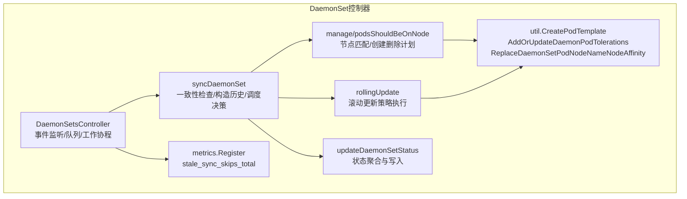
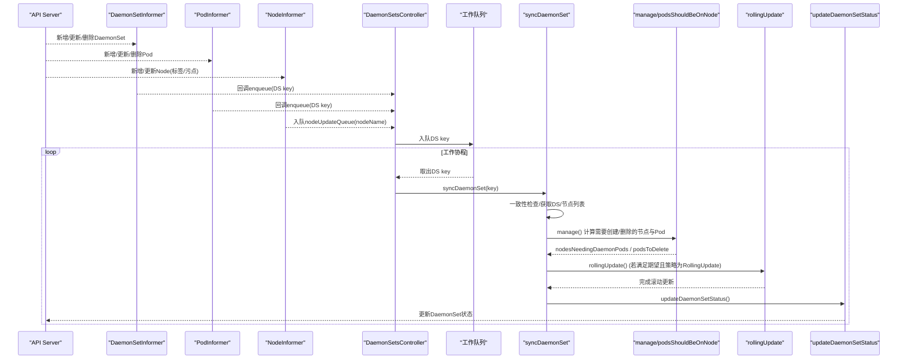
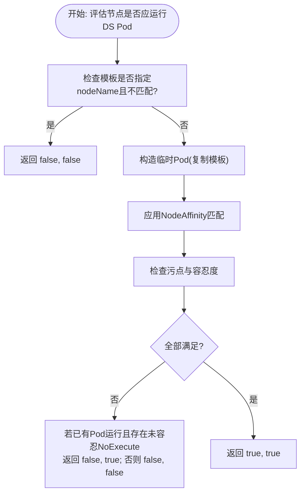
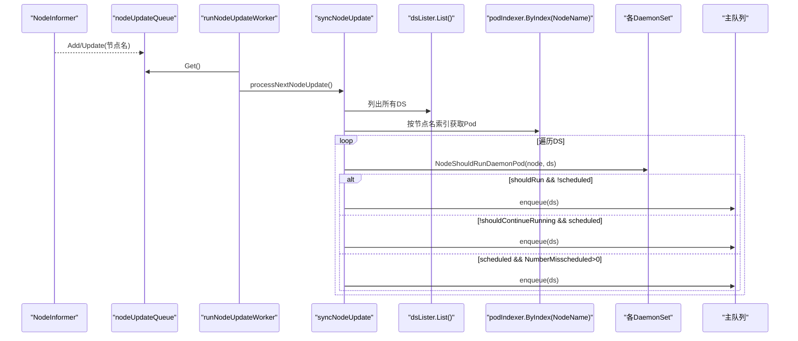
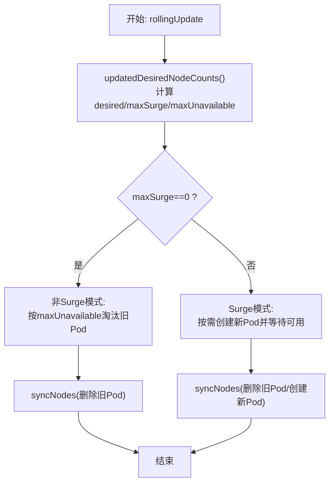
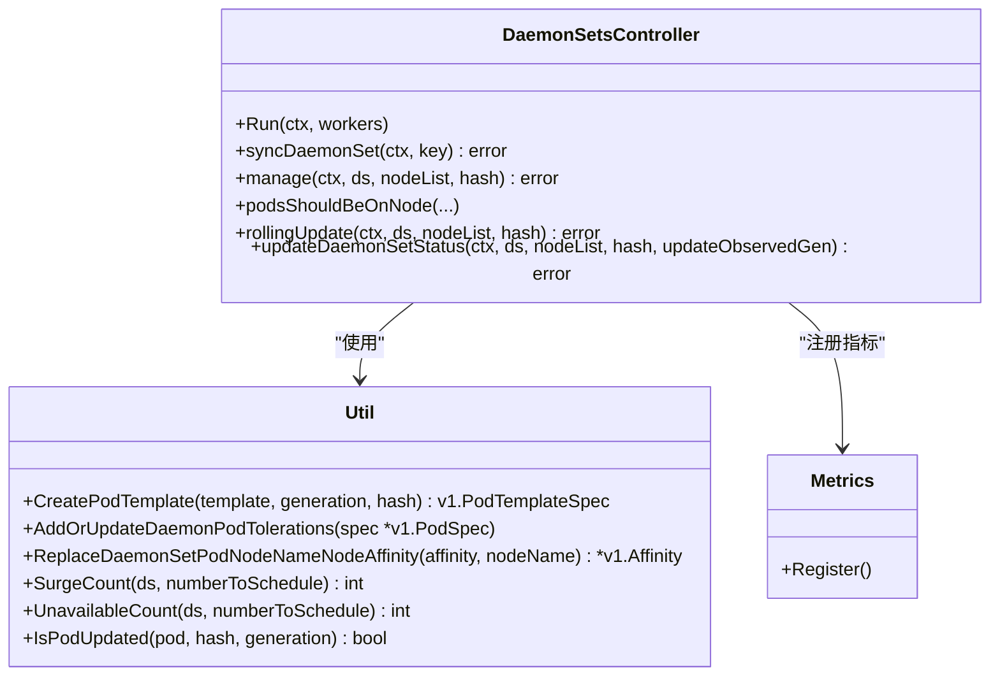

# DaemonSet控制器

<cite>
**本文引用的文件列表**
- [daemon_controller.go](file://pkg/controller/daemon/daemon_controller.go)
- [update.go](file://pkg/controller/daemon/update.go)
- [daemonset_util.go](file://pkg/controller/daemon/util/daemonset_util.go)
- [metrics.go](file://pkg/controller/daemon/metrics/metrics.go)
</cite>

## 目录
1. [简介](#简介)
2. [项目结构](#项目结构)
3. [核心组件](#核心组件)
4. [架构总览](#架构总览)
5. [详细组件分析](#详细组件分析)
6. [依赖关系分析](#依赖关系分析)
7. [性能与可扩展性](#性能与可扩展性)
8. [故障诊断指南](#故障诊断指南)
9. [结论](#结论)
10. [附录：配置示例与最佳实践](#附录配置示例与最佳实践)

## 简介
本文件面向Kubernetes DaemonSet控制器的实现，聚焦以下主题：
- 节点匹配算法：节点选择器、容忍度与亲和性的处理逻辑
- 新节点加入时的Pod自动部署机制与节点移除时的清理流程
- 滚动更新策略的实现细节（MaxSurge/MaxUnavailable）
- 与节点生命周期管理的集成
- 监控指标与性能调优建议
- 常见配置示例与排障方法

## 项目结构
DaemonSet控制器位于控制器管理器中，核心代码集中在以下文件：
- 主控制器与事件循环、调度判定、状态维护等：daemon_controller.go
- 滚动更新、历史版本管理、期望计数与批量创建/删除：update.go
- 工具函数（模板生成、容忍度注入、目标节点亲和替换、计数计算等）：util/daemonset_util.go
- 控制器指标注册：metrics/metrics.go

图表来源
- [daemon_controller.go:157-291](file://pkg/controller/daemon/daemon_controller.go#L157-L291)
- [daemon_controller.go:1270-1371](file://pkg/controller/daemon/daemon_controller.go#L1270-L1371)
- [daemon_controller.go:994-1027](file://pkg/controller/daemon/daemon_controller.go#L994-L1027)
- [update.go:44-260](file://pkg/controller/daemon/update.go#L44-L260)
- [daemonset_util.go:103-123](file://pkg/controller/daemon/util/daemonset_util.go#L103-L123)
- [metrics.go:44-48](file://pkg/controller/daemon/metrics/metrics.go#L44-L48)

章节来源
- [daemon_controller.go:157-291](file://pkg/controller/daemon/daemon_controller.go#L157-L291)
- [update.go:44-260](file://pkg/controller/daemon/update.go#L44-L260)
- [daemonset_util.go:103-123](file://pkg/controller/daemon/util/daemonset_util.go#L103-L123)
- [metrics.go:44-48](file://pkg/controller/daemon/metrics/metrics.go#L44-L48)

## 核心组件
- DaemonSetsController：负责监听DaemonSet、Pod、Node、ControllerRevision变化，维护期望计数与工作队列，协调创建/删除与滚动更新。
- 节点匹配与调度判定：NodeShouldRunDaemonPod与predicates组合完成节点名、亲和性与污点容忍的判定。
- 滚动更新：rollingUpdate基于MaxSurge/MaxUnavailable进行新旧Pod替换，结合MinReadySeconds保障可用性。
- 历史版本管理：constructHistory/cleanupHistory/dedupCurHistories/snapshot保证可回滚与去重。
- 状态维护：updateDaemonSetStatus聚合Desired/Current/Updated/Ready/Available/Unavailable/Misscheduled等指标并持久化。
- 工具层：CreatePodTemplate为模板注入默认容忍度与唯一标签；ReplaceDaemonSetPodNodeNameNodeAffinity确保Pod绑定到目标节点；SurgeCount/UnavailableCount解析更新策略参数。

章节来源
- [daemon_controller.go:101-156](file://pkg/controller/daemon/daemon_controller.go#L101-L156)
- [daemon_controller.go:1372-1416](file://pkg/controller/daemon/daemon_controller.go#L1372-L1416)
- [update.go:290-390](file://pkg/controller/daemon/update.go#L290-L390)
- [daemon_controller.go:1202-1268](file://pkg/controller/daemon/daemon_controller.go#L1202-L1268)
- [daemonset_util.go:46-123](file://pkg/controller/daemon/util/daemonset_util.go#L46-L123)

## 架构总览
DaemonSet控制器采用“共享缓存+事件驱动”的通用控制器模式：
- Informer监听DaemonSet/Pod/Node/ControllerRevision变更，入队相应Key
- 工作协程从队列取任务，调用syncDaemonSet进行一致性检查、历史构建、调度决策与状态更新
- 节点属性变化通过独立nodeUpdateQueue快速触发相关DaemonSet重新评估

图表来源
- [daemon_controller.go:224-291](file://pkg/controller/daemon/daemon_controller.go#L224-L291)
- [daemon_controller.go:1270-1371](file://pkg/controller/daemon/daemon_controller.go#L1270-L1371)
- [daemon_controller.go:994-1027](file://pkg/controller/daemon/daemon_controller.go#L994-L1027)
- [update.go:44-260](file://pkg/controller/daemon/update.go#L44-L260)
- [daemon_controller.go:1202-1268](file://pkg/controller/daemon/daemon_controller.go#L1202-L1268)

## 详细组件分析

### 节点匹配算法与调度策略
- 节点名约束：若DaemonSet模板指定了nodeName，仅当与当前节点一致才考虑运行。
- 亲和性匹配：使用RequiredDuringSchedulingIgnoredDuringExecution的NodeAffinity进行匹配。
- 污点容忍：
  - NoSchedule/NoExecute污点：若无对应容忍则不应运行；已运行的Pod若存在未容忍的NoExecute污点，应继续保留（避免被驱逐）。
  - 默认容忍度注入：控制器在创建Pod前会向模板注入一系列系统级容忍度（如not-ready/unreachable/disk-pressure/memory-pressure/pid-pressure/unschedulable等），以提升DaemonSet Pod的鲁棒性。
- 目标节点亲和替换：创建Pod时，将目标节点的nodeName以MatchFields方式写入NodeAffinity，确保Pod被调度到指定节点。

图表来源
- [daemon_controller.go:1372-1416](file://pkg/controller/daemon/daemon_controller.go#L1372-L1416)
- [daemonset_util.go:46-102](file://pkg/controller/daemon/util/daemonset_util.go#L46-L102)
- [daemonset_util.go:173-221](file://pkg/controller/daemon/util/daemonset_util.go#L173-L221)

章节来源
- [daemon_controller.go:1372-1416](file://pkg/controller/daemon/daemon_controller.go#L1372-L1416)
- [daemonset_util.go:46-102](file://pkg/controller/daemon/util/daemonset_util.go#L46-L102)
- [daemonset_util.go:173-221](file://pkg/controller/daemon/util/daemonset_util.go#L173-L221)

### 新节点加入与Pod自动部署
- 节点新增或关键属性（标签/污点）变更时，NodeInformer将节点名入队nodeUpdateQueue。
- 节点更新工作协程遍历所有DaemonSet，对每个DS判断shouldRun/shouldContinueRunning：
  - shouldRun=true且该节点无Pod：入队DS，触发创建
  - shouldContinueRunning=false且该节点有Pod：入队DS，触发删除
  - 若NumberMisscheduled>0：重新计算误调度计数，确保状态准确
- 主同步路径中，manage/podsShouldBeOnNode根据节点匹配结果决定创建/删除，并通过syncNodes批量执行。

图表来源
- [daemon_controller.go:727-755](file://pkg/controller/daemon/daemon_controller.go#L727-L755)
- [daemon_controller.go:1478-1560](file://pkg/controller/daemon/daemon_controller.go#L1478-L1560)
- [daemon_controller.go:994-1027](file://pkg/controller/daemon/daemon_controller.go#L994-L1027)

章节来源
- [daemon_controller.go:727-755](file://pkg/controller/daemon/daemon_controller.go#L727-L755)
- [daemon_controller.go:1478-1560](file://pkg/controller/daemon/daemon_controller.go#L1478-L1560)
- [daemon_controller.go:994-1027](file://pkg/controller/daemon/daemon_controller.go#L994-L1027)

### 节点移除与Pod清理
- 当节点不再满足运行条件（例如污点变为不可容忍），shouldContinueRunning=false，控制器会将该节点上的所有DaemonSet Pod标记为待删除。
- 对于失败或已完成状态的Pod，控制器会记录事件并按退避策略重试删除，避免与kubelet频繁冲突。
- 若节点不存在但仍有未调度Pod，控制器会主动清理这些孤儿Pod。

章节来源
- [daemon_controller.go:842-966](file://pkg/controller/daemon/daemon_controller.go#L842-L966)
- [daemon_controller.go:1455-1476](file://pkg/controller/daemon/daemon_controller.go#L1455-L1476)

### 滚动更新策略（RollingUpdate）
- 历史版本管理：
  - constructHistory：收集受控的历史版本，区分当前与旧版本，必要时创建快照或去重
  - cleanupHistory：按RevisionHistoryLimit清理旧版本，同时保留仍被活跃Pod引用的哈希
  - dedupCurHistories：对重复当前历史进行去重，并修正Pod标签
- 滚动更新流程：
  - updatedDesiredNodeCounts：计算desiredNumberScheduled、maxSurge、maxUnavailable，并对不满足条件的节点补齐空映射
  - rollingUpdate：
    - 非Surge模式：依据maxUnavailable限制，优先替换不可用旧Pod，再选择候选旧Pod删除
    - Surge模式：允许最多maxSurge个额外新Pod，等待新Pod可用后删除旧Pod；当节点调度约束变化时，确保整体可用性不被破坏
  - MinReadySeconds：用于判定Pod可用性，影响滚动进度与状态统计
- 状态统计：
  - Desired/Current/Updated/Ready/Available/Unavailable/Misscheduled等字段由updateDaemonSetStatus聚合并持久化

图表来源
- [update.go:44-260](file://pkg/controller/daemon/update.go#L44-L260)
- [update.go:582-618](file://pkg/controller/daemon/update.go#L582-L618)
- [update.go:290-390](file://pkg/controller/daemon/update.go#L290-L390)
- [daemon_controller.go:1202-1268](file://pkg/controller/daemon/daemon_controller.go#L1202-L1268)

章节来源
- [update.go:44-260](file://pkg/controller/daemon/update.go#L44-L260)
- [update.go:582-618](file://pkg/controller/daemon/update.go#L582-L618)
- [update.go:290-390](file://pkg/controller/daemon/update.go#L290-L390)
- [daemon_controller.go:1202-1268](file://pkg/controller/daemon/daemon_controller.go#L1202-L1268)

### 与节点生命周期管理的集成
- 节点新增/更新：通过NodeInformer触发nodeUpdateQueue，快速评估是否需要创建/删除Pod
- 节点删除：当节点不在运行列表中，控制器会清理未调度且指向不存在节点的Pod
- 污点/标签变化：shouldIgnoreNodeUpdate仅关注Labels与Spec.Taints变化，避免不必要的重算

章节来源
- [daemon_controller.go:738-755](file://pkg/controller/daemon/daemon_controller.go#L738-L755)
- [daemon_controller.go:1455-1476](file://pkg/controller/daemon/daemon_controller.go#L1455-L1476)

### 监控指标与可观测性
- 指标注册：控制器启动时注册指标，包含stale_sync_skips_total（因watch缓存陈旧而跳过的同步次数）
- 一致性保护：当控制器写入尚未被informer观察到时，跳过本次同步并增加指标计数，防止不一致导致的错误决策

章节来源
- [metrics.go:26-48](file://pkg/controller/daemon/metrics/metrics.go#L26-L48)
- [daemon_controller.go:1288-1300](file://pkg/controller/daemon/daemon_controller.go#L1288-L1300)

## 依赖关系分析
- 外部依赖：
  - client-go/informers：监听DaemonSet/Pod/Node/ControllerRevision
  - client-go/listers：本地缓存读取
  - component-helpers/scheduling/corev1：亲和性匹配与污点容忍辅助
  - controller包：期望计数、批处理、慢启动等通用能力
- 内部依赖：
  - util/daemonset_util.go：模板处理、容忍度注入、目标节点亲和替换、计数计算
  - metrics/metrics.go：指标注册与上报

图表来源
- [daemon_controller.go:157-291](file://pkg/controller/daemon/daemon_controller.go#L157-L291)
- [daemon_controller.go:994-1027](file://pkg/controller/daemon/daemon_controller.go#L994-L1027)
- [update.go:44-260](file://pkg/controller/daemon/update.go#L44-L260)
- [daemonset_util.go:103-123](file://pkg/controller/daemon/util/daemonset_util.go#L103-L123)
- [metrics.go:44-48](file://pkg/controller/daemon/metrics/metrics.go#L44-L48)

章节来源
- [daemon_controller.go:157-291](file://pkg/controller/daemon/daemon_controller.go#L157-L291)
- [update.go:44-260](file://pkg/controller/daemon/update.go#L44-L260)
- [daemonset_util.go:103-123](file://pkg/controller/daemon/util/daemonset_util.go#L103-L123)
- [metrics.go:44-48](file://pkg/controller/daemon/metrics/metrics.go#L44-L48)

## 性能与可扩展性
- 速率限制与批处理：
  - 工作队列使用默认限流器，避免API压力过大
  - 创建操作采用慢启动批处理，逐步扩大批次大小，降低大规模失败风暴风险
- 并发控制：
  - 创建与删除分别使用WaitGroup并发执行，提升吞吐
  - 失败Pod删除引入退避机制，减少与kubelet的反复争用
- 一致性保护：
  - 写入观察一致性检查，避免因缓存陈旧导致的状态不一致
- 建议：
  - 合理设置MaxSurge/MaxUnavailable，平衡滚动速度与可用性
  - 谨慎使用MinReadySeconds，避免过长等待拖慢滚动
  - 关注stale_sync_skips_total指标，排查watch缓存问题

章节来源
- [daemon_controller.go:1031-1144](file://pkg/controller/daemon/daemon_controller.go#L1031-L1144)
- [daemon_controller.go:1288-1300](file://pkg/controller/daemon/daemon_controller.go#L1288-L1300)
- [update.go:582-618](file://pkg/controller/daemon/update.go#L582-L618)

## 故障诊断指南
- 常见问题定位：
  - 节点不满足亲和性或污点：查看NodeShouldRunDaemonPod判定结果与节点标签/污点变化
  - 滚动更新停滞：检查MinReadySeconds、MaxSurge/MaxUnavailable配置与Pod可用性
  - 大量失败Pod：关注FailedDaemonPod事件与退避日志，确认资源配额或运行时问题
  - 误调度计数异常：节点恢复后需重新计算NumberMisscheduled
- 诊断步骤：
  - 查看DaemonSet状态字段（Desired/Current/Updated/Ready/Available/Unavailable/Misscheduled）
  - 检查Pod事件与控制器事件（SelectingAll/FailedPlacement/FailedDaemonPod/SucceededDaemonPod）
  - 监控指标stale_sync_skips_total，排查一致性相关问题
  - 核对节点标签/污点与Pod容忍度/亲和性是否匹配

章节来源
- [daemon_controller.go:75-85](file://pkg/controller/daemon/daemon_controller.go#L75-L85)
- [daemon_controller.go:1202-1268](file://pkg/controller/daemon/daemon_controller.go#L1202-L1268)
- [metrics.go:26-48](file://pkg/controller/daemon/metrics/metrics.go#L26-L48)

## 结论
DaemonSet控制器通过严格的节点匹配算法、完善的滚动更新策略以及与节点生命周期的深度集成，实现了在每个合适节点上稳定运行单实例守护进程的目标。其设计兼顾了可用性、一致性与性能，提供了丰富的状态与指标支持，便于运维与排障。

## 附录：配置示例与最佳实践
- 基本配置要点：
  - selector必须非空，避免选择所有Pod
  - 模板中可指定nodeName以强制绑定特定节点
  - 合理使用tolerations与nodeAffinity精确控制调度范围
- 滚动更新建议：
  - 生产环境推荐启用RollingUpdate，并设置合理的MaxSurge/MaxUnavailable
  - 根据业务SLA调整MinReadySeconds，确保新Pod就绪后再替换旧Pod
- 节点管理建议：
  - 利用污点与容忍度隔离特殊节点（如master或带硬件加速的节点）
  - 关注节点标签变化对DaemonSet的影响，及时更新匹配规则
- 监控与告警：
  - 关注stale_sync_skips_total增长，排查watch缓存问题
  - 监控DaemonSet状态字段，及时发现Unavailable/Misscheduled异常

[本节为概念性内容，无需源码引用]