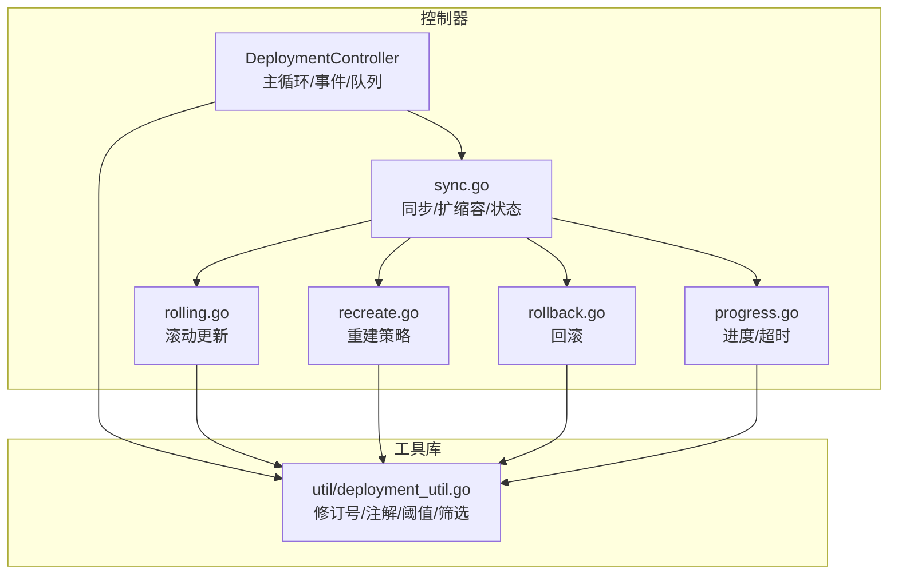
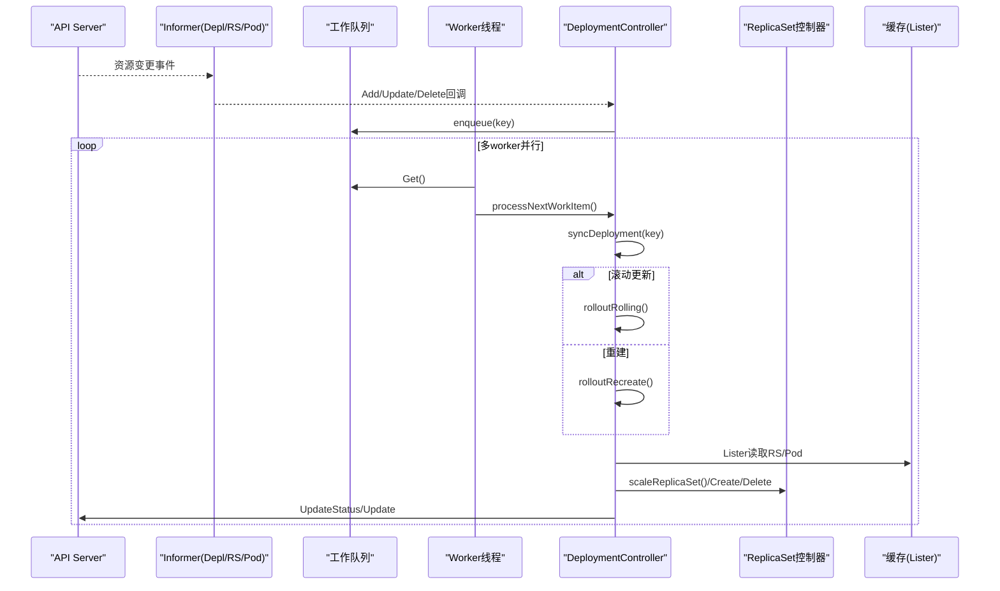
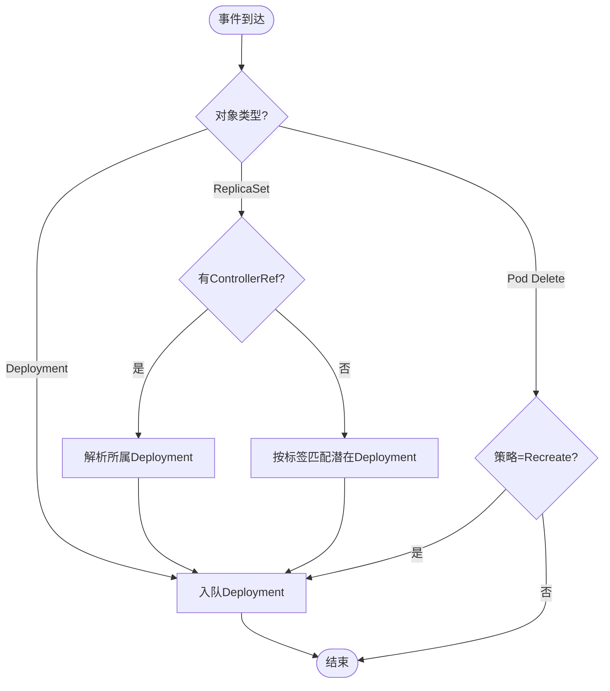
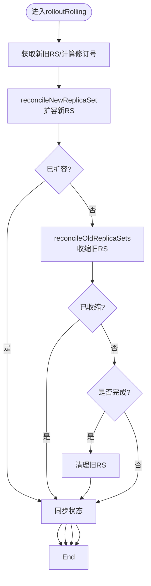
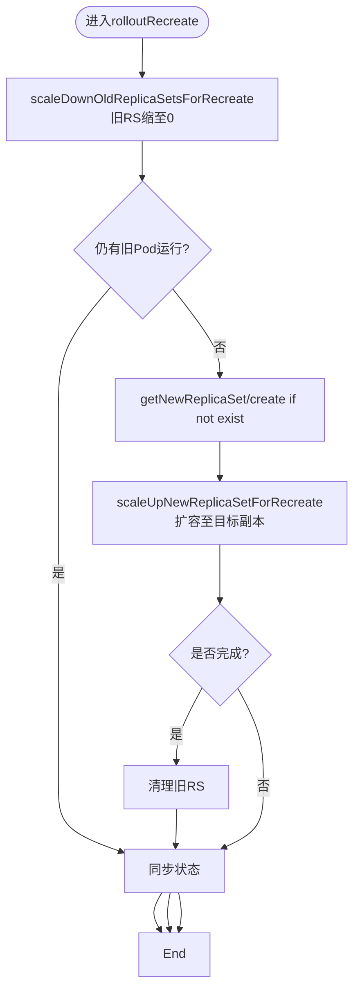
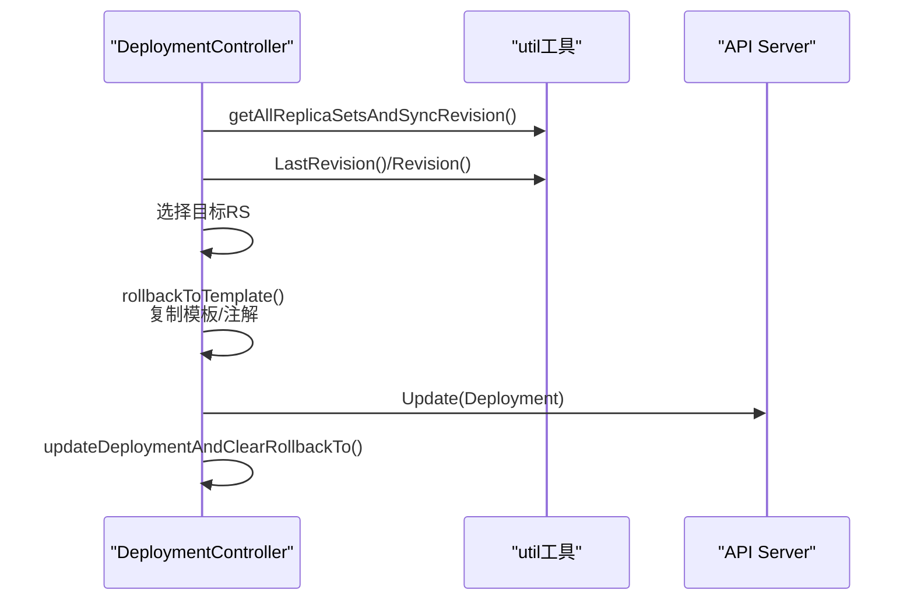
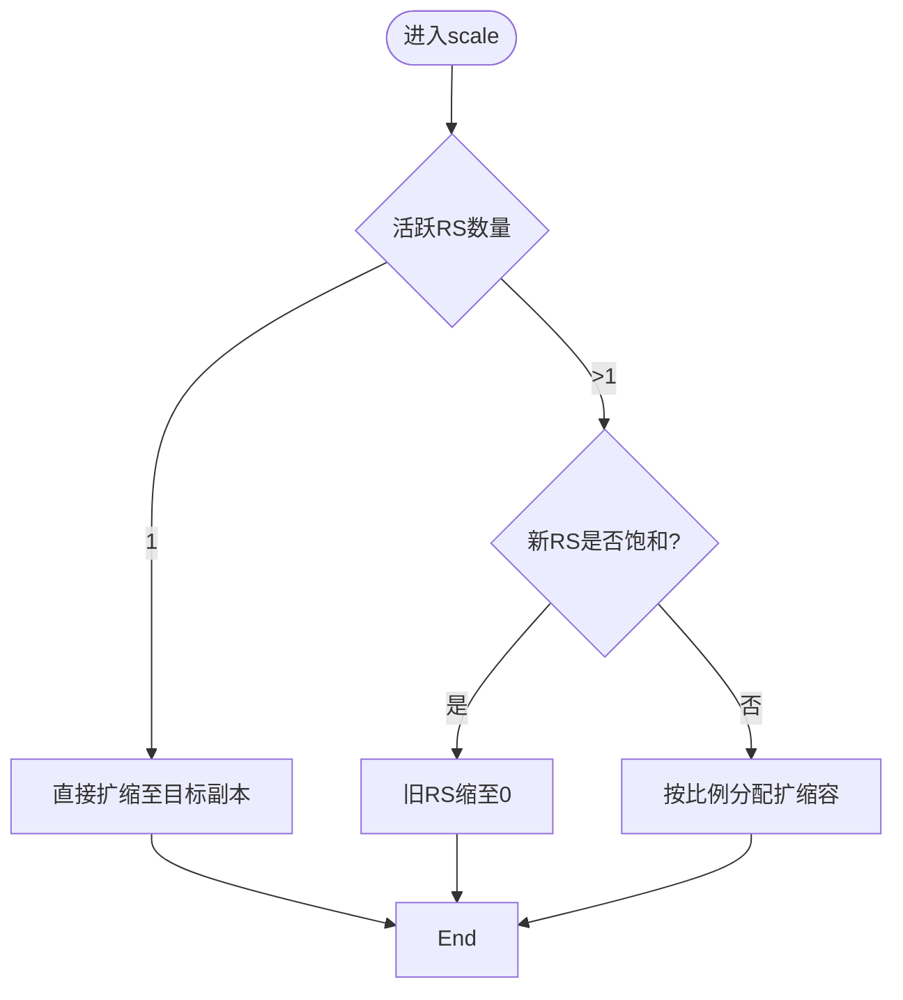
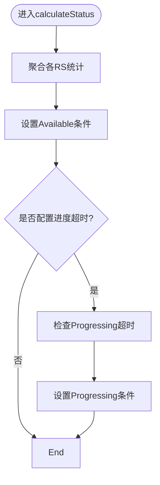
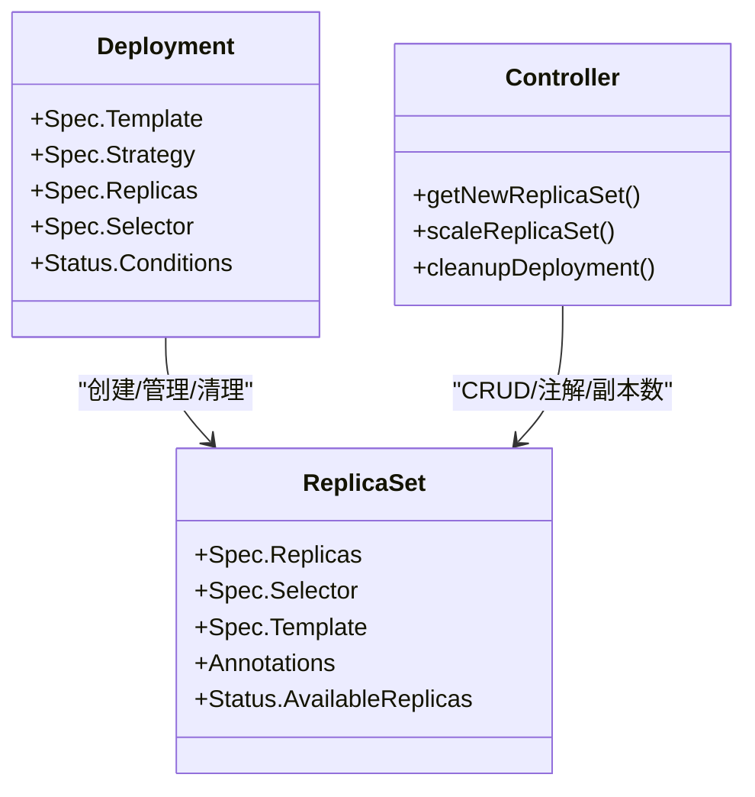
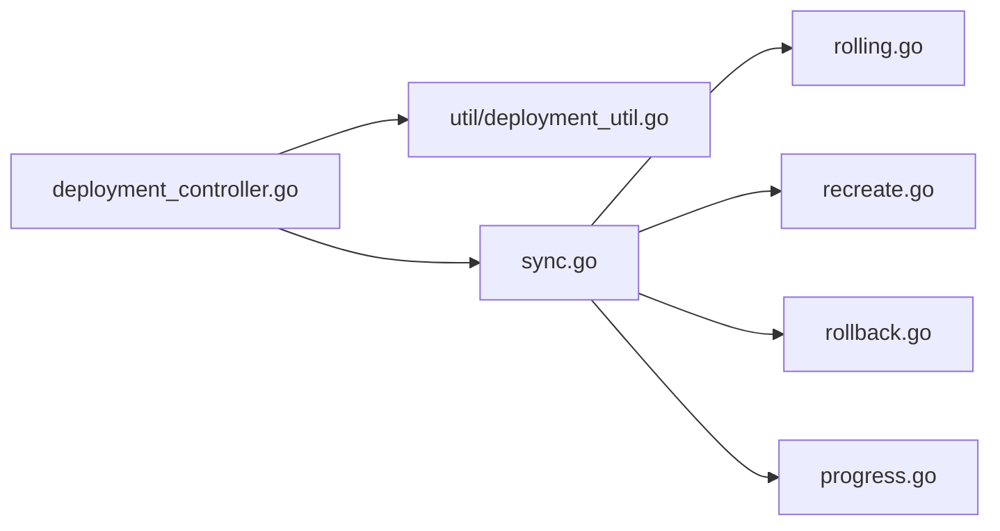

# Deployment控制器

<cite>
**本文引用的文件**   
- [deployment_controller.go](file://pkg/controller/deployment/deployment_controller.go)
- [rolling.go](file://pkg/controller/deployment/rolling.go)
- [recreate.go](file://pkg/controller/deployment/recreate.go)
- [rollback.go](file://pkg/controller/deployment/rollback.go)
- [sync.go](file://pkg/controller/deployment/sync.go)
- [progress.go](file://pkg/controller/deployment/progress.go)
- [deployment_util.go](file://pkg/controller/deployment/util/deployment_util.go)
</cite>

## 目录
1. [简介](#简介)
2. [项目结构](#项目结构)
3. [核心组件](#核心组件)
4. [架构总览](#架构总览)
5. [详细组件分析](#详细组件分析)
6. [依赖关系分析](#依赖关系分析)
7. [性能考虑](#性能考虑)
8. [故障诊断指南](#故障诊断指南)
9. [结论](#结论)
10. [附录](#附录)

## 简介
本文件面向Kubernetes Deployment控制器的实现与使用，系统性阐述其核心架构、滚动更新策略（RollingUpdate）、重建策略（Recreate）、版本回滚逻辑、扩缩容处理流程、状态管理与进度跟踪、失败恢复机制，以及ReplicaSet的创建、管理与清理过程。文档同时提供配置建议、最佳实践、常见问题排查方法、性能调优与监控指标说明，帮助读者从原理到实践全面掌握Deployment控制器。

## 项目结构
Deployment控制器位于pkg/controller/deployment目录，主要模块划分如下：
- 控制器主循环与事件处理：负责监听Deployment/ReplicaSet/Pod变更，入队并调度同步
- 滚动更新与重建策略：分别实现RollingUpdate与Recreate两种发布策略
- 回滚逻辑：基于历史版本进行模板替换与清理
- 同步与状态计算：统一入口、比例扩缩容、副本集管理、状态条件与进度判断
- 工具函数：修订号、注解、阈值计算、集合筛选等

图表来源
- [deployment_controller.go:104-168](file://pkg/controller/deployment/deployment_controller.go#L104-L168)
- [sync.go:44-77](file://pkg/controller/deployment/sync.go#L44-L77)
- [rolling.go:31-66](file://pkg/controller/deployment/rolling.go#L31-L66)
- [recreate.go:29-75](file://pkg/controller/deployment/recreate.go#L29-L75)
- [rollback.go:32-71](file://pkg/controller/deployment/rollback.go#L32-L71)
- [deployment_util.go:446-474](file://pkg/controller/deployment/util/deployment_util.go#L446-L474)

章节来源
- [deployment_controller.go:104-168](file://pkg/controller/deployment/deployment_controller.go#L104-L168)
- [sync.go:44-77](file://pkg/controller/deployment/sync.go#L44-L77)
- [rolling.go:31-66](file://pkg/controller/deployment/rolling.go#L31-L66)
- [recreate.go:29-75](file://pkg/controller/deployment/recreate.go#L29-L75)
- [rollback.go:32-71](file://pkg/controller/deployment/rollback.go#L32-L71)
- [deployment_util.go:446-474](file://pkg/controller/deployment/util/deployment_util.go#L446-L474)

## 核心组件
- DeploymentController
  - 职责：监听Deployment/ReplicaSet/Pod事件，维护工作队列，按Key串行执行syncDeployment；协调RS控制接口、事件记录器、Lister/Informer缓存
  - 关键流程：Run启动多worker -> processNextWorkItem -> syncHandler -> 根据策略分支（滚动/重建）-> 状态同步
- 策略实现
  - RollingUpdate：先扩容新RS，再按比例/可用性限制收缩旧RS，完成后清理旧RS
  - Recreate：先全量收缩旧RS，等待无旧Pod后创建新RS并扩容至目标副本数
- 回滚
  - 解析待回滚修订号，定位对应RS，将Deployment模板复制自该RS，清理回滚标记
- 同步与状态
  - 统一入口sync：处理暂停/缩放事件；scale按比例扩缩容；cleanupDeployment按RevisionHistoryLimit清理旧RS；calculateStatus汇总各RS状态并设置Conditions
- 工具库
  - 修订号/注解管理、MaxSurge/MaxUnavailable计算、比例分配、集合筛选、进度与超时判定

章节来源
- [deployment_controller.go:170-200](file://pkg/controller/deployment/deployment_controller.go#L170-L200)
- [deployment_controller.go:572-661](file://pkg/controller/deployment/deployment_controller.go#L572-L661)
- [rolling.go:31-66](file://pkg/controller/deployment/rolling.go#L31-L66)
- [recreate.go:29-75](file://pkg/controller/deployment/recreate.go#L29-L75)
- [rollback.go:32-71](file://pkg/controller/deployment/rollback.go#L32-L71)
- [sync.go:44-77](file://pkg/controller/deployment/sync.go#L44-L77)
- [sync.go:478-532](file://pkg/controller/deployment/sync.go#L478-L532)
- [deployment_util.go:446-474](file://pkg/controller/deployment/util/deployment_util.go#L446-L474)

## 架构总览
Deployment控制器采用“事件驱动+工作队列”的经典控制器模式，通过Informer监听资源变化，将需要处理的Deployment Key加入带退避的工作队列，由多个worker并发消费，但同一Key串行执行以保证幂等性。

图表来源
- [deployment_controller.go:170-200](file://pkg/controller/deployment/deployment_controller.go#L170-L200)
- [deployment_controller.go:572-661](file://pkg/controller/deployment/deployment_controller.go#L572-L661)
- [sync.go:44-77](file://pkg/controller/deployment/sync.go#L44-L77)
- [rolling.go:31-66](file://pkg/controller/deployment/rolling.go#L31-L66)
- [recreate.go:29-75](file://pkg/controller/deployment/recreate.go#L29-L75)

## 详细组件分析

### 控制器主循环与事件处理
- Run：初始化事件广播、开始录制事件、等待缓存同步、启动N个worker循环
- 事件处理：
  - Deployment增删改：直接入队
  - ReplicaSet增删改：若存在ControllerRef则入队对应Deployment；否则尝试匹配可能拥有它的Deployment并批量入队
  - Pod删除：仅对Recreate策略触发入队，以便在旧Pod全部停止后推进重建流程
- 错误处理：带指数退避的重试，超过最大重试次数后丢弃并记录错误

图表来源
- [deployment_controller.go:201-230](file://pkg/controller/deployment/deployment_controller.go#L201-L230)
- [deployment_controller.go:232-367](file://pkg/controller/deployment/deployment_controller.go#L232-L367)
- [deployment_controller.go:369-397](file://pkg/controller/deployment/deployment_controller.go#L369-L397)
- [deployment_controller.go:499-519](file://pkg/controller/deployment/deployment_controller.go#L499-L519)

章节来源
- [deployment_controller.go:170-200](file://pkg/controller/deployment/deployment_controller.go#L170-L200)
- [deployment_controller.go:201-397](file://pkg/controller/deployment/deployment_controller.go#L201-L397)
- [deployment_controller.go:499-519](file://pkg/controller/deployment/deployment_controller.go#L499-L519)

### 滚动更新（RollingUpdate）
- 流程要点
  - 获取新旧RS列表并计算新RS修订号
  - 优先扩容新RS（受MaxSurge与期望副本数约束）
  - 当满足条件时收缩旧RS（受MaxUnavailable与新RS不可用副本数影响）
  - 完成时清理旧RS（受RevisionHistoryLimit约束）
  - 同步状态与条件
- 关键算法
  - 新RS扩容：NewRSNewReplicas依据当前总副本数与maxSurge决定扩容步长
  - 旧RS收缩：先清理不健康副本，再按可用副本数与minAvailable限制逐步收缩
  - 比例扩缩容：在缩放事件中按比例分配新增/减少的副本，避免一次性放大风险

图表来源
- [rolling.go:31-66](file://pkg/controller/deployment/rolling.go#L31-L66)
- [rolling.go:68-84](file://pkg/controller/deployment/rolling.go#L68-L84)
- [rolling.go:86-152](file://pkg/controller/deployment/rolling.go#L86-L152)
- [rolling.go:154-236](file://pkg/controller/deployment/rolling.go#L154-L236)
- [sync.go:307-400](file://pkg/controller/deployment/sync.go#L307-L400)
- [deployment_util.go:813-842](file://pkg/controller/deployment/util/deployment_util.go#L813-L842)

章节来源
- [rolling.go:31-236](file://pkg/controller/deployment/rolling.go#L31-L236)
- [sync.go:307-400](file://pkg/controller/deployment/sync.go#L307-L400)
- [deployment_util.go:813-842](file://pkg/controller/deployment/util/deployment_util.go#L813-L842)

### 重建策略（Recreate）
- 流程要点
  - 先全量收缩所有旧RS至0
  - 等待无旧Pod运行（包括非终态Pod）
  - 创建新RS并扩容至目标副本数
  - 完成后清理旧RS
- 特点
  - 保证零停机切换不存在，适用于有状态或强一致场景
  - 对Pod删除事件敏感，确保旧实例完全退出后再推进

图表来源
- [recreate.go:29-75](file://pkg/controller/deployment/recreate.go#L29-L75)
- [recreate.go:77-96](file://pkg/controller/deployment/recreate.go#L77-L96)
- [recreate.go:98-126](file://pkg/controller/deployment/recreate.go#L98-L126)
- [recreate.go:128-133](file://pkg/controller/deployment/recreate.go#L128-L133)

章节来源
- [recreate.go:29-133](file://pkg/controller/deployment/recreate.go#L29-L133)

### 版本回滚
- 流程要点
  - 解析.spec.rollbackTo（兼容注解），若无指定则取最近一次修订号
  - 遍历RS找到目标修订号对应的RS
  - 将Deployment模板复制到目标RS的模板，并回写相关注解
  - 清理回滚标记，后续正常走滚动/重建流程
- 注意事项
  - 若目标修订号不存在或模板未变化，会发出相应事件并清理回滚标记

图表来源
- [rollback.go:32-71](file://pkg/controller/deployment/rollback.go#L32-L71)
- [rollback.go:73-102](file://pkg/controller/deployment/rollback.go#L73-L102)
- [rollback.go:112-149](file://pkg/controller/deployment/rollback.go#L112-L149)
- [deployment_util.go:171-184](file://pkg/controller/deployment/util/deployment_util.go#L171-L184)
- [deployment_util.go:230-293](file://pkg/controller/deployment/util/deployment_util.go#L230-L293)

章节来源
- [rollback.go:32-149](file://pkg/controller/deployment/rollback.go#L32-L149)
- [deployment_util.go:171-184](file://pkg/controller/deployment/util/deployment_util.go#L171-L184)
- [deployment_util.go:230-293](file://pkg/controller/deployment/util/deployment_util.go#L230-L293)

### 扩缩容与比例分配
- 缩放事件检测：通过RS注解desired-replicas与当前spec.replicas比较判断
- 比例扩缩容：
  - 仅有一个活跃RS时直接扩缩至目标值
  - 新RS饱和时，将旧RS全部缩至0
  - 多RS并存时，按大小排序与比例估算分配新增/减少的副本数，避免集中扩缩导致可用性波动
- 副本集操作：scaleReplicaSet支持懒更新与强制更新，必要时更新Desired/Max注解

图表来源
- [sync.go:307-400](file://pkg/controller/deployment/sync.go#L307-L400)
- [sync.go:402-436](file://pkg/controller/deployment/sync.go#L402-L436)
- [deployment_util.go:354-376](file://pkg/controller/deployment/util/deployment_util.go#L354-L376)
- [deployment_util.go:476-527](file://pkg/controller/deployment/util/deployment_util.go#L476-L527)

章节来源
- [sync.go:307-436](file://pkg/controller/deployment/sync.go#L307-L436)
- [deployment_util.go:354-376](file://pkg/controller/deployment/util/deployment_util.go#L354-L376)
- [deployment_util.go:476-527](file://pkg/controller/deployment/util/deployment_util.go#L476-L527)

### 状态管理、进度跟踪与失败恢复
- 状态计算：汇总各RS的Ready/Available/Actual/Updated/Terminating副本数，设置Available条件
- 进度条件：
  - FoundNewRS/NewReplicaSetCreated：发现或创建新RS
  - NewRSAvailable：新RS达到最小可用要求
  - ProgressDeadlineExceeded：超过progressDeadlineSeconds仍未进展
  - DeploymentPaused/Resumed：暂停/恢复时的Progressing条件
- 失败恢复：
  - 事件与条件记录失败原因
  - 工作队列带退避重试，避免瞬时错误导致频繁抖动
  - 命名冲突（hash碰撞）时递增CollisionCount并重试创建

图表来源
- [sync.go:478-532](file://pkg/controller/deployment/sync.go#L478-L532)
- [deployment_util.go:739-746](file://pkg/controller/deployment/util/deployment_util.go#L739-L746)
- [deployment_util.go:748-763](file://pkg/controller/deployment/util/deployment_util.go#L748-L763)
- [deployment_util.go:768-811](file://pkg/controller/deployment/util/deployment_util.go#L768-L811)
- [deployment_controller.go:499-519](file://pkg/controller/deployment/deployment_controller.go#L499-L519)

章节来源
- [sync.go:478-532](file://pkg/controller/deployment/sync.go#L478-L532)
- [deployment_util.go:739-811](file://pkg/controller/deployment/util/deployment_util.go#L739-L811)
- [deployment_controller.go:499-519](file://pkg/controller/deployment/deployment_controller.go#L499-L519)

### ReplicaSet的创建、管理与清理
- 创建：
  - 根据Deployment模板生成唯一名称（含pod-template-hash）
  - 设置OwnerReference、Selector、MinReadySeconds
  - 计算初始副本数（滚动策略下考虑MaxSurge）
  - 写入修订号与副本注解
- 管理：
  - 通过ControllerRefManager进行认领/释放，修复孤儿RS
  - 在缩放事件中动态调整副本数
- 清理：
  - 完成且满足RevisionHistoryLimit时，按修订号从旧到新删除空RS

图表来源
- [sync.go:146-300](file://pkg/controller/deployment/sync.go#L146-L300)
- [sync.go:438-476](file://pkg/controller/deployment/sync.go#L438-L476)
- [deployment_util.go:230-293](file://pkg/controller/deployment/util/deployment_util.go#L230-L293)

章节来源
- [sync.go:146-300](file://pkg/controller/deployment/sync.go#L146-L300)
- [sync.go:438-476](file://pkg/controller/deployment/sync.go#L438-L476)
- [deployment_util.go:230-293](file://pkg/controller/deployment/util/deployment_util.go#L230-L293)

## 依赖关系分析
- 外部依赖
  - client-go：AppsV1/Events/Informer/Lister
  - klog：结构化日志
  - workqueue：带退避的任务队列
- 内部依赖
  - controller包：ReplicaSet控制接口、通用索引与排序
  - deployment/util：修订号、注解、阈值、比例、进度与超时判定

图表来源
- [deployment_controller.go:104-168](file://pkg/controller/deployment/deployment_controller.go#L104-L168)
- [sync.go:44-77](file://pkg/controller/deployment/sync.go#L44-L77)
- [rolling.go:31-66](file://pkg/controller/deployment/rolling.go#L31-L66)
- [recreate.go:29-75](file://pkg/controller/deployment/recreate.go#L29-L75)
- [rollback.go:32-71](file://pkg/controller/deployment/rollback.go#L32-L71)
- [progress.go](file://pkg/controller/deployment/progress.go)

章节来源
- [deployment_controller.go:104-168](file://pkg/controller/deployment/deployment_controller.go#L104-L168)
- [sync.go:44-77](file://pkg/controller/deployment/sync.go#L44-L77)

## 性能考虑
- 并发与限流
  - 多worker并行处理不同Deployment，同一Deployment串行执行避免竞态
  - 工作队列默认退避策略可缓解瞬时压力
- 滚动参数调优
  - MaxSurge与MaxUnavailable需结合业务SLA与集群容量合理设置，避免过度抢占资源
  - MinReadySeconds影响就绪判定，过大可能延长滚动时间
- 历史保留
  - RevisionHistoryLimit控制旧RS保留数量，避免过多元数据开销
- 事件风暴
  - 大规模扩缩容时注意事件合并与节流，避免API Server拥塞

[本节为通用指导，无需源码引用]

## 故障诊断指南
- 常见现象与定位
  - 滚动卡住/超时：检查Progressing条件与TimedOutReason，确认新RS是否可用、是否存在大量不可用副本
  - 无法创建新RS：查看FailedRSCreateReason事件与条件，关注配额、镜像拉取、节点资源等
  - 回滚失败：确认目标修订号是否存在，模板是否相同，注解是否正确
  - 命名冲突：观察CollisionCount递增，等待下次重试
- 诊断步骤
  - 查看Deployment.Status.Conditions与ObservedGeneration
  - 检查关联RS的副本数、可用副本数与注解（desired/max）
  - 核对Pod事件与日志，确认探针与健康检查
  - 验证MaxSurge/MaxUnavailable与集群容量匹配度

章节来源
- [deployment_util.go:739-811](file://pkg/controller/deployment/util/deployment_util.go#L739-L811)
- [sync.go:478-532](file://pkg/controller/deployment/sync.go#L478-L532)
- [deployment_controller.go:499-519](file://pkg/controller/deployment/deployment_controller.go#L499-L519)

## 结论
Deployment控制器通过清晰的分层设计与稳健的事件驱动模型，实现了高可用的应用发布能力。滚动更新与重建策略覆盖大多数业务场景，配合修订号与注解机制，提供了可靠的回滚与扩缩容体验。合理的参数配置与完善的监控告警是保障生产稳定性的关键。

[本节为总结，无需源码引用]

## 附录
- 配置示例与最佳实践
  - 滚动更新：推荐设置合理的MaxSurge与MaxUnavailable，启用MinReadySeconds以保障就绪质量
  - 重建策略：用于有状态服务或强一致性场景，注意停机窗口
  - 回滚：利用revision-history与kubectl rollout undo快速恢复
  - 历史保留：根据回滚需求设置RevisionHistoryLimit，避免无限增长
- 监控指标建议
  - Deployment进度条件（Progressing/Available）
  - 副本数指标（Replicas/UpdatedReplicas/ReadyReplicas/AvailableReplicas）
  - 事件与条件（NewReplicaSetCreated/FoundNewReplicaSet/ProgressDeadlineExceeded）
  - 回滚事件（DeploymentRollback）

[本节为概念性内容，无需源码引用]