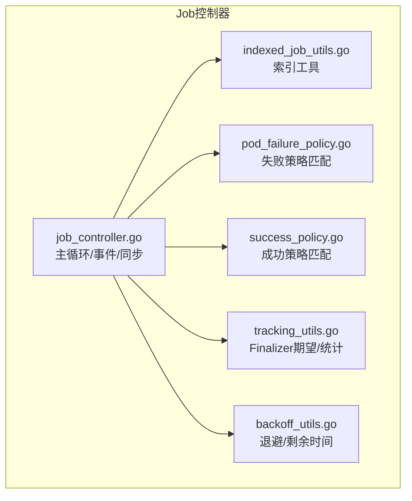
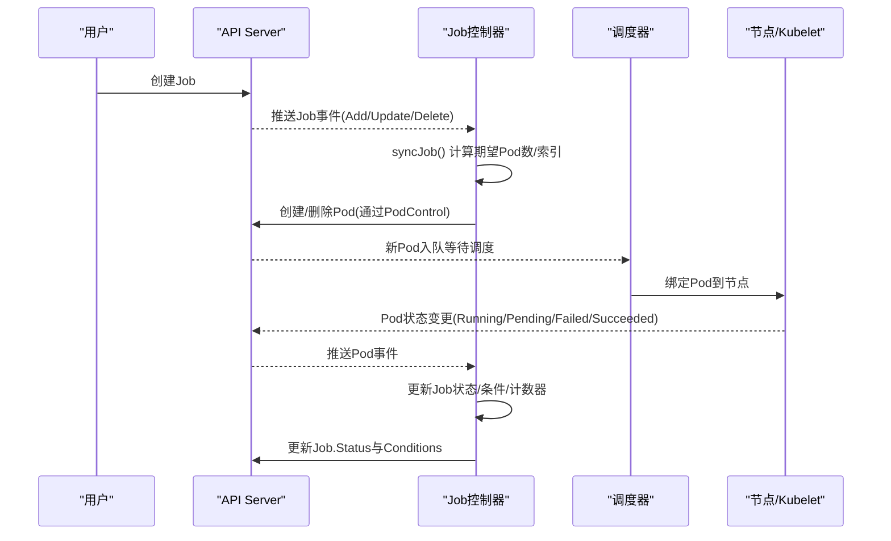
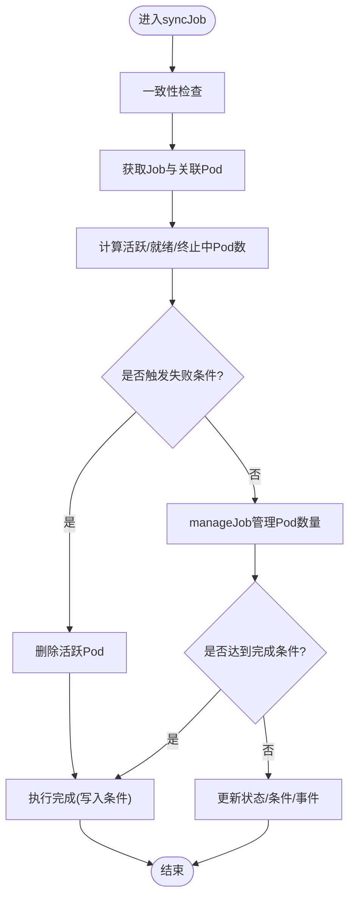
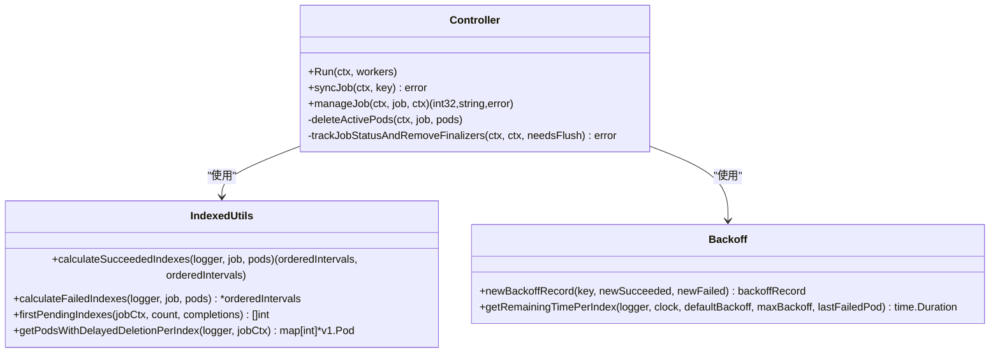
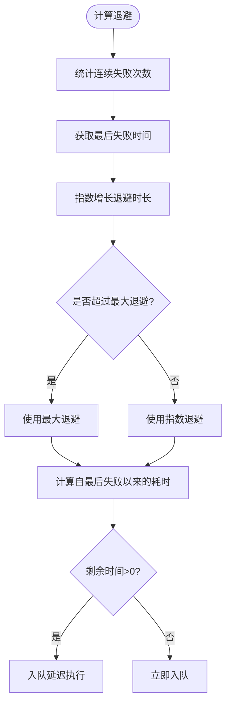
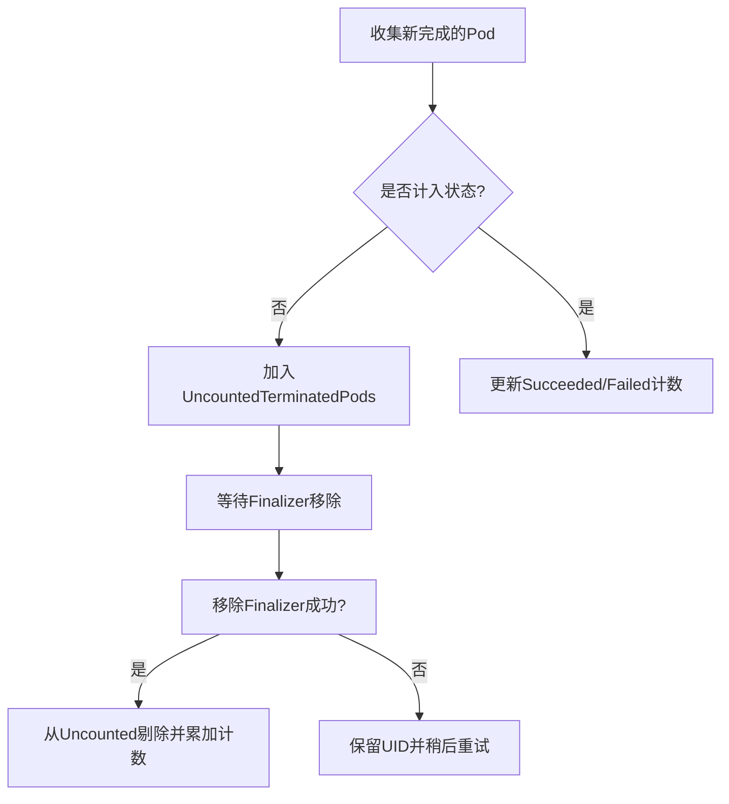
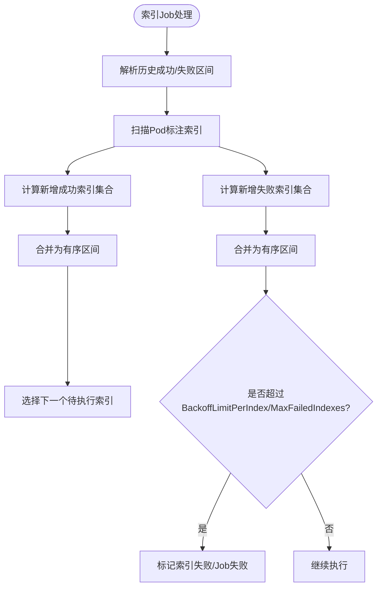
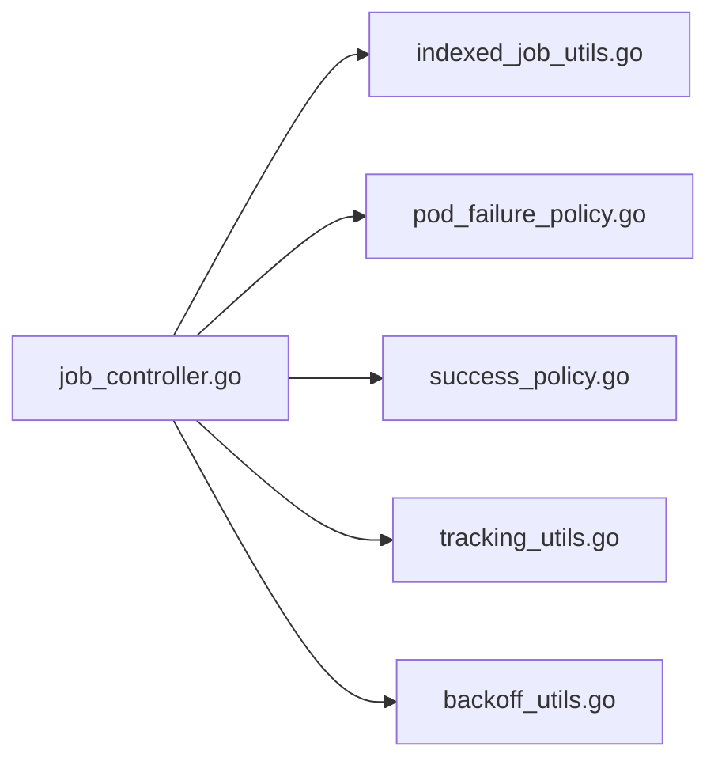

# Job控制器

<cite>
**本文引用的文件**   
- [job_controller.go](file://pkg/controller/job/job_controller.go)
- [indexed_job_utils.go](file://pkg/controller/job/indexed_job_utils.go)
- [pod_failure_policy.go](file://pkg/controller/job/pod_failure_policy.go)
- [success_policy.go](file://pkg/controller/job/success_policy.go)
- [tracking_utils.go](file://pkg/controller/job/tracking_utils.go)
- [backoff_utils.go](file://pkg/controller/job/backoff_utils.go)
</cite>

## 目录
1. [简介](#简介)
2. [项目结构](#项目结构)
3. [核心组件](#核心组件)
4. [架构总览](#架构总览)
5. [详细组件分析](#详细组件分析)
6. [依赖关系分析](#依赖关系分析)
7. [性能与资源考量](#性能与资源考量)
8. [故障排查指南](#故障排查指南)
9. [结论](#结论)
10. [附录](#附录)

## 简介
本文件面向Kubernetes Job控制器的实现，系统性阐述其任务调度机制、并行执行、重试策略、完成条件判断、Pod失败处理、成功计数、超时管理、索引Job的并行与结果聚合逻辑，以及与调度器协作和资源分配的关系。文档同时提供配置示例、批处理优化建议、监控告警设置、性能调优与故障排查指南，帮助读者在生产环境中稳定高效地使用Job控制器。

## 项目结构
Job控制器位于pkg/controller/job目录下，核心文件包括：
- job_controller.go：控制器主循环、事件处理、同步流程、状态跟踪与最终化（finalizer）管理
- indexed_job_utils.go：索引Job相关工具（索引区间压缩、失败/成功索引计算、延迟删除等）
- pod_failure_policy.go：Pod失败策略匹配（按退出码或Pod条件）
- success_policy.go：成功策略匹配（按索引集合或数量）
- tracking_utils.go：追踪finalizer期望与统计
- backoff_utils.go：指数退避与剩余等待时间计算

图表来源
- [job_controller.go:908-1200](file://pkg/controller/job/job_controller.go#L908-L1200)
- [indexed_job_utils.go:59-94](file://pkg/controller/job/indexed_job_utils.go#L59-L94)
- [pod_failure_policy.go:34-76](file://pkg/controller/job/pod_failure_policy.go#L34-L76)
- [success_policy.go:27-48](file://pkg/controller/job/success_policy.go#L27-L48)
- [tracking_utils.go:127-149](file://pkg/controller/job/tracking_utils.go#L127-L149)
- [backoff_utils.go:236-276](file://pkg/controller/job/backoff_utils.go#L236-L276)

章节来源
- [job_controller.go:908-1200](file://pkg/controller/job/job_controller.go#L908-L1200)
- [indexed_job_utils.go:59-94](file://pkg/controller/job/indexed_job_utils.go#L59-L94)
- [pod_failure_policy.go:34-76](file://pkg/controller/job/pod_failure_policy.go#L34-L76)
- [success_policy.go:27-48](file://pkg/controller/job/success_policy.go#L27-L48)
- [tracking_utils.go:127-149](file://pkg/controller/job/tracking_utils.go#L127-L149)
- [backoff_utils.go:236-276](file://pkg/controller/job/backoff_utils.go#L236-L276)

## 核心组件
- 控制器主循环与事件驱动
  - 通过Informer监听Job与Pod事件，入队到工作队列；worker线程拉取并调用syncJob进行同步
  - 支持批量合并与延迟入队，降低API压力
- 同步流程syncJob
  - 一致性检查、获取Job与关联Pod、计算活跃/就绪/终止中Pod数
  - 评估失败场景（BackoffLimit、ActiveDeadlineSeconds、PodFailurePolicy）、成功场景（Completions、SuccessPolicy）
  - 管理Pod生命周期（创建/删除），更新状态与条件，触发完成或失败
- 索引Job工具
  - 维护成功/失败索引的有序区间表示，支持快速查询与合并
  - 计算待执行的下一个索引、重复索引清理、延迟删除以保留失败计数注解
- Pod失败策略
  - 基于容器退出码或Pod条件匹配规则，决定忽略、计数、失败索引或失败整个Job
- 成功策略
  - 基于SucceededIndexes或SucceededCount判定提前完成
- Finalizer追踪
  - 使用UID期望记录与观察，确保在Pod finalizer移除后准确更新Job状态计数器
- 退避与剩余时间
  - 基于最近失败时间与连续失败次数计算下一次重试的剩余等待时间，支持按索引粒度

章节来源
- [job_controller.go:908-1200](file://pkg/controller/job/job_controller.go#L908-L1200)
- [indexed_job_utils.go:59-94](file://pkg/controller/job/indexed_job_utils.go#L59-L94)
- [pod_failure_policy.go:34-76](file://pkg/controller/job/pod_failure_policy.go#L34-L76)
- [success_policy.go:27-48](file://pkg/controller/job/success_policy.go#L27-L48)
- [tracking_utils.go:127-149](file://pkg/controller/job/tracking_utils.go#L127-L149)
- [backoff_utils.go:236-276](file://pkg/controller/job/backoff_utils.go#L236-L276)

## 架构总览
Job控制器与调度器协作的关键点：
- Job控制器负责“期望状态”（Desired State）：根据Spec与当前状态计算需要创建的Pod数量与索引，并通过PodControl接口创建/删除Pod
- 调度器负责“实际调度”（Actual Scheduling）：接收Pod对象，依据节点资源、亲和性、拓扑等选择合适节点运行
- 资源分配由Pod的resources字段与集群配额/限制共同约束；Job控制器不直接参与节点选择

图表来源
- [job_controller.go:908-1200](file://pkg/controller/job/job_controller.go#L908-L1200)
- [job_controller.go:1745-1802](file://pkg/controller/job/job_controller.go#L1745-L1802)

章节来源
- [job_controller.go:908-1200](file://pkg/controller/job/job_controller.go#L908-L1200)
- [job_controller.go:1745-1802](file://pkg/controller/job/job_controller.go#L1745-L1802)

## 详细组件分析

### 同步主流程与完成条件判断
- 一致性保障：写入回调记录Pod/Job写时间，避免读取未观测到的写入导致不一致
- 外部控制器接管：若Job被外部控制器管理，则跳过同步
- 失败场景优先级：
  - 预置FailureTarget或PodFailurePolicy触发的FailJob消息
  - BackoffLimit超限或重启计数超过阈值（OnFailure）
  - ActiveDeadlineSeconds超时
- 成功场景：
  - Completions达到且无活跃Pod
  - SuccessPolicy满足时标记SuccessCriteriaMet，随后转为Complete
- 完成执行：当无未计数Pod且无终止中Pod时，写入Complete/Failed条件与CompletionTime

图表来源
- [job_controller.go:908-1200](file://pkg/controller/job/job_controller.go#L908-L1200)
- [job_controller.go:1603-1652](file://pkg/controller/job/job_controller.go#L1603-L1652)

章节来源
- [job_controller.go:908-1200](file://pkg/controller/job/job_controller.go#L908-L1200)
- [job_controller.go:1603-1652](file://pkg/controller/job/job_controller.go#L1603-L1652)

### 并行执行与Pod管理
- 非索引Job：
  - 未指定Completions：首个成功后保持现有活跃Pod继续运行，直至全部结束
  - 指定Completions：活跃Pod数不超过剩余Completions，上限为Parallelism
- 索引Job：
  - 按索引并发执行，每个索引对应一个Pod
  - 支持BackoffLimitPerIndex与MaxFailedIndexes
  - 支持PodReplacementPolicy=Failed时的替换与延迟删除
- manageJob职责：
  - 计算目标活跃Pod数
  - 删除多余Pod（受MaxPodCreateDeletePerSync限制）
  - 必要时创建缺失Pod（由上层逻辑驱动）

图表来源
- [job_controller.go:1745-1802](file://pkg/controller/job/job_controller.go#L1745-L1802)
- [indexed_job_utils.go:59-94](file://pkg/controller/job/indexed_job_utils.go#L59-L94)
- [backoff_utils.go:236-276](file://pkg/controller/job/backoff_utils.go#L236-L276)

章节来源
- [job_controller.go:1745-1802](file://pkg/controller/job/job_controller.go#L1745-L1802)
- [indexed_job_utils.go:59-94](file://pkg/controller/job/indexed_job_utils.go#L59-L94)
- [backoff_utils.go:236-276](file://pkg/controller/job/backoff_utils.go#L236-L276)

### 重试策略与退避机制
- 全局退避：
  - 基于最近一次成功后的连续失败次数与最后失败时间，计算剩余等待时间
  - 默认与最大退避时间可配置，指数增长并封顶
- 按索引退避：
  - 针对索引粒度，从最后一个失败Pod的注解中读取失败计数，结合最后失败时间计算剩余等待
- 入队延迟：
  - 当Pod失败触发重试时，使用enqueueSyncJobWithDelay确保最小批量周期与退避叠加

图表来源
- [backoff_utils.go:236-276](file://pkg/controller/job/backoff_utils.go#L236-L276)
- [job_controller.go:690-716](file://pkg/controller/job/job_controller.go#L690-L716)

章节来源
- [backoff_utils.go:236-276](file://pkg/controller/job/backoff_utils.go#L236-L276)
- [job_controller.go:690-716](file://pkg/controller/job/job_controller.go#L690-L716)

### Pod失败处理与成功计数
- 失败判定：
  - isPodFailed识别失败Pod
  - getNewFinishedPods过滤出未计入状态的失败Pod
  - nonIgnoredFailedPodsCount考虑PodFailurePolicy的Ignore动作不计入失败
- 成功计数：
  - succeeded = 已有Succeeded + 新增Succeeded + UncountedTerminatedPods中的Succeeded
  - failed = 已有Failed + 新增未忽略的Failed + UncountedTerminatedPods中的Failed
- Finalizer与Uncounted：
  - 通过uncountedTerminatedPods暂存已终止但尚未计数的Pod UID
  - 移除Tracking Finalizer后，cleanUncountedPodsWithoutFinalizers将UID从列表剔除并累加到状态计数器

图表来源
- [job_controller.go:1725-1734](file://pkg/controller/job/job_controller.go#L1725-L1734)
- [job_controller.go:1472-1554](file://pkg/controller/job/job_controller.go#L1472-L1554)
- [tracking_utils.go:127-149](file://pkg/controller/job/tracking_utils.go#L127-L149)

章节来源
- [job_controller.go:1725-1734](file://pkg/controller/job/job_controller.go#L1725-L1734)
- [job_controller.go:1472-1554](file://pkg/controller/job/job_controller.go#L1472-L1554)
- [tracking_utils.go:127-149](file://pkg/controller/job/tracking_utils.go#L127-L149)

### 索引Job的并行处理与结果聚合
- 索引区间表示：
  - 使用有序区间压缩存储成功/失败索引，支持快速合并与查找
- 待执行索引选择：
  - firstPendingIndexes排除活跃、成功、失败索引，必要时包含正在终止的Pod（替换策略）
- 失败索引判定：
  - calculateFailedIndexes结合PodFailurePolicy与BackoffLimitPerIndex
- 延迟删除：
  - getPodsWithDelayedDeletionPerIndex选择需延迟删除的失败Pod，以便保留失败计数注解供新Pod继承
- 环境注入：
  - addCompletionIndexEnvVariables为容器注入JOB_COMPLETION_INDEX环境变量

图表来源
- [indexed_job_utils.go:59-94](file://pkg/controller/job/indexed_job_utils.go#L59-L94)
- [indexed_job_utils.go:244-273](file://pkg/controller/job/indexed_job_utils.go#L244-L273)
- [indexed_job_utils.go:320-346](file://pkg/controller/job/indexed_job_utils.go#L320-L346)
- [indexed_job_utils.go:453-477](file://pkg/controller/job/indexed_job_utils.go#L453-L477)

章节来源
- [indexed_job_utils.go:59-94](file://pkg/controller/job/indexed_job_utils.go#L59-L94)
- [indexed_job_utils.go:244-273](file://pkg/controller/job/indexed_job_utils.go#L244-L273)
- [indexed_job_utils.go:320-346](file://pkg/controller/job/indexed_job_utils.go#L320-L346)
- [indexed_job_utils.go:453-477](file://pkg/controller/job/indexed_job_utils.go#L453-L477)

### 与调度器的协作与资源分配
- Job控制器仅负责Pod的创建与删除，不介入节点选择
- 调度器根据Pod的资源请求、亲和性、拓扑等信息进行调度
- 资源限制由Pod.spec.resources与命名空间ResourceQuota/LimitRange共同约束
- 对于大规模索引Job，可通过PodGroup与工作负载集成（可选特性）提升调度效率

章节来源
- [job_controller.go:1745-1802](file://pkg/controller/job/job_controller.go#L1745-L1802)

## 依赖关系分析
- 控制器对工具模块的依赖：
  - indexed_job_utils：索引区间计算与选择
  - pod_failure_policy：失败策略匹配
  - success_policy：成功策略匹配
  - tracking_utils：Finalizer期望与统计
  - backoff_utils：退避与剩余时间计算

图表来源
- [job_controller.go:908-1200](file://pkg/controller/job/job_controller.go#L908-L1200)
- [indexed_job_utils.go:59-94](file://pkg/controller/job/indexed_job_utils.go#L59-L94)
- [pod_failure_policy.go:34-76](file://pkg/controller/job/pod_failure_policy.go#L34-L76)
- [success_policy.go:27-48](file://pkg/controller/job/success_policy.go#L27-L48)
- [tracking_utils.go:127-149](file://pkg/controller/job/tracking_utils.go#L127-L149)
- [backoff_utils.go:236-276](file://pkg/controller/job/backoff_utils.go#L236-L276)

章节来源
- [job_controller.go:908-1200](file://pkg/controller/job/job_controller.go#L908-L1200)
- [indexed_job_utils.go:59-94](file://pkg/controller/job/indexed_job_utils.go#L59-L94)
- [pod_failure_policy.go:34-76](file://pkg/controller/job/pod_failure_policy.go#L34-L76)
- [success_policy.go:27-48](file://pkg/controller/job/success_policy.go#L27-L48)
- [tracking_utils.go:127-149](file://pkg/controller/job/tracking_utils.go#L127-L149)
- [backoff_utils.go:236-276](file://pkg/controller/job/backoff_utils.go#L236-L276)

## 性能与资源考量
- 批量与限流
  - 使用SyncJobBatchPeriod合并Pod事件导致的多次同步
  - MaxPodCreateDeletePerSync限制单次同步的Pod创建/删除数量
- 退避与抖动抑制
  - 指数退避与最大退避上限防止雪崩式重试
  - 按索引粒度退避减少局部热点影响
- 状态更新频率
  - 仅在spec变更时立即同步，status变更时批量延迟同步
- 资源规划
  - 合理设置Parallelism与Completions，避免过度抢占节点资源
  - 使用PodGroup与调度器插件提升大批量Pod的调度吞吐

[本节为通用指导，无需具体文件引用]

## 故障排查指南
- Job长时间Pending
  - 检查Pod资源请求是否超出节点容量或命名空间配额
  - 查看调度器日志与事件，确认是否存在亲和/污点/容忍问题
- Job频繁失败
  - 检查容器退出码与Pod条件，确认PodFailurePolicy规则是否误判
  - 关注BackoffLimit与BackoffLimitPerIndex是否过小
- 索引Job部分索引失败
  - 查看failedIndexes区间与BackoffLimitPerIndex，确认是否需要调整MaxFailedIndexes
  - 检查延迟删除的Pod是否正确保留失败计数注解
- 完成状态未更新
  - 确认UncountedTerminatedPods是否为空，是否有Pod仍在终止中
  - 检查Finalizer移除是否成功，观察控制器日志中的期望与观察记录

章节来源
- [job_controller.go:1603-1652](file://pkg/controller/job/job_controller.go#L1603-L1652)
- [pod_failure_policy.go:34-76](file://pkg/controller/job/pod_failure_policy.go#L34-L76)
- [indexed_job_utils.go:320-346](file://pkg/controller/job/indexed_job_utils.go#L320-L346)
- [tracking_utils.go:127-149](file://pkg/controller/job/tracking_utils.go#L127-L149)

## 结论
Job控制器通过严谨的状态机与多策略组合（BackoffLimit、ActiveDeadlineSeconds、PodFailurePolicy、SuccessPolicy、BackoffLimitPerIndex、MaxFailedIndexes）实现了可靠的批处理任务编排。配合调度器的资源分配能力与合理的参数调优，可在大规模索引Job场景下获得高吞吐与强稳定性。生产部署应重点关注资源规划、失败策略与监控告警，以确保任务的可观测性与可恢复性。

[本节为总结，无需具体文件引用]

## 附录

### 配置要点与示例说明
- 基本字段
  - spec.parallelism：最大并发Pod数
  - spec.completions：期望成功Pod总数（非索引Job常用）
  - spec.backoffLimit：整体失败重试上限
  - spec.activeDeadlineSeconds：Job最长运行时间
- 索引Job
  - spec.completionMode=Indexed
  - spec.backoffLimitPerIndex：每个索引的重试上限
  - spec.maxFailedIndexes：允许失败的索引数量上限
  - spec.successPolicy：按索引集合或数量提前完成
- Pod失败策略
  - spec.podFailurePolicy.rules：按容器退出码或Pod条件匹配，支持Ignore/Count/FailIndex/FailJob

[本节为概念性说明，无需具体文件引用]

### 监控与告警建议
- 指标
  - job_sync_duration_seconds、job_sync_num：同步耗时与次数
  - job_finished_num：完成/失败计数（按完成模式与原因）
  - terminated_pods_tracking_finalizer_total：带Tracking Finalizer的终止Pod计数
- 告警
  - Job长时间未完成或频繁失败
  - 大量Pod处于Pending或Failed状态
  - 索引Job出现大量失败索引或接近MaxFailedIndexes阈值

[本节为通用指导，无需具体文件引用]