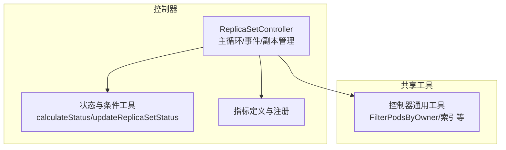
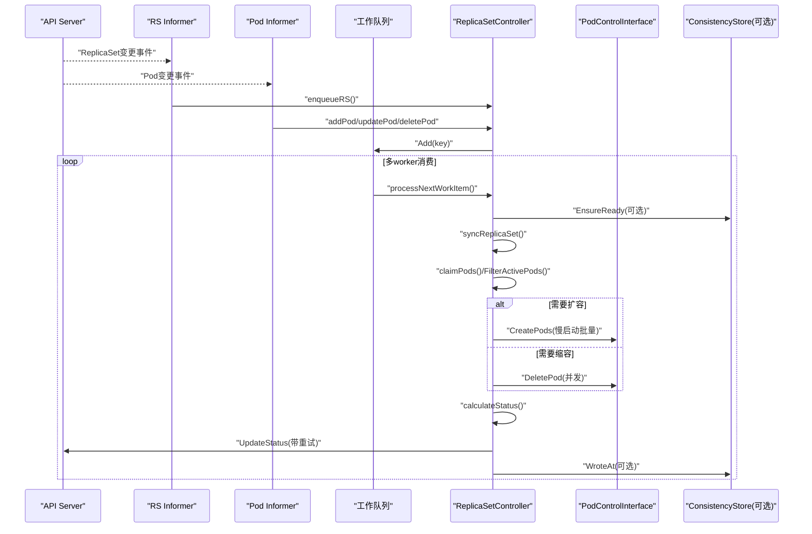
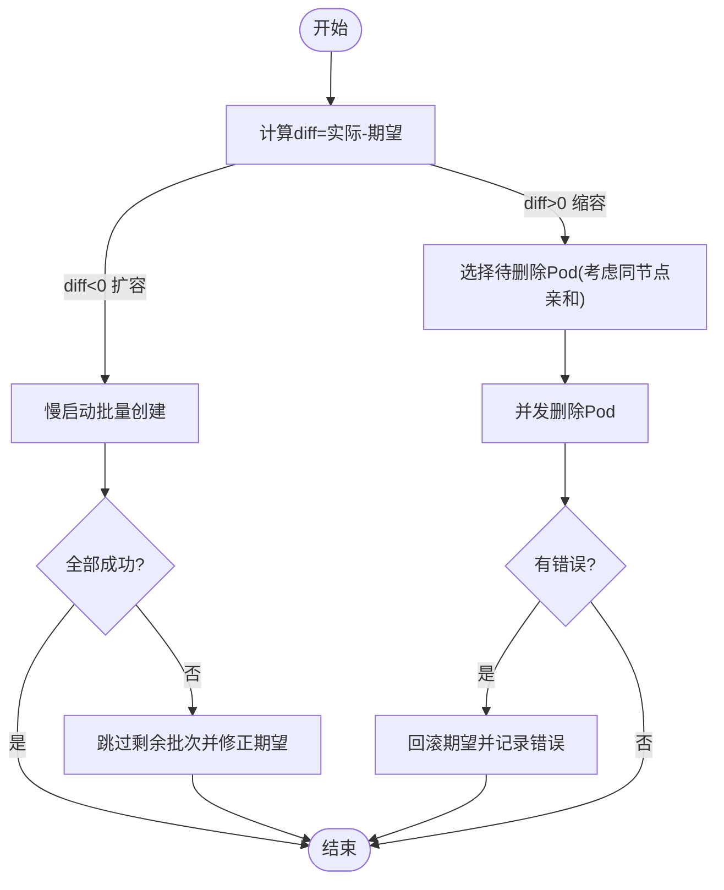
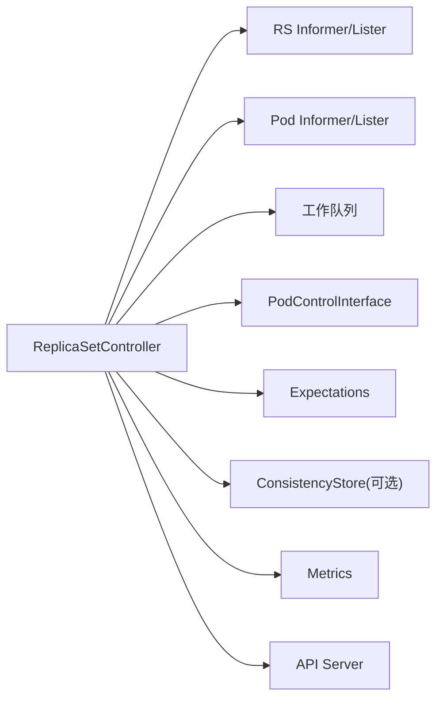

# ReplicaSet控制器

<cite>
**本文引用的文件**   
- [replica_set.go](file://pkg/controller/replicaset/replica_set.go)
- [replica_set_utils.go](file://pkg/controller/replicaset/replica_set_utils.go)
- [controller_utils.go](file://pkg/controller/controller_utils.go)
- [metrics.go](file://pkg/controller/replicaset/metrics/metrics.go)
</cite>

## 目录
1. [简介](#简介)
2. [项目结构](#项目结构)
3. [核心组件](#核心组件)
4. [架构总览](#架构总览)
5. [详细组件分析](#详细组件分析)
6. [依赖关系分析](#依赖关系分析)
7. [性能考量](#性能考量)
8. [故障排查指南](#故障排查指南)
9. [结论](#结论)
10. [附录](#附录)

## 简介
本文件面向Kubernetes ReplicaSet控制器的实现与使用，聚焦以下主题：
- 副本管理机制：Pod模板处理、期望副本数同步、状态维护逻辑
- Pod生命周期策略：创建、删除与替换（含“慢启动”批量创建与按节点亲和的删除排序）
- 标签选择器与资源匹配算法：如何基于Selector和OwnerReference筛选目标Pod
- 与Deployment控制器的协作关系与数据流转
- 配置示例、扩缩容操作与故障排查
- 性能优化建议与监控最佳实践

## 项目结构
ReplicaSet控制器位于pkg/controller/replicaset目录，核心文件包括：
- replica_set.go：控制器主循环、事件处理、副本管理、状态计算与更新
- replica_set_utils.go：状态计算、条件管理、状态更新封装
- metrics/metrics.go：控制器指标定义与注册
- 公共工具：pkg/controller/controller_utils.go中的索引与过滤函数被广泛复用

图表来源
- [replica_set.go:96-140](file://pkg/controller/replicaset/replica_set.go#L96-L140)
- [replica_set_utils.go:40-94](file://pkg/controller/replicaset/replica_set_utils.go#L40-L94)
- [metrics.go:23-56](file://pkg/controller/replicaset/metrics/metrics.go#L23-L56)
- [controller_utils.go:1167-1205](file://pkg/controller/controller_utils.go#L1167-L1205)

章节来源
- [replica_set.go:96-140](file://pkg/controller/replicaset/replica_set.go#L96-L140)
- [replica_set_utils.go:40-94](file://pkg/controller/replicaset/replica_set_utils.go#L40-L94)
- [metrics.go:23-56](file://pkg/controller/replicaset/metrics/metrics.go#L23-L56)
- [controller_utils.go:1167-1205](file://pkg/controller/controller_utils.go#L1167-L1205)

## 核心组件
- ReplicaSetController
  - 职责：监听ReplicaSet与Pod变化，维护期望与实际副本一致，更新状态
  - 关键能力：工作队列、期望跟踪、选择性重入、一致性存储（可选）、事件广播
- 副本管理
  - manageReplicas：比较activePods与Spec.Replicas，决定创建或删除；支持慢启动批量创建与并发删除
- 状态维护
  - calculateStatus：统计Replicas/FullyLabeledReplicas/ReadyReplicas/AvailableReplicas/TerminatingReplicas
  - updateReplicaSetStatus：带重试的状态更新，避免频繁写冲突
- 指标
  - sorting_deletion_age_ratio：评估缩容时删除Pod选择的合理性
  - stale_sync_skips_total：因watch缓存陈旧而跳过的同步次数

章节来源
- [replica_set.go:646-750](file://pkg/controller/replicaset/replica_set.go#L646-L750)
- [replica_set_utils.go:96-144](file://pkg/controller/replicaset/replica_set_utils.go#L96-L144)
- [replica_set_utils.go:40-94](file://pkg/controller/replicaset/replica_set_utils.go#L40-L94)
- [metrics.go:23-56](file://pkg/controller/replicaset/metrics/metrics.go#L23-L56)

## 架构总览
控制器采用Informer-Lister-WorkQueue经典模式，结合Expectations机制避免风暴式重入。

图表来源
- [replica_set.go:274-304](file://pkg/controller/replicaset/replica_set.go#L274-L304)
- [replica_set.go:387-460](file://pkg/controller/replicaset/replica_set.go#L387-L460)
- [replica_set.go:463-618](file://pkg/controller/replicaset/replica_set.go#L463-L618)
- [replica_set.go:752-857](file://pkg/controller/replicaset/replica_set.go#L752-L857)
- [replica_set.go:859-874](file://pkg/controller/replicaset/replica_set.go#L859-L874)
- [replica_set.go:876-911](file://pkg/controller/replicaset/replica_set.go#L876-L911)
- [replica_set_utils.go:40-94](file://pkg/controller/replicaset/replica_set_utils.go#L40-L94)

## 详细组件分析

### 控制器主循环与工作项调度
- Run：启动事件广播、等待缓存同步、拉起多个worker线程周期性拉取并处理工作项
- worker/processNextWorkItem：从队列取出key，调用syncHandler（即syncReplicaSet），失败则退避重入
- 事件回调：
  - addRS/updateRS/deleteRS：对RS增删改入队，UID变化时走delete路径清理期望
  - addPod/updatePod/deletePod：根据ControllerRef或标签匹配找到所属RS并触发同步；Pod进入DeletionTimestamp时立即入队以尽快补副本

章节来源
- [replica_set.go:274-304](file://pkg/controller/replicaset/replica_set.go#L274-L304)
- [replica_set.go:387-460](file://pkg/controller/replicaset/replica_set.go#L387-L460)
- [replica_set.go:463-618](file://pkg/controller/replicaset/replica_set.go#L463-L618)

### 副本同步与期望跟踪
- syncReplicaSet：
  - 解析key、获取RS对象
  - 可选一致性检查：若watch缓存陈旧则跳过本次同步并记录指标
  - 通过FilterPodsByOwner+FilterActivePods得到候选活跃Pod集合
  - claimPods：将匹配且无主的Pod收编为当前RS的子资源（设置ControllerRef）
  - 若满足期望且未删除，则调用manageReplicas进行扩缩容
  - 计算新状态并更新，必要时计划下一次MinReadySeconds可用性检查
- Expectations：
  - 创建：在发起批量创建前记录期望，成功后由Pod创建事件观测并减少期望
  - 删除：在发起删除前记录期望，由删除事件观测并减少期望
  - 仅当期望归零才执行完整同步，避免风暴

章节来源
- [replica_set.go:752-857](file://pkg/controller/replicaset/replica_set.go#L752-L857)
- [replica_set.go:859-874](file://pkg/controller/replicaset/replica_set.go#L859-L874)
- [replica_set.go:646-750](file://pkg/controller/replicaset/replica_set.go#L646-L750)

### 创建与删除策略
- 扩容（慢启动批量创建）
  - slowStartBatch：初始批次较小，成功则指数增长；任一失败则停止后续批次并返回首个错误
  - 针对命名空间终止等特定错误快速短路
- 缩容（并发删除与排序）
  - getIndirectlyRelatedPods：收集同属一个上层控制器（如Deployment）的其他RS下的Pod，用于“同节点亲和”评估
  - getPodsToDelete：优先删除“与相关Pod同节点数量更多”的Pod，以降低同节点故障面
  - 并发删除，失败时回滚期望计数并上报错误

图表来源
- [replica_set.go:646-750](file://pkg/controller/replicaset/replica_set.go#L646-L750)
- [replica_set.go:876-911](file://pkg/controller/replicaset/replica_set.go#L876-L911)
- [replica_set.go:913-950](file://pkg/controller/replicaset/replica_set.go#L913-L950)

### 标签选择器与资源匹配算法
- 选择器转换：将RS.Spec.Selector转换为labels.Selector
- 资源筛选：
  - FilterPodsByOwner：基于PodIndexer按OwnerReference键查询受控Pod，并可包含孤儿Pod以便收编
  - FilterActivePods：过滤出活跃Pod（排除Terminating）
  - FilterClaimedPods：在开启特性后，进一步筛选属于当前RS的Terminating Pod
- 收编（Adoption）：
  - claimPods：对孤儿Pod尝试设置ControllerRef为当前RS，确保只有合法RS能接管

章节来源
- [replica_set.go:790-814](file://pkg/controller/replicaset/replica_set.go#L790-L814)
- [controller_utils.go:1167-1205](file://pkg/controller/controller_utils.go#L1167-L1205)
- [replica_set.go:859-874](file://pkg/controller/replicaset/replica_set.go#L859-L874)

### 状态维护与条件
- calculateStatus：
  - Replicas：活跃Pod数量
  - FullyLabeledReplicas：完全匹配模板标签的Pod数量
  - ReadyReplicas：处于Ready状态的Pod数量
  - AvailableReplicas：满足MinReadySeconds的可用Pod数量
  - TerminatingReplicas：可选，统计正在终止的Pod数量（需特性开关）
  - ReplicaFailure条件：当扩缩容出错时设置FailedCreate/FailedDelete，恢复后清除
- updateReplicaSetStatus：
  - 先做差异判断，仅在字段或Generation变化时写入
  - 设置ObservedGeneration
  - 带一次GET/PUT重试，避免冲突导致状态不一致

章节来源
- [replica_set_utils.go:96-144](file://pkg/controller/replicaset/replica_set_utils.go#L96-L144)
- [replica_set_utils.go:40-94](file://pkg/controller/replicaset/replica_set_utils.go#L40-L94)

### 与Deployment控制器的协作关系
- 典型场景：Deployment创建新的RS，逐步将流量迁移至新RS，同时缩容旧RS
- 数据流要点：
  - Deployment通过创建/更新/删除RS驱动副本集演进
  - ReplicaSet控制器独立维护每个RS与其Pod的一致性
  - 删除排序会参考“间接相关Pod”（同属同一上层控制器的其他RS下的Pod），从而尽量保持同节点分布稳定
- 注意：本节为概念性说明，不直接映射到具体源码行

[本节为概念性内容，无需列出章节来源]

## 依赖关系分析
- 内部依赖
  - ReplicaSetController依赖：
    - Informers/Listers：RS与Pod的本地缓存
    - WorkQueue：带速率限制的工作队列
    - PodControlInterface：抽象的Pod创建/删除接口
    - ConsistencyStore（可选）：防止因watch缓存陈旧导致的误判
    - Expectations：避免重复同步风暴
- 外部依赖
  - API Server：读写RS/Pod/Event
  - Metrics：暴露控制器行为指标

图表来源
- [replica_set.go:96-140](file://pkg/controller/replicaset/replica_set.go#L96-L140)
- [replica_set.go:274-304](file://pkg/controller/replicaset/replica_set.go#L274-L304)
- [replica_set.go:752-857](file://pkg/controller/replicaset/replica_set.go#L752-L857)
- [metrics.go:23-56](file://pkg/controller/replicaset/metrics/metrics.go#L23-L56)

章节来源
- [replica_set.go:96-140](file://pkg/controller/replicaset/replica_set.go#L96-L140)
- [replica_set.go:274-304](file://pkg/controller/replicaset/replica_set.go#L274-L304)
- [replica_set.go:752-857](file://pkg/controller/replicaset/replica_set.go#L752-L857)
- [metrics.go:23-56](file://pkg/controller/replicaset/metrics/metrics.go#L23-L56)

## 性能考量
- 慢启动批量创建：有效抑制大规模失败时的API风暴，提高整体成功率
- 并发删除：缩短缩容时间，配合期望跟踪保证最终一致性
- 选择性重入：仅在期望满足且必要条件下执行完整同步，降低CPU与API压力
- 状态更新去抖：仅在字段或Generation变化时写入，减少不必要的写放大
- 一致性存储（可选）：避免因watch缓存陈旧导致的误判与抖动
- 指标可观测：
  - sorting_deletion_age_ratio：评估缩容排序有效性（应小于2）
  - stale_sync_skips_total：观察因陈旧缓存跳过的同步次数

章节来源
- [replica_set.go:646-750](file://pkg/controller/replicaset/replica_set.go#L646-L750)
- [replica_set.go:876-911](file://pkg/controller/replicaset/replica_set.go#L876-L911)
- [replica_set_utils.go:40-94](file://pkg/controller/replicaset/replica_set_utils.go#L40-L94)
- [metrics.go:23-56](file://pkg/controller/replicaset/metrics/metrics.go#L23-L56)

## 故障排查指南
- 常见问题定位
  - 扩缩容失败：查看RS.Status.Conditions中ReplicaFailure的Reason（FailedCreate/FailedDelete）与Message
  - 状态不一致：关注stale_sync_skips_total是否上升，确认watch缓存健康度
  - 缩容效果不佳：检查sorting_deletion_age_ratio是否异常偏高，评估节点分布与亲和影响
- 诊断步骤
  - 检查RS.Spec.Replicas与Status.Replicas/FullyLabeledReplicas/ReadyReplicas/AvailableReplicas是否收敛
  - 核对Pod的Label是否与Selector匹配，是否存在孤儿Pod未被收编
  - 观察事件与日志，确认是否频繁触发requeue与慢启动
- 修复建议
  - 修正Selector或Pod模板标签，确保匹配预期
  - 调整MinReadySeconds，平衡就绪判定与可用性更新频率
  - 合理设置burstReplicas与队列参数，避免过大造成抖动

章节来源
- [replica_set_utils.go:96-144](file://pkg/controller/replicaset/replica_set_utils.go#L96-L144)
- [replica_set.go:752-857](file://pkg/controller/replicaset/replica_set.go#L752-L857)
- [metrics.go:23-56](file://pkg/controller/replicaset/metrics/metrics.go#L23-L56)

## 结论
ReplicaSet控制器通过Informer-Lister-WorkQueue与Expectations机制，实现了高效、稳定的副本一致性维护。其慢启动批量创建、并发删除与节点亲和排序显著提升了扩缩容的鲁棒性与效率。配合状态去抖与可选的一致性检查，系统在大规模场景下仍保持稳定。通过内置指标与清晰的故障定位路径，运维人员可快速发现并解决问题。

[本节为总结性内容，无需列出章节来源]

## 附录

### 配置与使用要点
- 基本字段
  - spec.selector：标签选择器，决定哪些Pod归属该RS
  - spec.template：Pod模板，所有受管Pod均以此为基础生成
  - spec.replicas：期望副本数
  - spec.minReadySeconds：最小就绪时长，影响AvailableReplicas统计
- 扩缩容操作
  - 直接修改RS.spec.replicas触发控制器同步
  - 或通过Deployment进行滚动升级/回滚，由Deployment协调新旧RS的副本数
- 注意事项
  - 避免手动修改受管Pod的标签或OwnerReference，以免破坏归属关系
  - 谨慎设置MinReadySeconds，过长会影响可用性更新频率

[本节为概念性内容，无需列出章节来源]