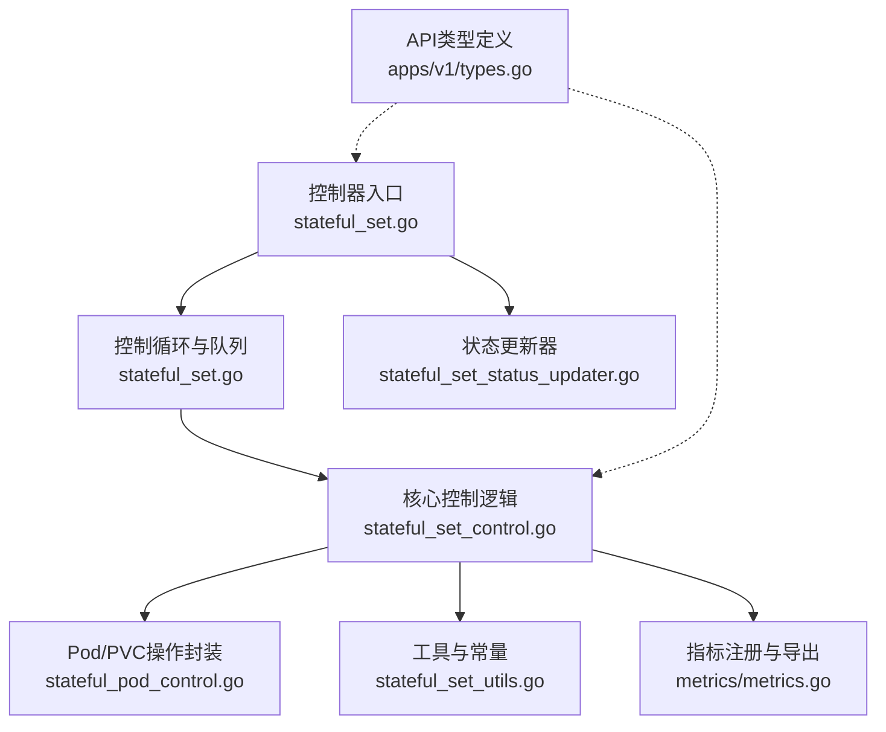
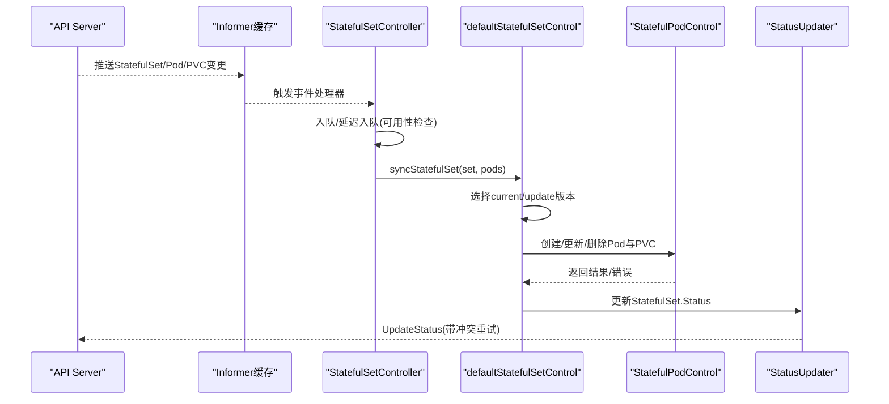
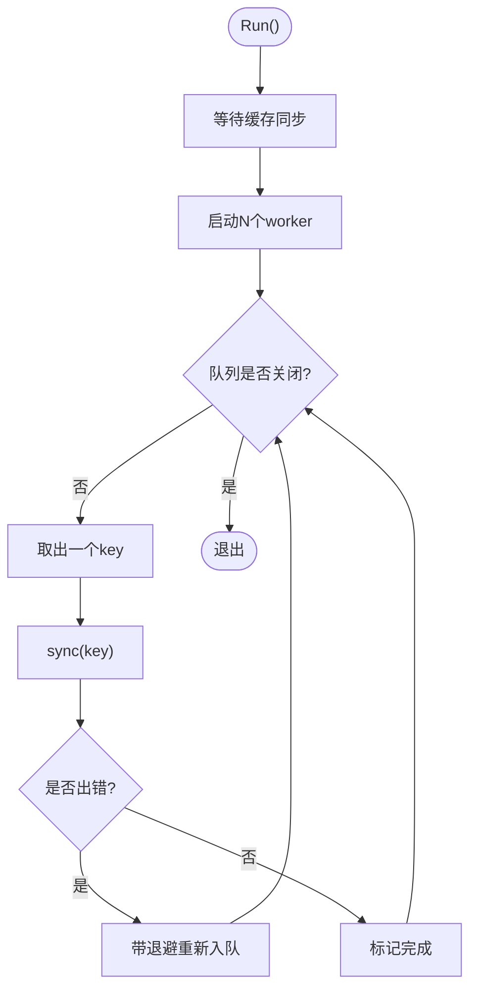
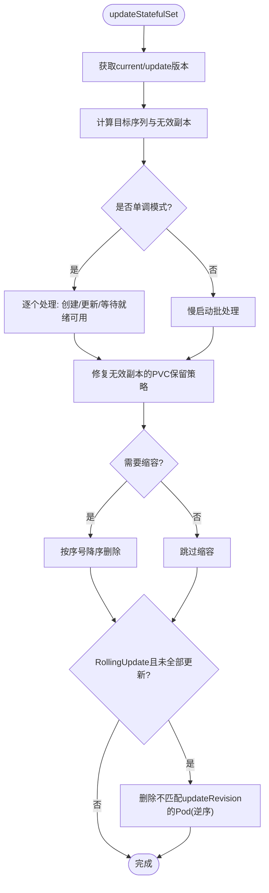
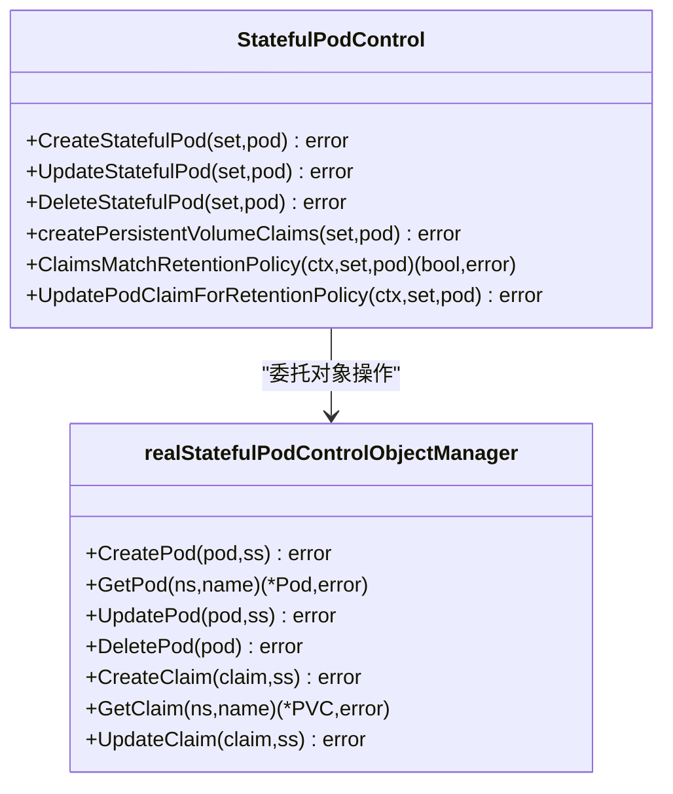
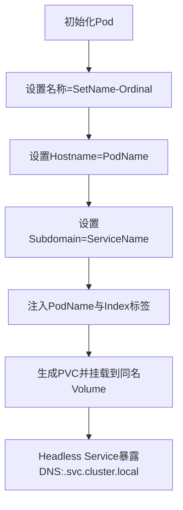
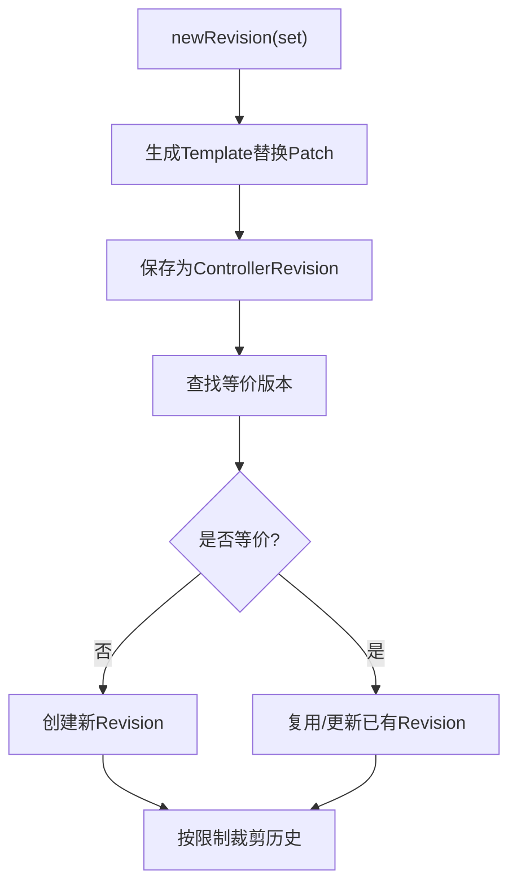
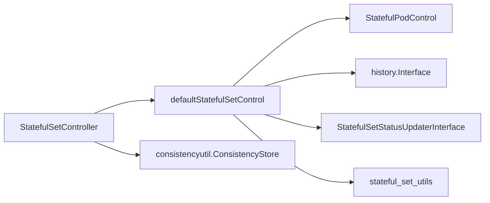

# StatefulSet控制器

<cite>
**本文引用的文件**   
- [stateful_set.go](file://pkg/controller/statefulset/stateful_set.go)
- [stateful_set_control.go](file://pkg/controller/statefulset/stateful_set_control.go)
- [stateful_pod_control.go](file://pkg/controller/statefulset/stateful_pod_control.go)
- [stateful_set_utils.go](file://pkg/controller/statefulset/stateful_set_utils.go)
- [stateful_set_status_updater.go](file://pkg/controller/statefulset/stateful_set_status_updater.go)
- [metrics.go](file://pkg/controller/statefulset/metrics/metrics.go)
- [types.go](file://staging/src/k8s.io/api/apps/v1/types.go)
</cite>

## 目录
1. [简介](#简介)
2. [项目结构](#项目结构)
3. [核心组件](#核心组件)
4. [架构总览](#架构总览)
5. [详细组件分析](#详细组件分析)
6. [依赖关系分析](#依赖关系分析)
7. [性能与可扩展性](#性能与可扩展性)
8. [故障排查指南](#故障排查指南)
9. [结论](#结论)
10. [附录](#附录)

## 简介
本文件面向Kubernetes StatefulSet控制器的实现，系统性阐述其有状态应用管理能力：有序部署、滚动/分区/重建更新策略、水平扩展与收缩、稳定网络标识（Headless Service + DNS）、持久化存储绑定与生命周期管理、版本回滚与历史裁剪、以及监控指标与最佳实践。文档以源码为依据，提供架构图、时序图与流程图，帮助读者从概念到代码层面全面理解StatefulSet控制器。

## 项目结构
StatefulSet控制器位于pkg/controller/statefulset目录，核心职责包括：
- 监听StatefulSet、Pod、PVC、ControllerRevision等对象变化
- 维护副本集合的期望与实际状态一致
- 按序创建/删除Pod并保证稳定性
- 管理VolumeClaimTemplates对应的PVC及其保留策略
- 维护版本历史与回滚能力
- 输出控制器指标

图表来源
- [stateful_set.go:112-222](file://pkg/controller/statefulset/stateful_set.go#L112-L222)
- [stateful_set_control.go:84-154](file://pkg/controller/statefulset/stateful_set_control.go#L84-L154)
- [stateful_pod_control.go:56-76](file://pkg/controller/statefulset/stateful_pod_control.go#L56-L76)
- [stateful_set_utils.go:43-53](file://pkg/controller/statefulset/stateful_set_utils.go#L43-L53)
- [metrics.go:26-86](file://pkg/controller/statefulset/metrics/metrics.go#L26-L86)
- [types.go:42-66](file://staging/src/k8s.io/api/apps/v1/types.go#L42-L66)

章节来源
- [stateful_set.go:112-222](file://pkg/controller/statefulset/stateful_set.go#L112-L222)
- [stateful_set_control.go:84-154](file://pkg/controller/statefulset/stateful_set_control.go#L84-L154)
- [stateful_pod_control.go:56-76](file://pkg/controller/statefulset/stateful_pod_control.go#L56-L76)
- [stateful_set_utils.go:43-53](file://pkg/controller/statefulset/stateful_set_utils.go#L43-L53)
- [metrics.go:26-86](file://pkg/controller/statefulset/metrics/metrics.go#L26-L86)
- [types.go:42-66](file://staging/src/k8s.io/api/apps/v1/types.go#L42-L66)

## 核心组件
- StatefulSetController：控制器主循环、事件处理、工作队列、一致性保障与可用性检查调度
- defaultStatefulSetControl：核心编排逻辑，负责版本选择、副本计算、更新/伸缩流程、状态聚合
- StatefulPodControl：对Pod与PVC的增删改查封装，包含身份与存储一致性校验、PVC保留策略修正
- StatefulSetStatusUpdaterInterface：原子化更新StatefulSet.Status，带冲突重试
- 工具集：名称/序号解析、标签/注解注入、版本补丁生成与应用、条件设置、排序与不可用数计算
- 指标：MaxUnavailable、UnavailableReplicas、StaleSyncSkipsTotal

章节来源
- [stateful_set.go:65-95](file://pkg/controller/statefulset/stateful_set.go#L65-L95)
- [stateful_set_control.go:47-82](file://pkg/controller/statefulset/stateful_set_control.go#L47-L82)
- [stateful_pod_control.go:40-76](file://pkg/controller/statefulset/stateful_pod_control.go#L40-L76)
- [stateful_set_status_updater.go:33-48](file://pkg/controller/statefulset/stateful_set_status_updater.go#L33-L48)
- [stateful_set_utils.go:43-53](file://pkg/controller/statefulset/stateful_set_utils.go#L43-L53)
- [metrics.go:26-86](file://pkg/controller/statefulset/metrics/metrics.go#L26-L86)

## 架构总览
StatefulSet控制器采用“共享 informer + 工作队列”的经典模式，通过事件驱动将StatefulSet与其子资源（Pod、PVC）的变化入队，由worker串行化处理同一key，避免并发冲突；在单调模式下严格顺序推进，非单调模式下支持批量化并行加速。

图表来源
- [stateful_set.go:224-253](file://pkg/controller/statefulset/stateful_set.go#L224-L253)
- [stateful_set_control.go:84-154](file://pkg/controller/statefulset/stateful_set_control.go#L84-L154)
- [stateful_set_status_updater.go:56-85](file://pkg/controller/statefulset/stateful_set_status_updater.go#L56-L85)

## 详细组件分析

### 控制器主循环与事件处理
- 启动事件广播与记录器，注册指标
- 等待informer缓存同步后，启动多worker轮询队列
- 监听Pod/StatefulSet事件，基于ControllerRef或标签匹配将对应StatefulSet入队
- 针对MinReadySeconds场景进行延迟入队，确保Available计数准确

图表来源
- [stateful_set.go:224-253](file://pkg/controller/statefulset/stateful_set.go#L224-L253)
- [stateful_set.go:500-521](file://pkg/controller/statefulset/stateful_set.go#L500-L521)

章节来源
- [stateful_set.go:112-222](file://pkg/controller/statefulset/stateful_set.go#L112-L222)
- [stateful_set.go:224-253](file://pkg/controller/statefulset/stateful_set.go#L224-L253)
- [stateful_set.go:255-380](file://pkg/controller/statefulset/stateful_set.go#L255-L380)
- [stateful_set.go:500-521](file://pkg/controller/statefulset/stateful_set.go#L500-L521)

### 核心控制逻辑：版本选择与更新流程
- 版本选择：根据当前与更新版本的差异、等价性比较与碰撞计数，决定是否需要新建ControllerRevision
- 副本划分：将现有Pod划分为“有效副本”和“待淘汰副本”，并按序号填充缺失位置
- 单调模式（OrderedReady）：逐个推进，要求前驱就绪/可用后才继续
- 非单调模式（Parallel）：批量并行，使用慢启动限流
- 更新策略：
  - RollingUpdate：按Partition自高序号向低序号滚动，支持MaxUnavailable
  - OnDelete：仅更新状态，不自动重启
  - Recreate（特性门控）：先全量删除旧版，再创建新版

图表来源
- [stateful_set_control.go:555-770](file://pkg/controller/statefulset/stateful_set_control.go#L555-L770)
- [stateful_set_control.go:334-364](file://pkg/controller/statefulset/stateful_set_control.go#L334-L364)

章节来源
- [stateful_set_control.go:84-154](file://pkg/controller/statefulset/stateful_set_control.go#L84-L154)
- [stateful_set_control.go:555-770](file://pkg/controller/statefulset/stateful_set_control.go#L555-L770)
- [stateful_set_control.go:334-364](file://pkg/controller/statefulset/stateful_set_control.go#L334-L364)

### Pod与PVC操作封装
- 创建Pod前优先创建所需PVC，随后设置PVC保留策略OwnerReference
- 更新Pod时，若身份或存储不一致则修正并尝试创建缺失PVC
- 删除Pod时对NotFound视为成功
- PVC保留策略：
  - WhenDeleted/WhenScaled组合决定缩容或删除StatefulSet时的PVC行为
  - 自动清理冲突的第三方控制器引用，保持与策略一致

图表来源
- [stateful_pod_control.go:56-76](file://pkg/controller/statefulset/stateful_pod_control.go#L56-L76)
- [stateful_pod_control.go:86-152](file://pkg/controller/statefulset/stateful_pod_control.go#L86-L152)
- [stateful_pod_control.go:154-234](file://pkg/controller/statefulset/stateful_pod_control.go#L154-L234)
- [stateful_pod_control.go:249-329](file://pkg/controller/statefulset/stateful_pod_control.go#L249-L329)

章节来源
- [stateful_pod_control.go:154-234](file://pkg/controller/statefulset/stateful_pod_control.go#L154-L234)
- [stateful_pod_control.go:249-329](file://pkg/controller/statefulset/stateful_pod_control.go#L249-L329)
- [stateful_pod_control.go:364-406](file://pkg/controller/statefulset/stateful_pod_control.go#L364-L406)

### 身份、存储与DNS集成
- 稳定网络标识：
  - Pod命名规则：<statefulsetname>-<ordinal>
  - 固定hostname与subdomain指向Headless Service的serviceName
  - 标签注入statefulset.kubernetes.io/pod-name与apps.kubernetes.io/pod-index
- 存储绑定：
  - VolumeClaimTemplates为每个Pod生成唯一命名的PVC
  - 自动补齐Pod中对应volume挂载，确保与模板一致
- Headless Service与DNS：
  - serviceName指定Headless Service名
  - DNS记录形如：<pod-name>.<serviceName>.<namespace>.svc.cluster.local

图表来源
- [stateful_set_utils.go:119-145](file://pkg/controller/statefulset/stateful_set_utils.go#L119-L145)
- [stateful_set_utils.go:420-464](file://pkg/controller/statefulset/stateful_set_utils.go#L420-L464)
- [types.go:241-249](file://staging/src/k8s.io/api/apps/v1/types.go#L241-L249)

章节来源
- [stateful_set_utils.go:119-145](file://pkg/controller/statefulset/stateful_set_utils.go#L119-L145)
- [stateful_set_utils.go:420-464](file://pkg/controller/statefulset/stateful_set_utils.go#L420-L464)
- [types.go:241-249](file://staging/src/k8s.io/api/apps/v1/types.go#L241-L249)

### 版本历史、回滚与裁剪
- 版本生成：基于当前Spec的Template生成Patch，存入ControllerRevision
- 等价性判断：利用语义比较与内存缓存减少不必要的版本创建
- 历史裁剪：保留当前与更新版本及活跃Pod关联的版本，其余按RevisionHistoryLimit删除

图表来源
- [stateful_set_utils.go:573-614](file://pkg/controller/statefulset/stateful_set_utils.go#L573-L614)
- [stateful_set_control.go:177-219](file://pkg/controller/statefulset/stateful_set_control.go#L177-L219)
- [stateful_set_control.go:237-262](file://pkg/controller/statefulset/stateful_set_control.go#L237-L262)

章节来源
- [stateful_set_utils.go:573-614](file://pkg/controller/statefulset/stateful_set_utils.go#L573-L614)
- [stateful_set_control.go:177-219](file://pkg/controller/statefulset/stateful_set_control.go#L177-L219)
- [stateful_set_control.go:237-262](file://pkg/controller/statefulset/stateful_set_control.go#L237-L262)

### 状态聚合与可用性
- 统计Replicas/ReadyReplicas/AvailableReplicas/CurrentReplicas/UpdatedReplicas
- MinReadySeconds影响Available判定，必要时延迟入队以确保计数正确
- Progressing条件用于Recreate策略的阶段提示

章节来源
- [stateful_set_control.go:374-419](file://pkg/controller/statefulset/stateful_set_control.go#L374-L419)
- [stateful_set_utils.go:712-763](file://pkg/controller/statefulset/stateful_set_utils.go#L712-L763)
- [stateful_set.go:581-609](file://pkg/controller/statefulset/stateful_set.go#L581-L609)

## 依赖关系分析
- 外部依赖
  - client-go informer/listers：缓存与事件分发
  - history.Interface：ControllerRevision的CRUD与索引
  - consistencyutil.ConsistencyStore：防止因watch缓存陈旧导致的误判
- 内部耦合
  - StatefulSetController依赖StatefulSetControlInterface与StatusUpdater
  - defaultStatefulSetControl依赖StatefulPodControl执行具体对象操作
  - 工具函数集中提供身份/存储/版本相关逻辑

图表来源
- [stateful_set.go:112-179](file://pkg/controller/statefulset/stateful_set.go#L112-L179)
- [stateful_set_control.go:64-82](file://pkg/controller/statefulset/stateful_set_control.go#L64-L82)
- [stateful_set_status_updater.go:41-48](file://pkg/controller/statefulset/stateful_set_status_updater.go#L41-L48)

章节来源
- [stateful_set.go:112-179](file://pkg/controller/statefulset/stateful_set.go#L112-L179)
- [stateful_set_control.go:64-82](file://pkg/controller/statefulset/stateful_set_control.go#L64-L82)
- [stateful_set_status_updater.go:41-48](file://pkg/controller/statefulset/stateful_set_status_updater.go#L41-L48)

## 性能与可扩展性
- 单调与非单调模式
  - OrderedReady：强一致但吞吐较低
  - Parallel：慢启动批处理，提升吞吐，需关注可用性风险
- MaxUnavailable（特性门控）
  - 允许在滚动更新期间同时不可用的最大副本数，默认1
  - 指标statefulset_max_unavailable与statefulset_unavailable_replicas可观测配置与实际差距
- 一致性保护
  - 当watch缓存陈旧时跳过同步，避免误删/误建，指标stale_sync_skips_total可追踪

章节来源
- [stateful_set_control.go:334-364](file://pkg/controller/statefulset/stateful_set_control.go#L334-L364)
- [stateful_set_control.go:732-741](file://pkg/controller/statefulset/stateful_set_control.go#L732-L741)
- [metrics.go:26-86](file://pkg/controller/statefulset/metrics/metrics.go#L26-L86)
- [stateful_set.go:540-549](file://pkg/controller/statefulset/stateful_set.go#L540-L549)

## 故障排查指南
- 常见现象与定位
  - Pod无法就绪：检查MinReadySeconds、探针、节点资源与调度
  - PVC未创建：查看Pending阶段是否触发PVC创建，确认StorageClass与配额
  - 缩容后数据丢失：检查PVC保留策略（WhenScaled/WhenDeleted）
  - 滚动更新卡住：观察MaxUnavailable与UnavailableReplicas，确认是否有前置Pod未就绪
- 关键日志与事件
  - 控制器事件：Successful/Failed create/update/delete
  - 警告事件：UnknownStrategy（Recreate策略未开启特性门控）
- 指标与查询建议
  - statefulset_max_unavailable：对比实际不可用数
  - statefulset_unavailable_replicas：监控可用性趋势
  - stale_sync_skips_total：检测缓存陈旧导致的跳过次数

章节来源
- [stateful_pod_control.go:331-362](file://pkg/controller/statefulset/stateful_pod_control.go#L331-L362)
- [stateful_set_control.go:576-581](file://pkg/controller/statefulset/stateful_set_control.go#L576-L581)
- [metrics.go:26-86](file://pkg/controller/statefulset/metrics/metrics.go#L26-L86)

## 结论
StatefulSet控制器通过严格的身份与存储绑定、有序更新与可选的并行优化、完善的版本历史与回滚机制，以及对PVC生命周期的精细控制，为有状态工作负载提供了可靠的编排基础。配合Headless Service与DNS，可实现稳定的网络访问；结合指标与事件，便于运维侧进行容量规划与故障定位。

## 附录

### 配置要点速览
- 稳定网络标识
  - 必须预先创建Headless Service，并在StatefulSet中指定serviceName
  - Pod DNS形如：<pod-name>.<serviceName>.<namespace>.svc.cluster.local
- 持久化存储
  - 使用VolumeClaimTemplates声明PVC模板，控制器会为每个Pod生成唯一命名的PVC
  - 通过persistentVolumeClaimRetentionPolicy控制缩容与删除时的PVC保留/删除策略
- 更新策略
  - RollingUpdate：支持Partition与MaxUnavailable
  - OnDelete：手动删除Pod触发更新
  - Recreate：全量重建，需启用特性门控
- 副本编号
  - 可通过Ordinals.Start自定义起始序号，便于跨集合迁移或重排

章节来源
- [types.go:200-297](file://staging/src/k8s.io/api/apps/v1/types.go#L200-L297)
- [stateful_set_utils.go:119-145](file://pkg/controller/statefulset/stateful_set_utils.go#L119-L145)
- [stateful_set_utils.go:420-464](file://pkg/controller/statefulset/stateful_set_utils.go#L420-L464)
- [stateful_set_control.go:555-770](file://pkg/controller/statefulset/stateful_set_control.go#L555-L770)