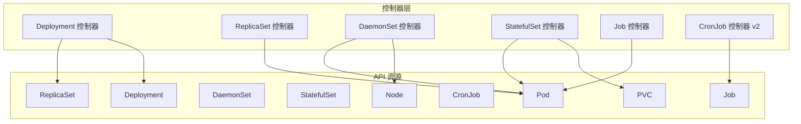
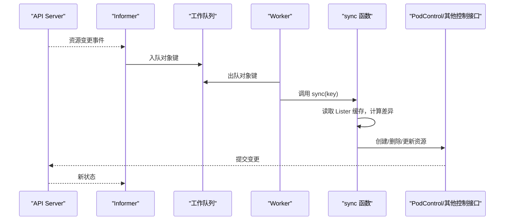
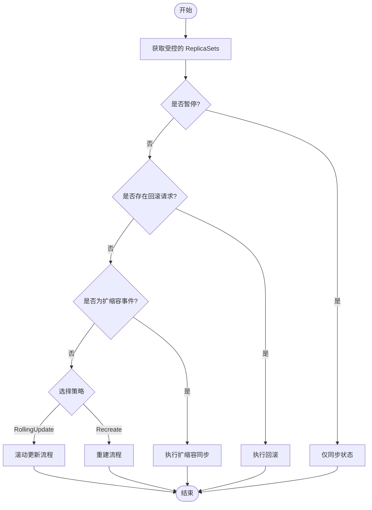
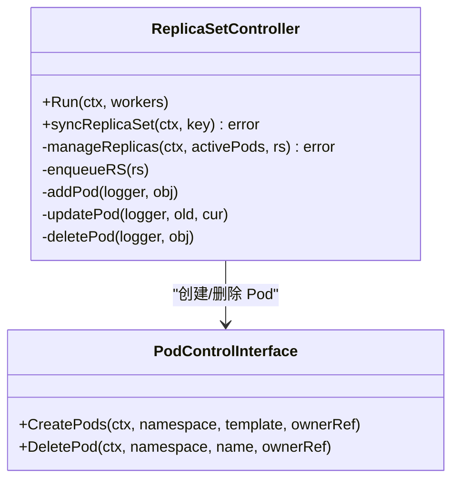
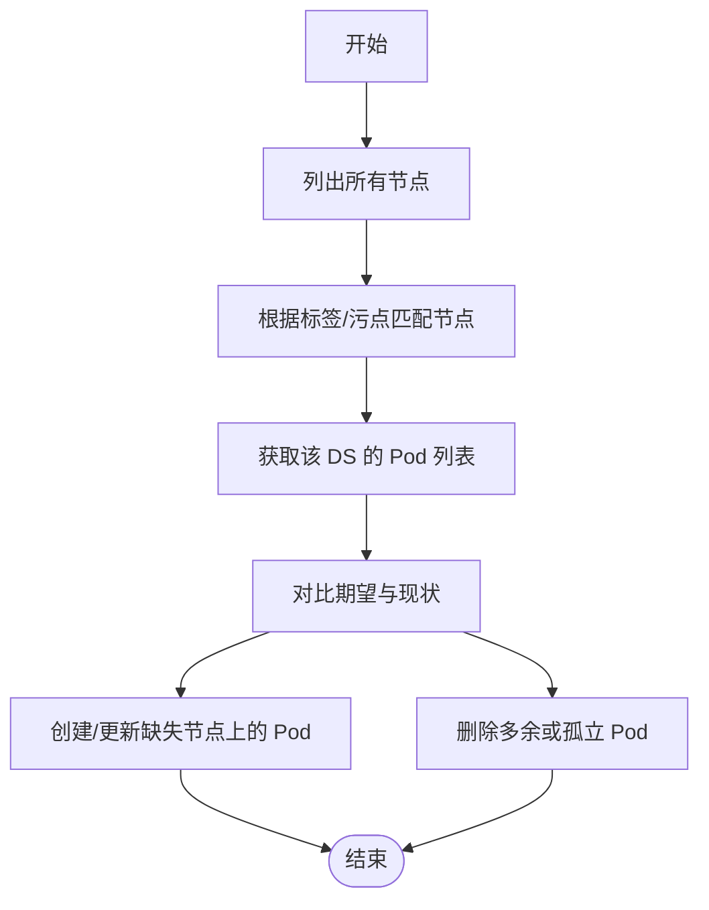
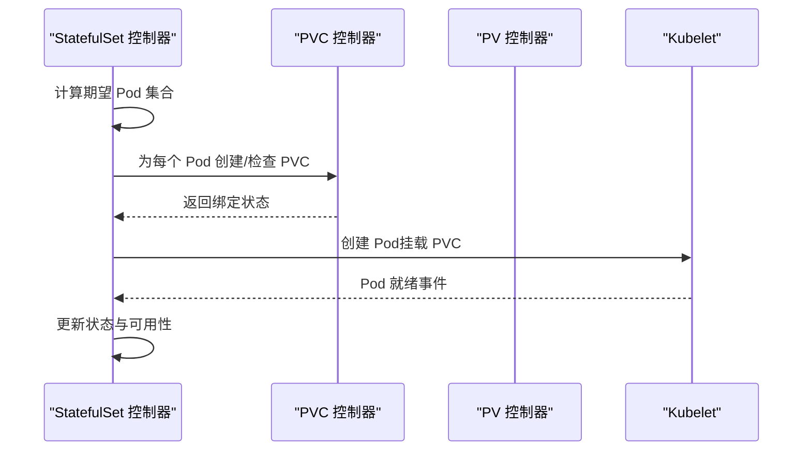
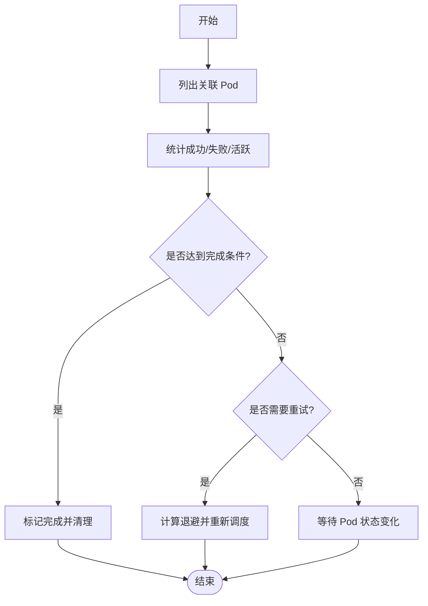
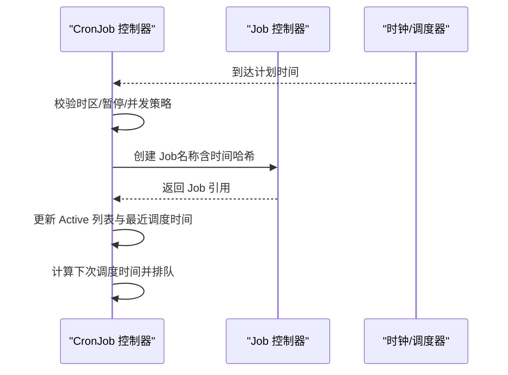
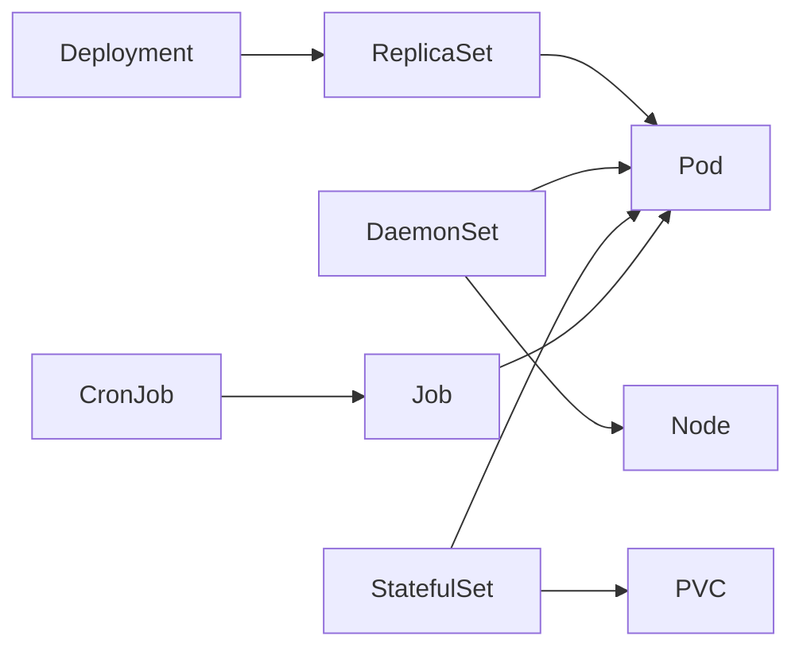

# 应用工作负载控制器

<cite>
**本文引用的文件**   
- [deployment_controller.go](file://pkg/controller/deployment/deployment_controller.go)
- [rolling.go](file://pkg/controller/deployment/rolling.go)
- [recreate.go](file://pkg/controller/deployment/recreate.go)
- [rollback.go](file://pkg/controller/deployment/rollback.go)
- [replica_set.go](file://pkg/controller/replicaset/replica_set.go)
- [daemon_controller.go](file://pkg/controller/daemon/daemon_controller.go)
- [stateful_set.go](file://pkg/controller/statefulset/stateful_set.go)
- [job_controller.go](file://pkg/controller/job/job_controller.go)
- [cronjob_controllerv2.go](file://pkg/controller/cronjob/cronjob_controllerv2.go)
</cite>

## 目录
1. [简介](#简介)
2. [项目结构](#项目结构)
3. [核心组件](#核心组件)
4. [架构总览](#架构总览)
5. [详细组件分析](#详细组件分析)
6. [依赖关系分析](#依赖关系分析)
7. [性能考量](#性能考量)
8. [故障诊断指南](#故障诊断指南)
9. [结论](#结论)
10. [附录](#附录)

## 简介
本技术文档聚焦 Kubernetes 应用工作负载相关控制器的实现与运行机制，覆盖以下关键主题：
- Deployment 的滚动更新策略、版本回滚与扩缩容机制
- ReplicaSet 的副本管理、Pod 模板处理与状态同步逻辑
- DaemonSet 的节点匹配算法与部署策略
- StatefulSet 的有状态应用管理、存储绑定与有序部署特性
- Job 与 CronJob 的任务调度、重试机制与完成状态管理
- 配置示例、最佳实践与故障诊断方法

## 项目结构
Kubernetes 控制器位于 pkg/controller 下，按工作负载类型分目录组织。每个控制器通过 Informer/Lister 监听资源变化，使用工作队列进行增量同步，并通过 PodControl 等接口创建/删除 Pod 或子资源。

图表来源
- [deployment_controller.go:104-168](file://pkg/controller/deployment/deployment_controller.go#L104-L168)
- [replica_set.go:155-272](file://pkg/controller/replicaset/replica_set.go#L155-L272)
- [daemon_controller.go:158-291](file://pkg/controller/daemon/daemon_controller.go#L158-L291)
- [stateful_set.go:113-222](file://pkg/controller/statefulset/stateful_set.go#L113-L222)
- [job_controller.go:211-322](file://pkg/controller/job/job_controller.go#L211-L322)
- [cronjob_controllerv2.go:89-154](file://pkg/controller/cronjob/cronjob_controllerv2.go#L89-L154)

章节来源
- [deployment_controller.go:104-168](file://pkg/controller/deployment/deployment_controller.go#L104-L168)
- [replica_set.go:155-272](file://pkg/controller/replicaset/replica_set.go#L155-L272)
- [daemon_controller.go:158-291](file://pkg/controller/daemon/daemon_controller.go#L158-L291)
- [stateful_set.go:113-222](file://pkg/controller/statefulset/stateful_set.go#L113-L222)
- [job_controller.go:211-322](file://pkg/controller/job/job_controller.go#L211-L322)
- [cronjob_controllerv2.go:89-154](file://pkg/controller/cronjob/cronjob_controllerv2.go#L89-L154)

## 核心组件
- Deployment 控制器：负责协调多个 ReplicaSet，执行滚动/重建策略，支持回滚与扩缩容。
- ReplicaSet 控制器：维护期望副本数，批量创建/删除 Pod，跟踪期望与一致性。
- DaemonSet 控制器：在每个匹配节点上运行一个 Pod，处理节点变更与最小就绪时间。
- StatefulSet 控制器：为每个实例提供稳定网络标识与持久化存储，按序部署与扩容。
- Job 控制器：确保任务 Pod 成功完成，支持失败重试、索引任务与工作负载集成。
- CronJob 控制器 v2：基于定时计划触发 Job，管理并发策略与历史清理。

章节来源
- [deployment_controller.go:572-661](file://pkg/controller/deployment/deployment_controller.go#L572-L661)
- [replica_set.go:646-750](file://pkg/controller/replicaset/replica_set.go#L646-L750)
- [daemon_controller.go:757-800](file://pkg/controller/daemon/daemon_controller.go#L757-L800)
- [stateful_set.go:524-610](file://pkg/controller/statefulset/stateful_set.go#L524-L610)
- [job_controller.go:89-155](file://pkg/controller/job/job_controller.go#L89-L155)
- [cronjob_controllerv2.go:64-86](file://pkg/controller/cronjob/cronjob_controllerv2.go#L64-L86)

## 架构总览
各控制器遵循“事件驱动 + 工作队列 + 本地缓存”的通用模式：Informer 监听 API Server 变化，将对象键入工作队列；Worker 从队列取出并调用 sync 函数，读取 Lister 缓存计算差异，再通过 PodControl 等接口操作实际资源。

图表来源
- [deployment_controller.go:170-199](file://pkg/controller/deployment/deployment_controller.go#L170-L199)
- [replica_set.go:274-304](file://pkg/controller/replicaset/replica_set.go#L274-L304)
- [daemon_controller.go:356-390](file://pkg/controller/daemon/daemon_controller.go#L356-L390)
- [stateful_set.go:224-253](file://pkg/controller/statefulset/stateful_set.go#L224-L253)
- [job_controller.go:324-361](file://pkg/controller/job/job_controller.go#L324-L361)
- [cronjob_controllerv2.go:156-185](file://pkg/controller/cronjob/cronjob_controllerv2.go#L156-L185)

## 详细组件分析

### Deployment 控制器：滚动更新、回滚与扩缩容
- 滚动更新策略（RollingUpdate）：根据策略参数逐步创建新版本 Pod，同时按比例或最大不可用数量限制旧版本 Pod 的终止，保证服务可用性。
- 重建策略（Recreate）：先终止所有旧 Pod，再启动新 Pod，适用于无状态且可一次性替换的工作负载。
- 版本回滚：当检测到回滚请求时，优先执行回滚流程，避免与正常同步冲突。
- 扩缩容：当 spec.replicas 发生变化时，直接走同步路径调整副本数。

图表来源
- [deployment_controller.go:572-661](file://pkg/controller/deployment/deployment_controller.go#L572-L661)
- [rolling.go](file://pkg/controller/deployment/rolling.go)
- [recreate.go](file://pkg/controller/deployment/recreate.go)
- [rollback.go](file://pkg/controller/deployment/rollback.go)

章节来源
- [deployment_controller.go:572-661](file://pkg/controller/deployment/deployment_controller.go#L572-L661)
- [rolling.go](file://pkg/controller/deployment/rolling.go)
- [recreate.go](file://pkg/controller/deployment/recreate.go)
- [rollback.go](file://pkg/controller/deployment/rollback.go)

### ReplicaSet 控制器：副本管理与 Pod 模板处理
- 副本管理：比较当前活跃 Pod 数与期望副本数，决定创建或删除 Pod。
- 批量创建：采用慢启动批处理，避免配额不足或 API 过载导致雪崩。
- 期望跟踪：记录预期的创建/删除事件，确保 informer 观察与实际动作一致。
- MinReadySeconds：Pod 就绪后延迟再计入可用副本，保障稳定性。

图表来源
- [replica_set.go:95-140](file://pkg/controller/replicaset/replica_set.go#L95-L140)
- [replica_set.go:646-750](file://pkg/controller/replicaset/replica_set.go#L646-L750)

章节来源
- [replica_set.go:646-750](file://pkg/controller/replicaset/replica_set.go#L646-L750)
- [replica_set.go:274-304](file://pkg/controller/replicaset/replica_set.go#L274-L304)

### DaemonSet 控制器：节点匹配与部署策略
- 节点匹配：基于 Node 标签与污点容忍度选择目标节点，确保 Pod 调度到合适节点。
- 部署策略：每个匹配节点运行一个 Pod，监听节点变更（标签/污点），动态增删 Pod。
- 最小就绪时间：Pod 就绪后延迟再计入可用，避免频繁重排。

图表来源
- [daemon_controller.go:757-800](file://pkg/controller/daemon/daemon_controller.go#L757-L800)
- [daemon_controller.go:727-755](file://pkg/controller/daemon/daemon_controller.go#L727-L755)

章节来源
- [daemon_controller.go:757-800](file://pkg/controller/daemon/daemon_controller.go#L757-L800)
- [daemon_controller.go:727-755](file://pkg/controller/daemon/daemon_controller.go#L727-L755)

### StatefulSet 控制器：有状态应用、存储绑定与有序部署
- 有状态管理：为每个 Pod 提供稳定的网络标识与存储卷绑定，确保数据持久性。
- 存储绑定：在 Pod 创建前确保 PVC 已绑定，必要时等待 PV 分配。
- 有序部署：按序号顺序创建/更新/删除 Pod，避免并发导致的竞争。

图表来源
- [stateful_set.go:524-610](file://pkg/controller/statefulset/stateful_set.go#L524-L610)
- [stateful_set.go:113-222](file://pkg/controller/statefulset/stateful_set.go#L113-L222)

章节来源
- [stateful_set.go:524-610](file://pkg/controller/statefulset/stateful_set.go#L524-L610)
- [stateful_set.go:113-222](file://pkg/controller/statefulset/stateful_set.go#L113-L222)

### Job 控制器：任务调度、重试与完成状态
- 任务调度：根据 spec.selector 与模板创建 Pod，跟踪活跃/成功/失败计数。
- 重试机制：对失败的 Pod 进行指数退避重试，支持最大失败次数与超时控制。
- 完成状态：当满足成功条件时标记 Job 完成，清理最终器与孤儿 Pod。

图表来源
- [job_controller.go:89-155](file://pkg/controller/job/job_controller.go#L89-L155)
- [job_controller.go:324-361](file://pkg/controller/job/job_controller.go#L324-L361)

章节来源
- [job_controller.go:89-155](file://pkg/controller/job/job_controller.go#L89-L155)
- [job_controller.go:324-361](file://pkg/controller/job/job_controller.go#L324-L361)

### CronJob 控制器 v2：定时调度与并发策略
- 定时调度：解析 cron 表达式与时区，计算下次触发时间，按时入队。
- 并发策略：支持 Forbid（禁止并发）、Replace（替换正在运行的任务）。
- 历史清理：根据成功/失败历史限制，删除最旧的已完成任务。

图表来源
- [cronjob_controllerv2.go:213-260](file://pkg/controller/cronjob/cronjob_controllerv2.go#L213-L260)
- [cronjob_controllerv2.go:448-696](file://pkg/controller/cronjob/cronjob_controllerv2.go#L448-L696)

章节来源
- [cronjob_controllerv2.go:213-260](file://pkg/controller/cronjob/cronjob_controllerv2.go#L213-L260)
- [cronjob_controllerv2.go:448-696](file://pkg/controller/cronjob/cronjob_controllerv2.go#L448-L696)

## 依赖关系分析
- Deployment 依赖 ReplicaSet 与 Pod，通过 ControllerRef 管理所有权与回收。
- ReplicaSet 直接管理 Pod，使用 PodControl 接口创建/删除。
- DaemonSet 依赖 Node 与 Pod，按节点匹配部署。
- StatefulSet 依赖 Pod 与 PVC/PV，确保存储绑定与有序部署。
- Job 依赖 Pod，跟踪完成状态与重试。
- CronJob 依赖 Job，按时间计划触发。

图表来源
- [deployment_controller.go:104-168](file://pkg/controller/deployment/deployment_controller.go#L104-L168)
- [replica_set.go:155-272](file://pkg/controller/replicaset/replica_set.go#L155-L272)
- [daemon_controller.go:158-291](file://pkg/controller/daemon/daemon_controller.go#L158-L291)
- [stateful_set.go:113-222](file://pkg/controller/statefulset/stateful_set.go#L113-L222)
- [job_controller.go:211-322](file://pkg/controller/job/job_controller.go#L211-L322)
- [cronjob_controllerv2.go:89-154](file://pkg/controller/cronjob/cronjob_controllerv2.go#L89-L154)

章节来源
- [deployment_controller.go:104-168](file://pkg/controller/deployment/deployment_controller.go#L104-L168)
- [replica_set.go:155-272](file://pkg/controller/replicaset/replica_set.go#L155-L272)
- [daemon_controller.go:158-291](file://pkg/controller/daemon/daemon_controller.go#L158-L291)
- [stateful_set.go:113-222](file://pkg/controller/statefulset/stateful_set.go#L113-L222)
- [job_controller.go:211-322](file://pkg/controller/job/job_controller.go#L211-L322)
- [cronjob_controllerv2.go:89-154](file://pkg/controller/cronjob/cronjob_controllerv2.go#L89-L154)

## 性能考量
- 批量创建/删除：ReplicaSet 使用慢启动批处理，避免瞬时压力。
- 速率限制：工作队列默认指数退避，防止 API 过载。
- 一致性存储：部分控制器启用一致性存储，减少因缓存不一致导致的重复同步。
- 最小就绪时间：通过 MinReadySeconds 降低频繁重排带来的抖动。

[本节为通用指导，不直接分析具体文件]

## 故障诊断指南
- Deployment 滚动失败：检查策略参数（maxUnavailable/maxSurge）、Pod 就绪探针与事件日志。
- ReplicaSet 副本不达标：查看期望跟踪与慢启动批处理结果，确认配额与镜像拉取情况。
- DaemonSet 未部署到节点：核对节点标签/污点与 Pod 容忍度，关注节点更新队列。
- StatefulSet 存储绑定卡住：检查 PVC/PV 状态与 CSI 插件健康，确认存储类与容量。
- Job 反复失败：查看失败策略与退避记录，确认容器退出码与资源限制。
- CronJob 未触发：验证 cron 表达式与时区设置，检查并发策略与历史清理规则。

章节来源
- [deployment_controller.go:572-661](file://pkg/controller/deployment/deployment_controller.go#L572-L661)
- [replica_set.go:646-750](file://pkg/controller/replicaset/replica_set.go#L646-L750)
- [daemon_controller.go:757-800](file://pkg/controller/daemon/daemon_controller.go#L757-L800)
- [stateful_set.go:524-610](file://pkg/controller/statefulset/stateful_set.go#L524-L610)
- [job_controller.go:89-155](file://pkg/controller/job/job_controller.go#L89-L155)
- [cronjob_controllerv2.go:213-260](file://pkg/controller/cronjob/cronjob_controllerv2.go#L213-L260)

## 结论
Kubernetes 工作负载控制器以统一的事件驱动模型实现不同业务场景的编排能力。Deployment 提供灵活的发布与回滚策略，ReplicaSet 保证副本一致性，DaemonSet 实现节点级守护进程，StatefulSet 支撑有状态应用的稳定运行，Job/CronJob 则完成批处理与定时任务。理解其内部机制有助于优化配置、提升稳定性与可观测性。

[本节为总结，不直接分析具体文件]

## 附录
- 配置示例与最佳实践
  - Deployment：合理设置 maxUnavailable 与 minReadySeconds，结合探针确保滚动安全。
  - ReplicaSet：避免过大 burstReplicas，关注配额与镜像拉取性能。
  - DaemonSet：明确节点选择与容忍策略，监控节点变更事件。
  - StatefulSet：预配足够存储资源，谨慎调整并行度与更新策略。
  - Job：设置合理的重试与超时，利用索引任务提高吞吐。
  - CronJob：选择合适的并发策略与历史限制，避免任务堆积。

[本节为通用指导，不直接分析具体文件]