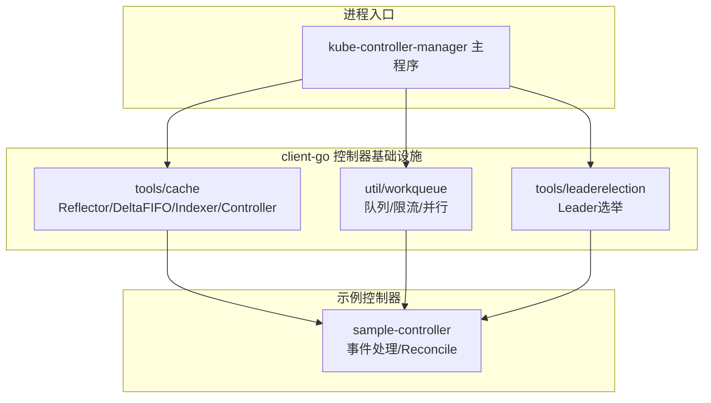
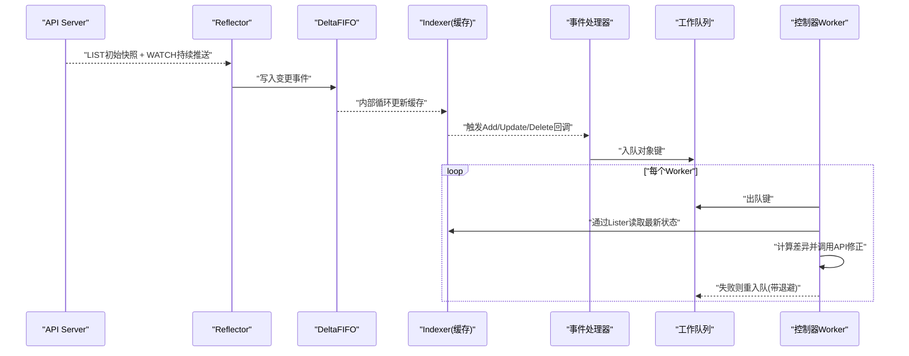
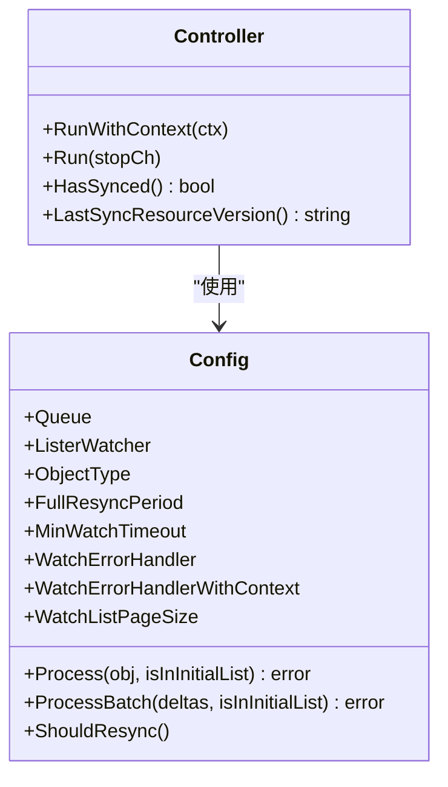
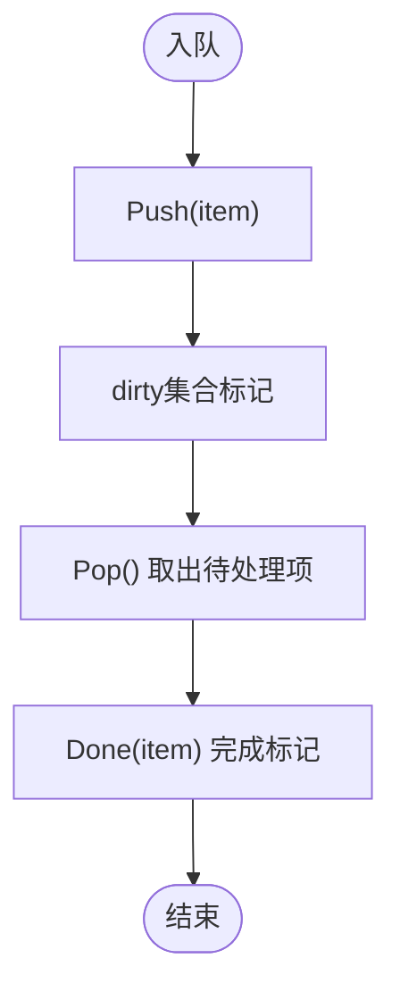
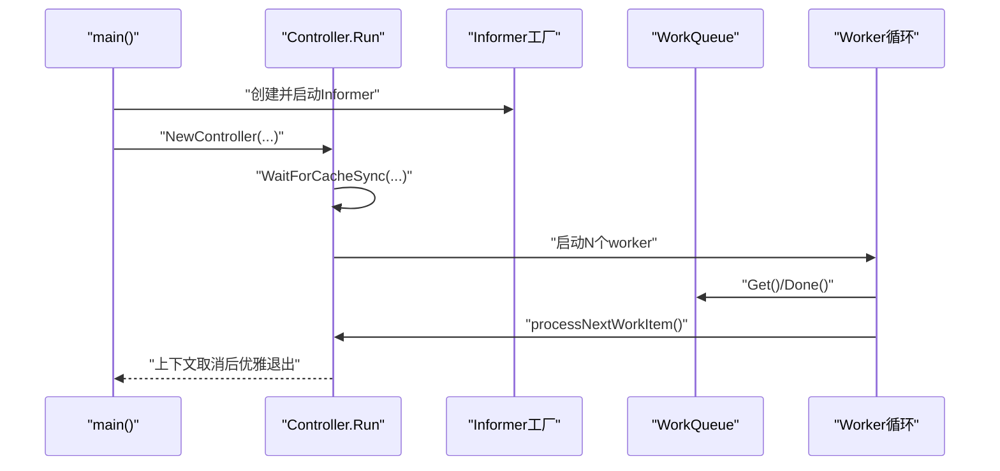
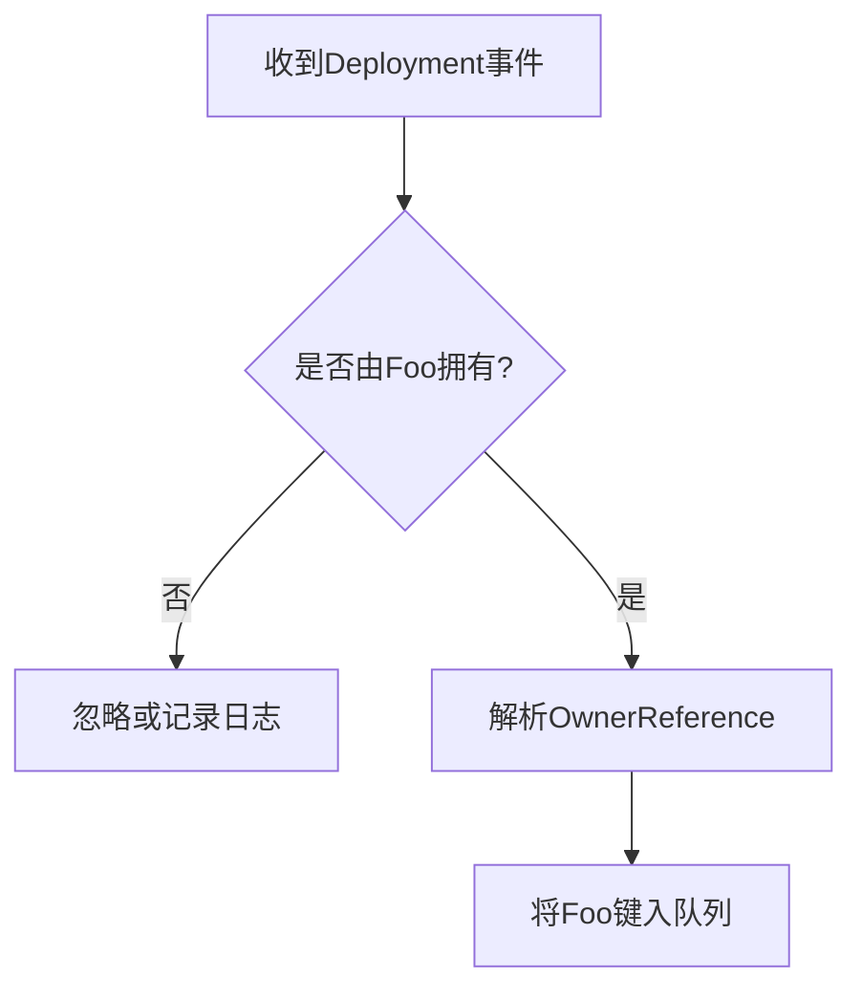
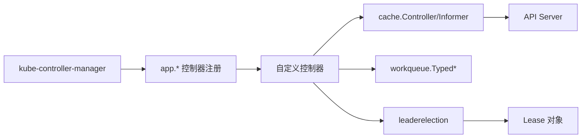

# 控制器框架与模式

<cite>
**本文引用的文件**   
- [controller-manager.go](file://cmd/kube-controller-manager/controller-manager.go)
- [ARCHITECTURE.md](file://staging/src/k8s.io/client-go/ARCHITECTURE.md)
- [controller.go](file://staging/src/k8s.io/client-go/tools/cache/controller.go)
- [queue.go](file://staging/src/k8s.io/client-go/util/workqueue/queue.go)
- [controller-client-go.md](file://staging/src/k8s.io/sample-controller/docs/controller-client-go.md)
- [controller.go](file://staging/src/k8s.io/sample-controller/controller.go)
- [kubernetes-internals-deep-dive.md](file://docs/kubernetes-internals-deep-dive.md)
</cite>

## 目录
1. [简介](#简介)
2. [项目结构](#项目结构)
3. [核心组件](#核心组件)
4. [架构总览](#架构总览)
5. [详细组件分析](#详细组件分析)
6. [依赖分析](#依赖分析)
7. [性能考虑](#性能考虑)
8. [故障排查指南](#故障排查指南)
9. [结论](#结论)
10. [附录](#附录)

## 简介
本文件面向Kubernetes控制器开发者，系统化阐述控制器设计模式与核心概念：期望状态与实际状态的同步机制、控制器循环工作原理、事件驱动架构与Informer机制、生命周期管理、并发控制策略与错误处理模式。同时覆盖控制器注册机制、启动配置选项与依赖注入模式，并提供最佳实践（性能优化、内存管理与调试技巧）以及可落地的示例路径，帮助读者构建高效、健壮的控制器。

## 项目结构
围绕控制器框架的关键代码分布在以下位置：
- 控制器管理器入口与注册：cmd/kube-controller-manager/app/* 与 cmd/kube-controller-manager/controller-manager.go
- client-go控制器基础设施：staging/src/k8s.io/client-go/tools/cache、util/workqueue、tools/leaderelection
- 示例控制器：staging/src/k8s.io/sample-controller
- 内部深度文档：docs/kubernetes-internals-deep-dive.md

图表来源
- [controller-manager.go:1-39](file://cmd/kube-controller-manager/controller-manager.go#L1-L39)
- [ARCHITECTURE.md:89-146](file://staging/src/k8s.io/client-go/ARCHITECTURE.md#L89-L146)
- [controller.go:1-200](file://staging/src/k8s.io/client-go/tools/cache/controller.go#L1-L200)
- [queue.go:1-200](file://staging/src/k8s.io/client-go/util/workqueue/queue.go#L1-L200)

章节来源
- [controller-manager.go:1-39](file://cmd/kube-controller-manager/controller-manager.go#L1-L39)
- [ARCHITECTURE.md:89-146](file://staging/src/k8s.io/client-go/ARCHITECTURE.md#L89-L146)

## 核心组件
- Informer机制与缓存
  - Reflector负责LIST/WATCH API Server，DeltaFIFO缓冲变更，Indexer维护本地缓存，EventHandlers将对象键入工作队列。
  - Lister提供线程安全的只读访问接口。
- 工作队列与速率限制
  - workqueue解耦事件检测与业务处理，支持指数退避与桶式限流，避免阻塞Watch流。
- Leader选举
  - tools/leaderelection通过Lease实现多副本单写语义，保障高可用。
- 控制器循环
  - 等待缓存同步后启动多个worker，从队列取项并执行reconcile逻辑，直至上下文取消。

章节来源
- [ARCHITECTURE.md:89-146](file://staging/src/k8s.io/client-go/ARCHITECTURE.md#L89-L146)
- [controller-client-go.md:39-64](file://staging/src/k8s.io/sample-controller/docs/controller-client-go.md#L39-L64)
- [controller.go:1-200](file://staging/src/k8s.io/client-go/tools/cache/controller.go#L1-L200)
- [queue.go:1-200](file://staging/src/k8s.io/client-go/util/workqueue/queue.go#L1-L200)

## 架构总览
下图展示从API Server到控制器处理的端到端数据流与关键边界。

图表来源
- [ARCHITECTURE.md:89-146](file://staging/src/k8s.io/client-go/ARCHITECTURE.md#L89-L146)
- [controller.go:1-200](file://staging/src/k8s.io/client-go/tools/cache/controller.go#L1-L200)
- [queue.go:1-200](file://staging/src/k8s.io/client-go/util/workqueue/queue.go#L1-L200)

## 详细组件分析

### Informer与缓存子系统
- 职责分工
  - Reflector：发起LIST获取一致快照，随后WATCH增量；处理“too old resourceVersion”重试与bookmark优化。
  - DeltaFIFO：去重与顺序保证，缓冲事件供消费。
  - Indexer：内存索引缓存，供Listers只读访问。
  - EventHandlers：将对象键入workqueue，不执行业务逻辑。
- 关键配置
  - FullResyncPeriod：定期全量同步周期，防止缓存漂移。
  - MinWatchTimeout：最小watch超时，默认下限保护控制面性能。
  - WatchListPageSize：初始与重连时LIST分页大小。
- 运行期行为
  - RunWithContext构造Reflector并启动内部循环，关闭时清理队列资源。

图表来源
- [controller.go:1-200](file://staging/src/k8s.io/client-go/tools/cache/controller.go#L1-L200)

章节来源
- [controller.go:1-200](file://staging/src/k8s.io/client-go/tools/cache/controller.go#L1-L200)
- [ARCHITECTURE.md:89-146](file://staging/src/k8s.io/client-go/ARCHITECTURE.md#L89-L146)

### 工作队列与速率限制
- 设计目标
  - 将事件检测与reconcile解耦，允许失败重试与指数退避，避免阻塞Watch流。
- 类型与能力
  - TypedInterface[T]：通用接口，支持泛型类型安全。
  - DefaultQueue[T]：基于切片的高效FIFO。
  - RateLimiting：结合ItemExponentialFailureRateLimiter与BucketRateLimiter，兼顾对象级与全局限流。
- 指标与监控
  - 可注入MetricsProvider，按队列名暴露指标。

图表来源
- [queue.go:1-200](file://staging/src/k8s.io/client-go/util/workqueue/queue.go#L1-L200)

章节来源
- [queue.go:1-200](file://staging/src/k8s.io/client-go/util/workqueue/queue.go#L1-L200)
- [ARCHITECTURE.md:133-146](file://staging/src/k8s.io/client-go/ARCHITECTURE.md#L133-L146)

### 控制器循环与生命周期
- 典型流程
  - 创建Informer与Lister，注册事件处理器，仅将对象键入队列。
  - 等待所有Informer缓存同步（WaitForCacheSync）。
  - 启动N个worker循环，逐个处理队列项，必要时回退并重入队。
  - 优雅关闭：停止队列、等待worker退出。
- 示例参考
  - sample-controller展示了完整的控制器生命周期与事件处理模式。

图表来源
- [controller.go](file://staging/src/k8s.io/sample-controller/controller.go)
- [controller-client-go.md:39-64](file://staging/src/k8s.io/sample-controller/docs/controller-client-go.md#L39-L64)

章节来源
- [controller.go](file://staging/src/k8s.io/sample-controller/controller.go)
- [controller-client-go.md:39-64](file://staging/src/k8s.io/sample-controller/docs/controller-client-go.md#L39-L64)

### 事件驱动与依赖对象监听
- 事件模型
  - Add/Update/Delete回调中仅提取对象键并入队，避免在回调中做耗时操作。
- 依赖对象监听
  - 对Deployment等被控对象注册事件处理器，根据OwnerReference反查并重新入队其所有者（如Foo），实现跨资源联动。

图表来源
- [controller.go](file://staging/src/k8s.io/sample-controller/controller.go)

章节来源
- [controller.go](file://staging/src/k8s.io/sample-controller/controller.go)

### 控制器注册与启动配置
- 进程入口
  - kube-controller-manager主程序加载应用命令并运行。
- 控制器注册
  - 各控制器在app包中以插件化方式注册，通过命令行参数启用/禁用。
- 启动配置要点
  - 常用开关包括控制器白名单/黑名单、并发度、resync周期、leader选举相关参数等。
  - 具体参数定义请参考对应子模块的flags与options文件。

章节来源
- [controller-manager.go:1-39](file://cmd/kube-controller-manager/controller-manager.go#L1-L39)

### 依赖注入模式
- 标准做法
  - 通过构造函数注入Clientset、Informer、Lister、Recorder、WorkQueue等依赖，便于测试替换与组合。
- 示例
  - sample-controller的NewController演示了依赖注入与事件处理器装配。

章节来源
- [controller.go](file://staging/src/k8s.io/sample-controller/controller.go)

## 依赖分析
- 组件耦合关系
  - controller-manager -> app.*（控制器注册）
  - 控制器 -> cache.Controller / SharedIndexInformer -> Reflector/DeltaFIFO/Indexer
  - 控制器 -> workqueue.Typed*（入队/出队/限流）
  - 控制器 -> leaderelection（高可用）
- 外部依赖
  - API Server（LIST/WATCH）、Lease对象（选举）、Prometheus指标（可选）

图表来源
- [controller-manager.go:1-39](file://cmd/kube-controller-manager/controller-manager.go#L1-L39)
- [ARCHITECTURE.md:89-146](file://staging/src/k8s.io/client-go/ARCHITECTURE.md#L89-L146)

章节来源
- [controller-manager.go:1-39](file://cmd/kube-controller-manager/controller-manager.go#L1-L39)
- [ARCHITECTURE.md:89-146](file://staging/src/k8s.io/client-go/ARCHITECTURE.md#L89-L146)

## 性能考虑
- 减少不必要的重算
  - 仅在事件回调中入队键，避免重复计算；利用OwnerReference精准触发。
- 合理设置限流与并发
  - 使用ItemExponentialFailureRateLimiter与BucketRateLimiter组合，平衡对象级与全局吞吐。
  - 根据资源规模调整worker数量，避免过度竞争。
- 缓存与Resync
  - 适当增大resync周期以降低压力；关注bookmark与分页参数以加速冷启动。
- 内存管理
  - 及时Done对象，避免引用泄漏；合理使用PartialObjectMetadata减少大对象传输。
- 观测与诊断
  - 开启队列与控制器指标，结合pProf定位热点。

[本节为通用指导，无需源码引用]

## 故障排查指南
- Watch断链与“too old resourceVersion”
  - Reflector自动重试与重连，检查MinWatchTimeout与WatchListPageSize是否合理。
- 队列堆积
  - 观察队列长度与处理耗时，提升worker数或优化reconcile逻辑；确认是否存在死锁或长事务。
- 重复处理与幂等性
  - 确保reconcile幂等；利用resourceVersion与条件更新避免竞态。
- 节点健康与驱逐联动
  - Node Controller基于Lease与NodeStatus判定节点健康，异常时添加Taint并触发驱逐。

章节来源
- [ARCHITECTURE.md:89-146](file://staging/src/k8s.io/client-go/ARCHITECTURE.md#L89-L146)
- [kubernetes-internals-deep-dive.md:492-535](file://docs/kubernetes-internals-deep-dive.md#L492-L535)

## 结论
Kubernetes控制器框架以Informer+工作队列为核心，实现了低负载、事件驱动的期望状态同步。通过清晰的职责划分、严格的并发与错误处理模式，以及Leader选举的高可用方案，控制器能够稳定地驱动集群向期望状态收敛。遵循本文的最佳实践与示例路径，可以构建高性能、易维护的控制器。

[本节为总结，无需源码引用]

## 附录
- 快速上手示例
  - 参考sample-controller的完整实现与说明文档，理解Informer、事件处理器、队列与reconcile的组合用法。
- 关键术语
  - 期望状态：用户声明的资源Spec
  - 实际状态：集群当前真实状态
  - Reconcile：对比两者差异并修正的过程

[本节为补充信息，无需源码引用]