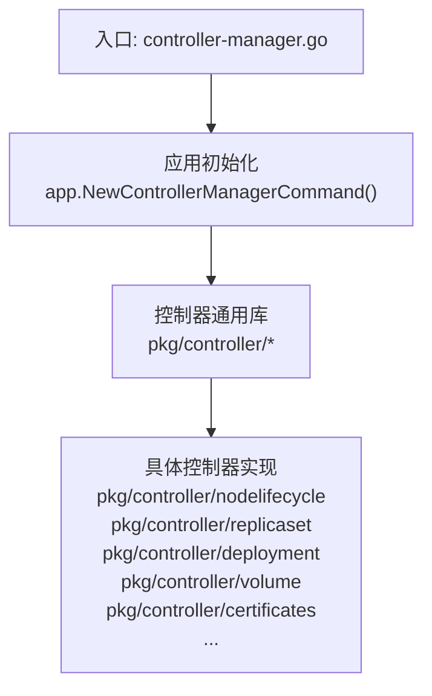
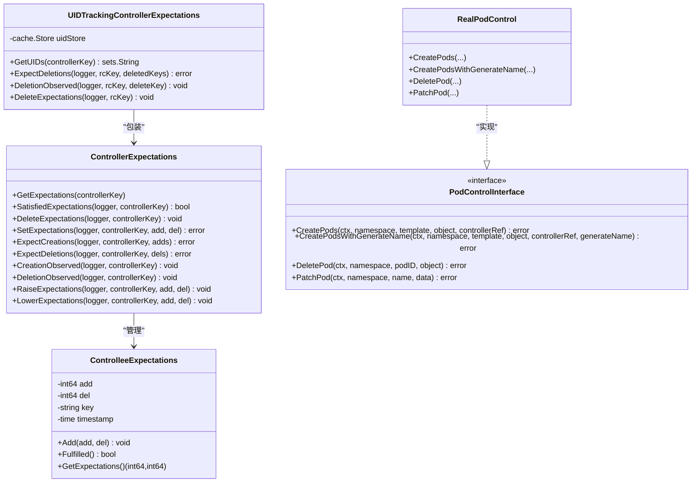
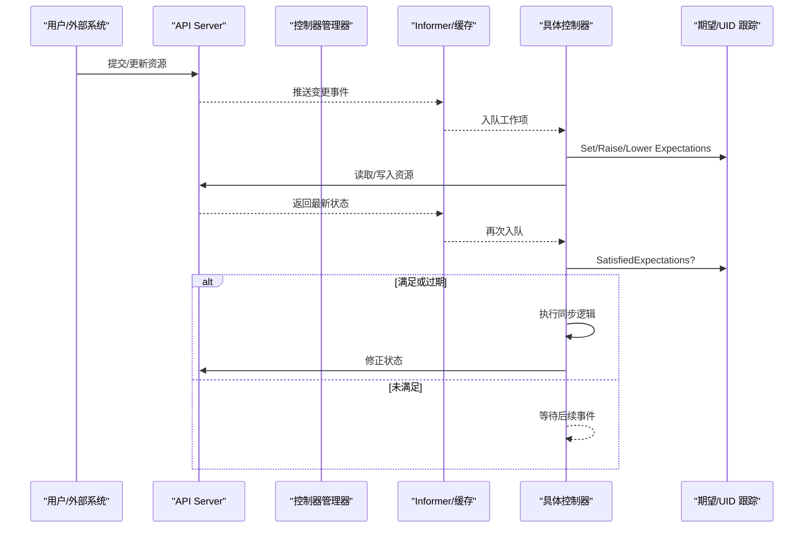
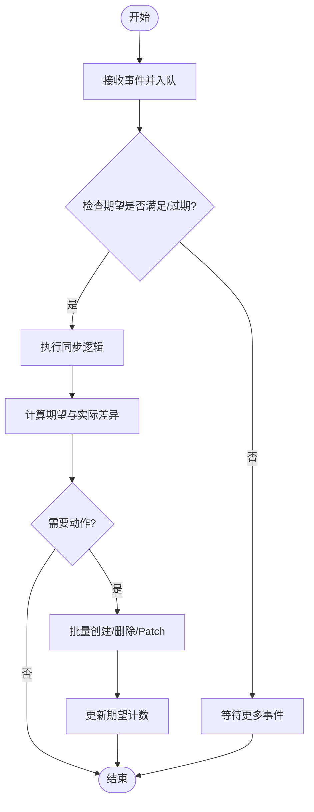
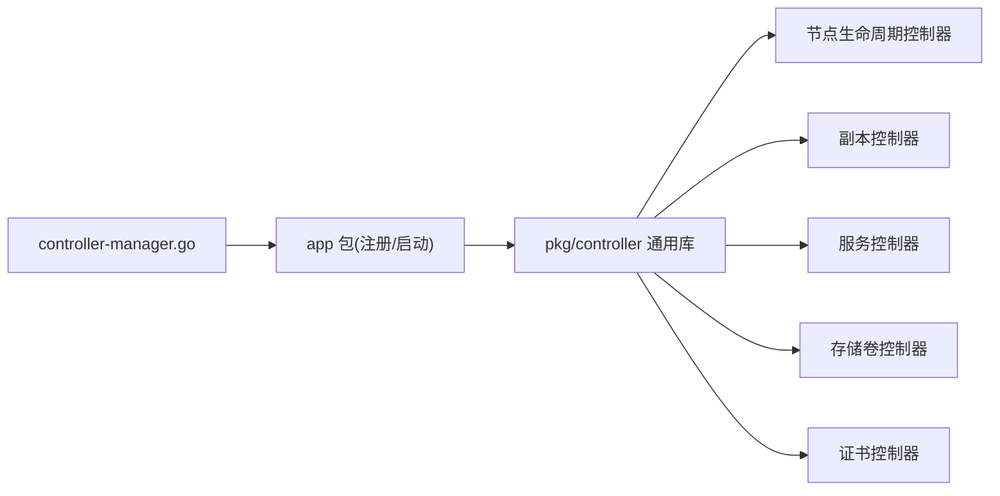

# 控制器管理器

<cite>
**本文引用的文件**   
- [controller-manager.go](file://cmd/kube-controller-manager/controller-manager.go)
- [doc.go](file://pkg/controller/doc.go)
- [controller_utils.go](file://pkg/controller/controller_utils.go)
</cite>

## 目录
1. [简介](#简介)
2. [项目结构](#项目结构)
3. [核心组件](#核心组件)
4. [架构总览](#架构总览)
5. [详细组件分析](#详细组件分析)
6. [依赖分析](#依赖分析)
7. [性能考虑](#性能考虑)
8. [故障排查指南](#故障排查指南)
9. [结论](#结论)
10. [附录](#附录)

## 简介
本技术文档围绕 Kubernetes 控制器管理器的设计模式与实现原理，系统阐述控制器循环、事件处理机制与状态同步策略；深入解析节点生命周期、副本（ReplicaSet/Deployment）、服务、存储卷、证书等内置控制器的职责与协作方式；并给出控制器注册、启动配置与并发控制的实践要点。同时提供自定义控制器开发指南、调试技巧、性能监控与故障诊断方法，帮助读者从“理解框架”到“落地扩展”。

## 项目结构
仓库中控制器相关代码主要分布在以下位置：
- 入口程序：cmd/kube-controller-manager/controller-manager.go
- 控制器通用能力与工具：pkg/controller/*（含期望值、UID 跟踪、Pod 控制接口等）
- 各业务控制器：pkg/controller/{nodelifecycle,replicaset,deployment,endpoint,endpointslice,volume,certificates,...}

图表来源
- [controller-manager.go:1-39](file://cmd/kube-controller-manager/controller-manager.go#L1-L39)

章节来源
- [controller-manager.go:1-39](file://cmd/kube-controller-manager/controller-manager.go#L1-L39)
- [doc.go:17-20](file://pkg/controller/doc.go#L17-L20)

## 核心组件
本节聚焦控制器框架的通用能力与关键抽象，这些能力被所有内置控制器复用。

- 控制器期望（Expectations）
  - 作用：在批量创建/删除子对象时，避免重复触发同步，提升收敛速度。
  - 关键点：支持设置期望、观察达成、过期回退；提供原子计数与 TTL 清理。
  - 复杂度：单次操作 O(1)，TTL 清理由底层缓存负责。

- UID 跟踪的期望（UIDTrackingControllerExpectations）
  - 作用：在优雅删除场景下，基于 UID 精确匹配删除事件，防止重复计数。
  - 关键点：维护每个控制器的已期待删除 UID 集合，按 key 隔离。

- Pod 控制接口（PodControlInterface/RealPodControl）
  - 作用：封装 Pod 的创建、删除、Patch 等操作，统一事件记录与错误处理。
  - 关键点：自动注入 OwnerReference、生成名称前缀、失败事件上报。

- 排序与选择辅助
  - 作用：为删除或日志采集选择最优 Pod（如就绪优先、重启次数少、创建时间等）。
  - 关键点：多规则比较，稳定排序，便于控制器做出确定性决策。

图表来源
- [controller_utils.go:151-316](file://pkg/controller/controller_utils.go#L151-L316)
- [controller_utils.go:340-410](file://pkg/controller/controller_utils.go#L340-L410)
- [controller_utils.go:468-637](file://pkg/controller/controller_utils.go#L468-L637)

章节来源
- [controller_utils.go:151-316](file://pkg/controller/controller_utils.go#L151-L316)
- [controller_utils.go:340-410](file://pkg/controller/controller_utils.go#L340-L410)
- [controller_utils.go:468-637](file://pkg/controller/controller_utils.go#L468-L637)

## 架构总览
控制器管理器作为控制平面进程之一，负责运行多个控制器，监听 API Server 资源变化，驱动集群状态向期望状态收敛。

图表来源
- [controller-manager.go:34-38](file://cmd/kube-controller-manager/controller-manager.go#L34-L38)
- [controller_utils.go:151-316](file://pkg/controller/controller_utils.go#L151-L316)
- [controller_utils.go:340-410](file://pkg/controller/controller_utils.go#L340-L410)

## 详细组件分析

### 控制器循环与事件处理
- 控制器循环
  - 通过 Informer 将资源变更转换为队列工作项，控制器从队列取项并调用 sync 函数。
  - 使用期望机制减少不必要的同步，结合 TTL 保证最终一致性。
- 事件处理
  - 新增/更新/删除事件分别触发不同的处理路径；UID 跟踪确保删除幂等。
- 状态同步策略
  - 先读后写，计算差异，批量 Patch/Create/Delete，必要时重试与退避。

图表来源
- [controller_utils.go:151-316](file://pkg/controller/controller_utils.go#L151-L316)
- [controller_utils.go:340-410](file://pkg/controller/controller_utils.go#L340-L410)

章节来源
- [controller_utils.go:151-316](file://pkg/controller/controller_utils.go#L151-L316)
- [controller_utils.go:340-410](file://pkg/controller/controller_utils.go#L340-L410)

### 节点生命周期控制器（Node Lifecycle）
- 职责
  - 根据 Node 条件（如 NotReady、DiskPressure、MemoryPressure）进行污点/容忍联动，保障调度安全。
- 关键流程
  - 监听 Node 事件，评估条件，按需添加/移除污点，配合驱逐策略。
- 并发与一致性
  - 单节点维度串行化，跨节点并行；利用期望与去重避免风暴。

章节来源
- [doc.go:17-20](file://pkg/controller/doc.go#L17-L20)

### 副本控制器（ReplicaSet/Deployment）
- 职责
  - ReplicaSet 维持 Pod 副本数；Deployment 管理升级策略（滚动/重建）、回滚与进度追踪。
- 关键流程
  - 计算目标副本集与 Pod 集合，决定创建/删除哪些 Pod，更新状态与事件。
- 优化点
  - 慢启动批量化创建、选择性删除策略（就绪度、重启次数、创建时间等）。

章节来源
- [controller_utils.go:703-800](file://pkg/controller/controller_utils.go#L703-L800)

### 服务控制器（Service/Endpoints/EndpointSlice）
- 职责
  - Service 暴露稳定的网络端点；Endpoints/EndpointSlice 动态聚合后端 Pod。
- 关键流程
  - 监听 Service/Endpoints/EndpointSlice/Pod 变更，计算有效端点，更新映射。
- 并发与一致性
  - 大列表场景下采用增量更新与分片（EndpointSlice）降低压力。

章节来源
- [doc.go:17-20](file://pkg/controller/doc.go#L17-L20)

### 存储卷控制器（Volume）
- 职责
  - 协调 PV/PVC 生命周期，对接 CSI/插件完成挂载/卸载、扩容等。
- 关键流程
  - 监听 PVC/PV 事件，触发绑定、发布、回收等阶段，持久化状态。
- 可靠性
  - 强一致性与幂等性要求高，广泛使用重试与回退。

章节来源
- [doc.go:17-20](file://pkg/controller/doc.go#L17-L20)

### 证书控制器（Certificates）
- 职责
  - 签发/续期/吊销证书，管理 CSR、CA 根证书与信任链。
- 关键流程
  - 监听 CSR/Secret/ConfigMap 变更，校验策略，调用签名器，发布结果。
- 安全性
  - 严格权限与审计，最小权限原则。

章节来源
- [doc.go:17-20](file://pkg/controller/doc.go#L17-L20)

### 其他重要控制器（概览）
- CronJob/Job：任务编排与调度，失败重试与成功/失败策略。
- DaemonSet：每节点一份实例，滚动更新与排障。
- StatefulSet：有状态工作负载，有序扩缩容与稳定标识。
- GarbageCollector：基于 OwnerReference 的级联清理。
- ResourceQuota/ServiceAccount/ClusterRoleAggregation 等：配额、身份与 RBAC 聚合。

章节来源
- [doc.go:17-20](file://pkg/controller/doc.go#L17-L20)

## 依赖分析
- 入口依赖
  - 控制器管理器入口仅负责构建命令并运行，实际控制器注册与启动位于 app 包。
- 通用库依赖
  - 控制器通用库提供期望、UID 跟踪、Pod 控制等基础能力，被各控制器复用。
- 潜在耦合
  - 控制器间通过共享的 API 对象与事件间接耦合；建议保持控制器内聚、低耦合。

图表来源
- [controller-manager.go:34-38](file://cmd/kube-controller-manager/controller-manager.go#L34-L38)
- [controller_utils.go:151-316](file://pkg/controller/controller_utils.go#L151-L316)

章节来源
- [controller-manager.go:34-38](file://cmd/kube-controller-manager/controller-manager.go#L34-L38)
- [controller_utils.go:151-316](file://pkg/controller/controller_utils.go#L151-L316)

## 性能考虑
- 期望与去抖
  - 合理使用 Set/Raise/Lower 期望，避免频繁同步；利用 TTL 防止长期阻塞。
- 批量化与慢启动
  - 大批量创建时使用慢启动策略，逐步放大批次，降低 API 压力与配额拒绝风暴。
- 索引与查询
  - 利用 Informer 索引（如按 nodeName、控制器引用）减少全表扫描。
- 并发控制
  - 对热点资源（如 Node、Pod）做键级串行化，跨键并行处理。
- 事件节流
  - 合并相近事件，避免抖动导致的反复同步。

[本节为通用指导，不直接分析具体文件]

## 故障排查指南
- 常见问题定位
  - 期望未满足：检查 Raise/Lower 调用时机与 UID 跟踪是否正确。
  - 重复同步：确认是否误用全局期望或 key 冲突。
  - 删除风暴：核对优雅删除路径与 DeletionObserved 调用。
- 日志与指标
  - 关注控制器日志中的“期望”“创建/删除”“错误”关键字；结合 Prometheus 指标定位瓶颈。
- 快速验证
  - 缩小范围：针对单个资源键进行复现；关闭非必需控制器以减少噪声。

章节来源
- [controller_utils.go:151-316](file://pkg/controller/controller_utils.go#L151-L316)
- [controller_utils.go:340-410](file://pkg/controller/controller_utils.go#L340-L410)

## 结论
Kubernetes 控制器管理器以“期望+事件+循环”为核心范式，借助通用库提供的期望与 UID 跟踪、Pod 控制接口等能力，实现了高可靠、可扩展的状态同步体系。内置控制器各司其职，共同推动集群状态收敛。通过合理的并发控制、批量化与慢启动策略，可在大规模集群中保持稳定与高效。

[本节为总结性内容，不直接分析具体文件]

## 附录

### 自定义控制器开发指南（要点）
- 控制器模板
  - 定义资源类型与 Informer，实现 Reconcile 函数，遵循幂等与可重试原则。
- 事件监听器
  - 使用 WorkQueue 与 KeyFunc 将事件转为工作项；合理设置 ResyncPeriod。
- 状态更新模式
  - 先读后写，计算差异，批量 Patch/Create/Delete；记录事件与指标。
- 并发与一致性
  - 使用键级锁或队列串行化；结合期望与 UID 跟踪避免重复处理。
- 测试与调试
  - 使用 FakeClient/FakeRecorder 进行单元测试；开启详细日志与指标收集。

[本节为概念性指导，不直接分析具体文件]