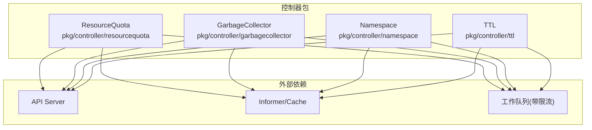
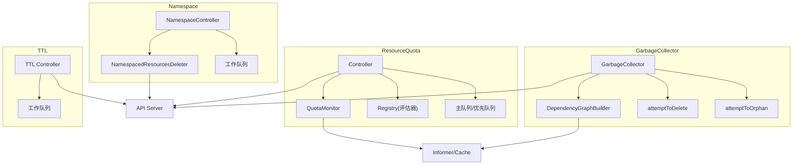
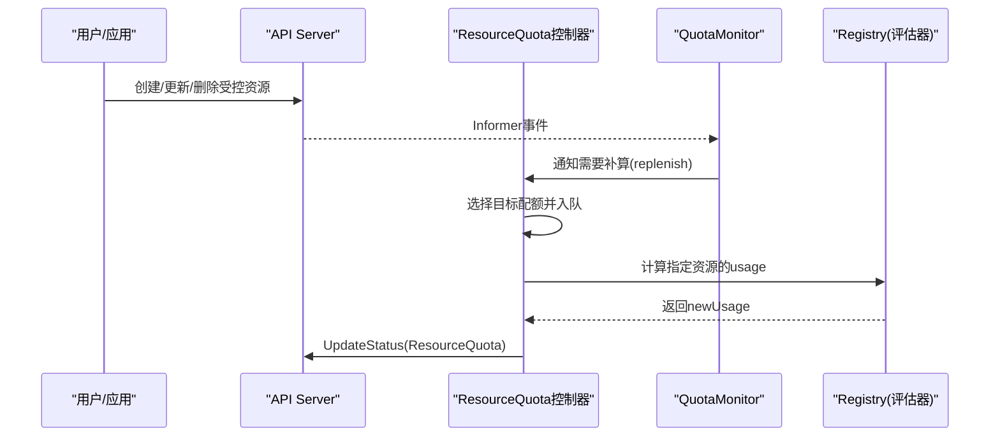
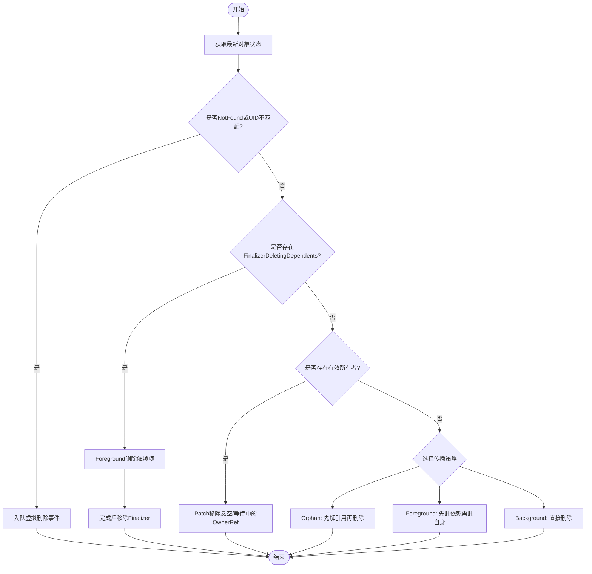
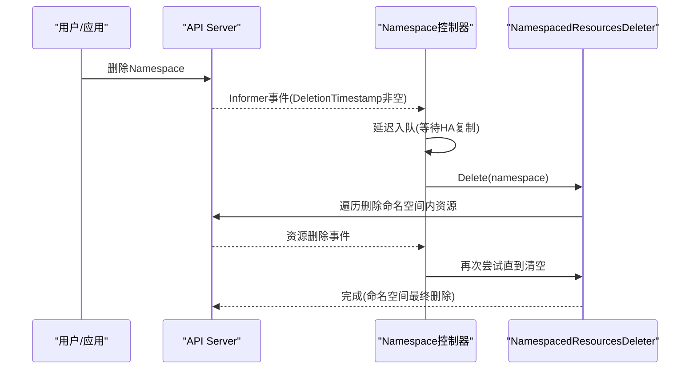
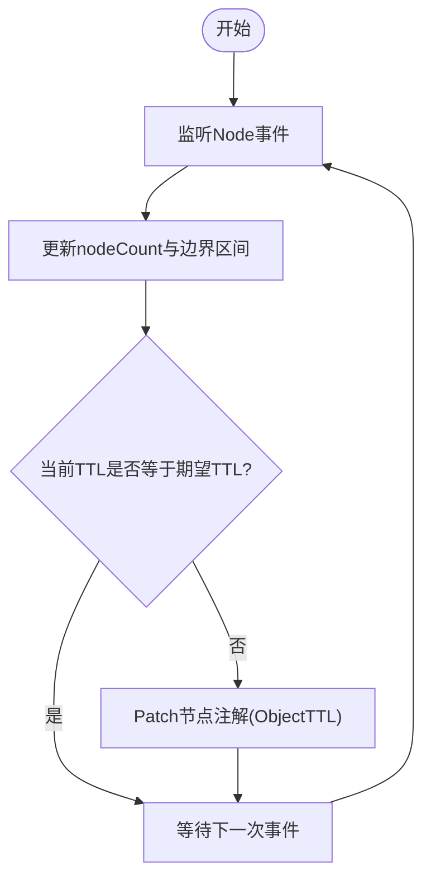
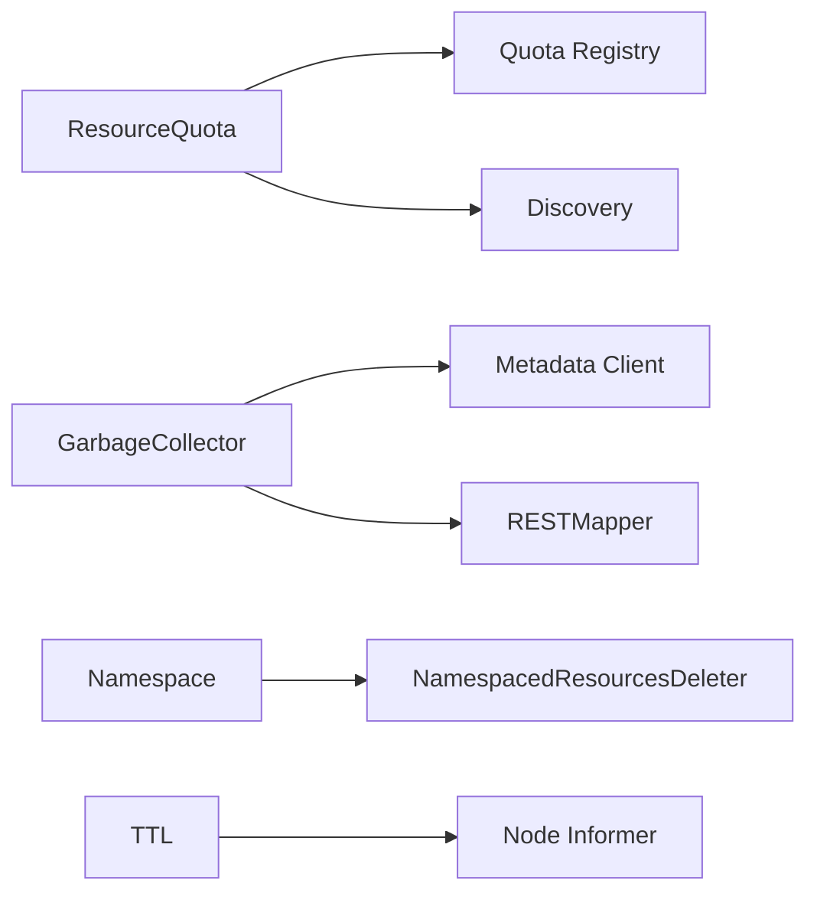

# 系统资源控制器

<cite>
**本文引用的文件**   
- [resource_quota_controller.go](file://pkg/controller/resourcequota/resource_quota_controller.go)
- [garbagecollector.go](file://pkg/controller/garbagecollector/garbagecollector.go)
- [namespace_controller.go](file://pkg/controller/namespace/namespace_controller.go)
- [ttl_controller.go](file://pkg/controller/ttl/ttl_controller.go)
</cite>

## 目录
1. [简介](#简介)
2. [项目结构](#项目结构)
3. [核心组件](#核心组件)
4. [架构总览](#架构总览)
5. [详细组件分析](#详细组件分析)
6. [依赖关系分析](#依赖关系分析)
7. [性能考量](#性能考量)
8. [故障排查指南](#故障排查指南)
9. [结论](#结论)
10. [附录](#附录)

## 简介
本技术文档聚焦Kubernetes控制平面中与“系统资源管理”密切相关的四个控制器：ResourceQuota、GarbageCollector、Namespace与TTL。文档深入阐述各控制器的职责边界、关键流程、数据流与错误处理，并提供配额规划策略、性能监控方法以及资源争用与泄漏问题的诊断与解决方案，帮助读者在生产环境中高效治理集群资源。

## 项目结构
本节从源码视角梳理四个控制器的位置与组织方式，便于定位实现细节与扩展点。

图表来源
- [resource_quota_controller.go:106-191](file://pkg/controller/resourcequota/resource_quota_controller.go#L106-L191)
- [garbagecollector.go:83-119](file://pkg/controller/garbagecollector/garbagecollector.go#L83-L119)
- [namespace_controller.go:66-104](file://pkg/controller/namespace/namespace_controller.go#L66-L104)
- [ttl_controller.go:81-104](file://pkg/controller/ttl/ttl_controller.go#L81-L104)

章节来源
- [resource_quota_controller.go:106-191](file://pkg/controller/resourcequota/resource_quota_controller.go#L106-L191)
- [garbagecollector.go:83-119](file://pkg/controller/garbagecollector/garbagecollector.go#L83-L119)
- [namespace_controller.go:66-104](file://pkg/controller/namespace/namespace_controller.go#L66-L104)
- [ttl_controller.go:81-104](file://pkg/controller/ttl/ttl_controller.go#L81-L104)

## 核心组件
- ResourceQuota控制器：负责按命名空间统计并维护资源使用量，支持动态发现可配额资源、增量补算与全量重算，确保status与实际usage一致。
- GarbageCollector控制器：基于OwnerReference构建对象依赖图，执行级联删除、孤儿清理与Orphan化，保证最终一致性。
- Namespace控制器：在命名空间进入Terminating阶段后，协调删除其下所有资源，保障命名空间生命周期完整。
- TTL控制器：根据集群规模动态调整节点上的缓存TTL注解，降低小集群的watch压力（该控制器主要用于节点缓存提示，非对象自动清理）。

章节来源
- [resource_quota_controller.go:79-103](file://pkg/controller/resourcequota/resource_quota_controller.go#L79-L103)
- [garbagecollector.go:53-77](file://pkg/controller/garbagecollector/garbagecollector.go#L53-L77)
- [namespace_controller.go:53-63](file://pkg/controller/namespace/namespace_controller.go#L53-L63)
- [ttl_controller.go:55-78](file://pkg/controller/ttl/ttl_controller.go#L55-L78)

## 架构总览
下图展示四个控制器与控制平面的交互关系及内部关键组件。

图表来源
- [resource_quota_controller.go:106-191](file://pkg/controller/resourcequota/resource_quota_controller.go#L106-L191)
- [garbagecollector.go:83-119](file://pkg/controller/garbagecollector/garbagecollector.go#L83-L119)
- [namespace_controller.go:66-104](file://pkg/controller/namespace/namespace_controller.go#L66-L104)
- [ttl_controller.go:81-104](file://pkg/controller/ttl/ttl_controller.go#L81-L104)

## 详细组件分析

### ResourceQuota控制器
- 职责与能力
  - 监听ResourceQuota变更，触发计算；周期性全量重算；动态发现可配额资源并启动对应监控。
  - 通过注册表（Registry）对各类资源进行用量评估，合并到status.used中。
  - 提供Replenishment机制：当受控资源变化时，仅对受影响配额触发增量重算。
- 关键数据结构与流程
  - 双队列：普通队列用于常规同步，缺失初始useage的配额进入高优先级队列。
  - Sync流程：读取spec.hard与现有used，调用评估器计算newUsage，mask到hard集合，比较dirty后更新status。
  - 资源发现：周期Sync从Discovery获取新增/移除资源，重建或停止相应监控，等待缓存同步后再继续。
- 超量使用处理
  - 控制器不主动拒绝创建，但会准确上报used与hard对比；结合准入层（如Admission）可实现拒绝或告警。
- 典型序列图

图表来源
- [resource_quota_controller.go:340-415](file://pkg/controller/resourcequota/resource_quota_controller.go#L340-L415)
- [resource_quota_controller.go:418-450](file://pkg/controller/resourcequota/resource_quota_controller.go#L418-L450)
- [resource_quota_controller.go:453-521](file://pkg/controller/resourcequota/resource_quota_controller.go#L453-L521)

章节来源
- [resource_quota_controller.go:106-191](file://pkg/controller/resourcequota/resource_quota_controller.go#L106-L191)
- [resource_quota_controller.go:194-210](file://pkg/controller/resourcequota/resource_quota_controller.go#L194-L210)
- [resource_quota_controller.go:254-337](file://pkg/controller/resourcequota/resource_quota_controller.go#L254-L337)
- [resource_quota_controller.go:340-415](file://pkg/controller/resourcequota/resource_quota_controller.go#L340-L415)
- [resource_quota_controller.go:418-450](file://pkg/controller/resourcequota/resource_quota_controller.go#L418-L450)
- [resource_quota_controller.go:453-521](file://pkg/controller/resourcequota/resource_quota_controller.go#L453-L521)

### GarbageCollector控制器
- 职责与能力
  - 监听所有可删除资源，构建对象依赖图（以UID为键），依据OwnerReference判定删除时机。
  - 两类工作队列：尝试删除(attemptToDelete)、尝试解除引用(orphaning)。
  - 支持Foreground/Background/Orphan三种传播策略，尊重Finalizer行为。
- 依赖图与级联删除
  - 当父对象被删除且子对象存在FinalizerDeletingDependents时，先Foreground删除子对象，再移除Finalizer完成最终删除。
  - 若父对象存在Orphan finalizer，则先批量Patch子对象移除OwnerReference，再删除父对象。
- 孤儿对象清理
  - 检测OwnerReference指向的对象不存在（含UID不一致）时，将其标记为dangling并从ownerReferences中剔除，避免阻塞删除。
- 典型流程图

图表来源
- [garbagecollector.go:288-378](file://pkg/controller/garbagecollector/garbagecollector.go#L288-L378)
- [garbagecollector.go:497-661](file://pkg/controller/garbagecollector/garbagecollector.go#L497-L661)
- [garbagecollector.go:683-719](file://pkg/controller/garbagecollector/garbagecollector.go#L683-L719)
- [garbagecollector.go:721-775](file://pkg/controller/garbagecollector/garbagecollector.go#L721-L775)

章节来源
- [garbagecollector.go:83-119](file://pkg/controller/garbagecollector/garbagecollector.go#L83-L119)
- [garbagecollector.go:132-181](file://pkg/controller/garbagecollector/garbagecollector.go#L132-L181)
- [garbagecollector.go:288-378](file://pkg/controller/garbagecollector/garbagecollector.go#L288-L378)
- [garbagecollector.go:497-661](file://pkg/controller/garbagecollector/garbagecollector.go#L497-L661)
- [garbagecollector.go:683-719](file://pkg/controller/garbagecollector/garbagecollector.go#L683-L719)
- [garbagecollector.go:721-775](file://pkg/controller/garbagecollector/garbagecollector.go#L721-L775)

### Namespace控制器
- 职责与能力
  - 监听Namespace事件，仅在DeletionTimestamp非空时入队，延迟处理以允许HA API/etcd观察最后写入。
  - 委托NamespacedResourcesDeleter删除命名空间内所有资源，直至命名空间完全终止。
- 生命周期与隔离
  - 命名空间作为资源隔离边界，控制器确保在Terminating阶段内完成资源清理，防止残留。
- 典型序列图

图表来源
- [namespace_controller.go:118-136](file://pkg/controller/namespace/namespace_controller.go#L118-L136)
- [namespace_controller.go:177-195](file://pkg/controller/namespace/namespace_controller.go#L177-L195)

章节来源
- [namespace_controller.go:66-104](file://pkg/controller/namespace/namespace_controller.go#L66-L104)
- [namespace_controller.go:118-136](file://pkg/controller/namespace/namespace_controller.go#L118-L136)
- [namespace_controller.go:177-195](file://pkg/controller/namespace/namespace_controller.go#L177-L195)

### TTL控制器
- 职责与能力
  - 根据集群节点数量动态计算期望的TTL秒数，将结果写入节点的ObjectTTL注解，供Kubelet参考缓存过期时间。
  - 监听Node增删改事件，维护nodeCount与边界区间，必要时更新注解。
- 时间戳管理与保留策略
  - 并非对象级TTL控制器，而是节点级缓存提示；通过注解值反映“建议的缓存保留时长”。
- 典型流程图

图表来源
- [ttl_controller.go:148-206](file://pkg/controller/ttl/ttl_controller.go#L148-L206)
- [ttl_controller.go:295-311](file://pkg/controller/ttl/ttl_controller.go#L295-L311)

章节来源
- [ttl_controller.go:81-104](file://pkg/controller/ttl/ttl_controller.go#L81-L104)
- [ttl_controller.go:148-206](file://pkg/controller/ttl/ttl_controller.go#L148-L206)
- [ttl_controller.go:295-311](file://pkg/controller/ttl/ttl_controller.go#L295-L311)

## 依赖关系分析
- 组件耦合与内聚
  - ResourceQuota：强依赖Informer与Discovery，弱耦合具体资源类型（通过Registry评估器扩展）。
  - GarbageCollector：强依赖元数据客户端与RESTMapper，依赖图构建与两队列解耦了“判断”和“执行”。
  - Namespace：依赖NamespacedResourcesDeleter抽象，屏蔽具体删除逻辑差异。
  - TTL：轻量，仅依赖Node Informer与Patch接口。
- 外部依赖与集成点
  - 均通过Informer/Cache减少API Server压力；通过workqueue实现背压与重试。
  - 与API Server的交互集中在Get/List/Patch/Delete/UpdateStatus等标准操作。
- 潜在循环依赖
  - 控制器之间无直接导入依赖，通过共享的client-go/informers与k8s.io/apiserver/quota生态间接协作。

图表来源
- [resource_quota_controller.go:106-191](file://pkg/controller/resourcequota/resource_quota_controller.go#L106-L191)
- [garbagecollector.go:83-119](file://pkg/controller/garbagecollector/garbagecollector.go#L83-L119)
- [namespace_controller.go:66-104](file://pkg/controller/namespace/namespace_controller.go#L66-L104)
- [ttl_controller.go:81-104](file://pkg/controller/ttl/ttl_controller.go#L81-L104)

章节来源
- [resource_quota_controller.go:106-191](file://pkg/controller/resourcequota/resource_quota_controller.go#L106-L191)
- [garbagecollector.go:83-119](file://pkg/controller/garbagecollector/garbagecollector.go#L83-L119)
- [namespace_controller.go:66-104](file://pkg/controller/namespace/namespace_controller.go#L66-L104)
- [ttl_controller.go:81-104](file://pkg/controller/ttl/ttl_controller.go#L81-L104)

## 性能考量
- 队列与限流
  - ResourceQuota采用双队列（普通/缺失useage优先），配合默认速率限制器，避免突发风暴。
  - Namespace控制器使用指数退避+桶限流组合，提升删除重试稳定性。
- 全量重算与增量补算
  - ResourceQuota支持周期性全量重算与事件驱动的增量补算，平衡准确性与开销。
- 依赖图与并发
  - GarbageCollector将图构建与删除/Orphan动作分离，多worker并行消费两个队列，提高吞吐。
- 监控与指标
  - 建议在Prometheus/Grafana中采集以下指标：
    - 各控制器队列长度、处理耗时、错误计数
    - ResourceQuota的reconcile次数、计算耗时、status更新失败率
    - GarbageCollector的删除/Orphan成功率、重试次数、超时次数
    - Namespace删除剩余资源估算与重试间隔
    - TTL注解变更频率与Patch失败率

[本节为通用指导，无需特定文件来源]

## 故障排查指南
- ResourceQuota
  - 现象：status未更新或长期脏数据
    - 检查是否启用了Discovery与QuotaMonitor；查看全量重算是否触发；确认评估器是否覆盖目标资源。
    - 关注“初始发现失败”日志，控制器会容忍部分失败并在后续同步恢复。
  - 现象：频繁重算导致APIServer压力
    - 调整ResyncPeriod与ReplenishmentResyncPeriod；过滤无关资源；评估UpdateFilter是否生效。
- GarbageCollector
  - 现象：对象迟迟不删除
    - 检查是否存在FinalizerDeletingDependents或Orphan finalizer；确认依赖项是否已删除；查看attemptToDelete/attemptToOrphan队列积压。
    - 关注“虚拟删除事件”路径，避免因watch断连导致的僵尸节点。
  - 现象：循环依赖或死锁
    - 控制器内置防环逻辑，必要时会将OwnerReference改为非阻塞模式并Foreground删除，观察相关日志。
- Namespace
  - 现象：命名空间卡在Terminating
    - 查看剩余资源估算与重试间隔；确认是否有Finalizer阻止删除；检查权限与RBAC。
- TTL
  - 现象：节点TTL注解未更新
    - 检查Node事件是否正常；确认注解格式与Patch成功；核对边界区间与nodeCount。

章节来源
- [resource_quota_controller.go:159-188](file://pkg/controller/resourcequota/resource_quota_controller.go#L159-L188)
- [resource_quota_controller.go:453-521](file://pkg/controller/resourcequota/resource_quota_controller.go#L453-L521)
- [garbagecollector.go:288-378](file://pkg/controller/garbagecollector/garbagecollector.go#L288-L378)
- [garbagecollector.go:497-661](file://pkg/controller/garbagecollector/garbagecollector.go#L497-L661)
- [namespace_controller.go:118-136](file://pkg/controller/namespace/namespace_controller.go#L118-L136)
- [ttl_controller.go:295-311](file://pkg/controller/ttl/ttl_controller.go#L295-L311)

## 结论
- ResourceQuota通过动态发现与增量补算，在保证准确性的同时兼顾性能；需配合准入策略实现硬约束。
- GarbageCollector以依赖图为核心，稳健地处理级联删除与孤儿清理，注意Finalizer语义与传播策略。
- Namespace控制器确保命名空间生命周期的完整性，是资源清理的关键一环。
- TTL控制器提供节点级缓存提示，有助于优化小集群下的watch成本。
- 生产环境应重视队列与指标监控，结合配额规划与容量规划，持续优化资源治理效果。

[本节为总结性内容，无需特定文件来源]

## 附录
- 最佳实践
  - 配额规划：按团队/业务划分命名空间，设置合理的CPU/内存/存储/对象数量上限；定期审计Used/Hard比值。
  - 资源隔离：严格使用命名空间隔离不同环境（开发/测试/生产），配合RBAC与NetworkPolicy。
  - 级联删除：谨慎使用FinalizerDeletingDependents，避免长链路删除造成雪崩；必要时采用Orphan策略。
  - 监控告警：对配额接近阈值、GC队列积压、命名空间长时间Terminating、TTL注解异常波动建立告警。
- 常见资源争用与泄漏
  - 争用：大量Pod/Job竞争有限配额，建议引入PriorityClass与调度策略；结合HPA/VPA平滑扩缩容。
  - 泄漏：未正确设置OwnerReference或Finalizer导致孤儿对象；利用GC日志与kubectl get --show-all排查。
  - 诊断工具：kubectl describe、kubectl top、Prometheus指标、控制面日志（kube-controller-manager）。

[本节为通用指导，无需特定文件来源]