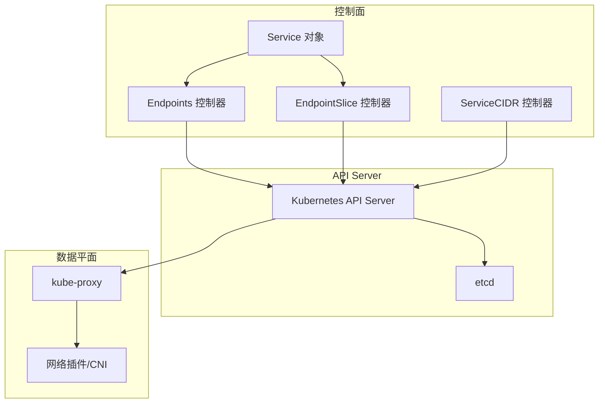
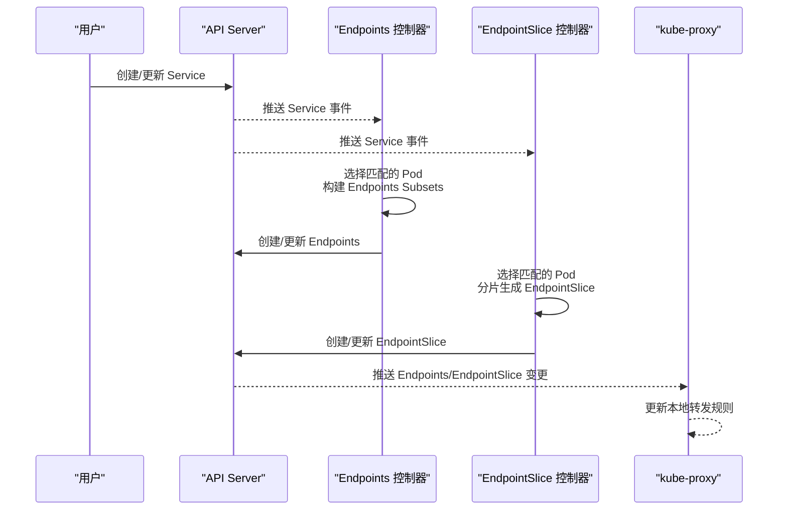
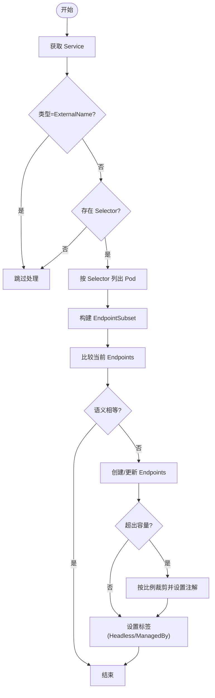
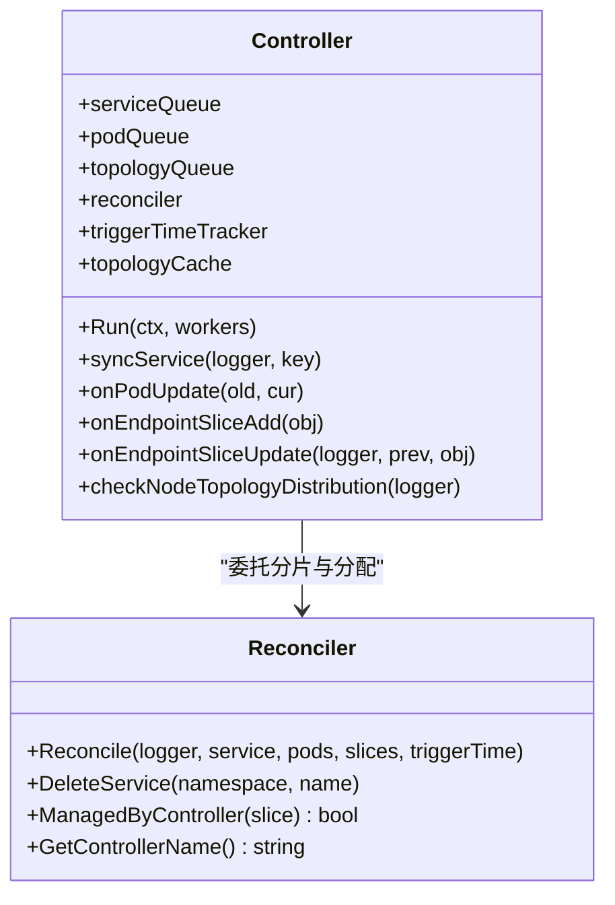
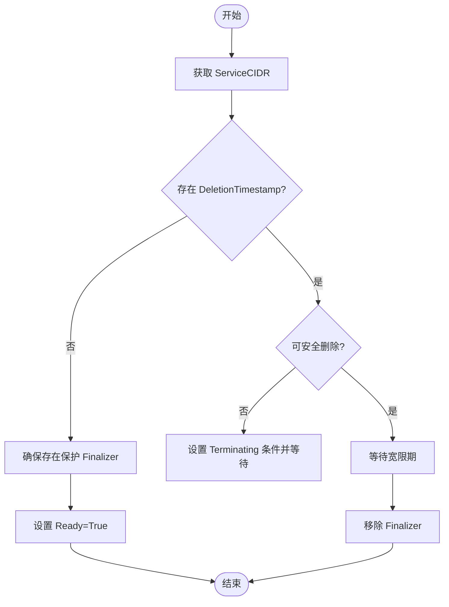
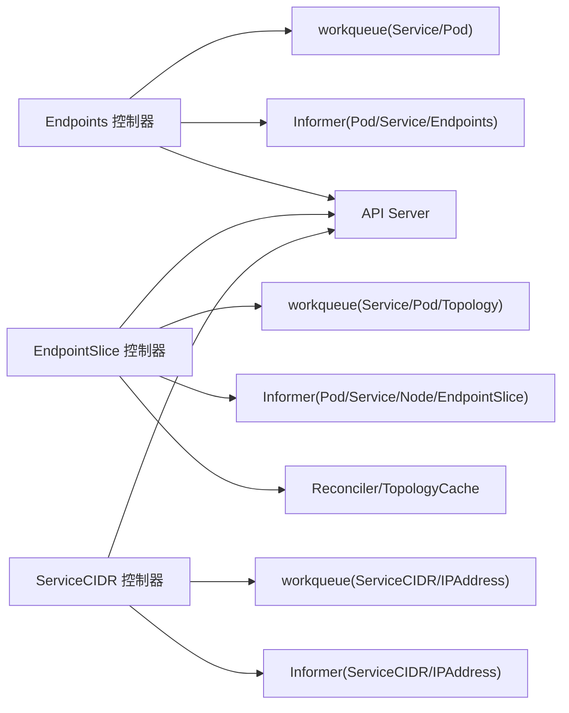

# 网络与服务控制器

<cite>
**本文引用的文件**   
- [pkg/controller/endpoint/endpoints_controller.go](file://pkg/controller/endpoint/endpoints_controller.go)
- [pkg/controller/endpoint/endpoints_tracker.go](file://pkg/controller/endpoint/endpoints_tracker.go)
- [pkg/controller/endpointslice/endpointslice_controller.go](file://pkg/controller/endpointslice/endpointslice_controller.go)
- [pkg/controller/servicecidrs/servicecidrs_controller.go](file://pkg/controller/servicecidrs/servicecidrs_controller.go)
</cite>

## 目录
1. [简介](#简介)
2. [项目结构](#项目结构)
3. [核心组件](#核心组件)
4. [架构总览](#架构总览)
5. [详细组件分析](#详细组件分析)
6. [依赖关系分析](#依赖关系分析)
7. [性能与可扩展性](#性能与可扩展性)
8. [故障排查指南](#故障排查指南)
9. [结论](#结论)
10. [附录：最佳实践与复杂场景示例](#附录最佳实践与复杂场景示例)

## 简介
本技术文档聚焦 Kubernetes 控制面中与“网络与服务”相关的控制器，包括：
- Service 控制器（通过 Endpoints/EndpointSlice 实现服务发现、负载均衡与端口映射）
- Endpoint 控制器（端点管理、健康检查与流量分发基础）
- EndpointSlice 控制器（面向大规模集群的扩展性设计与优化）
- ServiceCIDR 控制器（Service IP 地址空间管理与冲突检测）

文档从系统架构、数据流、处理逻辑、错误处理与性能特性等维度展开，并提供配置最佳实践、调优建议与故障排查方法。

## 项目结构
围绕网络与服务的关键控制器位于 pkg/controller 下：
- endpoint：Endpoints 控制器，负责基于 Service Selector 生成并维护 Endpoints 资源
- endpointslice：EndpointSlice 控制器，负责将大量端点分片化，提升大规模集群的可扩展性
- servicecidrs：ServiceCIDR 控制器，负责 Service CIDR 的生命周期、保护与冲突检测

图表来源
- [pkg/controller/endpoint/endpoints_controller.go:182-219](file://pkg/controller/endpoint/endpoints_controller.go#L182-L219)
- [pkg/controller/endpointslice/endpointslice_controller.go:270-310](file://pkg/controller/endpointslice/endpointslice_controller.go#L270-L310)
- [pkg/controller/servicecidrs/servicecidrs_controller.go:128-156](file://pkg/controller/servicecidrs/servicecidrs_controller.go#L128-L156)

章节来源
- [pkg/controller/endpoint/endpoints_controller.go:182-219](file://pkg/controller/endpoint/endpoints_controller.go#L182-L219)
- [pkg/controller/endpointslice/endpointslice_controller.go:270-310](file://pkg/controller/endpointslice/endpointslice_controller.go#L270-L310)
- [pkg/controller/servicecidrs/servicecidrs_controller.go:128-156](file://pkg/controller/servicecidrs/servicecidrs_controller.go#L128-L156)

## 核心组件
- Endpoint 控制器
  - 职责：监听 Pod/Service/Endpoints 事件，根据 Service.Selector 计算匹配 Pod，生成或更新 Endpoints 资源；支持发布未就绪地址、容量裁剪与触发时间标注。
  - 关键流程：队列驱动、增量同步、去重比较、容量限制与过期缓存处理。
- EndpointSlice 控制器
  - 职责：在大规模集群中按分片策略生成 EndpointSlice，支持拓扑感知与同域优先分配、批量合并更新、最小同步延迟与重试退避。
  - 关键流程：多队列（Service/Pod/Topology）、Reconciler 协调、Stale 检测、节点拓扑变更触发再平衡。
- ServiceCIDR 控制器
  - 职责：为 ServiceCIDR 添加保护 Finalizer，确保删除时不会留下孤儿 IPAddress；检测 CIDR 重叠与包含关系，设置 Ready 条件状态。
  - 关键流程：监听 ServiceCIDR/IPAddress 事件，计算可删除性，等待宽限期后移除 Finalizer。

章节来源
- [pkg/controller/endpoint/endpoints_controller.go:131-180](file://pkg/controller/endpoint/endpoints_controller.go#L131-L180)
- [pkg/controller/endpointslice/endpointslice_controller.go:192-268](file://pkg/controller/endpointslice/endpointslice_controller.go#L192-L268)
- [pkg/controller/servicecidrs/servicecidrs_controller.go:110-126](file://pkg/controller/servicecidrs/servicecidrs_controller.go#L110-L126)

## 架构总览
以下序列图展示 Service 到 Endpoints/EndpointSlice 的核心同步路径，以及 ServiceCIDR 的删除保护流程。

图表来源
- [pkg/controller/endpoint/endpoints_controller.go:348-556](file://pkg/controller/endpoint/endpoints_controller.go#L348-L556)
- [pkg/controller/endpointslice/endpointslice_controller.go:368-451](file://pkg/controller/endpointslice/endpointslice_controller.go#L368-L451)

## 详细组件分析

### Endpoint 控制器
- 入口与运行
  - Run 启动事件广播、记录器、多个 worker 线程，等待 informer 缓存同步后进入主循环。
- 事件处理
  - Service 增删改：入队 Service key，触发 syncService。
  - Pod 增删改：入队 Pod 投影键，后续计算受影响的 Service 并延迟批量入队。
  - Endpoints 删除：清理与触发重新同步。
- 同步逻辑
  - 读取 Service，若为 ExternalName 或无 Selector 则跳过。
  - 使用 Selector 列出匹配 Pod，过滤是否应纳入 Endpoints（考虑 PublishNotReadyAddresses）。
  - 为每个 Pod 构造 EndpointAddress，按 Service Ports 映射到 EndpointPort，聚合为 Subset。
  - 比较当前 Endpoints 与期望结果（忽略 Pod ResourceVersion），必要时创建/更新。
  - 容量裁剪：超过阈值时对 Ready 优先保留，按比例截断 NotReady，并设置 OverCapacity 注解。
  - 标签管理：复制 Service Labels，标记 Headless 与管理者标签。
- 错误与重试
  - 指数退避与最大重试次数，失败时记录事件。
- 过期缓存防护
  - staleEndpointsTracker 记录已处理的旧 ResourceVersion，避免重复处理导致死锁。

图表来源
- [pkg/controller/endpoint/endpoints_controller.go:348-556](file://pkg/controller/endpoint/endpoints_controller.go#L348-L556)
- [pkg/controller/endpoint/endpoints_controller.go:696-752](file://pkg/controller/endpoint/endpoints_controller.go#L696-L752)
- [pkg/controller/endpoint/endpoints_tracker.go:26-65](file://pkg/controller/endpoint/endpoints_tracker.go#L26-L65)

章节来源
- [pkg/controller/endpoint/endpoints_controller.go:182-219](file://pkg/controller/endpoint/endpoints_controller.go#L182-L219)
- [pkg/controller/endpoint/endpoints_controller.go:348-556](file://pkg/controller/endpoint/endpoints_controller.go#L348-L556)
- [pkg/controller/endpoint/endpoints_controller.go:696-752](file://pkg/controller/endpoint/endpoints_controller.go#L696-L752)
- [pkg/controller/endpoint/endpoints_tracker.go:26-65](file://pkg/controller/endpoint/endpoints_tracker.go#L26-L65)

### EndpointSlice 控制器
- 入口与运行
  - Run 启动事件广播、三个队列 worker（Service/Pod/Topology），等待所有 informer 同步。
- 事件处理
  - Service 增删改：入队 Service key。
  - Pod 增删改：入队 Pod 投影键，批量延迟入队相关 Service。
  - EndpointSlice 增删改：仅对由本控制器管理的切片进行同步判断，必要时入队对应 Service。
- 同步逻辑
  - 读取 Service，若为 ExternalName 或无 Selector 则跳过。
  - 列出匹配 Pod 与现有 EndpointSlice，丢弃待删除切片。
  - 调用 Reconciler 计算差异，按需创建/更新/删除切片，支持 TopologyAwareHints 与同域优先分配。
  - 设置 EndpointsLastChangeTriggerTime 注解，统计指标。
- 拓扑与再平衡
  - 监听 Node 变化（就绪/区域标签），更新拓扑缓存，对过载 Service 触发再平衡。
- 错误与重试
  - 指数退避+桶限流，最大重试次数，失败记录事件与指标。

图表来源
- [pkg/controller/endpointslice/endpointslice_controller.go:192-268](file://pkg/controller/endpointslice/endpointslice_controller.go#L192-L268)
- [pkg/controller/endpointslice/endpointslice_controller.go:368-451](file://pkg/controller/endpointslice/endpointslice_controller.go#L368-L451)
- [pkg/controller/endpointslice/endpointslice_controller.go:629-646](file://pkg/controller/endpointslice/endpointslice_controller.go#L629-L646)

章节来源
- [pkg/controller/endpointslice/endpointslice_controller.go:270-310](file://pkg/controller/endpointslice/endpointslice_controller.go#L270-L310)
- [pkg/controller/endpointslice/endpointslice_controller.go:368-451](file://pkg/controller/endpointslice/endpointslice_controller.go#L368-L451)
- [pkg/controller/endpointslice/endpointslice_controller.go:629-646](file://pkg/controller/endpointslice/endpointslice_controller.go#L629-L646)

### ServiceCIDR 控制器
- 入口与运行
  - Run 启动事件广播与 worker，等待 ServiceCIDR 与 IPAddress informer 同步。
- 事件处理
  - ServiceCIDR 增删改：入队名称，并在新增时扫描重叠 CIDR 一并入队。
  - IPAddress 增删：定位包含该 IP 的 ServiceCIDR，入队以评估删除阻塞或解除。
- 同步逻辑
  - 若 ServiceCIDR 处于删除阶段：
    - 检查是否存在父级 CIDR 包含它，若有则可安全删除。
    - 否则遍历其 CIDR 下的 IPAddress，若存在唯一归属该 ServiceCIDR 的 IP，则阻止删除并设置 Terminating 条件。
    - 若无孤儿 IP，等待宽限期后移除 Finalizer。
  - 若为创建/更新：确保存在保护 Finalizer，并设置 Ready=True 条件。
- 冲突与包含检测
  - 利用工具函数进行前缀重叠与包含判断，避免地址空间冲突。

图表来源
- [pkg/controller/servicecidrs/servicecidrs_controller.go:286-355](file://pkg/controller/servicecidrs/servicecidrs_controller.go#L286-L355)
- [pkg/controller/servicecidrs/servicecidrs_controller.go:357-417](file://pkg/controller/servicecidrs/servicecidrs_controller.go#L357-L417)
- [pkg/controller/servicecidrs/servicecidrs_controller.go:419-461](file://pkg/controller/servicecidrs/servicecidrs_controller.go#L419-L461)

章节来源
- [pkg/controller/servicecidrs/servicecidrs_controller.go:128-156](file://pkg/controller/servicecidrs/servicecidrs_controller.go#L128-L156)
- [pkg/controller/servicecidrs/servicecidrs_controller.go:286-355](file://pkg/controller/servicecidrs/servicecidrs_controller.go#L286-L355)
- [pkg/controller/servicecidrs/servicecidrs_controller.go:357-417](file://pkg/controller/servicecidrs/servicecidrs_controller.go#L357-L417)
- [pkg/controller/servicecidrs/servicecidrs_controller.go:419-461](file://pkg/controller/servicecidrs/servicecidrs_controller.go#L419-L461)

## 依赖关系分析
- 控制器间耦合
  - Endpoint 与 EndpointSlice 控制器均依赖 Service/Pod informer，分别产出 Endpoints 与 EndpointSlice。
  - EndpointSlice 控制器额外依赖 Node informer 与拓扑缓存，用于 TopologyAwareHints。
  - ServiceCIDR 控制器依赖 ServiceCIDR 与 IPAddress informer，并与 API 分配器交互。
- 外部依赖
  - workqueue 提供带速率限制的队列与重试机制。
  - informers/listers 提供高效缓存访问。
  - endpointslice 包提供 Reconciler、ToplogyCache、TriggerTimeTracker 等能力。

图表来源
- [pkg/controller/endpoint/endpoints_controller.go:182-219](file://pkg/controller/endpoint/endpoints_controller.go#L182-L219)
- [pkg/controller/endpointslice/endpointslice_controller.go:270-310](file://pkg/controller/endpointslice/endpointslice_controller.go#L270-L310)
- [pkg/controller/servicecidrs/servicecidrs_controller.go:128-156](file://pkg/controller/servicecidrs/servicecidrs_controller.go#L128-L156)

章节来源
- [pkg/controller/endpoint/endpoints_controller.go:182-219](file://pkg/controller/endpoint/endpoints_controller.go#L182-L219)
- [pkg/controller/endpointslice/endpointslice_controller.go:270-310](file://pkg/controller/endpointslice/endpointslice_controller.go#L270-L310)
- [pkg/controller/servicecidrs/servicecidrs_controller.go:128-156](file://pkg/controller/servicecidrs/servicecidrs_controller.go#L128-L156)

## 性能与可扩展性
- 批量与延迟
  - Endpoint 控制器：Pod 变更经 podQueue 计算受影响 Service，再以 endpointUpdatesBatchPeriod 延迟入队，减少抖动与频繁更新。
  - EndpointSlice 控制器：对 EndpointSlice 变更采用最小同步延迟与更长的默认退避，结合桶限流降低 API 压力。
- 分片与容量
  - EndpointSlice 控制器按 maxEndpointsPerSlice 分片，避免单资源过大；支持同域优先与拓扑感知，改善跨区流量。
  - Endpoint 控制器对 Endpoints 容量进行裁剪，优先保留 Ready 端点，防止超大资源影响性能。
- 并发与回退
  - 多 worker 并行处理，配合指数退避与最大重试，保障稳定性。
- 指标与观测
  - EndpointSlice 控制器暴露同步成功/错误/过期缓存等指标，便于监控与告警。

[本节为通用指导，不直接分析具体文件]

## 故障排查指南
- Endpoints 未更新
  - 检查 Service 是否有 Selector 且非 ExternalName。
  - 查看 Pod 是否符合 Selector 且满足 ShouldPodBeInEndpoints 条件。
  - 关注 Stale 缓存：若出现“informer cache is out of date”，需等待缓存同步或重启控制器。
- EndpointSlice 频繁重建
  - 确认是否因 EndpointSlice 被外部修改 managed-by 标签导致。
  - 观察拓扑缓存与节点区域标签变化，必要时调整 endpointUpdatesBatchPeriod。
- ServiceCIDR 无法删除
  - 检查是否存在孤儿 IPAddress 指向该 CIDR。
  - 查看 Terminating 条件消息，确认是否仍在宽限期内。
- 常见日志与事件
  - FailedToCreateEndpoint / FailedToUpdateEndpoint
  - FailedToListPods / FailedToUpdateEndpointSlices
  - KubernetesServiceCIDRError

章节来源
- [pkg/controller/endpoint/endpoints_controller.go:524-556](file://pkg/controller/endpoint/endpoints_controller.go#L524-L556)
- [pkg/controller/endpointslice/endpointslice_controller.go:444-451](file://pkg/controller/endpointslice/endpointslice_controller.go#L444-L451)
- [pkg/controller/servicecidrs/servicecidrs_controller.go:342-355](file://pkg/controller/servicecidrs/servicecidrs_controller.go#L342-L355)

## 结论
- Endpoint 控制器提供稳定的服务发现基础，适合中小规模集群与兼容历史生态。
- EndpointSlice 控制器通过分片、拓扑感知与更强的限流/重试机制，显著提升大规模集群的服务发现性能与稳定性。
- ServiceCIDR 控制器通过 Finalizer 与条件状态，确保 Service IP 地址空间的完整性与一致性，避免孤儿资源。

[本节为总结，不直接分析具体文件]

## 附录：最佳实践与复杂场景示例
- 服务配置最佳实践
  - 明确 Service.Selector 与端口映射，避免空 Selector 导致的端点缺失。
  - 对于高可用服务，合理设置 PublishNotReadyAddresses，缩短切换时延。
  - 在大规模集群启用 EndpointSlice，并适当调整 maxEndpointsPerSlice 与 endpointUpdatesBatchPeriod。
- 网络性能调优
  - 增大 EndpointSlice 控制器 worker 数量以提升吞吐。
  - 针对跨区部署，开启 TopologyAwareHints 并利用节点区域标签优化就近访问。
  - 监控 EndpointSlice 同步指标，识别热点 Service 与异常抖动。
- 复杂网络场景
  - 双栈环境：确保 Service.IPFamilies 与 Pod.PodIPs 一致，避免端口映射失败。
  - 混合云/多区域：结合节点拓扑标签与 EndpointSlice 的同域优先分配，降低跨区延迟。
  - 地址空间规划：合理规划 ServiceCIDR 层级，避免重叠与孤儿 IP，确保删除安全。

[本节为概念性内容，不直接分析具体文件]