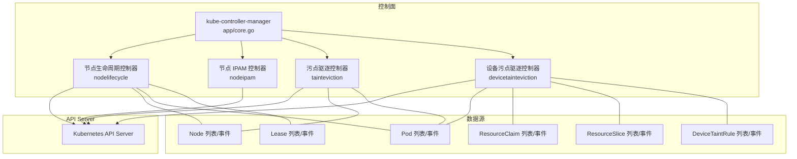
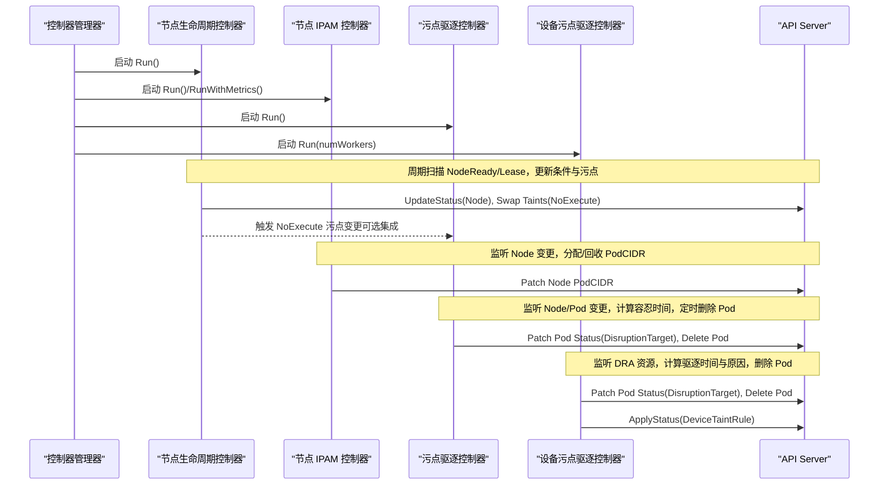
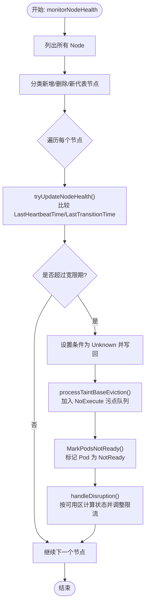
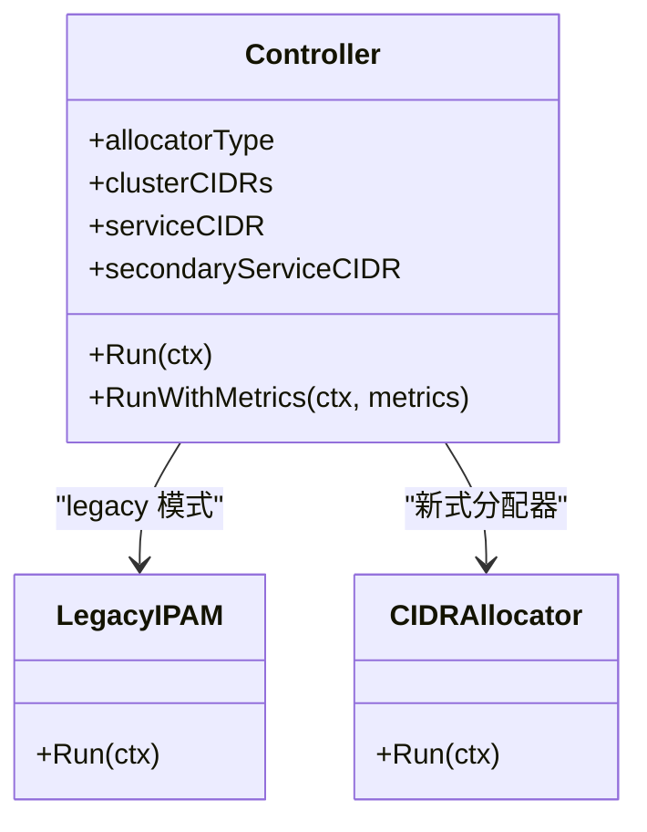
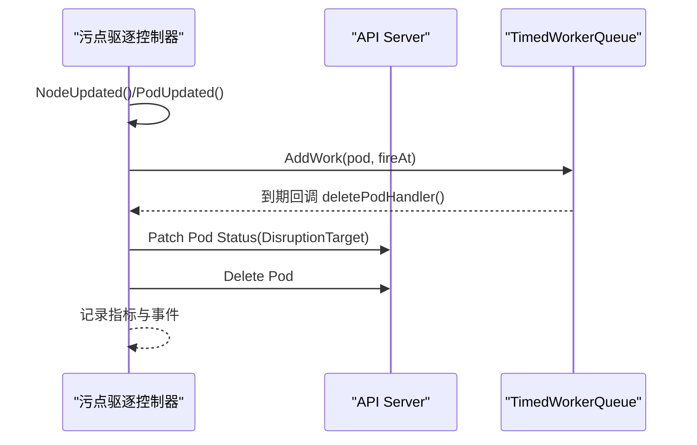
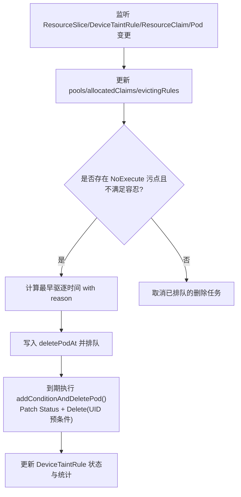
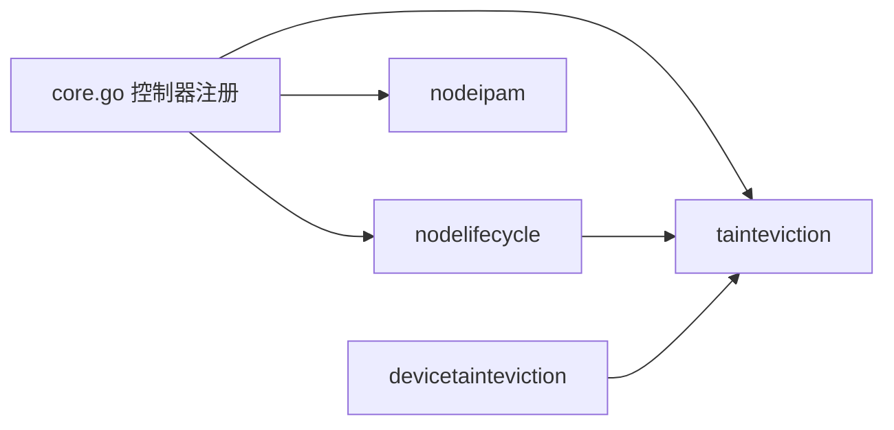

# 节点管理控制器

<cite>
**本文引用的文件**   
- [cmd/kube-controller-manager/app/core.go](file://cmd/kube-controller-manager/app/core.go)
- [pkg/controller/nodelifecycle/node_lifecycle_controller.go](file://pkg/controller/nodelifecycle/node_lifecycle_controller.go)
- [pkg/controller/nodeipam/node_ipam_controller.go](file://pkg/controller/nodeipam/node_ipam_controller.go)
- [pkg/controller/tainteviction/taint_eviction.go](file://pkg/controller/tainteviction/taint_eviction.go)
- [pkg/controller/devicetainteviction/device_taint_eviction.go](file://pkg/controller/devicetainteviction/device_taint_eviction.go)
</cite>

## 目录
1. [简介](#简介)
2. [项目结构](#项目结构)
3. [核心组件](#核心组件)
4. [架构总览](#架构总览)
5. [详细组件分析](#详细组件分析)
6. [依赖关系分析](#依赖关系分析)
7. [性能与可观测性](#性能与可观测性)
8. [配置与调优](#配置与调优)
9. [故障排查指南](#故障排查指南)
10. [结论](#结论)

## 简介
本技术文档聚焦 Kubernetes 控制面中与“节点管理”相关的控制器，包括：
- 节点生命周期控制器：负责节点健康检查、条件更新与污点（Taint）管理。
- 节点 IPAM 控制器：负责 PodCIDR 的分配与管理策略。
- 污点驱逐控制器：基于 NoExecute 污点的 Pod 驱逐逻辑与资源清理机制。
- 设备污点驱逐控制器：面向 DRA 设备的 NoExecute 污点驱动的 Pod 驱逐与状态统计。

文档同时覆盖监控指标收集、故障检测与自动恢复流程，并提供配置选项、性能调优参数和常见异常处理案例。

## 项目结构
与节点管理相关的关键代码位于以下路径：
- 控制器启动与注册入口：cmd/kube-controller-manager/app/core.go
- 节点生命周期控制器：pkg/controller/nodelifecycle/...
- 节点 IPAM 控制器：pkg/controller/nodeipam/...
- 污点驱逐控制器：pkg/controller/tainteviction/...
- 设备污点驱逐控制器：pkg/controller/devicetainteviction/...

图表来源
- [cmd/kube-controller-manager/app/core.go:80-232](file://cmd/kube-controller-manager/app/core.go#L80-L232)
- [pkg/controller/nodelifecycle/node_lifecycle_controller.go:224-443](file://pkg/controller/nodelifecycle/node_lifecycle_controller.go#L224-L443)
- [pkg/controller/nodeipam/node_ipam_controller.go:44-132](file://pkg/controller/nodeipam/node_ipam_controller.go#L44-L132)
- [pkg/controller/tainteviction/taint_eviction.go:83-276](file://pkg/controller/tainteviction/taint_eviction.go#L83-L276)
- [pkg/controller/devicetainteviction/device_taint_eviction.go:87-778](file://pkg/controller/devicetainteviction/device_taint_eviction.go#L87-L778)

章节来源
- [cmd/kube-controller-manager/app/core.go:80-232](file://cmd/kube-controller-manager/app/core.go#L80-L232)

## 核心组件
- 节点生命周期控制器
  - 职责：周期性探测 NodeReady 条件与 Lease 心跳；根据健康状态添加/移除 NoExecute 污点；协调 NoSchedule 污点与标签一致性；按可用区进行驱逐速率控制与中断模式切换。
- 节点 IPAM 控制器
  - 职责：在启用 --allocate-node-cidrs 时，为 Node 分配 PodCIDR；支持集群内分配或云厂商分配；校验 cluster-cidr 与 node-cidr-mask-size 的合法性；兼容双栈 Service CIDR。
- 污点驱逐控制器
  - 职责：监听 Node 的 NoExecute 污点与 Pod 容忍变化；计算最小容忍时间；调度并执行 Pod 删除；记录事件与指标。
- 设备污点驱逐控制器
  - 职责：监听 DRA ResourceSlice 的设备 NoExecute 污点与 DeviceTaintRule；结合 ResourceClaim 的分配结果，对不满足容忍条件的 Pod 执行延迟驱逐；维护规则状态与统计。

章节来源
- [pkg/controller/nodelifecycle/node_lifecycle_controller.go:224-443](file://pkg/controller/nodelifecycle/node_lifecycle_controller.go#L224-L443)
- [pkg/controller/nodeipam/node_ipam_controller.go:44-132](file://pkg/controller/nodeipam/node_ipam_controller.go#L44-L132)
- [pkg/controller/tainteviction/taint_eviction.go:83-276](file://pkg/controller/tainteviction/taint_eviction.go#L83-L276)
- [pkg/controller/devicetainteviction/device_taint_eviction.go:87-778](file://pkg/controller/devicetainteviction/device_taint_eviction.go#L87-L778)

## 架构总览
节点管理控制器通过 Informer/Lister 缓存 API 对象变更，使用工作队列与定时器驱动异步处理，避免阻塞事件处理路径。关键交互如下：

图表来源
- [cmd/kube-controller-manager/app/core.go:80-232](file://cmd/kube-controller-manager/app/core.go#L80-L232)
- [pkg/controller/nodelifecycle/node_lifecycle_controller.go:445-513](file://pkg/controller/nodelifecycle/node_lifecycle_controller.go#L445-L513)
- [pkg/controller/nodeipam/node_ipam_controller.go:134-162](file://pkg/controller/nodeipam/node_ipam_controller.go#L134-L162)
- [pkg/controller/tainteviction/taint_eviction.go:278-355](file://pkg/controller/tainteviction/taint_eviction.go#L278-L355)
- [pkg/controller/devicetainteviction/device_taint_eviction.go:780-800](file://pkg/controller/devicetainteviction/device_taint_eviction.go#L780-L800)

## 详细组件分析

### 节点生命周期控制器
- 健康检查与条件更新
  - 周期性读取 Node 的 NodeReady 条件与 Lease 心跳，若超过宽限期则把相关条件置为 Unknown，并尝试写回 API Server。
  - 支持“租约熔断器”特性，当 Lease 缓存不一致时短路本轮处理，等待缓存追赶。
- 污点管理
  - 将 NodeReady=False 映射到 NotReady 污点，NodeReady=Unknown 映射到 Unreachable 污点，二者互斥。
  - 同步 NoSchedule 污点以反映 Unschedulable 与压力类条件（内存/磁盘/PID）。
  - 按可用区维护 NoExecute 污点驱逐队列，动态调整限流速率，支持“完全中断/部分中断/正常”三种模式。
- Pod 就绪标记
  - 当节点不可用时，批量标记其上的 Pod 为 NotReady，提升上层感知能力。
- 标签一致性
  - 对齐稳定版与 beta 版 OS/Arch 标签，确保向后兼容。

图表来源
- [pkg/controller/nodelifecycle/node_lifecycle_controller.go:678-793](file://pkg/controller/nodelifecycle/node_lifecycle_controller.go#L678-L793)
- [pkg/controller/nodelifecycle/node_lifecycle_controller.go:842-1047](file://pkg/controller/nodelifecycle/node_lifecycle_controller.go#L842-L1047)
- [pkg/controller/nodelifecycle/node_lifecycle_controller.go:795-829](file://pkg/controller/nodelifecycle/node_lifecycle_controller.go#L795-L829)
- [pkg/controller/nodelifecycle/node_lifecycle_controller.go:1049-1138](file://pkg/controller/nodelifecycle/node_lifecycle_controller.go#L1049-L1138)

章节来源
- [pkg/controller/nodelifecycle/node_lifecycle_controller.go:224-443](file://pkg/controller/nodelifecycle/node_lifecycle_controller.go#L224-L443)
- [pkg/controller/nodelifecycle/node_lifecycle_controller.go:445-513](file://pkg/controller/nodelifecycle/node_lifecycle_controller.go#L445-L513)
- [pkg/controller/nodelifecycle/node_lifecycle_controller.go:678-793](file://pkg/controller/nodelifecycle/node_lifecycle_controller.go#L678-L793)
- [pkg/controller/nodelifecycle/node_lifecycle_controller.go:842-1047](file://pkg/controller/nodelifecycle/node_lifecycle_controller.go#L842-L1047)
- [pkg/controller/nodelifecycle/node_lifecycle_controller.go:1049-1138](file://pkg/controller/nodelifecycle/node_lifecycle_controller.go#L1049-L1138)

### 节点 IPAM 控制器
- 初始化与校验
  - 当启用 --allocate-node-cidrs 且未配置云提供商时，拒绝运行。
  - 校验 cluster-cidr 掩码长度不大于 node-cidr-mask-size，否则报错。
  - 支持双栈 Service CIDR 校验与兼容性处理。
- 分配策略
  - 支持 legacy 模式（从集群或云获取）与新式 CIDRAllocator 接口；后者通过 ipam.New 创建具体实现。
- 运行循环
  - 等待 Node Informer 同步后，进入分配主循环，监听 Node 变更并分配/回收 PodCIDR。

图表来源
- [pkg/controller/nodeipam/node_ipam_controller.go:44-132](file://pkg/controller/nodeipam/node_ipam_controller.go#L44-L132)
- [pkg/controller/nodeipam/node_ipam_controller.go:134-162](file://pkg/controller/nodeipam/node_ipam_controller.go#L134-L162)

章节来源
- [pkg/controller/nodeipam/node_ipam_controller.go:44-132](file://pkg/controller/nodeipam/node_ipam_controller.go#L44-L132)
- [pkg/controller/nodeipam/node_ipam_controller.go:134-162](file://pkg/controller/nodeipam/node_ipam_controller.go#L134-L162)

### 污点驱逐控制器
- 事件监听
  - 监听 Node 的 NoExecute 污点变化与 Pod 的容忍变化，分别入队 node/pod 更新通道。
- 驱逐决策
  - 计算最小容忍时间；若无容忍或容忍时间为负（无限），取消已排队的删除任务。
  - 使用 TimedWorkerQueue 在触发时间执行删除，并在删除前打 DisruptionTarget 条件。
- 并发与优先级
  - 同一 worker 优先处理 Node 更新，再处理 Pod 更新，避免竞态。
  - 多 worker 并行，按 nodeName 哈希分片，保证同一节点的处理串行化。

图表来源
- [pkg/controller/tainteviction/taint_eviction.go:278-355](file://pkg/controller/tainteviction/taint_eviction.go#L278-L355)
- [pkg/controller/tainteviction/taint_eviction.go:107-148](file://pkg/controller/tainteviction/taint_eviction.go#L107-L148)
- [pkg/controller/tainteviction/taint_eviction.go:451-490](file://pkg/controller/tainteviction/taint_eviction.go#L451-L490)

章节来源
- [pkg/controller/tainteviction/taint_eviction.go:83-276](file://pkg/controller/tainteviction/taint_eviction.go#L83-L276)
- [pkg/controller/tainteviction/taint_eviction.go:278-355](file://pkg/controller/tainteviction/taint_eviction.go#L278-L355)
- [pkg/controller/tainteviction/taint_eviction.go:451-490](file://pkg/controller/tainteviction/taint_eviction.go#L451-L490)

### 设备污点驱逐控制器
- 数据模型
  - 维护 pools（按 driver+pool 聚合 ResourceSlice）、allocatedClaims（已分配的 ResourceClaim）、deletePodAt（待驱逐 Pod 及原因）、evictingRules（导致驱逐的规则集合）。
- 驱逐决策
  - 根据 ResourceSlice 中设备的 NoExecute 污点与 DeviceTaintRule 匹配，结合 Pod 使用的 ResourceClaim 的分配结果，计算需要驱逐的 Pod 与触发时间。
  - 支持 None/NoExecute 效果的状态模拟与统计，定期更新 DeviceTaintRule 的 EvictionInProgress 条件。
- 执行与幂等
  - 删除前打 DisruptionTarget 条件，并使用 UID 预条件防止同名替换导致的竞态。
  - 使用 uidCache 记录已驱逐 Pod，避免重复操作。

图表来源
- [pkg/controller/devicetainteviction/device_taint_eviction.go:87-147](file://pkg/controller/devicetainteviction/device_taint_eviction.go#L87-L147)
- [pkg/controller/devicetainteviction/device_taint_eviction.go:382-457](file://pkg/controller/devicetainteviction/device_taint_eviction.go#L382-L457)
- [pkg/controller/devicetainteviction/device_taint_eviction.go:459-501](file://pkg/controller/devicetainteviction/device_taint_eviction.go#L459-L501)
- [pkg/controller/devicetainteviction/device_taint_eviction.go:503-675](file://pkg/controller/devicetainteviction/device_taint_eviction.go#L503-L675)

章节来源
- [pkg/controller/devicetainteviction/device_taint_eviction.go:87-147](file://pkg/controller/devicetainteviction/device_taint_eviction.go#L87-L147)
- [pkg/controller/devicetainteviction/device_taint_eviction.go:382-457](file://pkg/controller/devicetainteviction/device_taint_eviction.go#L382-L457)
- [pkg/controller/devicetainteviction/device_taint_eviction.go:459-501](file://pkg/controller/devicetainteviction/device_taint_eviction.go#L459-L501)
- [pkg/controller/devicetainteviction/device_taint_eviction.go:503-675](file://pkg/controller/devicetainteviction/device_taint_eviction.go#L503-L675)

## 依赖关系分析
- 控制器管理器入口
  - 注册并启动 NodeLifecycleController、NodeIpamController、TaintEvictionController（受特性门控 SeparateTaintEvictionController 控制）。
- 内部耦合
  - 节点生命周期控制器在未启用独立污点驱逐控制器时会内嵌 tainteviction.Controller。
  - 设备污点驱逐控制器复用 tainteviction 的命名对象与队列工具。

图表来源
- [cmd/kube-controller-manager/app/core.go:164-232](file://cmd/kube-controller-manager/app/core.go#L164-L232)
- [pkg/controller/nodelifecycle/node_lifecycle_controller.go:401-408](file://pkg/controller/nodelifecycle/node_lifecycle_controller.go#L401-L408)
- [pkg/controller/devicetainteviction/device_taint_eviction.go:59-62](file://pkg/controller/devicetainteviction/device_taint_eviction.go#L59-L62)

章节来源
- [cmd/kube-controller-manager/app/core.go:164-232](file://cmd/kube-controller-manager/app/core.go#L164-L232)
- [pkg/controller/nodelifecycle/node_lifecycle_controller.go:401-408](file://pkg/controller/nodelifecycle/node_lifecycle_controller.go#L401-L408)

## 性能与可观测性
- 并发与限流
  - 节点生命周期控制器按可用区分片维护 NoExecute 污点驱逐队列，支持正常/部分中断/完全中断三种模式的速率限制切换。
  - 污点驱逐控制器使用 TimedWorkerQueue 与多 worker 分片，避免热点节点竞争。
- 指标与事件
  - 节点生命周期控制器暴露各可用区的健康度、不健康节点数与驱逐总数等指标。
  - 污点驱逐控制器与设备污点驱逐控制器记录 Pod 删除次数与延迟，并输出事件便于追踪。
- 日志与调试
  - 控制器在关键路径输出结构化日志，包含节点/Pod 引用与错误上下文，便于定位问题。

章节来源
- [pkg/controller/nodelifecycle/node_lifecycle_controller.go:1049-1138](file://pkg/controller/nodelifecycle/node_lifecycle_controller.go#L1049-L1138)
- [pkg/controller/tainteviction/taint_eviction.go:107-148](file://pkg/controller/tainteviction/taint_eviction.go#L107-L148)
- [pkg/controller/devicetainteviction/device_taint_eviction.go:435-457](file://pkg/controller/devicetainteviction/device_taint_eviction.go#L435-L457)

## 配置与调优
- 节点生命周期控制器
  - 监控周期与宽限期：nodeMonitorPeriod、nodeStartupGracePeriod、nodeMonitorGracePeriod。
  - 驱逐速率：evictionLimiterQPS、secondaryEvictionLimiterQPS。
  - 大规模集群阈值：largeClusterSizeThreshold。
  - 可用区不健康阈值：unhealthyZoneThreshold。
- 节点 IPAM 控制器
  - 启用分配：--allocate-node-cidrs。
  - 分配器类型：--cidr-allocator-type（CloudAllocator 需配置云提供商）。
  - 集群网段与掩码：--cluster-cidr、--node-cidr-mask-size-ipv4/ipv6。
  - Service CIDR 双栈：--service-cidr、--secondary-service-cidr。
- 污点驱逐控制器
  - 特性门控：SeparateTaintEvictionController（决定是否独立运行）。
- 设备污点驱逐控制器
  - 特性门控：DRADeviceTaintRules、DRAWorkloadResourceClaims（影响功能开关）。

章节来源
- [cmd/kube-controller-manager/app/core.go:172-201](file://cmd/kube-controller-manager/app/core.go#L172-L201)
- [cmd/kube-controller-manager/app/core.go:88-162](file://cmd/kube-controller-manager/app/core.go#L88-L162)
- [cmd/kube-controller-manager/app/core.go:213-232](file://cmd/kube-controller-manager/app/core.go#L213-L232)
- [pkg/controller/nodeipam/node_ipam_controller.go:75-93](file://pkg/controller/nodeipam/node_ipam_controller.go#L75-L93)

## 故障排查指南
- 节点长时间无响应
  - 现象：NodeReady 被置为 Unknown，出现 NotReady/Unreachable 污点，Pod 被驱逐。
  - 排查要点：确认 kubelet 上报频率与 Lease 续期是否正常；检查 HTTP2 健康检查超时；核对 nodeMonitorGracePeriod 与 kubelet 的 nodeStatusUpdateFrequency/renewInterval 的关系。
  - 参考路径
    - [pkg/controller/nodelifecycle/node_lifecycle_controller.go:842-1047](file://pkg/controller/nodelifecycle/node_lifecycle_controller.go#L842-L1047)
- 驱逐风暴或过度驱逐
  - 现象：大量 Pod 被驱逐，集群吞吐下降。
  - 排查要点：查看可用区健康度与驱逐速率；评估 largeClusterSizeThreshold 与 secondaryEvictionLimiterQPS；确认是否存在误判的不健康节点。
  - 参考路径
    - [pkg/controller/nodelifecycle/node_lifecycle_controller.go:1049-1138](file://pkg/controller/nodelifecycle/node_lifecycle_controller.go#L1049-L1138)
- PodCIDR 分配失败
  - 现象：Node 无法获得 PodCIDR，网络插件无法正常工作。
  - 排查要点：校验 --cluster-cidr 与 --node-cidr-mask-size 的掩码大小关系；确认 CloudAllocator 模式下云提供商已正确配置；检查双栈 Service CIDR 是否合法。
  - 参考路径
    - [pkg/controller/nodeipam/node_ipam_controller.go:75-93](file://pkg/controller/nodeipam/node_ipam_controller.go#L75-L93)
- 设备污点驱逐未按预期执行
  - 现象：设备被标记 NoExecute，但 Pod 未被驱逐。
  - 排查要点：确认 ResourceClaim 的分配结果与 DeviceTaintRule 匹配；检查 Pod 的容忍配置；观察 DeviceTaintRule 的 EvictionInProgress 条件与统计信息。
  - 参考路径
    - [pkg/controller/devicetainteviction/device_taint_eviction.go:503-675](file://pkg/controller/devicetainteviction/device_taint_eviction.go#L503-L675)

章节来源
- [pkg/controller/nodelifecycle/node_lifecycle_controller.go:842-1047](file://pkg/controller/nodelifecycle/node_lifecycle_controller.go#L842-L1047)
- [pkg/controller/nodelifecycle/node_lifecycle_controller.go:1049-1138](file://pkg/controller/nodelifecycle/node_lifecycle_controller.go#L1049-L1138)
- [pkg/controller/nodeipam/node_ipam_controller.go:75-93](file://pkg/controller/nodeipam/node_ipam_controller.go#L75-L93)
- [pkg/controller/devicetainteviction/device_taint_eviction.go:503-675](file://pkg/controller/devicetainteviction/device_taint_eviction.go#L503-L675)

## 结论
节点管理控制器体系围绕“健康探测—条件更新—污点管理—驱逐执行”的主线展开，配合 IPAM 的地址分配与 DRA 的设备污点扩展，形成完整的节点治理闭环。通过合理的宽限期、限流策略与可用区级中断模式，系统在大集群与高故障场景下仍能保持可控的驱逐节奏与稳定性。建议在生产环境中依据集群规模与业务特征，精细调节监控周期、宽限期与驱逐速率，并结合指标与事件进行持续观测与优化。