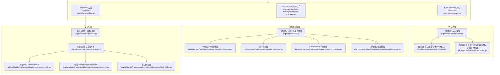
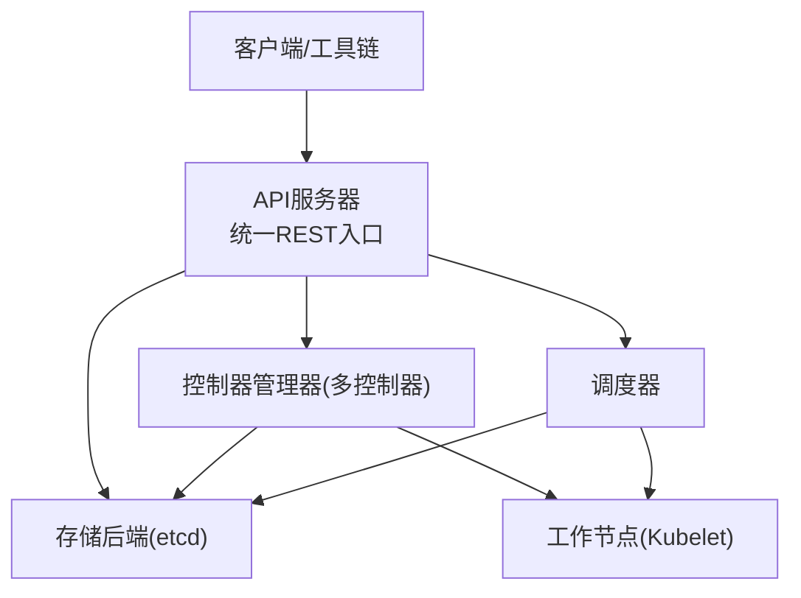
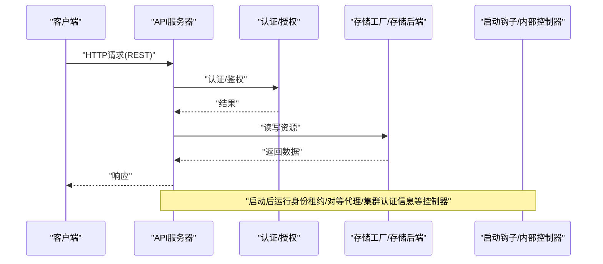
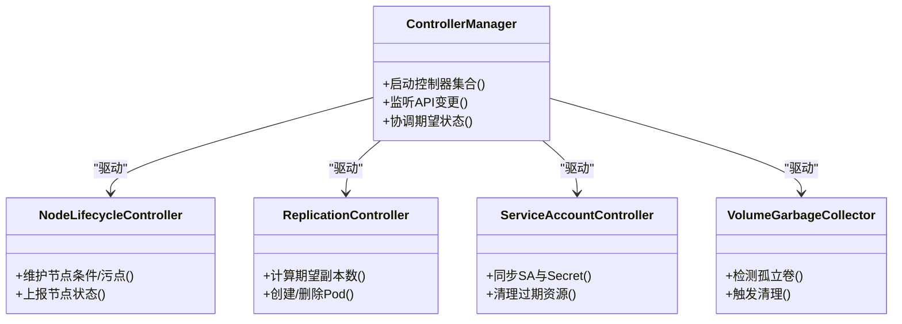
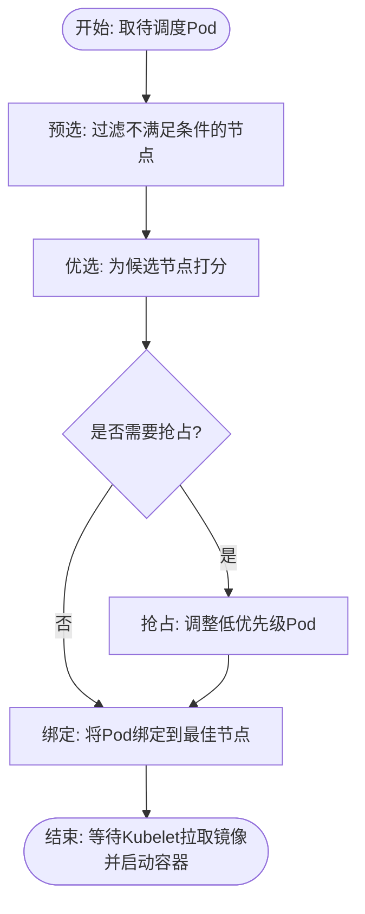
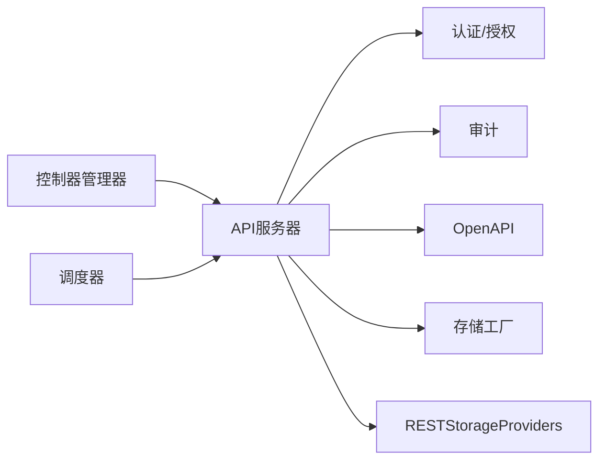

# 控制平面组件

<cite>
**本文引用的文件**   
- [cmd/kube-apiserver/apiserver.go](file://cmd/kube-apiserver/apiserver.go)
- [pkg/controlplane/instance.go](file://pkg/controlplane/instance.go)
- [pkg/controlplane/apiserver/config.go](file://pkg/controlplane/apiserver/config.go)
- [pkg/controlplane/apiserver/server.go](file://pkg/controlplane/apiserver/server.go)
- [cmd/kube-controller-manager/controller-manager.go](file://cmd/kube-controller-manager/controller-manager.go)
- [pkg/controller/doc.go](file://pkg/controller/doc.go)
- [pkg/controller/nodelifecycle/node_lifecycle_controller.go](file://pkg/controller/nodelifecycle/node_lifecycle_controller.go)
- [pkg/controller/replication/replication_controller.go](file://pkg/controller/replication/replication_controller.go)
- [pkg/controller/serviceaccount/service_account_controller.go](file://pkg/controller/serviceaccount/service_account_controller.go)
- [pkg/controller/volume/garbagecollector/garbagecollector.go](file://pkg/controller/volume/garbagecollector/garbagecollector.go)
- [cmd/kube-scheduler/scheduler.go](file://cmd/kube-scheduler/scheduler.go)
- [pkg/scheduler/scheduler.go](file://pkg/scheduler/scheduler.go)
- [pkg/scheduler/framework/interface.go](file://pkg/scheduler/framework/interface.go)
- [pkg/scheduler/framework/plugins/noderesources/fit.go](file://pkg/scheduler/framework/plugins/noderesources/fit.go)
- [pkg/scheduler/framework/plugins/noderesources/bestfit.go](file://pkg/scheduler/framework/plugins/noderesources/bestfit.go)
- [pkg/scheduler/framework/plugins/defaultbinder/default_binder.go](file://pkg/scheduler/framework/plugins/defaultbinder/default_binder.go)
</cite>

## 目录
1. [简介](#简介)
2. [项目结构](#项目结构)
3. [核心组件](#核心组件)
4. [架构总览](#架构总览)
5. [详细组件分析](#详细组件分析)
6. [依赖关系分析](#依赖关系分析)
7. [性能考虑](#性能考虑)
8. [故障排查指南](#故障排查指南)
9. [结论](#结论)
10. [附录](#附录)

## 简介
本技术文档面向Kubernetes控制平面，聚焦以下目标：
- API服务器的统一API访问层设计：REST路由、认证授权、存储后端集成与版本管理策略。
- 控制器管理器工作机制：内置控制器（节点、副本、服务、存储等）的实现原理与协调方式。
- 调度器决策算法：预选、优选策略与调度框架扩展机制。
- 组件间通信协议、数据流图与性能调优建议。
- 高可用部署方案、故障恢复机制与监控指标说明。

## 项目结构
控制平面由三大核心二进制组成：kube-apiserver、kube-controller-manager、kube-scheduler。其入口分别位于各自cmd目录下，并通过pkg/controlplane与pkg/scheduler等包组织核心逻辑。

图表来源
- [cmd/kube-apiserver/apiserver.go:1-37](file://cmd/kube-apiserver/apiserver.go#L1-L37)
- [pkg/controlplane/instance.go:1-120](file://pkg/controlplane/instance.go#L1-L120)
- [pkg/controlplane/apiserver/config.go:120-253](file://pkg/controlplane/apiserver/config.go#L120-L253)
- [pkg/controlplane/apiserver/server.go:90-140](file://pkg/controlplane/apiserver/server.go#L90-L140)
- [cmd/kube-controller-manager/controller-manager.go:1-39](file://cmd/kube-controller-manager/controller-manager.go#L1-L39)
- [pkg/controller/doc.go:1-50](file://pkg/controller/doc.go#L1-L50)
- [pkg/controller/nodelifecycle/node_lifecycle_controller.go:1-80](file://pkg/controller/nodelifecycle/node_lifecycle_controller.go#L1-L80)
- [pkg/controller/replication/replication_controller.go:1-80](file://pkg/controller/replication/replication_controller.go#L1-L80)
- [pkg/controller/serviceaccount/service_account_controller.go:1-80](file://pkg/controller/serviceaccount/service_account_controller.go#L1-L80)
- [pkg/controller/volume/garbagecollector/garbagecollector.go:1-80](file://pkg/controller/volume/garbagecollector/garbagecollector.go#L1-L80)
- [cmd/kube-scheduler/scheduler.go:1-34](file://cmd/kube-scheduler/scheduler.go#L1-L34)
- [pkg/scheduler/scheduler.go:1-120](file://pkg/scheduler/scheduler.go#L1-L120)
- [pkg/scheduler/framework/interface.go:1-120](file://pkg/scheduler/framework/interface.go#L1-L120)
- [pkg/scheduler/framework/plugins/noderesources/fit.go:1-120](file://pkg/scheduler/framework/plugins/noderesources/fit.go#L1-L120)
- [pkg/scheduler/framework/plugins/noderesources/bestfit.go:1-120](file://pkg/scheduler/framework/plugins/noderesources/bestfit.go#L1-L120)
- [pkg/scheduler/framework/plugins/defaultbinder/default_binder.go:1-120](file://pkg/scheduler/framework/plugins/defaultbinder/default_binder.go#L1-L120)

章节来源
- [cmd/kube-apiserver/apiserver.go:1-37](file://cmd/kube-apiserver/apiserver.go#L1-L37)
- [cmd/kube-controller-manager/controller-manager.go:1-39](file://cmd/kube-controller-manager/controller-manager.go#L1-L39)
- [cmd/kube-scheduler/scheduler.go:1-34](file://cmd/kube-scheduler/scheduler.go#L1-L34)

## 核心组件
- API服务器
  - 入口命令构建与运行，加载日志与指标插件。
  - 通过通用配置组装认证、授权、审计、OpenAPI、EgressSelector、存储工厂与Informer。
  - 安装各API组RESTStorageProvider，暴露统一API访问层。
  - 在PostStartHook中启动身份租约、对等代理、集群认证信息控制器等。
- 控制器管理器
  - 入口命令构建与运行，加载日志与指标插件。
  - 基于控制器公共抽象，驱动各类内置控制器（节点、副本、服务账户、卷GC等）。
- 调度器
  - 入口命令构建与运行，加载日志与指标插件。
  - 基于调度框架（Plugin Framework）执行预选、优选、抢占、绑定等阶段。

章节来源
- [cmd/kube-apiserver/apiserver.go:21-36](file://cmd/kube-apiserver/apiserver.go#L21-L36)
- [cmd/kube-controller-manager/controller-manager.go:23-38](file://cmd/kube-controller-manager/controller-manager.go#L23-L38)
- [cmd/kube-scheduler/scheduler.go:19-33](file://cmd/kube-scheduler/scheduler.go#L19-L33)

## 架构总览
下图展示控制平面整体交互：客户端通过API服务器访问集群状态；控制器监听并维护期望状态；调度器负责Pod到节点的分配；所有组件通过etcd持久化状态。

图表来源
- [pkg/controlplane/instance.go:393-453](file://pkg/controlplane/instance.go#L393-L453)
- [pkg/controlplane/apiserver/config.go:208-253](file://pkg/controlplane/apiserver/config.go#L208-L253)
- [pkg/scheduler/scheduler.go:1-120](file://pkg/scheduler/scheduler.go#L1-L120)

## 详细组件分析

### API服务器：统一API访问层
- REST API处理
  - 通过RESTStorageProvider列表注册各API组资源，顺序决定未限定资源名的解析优先级。
  - 支持聚合发现与OpenAPI/OpenAPIv3元数据生成。
- 认证授权机制
  - 认证：支持客户端证书、请求头、外部Token等，结合EgressSelector进行出站控制。
  - 授权：可启用RBAC等模式，提供Authorizer与RuleResolver。
  - 审计：通过Audit配置接入审计策略。
- 存储后端集成
  - 使用StorageFactory创建存储配置，适配不同后端（如etcd），并注入对象计数跟踪器。
- 版本管理策略
  - 通过ResourceConfig显式启用稳定版本，禁用Alpha/Beta版本，保证向后兼容与可控演进。
- 启动钩子与内部控制器
  - PostStartHook：系统命名空间控制器、集群认证信息控制器、身份租约控制器、对等代理与本地发现同步等。
  - PreShutdownHook：优雅停止相关控制器。

图表来源
- [pkg/controlplane/apiserver/config.go:120-253](file://pkg/controlplane/apiserver/config.go#L120-L253)
- [pkg/controlplane/apiserver/server.go:90-140](file://pkg/controlplane/apiserver/server.go#L90-L140)
- [pkg/controlplane/instance.go:393-453](file://pkg/controlplane/instance.go#L393-L453)

章节来源
- [pkg/controlplane/instance.go:393-453](file://pkg/controlplane/instance.go#L393-L453)
- [pkg/controlplane/apiserver/config.go:208-253](file://pkg/controlplane/apiserver/config.go#L208-L253)
- [pkg/controlplane/apiserver/server.go:156-230](file://pkg/controlplane/apiserver/server.go#L156-L230)

### 控制器管理器：内置控制器与协调
- 工作机制
  - 入口命令初始化后，控制器管理器根据配置启动多个控制器，每个控制器基于Informer监听对应资源变化，实现“期望状态→实际状态”的闭环。
- 关键内置控制器
  - 节点生命周期控制器：维护节点条件、污点、健康检查等。
  - 副本控制器：确保ReplicationController定义的副本数与实际一致。
  - ServiceAccount控制器：管理服务账户及其关联Secret。
  - 卷垃圾回收控制器：清理未被引用的卷资源。
- 协调方式
  - 共享Informer与事件队列，避免重复处理；通过LeaderElection保证单活（若需要）。
  - 与API服务器交互，读取/更新资源状态。

图表来源
- [pkg/controller/doc.go:1-50](file://pkg/controller/doc.go#L1-L50)
- [pkg/controller/nodelifecycle/node_lifecycle_controller.go:1-80](file://pkg/controller/nodelifecycle/node_lifecycle_controller.go#L1-L80)
- [pkg/controller/replication/replication_controller.go:1-80](file://pkg/controller/replication/replication_controller.go#L1-L80)
- [pkg/controller/serviceaccount/service_account_controller.go:1-80](file://pkg/controller/serviceaccount/service_account_controller.go#L1-L80)
- [pkg/controller/volume/garbagecollector/garbagecollector.go:1-80](file://pkg/controller/volume/garbagecollector/garbagecollector.go#L1-L80)

章节来源
- [cmd/kube-controller-manager/controller-manager.go:23-38](file://cmd/kube-controller-manager/controller-manager.go#L23-L38)
- [pkg/controller/doc.go:1-50](file://pkg/controller/doc.go#L1-L50)
- [pkg/controller/nodelifecycle/node_lifecycle_controller.go:1-80](file://pkg/controller/nodelifecycle/node_lifecycle_controller.go#L1-L80)
- [pkg/controller/replication/replication_controller.go:1-80](file://pkg/controller/replication/replication_controller.go#L1-L80)
- [pkg/controller/serviceaccount/service_account_controller.go:1-80](file://pkg/controller/serviceaccount/service_account_controller.go#L1-L80)
- [pkg/controller/volume/garbagecollector/garbagecollector.go:1-80](file://pkg/controller/volume/garbagecollector/garbagecollector.go#L1-L80)

### 调度器：决策算法与扩展机制
- 调度流程
  - 从队列取出待调度Pod，进入调度框架的各个阶段：预选（Filter）、优选（Score）、抢占（Preemption）、绑定（Bind）。
- 预选与优选策略
  - 预选：NodeResourcesFit检查节点资源是否满足Pod需求。
  - 优选：NodeResourcesBestFit按剩余资源打分，选择更合适的节点。
- 扩展机制
  - 通过Plugin Framework注册自定义插件，扩展预选、优选、抢占、绑定等阶段行为。
- 默认绑定器
  - DefaultBinder将Pod绑定到选定节点，完成调度。

图表来源
- [pkg/scheduler/scheduler.go:1-120](file://pkg/scheduler/scheduler.go#L1-L120)
- [pkg/scheduler/framework/interface.go:1-120](file://pkg/scheduler/framework/interface.go#L1-L120)
- [pkg/scheduler/framework/plugins/noderesources/fit.go:1-120](file://pkg/scheduler/framework/plugins/noderesources/fit.go#L1-L120)
- [pkg/scheduler/framework/plugins/noderesources/bestfit.go:1-120](file://pkg/scheduler/framework/plugins/noderesources/bestfit.go#L1-L120)
- [pkg/scheduler/framework/plugins/defaultbinder/default_binder.go:1-120](file://pkg/scheduler/framework/plugins/defaultbinder/default_binder.go#L1-L120)

章节来源
- [cmd/kube-scheduler/scheduler.go:19-33](file://cmd/kube-scheduler/scheduler.go#L19-L33)
- [pkg/scheduler/scheduler.go:1-120](file://pkg/scheduler/scheduler.go#L1-L120)
- [pkg/scheduler/framework/interface.go:1-120](file://pkg/scheduler/framework/interface.go#L1-L120)
- [pkg/scheduler/framework/plugins/noderesources/fit.go:1-120](file://pkg/scheduler/framework/plugins/noderesources/fit.go#L1-L120)
- [pkg/scheduler/framework/plugins/noderesources/bestfit.go:1-120](file://pkg/scheduler/framework/plugins/noderesources/bestfit.go#L1-L120)
- [pkg/scheduler/framework/plugins/defaultbinder/default_binder.go:1-120](file://pkg/scheduler/framework/plugins/defaultbinder/default_binder.go#L1-L120)

## 依赖关系分析
- API服务器依赖
  - 认证/授权模块、审计模块、OpenAPI、EgressSelector、存储工厂与各API组RESTStorageProvider。
  - 启动钩子依赖Informer与LoopbackClient，用于内部控制器与对等代理。
- 控制器管理器依赖
  - 依赖API服务器提供的Informer与ClientSet，驱动各控制器。
- 调度器依赖
  - 依赖API服务器提供的Informer与ClientSet，以及Scheduler Cache与Queue。

图表来源
- [pkg/controlplane/apiserver/config.go:208-253](file://pkg/controlplane/apiserver/config.go#L208-L253)
- [pkg/controlplane/instance.go:393-453](file://pkg/controlplane/instance.go#L393-L453)
- [pkg/scheduler/scheduler.go:1-120](file://pkg/scheduler/scheduler.go#L1-L120)

章节来源
- [pkg/controlplane/apiserver/config.go:208-253](file://pkg/controlplane/apiserver/config.go#L208-L253)
- [pkg/controlplane/instance.go:393-453](file://pkg/controlplane/instance.go#L393-L453)
- [pkg/scheduler/scheduler.go:1-120](file://pkg/scheduler/scheduler.go#L1-L120)

## 性能考虑
- API服务器
  - 长连接与流式操作识别：区分watch/proxy与attach/exec/log/portforward等长生命周期请求，合理设置超时与并发。
  - 存储层优化：启用CBOR序列化（特性门控）、压缩开关与对象计数跟踪器，降低序列化开销与内存占用。
  - 对等代理与本地发现：在多实例场景下减少跨实例请求，提升吞吐。
- 控制器管理器
  - Informer缓存与去重：利用transform去除managedFields等冗余字段，降低内存压力。
  - 控制器并行度：按需调整worker数量，避免热点资源争用。
- 调度器
  - 预选/优选插件并行化：充分利用CPU核数，缩短调度延迟。
  - 队列与堆优化：活跃队列与退避队列配合，避免抖动。

[本节为通用指导，无需具体文件引用]

## 故障排查指南
- API服务器
  - 启动失败：检查认证/授权配置、存储工厂配置与端口绑定。
  - 身份租约异常：查看身份租约控制器日志与Lease对象标签/注解。
  - 对等代理不可用：确认PeerProxy与本地发现缓存同步状态。
- 控制器管理器
  - 控制器未生效：确认Informer已启动且事件正常分发；检查LeaderElection状态。
  - 资源不一致：对比期望与实际状态，定位控制器同步逻辑问题。
- 调度器
  - Pod长期Pending：检查预选/优选插件评分与抢占策略；观察调度器日志与指标。
  - 绑定失败：确认DefaultBinder与节点可达性。

章节来源
- [pkg/controlplane/apiserver/server.go:260-305](file://pkg/controlplane/apiserver/server.go#L260-L305)
- [pkg/controlplane/apiserver/config.go:256-284](file://pkg/controlplane/apiserver/config.go#L256-L284)
- [pkg/scheduler/scheduler.go:1-120](file://pkg/scheduler/scheduler.go#L1-L120)

## 结论
Kubernetes控制平面以API服务器为核心，提供统一的REST访问层，结合认证授权、审计与存储后端，形成稳定的集群状态中枢。控制器管理器通过多种内置控制器维持期望状态，调度器基于可扩展的插件框架完成高效的Pod分配。三者协同工作，支撑大规模容器编排与弹性伸缩。

[本节为总结，无需具体文件引用]

## 附录
- 高可用部署建议
  - API服务器多实例部署，启用LeaderElection与身份租约，配合负载均衡与对等代理。
  - etcd集群至少三节点，保障强一致性与容错。
- 监控指标
  - 组件指标：API服务器、控制器管理器、调度器的Prometheus指标已自动注册。
  - 关注点：请求延迟、错误率、调度排队长度、节点资源利用率。
- 故障恢复机制
  - 身份租约与LeaderElection保障主备切换。
  - 控制器Informer重连与重试机制，确保最终一致性。

[本节为补充说明，无需具体文件引用]