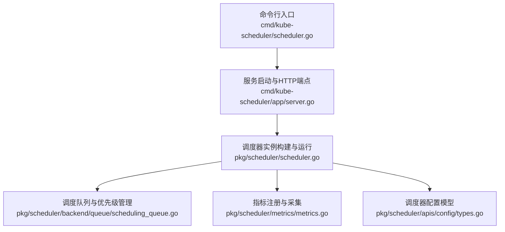
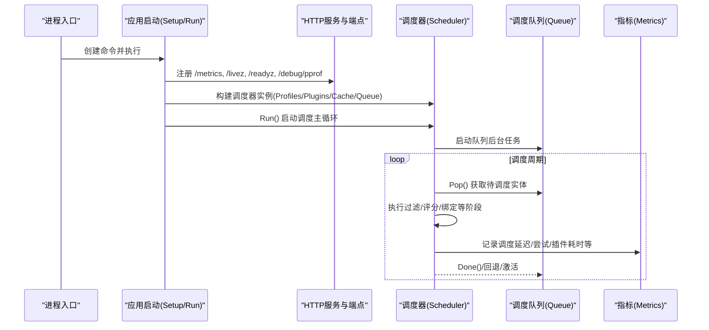
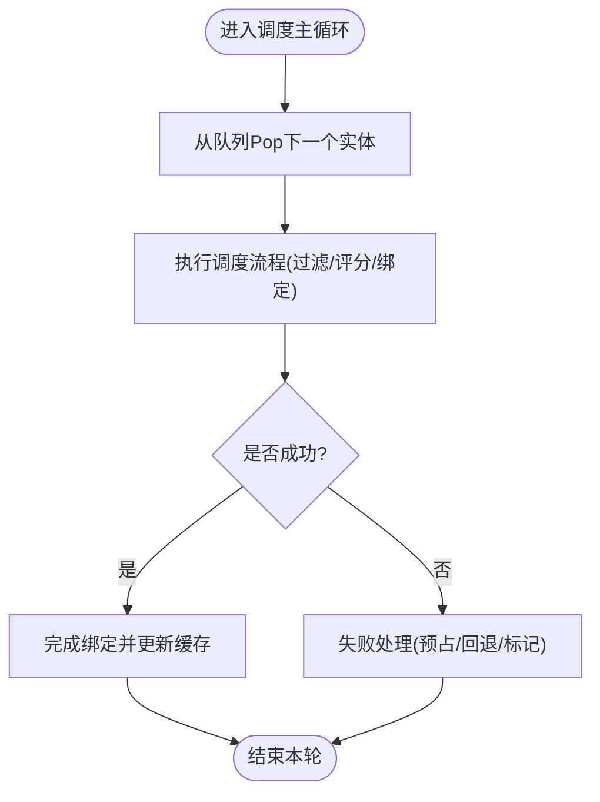
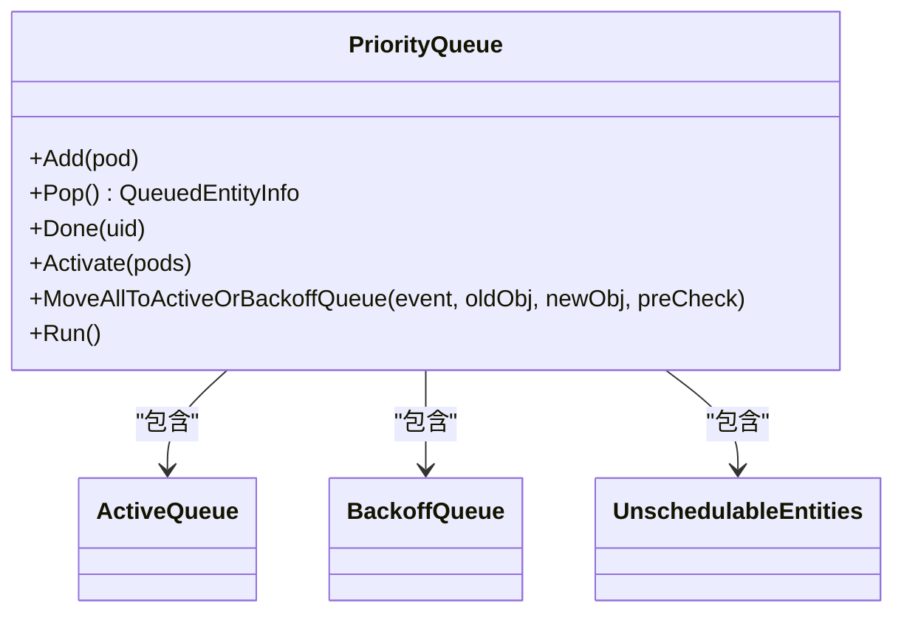
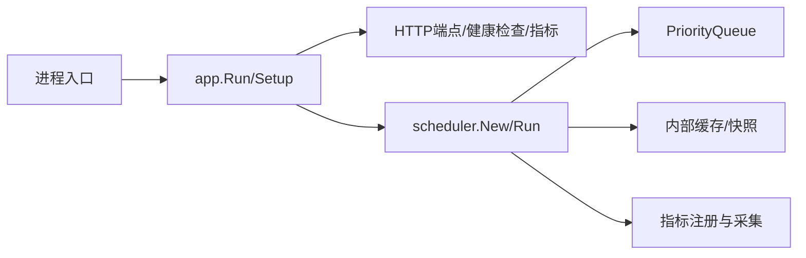

# 性能优化与监控

<cite>
**本文引用的文件**   
- [cmd/kube-scheduler/scheduler.go](file://cmd/kube-scheduler/scheduler.go)
- [cmd/kube-scheduler/app/server.go](file://cmd/kube-scheduler/app/server.go)
- [pkg/scheduler/scheduler.go](file://pkg/scheduler/scheduler.go)
- [pkg/scheduler/apis/config/types.go](file://pkg/scheduler/apis/config/types.go)
- [pkg/scheduler/metrics/metrics.go](file://pkg/scheduler/metrics/metrics.go)
- [pkg/scheduler/backend/queue/scheduling_queue.go](file://pkg/scheduler/backend/queue/scheduling_queue.go)
</cite>

## 目录
1. [引言](#引言)
2. [项目结构](#项目结构)
3. [核心组件](#核心组件)
4. [架构总览](#架构总览)
5. [详细组件分析](#详细组件分析)
6. [依赖关系分析](#依赖关系分析)
7. [性能考量](#性能考量)
8. [故障诊断指南](#故障诊断指南)
9. [结论](#结论)
10. [附录](#附录)

## 引言
本文件面向生产环境的 Kubernetes 调度器性能优化与监控，围绕以下目标展开：
- 建立调度器性能指标体系（调度延迟、吞吐量、资源利用率等）
- 识别性能瓶颈并给出优化策略（队列管理、并行度、缓存与异步调用）
- 提供生产环境调优指南（CPU、内存、I/O）
- 文档化监控告警配置与故障诊断工具使用方法
- 总结大规模集群的优化案例与最佳实践

## 项目结构
kube-scheduler 的核心入口位于 cmd 层，负责启动、配置加载、健康检查与指标暴露；调度主循环与框架在 pkg/scheduler 中实现；队列与缓存位于 backend 子包；指标定义集中在 metrics 包。

图表来源
- [cmd/kube-scheduler/scheduler.go:29-33](file://cmd/kube-scheduler/scheduler.go#L29-L33)
- [cmd/kube-scheduler/app/server.go:142-171](file://cmd/kube-scheduler/app/server.go#L142-L171)
- [pkg/scheduler/scheduler.go:284-478](file://pkg/scheduler/scheduler.go#L284-L478)
- [pkg/scheduler/backend/queue/scheduling_queue.go:176-473](file://pkg/scheduler/backend/queue/scheduling_queue.go#L176-L473)
- [pkg/scheduler/metrics/metrics.go:206-246](file://pkg/scheduler/metrics/metrics.go#L206-L246)
- [pkg/scheduler/apis/config/types.go:36-97](file://pkg/scheduler/apis/config/types.go#L36-L97)

章节来源
- [cmd/kube-scheduler/scheduler.go:29-33](file://cmd/kube-scheduler/scheduler.go#L29-L33)
- [cmd/kube-scheduler/app/server.go:142-171](file://cmd/kube-scheduler/app/server.go#L142-L171)
- [pkg/scheduler/scheduler.go:284-478](file://pkg/scheduler/scheduler.go#L284-L478)
- [pkg/scheduler/apis/config/types.go:36-97](file://pkg/scheduler/apis/config/types.go#L36-L97)

## 核心组件
- 进程入口与命令初始化：创建调度器命令并执行运行流程
- 服务器与端点：注册 /metrics、/livez、/readyz、/debug/pprof 等端点，处理健康检查与指标导出
- 调度器主体：构建 Profiles、插件、缓存、队列、API 分发器等，启动调度主循环
- 调度队列：维护 activeQ/backoffQ/unschedulableEntities，支持 PreEnqueue、QueueingHint、PodGroup 等特性
- 指标系统：注册调度延迟、尝试次数、队列长度、插件耗时、异步 API 调用等指标
- 配置模型：Parallelism、PercentageOfNodesToScore、Backoff 参数、Profiles 与 Extenders 等

章节来源
- [cmd/kube-scheduler/scheduler.go:29-33](file://cmd/kube-scheduler/scheduler.go#L29-L33)
- [cmd/kube-scheduler/app/server.go:365-408](file://cmd/kube-scheduler/app/server.go#L365-L408)
- [pkg/scheduler/scheduler.go:284-478](file://pkg/scheduler/scheduler.go#L284-L478)
- [pkg/scheduler/backend/queue/scheduling_queue.go:176-473](file://pkg/scheduler/backend/queue/scheduling_queue.go#L176-L473)
- [pkg/scheduler/metrics/metrics.go:206-246](file://pkg/scheduler/metrics/metrics.go#L206-L246)
- [pkg/scheduler/apis/config/types.go:36-97](file://pkg/scheduler/apis/config/types.go#L36-L97)

## 架构总览
下图展示了从进程启动到调度主循环的关键路径，以及指标与健康检查的挂载位置。

图表来源
- [cmd/kube-scheduler/scheduler.go:29-33](file://cmd/kube-scheduler/scheduler.go#L29-L33)
- [cmd/kube-scheduler/app/server.go:365-408](file://cmd/kube-scheduler/app/server.go#L365-L408)
- [pkg/scheduler/scheduler.go:534-561](file://pkg/scheduler/scheduler.go#L534-L561)
- [pkg/scheduler/backend/queue/scheduling_queue.go:496-504](file://pkg/scheduler/backend/queue/scheduling_queue.go#L496-L504)
- [pkg/scheduler/metrics/metrics.go:206-246](file://pkg/scheduler/metrics/metrics.go#L206-L246)

## 详细组件分析

### 指标体系与关键指标
- 调度延迟
  - 单次调度尝试延迟（含算法+绑定）：按结果与 profile 维度统计
  - 调度算法延迟：仅算法阶段
  - Pod 端到端 SLI 延迟：从入队到成功调度（可能多次尝试）
- 吞吐与尝试
  - 调度尝试总数：按结果与 profile 维度
  - Pod 成功调度所需尝试次数分布
- 队列与事件
  - 各队列中的 Pod/实体数量（active/backoff/unschedulable/gated/incomplete/pending）
  - 入队计数：按事件与队列类型
  - 未调度原因：按插件与 profile 维度
- 插件与扩展点
  - 各扩展点整体耗时
  - 单个插件在各扩展点的执行耗时
  - QueueingHint 执行耗时
- 预占与批处理
  - 预占受害者数量、尝试次数
  - 批处理尝试与缓存刷新原因
- 异步 API 调用（可选特性）
  - 异步 API 调用总数、耗时、挂起数
- 缓存规模
  - 节点、Pod、Assume 状态大小

章节来源
- [pkg/scheduler/metrics/metrics.go:248-654](file://pkg/scheduler/metrics/metrics.go#L248-L654)

### 调度主循环与并行度
- 主循环通过独立 goroutine 持续从队列 Pop 实体并执行调度
- 并行度由配置项控制，影响框架内并行执行能力
- 百分比评分阈值可限制参与评分的节点比例，降低大集群开销

图表来源
- [pkg/scheduler/scheduler.go:534-561](file://pkg/scheduler/scheduler.go#L534-L561)
- [pkg/scheduler/apis/config/types.go:48-70](file://pkg/scheduler/apis/config/types.go#L48-L70)

章节来源
- [pkg/scheduler/scheduler.go:534-561](file://pkg/scheduler/scheduler.go#L534-L561)
- [pkg/scheduler/apis/config/types.go:48-70](file://pkg/scheduler/apis/config/types.go#L48-L70)

### 队列管理与优化
- 队列结构
  - activeQ：当前考虑调度的实体
  - backoffQ：因失败而退避，到期后回到 activeQ
  - unschedulableEntities：已尝试且暂不可调度的实体集合
- 关键机制
  - PreEnqueue：入队前快速筛选，减少无效调度
  - QueueingHint：根据事件与插件反馈决定立即入队或退避入队
  - PodGroup 支持：工作负载级调度与成员一致性维护
- 可调参数
  - 初始退避时间、最大退避时间、在 unschedulable 的最大停留时长
  - 是否允许直接从 backoffQ 弹出（受特性门控影响）

图表来源
- [pkg/scheduler/backend/queue/scheduling_queue.go:176-473](file://pkg/scheduler/backend/queue/scheduling_queue.go#L176-L473)
- [pkg/scheduler/backend/queue/scheduling_queue.go:496-504](file://pkg/scheduler/backend/queue/scheduling_queue.go#L496-L504)

章节来源
- [pkg/scheduler/backend/queue/scheduling_queue.go:176-473](file://pkg/scheduler/backend/queue/scheduling_queue.go#L176-L473)
- [pkg/scheduler/backend/queue/scheduling_queue.go:496-504](file://pkg/scheduler/backend/queue/scheduling_queue.go#L496-L504)

### 缓存与异步 API 调用
- 缓存快照用于读取节点/Pod 信息，避免频繁访问 APIServer
- 当启用异步 API 调用时，使用 APIDispatcher 将写操作异步化，降低调度主路径阻塞
- 相关指标包括异步调用总数、耗时与挂起量

章节来源
- [pkg/scheduler/scheduler.go:360-366](file://pkg/scheduler/scheduler.go#L360-L366)
- [pkg/scheduler/metrics/metrics.go:476-503](file://pkg/scheduler/metrics/metrics.go#L476-L503)

### 配置项与性能相关参数
- Parallelism：调度算法并行度
- PercentageOfNodesToScore：评分节点比例（全局或按 Profile 覆盖）
- PodInitialBackoffSeconds / PodMaxBackoffSeconds：退避时间范围
- PodMaxInUnschedulablePodsDuration：在 unschedulable 的最大停留时间
- Profiles：多调度器配置，可分别设置插件与参数
- Extenders：外部扩展器（注意网络与超时对性能的影响）

章节来源
- [pkg/scheduler/apis/config/types.go:36-97](file://pkg/scheduler/apis/config/types.go#L36-L97)
- [pkg/scheduler/apis/config/types.go:99-131](file://pkg/scheduler/apis/config/types.go#L99-L131)
- [pkg/scheduler/scheduler.go:192-236](file://pkg/scheduler/scheduler.go#L192-L236)

## 依赖关系分析
- 入口与启动
  - 进程入口调用 app.NewSchedulerCommand 并执行
  - app.Run 负责 Setup 与 Run，注册 HTTP 端点、健康检查、指标与 profiling
- 调度器构建
  - 构建 Profiles、插件、缓存、队列、API 分发器
  - 注入 MetricsRecorder、等待 Pod 映射、PreBind 映射等
- 队列与事件
  - 队列启动后台任务，定期清理与迁移
  - 事件驱动入队与重入队，结合 QueueingHint 与 PreEnqueue

图表来源
- [cmd/kube-scheduler/scheduler.go:29-33](file://cmd/kube-scheduler/scheduler.go#L29-L33)
- [cmd/kube-scheduler/app/server.go:142-171](file://cmd/kube-scheduler/app/server.go#L142-L171)
- [pkg/scheduler/scheduler.go:284-478](file://pkg/scheduler/scheduler.go#L284-L478)
- [pkg/scheduler/backend/queue/scheduling_queue.go:176-473](file://pkg/scheduler/backend/queue/scheduling_queue.go#L176-L473)
- [pkg/scheduler/metrics/metrics.go:206-246](file://pkg/scheduler/metrics/metrics.go#L206-L246)

章节来源
- [cmd/kube-scheduler/app/server.go:365-408](file://cmd/kube-scheduler/app/server.go#L365-L408)
- [pkg/scheduler/scheduler.go:284-478](file://pkg/scheduler/scheduler.go#L284-L478)

## 性能考量
- 调度延迟与吞吐
  - 关注 scheduling_attempt_duration_seconds、scheduling_algorithm_duration_seconds、pod_scheduling_sli_duration_seconds
  - 通过 parallelism 提升并发，但需评估 CPU 与锁竞争
  - 调整 percentageOfNodesToScore 以平衡候选集大小与质量
- 队列与事件
  - 监控 pending_pods、queued_entities、inflight_events
  - 合理设置退避时间与 unschedulable 停留上限，避免抖动与饥饿
  - 利用 QueueingHint 精准重入队，减少无效调度
- 缓存与 I/O
  - 使用缓存快照减少 APIServer 压力
  - 开启异步 API 调用可降低主路径阻塞，观察 pending_async_api_calls 与 async_api_call_execution_duration_seconds
- 插件与扩展点
  - 关注 framework_extension_point_duration_seconds 与 plugin_execution_duration_seconds，定位慢插件
  - 谨慎启用外部扩展器，注意网络超时与权重
- 资源使用
  - 监控 goroutines 数量与操作分布，避免过多协程导致上下文切换
  - 结合 profiling 与 pprof 分析 CPU/内存热点

章节来源
- [pkg/scheduler/metrics/metrics.go:248-654](file://pkg/scheduler/metrics/metrics.go#L248-L654)
- [pkg/scheduler/scheduler.go:534-561](file://pkg/scheduler/scheduler.go#L534-L561)
- [pkg/scheduler/backend/queue/scheduling_queue.go:496-504](file://pkg/scheduler/backend/queue/scheduling_queue.go#L496-L504)

## 故障诊断指南
- 健康检查
  - /livez：进程存活
  - /readyz：就绪状态（含 handler 同步、leader 选举等）
  - 自定义检查：如 sched-handler-sync
- 指标与日志
  - /metrics：Prometheus 指标抓取
  - /debug/pprof：CPU/内存/阻塞等剖析（需启用 EnableProfiling）
  - configz：查看运行时配置
- 常见问题定位
  - 高延迟：查看 scheduling_attempt_duration_seconds 分位值，结合 plugin_execution_duration_seconds 定位慢插件
  - 吞吐低：检查 parallelism、percentageOfNodesToScore、goroutines 分布
  - 队列积压：观察 pending_pods、queued_entities、inflight_events，结合 QueueingHint 与 PreEnqueue 行为
  - 异步 API 堆积：关注 pending_async_api_calls 与 async_api_call_execution_duration_seconds

章节来源
- [cmd/kube-scheduler/app/server.go:365-408](file://cmd/kube-scheduler/app/server.go#L365-L408)
- [pkg/scheduler/metrics/metrics.go:248-654](file://pkg/scheduler/metrics/metrics.go#L248-L654)

## 结论
通过完善的指标体系与合理的参数调优，可在大规模集群中显著提升调度器的延迟与吞吐表现。建议在生产环境中：
- 基于指标持续观测与告警，聚焦延迟尾部和队列积压
- 逐步调整并行度与评分比例，结合插件耗时进行针对性优化
- 启用异步 API 调用与合适的 QueueingHint/PreEnqueue 策略，减少无效调度
- 利用 profiling 与 pprof 深入定位热点，配合健康检查保障稳定性

## 附录
- 监控告警建议
  - 调度延迟 P95/P99 超过阈值
  - 队列积压持续增长
  - 插件执行耗时异常升高
  - 异步 API 调用挂起数上升
- 生产调优清单
  - 确认 parallelism 与机器核数匹配
  - 合理设置 percentageOfNodesToScore
  - 调整退避与 unschedulable 停留上限
  - 按需启用异步 API 调用与 profiling
  - 审查外部扩展器配置与超时