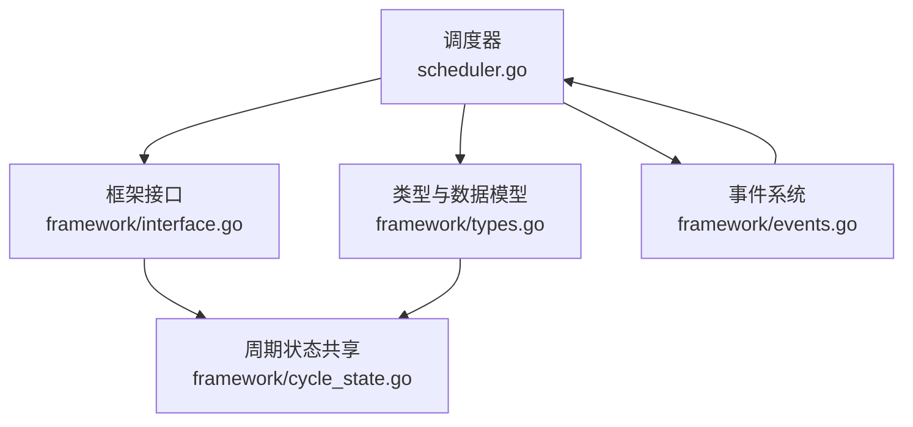
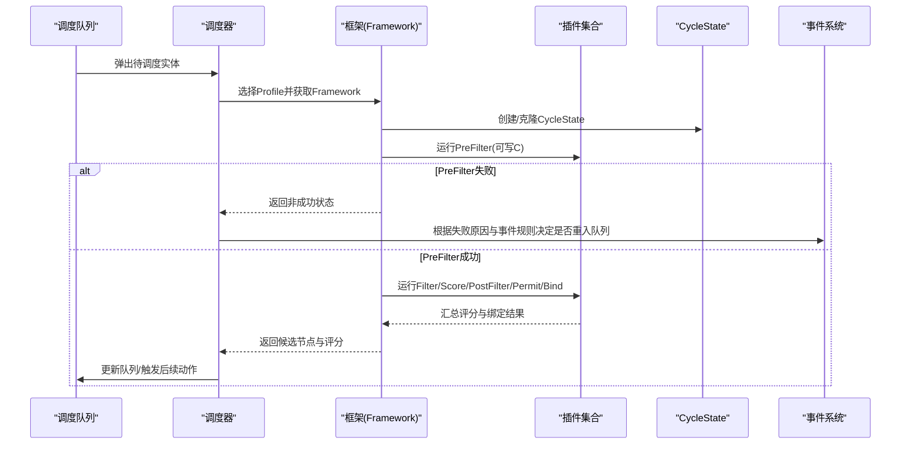
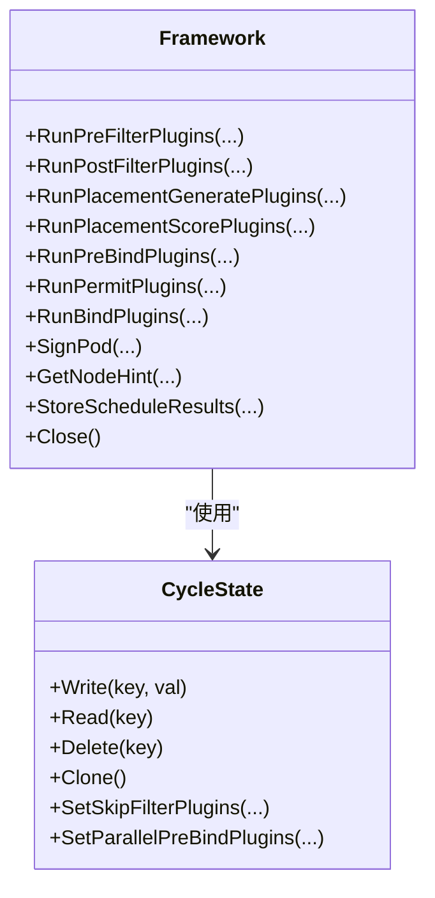
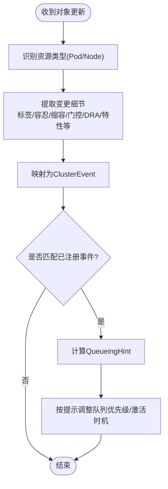
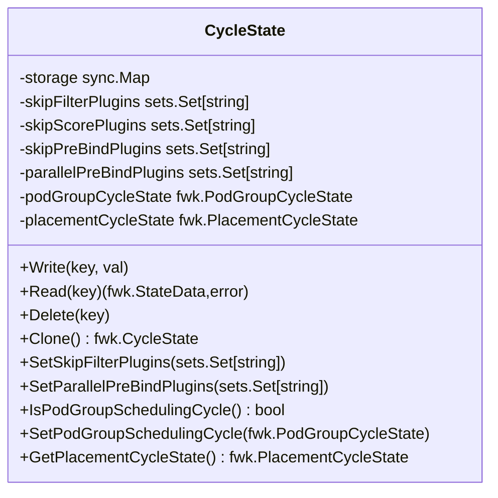
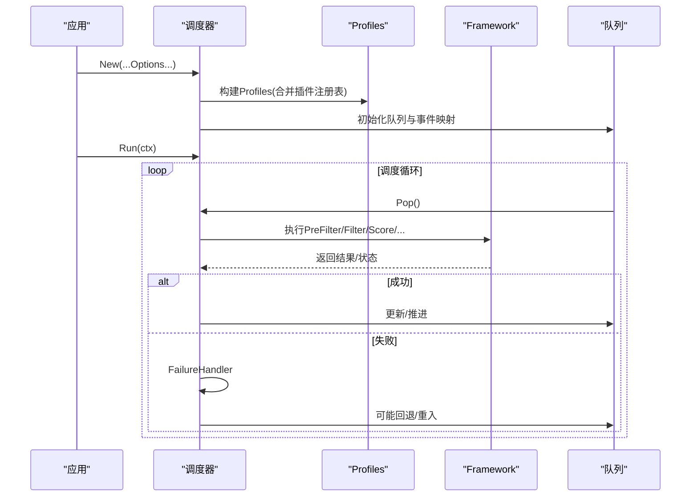
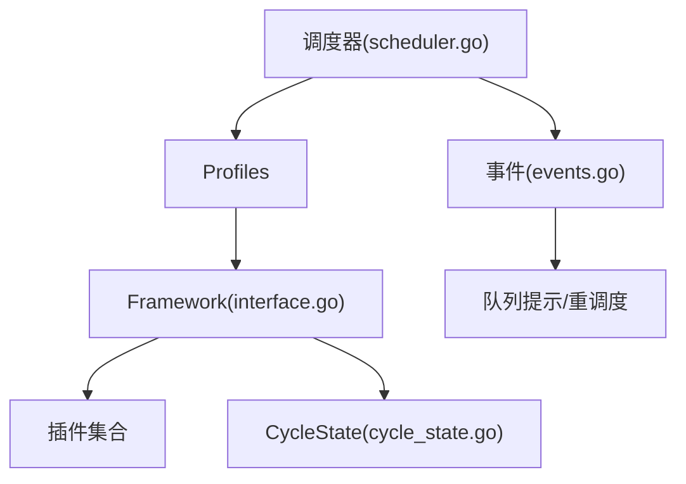

# 插件架构与扩展

<cite>
**本文引用的文件**   
- [scheduler.go](file://pkg/scheduler/scheduler.go)
- [interface.go](file://pkg/scheduler/framework/interface.go)
- [types.go](file://pkg/scheduler/framework/types.go)
- [events.go](file://pkg/scheduler/framework/events.go)
- [cycle_state.go](file://pkg/scheduler/framework/cycle_state.go)
</cite>

## 目录
1. [简介](#简介)
2. [项目结构](#项目结构)
3. [核心组件](#核心组件)
4. [架构总览](#架构总览)
5. [详细组件分析](#详细组件分析)
6. [依赖关系分析](#依赖关系分析)
7. [性能考量](#性能考量)
8. [故障排查指南](#故障排查指南)
9. [结论](#结论)
10. [附录](#附录)

## 简介
本文件面向Kubernetes调度器插件系统的开发者与维护者，系统性阐述调度框架的插件架构、生命周期管理、事件处理机制与状态共享方式。文档聚焦以下目标：
- 解释调度框架的插件接口与扩展点（PreFilter/Filter/Score/PostFilter/Permit/Bind等）
- 梳理调度主流程中插件的编排与执行顺序
- 解析事件系统如何驱动Pod重调度与队列提示
- 说明CycleState跨阶段状态共享机制
- 提供自定义插件开发指南（接口实现、注册、配置与测试思路）
- 给出最佳实践与性能优化建议

## 项目结构
围绕调度器与框架的关键代码位置如下：
- 调度器入口与生命周期：pkg/scheduler/scheduler.go
- 插件框架接口定义：pkg/scheduler/framework/interface.go
- 类型与数据结构（NodeInfo、QueuedEntityInfo、QueueingParams等）：pkg/scheduler/framework/types.go
- 事件系统与事件匹配：pkg/scheduler/framework/events.go
- 周期状态共享（CycleState）：pkg/scheduler/framework/cycle_state.go

图表来源
- [scheduler.go:284-478](file://pkg/scheduler/scheduler.go#L284-L478)
- [interface.go:191-327](file://pkg/scheduler/framework/interface.go#L191-L327)
- [types.go:172-540](file://pkg/scheduler/framework/types.go#L172-L540)
- [events.go:68-104](file://pkg/scheduler/framework/events.go#L68-L104)
- [cycle_state.go:26-185](file://pkg/scheduler/framework/cycle_state.go#L26-L185)

章节来源
- [scheduler.go:284-478](file://pkg/scheduler/scheduler.go#L284-L478)
- [interface.go:191-327](file://pkg/scheduler/framework/interface.go#L191-L327)
- [types.go:172-540](file://pkg/scheduler/framework/types.go#L172-L540)
- [events.go:68-104](file://pkg/scheduler/framework/events.go#L68-L104)
- [cycle_state.go:26-185](file://pkg/scheduler/framework/cycle_state.go#L26-L185)

## 核心组件
- 调度器（Scheduler）
  - 负责构建Profiles、注册插件、初始化队列与缓存、启动调度循环、关闭资源清理
  - 通过Option模式注入外部插件注册表、并行度、回退策略、Extenders等
- 框架接口（Framework）
  - 暴露各扩展点运行方法：RunPreFilterPlugins、RunPostFilterPlugins、RunPlacementGeneratePlugins、RunPlacementScorePlugins、RunPreBindPlugins、RunPermitPlugins、RunBindPlugins等
  - 提供队列排序、签名生成、节点提示、结果存储等能力
- 类型与数据模型
  - NodeInfo：节点聚合视图（资源、端口、镜像、PVC引用计数、DRA声明等）
  - QueuedEntityInfo/QueuedPodInfo：调度队列实体抽象与Pod包装
  - QueueingParams：队列参数（尝试次数、退避、超时、拒绝插件记录等）
- 事件系统
  - Pod/Node变更到ClusterEvent的映射，支持细粒度事件（标签、容忍、缩容、调度门控、DRA状态等）
  - 事件匹配规则与通配语义，用于决定哪些Pod需要被重新调度
- 周期状态（CycleState）
  - 线程安全的“写一次、读多次”状态容器，支持跳过某些插件、并行PreBind、PodGroup/Placement上下文

章节来源
- [scheduler.go:284-478](file://pkg/scheduler/scheduler.go#L284-L478)
- [interface.go:191-327](file://pkg/scheduler/framework/interface.go#L191-L327)
- [types.go:172-540](file://pkg/scheduler/framework/types.go#L172-L540)
- [events.go:68-104](file://pkg/scheduler/framework/events.go#L68-L104)
- [cycle_state.go:26-185](file://pkg/scheduler/framework/cycle_state.go#L26-L185)

## 架构总览
下图展示调度主流程与插件扩展点的调用序列，以及关键状态与事件的交互。

图表来源
- [scheduler.go:284-478](file://pkg/scheduler/scheduler.go#L284-L478)
- [interface.go:212-288](file://pkg/scheduler/framework/interface.go#L212-L288)
- [cycle_state.go:136-185](file://pkg/scheduler/framework/cycle_state.go#L136-L185)
- [events.go:68-104](file://pkg/scheduler/framework/events.go#L68-L104)

## 详细组件分析

### 插件接口与生命周期
- 扩展点概览
  - PreFilter：前置过滤，可计算并写入CycleState，减少后续重复计算
  - Filter：基于预计算结果进行可行性判断
  - Score：对可行节点打分
  - PostFilter：在过滤后尝试改变集群状态以促成未来可调度
  - Permit：允许延迟绑定或等待条件满足
  - Bind：完成实际绑定操作
- 相关能力
  - 队列排序函数、Pod签名、节点提示、结果缓存
  - 支持PodGroup与Placement的生成与评分（通用工作负载）

图表来源
- [interface.go:191-327](file://pkg/scheduler/framework/interface.go#L191-L327)
- [cycle_state.go:26-185](file://pkg/scheduler/framework/cycle_state.go#L26-L185)

章节来源
- [interface.go:191-327](file://pkg/scheduler/framework/interface.go#L191-L327)
- [cycle_state.go:26-185](file://pkg/scheduler/framework/cycle_state.go#L26-L185)

### 事件处理机制与重调度
- 事件分类
  - Pod侧：AssignedPod/UnscheduledPod/TargetPod及其Update子事件（标签、容忍、缩容、调度门控消除、DRA状态变化）
  - Node侧：Allocatable、Label、Taint、Condition、Annotation、DeclaredFeatures等
- 事件匹配
  - 支持通配符与更具体ActionType的匹配规则
  - 将Pod事件展开为三类资源事件，便于精准匹配
- 队列提示
  - 插件可通过EnqueueExtensions注册感兴趣的事件及QueueingHint函数，指导调度队列何时将Pod从unschedulable/backoff队列激活

图表来源
- [events.go:68-104](file://pkg/scheduler/framework/events.go#L68-L104)
- [events.go:170-191](file://pkg/scheduler/framework/events.go#L170-L191)
- [scheduler.go:486-531](file://pkg/scheduler/scheduler.go#L486-L531)

章节来源
- [events.go:68-104](file://pkg/scheduler/framework/events.go#L68-L104)
- [events.go:170-191](file://pkg/scheduler/framework/events.go#L170-L191)
- [scheduler.go:486-531](file://pkg/scheduler/scheduler.go#L486-L531)

### 状态共享（CycleState）
- 设计要点
  - 基于sync.Map的线程安全存储，适合“写一次、读多次”的插件协作模式
  - 支持在PreFilter/PreScore阶段写入，在Filter/Score阶段读取，避免重复计算
  - 支持跳过特定插件、并行PreBind、PodGroup/Placement上下文传递
- 典型用法
  - 在PreFilter中计算亲和/反亲和、拓扑分布、资源需求摘要等，供后续阶段复用

图表来源
- [cycle_state.go:26-185](file://pkg/scheduler/framework/cycle_state.go#L26-L185)

章节来源
- [cycle_state.go:26-185](file://pkg/scheduler/framework/cycle_state.go#L26-L185)

### 调度主流程与插件编排
- 初始化
  - 合并内置与外部插件注册表
  - 构建Profiles，设置并行度、指标采集、等待Pod、PreBind状态、API分发器等
  - 建立调度队列、事件处理器、调试器
- 运行
  - 启动队列与可选的异步API分发器
  - 调度循环从队列取实体，调用Framework执行各阶段插件
  - 失败路径由FailureHandler处理，必要时触发重调度

图表来源
- [scheduler.go:284-478](file://pkg/scheduler/scheduler.go#L284-L478)
- [scheduler.go:534-561](file://pkg/scheduler/scheduler.go#L534-L561)

章节来源
- [scheduler.go:284-478](file://pkg/scheduler/scheduler.go#L284-L478)
- [scheduler.go:534-561](file://pkg/scheduler/scheduler.go#L534-L561)

### 预定义插件实现原理（概念性说明）
说明：本节为概念性概述，不直接分析具体源码文件。
- NodeAffinity
  - 依据节点的标签、亲和/反亲和规则进行过滤与打分
  - 通常结合NodeInfo中的标签与亲和信息，在Filter阶段快速判定
- PodTopologySpread
  - 基于拓扑域（如节点池、可用区）评估分布均匀性
  - 在Score阶段计算偏差分数，影响最终节点选择
- ResourceAllocated（动态资源分配相关）
  - 结合DRA资源声明与切片状态，校验节点级资源可用性
  - 在PreFilter/Filter阶段利用CycleState缓存的资源摘要加速判断

[本节为概念性内容，无需“章节来源”]

### 自定义插件开发指南
- 插件接口定义
  - 实现Framework暴露的各扩展点方法（PreFilter/Filter/Score/PostFilter/Permit/Bind）
  - 如需参与队列提示，实现EnqueueExtensions并注册EventsToRegister与QueueingHintFn
- 注册机制
  - 通过外部注册表（OutOfTree Registry）与内置注册表合并，使新插件在运行时可见
  - 在Profile配置中启用对应插件，并可传入PluginConfig
- 配置格式与阶段绑定
  - 在KubeSchedulerConfiguration中为插件指定名称、参数与启用阶段
  - 通过PercentageOfNodesToScore控制评估节点规模
- 测试方法
  - 使用单元测试框架构造最小化Node/Pod与CycleState，验证各阶段行为
  - 借助事件系统模拟对象变更，验证重调度与队列提示逻辑

章节来源
- [scheduler.go:309-312](file://pkg/scheduler/scheduler.go#L309-L312)
- [scheduler.go:367-387](file://pkg/scheduler/scheduler.go#L367-L387)
- [interface.go:191-327](file://pkg/scheduler/framework/interface.go#L191-L327)

## 依赖关系分析
- 组件耦合
  - 调度器依赖Profiles与Framework；Framework协调插件与CycleState
  - 事件系统驱动队列提示，间接影响调度循环的重入频率
- 外部依赖
  - Informer工厂、动态资源分配Tracker、CSI管理器、API分发器等
- 潜在循环依赖
  - 插件应仅依赖框架提供的只读视图与CycleState，避免反向依赖调度器内部实现

图表来源
- [scheduler.go:284-478](file://pkg/scheduler/scheduler.go#L284-L478)
- [interface.go:191-327](file://pkg/scheduler/framework/interface.go#L191-L327)
- [events.go:68-104](file://pkg/scheduler/framework/events.go#L68-L104)
- [cycle_state.go:26-185](file://pkg/scheduler/framework/cycle_state.go#L26-L185)

章节来源
- [scheduler.go:284-478](file://pkg/scheduler/scheduler.go#L284-L478)
- [interface.go:191-327](file://pkg/scheduler/framework/interface.go#L191-L327)
- [events.go:68-104](file://pkg/scheduler/framework/events.go#L68-L104)
- [cycle_state.go:26-185](file://pkg/scheduler/framework/cycle_state.go#L26-L185)

## 性能考量
- 合理使用CycleState
  - 在PreFilter/PreScore阶段做昂贵计算并缓存，避免在Filter/Score中重复计算
- 控制评估节点规模
  - 通过PercentageOfNodesToScore限制参与评分的节点数量，降低CPU开销
- 并行化
  - 利用并行PreBind与框架并行度配置，提升吞吐
- 事件精准匹配
  - 精确注册事件与QueueingHint，减少不必要的重调度
- 内存与拷贝
  - 谨慎深拷贝大对象，优先使用快照与增量更新

[本节为通用指导，无需“章节来源”]

## 故障排查指南
- 常见问题定位
  - 插件返回非成功状态：检查PreFilter/Filter/Permit阶段的Status与错误码
  - 频繁重调度：核对事件注册与匹配规则，确认QueueingHint是否合理
  - 绑定失败：关注PreBind/Bind阶段的状态与外部依赖（如CSI、DRA）
- 诊断手段
  - 启用指标采集（插件执行耗时），观察热点插件
  - 使用调试器与日志输出，追踪CycleState读写与跳过插件标记
  - 检查队列参数（退避、超时、拒绝插件记录）辅助定位根因

章节来源
- [scheduler.go:629-643](file://pkg/scheduler/scheduler.go#L629-L643)
- [cycle_state.go:76-106](file://pkg/scheduler/framework/cycle_state.go#L76-L106)
- [events.go:31-66](file://pkg/scheduler/framework/events.go#L31-L66)

## 结论
Kubernetes调度器插件体系以清晰的扩展点、强大的事件系统与高效的CycleState状态共享为核心，支撑了高度可扩展的调度策略。通过合理的插件设计与配置，可在保证性能的同时实现复杂的调度需求。建议在开发中遵循“写一次、读多次”的状态共享范式，精准注册事件，严格控制评估范围，并结合指标与日志持续优化。

## 附录
- 术语
  - Profile：一组插件与参数的集合，代表一种调度策略
  - Extender：HTTP扩展器，用于外部调度决策
  - DRA：动态资源分配，支持设备与可消费资源的精细化调度
- 参考路径
  - 插件接口定义：pkg/scheduler/framework/interface.go
  - 类型与数据模型：pkg/scheduler/framework/types.go
  - 事件系统：pkg/scheduler/framework/events.go
  - 周期状态：pkg/scheduler/framework/cycle_state.go
  - 调度器主流程：pkg/scheduler/scheduler.go