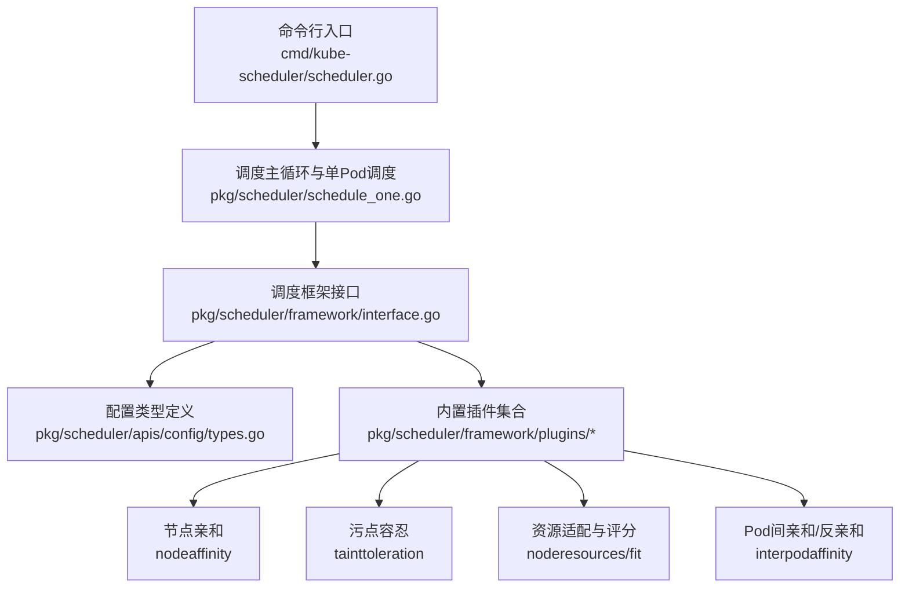
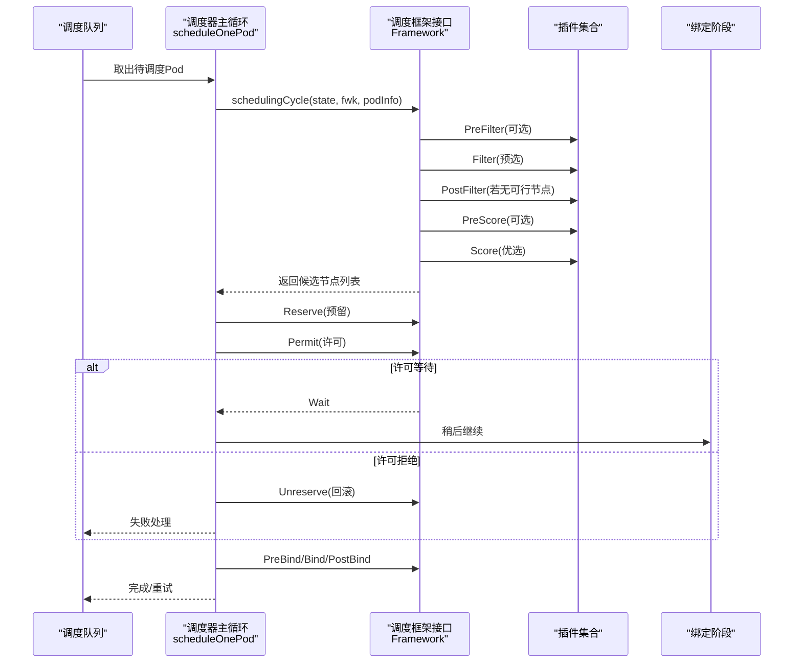
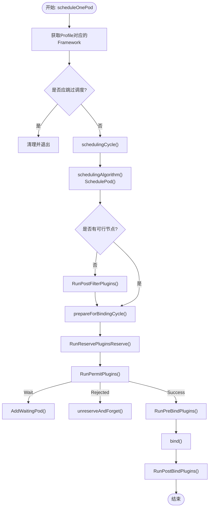
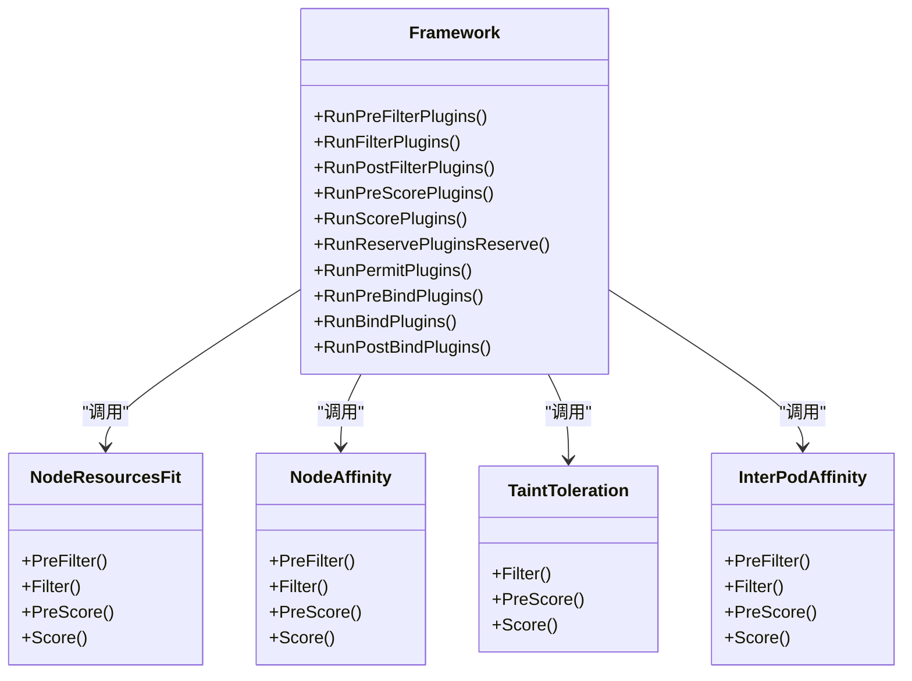
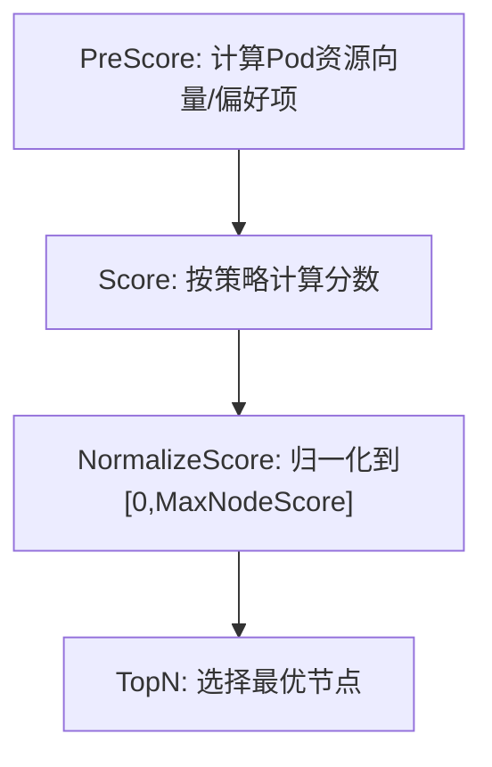
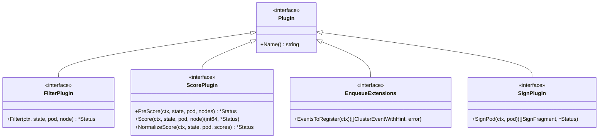
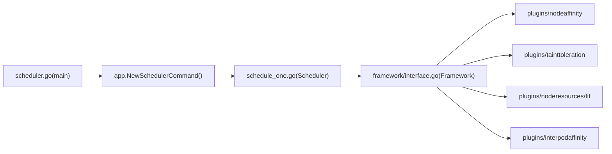

# 调度器原理

<cite>
**本文引用的文件**   
- [cmd/kube-scheduler/scheduler.go](file://cmd/kube-scheduler/scheduler.go)
- [pkg/scheduler/apis/config/types.go](file://pkg/scheduler/apis/config/types.go)
- [pkg/scheduler/framework/interface.go](file://pkg/scheduler/framework/interface.go)
- [pkg/scheduler/schedule_one.go](file://pkg/scheduler/schedule_one.go)
- [pkg/scheduler/framework/plugins/nodeaffinity/node_affinity.go](file://pkg/scheduler/framework/plugins/nodeaffinity/node_affinity.go)
- [pkg/scheduler/framework/plugins/tainttoleration/taint_toleration.go](file://pkg/scheduler/framework/plugins/tainttoleration/taint_toleration.go)
- [pkg/scheduler/framework/plugins/noderesources/fit.go](file://pkg/scheduler/framework/plugins/noderesources/fit.go)
- [pkg/scheduler/framework/plugins/interpodaffinity/plugin.go](file://pkg/scheduler/framework/plugins/interpodaffinity/plugin.go)
</cite>

## 目录
1. [简介](#简介)
2. [项目结构](#项目结构)
3. [核心组件](#核心组件)
4. [架构总览](#架构总览)
5. [详细组件分析](#详细组件分析)
6. [依赖关系分析](#依赖关系分析)
7. [性能与延迟优化](#性能与延迟优化)
8. [故障排查指南](#故障排查指南)
9. [结论](#结论)
10. [附录：配置与示例](#附录配置与示例)

## 简介
本文件面向 Kubernetes 调度器的深入技术文档，聚焦以下主题：
- 预选（Predicates）与优选（Priorities）的算法流程与实现要点
- 调度框架插件架构、预定义插件的实现原理与自定义插件开发方法
- 配置文件格式、调度策略选择与资源分配算法
- 多集群调度、亲和性/反亲和性、拓扑感知调度的配置思路与示例
- 性能调优、调度延迟分析与故障排查

## 项目结构
Kubernetes 调度器入口位于命令程序，内部通过应用层初始化调度器并运行。核心调度逻辑集中在 pkg/scheduler 下，包含调度主循环、队列管理、缓存快照、框架接口与大量内置插件。

图表来源
- [cmd/kube-scheduler/scheduler.go:29-33](file://cmd/kube-scheduler/scheduler.go#L29-L33)
- [pkg/scheduler/schedule_one.go:66-89](file://pkg/scheduler/schedule_one.go#L66-L89)
- [pkg/scheduler/framework/interface.go:191-327](file://pkg/scheduler/framework/interface.go#L191-L327)
- [pkg/scheduler/apis/config/types.go:36-97](file://pkg/scheduler/apis/config/types.go#L36-L97)

章节来源
- [cmd/kube-scheduler/scheduler.go:29-33](file://cmd/kube-scheduler/scheduler.go#L29-L33)
- [pkg/scheduler/schedule_one.go:66-89](file://pkg/scheduler/schedule_one.go#L66-L89)
- [pkg/scheduler/framework/interface.go:191-327](file://pkg/scheduler/framework/interface.go#L191-L327)
- [pkg/scheduler/apis/config/types.go:36-97](file://pkg/scheduler/apis/config/types.go#L36-L97)

## 核心组件
- 调度主循环与单实体调度
  - 从调度队列取实体（Pod 或 PodGroup），分派到对应处理路径；对单个 Pod 执行“调度周期”和“绑定周期”。
- 调度框架接口
  - 提供扩展点调用能力：PreFilter/Filter/PostFilter/PreScore/Score/Reserve/Permit/PreBind/Bind/PostBind 等，以及 Pod 签名、结果缓存、等待许可等机制。
- 配置模型
  - KubeSchedulerConfiguration 描述全局并行度、LeaderElection、客户端连接、调试、百分比打分、退避参数、Profiles、Extenders 等。
  - KubeSchedulerProfile 描述每个调度器实例的插件集、插件参数、打分比例等。
  - Plugins/PluginSet/Plugin/PluginConfig 描述各扩展点的启用/禁用与参数注入。

章节来源
- [pkg/scheduler/schedule_one.go:92-141](file://pkg/scheduler/schedule_one.go#L92-L141)
- [pkg/scheduler/framework/interface.go:191-327](file://pkg/scheduler/framework/interface.go#L191-L327)
- [pkg/scheduler/apis/config/types.go:36-97](file://pkg/scheduler/apis/config/types.go#L36-L97)
- [pkg/scheduler/apis/config/types.go:99-131](file://pkg/scheduler/apis/config/types.go#L99-L131)
- [pkg/scheduler/apis/config/types.go:133-218](file://pkg/scheduler/apis/config/types.go#L133-L218)

## 架构总览
调度器整体由“入口 -> 调度主循环 -> 调度算法（过滤+优选）-> 预留/许可/绑定 -> 后置处理”构成，并通过框架接口编排插件。

图表来源
- [pkg/scheduler/schedule_one.go:167-311](file://pkg/scheduler/schedule_one.go#L167-L311)
- [pkg/scheduler/framework/interface.go:191-327](file://pkg/scheduler/framework/interface.go#L191-L327)

## 详细组件分析

### 调度主流程与算法控制流
- 单Pod调度入口
  - scheduleOnePod 负责获取框架、跳过无效Pod、创建周期状态、采样指标、进入调度周期与绑定周期。
- 调度周期
  - schedulingAlgorithm 调用 SchedulePod 进行“过滤+优选”，若不可调度且存在 PostFilter 插件则尝试抢占/重排。
- 绑定周期
  - runBindingCycle 执行 PreBindPreFlight、WaitOnPermit、PreBind、Bind、PostBind，并在错误时清理预留状态与事件。

图表来源
- [pkg/scheduler/schedule_one.go:92-141](file://pkg/scheduler/schedule_one.go#L92-L141)
- [pkg/scheduler/schedule_one.go:167-311](file://pkg/scheduler/schedule_one.go#L167-L311)
- [pkg/scheduler/schedule_one.go:397-504](file://pkg/scheduler/schedule_one.go#L397-L504)

章节来源
- [pkg/scheduler/schedule_one.go:92-141](file://pkg/scheduler/schedule_one.go#L92-L141)
- [pkg/scheduler/schedule_one.go:167-311](file://pkg/scheduler/schedule_one.go#L167-L311)
- [pkg/scheduler/schedule_one.go:397-504](file://pkg/scheduler/schedule_one.go#L397-L504)

### 预选阶段（Filter）与关键插件
- 节点资源适配（NodeResourcesFit）
  - 计算 Pod 资源请求（含 InitContainers 最大值与常规容器求和，支持 Overhead、DRA 扩展资源、PodLevel 资源等）。
  - Filter 检查 CPU/Memory/EphemeralStorage/标量资源/最大Pod数是否满足；可忽略特定资源或资源组。
  - 支持 DRA 设备类映射与 CEL 缓存，提升性能。
- 节点亲和（NodeAffinity）
  - PreFilter 解析 RequiredDuringSchedulingIgnoredDuringExecution，必要时缩小候选节点集合。
  - Filter 校验 NodeSelector 与强制亲和；Score 累加 Preferred 匹配权重并归一化。
- 污点容忍（TaintToleration）
  - Filter 判断是否存在未容忍的 Taint；PreScore 收集 PreferNoSchedule 容忍项，Score 统计不兼容数量并归一化。
- Pod 间亲和/反亲和（InterPodAffinity）
  - 基于已调度 Pod 标签与拓扑键进行可行性与评分；注册相关事件以触发重入队提示。

图表来源
- [pkg/scheduler/framework/interface.go:191-327](file://pkg/scheduler/framework/interface.go#L191-L327)
- [pkg/scheduler/framework/plugins/noderesources/fit.go:329-354](file://pkg/scheduler/framework/plugins/noderesources/fit.go#L329-L354)
- [pkg/scheduler/framework/plugins/noderesources/fit.go:590-626](file://pkg/scheduler/framework/plugins/noderesources/fit.go#L590-L626)
- [pkg/scheduler/framework/plugins/nodeaffinity/node_affinity.go:147-197](file://pkg/scheduler/framework/plugins/nodeaffinity/node_affinity.go#L147-L197)
- [pkg/scheduler/framework/plugins/nodeaffinity/node_affinity.go:205-228](file://pkg/scheduler/framework/plugins/nodeaffinity/node_affinity.go#L205-L228)
- [pkg/scheduler/framework/plugins/tainttoleration/taint_toleration.go:101-115](file://pkg/scheduler/framework/plugins/tainttoleration/taint_toleration.go#L101-L115)
- [pkg/scheduler/framework/plugins/interpodaffinity/plugin.go:97-117](file://pkg/scheduler/framework/plugins/interpodaffinity/plugin.go#L97-117)

章节来源
- [pkg/scheduler/framework/plugins/noderesources/fit.go:329-354](file://pkg/scheduler/framework/plugins/noderesources/fit.go#L329-L354)
- [pkg/scheduler/framework/plugins/noderesources/fit.go:590-626](file://pkg/scheduler/framework/plugins/noderesources/fit.go#L590-L626)
- [pkg/scheduler/framework/plugins/nodeaffinity/node_affinity.go:147-197](file://pkg/scheduler/framework/plugins/nodeaffinity/node_affinity.go#L147-L197)
- [pkg/scheduler/framework/plugins/nodeaffinity/node_affinity.go:205-228](file://pkg/scheduler/framework/plugins/nodeaffinity/node_affinity.go#L205-L228)
- [pkg/scheduler/framework/plugins/tainttoleration/taint_toleration.go:101-115](file://pkg/scheduler/framework/plugins/tainttoleration/taint_toleration.go#L101-L115)
- [pkg/scheduler/framework/plugins/interpodaffinity/plugin.go:97-117](file://pkg/scheduler/framework/plugins/interpodaffinity/plugin.go#L97-117)

### 优选阶段（Score）与评分策略
- 资源评分（NodeResourcesFit）
  - 支持多种策略：LeastAllocated、MostAllocated、RequestedToCapacityRatio（含形状函数）。
  - PreScore 计算 Pod 资源向量，Score 按策略计算分数，PlacementScore 用于工作负载分组场景。
- 节点亲和（NodeAffinity）
  - 累加 Preferred 匹配项权重，NormalizeScore 统一归一化至 MaxNodeScore。
- 污点容忍（TaintToleration）
  - 统计 PreferNoSchedule 的不兼容数量，NormalizeScore 反向归一化（越少越优）。

图表来源
- [pkg/scheduler/framework/plugins/noderesources/fit.go:136-153](file://pkg/scheduler/framework/plugins/noderesources/fit.go#L136-L153)
- [pkg/scheduler/framework/plugins/noderesources/fit.go:736-755](file://pkg/scheduler/framework/plugins/noderesources/fit.go#L736-L755)
- [pkg/scheduler/framework/plugins/nodeaffinity/node_affinity.go:241-291](file://pkg/scheduler/framework/plugins/nodeaffinity/node_affinity.go#L241-L291)
- [pkg/scheduler/framework/plugins/tainttoleration/taint_toleration.go:139-195](file://pkg/scheduler/framework/plugins/tainttoleration/taint_toleration.go#L139-L195)

章节来源
- [pkg/scheduler/framework/plugins/noderesources/fit.go:136-153](file://pkg/scheduler/framework/plugins/noderesources/fit.go#L136-L153)
- [pkg/scheduler/framework/plugins/noderesources/fit.go:736-755](file://pkg/scheduler/framework/plugins/noderesources/fit.go#L736-L755)
- [pkg/scheduler/framework/plugins/nodeaffinity/node_affinity.go:241-291](file://pkg/scheduler/framework/plugins/nodeaffinity/node_affinity.go#L241-L291)
- [pkg/scheduler/framework/plugins/tainttoleration/taint_toleration.go:139-195](file://pkg/scheduler/framework/plugins/tainttoleration/taint_toleration.go#L139-L195)

### 调度框架插件架构与自定义插件
- 扩展点
  - PreEnqueue、QueueSort、PreFilter、Filter、PostFilter、PreScore、Score、Reserve、Permit、PreBind、Bind、PostBind、PlacementGenerate/Score、PodGroupPostFilter。
- 生命周期与状态
  - CycleState 在单次调度周期内共享数据；SignPod 为 Pod 生成签名以启用结果缓存与批处理优化。
- 事件与重入队
  - EventsToRegister 声明可能使不可调度 Pod 变为可调度事件，并提供 QueueingHint 函数。
- 自定义插件开发步骤
  - 实现所需接口（如 FilterPlugin/ScorePlugin），注册名称与参数，编写 New 构造器，使用 Handle 访问 Snapshot/Lister/Parallelizer 等能力。
  - 在配置中通过 PluginConfig 注入参数，并在 Profiles.Plugins 中启用/禁用。

图表来源
- [pkg/scheduler/framework/interface.go:191-327](file://pkg/scheduler/framework/interface.go#L191-L327)
- [pkg/scheduler/framework/plugins/nodeaffinity/node_affinity.go:45-51](file://pkg/scheduler/framework/plugins/nodeaffinity/node_affinity.go#L45-L51)
- [pkg/scheduler/framework/plugins/tainttoleration/taint_toleration.go:40-45](file://pkg/scheduler/framework/plugins/tainttoleration/taint_toleration.go#L40-L45)
- [pkg/scheduler/framework/plugins/noderesources/fit.go:44-51](file://pkg/scheduler/framework/plugins/noderesources/fit.go#L44-L51)
- [pkg/scheduler/framework/plugins/interpodaffinity/plugin.go:39-45](file://pkg/scheduler/framework/plugins/interpodaffinity/plugin.go#L39-45)

章节来源
- [pkg/scheduler/framework/interface.go:191-327](file://pkg/scheduler/framework/interface.go#L191-L327)
- [pkg/scheduler/framework/plugins/nodeaffinity/node_affinity.go:45-51](file://pkg/scheduler/framework/plugins/nodeaffinity/node_affinity.go#L45-L51)
- [pkg/scheduler/framework/plugins/tainttoleration/taint_toleration.go:40-45](file://pkg/scheduler/framework/plugins/tainttoleration/taint_toleration.go#L40-L45)
- [pkg/scheduler/framework/plugins/noderesources/fit.go:44-51](file://pkg/scheduler/framework/plugins/noderesources/fit.go#L44-L51)
- [pkg/scheduler/framework/plugins/interpodaffinity/plugin.go:39-45](file://pkg/scheduler/framework/plugins/interpodaffinity/plugin.go#L39-45)

### 调度策略与资源分配算法
- 策略选择
  - 通过 Profiles[].Plugins.Score 指定启用的评分插件及权重；默认策略包括 LeastAllocated、MostAllocated、RequestedToCapacityRatio。
- 资源分配
  - NodeResourcesFit 根据策略计算节点利用率或剩余容量比率，结合形状函数（RequestedToCapacityRatio.Shape）影响评分曲线。
- 工作负载分组
  - PlacementScore 针对 PodGroup 评估组合分配的容量比率，辅助拓扑与工作负载分布优化。

章节来源
- [pkg/scheduler/apis/config/types.go:133-218](file://pkg/scheduler/apis/config/types.go#L133-L218)
- [pkg/scheduler/framework/plugins/noderesources/fit.go:64-90](file://pkg/scheduler/framework/plugins/noderesources/fit.go#L64-L90)
- [pkg/scheduler/framework/plugins/noderesources/fit.go:762-766](file://pkg/scheduler/framework/plugins/noderesources/fit.go#L762-L766)

### 多集群调度与 Extender
- Extender 机制允许外部服务参与 Filter/Prioritize/Bind 阶段，支持 TLS、超时、节点缓存、受管资源与忽略策略。
- 当 Pod 请求受管资源时，调度器将把相应阶段转发给 Extender；若 Ignorable=true，错误不会导致调度失败。

章节来源
- [pkg/scheduler/apis/config/types.go:269-349](file://pkg/scheduler/apis/config/types.go#L269-L349)

### 亲和性、反亲和性与拓扑感知
- 节点亲和（NodeAffinity）
  - 支持 Required/Preferred 两类规则；PreFilter 可快速裁剪候选节点集合；Score 累加匹配权重。
- Pod 间亲和/反亲和（InterPodAffinity）
  - 基于标签与拓扑键匹配；注册 AssignedPod/TargetPod/Node 事件，提供 QueueingHint 加速重调度。
- 拓扑感知
  - 通过 TopologyKey 与节点标签变化驱动重入队；配合 PodTopologySpread 可实现更细粒度的拓扑分布（参考同目录插件）。

章节来源
- [pkg/scheduler/framework/plugins/nodeaffinity/node_affinity.go:147-197](file://pkg/scheduler/framework/plugins/nodeaffinity/node_affinity.go#L147-L197)
- [pkg/scheduler/framework/plugins/interpodaffinity/plugin.go:161-236](file://pkg/scheduler/framework/plugins/interpodaffinity/plugin.go#L161-236)
- [pkg/scheduler/framework/plugins/interpodaffinity/plugin.go:246-332](file://pkg/scheduler/framework/plugins/interpodaffinity/plugin.go#L246-332)

## 依赖关系分析
- 入口与主循环
  - 命令行入口仅负责构建命令并运行；实际调度逻辑在 pkg/scheduler 中。
- 框架与插件
  - 框架接口集中定义扩展点；各插件实现具体业务逻辑，并通过 Handle 访问共享 Listers、Snapshot、Parallelizer、DRAManager 等。
- 配置与运行时
  - 配置类型决定 Profiles 与插件集；运行时根据 Profile 选择对应 Framework 实例。

图表来源
- [cmd/kube-scheduler/scheduler.go:29-33](file://cmd/kube-scheduler/scheduler.go#L29-L33)
- [pkg/scheduler/schedule_one.go:66-89](file://pkg/scheduler/schedule_one.go#L66-L89)
- [pkg/scheduler/framework/interface.go:191-327](file://pkg/scheduler/framework/interface.go#L191-L327)

章节来源
- [cmd/kube-scheduler/scheduler.go:29-33](file://cmd/kube-scheduler/scheduler.go#L29-L33)
- [pkg/scheduler/schedule_one.go:66-89](file://pkg/scheduler/schedule_one.go#L66-L89)
- [pkg/scheduler/framework/interface.go:191-327](file://pkg/scheduler/framework/interface.go#L191-L327)

## 性能与延迟优化
- 并行度与打分比例
  - Parallelism 控制并发；PercentageOfNodesToScore 控制打分节点比例，避免全量扫描。
- 候选节点裁剪
  - PreFilter 可提前缩小候选集合（如 NodeAffinity 精确到节点名）；OpportunisticBatching 利用签名与节点提示减少重复计算。
- 指标采样
  - 插件执行时长指标采用随机采样，降低开销。
- 资源计算优化
  - NodeResourcesFit 使用 DRA 设备类缓存与 CEL 编译缓存，减少表达式重复编译。
- 事件驱动的增量重入队
  - 插件通过 EventsToRegister 与 QueueingHint 精准触发重调度，避免无谓的全局重算。

章节来源
- [pkg/scheduler/apis/config/types.go:48-70](file://pkg/scheduler/apis/config/types.go#L48-L70)
- [pkg/scheduler/schedule_one.go:118-125](file://pkg/scheduler/schedule_one.go#L118-L125)
- [pkg/scheduler/framework/plugins/noderesources/fit.go:222-232](file://pkg/scheduler/framework/plugins/noderesources/fit.go#L222-L232)
- [pkg/scheduler/framework/plugins/nodeaffinity/node_affinity.go:100-145](file://pkg/scheduler/framework/plugins/nodeaffinity/node_affinity.go#L100-L145)
- [pkg/scheduler/framework/plugins/interpodaffinity/plugin.go:82-95](file://pkg/scheduler/framework/plugins/interpodaffinity/plugin.go#L82-95)

## 故障排查指南
- 常见失败原因
  - 资源不足：NodeResourcesFit 报告 Insufficient cpu/memory/ephemeral-storage/scalar resource。
  - 亲和不匹配：NodeAffinity 报告未匹配 Required 或冲突的 NodeSelectorTerms。
  - 污点未容忍：TaintToleration 报告存在未容忍 Taint。
  - 亲和/反亲和约束：InterPodAffinity 因现有 Pod 标签或拓扑键不满足。
- 诊断信息
  - FitError.Diagnosis.NodeToStatus 记录各节点失败状态；UnschedulablePlugins 标识导致失败的插件。
  - PostFilterMsg 记录 PostFilter 阶段的提示信息（如抢占建议）。
- 定位步骤
  - 查看 Pod 事件与日志，确认 UnschedulablePlugins 与失败原因。
  - 检查节点 Allocatable/Requested 与 Pod Requests，确认资源缺口。
  - 核对 NodeSelector/Affinity/Tolerations 与节点标签/污点。
  - 若启用 Extender，检查其 Filter/Prioritize 响应与网络连通性。

章节来源
- [pkg/scheduler/schedule_one.go:249-311](file://pkg/scheduler/schedule_one.go#L249-L311)
- [pkg/scheduler/framework/plugins/noderesources/fit.go:628-645](file://pkg/scheduler/framework/plugins/noderesources/fit.go#L628-L645)
- [pkg/scheduler/framework/plugins/nodeaffinity/node_affinity.go:189-197](file://pkg/scheduler/framework/plugins/nodeaffinity/node_affinity.go#L189-L197)
- [pkg/scheduler/framework/plugins/tainttoleration/taint_toleration.go:101-115](file://pkg/scheduler/framework/plugins/tainttoleration/taint_toleration.go#L101-L115)
- [pkg/scheduler/framework/plugins/interpodaffinity/plugin.go:62-78](file://pkg/scheduler/framework/plugins/interpodaffinity/plugin.go#L62-78)

## 结论
Kubernetes 调度器通过可扩展的框架与丰富的内置插件，实现了高灵活性与高性能的调度能力。预选与优选两阶段清晰分离，配合事件驱动与结果缓存，有效降低调度延迟。通过合理配置 Profiles 与插件参数，可满足多集群、亲和/反亲和与拓扑感知等复杂需求。在生产环境中，应关注打分比例、并行度与插件性能，并结合诊断信息进行持续优化。

## 附录：配置与示例
- 配置文件关键字段
  - KubeSchedulerConfiguration.Parallelism：调度算法并行度。
  - KubeSchedulerConfiguration.PercentageOfNodesToScore：全局打分节点比例。
  - KubeSchedulerConfiguration.Profiles[]：调度器实例配置，包含 SchedulerName、Plugins、PluginConfig。
  - Plugins.Filter/Score/PreFilter/PostFilter 等：各扩展点启用/禁用与顺序。
  - Extenders[]：外部扩展器配置（URLPrefix、Verb、Weight、TLS、ManagedResources 等）。
- 典型策略选择
  - 均衡分配：启用 NodeResourcesFit 并使用 RequestedToCapacityRatio 策略。
  - 最空闲优先：使用 LeastAllocated。
  - 最密集优先：使用 MostAllocated。
- 亲和/反亲和与拓扑
  - 节点亲和：在 Pod.spec.affinity.nodeAffinity 中配置 Required/Preferred。
  - Pod 间亲和/反亲和：在 Pod.spec.affinity.podAffinity/podAntiAffinity 中配置 topologyKey 与 labelSelector。
  - 拓扑感知：结合节点标签与 PodTopologySpread 插件实现跨拓扑域分布。
- 多集群调度
  - 通过 Extenders 将 Filter/Prioritize/Bind 委托给外部服务，实现跨集群决策与绑定。

章节来源
- [pkg/scheduler/apis/config/types.go:36-97](file://pkg/scheduler/apis/config/types.go#L36-L97)
- [pkg/scheduler/apis/config/types.go:99-131](file://pkg/scheduler/apis/config/types.go#L99-L131)
- [pkg/scheduler/apis/config/types.go:133-218](file://pkg/scheduler/apis/config/types.go#L133-L218)
- [pkg/scheduler/apis/config/types.go:269-349](file://pkg/scheduler/apis/config/types.go#L269-L349)