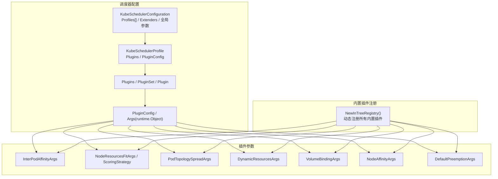
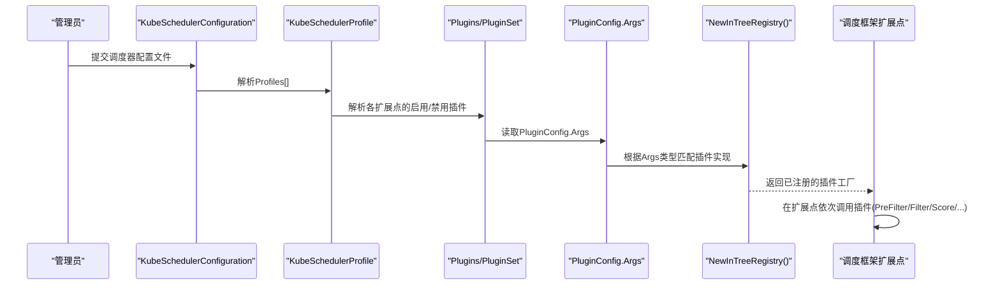
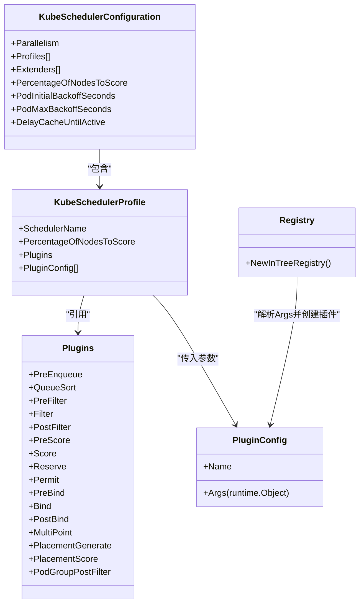

# 调度策略配置

<cite>
**本文引用的文件**   
- [types.go](file://pkg/scheduler/apis/config/types.go)
- [types_pluginargs.go](file://pkg/scheduler/apis/config/types_pluginargs.go)
- [doc.go](file://pkg/scheduler/apis/config/doc.go)
- [registry.go](file://pkg/scheduler/framework/plugins/registry.go)
- [types.go](file://staging/src/k8s.io/api/scheduling/v1/types.go)
</cite>

## 目录
1. [简介](#简介)
2. [项目结构](#项目结构)
3. [核心组件](#核心组件)
4. [架构总览](#架构总览)
5. [详细组件分析](#详细组件分析)
6. [依赖关系分析](#依赖关系分析)
7. [性能考量](#性能考量)
8. [故障排查指南](#故障排查指南)
9. [结论](#结论)
10. [附录](#附录) 

## 简介
本操作文档面向Kubernetes调度器的策略与参数配置，围绕以下目标展开：
- 全面介绍调度器配置文件格式：Profile（调度器配置集）、Plugin（插件）及调度参数设置。
- 详细说明多集群调度、亲和性调度、反亲和性调度、拓扑感知调度的配置方法。
- 提供高可用部署、资源隔离、性能优化等典型业务场景的配置示例路径。
- 说明调度策略的动态调整与热更新机制。
- 给出配置验证、错误排查与性能监控指南。

## 项目结构
与调度策略配置相关的核心代码位于调度器API配置包与内置插件注册表：
- 调度器主配置与Profile定义：pkg/scheduler/apis/config/types.go
- 各插件的参数对象定义：pkg/scheduler/apis/config/types_pluginargs.go
- 调度器API组声明：pkg/scheduler/apis/config/doc.go
- 内置插件注册表（含拓扑感知、亲和性、资源评分等）：pkg/scheduler/framework/plugins/registry.go
- PriorityClass API定义（用于抢占优先级）：staging/src/k8s.io/api/scheduling/v1/types.go

图示来源
- [types.go:36-131](file://pkg/scheduler/apis/config/types.go#L36-L131)
- [types.go:133-218](file://pkg/scheduler/apis/config/types.go#L133-L218)
- [types_pluginargs.go:50-221](file://pkg/scheduler/apis/config/types_pluginargs.go#L50-L221)
- [registry.go:47-79](file://pkg/scheduler/framework/plugins/registry.go#L47-L79)

章节来源
- [types.go:36-131](file://pkg/scheduler/apis/config/types.go#L36-L131)
- [types.go:133-218](file://pkg/scheduler/apis/config/types.go#L133-L218)
- [types_pluginargs.go:50-221](file://pkg/scheduler/apis/config/types_pluginargs.go#L50-L221)
- [registry.go:47-79](file://pkg/scheduler/framework/plugins/registry.go#L47-L79)

## 核心组件
- 调度器主配置（KubeSchedulerConfiguration）
  - 包含并行度、LeaderElection、ClientConnection、Debugging、PercentageOfNodesToScore、PodInitialBackoffSeconds、PodMaxBackoffSeconds、Profiles、Extenders、DelayCacheUntilActive等字段。
- 调度器Profile（KubeSchedulerProfile）
  - 每个Profile对应一个“调度器名称”，通过Pod的schedulerName选择；可覆盖全局PercentageOfNodesToScore；指定Plugins与PluginConfig。
- 插件集合（Plugins/PluginSet/Plugin）
  - 按扩展点组织：PreEnqueue、QueueSort、PreFilter、Filter、PostFilter、PreScore、Score、Reserve、Permit、PreBind、Bind、PostBind、MultiPoint、PlacementGenerate、PlacementScore、PodGroupPostFilter。
  - 每个扩展点支持Enabled/Disabled列表；Weight仅对Score和PlacementScore有效。
- 插件参数（PluginConfig.Args）
  - 以runtime.Object形式传递，具体类型由插件定义（如InterPodAffinityArgs、NodeResourcesFitArgs等）。

章节来源
- [types.go:36-131](file://pkg/scheduler/apis/config/types.go#L36-L131)
- [types.go:133-218](file://pkg/scheduler/apis/config/types.go#L133-L218)

## 架构总览
下图展示了调度器配置到插件执行的关键路径：从KubeSchedulerConfiguration加载，解析Profiles与Plugins，实例化各插件并注入PluginConfig.Args，随后在调度框架的各个扩展点调用。

图示来源
- [types.go:36-131](file://pkg/scheduler/apis/config/types.go#L36-L131)
- [types.go:133-218](file://pkg/scheduler/apis/config/types.go#L133-L218)
- [registry.go:47-79](file://pkg/scheduler/framework/plugins/registry.go#L47-L79)

## 详细组件分析

### 调度器主配置与Profile
- 关键要点
  - Profiles数组决定不同调度器名称的行为差异；未指定schedulerName的Pod使用名为"default-scheduler"的Profile（若存在）。
  - PercentageOfNodesToScore可在全局或Profile级别设置，影响“评分阶段”候选节点数量，从而平衡调度延迟与质量。
  - PodInitialBackoffSeconds/PodMaxBackoffSeconds控制不可调度Pod的重试退避时间。
  - Extenders允许将部分过滤/打分/绑定逻辑委托给外部服务。

章节来源
- [types.go:36-131](file://pkg/scheduler/apis/config/types.go#L36-L131)

### 插件集合与扩展点
- 关键要点
  - 通过Plugins为每个扩展点声明Enabled/Disabled；当某扩展点未配置时，采用默认插件集。
  - QueueSort插件在所有Profile中必须保持一致的名称与PluginConfig。
  - Weight仅在Score与PlacementScore生效，用于加权多个评分插件的结果。

章节来源
- [types.go:133-218](file://pkg/scheduler/apis/config/types.go#L133-L218)

### 插件参数对象（常用插件）
- InterPodAffinityArgs（亲和性/反亲和性）
  - HardPodAffinityWeight：硬亲和匹配的打分权重。
  - IgnorePreferredTermsOfExistingPods：是否忽略已有Pod的“偏好项”。
- NodeResourcesFitArgs（资源适配与评分）
  - IgnoredResources/IgnoredResourceGroups：过滤阶段忽略的资源名或资源组。
  - ScoringStrategy：LeastAllocated/MostAllocated/RequestedToCapacityRatio三种评分策略。
- PodTopologySpreadArgs（拓扑分布）
  - DefaultConstraints：为未显式声明topologySpreadConstraints的Pod补充默认约束。
  - DefaultingType：System（系统默认）或List（使用DefaultConstraints）。
- DynamicResourcesArgs（动态资源/DRA）
  - FilterTimeout：单节点过滤超时。
  - BindingTimeout：PreBind等待设备绑定条件满足的超时。
- VolumeBindingArgs（卷绑定）
  - BindTimeoutSeconds：卷绑定操作超时。
  - Shape：静态PV利用率评分曲线（需特性门控）。
- NodeAffinityArgs（节点亲和）
  - AddedAffinity：对所有Pod额外施加的节点亲和规则。
- DefaultPreemptionArgs（抢占）
  - MinCandidateNodesPercentage/Absolute：预抢占候选节点规模控制。

章节来源
- [types_pluginargs.go:50-221](file://pkg/scheduler/apis/config/types_pluginargs.go#L50-L221)

### 内置插件注册表
- NewInTreeRegistry集中注册了所有内置插件，包括：
  - 亲和性与拓扑：interpodaffinity、nodeaffinity、podtopologyspread、topologyaware
  - 资源与容量：noderesources（Fit/BalancedAllocation）、dynamicresources
  - 卷相关：volumebinding、volumezone、nodevolumelimits
  - 其他：tainttoleration、queuesort、defaultbinder、defaultpreemption、schedulinggates、gangscheduling、podgrouppodscount等

章节来源
- [registry.go:47-79](file://pkg/scheduler/framework/plugins/registry.go#L47-L79)

### 优先级类（PriorityClass）
- PriorityClass用于定义抢占优先级值、全局默认优先级以及抢占策略（PreemptionPolicy），配合调度抢占流程提升高优先级Pod的调度成功率。

章节来源
- [types.go:29-61](file://staging/src/k8s.io/api/scheduling/v1/types.go#L29-L61)

## 依赖关系分析
- 配置到实现的映射
  - KubeSchedulerConfiguration.Profiles[].Plugins -> 各扩展点插件集合
  - PluginConfig.Args -> 具体插件参数对象（如InterPodAffinityArgs、NodeResourcesFitArgs等）
  - registry.NewInTreeRegistry() -> 将上述参数对象与插件实现绑定
- 耦合与内聚
  - 配置层与实现层通过Args类型解耦；通过注册表集中管理，便于扩展与维护。
- 外部依赖
  - Extenders可与外部服务通信，支持HTTPS/TLS与超时控制。

图示来源
- [types.go:36-218](file://pkg/scheduler/apis/config/types.go#L36-L218)
- [registry.go:47-79](file://pkg/scheduler/framework/plugins/registry.go#L47-L79)

## 性能考量
- 评分范围控制
  - 通过全局或Profile级PercentageOfNodesToScore限制参与评分的节点比例，降低大规模集群的调度延迟。
- 资源评分策略
  - LeastAllocated适合均衡负载；MostAllocated适合资源聚合；RequestedToCapacityRatio可通过Shape自定义评分曲线。
- 拓扑分布与亲和性
  - 合理设置PodTopologySpread与InterPodAffinity权重，避免过度约束导致无可行节点。
- 动态资源与卷绑定
  - 针对DRA与静态PV，合理设置FilterTimeout/BindingTimeout/BindTimeoutSeconds，避免长尾阻塞。
- 抢占与重试
  - 调整MinCandidateNodesPercentage/Absolute与PodInitialBackoffSeconds/PodMaxBackoffSeconds，平衡抢占开销与重试频率。

[本节为通用指导，不直接分析具体文件]

## 故障排查指南
- 配置校验
  - 确认KubeSchedulerConfiguration版本与字段有效性；检查Plugins在各扩展点的Enabled/Disabled组合是否符合预期。
  - 确保QueueSort插件在所有Profile中一致。
- 常见问题定位
  - 亲和性/反亲和性冲突：检查InterPodAffinityArgs与NodeAffinityArgs配置，必要时放宽约束或调整权重。
  - 资源不足：查看NodeResourcesFitArgs的IgnoredResources/IgnoredResourceGroups与ScoringStrategy设置。
  - 拓扑分布失败：核对PodTopologySpreadArgs.DefaultingType与DefaultConstraints是否与Service/RC/RS/StatefulSet成员关系匹配。
  - 动态资源/卷绑定超时：评估DynamicResourcesArgs与VolumeBindingArgs的超时参数与驱动就绪行为。
- 日志与指标
  - 关注调度框架扩展点耗时指标（如scheduler_framework_extension_point_duration_seconds）与插件执行时长指标，辅助定位瓶颈。

[本节为通用指导，不直接分析具体文件]

## 结论
通过KubeSchedulerConfiguration与Profile的组合，结合丰富的内置插件与灵活的PluginConfig.Args，Kubernetes调度器能够覆盖从亲和性、拓扑分布到动态资源与卷绑定的多样化调度需求。配合合理的性能参数与监控手段，可实现高可用、强隔离与高性能的生产级调度策略。

[本节为总结性内容，不直接分析具体文件]

## 附录

### 常见调度策略配置要点速查
- 亲和性/反亲和性
  - 插件：interpodaffinity
  - 关键参数：HardPodAffinityWeight、IgnorePreferredTermsOfExistingPods
  - 适用场景：同机架/同AZ亲和，跨AZ反亲和
- 节点亲和
  - 插件：nodeaffinity
  - 关键参数：AddedAffinity
  - 适用场景：强制节点标签筛选
- 拓扑分布
  - 插件：podtopologyspread
  - 关键参数：DefaultingType、DefaultConstraints
  - 适用场景：跨节点/跨AZ均匀分布
- 资源评分
  - 插件：noderesources（Fit/BalancedAllocation）
  - 关键参数：ScoringStrategy（LeastAllocated/MostAllocated/RequestedToCapacityRatio）
  - 适用场景：负载均衡或资源聚合
- 动态资源（DRA）
  - 插件：dynamicresources
  - 关键参数：FilterTimeout、BindingTimeout
  - 适用场景：GPU/NIC等设备的按需分配
- 卷绑定
  - 插件：volumebinding
  - 关键参数：BindTimeoutSeconds、Shape（静态PV利用率评分）
  - 适用场景：存储亲和与容量规划
- 抢占
  - 插件：defaultpreemption
  - 关键参数：MinCandidateNodesPercentage、MinCandidateNodesAbsolute
  - 适用场景：高优Pod抢占低优Pod

章节来源
- [types_pluginargs.go:50-221](file://pkg/scheduler/apis/config/types_pluginargs.go#L50-L221)
- [registry.go:47-79](file://pkg/scheduler/framework/plugins/registry.go#L47-L79)

### 典型业务场景配置示例（路径指引）
- 高可用部署
  - 使用PodTopologySpread跨节点/跨AZ分布；结合InterPodAffinity的反亲和规则；必要时开启DefaultPreemption以提升关键Pod抢占能力。
  - 参考：PodTopologySpreadArgs、InterPodAffinityArgs、DefaultPreemptionArgs
- 资源隔离
  - 通过NodeAffinity与Taint/Toleration进行物理/逻辑隔离；使用NodeResourcesFit的IgnoredResources排除非关键资源干扰。
  - 参考：NodeAffinityArgs、NodeResourcesFitArgs
- 性能优化
  - 调整PercentageOfNodesToScore减少评分范围；选择合适的ScoringStrategy；为DRA与卷绑定设置合理超时。
  - 参考：KubeSchedulerConfiguration.PercentageOfNodesToScore、NodeResourcesFitArgs.ScoringStrategy、DynamicResourcesArgs、VolumeBindingArgs

章节来源
- [types.go:36-131](file://pkg/scheduler/apis/config/types.go#L36-L131)
- [types_pluginargs.go:50-221](file://pkg/scheduler/apis/config/types_pluginargs.go#L50-L221)

### 动态调整与热更新机制（概念性说明）
- 调度器配置通常以文件形式提供，并在启动时加载；对于需要在线变更的场景，建议结合外部编排工具或配置中心在可控窗口内滚动重启调度器实例，以实现配置热更新。
- 注意：Profile级别的QueueSort插件及其PluginConfig需在全部Profile保持一致，以避免不一致导致的调度异常。

[本节为概念性说明，不直接分析具体文件]