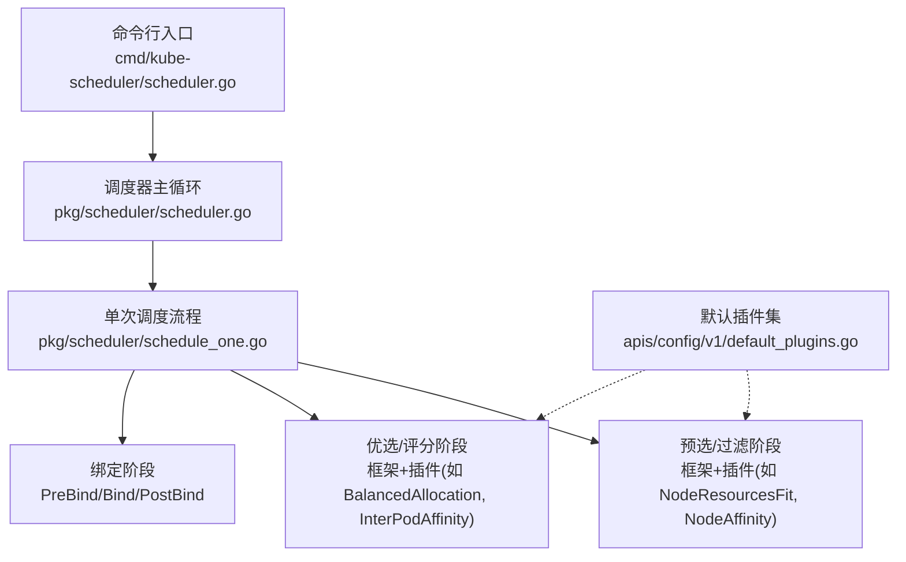
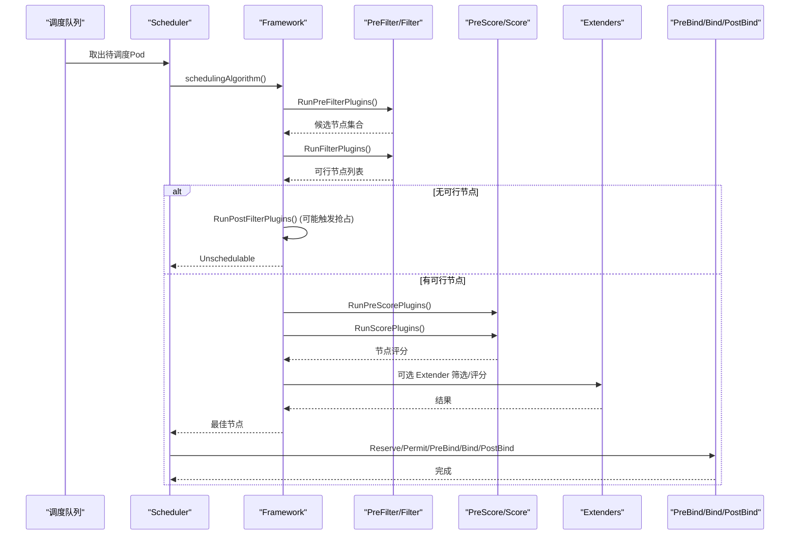
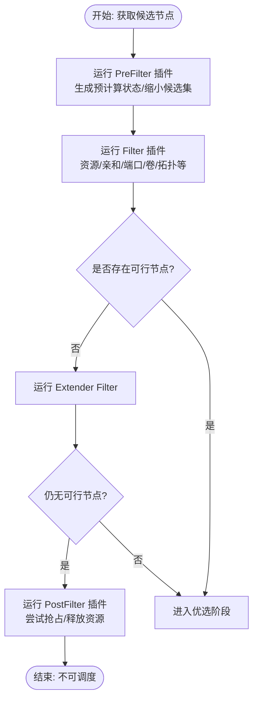
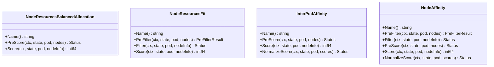
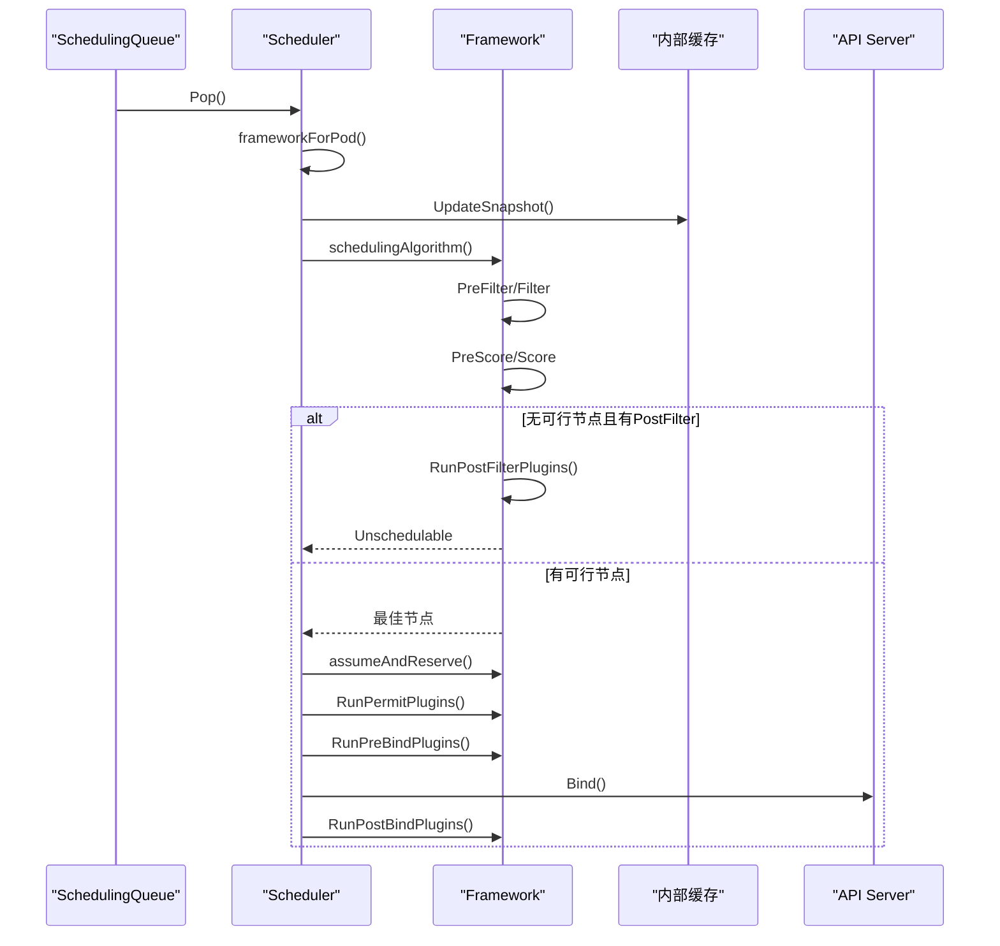
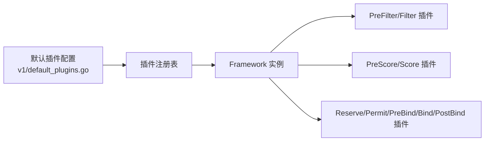

# 调度算法详解

<cite>
**本文引用的文件**   
- [cmd/kube-scheduler/scheduler.go](file://cmd/kube-scheduler/scheduler.go)
- [pkg/scheduler/scheduler.go](file://pkg/scheduler/scheduler.go)
- [pkg/scheduler/schedule_one.go](file://pkg/scheduler/schedule_one.go)
- [pkg/scheduler/apis/config/v1/default_plugins.go](file://pkg/scheduler/apis/config/v1/default_plugins.go)
- [pkg/scheduler/framework/plugins/noderesources/fit.go](file://pkg/scheduler/framework/plugins/noderesources/fit.go)
- [pkg/scheduler/framework/plugins/noderesources/balanced_allocation.go](file://pkg/scheduler/framework/plugins/noderesources/balanced_allocation.go)
- [pkg/scheduler/framework/plugins/nodeaffinity/node_affinity.go](file://pkg/scheduler/framework/plugins/nodeaffinity/node_affinity.go)
- [pkg/scheduler/framework/plugins/interpodaffinity/scoring.go](file://pkg/scheduler/framework/plugins/interpodaffinity/scoring.go)
</cite>

## 目录
1. [简介](#简介)
2. [项目结构](#项目结构)
3. [核心组件](#核心组件)
4. [架构总览](#架构总览)
5. [详细组件分析](#详细组件分析)
6. [依赖关系分析](#依赖关系分析)
7. [性能考量](#性能考量)
8. [故障排查指南](#故障排查指南)
9. [结论](#结论)
10. [附录](#附录)

## 简介
本文件面向 Kubernetes 调度器（kube-scheduler）的调度算法，系统性解析预选阶段（Predicates/Filter）与优选阶段（Priorities/Score）的实现机制，覆盖节点资源检查、亲和性/反亲和性、拓扑感知、负载均衡等关键策略；并完整梳理从 Pod 入队到最终绑定的调度决策流程。同时提供配置要点、性能调优建议、延迟分析与故障排查方法，帮助读者在生产环境中高效使用与优化调度能力。

## 项目结构
Kubernetes 调度器的入口位于 cmd/kube-scheduler，核心调度逻辑在 pkg/scheduler 下，插件体系通过 framework/plugins 组织。默认启用的插件集合由 v1 配置层定义，便于扩展与裁剪。

图表来源
- [cmd/kube-scheduler/scheduler.go:29-33](file://cmd/kube-scheduler/scheduler.go#L29-L33)
- [pkg/scheduler/scheduler.go:284-478](file://pkg/scheduler/scheduler.go#L284-L478)
- [pkg/scheduler/schedule_one.go:66-141](file://pkg/scheduler/schedule_one.go#L66-L141)
- [pkg/scheduler/apis/config/v1/default_plugins.go:30-58](file://pkg/scheduler/apis/config/v1/default_plugins.go#L30-L58)

章节来源
- [cmd/kube-scheduler/scheduler.go:29-33](file://cmd/kube-scheduler/scheduler.go#L29-L33)
- [pkg/scheduler/scheduler.go:284-478](file://pkg/scheduler/scheduler.go#L284-L478)
- [pkg/scheduler/schedule_one.go:66-141](file://pkg/scheduler/schedule_one.go#L66-L141)
- [pkg/scheduler/apis/config/v1/default_plugins.go:30-58](file://pkg/scheduler/apis/config/v1/default_plugins.go#L30-L58)

## 核心组件
- 调度器主对象：负责初始化 Profile、队列、缓存、事件处理与运行循环。
- 单次调度流程：从队列取实体，执行 schedulingAlgorithm（预选+优选），必要时触发 PostFilter（抢占），进入 bindingCycle（预绑定/绑定/后绑定）。
- 插件体系：以 PreFilter/Filter/PreScore/Score/Reserve/Permit/PreBind/Bind/PostBind 等扩展点组织，支持权重与多阶段组合。
- 默认插件集：包含资源适配、亲和性、拓扑分布、镜像本地化、预抢占、平衡分配、绑定器等。

章节来源
- [pkg/scheduler/scheduler.go:68-124](file://pkg/scheduler/scheduler.go#L68-L124)
- [pkg/scheduler/schedule_one.go:168-311](file://pkg/scheduler/schedule_one.go#L168-L311)
- [pkg/scheduler/apis/config/v1/default_plugins.go:30-58](file://pkg/scheduler/apis/config/v1/default_plugins.go#L30-L58)

## 架构总览
下图展示一次 Pod 调度的端到端时序，包括预选、优选、抢占与绑定各阶段的关键调用链。

图表来源
- [pkg/scheduler/schedule_one.go:247-311](file://pkg/scheduler/schedule_one.go#L247-L311)
- [pkg/scheduler/schedule_one.go:398-504](file://pkg/scheduler/schedule_one.go#L398-L504)

## 详细组件分析

### 预选阶段（Predicates/Filter）
预选阶段的目标是快速剔除不满足硬性约束的节点，减少后续评分开销。主要涉及以下插件与逻辑：

- 节点资源适配（NodeResourcesFit）
  - 职责：校验 CPU、内存、EphemeralStorage、自定义标量资源、Pod 数量上限是否足够；支持忽略部分扩展资源或资源组；支持动态资源分配（DRA）场景下的设备类映射。
  - 关键点：
    - PreFilter 阶段计算 Pod 的资源请求摘要写入 CycleState，避免重复计算。
    - Filter 阶段对比节点可用资源与 Pod 请求，返回失败原因（含不可抢占标记）。
    - 支持 InPlacePodVerticalScaling 与 PodLevelResources 特性。
  - 参考路径
    - [pkg/scheduler/framework/plugins/noderesources/fit.go:330-335](file://pkg/scheduler/framework/plugins/noderesources/fit.go#L330-L335)
    - [pkg/scheduler/framework/plugins/noderesources/fit.go:590-626](file://pkg/scheduler/framework/plugins/noderesources/fit.go#L590-L626)
    - [pkg/scheduler/framework/plugins/noderesources/fit.go:642-734](file://pkg/scheduler/framework/plugins/noderesources/fit.go#L642-L734)

- 节点亲和性与选择器（NodeAffinity）
  - 职责：根据 Pod 的 nodeSelector 与 nodeAffinity（Required/Preferred）进行过滤与评分；支持“强制”附加亲和规则。
  - 关键点：
    - PreFilter 可提前收敛到少量候选节点（例如精确匹配 nodeName）。
    - Filter 严格判定 Required 条件，不匹配则直接拒绝。
    - Score 对 Preferred 项加权求和，NormalizeScore 统一归一化。
  - 参考路径
    - [pkg/scheduler/framework/plugins/nodeaffinity/node_affinity.go:148-198](file://pkg/scheduler/framework/plugins/nodeaffinity/node_affinity.go#L148-L198)
    - [pkg/scheduler/framework/plugins/nodeaffinity/node_affinity.go:207-228](file://pkg/scheduler/framework/plugins/nodeaffinity/node_affinity.go#L207-L228)
    - [pkg/scheduler/framework/plugins/nodeaffinity/node_affinity.go:258-291](file://pkg/scheduler/framework/plugins/nodeaffinity/node_affinity.go#L258-L291)

- 网络端口冲突（NodePorts）
  - 职责：确保目标节点未被占用端口不会与 Service NodePort 冲突。
  - 说明：作为内置 Filter 插件参与预选。

- 存储相关限制（VolumeRestrictions / VolumeBinding / VolumeZone）
  - 职责：
    - VolumeRestrictions：校验 PV/PVC 访问模式、容量、ReclaimPolicy 等兼容性。
    - VolumeBinding：为 PVC 做静态绑定或等待动态供给，影响可行性判断。
    - VolumeZone：基于拓扑标签（zone）进行亲和/反亲和约束。
  - 说明：这些插件在默认插件集中启用，属于预选/预评分范畴。

- 节点不可调度（NodeUnschedulable）
  - 职责：跳过被标记为不可调度的节点。

- 外部扩展（Extenders）
  - 职责：允许用户侧 HTTP 扩展器参与 Filter 与 Prioritizer，用于实现自定义过滤与评分。
  - 注意：当 Extender 拒绝某些节点时，会记录到诊断信息中，以便后续重入队策略。

图表来源
- [pkg/scheduler/schedule_one.go:629-719](file://pkg/scheduler/schedule_one.go#L629-L719)
- [pkg/scheduler/framework/plugins/noderesources/fit.go:590-626](file://pkg/scheduler/framework/plugins/noderesources/fit.go#L590-L626)
- [pkg/scheduler/framework/plugins/nodeaffinity/node_affinity.go:207-228](file://pkg/scheduler/framework/plugins/nodeaffinity/node_affinity.go#L207-L228)

章节来源
- [pkg/scheduler/schedule_one.go:629-719](file://pkg/scheduler/schedule_one.go#L629-L719)
- [pkg/scheduler/framework/plugins/noderesources/fit.go:330-335](file://pkg/scheduler/framework/plugins/noderesources/fit.go#L330-L335)
- [pkg/scheduler/framework/plugins/noderesources/fit.go:590-626](file://pkg/scheduler/framework/plugins/noderesources/fit.go#L590-L626)
- [pkg/scheduler/framework/plugins/nodeaffinity/node_affinity.go:148-198](file://pkg/scheduler/framework/plugins/nodeaffinity/node_affinity.go#L148-L198)
- [pkg/scheduler/framework/plugins/nodeaffinity/node_affinity.go:207-228](file://pkg/scheduler/framework/plugins/nodeaffinity/node_affinity.go#L207-L228)

### 优选阶段（Priorities/Score）
优选阶段对通过预选的节点进行打分排序，目标是提升集群整体质量（均衡、亲和、拓扑友好等）。

- 资源平衡分配（NodeResourcesBalancedAllocation）
  - 职责：优先选择使 CPU、内存等资源利用率更均衡的节点，降低资源倾斜。
  - 算法要点：
    - PreScore 计算 Pod 请求向量。
    - Score 计算加入 Pod 前后资源利用率的方差变化，得分越高表示越能改善均衡度。
    - 针对 BestEffort Pod 会跳过以避免聚集。
  - 参考路径
    - [pkg/scheduler/framework/plugins/noderesources/balanced_allocation.go:78-100](file://pkg/scheduler/framework/plugins/noderesources/balanced_allocation.go#L78-L100)
    - [pkg/scheduler/framework/plugins/noderesources/balanced_allocation.go:146-170](file://pkg/scheduler/framework/plugins/noderesources/balanced_allocation.go#L146-L170)
    - [pkg/scheduler/framework/plugins/noderesources/balanced_allocation.go:204-255](file://pkg/scheduler/framework/plugins/noderesources/balanced_allocation.go#L204-L255)

- 节点资源适配（NodeResourcesFit）的评分
  - 职责：除过滤外，还提供多种评分策略（LeastAllocated/MostAllocated/RequestedToCapacityRatio），用于控制资源碎片与填充倾向。
  - 参考路径
    - [pkg/scheduler/framework/plugins/noderesources/fit.go:64-90](file://pkg/scheduler/framework/plugins/noderesources/fit.go#L64-L90)
    - [pkg/scheduler/framework/plugins/noderesources/fit.go:736-755](file://pkg/scheduler/framework/plugins/noderesources/fit.go#L736-L755)

- 跨 Pod 亲和/反亲和（InterPodAffinity）
  - 职责：根据已有 Pod 的亲和/反亲和偏好，结合拓扑键（TopologyKey）对节点打分。
  - 算法要点：
    - PreScore 遍历节点上的 Pod，累计拓扑维度的正负权重。
    - Score 将当前节点标签与拓扑键匹配，累加对应分数。
    - NormalizeScore 按最大最小差值线性归一化至 [0, MaxNodeScore]。
  - 参考路径
    - [pkg/scheduler/framework/plugins/interpodaffinity/scoring.go:127-221](file://pkg/scheduler/framework/plugins/interpodaffinity/scoring.go#L127-L221)
    - [pkg/scheduler/framework/plugins/interpodaffinity/scoring.go:236-290](file://pkg/scheduler/framework/plugins/interpodaffinity/scoring.go#L236-L290)

- 节点亲和（NodeAffinity）的评分
  - 职责：对 Preferred 亲和项加权求分，配合 NormalizeScore 归一化。
  - 参考路径
    - [pkg/scheduler/framework/plugins/nodeaffinity/node_affinity.go:258-291](file://pkg/scheduler/framework/plugins/nodeaffinity/node_affinity.go#L258-L291)

- 其他常用评分插件
  - ImageLocality：优先选择镜像本地化的节点，减少拉取时间。
  - PodTopologySpread：基于拓扑域均匀分布 Pod，增强容灾。
  - TaintToleration：容忍污点，带权重影响排序。

图表来源
- [pkg/scheduler/framework/plugins/noderesources/balanced_allocation.go:78-100](file://pkg/scheduler/framework/plugins/noderesources/balanced_allocation.go#L78-L100)
- [pkg/scheduler/framework/plugins/noderesources/fit.go:330-335](file://pkg/scheduler/framework/plugins/noderesources/fit.go#L330-L335)
- [pkg/scheduler/framework/plugins/interpodaffinity/scoring.go:127-221](file://pkg/scheduler/framework/plugins/interpodaffinity/scoring.go#L127-L221)
- [pkg/scheduler/framework/plugins/nodeaffinity/node_affinity.go:148-198](file://pkg/scheduler/framework/plugins/nodeaffinity/node_affinity.go#L148-L198)

章节来源
- [pkg/scheduler/framework/plugins/noderesources/balanced_allocation.go:78-100](file://pkg/scheduler/framework/plugins/noderesources/balanced_allocation.go#L78-L100)
- [pkg/scheduler/framework/plugins/noderesources/balanced_allocation.go:146-170](file://pkg/scheduler/framework/plugins/noderesources/balanced_allocation.go#L146-L170)
- [pkg/scheduler/framework/plugins/noderesources/balanced_allocation.go:204-255](file://pkg/scheduler/framework/plugins/noderesources/balanced_allocation.go#L204-L255)
- [pkg/scheduler/framework/plugins/noderesources/fit.go:64-90](file://pkg/scheduler/framework/plugins/noderesources/fit.go#L64-L90)
- [pkg/scheduler/framework/plugins/noderesources/fit.go:736-755](file://pkg/scheduler/framework/plugins/noderesources/fit.go#L736-L755)
- [pkg/scheduler/framework/plugins/interpodaffinity/scoring.go:127-221](file://pkg/scheduler/framework/plugins/interpodaffinity/scoring.go#L127-L221)
- [pkg/scheduler/framework/plugins/interpodaffinity/scoring.go:236-290](file://pkg/scheduler/framework/plugins/interpodaffinity/scoring.go#L236-L290)
- [pkg/scheduler/framework/plugins/nodeaffinity/node_affinity.go:258-291](file://pkg/scheduler/framework/plugins/nodeaffinity/node_affinity.go#L258-L291)

### 调度决策流程（从入队到绑定）
- 入队与轮询：调度器启动后，从 SchedulingQueue 弹出下一个实体（Pod 或 PodGroup）。
- 选择 Profile：根据 Pod 的 SchedulerName 选择对应的 Profile 与插件链。
- 预选阶段：依次执行 PreFilter/Filter，必要时结合 Extender 过滤。
- 优选阶段：执行 PreScore/Score，汇总评分并排序，选取最高分节点。
- 抢占（可选）：若无可行节点且存在 PostFilter 插件，尝试抢占以创造空间。
- 假设与保留：在内存中假设 Pod 已绑定，并执行 Reserve 插件。
- Permit/PreBind/Bind/PostBind：等待许可、准备绑定、实际绑定、后置清理。
- 失败处理：任一阶段失败，触发 FailureHandler，可能回滚假设、更新队列优先级或退避。

图表来源
- [pkg/scheduler/schedule_one.go:92-141](file://pkg/scheduler/schedule_one.go#L92-L141)
- [pkg/scheduler/schedule_one.go:168-311](file://pkg/scheduler/schedule_one.go#L168-L311)
- [pkg/scheduler/schedule_one.go:398-504](file://pkg/scheduler/schedule_one.go#L398-L504)

章节来源
- [pkg/scheduler/schedule_one.go:92-141](file://pkg/scheduler/schedule_one.go#L92-L141)
- [pkg/scheduler/schedule_one.go:168-311](file://pkg/scheduler/schedule_one.go#L168-L311)
- [pkg/scheduler/schedule_one.go:398-504](file://pkg/scheduler/schedule_one.go#L398-L504)

## 依赖关系分析
- 默认插件集由 v1 配置层提供，并通过 FeatureGate 动态增减（如 DynamicResourceAllocation、GenericWorkload、TopologyAwareWorkloadScheduling）。
- 调度器在构建时合并 out-of-tree 插件注册表，并按 Profile 注入 Framework。
- 插件间通过 CycleState 共享预计算数据，避免重复 IO 与计算。

图表来源
- [pkg/scheduler/apis/config/v1/default_plugins.go:30-58](file://pkg/scheduler/apis/config/v1/default_plugins.go#L30-L58)
- [pkg/scheduler/scheduler.go:309-387](file://pkg/scheduler/scheduler.go#L309-L387)

章节来源
- [pkg/scheduler/apis/config/v1/default_plugins.go:30-58](file://pkg/scheduler/apis/config/v1/default_plugins.go#L30-L58)
- [pkg/scheduler/scheduler.go:309-387](file://pkg/scheduler/scheduler.go#L309-L387)

## 性能考量
- 并行度与采样
  - 通过 WithParallelism 控制插件并行度；插件指标采样比例可调，降低监控开销。
  - 参考路径：[pkg/scheduler/scheduler.go:192-197](file://pkg/scheduler/scheduler.go#L192-L197)、[pkg/scheduler/schedule_one.go:49-62](file://pkg/scheduler/schedule_one.go#L49-L62)
- 节点评分范围与自适应
  - percentageOfNodesToScore 控制参与评分的节点比例，默认自适应公式在大集群中显著降低开销。
  - 参考路径：[pkg/scheduler/scheduler.go:199-207](file://pkg/scheduler/scheduler.go#L199-L207)
- 预计算与状态复用
  - 大量插件采用 PreFilter/PreScore 预计算，避免每节点重复计算。
  - 参考路径：
    - [pkg/scheduler/framework/plugins/noderesources/fit.go:330-335](file://pkg/scheduler/framework/plugins/noderesources/fit.go#L330-L335)
    - [pkg/scheduler/framework/plugins/interpodaffinity/scoring.go:127-221](file://pkg/scheduler/framework/plugins/interpodaffinity/scoring.go#L127-L221)
- 异步 API 调用
  - 开启 SchedulerAsyncAPICalls 后，通过 APIDispatcher 异步访问 API Server，降低阻塞。
  - 参考路径：[pkg/scheduler/scheduler.go:360-363](file://pkg/scheduler/scheduler.go#L360-L363)
- 批量与提示
  - OpportunisticBatching 特性可缓存最近调度结果，加速后续相似 Pod 的调度。
  - 参考路径：[pkg/scheduler/schedule_one.go:597-618](file://pkg/scheduler/schedule_one.go#L597-L618)

[本节为通用性能指导，无需特定文件引用]

## 故障排查指南
- 常见失败原因定位
  - 资源不足：查看 NodeResourcesFit 的失败原因（CPU/Memory/EphemeralStorage/标量资源/Too many pods）。
    - 参考路径：[pkg/scheduler/framework/plugins/noderesources/fit.go:642-734](file://pkg/scheduler/framework/plugins/noderesources/fit.go#L642-L734)
  - 亲和不匹配：检查 NodeAffinity 的 Required 条件与节点标签。
    - 参考路径：[pkg/scheduler/framework/plugins/nodeaffinity/node_affinity.go:207-228](file://pkg/scheduler/framework/plugins/nodeaffinity/node_affinity.go#L207-L228)
  - 端口冲突：确认 NodePorts 插件未拒绝。
  - 卷绑定失败：检查 VolumeBinding/VolumeZone 与 PV/PVC 状态。
- 抢占与 PostFilter
  - 若预选失败且存在 PostFilter，观察抢占结果与诊断消息。
  - 参考路径：[pkg/scheduler/schedule_one.go:289-311](file://pkg/scheduler/schedule_one.go#L289-L311)
- 绑定阶段错误
  - Permit/PreBind/Bind 失败会导致回滚假设与重试，关注日志中的 NominatedNodeName 与错误码。
  - 参考路径：[pkg/scheduler/schedule_one.go:398-504](file://pkg/scheduler/schedule_one.go#L398-L504)
- 外部扩展器问题
  - Extender 拒绝节点会被记录到诊断中，需检查外部服务健康与超时。
  - 参考路径：[pkg/scheduler/schedule_one.go:699-719](file://pkg/scheduler/schedule_one.go#L699-L719)

章节来源
- [pkg/scheduler/framework/plugins/noderesources/fit.go:642-734](file://pkg/scheduler/framework/plugins/noderesources/fit.go#L642-L734)
- [pkg/scheduler/framework/plugins/nodeaffinity/node_affinity.go:207-228](file://pkg/scheduler/framework/plugins/nodeaffinity/node_affinity.go#L207-L228)
- [pkg/scheduler/schedule_one.go:289-311](file://pkg/scheduler/schedule_one.go#L289-L311)
- [pkg/scheduler/schedule_one.go:398-504](file://pkg/scheduler/schedule_one.go#L398-L504)
- [pkg/scheduler/schedule_one.go:699-719](file://pkg/scheduler/schedule_one.go#L699-L719)

## 结论
Kubernetes 调度器通过可扩展的插件框架将预选与优选解耦，既保证了强约束的正确性，又提供了丰富的优化目标（均衡、亲和、拓扑、镜像本地化等）。生产环境应结合集群规模与业务特征，合理配置默认插件权重、评分策略与并行度，并利用抢占与异步 API 调用提升吞吐与稳定性。

[本节为总结性内容，无需特定文件引用]

## 附录

### 调度算法配置示例（要点）
- 调整默认插件权重与顺序
  - 通过 KubeSchedulerConfiguration 的 plugins.MultiPoint.Enabled 指定插件及权重，例如提高 NodeAffinity 与 InterPodAffinity 的权重以强化亲和偏好。
  - 参考路径：[pkg/scheduler/apis/config/v1/default_plugins.go:30-58](file://pkg/scheduler/apis/config/v1/default_plugins.go#L30-L58)
- 资源评分策略
  - NodeResourcesFit.ScoringStrategy 可选择 LeastAllocated/MostAllocated/RequestedToCapacityRatio，影响资源碎片与填充倾向。
  - 参考路径：[pkg/scheduler/framework/plugins/noderesources/fit.go:64-90](file://pkg/scheduler/framework/plugins/noderesources/fit.go#L64-L90)
- 平衡分配
  - 启用 NodeResourcesBalancedAllocation 以提升资源均衡度，适合多资源维度场景。
  - 参考路径：[pkg/scheduler/framework/plugins/noderesources/balanced_allocation.go:178-202](file://pkg/scheduler/framework/plugins/noderesources/balanced_allocation.go#L178-L202)
- 并行度与评分节点比例
  - 通过 WithParallelism 与 WithPercentageOfNodesToScore 控制并发与评估规模。
  - 参考路径：[pkg/scheduler/scheduler.go:192-207](file://pkg/scheduler/scheduler.go#L192-L207)

### 调度延迟分析与优化建议
- 关键耗时点
  - 预选/优选阶段的插件执行与 I/O（尤其是卷绑定与外部扩展器）。
  - 抢占阶段的复杂计算与 API 交互。
- 优化建议
  - 启用异步 API 调用与指标采样，降低系统开销。
  - 合理设置 percentageOfNodesToScore，避免全量评分。
  - 使用 PreFilter/PreScore 预计算，减少重复工作。
  - 结合业务拓扑与亲和策略，减少不必要的跨区调度。
  - 对热点 Pod 使用批量化与结果缓存（OpportunisticBatching）。

[本节为通用指导，无需特定文件引用]