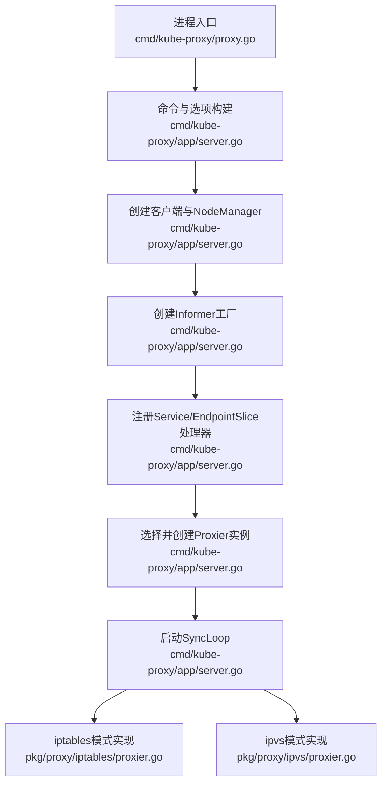
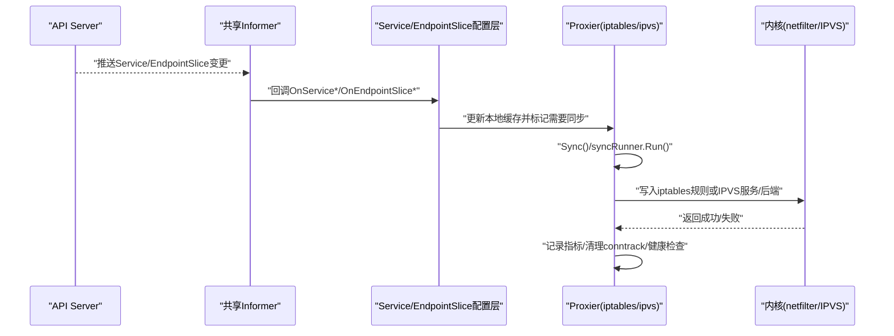
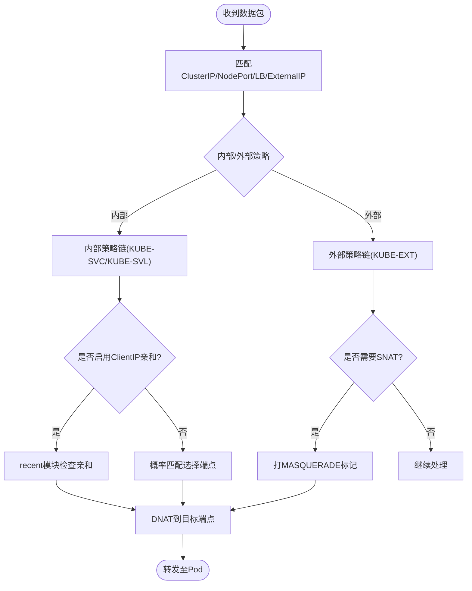
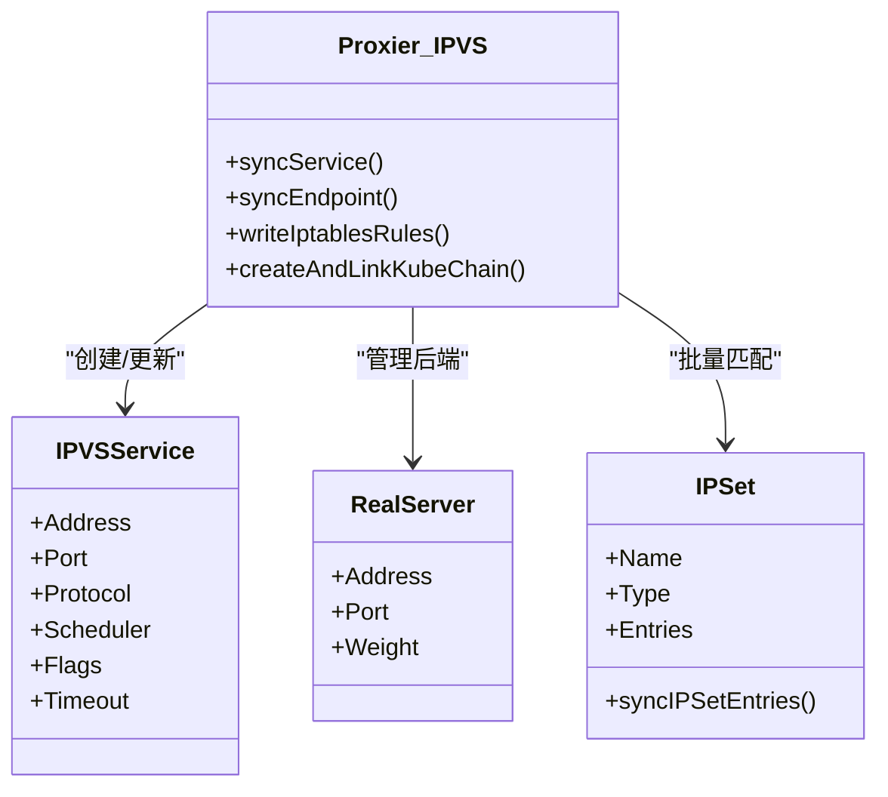
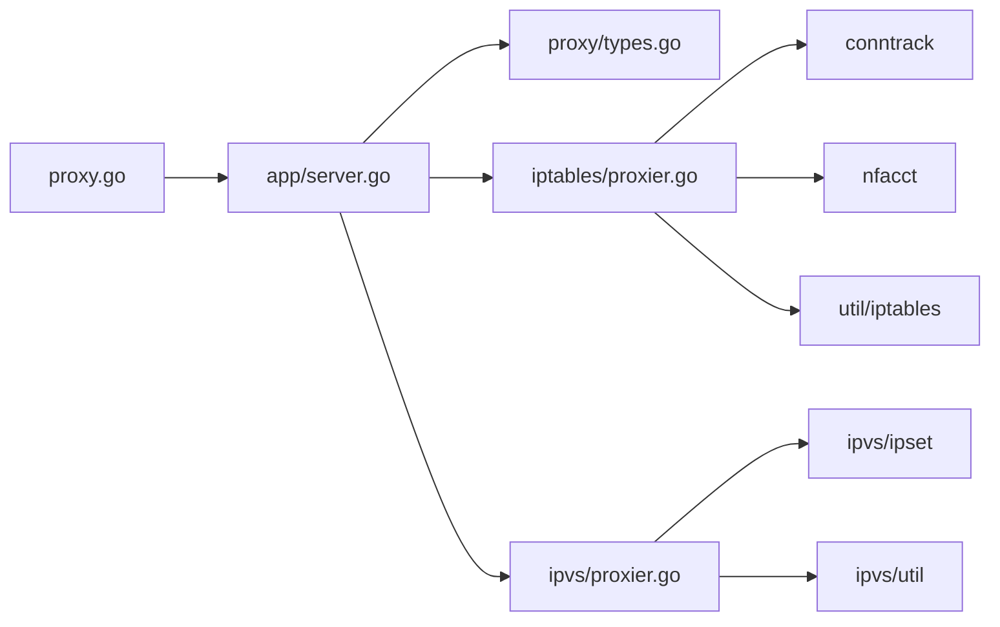

# Kube Proxy机制

<cite>
**本文引用的文件**   
- [cmd/kube-proxy/proxy.go](file://cmd/kube-proxy/proxy.go)
- [cmd/kube-proxy/app/server.go](file://cmd/kube-proxy/app/server.go)
- [pkg/proxy/types.go](file://pkg/proxy/types.go)
- [pkg/proxy/iptables/proxier.go](file://pkg/proxy/iptables/proxier.go)
- [pkg/proxy/ipvs/proxier.go](file://pkg/proxy/ipvs/proxier.go)
</cite>

## 目录
1. [简介](#简介)
2. [项目结构](#项目结构)
3. [核心组件](#核心组件)
4. [架构总览](#架构总览)
5. [详细组件分析](#详细组件分析)
6. [依赖关系分析](#依赖关系分析)
7. [性能考量](#性能考量)
8. [故障诊断指南](#故障诊断指南)
9. [结论](#结论)
10. [附录](#附录)

## 简介
本文件面向Kubernetes节点上的网络代理组件Kube Proxy，系统性阐述其服务发现与负载均衡机制、不同代理模式（iptables、ipvs、userspace）的实现原理与性能特点、从API Server到本地网络规则的完整数据流、负载均衡算法与会话保持、健康检查、连接跟踪、端口转发与流量分发策略，以及IPv6支持、外部流量处理与Windows平台兼容性等高级特性。文档同时提供配置优化建议、基准测试思路与常见问题的排障方法。

## 项目结构
Kube Proxy的入口位于命令行程序，随后初始化并运行ProxyServer，创建Informer监听Service与EndpointSlice等资源变更，根据配置的代理模式选择具体Proxier实现（iptables或ipvs），在SyncLoop中周期性将内存中的服务与端点映射同步为内核态规则（iptables或IPVS）。

图表来源
- [cmd/kube-proxy/proxy.go:29-33](file://cmd/kube-proxy/proxy.go#L29-L33)
- [cmd/kube-proxy/app/server.go:100-160](file://cmd/kube-proxy/app/server.go#L100-L160)
- [cmd/kube-proxy/app/server.go:536-659](file://cmd/kube-proxy/app/server.go#L536-L659)
- [pkg/proxy/iptables/proxier.go:94-124](file://pkg/proxy/iptables/proxier.go#L94-L124)
- [pkg/proxy/ipvs/proxier.go:109-145](file://pkg/proxy/ipvs/proxier.go#L109-L145)

章节来源
- [cmd/kube-proxy/proxy.go:17-33](file://cmd/kube-proxy/proxy.go#L17-L33)
- [cmd/kube-proxy/app/server.go:100-160](file://cmd/kube-proxy/app/server.go#L100-L160)
- [cmd/kube-proxy/app/server.go:536-659](file://cmd/kube-proxy/app/server.go#L536-L659)

## 核心组件
- Provider接口：定义所有代理实现的统一能力，包括对Service、EndpointSlice、节点拓扑与ServiceCIDR的事件处理，以及同步与主循环控制。
- ServicePortName与ServiceEndpoint：用于唯一标识一个服务的端口及与其关联的端点。
- iptables Proxier：基于Linux内核netfilter表（NAT/Filter）生成链与规则，完成DNAT/SNAT、概率分流、会话保持与健康检查。
- ipvs Proxier：基于内核IPVS虚拟服务模型，通过ipset+iptables辅助匹配，调用IPVS API创建/更新虚拟服务与真实服务器，支持多种调度算法与持久化会话。

章节来源
- [pkg/proxy/types.go:27-66](file://pkg/proxy/types.go#L27-L66)
- [pkg/proxy/iptables/proxier.go:126-206](file://pkg/proxy/iptables/proxier.go#L126-L206)
- [pkg/proxy/ipvs/proxier.go:147-236](file://pkg/proxy/ipvs/proxier.go#L147-L236)

## 架构总览
Kube Proxy的整体架构由“事件驱动 + 周期同步”的双通道组成：
- 事件驱动：Informer监听Service与EndpointSlice变化，触发Proxier.Sync()，进入受控频率的syncRunner执行增量或全量同步。
- 周期同步：即使无事件，也会按最小/最大周期进行全量一致性校验，保证内核规则与期望状态一致。

图表来源
- [cmd/kube-proxy/app/server.go:595-659](file://cmd/kube-proxy/app/server.go#L595-L659)
- [pkg/proxy/iptables/proxier.go:412-432](file://pkg/proxy/iptables/proxier.go#L412-L432)
- [pkg/proxy/ipvs/proxier.go:548-566](file://pkg/proxy/ipvs/proxier.go#L548-L566)

## 详细组件分析

### 服务发现与数据流
- 资源监听：分别创建不带过滤的通用Informer与带标签过滤的EndpointSlice/Service Informer，避免监听Headless服务与自身管理的Service。
- 事件处理：Service与EndpointSlice的Add/Update/Delete均会更新本地缓存，并在已初始化后触发Sync。
- 同步策略：使用BoundedFrequencyRunner限制最小/最大同步间隔；大集群模式下减少全量同步频率，优先增量。
- 双栈支持：通过MetaProxier组合IPv4与IPv6单栈Proxier实例，分别维护各自规则集。

章节来源
- [cmd/kube-proxy/app/server.go:595-659](file://cmd/kube-proxy/app/server.go#L595-L659)
- [pkg/proxy/iptables/proxier.go:446-527](file://pkg/proxy/iptables/proxier.go#L446-L527)
- [pkg/proxy/ipvs/proxier.go:580-655](file://pkg/proxy/ipvs/proxier.go#L580-L655)
- [pkg/proxy/iptables/proxier.go:94-124](file://pkg/proxy/iptables/proxier.go#L94-L124)
- [pkg/proxy/ipvs/proxier.go:109-145](file://pkg/proxy/ipvs/proxier.go#L109-L145)

### iptables模式实现原理
- 规则组织：在NAT与Filter表中建立专用链（如KUBE-SERVICES、KUBE-NODEPORTS、KUBE-FORWARD、KUBE-MARK-MASQ等），并通过跳转规则接入PREROUTING/FORWARD/OUTPUT/Postrouting。
- 流量路径：
  - ClusterIP：命中KUBE-SERVICES，按内部/外部策略跳转到对应链，最终DNAT到端点。
  - NodePort：在KUBE-NODEPORTS链匹配端口，再进入外部流量处理逻辑。
  - LoadBalancer/ExternalIP：结合源地址白名单（LoadBalancerSourceRanges）与外部策略，必要时SNAT。
- 负载均衡：采用概率匹配（statistic random）近似轮询；当端点数较多时预计算概率字符串以降低CPU开销。
- 会话保持：基于recent模块维护ClientIP亲和，按粘性时长重定向到同一端点链。
- 健康检查：暴露HealthCheckNodePort，配合healthcheck子模块探测端点就绪。
- 连接跟踪：在FORWARD链放行已建立/相关连接，必要时丢弃INVALID包；UDP场景可清理陈旧条目。
- 大集群优化：超过阈值时关闭部分注释以减小规则体积，降低iptables-save/restore耗时。

图表来源
- [pkg/proxy/iptables/proxier.go:625-713](file://pkg/proxy/iptables/proxier.go#L625-L713)
- [pkg/proxy/iptables/proxier.go:800-1244](file://pkg/proxy/iptables/proxier.go#L800-L1244)
- [pkg/proxy/iptables/proxier.go:1430-1474](file://pkg/proxy/iptables/proxier.go#L1430-L1474)

章节来源
- [pkg/proxy/iptables/proxier.go:126-206](file://pkg/proxy/iptables/proxier.go#L126-L206)
- [pkg/proxy/iptables/proxier.go:625-713](file://pkg/proxy/iptables/proxier.go#L625-L713)
- [pkg/proxy/iptables/proxier.go:800-1244](file://pkg/proxy/iptables/proxier.go#L800-L1244)
- [pkg/proxy/iptables/proxier.go:1430-1474](file://pkg/proxy/iptables/proxier.go#L1430-L1474)

### ipvs模式实现原理
- 虚拟服务：为ClusterIP、ExternalIP、LoadBalancer VIP与NodePort创建IPVS VirtualServer，绑定调度器（默认rr）、持久化标志与超时。
- 真实服务器：根据端点列表添加/删除RealServer，支持仅本地端点策略（externalTrafficPolicy=Local）。
- 匹配加速：大量使用ipset（HashIPPort、BitmapPort等）提升匹配效率，iptables仅做少量跳转与特殊处理（如hairpin、LB源地址过滤）。
- 会话保持：设置Persistent标志与Timeout实现ClientIP亲和。
- 调度算法：支持rr、wrr、lc、dh、sh等多种内核调度器；mh需开启SourceHash。
- 地址绑定：将VIP绑定到dummy设备kube-ipvs0，便于本机访问与hairpin回环。
- 安全与过滤：通过KUBE-IPVS-FILTER与KUBE-IPVS-OUT-FILTER防止直接访问主机端口，必要时阻断来自节点的LB访问。

图表来源
- [pkg/proxy/ipvs/proxier.go:147-236](file://pkg/proxy/ipvs/proxier.go#L147-L236)
- [pkg/proxy/ipvs/proxier.go:658-860](file://pkg/proxy/ipvs/proxier.go#L658-L860)
- [pkg/proxy/ipvs/proxier.go:1256-1489](file://pkg/proxy/ipvs/proxier.go#L1256-L1489)

章节来源
- [pkg/proxy/ipvs/proxier.go:109-145](file://pkg/proxy/ipvs/proxier.go#L109-L145)
- [pkg/proxy/ipvs/proxier.go:658-860](file://pkg/proxy/ipvs/proxier.go#L658-L860)
- [pkg/proxy/ipvs/proxier.go:1256-1489](file://pkg/proxy/ipvs/proxier.go#L1256-L1489)

### userspace模式说明
仓库中未包含userspace模式的实现代码。该模式历史上存在，但当前主流部署推荐使用iptables或ipvs模式以获得更好的性能与稳定性。如需了解历史行为，请参考早期版本文档与变更记录。

[本节不直接分析具体源码文件]

### 负载均衡算法与会话保持
- iptables：基于概率匹配近似轮询；ClientIP亲和通过recent模块实现，按粘性时长重定向。
- ipvs：内核级调度器（rr/wrr/lc/dh/sh/mh等）；持久化会话通过Persistent标志与Timeout实现。

章节来源
- [pkg/proxy/iptables/proxier.go:1430-1474](file://pkg/proxy/iptables/proxier.go#L1430-L1474)
- [pkg/proxy/ipvs/proxier.go:829-844](file://pkg/proxy/ipvs/proxier.go#L829-L844)

### 健康检查机制
- HealthCheckNodePort：为每个服务分配健康检查端口，允许外部探针访问。
- 健康检查服务：在iptables/ipvs模式中均集成healthcheck子模块，定期探测本地就绪端点并上报状态。

章节来源
- [pkg/proxy/iptables/proxier.go:1047-1058](file://pkg/proxy/iptables/proxier.go#L1047-L1058)
- [pkg/proxy/ipvs/proxier.go:1147-1161](file://pkg/proxy/ipvs/proxier.go#L1147-L1161)
- [cmd/kube-proxy/app/server.go:254-256](file://cmd/kube-proxy/app/server.go#L254-L256)

### 连接跟踪与端口转发
- iptables：在FORWARD链放行ESTABLISHED/RELATED；必要时丢弃INVALID；UDP场景清理陈旧条目。
- ipvs：依赖内核IPVS连接跟踪，必要时调整sysctl参数（如conntrack、expire_nodest_conn等）。
- 端口转发：ClusterIP/NodePort/LB/ExternalIP均通过NAT/DNAT或IPVS虚拟服务完成转发。

章节来源
- [pkg/proxy/iptables/proxier.go:1316-1355](file://pkg/proxy/iptables/proxier.go#L1316-L1355)
- [pkg/proxy/ipvs/proxier.go:258-305](file://pkg/proxy/ipvs/proxier.go#L258-L305)

### IPv6支持与双栈
- 双栈：通过MetaProxier组合IPv4与IPv6单栈Proxier，分别维护规则集。
- 检测与校验：启动时检测节点IP族与平台能力，确保Primary IP Family可用；对错误配置给出警告或致命错误。

章节来源
- [cmd/kube-proxy/app/server.go:268-285](file://cmd/kube-proxy/app/server.go#L268-L285)
- [pkg/proxy/iptables/proxier.go:94-124](file://pkg/proxy/iptables/proxier.go#L94-L124)
- [pkg/proxy/ipvs/proxier.go:109-145](file://pkg/proxy/ipvs/proxier.go#L109-L145)

### 外部流量处理
- externalTrafficPolicy=Local：仅在本地端点可用时接受外部流量，否则DROP/REJECT；必要时保留源IP。
- LoadBalancerSourceRanges：基于源地址白名单过滤LB流量；若节点不在白名单内，可能阻断来自节点的访问。

章节来源
- [pkg/proxy/iptables/proxier.go:886-997](file://pkg/proxy/iptables/proxier.go#L886-L997)
- [pkg/proxy/ipvs/proxier.go:916-994](file://pkg/proxy/ipvs/proxier.go#L916-L994)

### Windows平台兼容性
- Windows平台使用独立的Winkernel实现（非iptables/ipvs），通过HCN/HNS进行网络规则管理。
- 启动流程与配置项与Linux类似，但底层网络栈与规则类型不同。

章节来源
- [cmd/kube-proxy/app/server_windows.go](file://cmd/kube-proxy/app/server_windows.go)
- [pkg/proxy/winkernel/proxier.go](file://pkg/proxy/winkernel/proxier.go)

## 依赖关系分析
- 进程入口与命令：main函数创建命令对象并运行。
- 应用层：ProxyServer负责客户端、Informer、健康检查、指标、平台初始化与Proxier创建。
- 代理实现：iptables与ipvs两种Proxier实现Provider接口，分别对接内核子系统。
- 工具库：conntrack、nfacct、ipset、utiliptables、metaproxier等。

图表来源
- [cmd/kube-proxy/proxy.go:29-33](file://cmd/kube-proxy/proxy.go#L29-L33)
- [cmd/kube-proxy/app/server.go:162-293](file://cmd/kube-proxy/app/server.go#L162-L293)
- [pkg/proxy/types.go:27-66](file://pkg/proxy/types.go#L27-L66)
- [pkg/proxy/iptables/proxier.go:209-311](file://pkg/proxy/iptables/proxier.go#L209-L311)
- [pkg/proxy/ipvs/proxier.go:241-391](file://pkg/proxy/ipvs/proxier.go#L241-L391)

章节来源
- [cmd/kube-proxy/proxy.go:17-33](file://cmd/kube-proxy/proxy.go#L17-L33)
- [cmd/kube-proxy/app/server.go:162-293](file://cmd/kube-proxy/app/server.go#L162-L293)
- [pkg/proxy/types.go:27-66](file://pkg/proxy/types.go#L27-L66)

## 性能考量
- iptables模式
  - 大集群优化：端点数量超过阈值时关闭注释以减少规则体积；降低全量同步频率。
  - 概率预计算：预计算1/n概率字符串，避免频繁浮点转字符串。
  - 规则批量恢复：使用iptables-restore一次性提交，减少系统调用次数。
- ipvs模式
  - 内核级转发：相比用户态或纯iptables方案，转发路径更短，吞吐更高。
  - ipset批量匹配：大幅降低规则数量与匹配成本。
  - sysctl调优：合理设置conntrack、expire_nodest_conn、arp_ignore/announce等参数。
- 通用建议
  - 合理设置MinSyncPeriod与SyncPeriod，平衡实时性与CPU占用。
  - 监控指标：关注NetworkProgrammingLatency、SyncProxyRulesLatency、IPTablesRestoreFailuresTotal等。
  - 连接跟踪：避免过多INVALID包；必要时清理陈旧UDP条目。

[本节提供一般性指导，不直接分析具体源码文件]

## 故障诊断指南
- 常见问题
  - iptables-restore失败：检查解析错误行与上下文，确认规则语法与权限。
  - 规则未生效：确认Informer已同步且Proxier已初始化；查看日志中的“Not syncing until Services and Endpoints have been received”。
  - LB访问被阻断：检查LoadBalancerSourceRanges与节点IP关系；必要时允许节点访问或调整策略。
  - NodePort不可用：确认nodePortAddresses与localhostNodePorts配置；IPv6下localhost NodePort不支持。
- 排查步骤
  - 查看metrics与healthz输出，确认服务与端点健康状态。
  - 对比期望与实际规则：iptables-save/ipvsadm比较差异。
  - 检查conntrack与内核参数：nf_conntrack_tcp_be_liberal、vs相关sysctl。
  - 观察大集群模式下的全量同步频率与规则数量。

章节来源
- [pkg/proxy/iptables/proxier.go:1383-1394](file://pkg/proxy/iptables/proxier.go#L1383-L1394)
- [pkg/proxy/ipvs/proxier.go:1188-1198](file://pkg/proxy/ipvs/proxier.go#L1188-L1198)
- [cmd/kube-proxy/app/server.go:296-385](file://cmd/kube-proxy/app/server.go#L296-L385)

## 结论
Kube Proxy通过事件驱动的Informer与周期同步机制，将Service与EndpointSlice的变化高效地转化为内核态规则。iptables模式具备广泛兼容性与细粒度控制，适合中小规模集群；ipvs模式在内核层面实现高性能转发与丰富调度算法，适合大规模与高吞吐场景。正确配置会话保持、健康检查、外部流量策略与IPv6双栈，并结合指标与日志进行持续监控与调优，是保障集群网络稳定性的关键。

[本节为总结性内容，不直接分析具体源码文件]

## 附录
- 配置项参考
  - SyncPeriod/MinSyncPeriod：控制同步频率与最小间隔。
  - NodePortAddresses/localhostNodePorts：控制NodePort监听范围与localhost访问。
  - LoadBalancerSourceRanges：限制LB访问源地址。
  - IPVS.Scheduler/StrictARP/Timeouts：配置调度器与内核参数。
- 基准测试建议
  - 使用标准压测工具（如wrk、iperf）在不同端点规模下对比iptables与ipvs吞吐与时延。
  - 关注规则数量增长对iptables模式的影响；评估ipvs模式在高并发下的稳定性。
- 最佳实践
  - 优先选择ipvs模式以提升性能；在无法使用IPVS时使用iptables模式。
  - 合理设置亲和与策略，避免不必要的SNAT与跨节点回环。
  - 定期审查健康检查与连接跟踪配置，确保异常流量不影响转发性能。

[本节提供一般性指导，不直接分析具体源码文件]